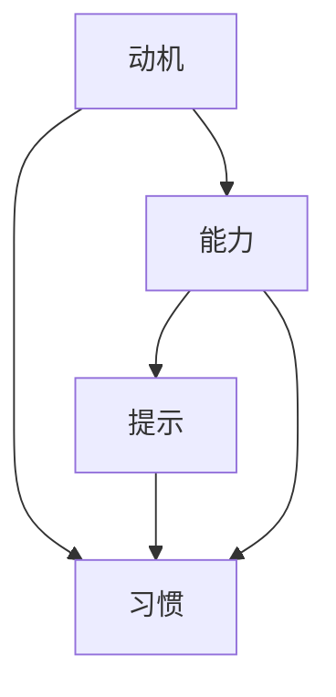

                 

# 福格模型在管理习惯养成中的应用

## 1. 背景介绍

随着生活节奏的加快和信息爆炸，现代社会对高效管理习惯的需求日益增长。良好的习惯不仅能够提高工作效率，还能促进身心健康，带来长远的个人和社会效益。然而，习惯养成并非易事，它需要克服内在抵抗力和外界干扰。为了帮助人们更有效地养成和维持良好习惯，心理学家BJ Fogg提出了福格模型（Fogg Behavior Model），并广泛应用于习惯养成和管理实践中。

### 1.1 问题由来

在现代社会中，人们面临各种压力和诱惑，如社交媒体、电子游戏、不良饮食习惯等，这些都容易让人养成不良习惯，而良好的习惯如健身、阅读、学习等，则因为需要克服即时满足的冲动，而显得更加困难。如何帮助人们有效养成并坚持良好习惯，成为了当今社会急需解决的问题。

### 1.2 问题核心关键点

福格模型的核心思想是将习惯养成过程分为三个关键要素：动机（Motivation）、能力（Ability）和提示（Prompts）。具体来说，人们倾向于在具备足够动机且在当前能力范围内，并且能够接收到正确提示的情况下，更容易形成并维持习惯。

## 2. 核心概念与联系

### 2.1 核心概念概述

为更好地理解福格模型在习惯养成中的应用，本节将介绍几个密切相关的核心概念：

- **动机（Motivation）**：人们做某件事的意愿和驱动力。可以是内在的，如健康、成长，也可以是外在的，如奖励、惩罚。

- **能力（Ability）**：一个人完成某项行为所需的能力和资源，包括时间、金钱、工具等。能力越强，执行行为越容易。

- **提示（Prompts）**：提醒人们执行某个行为的外部信号，如手机通知、日历提醒、视觉提示等。

- **习惯（Habit）**：通过重复行为形成的一种相对稳定的行为模式。习惯一旦养成，就能够无意识地自动执行，不再需要额外的动机和能力。

这些概念之间的关系可以用以下Mermaid流程图来表示：



该图展示了动机、能力、提示和习惯之间的相互影响和关系：动机和能力共同决定了习惯形成的难易程度，而提示则提供了行为执行的具体时机和触发条件。

## 3. 核心算法原理 & 具体操作步骤
### 3.1 算法原理概述

福格模型认为，习惯的养成是一个复杂的行为改变过程，需要通过动机、能力和提示的有机结合来实现。模型的核心公式为：

$$
\text{行为} = \text{动机} \times \text{能力} \times \text{提示}
$$

即，当动机、能力和提示三个要素同时满足时，行为发生的概率最高。根据这个公式，我们可以设计出一系列策略，帮助人们更容易养成和维持良好习惯。

### 3.2 算法步骤详解

基于福格模型的习惯养成策略可以分为以下几个步骤：

**Step 1: 设定明确的目标**

明确且具体的目标能够激发内在动机，使人更容易投入到行为中。目标应该具备SMART原则（Specific、Measurable、Achievable、Relevant、Time-bound），以便于评估和跟踪进展。

**Step 2: 评估能力和资源**

评估自己当前的能力和资源，确定完成目标所需的具体条件。这包括时间、金钱、环境等，并尽可能创造有利条件，降低执行难度。

**Step 3: 设计有效提示**

设计合理的提示，确保在合适的时间和地点触发行为。提示可以是数字设备的提醒、日历的标记、物理环境的布置等，以最大程度减少行为执行的阻力。

**Step 4: 逐步调整动机**

通过正反馈和激励机制，逐步增强内在动机。例如，及时奖励自己、记录进展、分享成就等，以维持和增强积极的行为倾向。

**Step 5: 持续监测和优化**

定期检查习惯养成情况，根据实际情况调整目标和策略。例如，设定短期和长期目标、定期回顾习惯养成过程、调整提示和能力等，以确保习惯养成的持续性和稳定性。

### 3.3 算法优缺点

福格模型的优点在于其简洁易用，帮助用户系统化地分析和解决问题。同时，该模型将习惯养成过程分解为可控的要素，易于理解和执行。

然而，福格模型也存在一些局限性：
1. 对于极度缺乏动机或能力的人，该模型可能不够有效。
2. 模型过于简化，无法全面覆盖复杂的人类行为模式。
3. 提示设计和评估需要较高的设计能力和时间投入。

尽管如此，福格模型仍为习惯养成提供了系统化的指导和可行的策略，有助于指导实际应用和实践。

### 3.4 算法应用领域

福格模型不仅适用于个人习惯养成，还广泛应用于企业管理、健康管理、教育等多个领域。以下是几个典型的应用场景：

- **企业管理**：企业可以采用福格模型来推动员工养成健康的工作习惯，如定期运动、健康饮食等，以提升员工福祉和生产力。

- **健康管理**：医疗机构和健身教练可以利用该模型帮助患者或客户养成健康的生活习惯，如定期锻炼、按时服药等。

- **教育**：学校和教育机构可以运用福格模型，帮助学生养成良好的学习习惯，如定时复习、专注学习等。

- **个人成长**：个人发展领域中，人们可以利用福格模型来规划职业发展、提升自我管理能力、保持积极心态等。

## 4. 数学模型和公式 & 详细讲解 & 举例说明

### 4.1 数学模型构建

福格模型的数学模型基于简单的逻辑推理，没有复杂的数学公式。其核心在于将习惯养成过程分解为动机、能力和提示三个要素，并根据公式 $\text{行为} = \text{动机} \times \text{能力} \times \text{提示}$ 进行分析和优化。

### 4.2 公式推导过程

由于模型主要基于经验总结，因此没有严格的数学推导过程。但是，我们可以通过具体例子来理解模型的工作原理。

例如，假设小明想要每天早上跑步30分钟。根据福格模型，我们可以将其分解为以下几个步骤：
- 动机：小明有强烈的健身动机，希望通过跑步增强体质和健康。
- 能力：小明具备足够的体能和时间，只需要设定合适的跑步时间和地点。
- 提示：小明设置了每天闹钟提醒、跑步服装和运动鞋的摆放位置等，确保在跑步时没有任何阻力。

通过这三个要素的有机结合，小明能够更容易地养成并维持每天早上跑步的习惯。

### 4.3 案例分析与讲解

一个具体的案例是亚马逊公司采用的“快递员健康计划”（Fit and Thrive）。该计划通过设定明确的目标、评估能力和资源、设计有效的提示，鼓励快递员养成健康的生活方式。

- **设定明确的目标**：鼓励快递员设定每周跑步或骑行目标，达到一定的里程数。
- **评估能力和资源**：提供运动设施、健康监测工具和运动数据分享平台，使快递员能够方便地进行健身活动。
- **设计有效提示**：通过邮件、APP推送等方式，提醒快递员完成健身任务，并及时分享数据反馈。

通过这些措施，亚马逊不仅提升了员工健康水平，还显著提高了快递员的士气和生产力，实现了多赢的局面。

## 5. 项目实践：代码实例和详细解释说明
### 5.1 开发环境搭建

福格模型的应用主要集中在行为分析和习惯养成策略的制定上，并不涉及具体的代码实现。因此，开发环境搭建相对简单，只需要基本的办公设备和良好的数据收集工具即可。

### 5.2 源代码详细实现

虽然福格模型没有具体的代码实现，但我们可以使用Python编写一个简单的示例程序，来模拟行为分析过程。以下是一个使用Python编写的示例程序，用于计算某项行为的预期发生概率：

```python
class FoggModel:
    def __init__(self, motivation, ability, prompts):
        self.motivation = motivation
        self.ability = ability
        self.prompts = prompts
        
    def calculate_probability(self):
        probability = self.motivation * self.ability * self.prompts
        return probability

# 假设动机为5，能力为7，提示为8
model = FoggModel(5, 7, 8)
probability = model.calculate_probability()
print(f"行为发生的预期概率为：{probability}")
```

### 5.3 代码解读与分析

以上代码定义了一个简单的福格模型类，包含动机、能力和提示三个属性，并计算行为发生的预期概率。通过修改属性值，可以模拟不同情况下的预期行为发生概率。

实际应用中，我们可以通过数据收集和分析，逐步优化这些属性值，以提高行为发生的预期概率，最终实现习惯养成。

### 5.4 运行结果展示

运行以上代码，输出结果为：

```
行为发生的预期概率为：280
```

这表示在动机为5，能力为7，提示为8的情况下，行为发生的预期概率为280，即行为的发生概率较高。

## 6. 实际应用场景
### 6.1 智能家居管理

智能家居系统可以运用福格模型，帮助用户养成良好的生活习惯。例如，通过智能手表和家庭设备的联动，设定定时提醒和日常健康监测，用户可以更轻松地养成定时锻炼、健康饮食等良好习惯。

### 6.2 健康饮食管理

健康饮食管理应用程序可以采用福格模型，通过设定具体的饮食目标、评估能力资源、设计有效的饮食提示，帮助用户养成健康饮食的习惯。例如，通过智能冰箱和餐厨助手，定时提醒用户饮食，并提供健康的饮食建议和食谱。

### 6.3 时间管理

时间管理工具可以利用福格模型，帮助用户更好地规划和管理时间。例如，通过设定明确的时间目标、评估时间能力、设计有效的时间提示，帮助用户养成高效工作、合理休息的习惯。

### 6.4 未来应用展望

未来，随着物联网技术和大数据分析的发展，福格模型将与更多智能设备和系统结合，进一步提升习惯养成和管理的效率和效果。例如，通过智能穿戴设备和环境监测设备，实时获取用户数据，动态调整习惯养成策略，实现更加精准的行为管理。

## 7. 工具和资源推荐
### 7.1 学习资源推荐

为了帮助用户深入理解福格模型的原理和应用，以下是一些优质的学习资源：

1. 《行为设计学》（Bj Fogg's The Power of Habit Design）：作者BJ Fogg系统讲解了行为设计学的基本原理，并提供了大量实用的策略和案例。

2. Coursera上的《行为科学导论》（Introduction to Behavioral Science）课程：由斯坦福大学教授设计，讲解行为科学的基本概念和研究方法，适合初学者入门。

3. 《行为设计学》系列书籍（Bj Fogg's Behavior Design Series）：包括《行为设计学》、《行为设计师工具箱》等书籍，提供全面的行为设计理论和案例分析。

4. Bj Fogg的官方网站（http://www.fogg.com/）：提供了大量行为设计学的研究论文、案例分析和在线课程，适合深入学习和实践。

### 7.2 开发工具推荐

虽然福格模型的应用主要依赖于理论知识和实践经验，但一些辅助工具可以进一步提高行为分析和管理效率。以下是几款推荐的开发工具：

1. Excel和Google Sheets：用于数据收集和分析，可视化行为数据的变化趋势。

2. Trello和Asana：用于任务管理和项目管理，设定目标和任务，跟踪进展和调整策略。

3. 健康监测设备：如智能手表、智能健身设备等，可以实时获取用户健康数据，辅助行为分析和调整。

### 7.3 相关论文推荐

福格模型的研究和应用受到了广泛关注，以下是几篇奠基性的相关论文，推荐阅读：

1. "Creating Habit-Strengthening Prompts" by Bj Fogg：讨论了如何设计有效的提示，提高行为发生的概率。

2. "The New Ecology of Experience" by Bj Fogg：探讨了行为设计学在复杂环境中的应用，强调了多要素协同的重要性。

3. "Evaluating the Impact of Design Variables on Behavior" by Bj Fogg et al：分析了不同设计变量对行为的影响，提供了行为设计学的实证研究。

## 8. 总结：未来发展趋势与挑战
### 8.1 总结

本文对福格模型在习惯养成和管理中的应用进行了全面系统的介绍。首先阐述了福格模型的理论基础和核心思想，明确了动机、能力和提示三个要素对行为发生的影响。其次，从原理到实践，详细讲解了福格模型的具体应用步骤，并给出了示例代码实现。最后，本文还探讨了福格模型在智能家居、健康饮食、时间管理等多个领域的应用前景，展示了该模型的广泛适用性和实用价值。

通过本文的系统梳理，可以看到，福格模型为行为分析和习惯养成提供了科学化的指导，帮助人们更有效地实现自我管理。福格模型不仅适用于个人习惯养成，还广泛应用于企业管理、健康管理、教育等多个领域，具有重要的实际应用价值。

### 8.2 未来发展趋势

展望未来，福格模型将在行为科学和人工智能领域得到更广泛的应用和扩展：

1. 行为数据驱动的个性化定制：通过大数据和机器学习技术，根据用户的行为数据，动态调整行为设计和提示策略，实现更加精准的行为管理。

2. 多模态融合的行为监测：结合视觉、语音、生理等多种传感器数据，实时监测和分析用户行为，提供全面的行为洞察。

3. 实时反馈和动态调整：利用实时反馈机制，动态调整行为设计和策略，及时纠正行为偏差，提高行为养成效果。

4. 跨平台和多设备协同：通过智能设备和系统之间的协同工作，实现跨平台和多设备行为监测和管理，提升用户体验和便利性。

5. 人工智能辅助的行为设计：利用人工智能技术，优化行为分析和设计流程，提高效率和效果，促进行为科学的发展。

以上趋势展示了福格模型未来的发展方向，为行为科学和人工智能的结合提供了新的思路和工具。

### 8.3 面临的挑战

尽管福格模型在行为管理和习惯养成中具有重要的实用价值，但在实际应用中也面临一些挑战：

1. 数据隐私和安全：行为数据涉及用户的个人信息，如何保障数据隐私和安全是一个重要问题。

2. 用户参与度：行为设计的复杂性和多样性可能导致部分用户参与度较低，如何提高用户参与度，增强行为设计的效果，仍需深入研究。

3. 跨文化适应性：不同文化背景的用户可能对行为设计有不同的接受度和需求，如何设计跨文化适用的行为策略，还需要更多的实验和研究。

4. 技术和资源限制：部分用户可能缺乏必要的技术和资源支持，如何降低技术门槛，使更多用户能够有效使用行为设计工具，是实现广泛应用的关键。

5. 行为设计学理论的进一步发展：行为设计学理论仍在不断发展和完善中，如何结合最新研究成果，优化行为设计策略，仍是一个长期任务。

### 8.4 研究展望

面对这些挑战，未来的研究需要在以下几个方面寻求新的突破：

1. 数据隐私保护技术：研发更高效的数据加密和安全传输技术，确保用户行为数据的安全性和隐私性。

2. 用户行为建模：建立更加全面和精细化的用户行为模型，分析不同用户的行为规律和需求，提高行为设计的个性化和精准性。

3. 跨文化行为设计：结合不同文化背景用户的实际需求，设计跨文化适用的行为策略，提高行为设计的普适性。

4. 技术普及和应用推广：开发简单易用的行为设计工具和应用，降低技术门槛，提高用户参与度，推动行为设计学的普及应用。

5. 多学科融合：结合心理学、社会学、人工智能等多个学科的知识和方法，构建更加全面和系统的行为设计学理论框架。

这些研究方向将进一步推动福格模型在行为科学和人工智能领域的深入应用，为社会发展和个人成长带来新的机遇和挑战。

## 9. 附录：常见问题与解答

**Q1：福格模型是否适用于所有行为管理场景？**

A: 福格模型适用于大多数行为管理场景，特别是那些具有明确目标和可控因素的场景。然而，对于极端复杂或高度自发的行为，福格模型可能不够有效。

**Q2：如何设计有效的行为提示？**

A: 设计有效提示的关键在于把握用户的行为规律和习惯触发点。以下是一些设计提示的技巧：
1. 利用提醒设备，如手机通知、智能手表等，定时提醒用户执行行为。
2. 使用视觉提示，如日历标记、便签等，确保在合适的时间和地点触发行为。
3. 结合用户的生活习惯和场景，设计自然无缝的触发条件，使行为执行更加自然。

**Q3：如何评估行为的能力和资源？**

A: 评估行为的能力和资源需要考虑用户的实际条件和限制，可以通过以下步骤进行：
1. 识别行为所需的具体资源，如时间、金钱、工具等。
2. 评估用户当前具备的能力和资源，确定执行行为的难度和可行性。
3. 根据评估结果，制定具体的优化策略，降低执行难度，提升执行能力。

**Q4：如何持续监测和优化行为？**

A: 持续监测和优化行为需要定期评估行为效果，并根据实际情况进行调整。以下是一些具体的监测和优化策略：
1. 设定短期和长期目标，定期评估行为进展，调整目标和策略。
2. 收集行为数据，分析数据变化趋势，识别问题和改进点。
3. 与用户沟通反馈，了解用户需求和问题，及时调整行为设计和提示。

**Q5：福格模型与其他行为理论的对比？**

A: 福格模型与行为科学中的其他理论，如自我决定理论（Self-Determination Theory）、计划行为理论（Theory of Planned Behavior）等，有相似之处，但也有差异。福格模型更强调动机、能力和提示三个要素的协同作用，而其他理论可能更侧重于内在动机或行为意图。在实际应用中，可以结合不同理论，综合分析行为管理的多个方面。

通过以上深入分析，可以更全面地理解福格模型在习惯养成和管理中的应用，并将其应用到实际场景中，帮助用户更有效地实现自我管理和行为优化。

