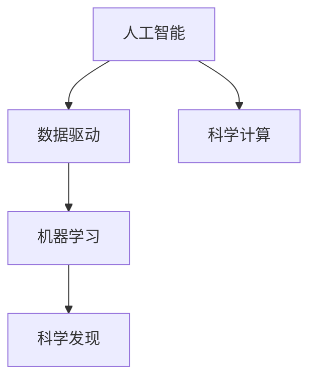

                 

## 1. 背景介绍

人工智能（AI）正在以其前所未有的速度改变着我们生活的方方面面。从简单的聊天机器人到复杂的自然语言处理（NLP）系统，再到高级的机器学习和深度学习模型，AI技术在不断进步的同时，也带来了前所未有的机遇和挑战。本文将探讨AI在科学与发现领域的加速作用，以及这种加速是如何通过科学技术的结合得以实现的。

## 2. 核心概念与联系

### 2.1 核心概念概述

为了更好地理解科学和AI的结合，我们需要先了解几个核心概念：

- **人工智能（AI）**：利用计算机科学和数学模型来模拟人类智能的技术。它包括机器学习、深度学习、自然语言处理、计算机视觉等多个领域。

- **科学发现**：通过对自然现象的观察和实验，揭示自然规律并提出新理论的过程。科学发现是人类文明进步的重要动力。

- **数据驱动**：利用大量数据来指导模型训练和优化，提升模型的性能。数据驱动的方法在大数据时代成为主流。

- **科学计算**：使用高性能计算机和算法来处理大规模科学问题，包括数据分析、模拟实验、优化计算等。

- **机器学习**：一种使计算机从数据中学习并作出预测或决策的技术。机器学习在科学发现中的应用越来越广泛。

这些概念之间的联系可以通过以下Mermaid流程图来展示：



这个流程图展示了AI技术通过数据驱动和科学计算，与科学发现紧密相连，形成了从数据到模型，再到发现的全流程。

## 3. 核心算法原理 & 具体操作步骤

### 3.1 算法原理概述

在科学发现中，AI可以通过以下几种方式来加速研究：

- **数据挖掘**：利用机器学习算法从海量数据中提取有用信息，帮助科学家发现新的模式和关系。

- **模拟实验**：使用深度学习模型来模拟实验过程，预测实验结果，优化实验设计。

- **知识发现**：利用AI算法从文献、数据库中挖掘知识，辅助科学家进行文献综述和研究。

- **自动化推理**：使用逻辑推理和自然语言处理技术，自动化处理科学文献中的推理和逻辑关系。

### 3.2 算法步骤详解

以机器学习在科学发现中的应用为例，详细说明其操作步骤：

1. **数据收集**：收集与研究问题相关的实验数据和文献数据。
2. **数据预处理**：清洗和转换数据，使其适合机器学习模型的输入。
3. **模型选择**：根据研究问题的特点选择合适的机器学习模型。
4. **模型训练**：使用已有的实验数据和文献数据对模型进行训练。
5. **结果验证**：在新的实验数据上验证模型的性能。
6. **知识提取**：从训练好的模型中提取有用的知识，辅助科学研究。

### 3.3 算法优缺点

**优点**：
- **高效性**：AI可以快速处理大量数据，发现复杂模式。
- **自动化**：AI可以自动化处理科学文献和数据，提高效率。
- **跨领域应用**：AI可以应用于多个科学领域，如生物信息学、天文学、物理学等。

**缺点**：
- **数据依赖性**：AI的效果依赖于数据的质量和数量，高质量的数据获取成本较高。
- **模型复杂性**：复杂的模型可能需要大量计算资源，训练时间长。
- **解释性问题**：一些AI模型的决策过程难以解释，不利于科学研究的理解和验证。

### 3.4 算法应用领域

AI在科学发现中的应用已经涉及多个领域，包括但不限于：

- **生物医学**：利用AI进行基因组分析、药物发现、疾病预测等。
- **天文学**：使用AI处理天文图像、发现新星系、预测天体行为等。
- **物理学**：使用AI进行粒子物理模拟、量子计算优化等。
- **环境科学**：使用AI分析气候数据、预测自然灾害、优化环境保护策略等。
- **社会科学**：利用AI进行社会行为分析、经济预测、公共政策制定等。

## 4. 数学模型和公式 & 详细讲解 & 举例说明

### 4.1 数学模型构建

以机器学习在基因组分析中的应用为例，构建一个简单的数学模型：

设有一个基因组数据集 $D=\{(\mathbf{x}_i, y_i)\}_{i=1}^N$，其中 $\mathbf{x}_i$ 是基因组数据，$y_i$ 是相应的生物学标记。模型的目标是找到一个函数 $f$，使得 $f(\mathbf{x}_i) \approx y_i$。

### 4.2 公式推导过程

使用线性回归模型，可以表示为：

$$
y_i = w_0 + w_1 x_{i1} + w_2 x_{i2} + \ldots + w_p x_{ip} + \epsilon_i
$$

其中 $w_0, w_1, \ldots, w_p$ 是模型的参数，$\epsilon_i$ 是误差项。

通过对数据进行最小二乘法求解，可以求得最优参数：

$$
w = (X^T X)^{-1} X^T Y
$$

其中 $X=\begin{bmatrix} 1 & x_{11} & x_{12} & \ldots & x_{1p} \\ 1 & x_{21} & x_{22} & \ldots & x_{2p} \\ \vdots \\ 1 & x_{N1} & x_{N2} & \ldots & x_{Np} \end{bmatrix}$，$Y=\begin{bmatrix} y_1 \\ y_2 \\ \vdots \\ y_N \end{bmatrix}$。

### 4.3 案例分析与讲解

以一个具体的基因组数据集为例，通过机器学习模型预测某个基因是否与某种疾病有关。

假设有一个基因组数据集，其中包含多个基因的表达数据和相应的疾病标记。使用线性回归模型，可以对每个基因的表达数据进行建模，预测其与疾病的关系。

## 5. 项目实践：代码实例和详细解释说明

### 5.1 开发环境搭建

为了进行机器学习在科学发现中的应用，需要搭建一个Python开发环境。以下是详细的步骤：

1. **安装Python和Anaconda**：从官网下载Python和Anaconda，并进行安装。
2. **创建虚拟环境**：使用Anaconda创建一个虚拟环境，以隔离开发环境。
3. **安装必要的库**：安装Scikit-Learn、Numpy、Pandas等必要的Python库。

### 5.2 源代码详细实现

以下是一个简单的机器学习模型训练和预测的Python代码示例：

```python
import pandas as pd
from sklearn.linear_model import LinearRegression

# 加载数据
data = pd.read_csv('gene_expression.csv')

# 划分训练集和测试集
train_data = data.sample(frac=0.8, random_state=42)
test_data = data.drop(train_data.index)

# 训练模型
X_train = train_data.drop(['disease'], axis=1)
y_train = train_data['disease']
model = LinearRegression()
model.fit(X_train, y_train)

# 预测
X_test = test_data.drop(['disease'], axis=1)
y_pred = model.predict(X_test)

# 评估
from sklearn.metrics import accuracy_score
accuracy = accuracy_score(y_test, y_pred)
print('Accuracy:', accuracy)
```

### 5.3 代码解读与分析

上述代码演示了如何使用线性回归模型对基因表达数据进行建模和预测。关键步骤如下：

- **数据加载**：使用Pandas库加载基因表达数据。
- **数据划分**：将数据划分为训练集和测试集。
- **模型训练**：使用Scikit-Learn库中的LinearRegression模型对训练集进行建模。
- **模型预测**：使用训练好的模型对测试集进行预测。
- **评估**：使用准确率评估模型性能。

## 6. 实际应用场景

### 6.1 生物医学研究

在生物医学研究中，AI技术被广泛应用于基因组分析、药物发现、疾病预测等。例如，利用AI对基因组数据进行分析，可以发现新的基因与疾病之间的关联，辅助科学家进行药物开发和疾病治疗。

### 6.2 天文学研究

天文学研究中，AI被用于处理大量的天文图像数据，发现新星系、预测天体行为等。例如，利用AI对天文图像进行深度学习，可以自动检测和分析恒星和星系，加速天文学研究的进程。

### 6.3 物理学研究

物理学研究中，AI被用于粒子物理模拟、量子计算优化等。例如，利用AI对粒子碰撞数据进行分析，可以预测粒子的行为，加速物理学研究的进程。

### 6.4 未来应用展望

未来，AI在科学发现中的应用将会更加广泛和深入。以下是对未来应用的一些展望：

- **跨学科融合**：AI与其他学科的融合将带来新的研究范式，如AI与化学结合的分子模拟、AI与地质学结合的地质数据分析等。
- **智能实验设计**：利用AI优化实验设计，提高实验效率和成功率。
- **知识图谱**：利用AI构建知识图谱，辅助科学家进行文献综述和研究。
- **自动化推理**：利用AI自动化处理科学文献中的推理和逻辑关系，提高科学研究的效率和准确性。

## 7. 工具和资源推荐

### 7.1 学习资源推荐

为了深入学习AI在科学发现中的应用，以下是一些推荐的学习资源：

1. **《机器学习》（周志华著）**：全面介绍了机器学习的基础理论和应用实例。
2. **Coursera的《机器学习》课程**：由斯坦福大学Andrew Ng教授讲授，深入浅出地介绍了机器学习的基本概念和算法。
3. **《深度学习》（Ian Goodfellow等著）**：全面介绍了深度学习的基础理论和应用实例。
4. **Deep Learning Specialization**：由Andrew Ng教授讲授，涵盖了深度学习的各个方面，包括卷积神经网络、循环神经网络等。
5. **Kaggle**：提供大量的数据集和竞赛，可以练习和应用机器学习算法。

### 7.2 开发工具推荐

为了开发和应用AI在科学发现中的算法，以下是一些推荐的工具：

1. **Python**：使用Python进行科学计算和机器学习开发，具有丰富的科学计算和机器学习库。
2. **Scikit-Learn**：Python科学计算库，提供了丰富的机器学习算法和工具。
3. **TensorFlow**：由Google开发的深度学习框架，支持大规模深度学习模型训练。
4. **PyTorch**：Facebook开发的深度学习框架，支持动态计算图，易于使用。
5. **Anaconda**：Python环境管理工具，可以方便地管理和切换Python版本。

### 7.3 相关论文推荐

以下是一些推荐的相关论文：

1. **《使用深度学习进行基因组分析》**：介绍如何使用深度学习对基因组数据进行分析。
2. **《使用机器学习进行天文数据分析》**：介绍如何使用机器学习对天文图像数据进行分析。
3. **《使用AI进行粒子物理模拟》**：介绍如何使用AI进行粒子物理模拟。
4. **《AI在环境科学中的应用》**：介绍如何使用AI进行环境数据分析和预测。
5. **《AI在社会科学中的应用》**：介绍如何使用AI进行社会数据分析和预测。

## 8. 总结：未来发展趋势与挑战

### 8.1 研究成果总结

本文介绍了AI在科学发现中的应用，探讨了其高效性、自动化和跨领域应用等优点，同时也指出了数据依赖性和解释性问题等挑战。通过AI技术，科学家可以更快地发现新的科学规律，推动科学研究的进程。

### 8.2 未来发展趋势

未来，AI在科学发现中的应用将会更加广泛和深入，主要趋势如下：

1. **跨学科融合**：AI与其他学科的融合将带来新的研究范式，推动多学科的发展。
2. **智能实验设计**：利用AI优化实验设计，提高实验效率和成功率。
3. **知识图谱**：利用AI构建知识图谱，辅助科学家进行文献综述和研究。
4. **自动化推理**：利用AI自动化处理科学文献中的推理和逻辑关系，提高科学研究的效率和准确性。

### 8.3 面临的挑战

尽管AI在科学发现中的应用已经取得了显著进展，但仍面临以下挑战：

1. **数据获取难度**：高质量数据获取成本高，数据质量难以保证。
2. **模型解释性**：一些AI模型的决策过程难以解释，不利于科学研究的理解和验证。
3. **计算资源需求**：复杂的模型可能需要大量计算资源，训练时间长。
4. **伦理和隐私问题**：AI算法可能涉及伦理和隐私问题，需要严格监管。

### 8.4 研究展望

未来，研究的方向在于解决上述挑战，推动AI在科学发现中的应用。以下是一些可能的研究方向：

1. **数据增强**：开发数据增强技术，提高数据质量和数量。
2. **解释性研究**：研究解释性AI技术，提高AI模型的透明性和可信度。
3. **高效计算**：开发高效计算模型，优化训练过程。
4. **伦理和隐私保护**：研究AI伦理和隐私保护技术，确保数据和算法的安全。

## 9. 附录：常见问题与解答

### Q1：如何选择合适的机器学习算法？

A: 选择机器学习算法时，需要考虑数据的类型、特征分布、问题类型等因素。例如，对于线性回归问题，可以选择线性回归算法；对于分类问题，可以选择逻辑回归、支持向量机等算法。

### Q2：数据预处理需要注意哪些步骤？

A: 数据预处理主要包括以下步骤：
1. 数据清洗：去除噪声、缺失值和异常值。
2. 特征工程：构建和选择特征，提升模型的性能。
3. 数据归一化：将数据缩放到0-1之间，方便模型训练。
4. 数据划分：将数据划分为训练集、验证集和测试集。

### Q3：如何评估机器学习模型的性能？

A: 机器学习模型的性能评估主要包括以下指标：
1. 准确率：预测正确的样本数占总样本数的比例。
2. 精确率、召回率和F1分数：用于评估分类模型的性能。
3. ROC曲线和AUC值：用于评估二分类模型的性能。

### Q4：机器学习在科学发现中的优缺点是什么？

A: 机器学习在科学发现中的优点包括：
1. 高效性：能够快速处理大量数据，发现复杂模式。
2. 自动化：能够自动化处理科学文献和数据，提高效率。
3. 跨领域应用：可以应用于多个科学领域，如生物信息学、天文学、物理学等。

缺点包括：
1. 数据依赖性：效果依赖于数据的质量和数量，高质量数据的获取成本较高。
2. 模型复杂性：复杂的模型可能需要大量计算资源，训练时间长。
3. 解释性问题：一些AI模型的决策过程难以解释，不利于科学研究的理解和验证。

### Q5：AI在科学发现中的应用前景如何？

A: AI在科学发现中的应用前景非常广阔。未来，AI技术将在更多领域得到应用，如生物医学、天文学、物理学等，推动科学研究的进步。同时，AI与其他学科的融合将带来新的研究范式，推动多学科的发展。

---

作者：禅与计算机程序设计艺术 / Zen and the Art of Computer Programming

