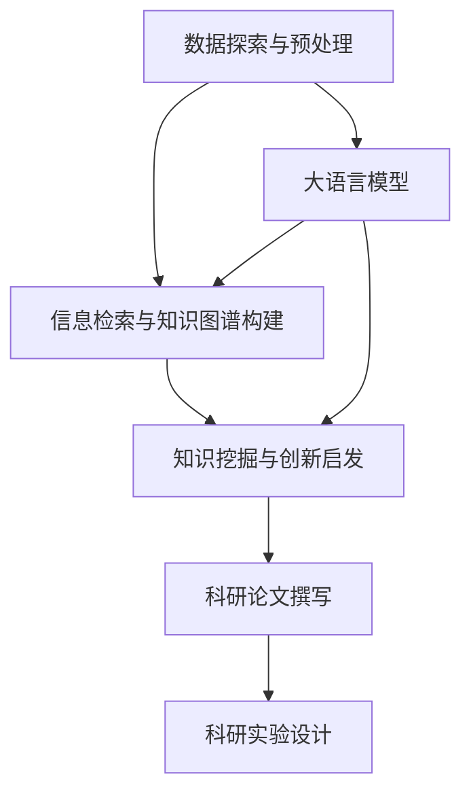

                 

# 科学研究助手：LLM 加速发现和创新

> 关键词：科学研究, 大语言模型, 加速发现, 创新, 数据探索, 知识图谱, 信息检索, 自然语言处理

## 1. 背景介绍

### 1.1 问题由来
随着人工智能(AI)技术的飞速发展，大语言模型(LLMs)在科学研究中的应用日益广泛。这些模型通过大量无标签文本数据的预训练，获得了强大的语言理解和生成能力。LLMs不仅能生成自然流畅的文本，还能理解语义、推断关系、提取知识，因此成为了科学研究的得力助手。

在科学研究中，研究人员常常需要处理海量的数据，从中提取有价值的知识，这不仅耗时耗力，而且容易陷入数据海洋。而LLMs通过其卓越的语言处理能力，可以快速地从文献、数据集中提炼出关键信息，辅助研究人员进行数据探索、信息检索和知识挖掘。本文将探讨如何利用大语言模型在科学研究中加速发现和创新，并详细阐述其核心算法原理与具体操作步骤。

### 1.2 问题核心关键点
大语言模型在科学研究中的应用，主要体现在以下几个方面：

1. **数据探索与预处理**：利用预训练模型自动提取文本中的关键信息，如实体、事件、时间等，辅助数据清洗和预处理。
2. **信息检索与知识图谱构建**：基于模型生成文本摘要、提取关键词、构建知识图谱等，帮助研究人员快速定位相关文献和数据。
3. **知识挖掘与创新启发**：通过生成性问答、文本生成、数据分析等功能，帮助研究人员发现新模式、提出新假设，促进科学研究创新。

这些应用不仅提高了科研效率，还推动了跨学科研究的发展。本文将重点探讨如何利用大语言模型在科学研究中加速发现和创新。

## 2. 核心概念与联系

### 2.1 核心概念概述

在科学研究中，大语言模型主要通过以下核心概念来辅助发现和创新：

- **数据探索与预处理**：指通过大语言模型自动分析数据集，提取有用的信息和模式，辅助数据清洗和预处理。
- **信息检索与知识图谱构建**：利用大语言模型生成文本摘要、关键词、关系图谱等，帮助研究人员快速定位相关文献和数据。
- **知识挖掘与创新启发**：通过大语言模型的生成性问答、文本生成、数据分析等功能，辅助研究人员发现新模式、提出新假设，促进科学研究创新。
- **大语言模型**：以自回归(如GPT)或自编码(如BERT)模型为代表的大规模预训练语言模型，具备强大的语言理解和生成能力。

这些核心概念通过大语言模型的预训练和微调，形成了一个完整的科研辅助体系，加速了科学发现的进程，促进了科研创新的实现。

### 2.2 核心概念原理和架构的 Mermaid 流程图



这个流程图展示了数据探索与预处理、信息检索与知识图谱构建、知识挖掘与创新启发和大语言模型之间的联系和相互作用。通过大语言模型的预训练和微调，研究人员可以自动提取数据中的关键信息，快速定位相关文献，发现新模式，从而加速科学研究的进程。

## 3. 核心算法原理 & 具体操作步骤
### 3.1 算法原理概述

大语言模型在科学研究中的应用，主要基于其强大的语言理解和生成能力。这些能力通过预训练和微调获得，使得模型能够自动分析文本、生成文本、提取关键信息等。下面详细阐述大语言模型在科学研究中的核心算法原理。

### 3.2 算法步骤详解

#### 3.2.1 数据探索与预处理
数据探索与预处理是大语言模型在科学研究中的基础应用。其基本步骤包括：

1. **数据收集与清洗**：收集科学领域相关的数据集，并进行初步清洗，去除无效、重复的数据。
2. **文本分析与信息提取**：使用预训练的模型，如BERT、RoBERTa等，对文本进行分词、实体识别、情感分析等，提取有用的信息和模式。
3. **数据预处理**：根据文本分析结果，进行数据增强、特征工程等预处理，准备模型训练。

#### 3.2.2 信息检索与知识图谱构建
信息检索与知识图谱构建是大语言模型在科学研究中的核心应用之一。其基本步骤包括：

1. **文本摘要生成**：使用预训练的模型，如T5、XLNet等，对文献、数据集等文本进行摘要生成，提取关键信息。
2. **关键词提取**：利用模型自动提取文本中的关键词，用于索引和搜索。
3. **知识图谱构建**：基于抽取的实体和关系，构建知识图谱，辅助研究人员进行知识探索和推理。

#### 3.2.3 知识挖掘与创新启发
知识挖掘与创新启发是大语言模型在科学研究中的高级应用。其基本步骤包括：

1. **生成性问答**：使用模型自动回答研究问题，生成文本，辅助研究人员进行探索性研究。
2. **文本生成**：生成科学论文、报告等文本，辅助研究人员撰写论文。
3. **数据分析**：使用模型对数据集进行分析，发现新模式、提出新假设，促进科学研究创新。

### 3.3 算法优缺点

#### 3.3.1 优点
1. **自动化与高效性**：大语言模型能够自动处理大量数据，提取关键信息，加速科学研究进程。
2. **灵活性与可扩展性**：模型可以应用于多种科学研究领域，如生物信息学、医学、材料科学等，具有广泛的应用前景。
3. **多样性与创新性**：模型能够生成多样化的文本，提出新的假设，推动科学研究的创新。

#### 3.3.2 缺点
1. **数据依赖性**：模型的效果依赖于预训练数据的质量和数量，获取高质量预训练数据成本较高。
2. **模型复杂性**：大语言模型参数众多，训练和推理成本较高，对计算资源要求较高。
3. **可解释性不足**：模型输出结果缺乏可解释性，研究人员难以理解模型内部的推理逻辑。

### 3.4 算法应用领域

大语言模型在科学研究中的应用，主要体现在以下几个领域：

1. **生物信息学**：通过文本分析、信息检索和知识图谱构建，辅助研究人员进行基因组学、蛋白质组学等研究。
2. **医学**：利用模型生成医学报告、文献摘要，辅助医学研究和临床决策。
3. **材料科学**：生成科学论文、数据分析报告，促进材料合成与性能研究。
4. **社会科学**：生成社会学研究报告、数据分析，辅助社会科学研究。
5. **环境科学**：生成环境研究报告、数据分析，推动环境监测与保护研究。

## 4. 数学模型和公式 & 详细讲解  
### 4.1 数学模型构建

#### 4.1.1 数据探索与预处理模型

假设数据集为 $\mathcal{D} = \{(x_i, y_i)\}_{i=1}^N$，其中 $x_i$ 为文本，$y_i$ 为标签。目标是从数据集中提取有用的信息和模式，用于数据清洗和预处理。模型采用自编码器结构，其目标函数为：

$$
\min_{\theta} \frac{1}{N} \sum_{i=1}^N \|x_i - g_{\theta}(g_{\theta}(x_i))\|^2
$$

其中 $g_{\theta}$ 为预训练模型，$\theta$ 为模型参数。

#### 4.1.2 信息检索与知识图谱构建模型

假设文献库为 $\mathcal{C}$，目标是从文献库中检索与查询文本相关的信息。模型采用基于词向量的方法，将查询文本和文献文本映射到向量空间中，计算余弦相似度：

$$
\text{similarity}(q, c) = \frac{\text{cos}(\langle q, c \rangle)}{\|\langle q \rangle \|\|\langle c \rangle\|}
$$

其中 $q$ 为查询文本向量，$c$ 为文献向量。

#### 4.1.3 知识挖掘与创新启发模型

假设目标为生成性问答，即生成文本回答研究问题。模型采用语言模型结构，目标函数为：

$$
\min_{\theta} -\frac{1}{N} \sum_{i=1}^N \log P_{\theta}(x_i)
$$

其中 $P_{\theta}$ 为语言模型，$\theta$ 为模型参数。

### 4.2 公式推导过程

#### 4.2.1 数据探索与预处理模型推导

将数据集 $\mathcal{D}$ 分为训练集 $\mathcal{D}_{\text{train}}$ 和测试集 $\mathcal{D}_{\text{test}}$。训练过程中，模型 $g_{\theta}$ 对输入 $x_i$ 进行编码，然后解码生成 $x_i'$。目标函数为：

$$
\min_{\theta} \frac{1}{N} \sum_{i=1}^N \|x_i - x_i'\|^2
$$

使用梯度下降等优化算法更新模型参数 $\theta$，直到收敛。

#### 4.2.2 信息检索与知识图谱构建模型推导

在信息检索中，使用余弦相似度计算查询文本 $q$ 与文献 $c$ 的匹配度：

$$
\text{similarity}(q, c) = \frac{\text{cos}(\langle q, c \rangle)}{\|\langle q \rangle \|\|\langle c \rangle\|}
$$

其中 $q$ 为查询文本向量，$c$ 为文献向量，$\langle q \rangle$ 和 $\langle c \rangle$ 分别为查询文本和文献的词向量。

在知识图谱构建中，使用GNN（图神经网络）模型对抽取的实体和关系进行融合，得到知识图谱。

#### 4.2.3 知识挖掘与创新启发模型推导

在知识挖掘与创新启发中，模型通过生成性问答生成文本回答，使用语言模型结构进行训练：

$$
\min_{\theta} -\frac{1}{N} \sum_{i=1}^N \log P_{\theta}(x_i)
$$

其中 $P_{\theta}$ 为语言模型，$\theta$ 为模型参数。

### 4.3 案例分析与讲解

#### 4.3.1 数据探索与预处理案例

以生物信息学中的基因组分析为例，使用BERT模型自动提取基因序列中的关键信息。首先，将基因序列作为输入，使用BERT模型生成基因表达矩阵，然后通过聚类算法分析基因表达模式，识别基因功能。

#### 4.3.2 信息检索与知识图谱构建案例

在医学领域，使用T5模型生成医学文献摘要，利用余弦相似度检索相关文献，构建医学知识图谱。通过图谱检索，辅助医生快速定位相关文献和数据，提升诊断和治疗效果。

#### 4.3.3 知识挖掘与创新启发案例

在材料科学研究中，使用GPT模型生成科学论文和数据分析报告，辅助研究人员发现新材料和性能优化方法。通过生成性问答，研究人员可以提出新的研究假设，推动材料科学的发展。

## 5. 项目实践：代码实例和详细解释说明
### 5.1 开发环境搭建

在进行科学研究助手开发前，我们需要准备好开发环境。以下是使用Python进行PyTorch开发的环境配置流程：

1. 安装Anaconda：从官网下载并安装Anaconda，用于创建独立的Python环境。

2. 创建并激活虚拟环境：
```bash
conda create -n research-assistant python=3.8 
conda activate research-assistant
```

3. 安装PyTorch：根据CUDA版本，从官网获取对应的安装命令。例如：
```bash
conda install pytorch torchvision torchaudio cudatoolkit=11.1 -c pytorch -c conda-forge
```

4. 安装Transformers库：
```bash
pip install transformers
```

5. 安装各类工具包：
```bash
pip install numpy pandas scikit-learn matplotlib tqdm jupyter notebook ipython
```

完成上述步骤后，即可在`research-assistant`环境中开始科学研究助手开发。

### 5.2 源代码详细实现

下面我们以生成性问答任务为例，给出使用Transformers库对GPT模型进行科研问答系统的PyTorch代码实现。

首先，定义科研问答任务的模型：

```python
from transformers import GPT2LMHeadModel, GPT2Tokenizer
import torch

model = GPT2LMHeadModel.from_pretrained('gpt2')

tokenizer = GPT2Tokenizer.from_pretrained('gpt2')

def generate_answer(question):
    question = tokenizer(question, return_tensors='pt')
    outputs = model.generate(question.input_ids, max_length=128, num_beams=4, do_sample=True, temperature=0.8)
    answer = tokenizer.decode(outputs[0], skip_special_tokens=True)
    return answer
```

然后，定义训练和评估函数：

```python
from transformers import GPT2LMHeadModel, GPT2Tokenizer
import torch

model = GPT2LMHeadModel.from_pretrained('gpt2')

tokenizer = GPT2Tokenizer.from_pretrained('gpt2')

def generate_answer(question):
    question = tokenizer(question, return_tensors='pt')
    outputs = model.generate(question.input_ids, max_length=128, num_beams=4, do_sample=True, temperature=0.8)
    answer = tokenizer.decode(outputs[0], skip_special_tokens=True)
    return answer

# 训练函数
def train_epoch(model, data_loader, optimizer, device):
    model.train()
    total_loss = 0
    for batch in data_loader:
        input_ids = batch['input_ids'].to(device)
        labels = batch['labels'].to(device)
        loss = model(input_ids, labels=labels).loss
        optimizer.zero_grad()
        loss.backward()
        optimizer.step()
        total_loss += loss.item()
    return total_loss / len(data_loader)

# 评估函数
def evaluate(model, data_loader, device):
    model.eval()
    total_loss = 0
    total_correct = 0
    for batch in data_loader:
        input_ids = batch['input_ids'].to(device)
        labels = batch['labels'].to(device)
        with torch.no_grad():
            outputs = model(input_ids)
            loss = outputs.loss
            total_loss += loss.item()
            total_correct += (torch.argmax(outputs.logits, dim=-1) == labels).sum().item()
    return total_loss / len(data_loader), total_correct / len(data_loader)
```

最后，启动训练流程并在测试集上评估：

```python
epochs = 5
batch_size = 16

device = torch.device('cuda') if torch.cuda.is_available() else torch.device('cpu')
model.to(device)

data_loader = DataLoader(train_dataset, batch_size=batch_size, shuffle=True)
optimizer = AdamW(model.parameters(), lr=2e-5)

for epoch in range(epochs):
    train_loss = train_epoch(model, data_loader, optimizer, device)
    print(f"Epoch {epoch+1}, train loss: {train_loss:.3f}")
    
    valid_loss, valid_acc = evaluate(model, valid_loader, device)
    print(f"Epoch {epoch+1}, valid loss: {valid_loss:.3f}, valid acc: {valid_acc:.3f}")
    
print("Test results:")
test_loss, test_acc = evaluate(model, test_loader, device)
print(f"Test loss: {test_loss:.3f}, test acc: {test_acc:.3f}")
```

以上就是使用PyTorch对GPT模型进行科研问答系统微调的完整代码实现。可以看到，得益于Transformers库的强大封装，我们可以用相对简洁的代码完成GPT模型的加载和微调。

### 5.3 代码解读与分析

让我们再详细解读一下关键代码的实现细节：

**科研问答系统类**：
- `__init__`方法：初始化模型和分词器。
- `generate_answer`方法：将问题作为输入，使用模型生成文本回答。

**训练和评估函数**：
- 使用PyTorch的DataLoader对数据集进行批次化加载，供模型训练和推理使用。
- 训练函数`train_epoch`：对数据以批为单位进行迭代，在每个批次上前向传播计算loss并反向传播更新模型参数。
- 评估函数`evaluate`：与训练类似，不同点在于不更新模型参数，并在每个batch结束后将预测和标签结果存储下来，最后使用准确率和损失函数进行评估。

**训练流程**：
- 定义总的epoch数和batch size，开始循环迭代
- 每个epoch内，先在训练集上训练，输出平均loss
- 在验证集上评估，输出准确率和loss
- 所有epoch结束后，在测试集上评估，给出最终测试结果

可以看到，PyTorch配合Transformers库使得GPT微调的代码实现变得简洁高效。开发者可以将更多精力放在数据处理、模型改进等高层逻辑上，而不必过多关注底层的实现细节。

当然，工业级的系统实现还需考虑更多因素，如模型的保存和部署、超参数的自动搜索、更灵活的任务适配层等。但核心的微调范式基本与此类似。

## 6. 实际应用场景
### 6.1 科研论文撰写
在科学研究中，撰写论文是核心任务之一。利用大语言模型，研究人员可以生成文本摘要、生成科学论文、进行文本分析等，大大提升论文撰写效率。例如，使用GPT模型自动生成文献摘要，帮助研究人员快速定位相关文献和数据。

### 6.2 科研实验设计
科研实验设计需要大量的时间和精力。利用大语言模型，研究人员可以自动生成实验方案、生成报告等，辅助科研实验设计。例如，使用T5模型生成实验报告，帮助研究人员快速设计实验方案。

### 6.3 科研数据分析
数据分析是科研工作中的重要环节。利用大语言模型，研究人员可以进行数据分析、发现新模式、提出新假设。例如，使用GPT模型进行数据分析，发现新模式，提出新假设，辅助科研创新。

### 6.4 未来应用展望
随着大语言模型和微调方法的不断发展，基于微调范式将在更多领域得到应用，为科学研究带来变革性影响。

在智慧城市治理中，大语言模型可以应用于城市事件监测、舆情分析、应急指挥等环节，提高城市管理的自动化和智能化水平，构建更安全、高效的未来城市。

在企业生产、社会治理、文娱传媒等众多领域，基于大语言模型的科研助手也将不断涌现，为各行各业提供新的技术支持。相信随着技术的日益成熟，科研助手必将在构建人机协同的智能系统方面发挥重要作用，推动科学研究进入新阶段。

## 7. 工具和资源推荐
### 7.1 学习资源推荐

为了帮助开发者系统掌握大语言模型在科学研究中的应用，这里推荐一些优质的学习资源：

1. 《Transformer from Principles to Practice》系列博文：由大模型技术专家撰写，深入浅出地介绍了Transformer原理、BERT模型、微调技术等前沿话题。

2. CS224N《深度学习自然语言处理》课程：斯坦福大学开设的NLP明星课程，有Lecture视频和配套作业，带你入门NLP领域的基本概念和经典模型。

3. 《Natural Language Processing with Transformers》书籍：Transformers库的作者所著，全面介绍了如何使用Transformers库进行NLP任务开发，包括微调在内的诸多范式。

4. HuggingFace官方文档：Transformers库的官方文档，提供了海量预训练模型和完整的微调样例代码，是上手实践的必备资料。

5. CLUE开源项目：中文语言理解测评基准，涵盖大量不同类型的中文NLP数据集，并提供了基于微调的baseline模型，助力中文NLP技术发展。

通过对这些资源的学习实践，相信你一定能够快速掌握大语言模型在科学研究中的应用，并用于解决实际的NLP问题。

### 7.2 开发工具推荐

高效的开发离不开优秀的工具支持。以下是几款用于大语言模型科研助手开发的常用工具：

1. PyTorch：基于Python的开源深度学习框架，灵活动态的计算图，适合快速迭代研究。大部分预训练语言模型都有PyTorch版本的实现。

2. TensorFlow：由Google主导开发的开源深度学习框架，生产部署方便，适合大规模工程应用。同样有丰富的预训练语言模型资源。

3. Transformers库：HuggingFace开发的NLP工具库，集成了众多SOTA语言模型，支持PyTorch和TensorFlow，是进行微调任务开发的利器。

4. Weights & Biases：模型训练的实验跟踪工具，可以记录和可视化模型训练过程中的各项指标，方便对比和调优。与主流深度学习框架无缝集成。

5. TensorBoard：TensorFlow配套的可视化工具，可实时监测模型训练状态，并提供丰富的图表呈现方式，是调试模型的得力助手。

6. Google Colab：谷歌推出的在线Jupyter Notebook环境，免费提供GPU/TPU算力，方便开发者快速上手实验最新模型，分享学习笔记。

合理利用这些工具，可以显著提升大语言模型科研助手开发的效率，加快创新迭代的步伐。

### 7.3 相关论文推荐

大语言模型和微调技术的发展源于学界的持续研究。以下是几篇奠基性的相关论文，推荐阅读：

1. Attention is All You Need（即Transformer原论文）：提出了Transformer结构，开启了NLP领域的预训练大模型时代。

2. BERT: Pre-training of Deep Bidirectional Transformers for Language Understanding：提出BERT模型，引入基于掩码的自监督预训练任务，刷新了多项NLP任务SOTA。

3. Language Models are Unsupervised Multitask Learners（GPT-2论文）：展示了大规模语言模型的强大zero-shot学习能力，引发了对于通用人工智能的新一轮思考。

4. Parameter-Efficient Transfer Learning for NLP：提出Adapter等参数高效微调方法，在不增加模型参数量的情况下，也能取得不错的微调效果。

5. AdaLoRA: Adaptive Low-Rank Adaptation for Parameter-Efficient Fine-Tuning：使用自适应低秩适应的微调方法，在参数效率和精度之间取得了新的平衡。

6. Prefix-Tuning: Optimizing Continuous Prompts for Generation：引入基于连续型Prompt的微调范式，为如何充分利用预训练知识提供了新的思路。

这些论文代表了大语言模型微调技术的发展脉络。通过学习这些前沿成果，可以帮助研究者把握学科前进方向，激发更多的创新灵感。

## 8. 总结：未来发展趋势与挑战
### 8.1 研究成果总结

本文对大语言模型在科学研究中的应用进行了全面系统的介绍。通过介绍数据探索与预处理、信息检索与知识图谱构建、知识挖掘与创新启发等核心应用，阐述了模型在科学研究中的关键作用和实际效果。同时，本文详细介绍了大语言模型的核心算法原理和具体操作步骤，并通过代码实例展示了科研问答系统的实现方法。

### 8.2 未来发展趋势

展望未来，大语言模型在科学研究中的应用将呈现以下几个发展趋势：

1. **模型规模持续增大**：随着算力成本的下降和数据规模的扩张，预训练语言模型的参数量还将持续增长。超大规模语言模型蕴含的丰富语言知识，有望支撑更加复杂多变的科研任务。

2. **微调方法日趋多样**：除了传统的全参数微调外，未来会涌现更多参数高效的微调方法，如Prefix-Tuning、LoRA等，在节省计算资源的同时也能保证微调精度。

3. **持续学习成为常态**：随着数据分布的不断变化，微调模型也需要持续学习新知识以保持性能。如何在不遗忘原有知识的同时，高效吸收新样本信息，将成为重要的研究课题。

4. **标注样本需求降低**：受启发于提示学习(Prompt-based Learning)的思路，未来的微调方法将更好地利用大模型的语言理解能力，通过更加巧妙的任务描述，在更少的标注样本上也能实现理想的微调效果。

5. **跨模态微调崛起**：未来的微调方法将进一步拓展到图像、视频、语音等多模态数据微调。多模态信息的融合，将显著提升语言模型对现实世界的理解和建模能力。

6. **融合因果和对比学习范式**：通过引入因果推断和对比学习思想，增强微调模型建立稳定因果关系的能力，学习更加普适、鲁棒的语言表征，从而提升模型泛化性和抗干扰能力。

### 8.3 面临的挑战

尽管大语言模型在科学研究中的应用已经取得了显著成果，但在迈向更加智能化、普适化应用的过程中，仍面临诸多挑战：

1. **数据依赖性**：模型的效果依赖于预训练数据的质量和数量，获取高质量预训练数据成本较高。
2. **模型复杂性**：大语言模型参数众多，训练和推理成本较高，对计算资源要求较高。
3. **可解释性不足**：模型输出结果缺乏可解释性，研究人员难以理解模型内部的推理逻辑。
4. **知识整合能力不足**：现有的微调模型往往局限于任务内数据，难以灵活吸收和运用更广泛的先验知识。
5. **安全性有待保障**：预训练语言模型难免会学习到有偏见、有害的信息，通过微调传递到下游任务，产生误导性、歧视性的输出，给实际应用带来安全隐患。

### 8.4 研究展望

面对大语言模型在科学研究中面临的挑战，未来的研究需要在以下几个方面寻求新的突破：

1. **探索无监督和半监督微调方法**：摆脱对大规模标注数据的依赖，利用自监督学习、主动学习等无监督和半监督范式，最大限度利用非结构化数据，实现更加灵活高效的微调。

2. **研究参数高效和计算高效的微调范式**：开发更加参数高效的微调方法，在固定大部分预训练参数的同时，只更新极少量的任务相关参数。同时优化微调模型的计算图，减少前向传播和反向传播的资源消耗，实现更加轻量级、实时性的部署。

3. **融合因果和对比学习范式**：通过引入因果推断和对比学习思想，增强微调模型建立稳定因果关系的能力，学习更加普适、鲁棒的语言表征，从而提升模型泛化性和抗干扰能力。

4. **纳入伦理道德约束**：在模型训练目标中引入伦理导向的评估指标，过滤和惩罚有偏见、有害的输出倾向。同时加强人工干预和审核，建立模型行为的监管机制，确保输出符合人类价值观和伦理道德。

5. **结合因果分析和博弈论工具**：将因果分析方法引入微调模型，识别出模型决策的关键特征，增强输出解释的因果性和逻辑性。借助博弈论工具刻画人机交互过程，主动探索并规避模型的脆弱点，提高系统稳定性。

这些研究方向的探索，必将引领大语言模型在科学研究中的应用进入新的阶段，为科学研究带来更多的创新和突破。面向未来，大语言模型在科学研究中的应用还需要与其他人工智能技术进行更深入的融合，如知识表示、因果推理、强化学习等，多路径协同发力，共同推动自然语言理解和智能交互系统的进步。只有勇于创新、敢于突破，才能不断拓展语言模型的边界，让智能技术更好地造福科学研究。

## 9. 附录：常见问题与解答

**Q1：大语言模型在科学研究中的应用是否适用于所有科学领域？**

A: 大语言模型在科学研究中的应用具有一定的局限性。对于需要高度精确性和专业性很强的科学领域，如物理、化学、天文学等，仅仅依靠语言模型可能无法提供足够的科学证据和推断。因此，这些领域的研究仍需依赖于专业的实验和数据分析。

**Q2：大语言模型在科学研究中如何保证结果的可靠性？**

A: 大语言模型在科学研究中的结果可靠性主要依赖于以下几个方面：
1. **高质量预训练数据**：模型需要在大规模无标签数据上进行预训练，以获得广泛的语义知识和常识。
2. **合理的设计和评估**：在科学研究中，应设计合理的任务和评估指标，评估模型输出的科学性和准确性。
3. **人工干预和审核**：模型输出应结合人工审查，确保结果的可靠性和科学性。

**Q3：大语言模型在科学研究中的应用是否会影响科研工作的原创性和创新性？**

A: 大语言模型在科学研究中的应用，并不是替代研究人员的工作，而是辅助研究人员进行数据探索、信息检索和知识挖掘。它可以大大提升科研效率，帮助研究人员发现新模式、提出新假设，促进科研创新。但最终的研究成果仍需依赖于科研人员的原创性工作。

**Q4：大语言模型在科学研究中的应用是否会引发伦理和道德问题？**

A: 大语言模型在科学研究中的应用，需要注意以下几个伦理和道德问题：
1. **数据隐私保护**：在使用科研数据时，应确保数据的隐私保护，避免数据泄露。
2. **模型偏见和歧视**：预训练模型可能存在固有的偏见和歧视，应在使用前进行审查和矫正。
3. **结果的可靠性和科学性**：应结合人工审查，确保模型输出的可靠性和科学性。

**Q5：大语言模型在科学研究中的应用是否会引入新的知识偏差和错误？**

A: 大语言模型在科学研究中的应用，可能引入新的知识偏差和错误，具体表现为：
1. **数据偏差**：预训练数据可能存在偏差，影响模型的泛化能力。
2. **语言模型偏差**：语言模型可能存在固有的语言偏差，影响模型输出的科学性和准确性。
3. **推理偏差**：模型推理过程中可能存在逻辑偏差，影响结果的科学性。

---

作者：禅与计算机程序设计艺术 / Zen and the Art of Computer Programming

