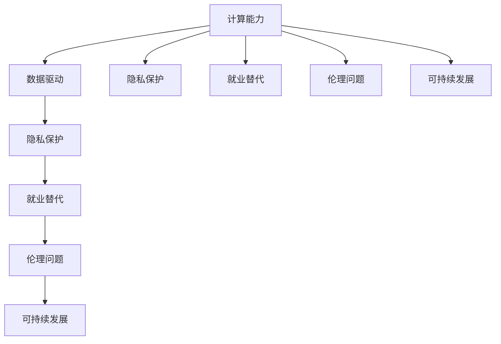

                 

# 科技与社会：人类计算的双重影响

## 1. 背景介绍

在当今社会，计算技术已经深度渗透到各个领域，从日常生活到国家治理，无处不在。计算技术不仅改变了我们工作、学习、生活的方方面面，也重塑了社会的结构、价值观和未来趋势。本文将深入探讨人类计算的双重影响，包括其带来的积极变化和潜在风险，并探讨如何构建一个健康、可持续的社会，确保计算技术在促进人类进步的同时，不损害人类的福祉。

### 1.1 计算技术的兴起

计算技术的兴起始于20世纪40年代，随着计算机的诞生和逐步发展，计算能力不断提高，数据量不断增长。特别是自1990年代以来，随着互联网的普及和移动互联网的兴起，数据采集、存储、处理和分析的能力得到了空前提升，使得计算技术在各个领域的应用更加广泛和深入。

### 1.2 计算技术对社会的影响

计算技术的发展对社会的影响是多方面的，既包括对经济、教育、医疗等领域的积极影响，也包括对隐私、就业、伦理等问题的挑战。计算技术的进步极大地提高了生产效率，优化了资源配置，推动了社会创新，但也带来了数据滥用、隐私侵犯、就业替代等风险。

## 2. 核心概念与联系

### 2.1 核心概念概述

为了更好地理解计算技术对社会的影响，本文将介绍几个关键概念：

- **计算能力**：指处理和分析数据的能力，包括数据采集、存储、处理和分析等多个环节。
- **数据驱动**：指利用数据进行决策和优化，推动社会进步和发展。
- **隐私保护**：指保护个人数据免遭未经授权的访问和使用的措施。
- **就业替代**：指计算技术对传统职业的替代，导致部分劳动力过剩或失业。
- **伦理问题**：指计算技术在应用过程中可能出现的伦理道德问题，如算法偏见、自动化决策等。
- **可持续发展**：指在推动技术进步的同时，保护环境和资源，确保社会长期稳定发展。

这些概念之间存在复杂的联系和交互，共同构成了计算技术对社会影响的多维度全景。

### 2.2 核心概念原理和架构的 Mermaid 流程图



这个流程图展示了计算能力、数据驱动、隐私保护、就业替代、伦理问题和可持续发展之间的复杂关系。计算能力是数据驱动的基础，但数据驱动的同时也涉及隐私保护和伦理问题。就业替代和伦理问题则直接关系到社会的可持续发展。

## 3. 核心算法原理 & 具体操作步骤

### 3.1 算法原理概述

计算技术的核心算法原理可以概括为以下几个方面：

- **数据采集**：通过传感器、监测设备等手段，自动采集海量数据。
- **数据处理**：利用算法对数据进行清洗、筛选、整合和分析，提取有价值的信息。
- **数据存储**：利用数据库、云存储等技术，高效存储和管理数据。
- **数据分析**：利用机器学习、深度学习等技术，对数据进行建模和预测，推动决策优化。
- **数据可视化**：通过图表、报告等方式，直观展示数据和分析结果，辅助决策。

这些算法原理共同构成了计算技术的基本框架，使其能够在各个领域实现应用。

### 3.2 算法步骤详解

以机器学习算法为例，其步骤包括：

1. **数据预处理**：对原始数据进行清洗、归一化、特征提取等预处理。
2. **模型选择**：选择合适的算法和模型结构。
3. **模型训练**：使用训练数据对模型进行训练，优化模型参数。
4. **模型评估**：使用测试数据对模型进行评估，检验模型效果。
5. **模型部署**：将训练好的模型部署到实际应用中，进行预测和推理。

### 3.3 算法优缺点

计算技术的算法具有以下优点：

- **高效性**：通过自动化的数据分析，大幅提高了生产效率。
- **精度高**：机器学习等算法能够提供精确的预测和决策。
- **可扩展性**：算法可以高效扩展到大规模数据集，处理复杂问题。

同时，也存在一些缺点：

- **数据依赖**：算法的精度和效果依赖于数据的质量和数量。
- **模型复杂**：复杂的算法模型需要大量计算资源和时间进行训练。
- **可解释性差**：许多复杂算法缺乏可解释性，难以理解其内部决策过程。

### 3.4 算法应用领域

计算技术的应用领域非常广泛，包括但不限于以下几个方面：

- **智能制造**：利用数据分析和机器学习，优化生产流程和资源配置。
- **智慧医疗**：通过健康数据分析，提高疾病诊断和治疗效果。
- **智慧城市**：利用城市大数据，优化交通、环境、能源等系统。
- **金融科技**：利用数据和算法，进行风险控制、反欺诈、投资分析等。
- **教育科技**：利用数据分析和个性化推荐，提高教学效果和学习体验。
- **零售科技**：通过数据分析和推荐算法，提升用户体验和销售业绩。

## 4. 数学模型和公式 & 详细讲解 & 举例说明

### 4.1 数学模型构建

以回归分析为例，构建数学模型：

设 $y$ 为因变量，$x_1, x_2, ..., x_n$ 为自变量，则线性回归模型为：

$$ y = \beta_0 + \beta_1 x_1 + \beta_2 x_2 + ... + \beta_n x_n + \epsilon $$

其中 $\beta$ 为回归系数，$\epsilon$ 为随机误差项。

### 4.2 公式推导过程

根据最小二乘法，求解回归系数 $\beta$ 的公式为：

$$ \hat{\beta} = (X^T X)^{-1} X^T y $$

其中 $X$ 为自变量矩阵，$y$ 为因变量向量。

### 4.3 案例分析与讲解

假设我们有一组数据 $(x_1, x_2, y)$，其中 $x_1$ 和 $x_2$ 为自变量，$y$ 为因变量。利用线性回归模型进行预测，步骤如下：

1. 构造自变量矩阵 $X = \begin{bmatrix} 1 & x_1 \\ 1 & x_2 \\ \vdots & \vdots \end{bmatrix}$。
2. 计算回归系数 $\hat{\beta} = (X^T X)^{-1} X^T y$。
3. 根据 $\hat{\beta}$ 和自变量 $x$，计算预测值 $\hat{y} = \hat{\beta}_0 + \hat{\beta}_1 x_1 + \hat{\beta}_2 x_2$。

## 5. 项目实践：代码实例和详细解释说明

### 5.1 开发环境搭建

在进行计算技术应用开发前，需要进行环境配置，以下是一个Python项目开发环境搭建的示例：

1. 安装Python：从官网下载并安装Python，推荐使用3.x版本。
2. 安装必要的库：如NumPy、Pandas、Scikit-Learn等。
3. 创建虚拟环境：使用`virtualenv`命令创建虚拟环境，以隔离开发环境。
4. 激活虚拟环境：使用`source`命令激活虚拟环境。

### 5.2 源代码详细实现

以线性回归模型为例，实现代码如下：

```python
import numpy as np
from sklearn.linear_model import LinearRegression

# 准备数据
X = np.array([[1, 2], [3, 4], [5, 6]])
y = np.array([2, 5, 8])

# 构建模型
model = LinearRegression()

# 训练模型
model.fit(X, y)

# 预测结果
X_new = np.array([[7, 8]])
y_pred = model.predict(X_new)

print(y_pred)
```

### 5.3 代码解读与分析

上述代码实现了线性回归模型的构建和预测，具体分析如下：

- 使用NumPy库创建自变量矩阵 $X$ 和因变量向量 $y$。
- 使用Scikit-Learn库中的LinearRegression模型，进行模型训练。
- 使用训练好的模型，对新数据 $X_{new}$ 进行预测，输出预测值 $y_{pred}$。

## 6. 实际应用场景

### 6.1 智慧医疗

计算技术在智慧医疗领域的应用，极大地提高了疾病的诊断和治疗效果。利用电子健康记录（EHR）数据，进行疾病预测、药物研发和个性化治疗。例如，通过机器学习算法，对病人的基因数据进行分析，预测其患某种疾病的风险，提供个性化的治疗方案。

### 6.2 智能制造

智能制造利用计算技术，优化生产流程和资源配置。例如，通过物联网（IoT）设备采集的生产数据，进行实时监测和分析，预测设备故障，优化生产调度，提高生产效率和产品质量。

### 6.3 智慧城市

智慧城市利用大数据分析，优化交通、环境、能源等系统。例如，利用城市交通数据，进行交通流量预测和优化，减少拥堵，提高交通效率。

### 6.4 金融科技

金融科技利用计算技术，进行风险控制、反欺诈、投资分析等。例如，通过机器学习算法，分析交易数据，预测股票价格，优化投资组合，降低风险。

## 7. 工具和资源推荐

### 7.1 学习资源推荐

为了深入了解计算技术的应用，推荐以下学习资源：

1. 《Python数据科学手册》：深入浅出地介绍了Python数据科学的基本概念和应用。
2. 《机器学习》（周志华）：系统介绍了机器学习的基本算法和应用。
3. 《深度学习》（Ian Goodfellow）：全面介绍了深度学习的基本原理和应用。
4. Coursera《机器学习》课程：斯坦福大学开设的机器学习课程，有Lecture视频和配套作业。
5. edX《数据科学微学位》课程：哈佛大学和IBM合作开设的数据科学课程，涵盖了数据科学和计算技术的多个方面。

### 7.2 开发工具推荐

为了高效开发计算技术应用，推荐以下开发工具：

1. Jupyter Notebook：一个交互式的编程环境，支持Python、R等语言，方便数据处理和算法实现。
2. TensorFlow：由Google开发的深度学习框架，支持多种算法和模型，适合大规模工程应用。
3. PyTorch：由Facebook开发的深度学习框架，适合快速原型开发和实验。
4. Scikit-Learn：一个简单易用的机器学习库，适合快速实现基本算法和模型。
5. Apache Spark：一个分布式计算框架，支持大数据处理和分析。

### 7.3 相关论文推荐

为了深入了解计算技术的研究进展，推荐以下相关论文：

1. Andrew Ng的《机器学习》课程讲义。
2. Ian Goodfellow的《深度学习》书籍。
3. Yann LeCun、Yoshua Bengio和Geoffrey Hinton的《深度学习》书籍。
4. 《自然计算》期刊：涵盖计算技术在各个领域的最新研究成果。

## 8. 总结：未来发展趋势与挑战

### 8.1 研究成果总结

计算技术在推动社会进步的同时，也带来了隐私保护、就业替代、伦理问题等挑战。需要平衡技术发展与人类福祉之间的关系，确保技术进步为人类带来更多福祉。

### 8.2 未来发展趋势

未来计算技术的发展趋势包括：

- **数据智能**：数据驱动将更加智能化，利用大数据和算法进行更加精准的决策。
- **隐私保护**：隐私保护技术将更加成熟，确保数据安全和用户隐私。
- **伦理道德**：计算技术的伦理道德问题将得到更多关注，推动社会公平正义。
- **可持续发展**：计算技术将更加注重环境保护和资源利用，实现可持续发展。

### 8.3 面临的挑战

计算技术在发展过程中，面临以下挑战：

- **数据质量**：高质量数据的获取和处理是计算技术应用的瓶颈。
- **计算资源**：计算技术需要大量计算资源，如何高效利用计算资源是重要课题。
- **隐私保护**：如何保护个人隐私，防止数据滥用和泄露是重要问题。
- **就业替代**：计算技术对传统职业的替代，如何应对劳动力过剩和失业是重要问题。

### 8.4 研究展望

未来计算技术的研究方向包括：

- **数据智能**：提高数据的智能化程度，提升数据驱动决策的准确性。
- **隐私保护**：开发新的隐私保护技术，确保数据安全和用户隐私。
- **伦理道德**：研究计算技术的伦理道德问题，推动社会公平正义。
- **可持续发展**：利用计算技术实现环境保护和资源利用，促进可持续发展。

## 9. 附录：常见问题与解答

**Q1：计算技术如何影响隐私保护？**

A: 计算技术在数据采集、存储、处理和分析过程中，涉及大量的个人隐私数据。数据泄露、滥用等风险可能导致个人隐私受损。因此，需要开发新的隐私保护技术，如差分隐私、联邦学习等，确保数据安全和用户隐私。

**Q2：计算技术对就业的影响有哪些？**

A: 计算技术的发展和应用，导致传统职业被替代，劳动力过剩和失业问题突出。需要开发新的就业机会，提升劳动力技能，确保社会稳定。

**Q3：如何确保计算技术的可持续发展？**

A: 计算技术的应用需要注重环境保护和资源利用，避免对环境造成过度负担。需要开发新的绿色技术和节能技术，实现可持续发展。

**Q4：计算技术的未来发展方向有哪些？**

A: 计算技术的未来发展方向包括数据智能、隐私保护、伦理道德和可持续发展等方面。这些方向的研究将推动计算技术更好地服务于社会，实现人类福祉。

---

作者：禅与计算机程序设计艺术 / Zen and the Art of Computer Programming

