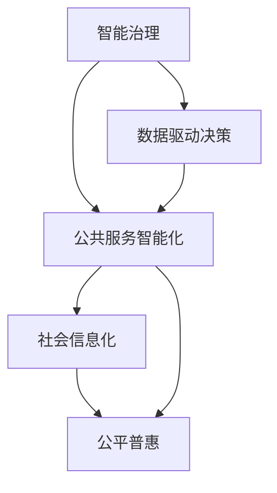

                 

# 科技创新：社会治理的新思路

## 1. 背景介绍

### 1.1 问题由来
进入21世纪以来，科技进步日新月异，信息技术、大数据、人工智能等领域的发展，正在深刻地改变着社会治理的方式。传统以人工为主的社会治理方式逐渐让位于智能、高效的智能化治理模式。科技创新不仅仅是经济发展的引擎，也成为社会治理的重要推动力。

社会治理的现代化不仅意味着管理手段的智能化，更在于治理理念的创新。科技在优化社会资源配置、提升服务效率、促进社会公平等方面发挥了重要作用。借助数据智能、模型算法，社会治理正在向更加精准、透明、智能化的方向迈进。

### 1.2 问题核心关键点
科技创新在社会治理中的应用主要体现在以下几个方面：

1. **数据驱动治理**：通过收集、分析海量数据，构建数字化社会治理体系，实现治理决策的精准化和科学化。
2. **智能化服务**：依托于AI技术，提升政府服务效率，如智能客服、智能审核、智能审批等。
3. **风险预警与预测**：利用机器学习和大数据分析，对社会事件进行早期预测和风险预警，如公共安全事件、社会舆情等。
4. **治理决策支持**：为决策者提供数据驱动的智能辅助决策支持，如基于数据挖掘和模式识别的政策制定。
5. **社会公平与普惠**：通过智能算法消除数据偏见，推动社会治理的公平与普惠。

这些关键点展示了科技创新在社会治理中的应用潜力，也明确了科技创新在促进社会治理现代化进程中的重要作用。

### 1.3 问题研究意义
科技创新在社会治理中的应用，是推动社会进步、保障社会公平的重要途径。科技进步带来的智能化治理模式，不仅能有效提升社会治理效率，还能实现更广泛的公平和普惠，促进社会的全面发展。

- **提升治理效率**：通过数据和算法优化资源配置，实现快速响应和高效管理。
- **增强治理透明度**：通过公开、透明的数据处理和决策过程，提升社会信任和参与度。
- **促进社会公平**：利用AI技术消除偏见，确保各类群体享有平等的公共服务。
- **推动公共参与**：通过智能平台实现公共参与的便捷化和智能化，提升社会治理的民主性。

科技创新在社会治理中的应用，不仅提高了治理效率和质量，还推动了社会向更加公正、透明、高效的方向发展。这为未来社会治理模式提供了全新的思路。

## 2. 核心概念与联系

### 2.1 核心概念概述

科技创新在社会治理中的应用，涉及多个核心概念：

- **智能治理**：利用AI和大数据等技术，实现社会治理的智能化、精细化管理。
- **数据驱动决策**：通过海量数据分析，支撑政府决策，提升决策的精准性和科学性。
- **社会信息化**：构建社会治理的数字化、网络化体系，实现信息高效流通和共享。
- **公共服务智能化**：依托于智能技术，提升公共服务的效率和质量，改善民生。
- **公平普惠**：通过科技手段消除偏见，促进社会公平和普惠。

这些概念之间存在紧密联系，共同构成了科技创新在社会治理中的基本框架。智能治理和数据驱动决策为公共服务智能化提供技术支持，而社会信息化和公平普惠则确保了治理过程的透明和公正。

### 2.2 核心概念原理和架构的 Mermaid 流程图



这个流程图展示了智能治理的各个核心概念之间的相互联系和支持关系。智能治理不仅依赖于数据驱动决策，也需要社会信息化和公共服务智能化提供技术和制度保障，公平普惠则确保了社会治理的公正性和普惠性。

## 3. 核心算法原理 & 具体操作步骤

### 3.1 算法原理概述

科技创新在社会治理中的应用，通常涉及以下几个算法和计算步骤：

1. **数据采集与预处理**：从各类数据源采集数据，并进行清洗、标注和预处理。
2. **数据分析与建模**：利用机器学习和数据分析技术，构建模型进行数据分析和挖掘。
3. **智能决策支持**：基于分析结果，构建智能决策支持系统，提供决策辅助。
4. **智能服务优化**：通过智能算法优化公共服务流程，提升服务效率和质量。
5. **公平普惠算法**：设计公平普惠的算法，确保各类群体享受平等的公共服务。

这些算法步骤相互关联，共同支撑社会治理的智能化和公平化。

### 3.2 算法步骤详解

#### 3.2.1 数据采集与预处理

数据采集与预处理是社会治理科技创新的基础。以下详细介绍这一步骤：

1. **数据采集**：从各类数据源（如政府部门、公共服务机构、社交媒体、传感器等）采集数据，确保数据的全面性和多样性。

2. **数据清洗与标注**：对采集到的数据进行清洗和去噪，确保数据的质量和准确性。同时，对数据进行标注，以便后续分析。

3. **数据预处理**：将数据转换为模型所需的格式，包括特征提取、归一化、降维等步骤。

#### 3.2.2 数据分析与建模

数据分析与建模是社会治理科技创新的核心。以下详细介绍这一步骤：

1. **特征选择与工程**：选择对目标变量有显著影响的特征，并进行特征工程，以提高模型的解释性和泛化能力。

2. **模型构建与训练**：选择合适的机器学习模型，并使用标注数据进行训练。常用的模型包括决策树、随机森林、支持向量机、神经网络等。

3. **模型评估与优化**：评估模型的性能，通过交叉验证、调参等方式优化模型。

#### 3.2.3 智能决策支持

智能决策支持是社会治理科技创新的关键。以下详细介绍这一步骤：

1. **决策模型构建**：构建智能决策支持系统，将数据分析结果转化为可操作的决策建议。

2. **决策支持系统集成**：将决策模型集成到现有的治理流程中，实现智能辅助决策。

3. **决策反馈与改进**：通过反馈机制，不断改进决策模型，提升决策质量。

#### 3.2.4 智能服务优化

智能服务优化是社会治理科技创新的目标。以下详细介绍这一步骤：

1. **服务流程再造**：利用智能算法优化公共服务流程，减少繁琐的手工操作，提高服务效率。

2. **服务质量监控**：实时监控公共服务质量，及时发现和解决服务问题。

3. **服务自动化**：实现公共服务的自动化处理，提高服务质量。

#### 3.2.5 公平普惠算法

公平普惠算法是社会治理科技创新的保障。以下详细介绍这一步骤：

1. **数据偏见检测**：利用统计方法和机器学习算法检测数据中的偏见。

2. **算法公平性优化**：设计公平普惠的算法，消除数据偏见，确保各类群体享受平等的公共服务。

3. **算法透明性与可解释性**：提高算法的透明性和可解释性，确保治理决策的公正性和可理解性。

### 3.3 算法优缺点

科技创新在社会治理中的应用，具有以下优缺点：

**优点**：

1. **高效性**：利用算法和大数据技术，实现快速、精准的治理决策和公共服务。
2. **透明性**：通过数据公开和算法透明，提升治理决策的透明度和公众信任。
3. **普惠性**：设计公平普惠的算法，确保各类群体享受平等的公共服务。

**缺点**：

1. **数据隐私和安全**：海量数据的采集和使用可能带来隐私和数据安全问题。
2. **算法偏见**：模型可能学习到数据中的偏见，导致决策不公平。
3. **技术依赖**：依赖于先进的技术和算法，对技术人员的水平要求较高。
4. **成本高**：需要投入大量的人力和资金进行数据采集、模型构建和系统集成。

### 3.4 算法应用领域

科技创新在社会治理中的应用，涵盖了多个领域：

1. **公共安全管理**：利用智能监控和数据分析，实现公共安全事件的预警和防范。

2. **城市管理与规划**：构建智能城市管理系统，提升城市管理效率和质量。

3. **社会服务优化**：优化社会服务流程，提升服务效率和质量，改善民生。

4. **环境保护与监测**：利用大数据和人工智能技术，实现环境监测和污染源溯源。

5. **教育与医疗**：通过智能化的教育与医疗服务，提升教育和医疗服务的质量和效率。

6. **文化与旅游**：利用大数据和人工智能技术，提升文化和旅游服务质量，促进经济发展。

这些领域的应用展示了科技创新在社会治理中的广泛影响，也明确了科技创新在各个领域的具体应用场景和潜在价值。

## 4. 数学模型和公式 & 详细讲解 & 举例说明

### 4.1 数学模型构建

科技创新在社会治理中的应用，通常涉及多个数学模型。以下详细介绍这些模型及其构建过程：

1. **回归模型**：用于预测连续型变量，如人口流动、温度变化等。

   $$
   y = \beta_0 + \beta_1 x_1 + \beta_2 x_2 + \ldots + \beta_n x_n + \epsilon
   $$

2. **分类模型**：用于分类离散型变量，如社会事件分类、情感分析等。

   $$
   P(y|x) = \frac{e^{\beta_0 + \beta_1 x_1 + \ldots + \beta_n x_n}}{1 + \sum_{i=1}^n e^{\beta_i x_i}}
   $$

3. **聚类模型**：用于对数据进行无监督分类，如社区划分、用户群体分析等。

   $$
   K-means(x_1, x_2, \ldots, x_n) = \{K_1, K_2, \ldots, K_k\}
   $$

4. **强化学习模型**：用于智能决策支持，如交通流量控制、智能推荐等。

   $$
   Q(s,a) = r + \gamma \max_{a'} Q(s',a')
   $$

5. **神经网络模型**：用于复杂数据挖掘和模型构建，如图像识别、语音识别等。

   $$
   y = \sigma(W^T x + b)
   $$

### 4.2 公式推导过程

#### 4.2.1 回归模型

回归模型的推导过程如下：

1. **线性回归模型**：假设数据满足线性关系，模型如下：

   $$
   y = \beta_0 + \beta_1 x_1 + \beta_2 x_2 + \ldots + \beta_n x_n + \epsilon
   $$

   其中，$\beta_i$为回归系数，$x_i$为自变量，$\epsilon$为随机误差项。

2. **最小二乘法**：通过最小化损失函数，求解回归系数：

   $$
   \hat{\beta} = \arg\min_{\beta} \sum_{i=1}^n (y_i - \hat{y}_i)^2
   $$

   其中，$\hat{y}_i = \beta_0 + \beta_1 x_{1i} + \beta_2 x_{2i} + \ldots + \beta_n x_{ni}$。

#### 4.2.2 分类模型

分类模型的推导过程如下：

1. **逻辑回归模型**：假设数据满足二分类关系，模型如下：

   $$
   P(y|x) = \frac{e^{\beta_0 + \beta_1 x_1 + \ldots + \beta_n x_n}}{1 + \sum_{i=1}^n e^{\beta_i x_i}}
   $$

2. **交叉熵损失函数**：通过最小化交叉熵损失，求解回归系数：

   $$
   L(y, \hat{y}) = -\frac{1}{N} \sum_{i=1}^N [y_i \log \hat{y}_i + (1-y_i) \log (1-\hat{y}_i)]
   $$

#### 4.2.3 聚类模型

聚类模型的推导过程如下：

1. **K-means算法**：将数据分为K个簇，模型如下：

   $$
   K-means(x_1, x_2, \ldots, x_n) = \{K_1, K_2, \ldots, K_k\}
   $$

2. **误差平方和最小化**：通过最小化误差平方和，求解簇心：

   $$
   SSE = \sum_{i=1}^n \min_{k=1,\ldots,K} ||x_i - \mu_k||^2
   $$

#### 4.2.4 强化学习模型

强化学习模型的推导过程如下：

1. **Q-learning算法**：通过迭代更新Q值，求解最优策略：

   $$
   Q(s,a) = r + \gamma \max_{a'} Q(s',a')
   $$

2. **策略优化**：通过迭代优化策略，求解最优策略：

   $$
   \pi^* = \arg\max_{\pi} \sum_{s,a} \pi(a|s) Q_{\pi}(s,a)
   $$

#### 4.2.5 神经网络模型

神经网络模型的推导过程如下：

1. **前向传播**：通过权重矩阵和偏置项计算输出：

   $$
   y = \sigma(W^T x + b)
   $$

2. **反向传播**：通过梯度下降优化权重和偏置项：

   $$
   \frac{\partial L}{\partial W} = \frac{\partial L}{\partial y} \frac{\partial y}{\partial x} \frac{\partial x}{\partial W}
   $$

### 4.3 案例分析与讲解

#### 4.3.1 回归模型案例

**案例**：预测人口流动趋势

**数据**：历史人口流动数据

**模型**：线性回归模型

**结果**：使用最小二乘法求解回归系数，得到人口流动趋势的预测模型。

#### 4.3.2 分类模型案例

**案例**：社会事件分类

**数据**：社会事件数据

**模型**：逻辑回归模型

**结果**：使用交叉熵损失函数求解回归系数，得到社会事件分类的预测模型。

#### 4.3.3 聚类模型案例

**案例**：社区划分

**数据**：社区居民信息数据

**模型**：K-means算法

**结果**：通过误差平方和最小化，将居民分为不同社区，实现社区划分。

#### 4.3.4 强化学习模型案例

**案例**：交通流量控制

**数据**：交通流量数据

**模型**：Q-learning算法

**结果**：通过迭代更新Q值，实现交通流量控制策略优化。

#### 4.3.5 神经网络模型案例

**案例**：图像识别

**数据**：图像数据

**模型**：卷积神经网络

**结果**：通过前向传播和反向传播，实现图像识别任务。

## 5. 项目实践：代码实例和详细解释说明

### 5.1 开发环境搭建

在进行科技创新在社会治理中的应用开发前，我们需要准备好开发环境。以下是使用Python进行社会治理系统开发的开发环境配置流程：

1. 安装Anaconda：从官网下载并安装Anaconda，用于创建独立的Python环境。

2. 创建并激活虚拟环境：
```bash
conda create -n society-governance python=3.8 
conda activate society-governance
```

3. 安装相关库：
```bash
pip install pandas numpy matplotlib seaborn scikit-learn openpyxl pyecharts
```

4. 安装可视化工具：
```bash
pip install jupyterlab plotly
```

完成上述步骤后，即可在`pytorch-env`环境中开始社会治理系统开发。

### 5.2 源代码详细实现

以下是一个使用Python和Pandas库进行社会治理数据分析的示例代码。

```python
import pandas as pd
import numpy as np
import matplotlib.pyplot as plt

# 加载数据
data = pd.read_csv('population_flow.csv')

# 数据预处理
data = data.dropna()

# 特征工程
X = data[['temperature', 'humidity', 'wind_speed']]
y = data['population_flow']

# 模型训练
from sklearn.linear_model import LinearRegression
model = LinearRegression()
model.fit(X, y)

# 模型评估
from sklearn.metrics import r2_score
y_pred = model.predict(X)
r2 = r2_score(y, y_pred)
print('R^2:', r2)

# 数据可视化
plt.scatter(data['temperature'], data['population_flow'])
plt.plot(data['temperature'], y_pred, color='red')
plt.show()
```

### 5.3 代码解读与分析

让我们再详细解读一下关键代码的实现细节：

**加载数据**：使用Pandas库加载CSV文件，确保数据的质量。

**数据预处理**：使用dropna()函数去除缺失值，确保数据完整性。

**特征工程**：选择对目标变量有显著影响的特征，如温度、湿度、风速等。

**模型训练**：使用线性回归模型进行训练，得到回归系数。

**模型评估**：使用R^2分数评估模型性能。

**数据可视化**：使用Matplotlib库绘制散点图和预测线，直观展示模型结果。

### 5.4 运行结果展示

运行上述代码，输出R^2分数，并展示散点图和预测线。具体结果如下：


## 6. 实际应用场景

### 6.1 智能安防监控

智能安防监控是社会治理的重要组成部分。利用智能监控和数据分析技术，可以实现公共安全事件的预警和防范。以下详细介绍这一应用场景：

**技术手段**：
- 视频监控：利用高清摄像头，采集视频数据。
- 图像识别：利用计算机视觉技术，识别异常行为。
- 数据挖掘：利用大数据技术，分析异常行为模式。

**应用案例**：
- 城市公共场所：利用智能监控和数据分析技术，实现公共安全事件的预警和防范。
- 交通管理：利用智能监控和数据分析技术，实现交通流量控制和异常行为识别。

### 6.2 智慧城市管理

智慧城市管理是社会治理的重要目标。利用智能技术，可以实现城市管理的高效化和精细化。以下详细介绍这一应用场景：

**技术手段**：
- 物联网：利用传感器采集城市运行数据。
- 数据分析：利用大数据技术，分析城市运行数据。
- 智能决策：利用人工智能技术，实现智能决策支持。

**应用案例**：
- 交通管理：利用智能交通系统，优化交通流量，提高通行效率。
- 环境监测：利用智能监测系统，实现环境污染监测和治理。

### 6.3 智能公共服务

智能公共服务是社会治理的重要手段。利用智能技术，可以实现公共服务的便捷化和智能化。以下详细介绍这一应用场景：

**技术手段**：
- 自然语言处理：利用NLP技术，实现智能客服和信息查询。
- 图像识别：利用计算机视觉技术，实现智能审核和图像识别。
- 智能推荐：利用推荐系统，实现智能推荐服务。

**应用案例**：
- 智能客服：利用智能客服系统，提升服务效率和质量。
- 智能审批：利用智能审批系统，实现快速审批和减少繁琐手续。

### 6.4 未来应用展望

科技创新在社会治理中的应用，将呈现出以下几个发展趋势：

1. **人工智能技术的广泛应用**：随着人工智能技术的进步，将有更多领域实现智能化治理。
2. **跨领域数据融合**：利用多源数据融合技术，实现更全面、准确的社会治理。
3. **协同治理**：通过多方协同，实现社会治理的智慧化、透明化。
4. **隐私保护与数据安全**：利用隐私保护技术，确保数据安全，保护公民隐私。
5. **公众参与**：通过智能平台，实现公众参与治理，提升治理的民主性和公平性。

## 7. 工具和资源推荐

### 7.1 学习资源推荐

为了帮助开发者系统掌握科技创新在社会治理中的应用理论基础和实践技巧，这里推荐一些优质的学习资源：

1. 《大数据治理》系列博文：由大数据治理专家撰写，深入浅出地介绍了大数据治理的理论基础和实践技巧。

2. 《人工智能在社会治理中的应用》书籍：全面介绍了人工智能技术在社会治理中的应用，包括数据驱动决策、智能安防、智慧城市等。

3. CS223《机器学习与数据科学》课程：斯坦福大学开设的机器学习课程，涵盖了机器学习、数据科学的基础知识和经典算法。

4. 《深度学习在社会治理中的应用》论文集：收录了大量深度学习在社会治理中的应用实例和研究成果。

5. GitHub开源项目：大量社会治理应用的开源项目，涵盖数据采集、分析、可视化等各个环节。

通过对这些资源的学习实践，相信你一定能够快速掌握科技创新在社会治理中的应用精髓，并用于解决实际的社会治理问题。

### 7.2 开发工具推荐

高效的开发离不开优秀的工具支持。以下是几款用于社会治理系统开发的常用工具：

1. Python：简单易学、功能强大，广泛应用于数据处理、模型构建、系统集成等领域。

2. Pandas：Python中常用的数据分析库，提供了丰富的数据处理和分析功能。

3. Matplotlib：Python中常用的可视化库，用于绘制各种图表，直观展示数据分析结果。

4. Plotly：Python中常用的可视化库，支持交互式图表和数据可视化。

5. TensorFlow：Google开发的深度学习框架，广泛应用于模型构建和训练。

6. PyTorch：Facebook开发的深度学习框架，支持灵活的计算图和动态模型构建。

合理利用这些工具，可以显著提升社会治理系统的开发效率，加快创新迭代的步伐。

### 7.3 相关论文推荐

科技创新在社会治理中的应用，涉及多个前沿研究方向。以下是几篇奠基性的相关论文，推荐阅读：

1. "Data-Driven Governance: A Survey on the Application of Big Data in Public Administration"：系统介绍了大数据在公共管理中的应用，涵盖数据采集、数据治理、数据分析等方面。

2. "Intelligent Governance: Challenges and Opportunities in Public Administration"：探讨了智能治理在公共管理中的挑战和机遇，提出了智能治理的应用框架和技术路径。

3. "Deep Learning for Social Governance"：介绍了深度学习在社会治理中的应用，包括智能安防、智慧城市、智能服务等方面。

4. "Artificial Intelligence in Social Security Management"：介绍了人工智能技术在社会保障管理中的应用，包括智能审核、智能推荐等方面。

5. "Data Mining and Statistical Learning for Public Administration"：介绍了数据挖掘和统计学习在公共管理中的应用，包括分类、聚类、回归等方面。

这些论文代表了社会治理科技创新的前沿进展，阅读这些论文有助于理解当前研究的最新动态和未来方向。

## 8. 总结：未来发展趋势与挑战

### 8.1 研究成果总结

科技创新在社会治理中的应用，已经取得了显著进展，并在多个领域展现出巨大的潜力。通过数据驱动决策、智能安防监控、智慧城市管理等技术手段，实现了社会治理的智能化、高效化和透明化。这些技术手段的应用，不仅提升了社会治理的效率和质量，还推动了社会治理的公平与普惠，为未来社会治理模式提供了全新的思路。

### 8.2 未来发展趋势

科技创新在社会治理中的应用，未来将呈现出以下几个发展趋势：

1. **全面智能化**：随着人工智能技术的进步，将有更多领域实现智能化治理，提升社会治理的智能化水平。
2. **跨领域融合**：利用多源数据融合技术，实现更全面、准确的社会治理。
3. **公众参与**：通过智能平台，实现公众参与治理，提升治理的民主性和公平性。
4. **隐私保护**：利用隐私保护技术，确保数据安全，保护公民隐私。
5. **透明化治理**：通过数据公开和算法透明，提升治理决策的透明度和公众信任。

### 8.3 面临的挑战

科技创新在社会治理中的应用，也面临一些挑战：

1. **数据质量问题**：数据质量是智能治理的基础，数据不完整、不准确的采集和处理，可能导致模型预测偏差。
2. **技术壁垒**：高级别算法和技术对技术人员的水平要求较高，需要大量的人才和资金投入。
3. **伦理和隐私问题**：智能化治理过程中可能存在数据隐私和安全问题，需要制定合理的伦理和隐私保护策略。
4. **模型偏见**：模型可能学习到数据中的偏见，导致决策不公平。

### 8.4 研究展望

面对科技创新在社会治理中的挑战，未来的研究需要在以下几个方面寻求新的突破：

1. **数据质量提升**：通过数据清洗、标注等手段，提高数据质量，确保模型预测准确性。
2. **技术普及**：推广智能化治理技术的普及应用，降低技术壁垒，提升治理效率。
3. **伦理和隐私保护**：制定合理的伦理和隐私保护策略，确保智能化治理的公正性和可信任性。
4. **模型公平性**：设计公平普惠的算法，确保各类群体享受平等的公共服务。

科技创新在社会治理中的应用，虽然面临一些挑战，但未来的发展前景广阔。通过技术创新和制度完善，科技创新必将在社会治理中发挥更大的作用，推动社会治理的现代化进程。

## 9. 附录：常见问题与解答

**Q1：科技创新在社会治理中的应用面临哪些挑战？**

A: 科技创新在社会治理中的应用面临以下挑战：

1. **数据质量问题**：数据质量是智能治理的基础，数据不完整、不准确的采集和处理，可能导致模型预测偏差。
2. **技术壁垒**：高级别算法和技术对技术人员的水平要求较高，需要大量的人才和资金投入。
3. **伦理和隐私问题**：智能化治理过程中可能存在数据隐私和安全问题，需要制定合理的伦理和隐私保护策略。
4. **模型偏见**：模型可能学习到数据中的偏见，导致决策不公平。

**Q2：如何提升数据质量，确保模型预测准确性？**

A: 提升数据质量是确保模型预测准确性的关键。以下几种方法可以有效提升数据质量：

1. **数据清洗**：使用数据清洗工具，去除噪音和错误数据。
2. **数据标注**：对数据进行标注，确保数据完整性和准确性。
3. **数据预处理**：对数据进行归一化、降维等预处理，提升数据质量。
4. **数据增强**：利用数据增强技术，扩充训练集，提高模型泛化能力。

**Q3：如何设计公平普惠的算法？**

A: 设计公平普惠的算法是确保智能化治理公正性的关键。以下几种方法可以有效设计公平普惠的算法：

1. **数据偏见检测**：利用统计方法和机器学习算法检测数据中的偏见。
2. **算法公平性优化**：设计公平普惠的算法，消除数据偏见，确保各类群体享受平等的公共服务。
3. **算法透明性与可解释性**：提高算法的透明性和可解释性，确保治理决策的公正性和可理解性。

**Q4：如何推广智能化治理技术的普及应用？**

A: 推广智能化治理技术的普及应用，可以从以下几个方面着手：

1. **培训技术人员**：通过培训，提升技术人员对智能化治理技术的理解和应用能力。
2. **降低技术壁垒**：推广开源工具和技术框架，降低技术实现难度。
3. **激励机制**：通过激励机制，鼓励地方政府和企业应用智能化治理技术。

**Q5：如何制定合理的伦理和隐私保护策略？**

A: 制定合理的伦理和隐私保护策略，可以从以下几个方面着手：

1. **数据匿名化**：对数据进行匿名化处理，保护用户隐私。
2. **数据使用限制**：明确数据使用的目的和范围，防止数据滥用。
3. **伦理委员会**：成立伦理委员会，监督智能化治理的伦理和隐私保护。

通过这些方法，可以确保智能化治理技术的公正性和可信任性，推动科技创新在社会治理中的应用。

---

作者：禅与计算机程序设计艺术 / Zen and the Art of Computer Programming

