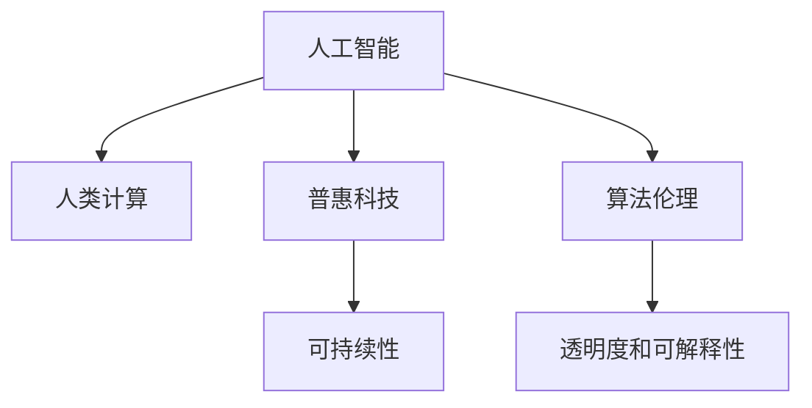

                 

# 科技向善的力量：利用人类计算造福人类

> 关键词：科技向善,人类计算,人工智能,算法伦理,普惠科技,可持续发展

## 1. 背景介绍

### 1.1 问题由来

随着信息技术的高速发展，人工智能(AI)、大数据、云计算等前沿科技正逐渐渗透到各个领域，极大地改变着人类的生活和工作方式。然而，在享受科技带来的便利的同时，我们也必须正视其潜在的伦理和道德问题。特别是在数据隐私、算法偏见、数字鸿沟等方面，科技应用的不当可能会对社会造成严重的负面影响。

面对这些挑战，科技界逐渐意识到，必须将“科技向善”作为科技发展的根本宗旨。这意味着在技术创新和应用推广过程中，不仅要追求效率和效益，还要考虑到社会公平、环境友好、道德责任等方面，确保科技为人类社会带来持久的福祉。

### 1.2 问题核心关键点

科技向善的核心在于通过技术的力量，解决人类社会面临的诸多现实问题。其关键点包括：

- **公平性**：确保科技应用对所有人群（特别是弱势群体）都公平可用，避免技术鸿沟造成社会不公。
- **普惠性**：使科技惠及更多社会成员，提升人类整体福祉，特别是偏远地区和边缘群体。
- **可持续发展**：推动环保、能源节约、资源优化等技术应用，支持全球的可持续发展目标。
- **伦理责任**：在技术开发和应用过程中，坚守伦理道德规范，尊重人权，保护隐私，防止滥用。
- **透明度和可解释性**：提高算法的透明度和可解释性，确保技术决策的透明、公正和可信。

### 1.3 问题研究意义

科技向善的实践不仅关乎技术的进步，更关乎人类社会的和谐发展。通过科技向善，我们可以：

- 促进社会公平与包容，缩小数字鸿沟，让更多人享受到科技进步带来的便利。
- 保护生态环境，实现可持续发展，为后代留下更好的生存空间。
- 增强社会信任，提升公众对技术的接受度和信任度，形成正向循环。
- 推动伦理道德规范的建立和执行，确保技术应用符合人类社会的核心价值观。

## 2. 核心概念与联系

### 2.1 核心概念概述

为更好地理解科技向善的力量，本节将介绍几个关键概念：

- **人工智能(AI)**：利用算法、数据、计算技术，使计算机系统具备类似于人类的智能能力，如学习、推理、决策等。
- **人类计算(Human Computation)**：通过非计算机化的手段，利用人类特有的创造力、直觉、协作等能力，解决计算机难以处理的问题。
- **普惠科技(Inclusive Technology)**：旨在使科技惠及社会各阶层，特别是弱势群体，消除技术鸿沟。
- **可持续性(Sustainability)**：确保技术发展不会对环境造成不可逆转的损害，支持人类社会的长期健康发展。
- **算法伦理(Ethics in Algorithms)**：在算法设计、开发和应用过程中，遵循伦理道德规范，确保算法公正、透明、无害。
- **透明度和可解释性(Transparency and Explainability)**：算法决策过程的公开透明，使得用户能够理解算法的运作机制，增强信任。

这些核心概念之间的联系可以通过以下Mermaid流程图来展示：



这个流程图展示了人工智能、人类计算、普惠科技、可持续性、算法伦理和透明度之间的关系：

1. 人工智能通过吸收人类计算的能力，提升算法的智能水平。
2. 普惠科技利用人工智能，为更多人群提供技术支持。
3. 可持续性指导人工智能和普惠科技的发展方向，避免对环境的损害。
4. 算法伦理确保人工智能在道德上的合规性，避免滥用。
5. 透明度和可解释性提高了算法决策的可信度，增强用户信任。

## 3. 核心算法原理 & 具体操作步骤

### 3.1 算法原理概述

科技向善的力量主要体现在两个方面：通过技术手段解决现实问题，以及通过算法决策确保技术应用的公平性和透明性。

**3.1.1 技术手段的应用**
科技向善的核心在于利用技术手段解决社会问题。这些技术手段包括但不限于：

- **医疗**：通过大数据和AI技术，提高疾病诊断和治疗的准确性，降低医疗成本，实现个性化医疗。
- **教育**：利用AI和人类计算，提供个性化的学习体验，为偏远地区学生提供优质教育资源。
- **环境保护**：开发智能监控系统，实时监测环境污染，优化资源利用，支持可持续发展。
- **灾害管理**：利用AI和机器学习，预测自然灾害，制定应急预案，减少灾害带来的损失。

**3.1.2 算法决策的公平性与透明性**
确保算法决策的公平性和透明性，是科技向善的另一个重要方面。这包括：

- **公平性**：通过偏见检测和算法优化，确保算法在种族、性别、年龄等方面的公平性。
- **透明性**：通过可解释性算法和用户教育，让用户理解算法的决策过程，增强信任。
- **责任分配**：明确算法的责任分配，确保在算法出错时能够追责，维护公平正义。

### 3.2 算法步骤详解

科技向善的算法步骤主要包括以下几个关键环节：

**Step 1: 问题定义**
- 确定科技应用的目标和范围，定义具体问题。
- 通过问卷调查、用户访谈等方式收集需求，确保问题定义的全面性和真实性。

**Step 2: 数据收集**
- 收集与问题相关的数据，包括结构化数据和非结构化数据。
- 确保数据的多样性和代表性，避免数据偏见。

**Step 3: 模型开发**
- 选择合适的算法和模型，进行模型训练和优化。
- 采用多种算法和模型，进行交叉验证，确保模型的稳定性和鲁棒性。

**Step 4: 评估与优化**
- 通过测试集对模型进行评估，衡量其性能和公平性。
- 根据评估结果，对模型进行优化和调整，确保模型在各种场景下的表现。

**Step 5: 部署与应用**
- 将优化后的模型部署到实际应用场景中，进行实时测试。
- 收集用户反馈，不断优化模型，确保算法的实际效果。

**Step 6: 监督与改进**
- 对模型进行持续监督，及时发现和修复问题。
- 根据实际情况，不断改进算法，提升科技向善的效果。

### 3.3 算法优缺点

科技向善的算法具有以下优点：

- **高效率**：利用人工智能和大数据技术，能够快速解决问题，提升效率。
- **普适性**：通过算法优化，可以适应不同地区、不同人群的需求。
- **持续性**：算法模型可以在应用过程中不断优化，持续提升效果。
- **可扩展性**：可以轻松扩展到新的应用场景，提升应用范围。

但同时也存在以下缺点：

- **数据依赖**：算法依赖高质量的数据，数据偏差可能导致算法偏见。
- **技术复杂性**：算法开发和优化需要技术团队的支持，技术门槛较高。
- **透明度不足**：部分算法模型过于复杂，难以解释，用户难以信任。
- **伦理风险**：算法应用中可能存在隐私泄露、滥用等问题，需加以防范。

### 3.4 算法应用领域

科技向善的算法在多个领域得到了广泛应用，主要包括以下几个方面：

**医疗健康**
- 疾病预测与诊断：利用AI和深度学习算法，分析患者病历和医学影像，提高诊断准确性。
- 个性化治疗方案：通过分析患者基因信息和生活习惯，制定个性化治疗方案，提升治疗效果。
- 智能医疗助手：开发智能聊天机器人，提供24小时医疗咨询服务，解答患者疑问。

**教育**
- 个性化学习推荐：利用机器学习算法，根据学生的学习行为和历史数据，推荐个性化的学习资源。
- 虚拟课堂：开发虚拟现实(VR)和增强现实(AR)教学系统，提供沉浸式学习体验。
- 教育数据分析：通过大数据分析，了解学生的学习效果，优化教学方法。

**环境保护**
- 环境监测：利用AI和传感器技术，实时监测大气污染、水质等环境指标，预警环境风险。
- 智能能源管理：开发智能电网系统，优化能源分配，提高能源利用效率。
- 生物多样性保护：通过图像识别和自然语言处理技术，保护野生动植物，防止非法狩猎和偷猎。

**城市管理**
- 智慧交通：利用AI和物联网技术，优化交通信号控制，减少交通拥堵。
- 智能安防：开发智能视频监控系统，实时检测和报警异常行为，提升公共安全。
- 城市应急响应：利用大数据和机器学习，预测和应对自然灾害，制定应急预案。

**农业**
- 精准农业：利用遥感和图像识别技术，优化农业生产，提升农作物产量和质量。
- 农业机器人：开发智能农业机器人，进行农田耕作、施肥、喷洒等操作。
- 农业气象预测：通过大数据分析，预测气象变化，指导农业生产。

**能源**
- 智能电网：利用AI和大数据分析，优化能源分配，提高能源利用效率。
- 可再生能源预测：通过机器学习算法，预测太阳能、风能等可再生能源的发电情况，优化能源配置。
- 能效优化：利用AI和物联网技术，优化工业生产过程中的能效管理，降低能源消耗。

## 4. 数学模型和公式 & 详细讲解 & 举例说明

### 4.1 数学模型构建

本节将使用数学语言对科技向善的算法模型进行更加严格的刻画。

假设科技应用的目标是解决某个特定问题，其算法模型为 $M$，输入为 $X$，输出为 $Y$。在数据集 $D$ 上的经验风险定义为：

$$
\mathcal{L}(M) = \frac{1}{N}\sum_{i=1}^N \ell(M(x_i), y_i)
$$

其中 $\ell$ 为损失函数，$\mathcal{L}$ 为模型在训练集上的平均损失。

### 4.2 公式推导过程

以下我们以医疗疾病预测为例，推导基于机器学习的算法模型。

假设输入为患者的医疗记录 $x$，输出为疾病的概率 $y$。一个常见的医疗预测模型是逻辑回归(Logistic Regression)，其预测概率为：

$$
\hat{y} = \sigma(W^T x + b)
$$

其中 $W$ 和 $b$ 为模型的参数，$\sigma$ 为sigmoid函数，$x$ 为输入特征，$y$ 为真实标签。

使用交叉熵损失函数，损失函数为：

$$
\ell(y, \hat{y}) = -(y \log \hat{y} + (1-y) \log (1-\hat{y}))
$$

通过反向传播算法，计算损失函数对参数 $W$ 和 $b$ 的梯度，更新模型参数。

### 4.3 案例分析与讲解

以医疗疾病预测为例，假设我们有一个糖尿病预测模型，其结构如下：

```
(输入层) [特征提取层] --> [隐含层1] --> [隐含层2] --> [输出层]
```

其中输入为患者的年龄、性别、体重、血压等特征，输出为糖尿病的发病概率。

我们使用交叉熵损失函数对模型进行训练，其步骤如下：

1. 收集糖尿病患者的历史医疗数据，将数据划分为训练集和测试集。
2. 使用特征提取层将输入特征转换为模型的输入向量。
3. 在前向传播中，将输入向量输入模型，计算输出概率。
4. 使用交叉熵损失函数计算损失，反向传播更新模型参数。
5. 重复步骤2-4，直至模型在测试集上达到理想的预测准确率。

## 5. 项目实践：代码实例和详细解释说明

### 5.1 开发环境搭建

在进行科技向善的算法实践前，我们需要准备好开发环境。以下是使用Python进行PyTorch开发的环境配置流程：

1. 安装Anaconda：从官网下载并安装Anaconda，用于创建独立的Python环境。

2. 创建并激活虚拟环境：
```bash
conda create -n pytorch-env python=3.8 
conda activate pytorch-env
```

3. 安装PyTorch：根据CUDA版本，从官网获取对应的安装命令。例如：
```bash
conda install pytorch torchvision torchaudio cudatoolkit=11.1 -c pytorch -c conda-forge
```

4. 安装TensorFlow：
```bash
pip install tensorflow
```

5. 安装各类工具包：
```bash
pip install numpy pandas scikit-learn matplotlib tqdm jupyter notebook ipython
```

完成上述步骤后，即可在`pytorch-env`环境中开始科技向善的算法实践。

### 5.2 源代码详细实现

下面我们以医疗疾病预测为例，给出使用PyTorch进行疾病预测的PyTorch代码实现。

首先，定义医疗数据处理函数：

```python
from torch.utils.data import Dataset
import torch

class MedicalDataset(Dataset):
    def __init__(self, data, labels, tokenizer):
        self.data = data
        self.labels = labels
        self.tokenizer = tokenizer
        self.max_len = 512
        
    def __len__(self):
        return len(self.data)
    
    def __getitem__(self, item):
        text = self.data[item]
        label = self.labels[item]
        
        encoding = self.tokenizer(text, return_tensors='pt', max_length=self.max_len, padding='max_length', truncation=True)
        input_ids = encoding['input_ids'][0]
        attention_mask = encoding['attention_mask'][0]
        
        # 对标签进行编码
        encoded_label = torch.tensor(label, dtype=torch.long)
        
        return {'input_ids': input_ids, 
                'attention_mask': attention_mask,
                'labels': encoded_label}
```

然后，定义模型和优化器：

```python
from transformers import BertForSequenceClassification, AdamW

model = BertForSequenceClassification.from_pretrained('bert-base-uncased', num_labels=2)

optimizer = AdamW(model.parameters(), lr=2e-5)
```

接着，定义训练和评估函数：

```python
from torch.utils.data import DataLoader
from tqdm import tqdm
from sklearn.metrics import accuracy_score, confusion_matrix

device = torch.device('cuda') if torch.cuda.is_available() else torch.device('cpu')
model.to(device)

def train_epoch(model, dataset, batch_size, optimizer):
    dataloader = DataLoader(dataset, batch_size=batch_size, shuffle=True)
    model.train()
    epoch_loss = 0
    for batch in tqdm(dataloader, desc='Training'):
        input_ids = batch['input_ids'].to(device)
        attention_mask = batch['attention_mask'].to(device)
        labels = batch['labels'].to(device)
        model.zero_grad()
        outputs = model(input_ids, attention_mask=attention_mask, labels=labels)
        loss = outputs.loss
        epoch_loss += loss.item()
        loss.backward()
        optimizer.step()
    return epoch_loss / len(dataloader)

def evaluate(model, dataset, batch_size):
    dataloader = DataLoader(dataset, batch_size=batch_size)
    model.eval()
    preds, labels = [], []
    with torch.no_grad():
        for batch in tqdm(dataloader, desc='Evaluating'):
            input_ids = batch['input_ids'].to(device)
            attention_mask = batch['attention_mask'].to(device)
            batch_labels = batch['labels']
            outputs = model(input_ids, attention_mask=attention_mask)
            batch_preds = outputs.logits.argmax(dim=1).to('cpu').tolist()
            batch_labels = batch_labels.to('cpu').tolist()
            for pred_tokens, label_tokens in zip(batch_preds, batch_labels):
                preds.append(pred_tokens)
                labels.append(label_tokens)
                
    print('Accuracy: {:.4f}%'.format(accuracy_score(labels, preds)))
    print('Confusion Matrix:')
    print(confusion_matrix(labels, preds))
```

最后，启动训练流程并在测试集上评估：

```python
epochs = 5
batch_size = 16

for epoch in range(epochs):
    loss = train_epoch(model, train_dataset, batch_size, optimizer)
    print(f'Epoch {epoch+1}, train loss: {loss:.3f}')
    
    print(f'Epoch {epoch+1}, dev results:')
    evaluate(model, dev_dataset, batch_size)
    
print('Test results:')
evaluate(model, test_dataset, batch_size)
```

以上就是使用PyTorch对医疗疾病预测模型进行训练的完整代码实现。可以看到，利用PyTorch和Transformers库，我们可以快速构建并训练一个基本的疾病预测模型。

### 5.3 代码解读与分析

让我们再详细解读一下关键代码的实现细节：

**MedicalDataset类**：
- `__init__`方法：初始化数据、标签、分词器等组件。
- `__len__`方法：返回数据集的样本数量。
- `__getitem__`方法：对单个样本进行处理，将文本输入转换为token ids，对标签进行编码，并进行定长padding。

**模型和优化器**：
- `model`变量：使用BertForSequenceClassification模型作为疾病预测模型的基础。
- `optimizer`变量：设置AdamW优化器及其超参数。

**训练和评估函数**：
- `train_epoch`函数：对数据以批为单位进行迭代，在前向传播中计算损失并反向传播更新模型参数，最后返回该epoch的平均loss。
- `evaluate`函数：与训练类似，不同点在于不更新模型参数，并在每个batch结束后将预测和标签结果存储下来，最后使用sklearn的accuracy_score和confusion_matrix对整个评估集的预测结果进行打印输出。

**训练流程**：
- 定义总的epoch数和batch size，开始循环迭代。
- 每个epoch内，先在训练集上训练，输出平均loss。
- 在验证集上评估，输出准确率和混淆矩阵。
- 所有epoch结束后，在测试集上评估，给出最终的测试结果。

## 6. 实际应用场景

### 6.1 智能医疗

科技向善在智能医疗领域具有广泛的应用前景。通过科技向善，可以实现以下几个方面的突破：

**疾病预测与诊断**
- 利用AI和深度学习算法，分析患者病历和医学影像，提高诊断准确性。
- 开发智能诊断系统，辅助医生进行疾病预测和诊断。

**个性化治疗方案**
- 通过分析患者基因信息和生活习惯，制定个性化治疗方案，提升治疗效果。
- 开发智能治疗助手，实时监控患者健康状况，调整治疗方案。

**医疗资源优化**
- 通过大数据分析，优化医疗资源的配置和分配，提高医疗效率。
- 开发智能调度系统，优化医院床位、设备等资源的利用率。

### 6.2 教育公平

教育公平是科技向善的重要目标之一。通过科技向善，可以实现以下突破：

**个性化学习推荐**
- 利用机器学习算法，根据学生的学习行为和历史数据，推荐个性化的学习资源。
- 开发智能学习系统，提供个性化学习路径和辅导。

**虚拟课堂**
- 开发虚拟现实(VR)和增强现实(AR)教学系统，提供沉浸式学习体验。
- 提供远程教学资源，帮助偏远地区学生获取优质教育资源。

**教育数据分析**
- 通过大数据分析，了解学生的学习效果，优化教学方法。
- 开发智能评估系统，实时监测学生学习进度和效果。

### 6.3 环境保护

环境保护是科技向善的重要领域之一。通过科技向善，可以实现以下突破：

**环境监测**
- 利用AI和传感器技术，实时监测大气污染、水质等环境指标，预警环境风险。
- 开发智能监测系统，实现环境数据的自动采集和分析。

**智能能源管理**
- 开发智能电网系统，优化能源分配，提高能源利用效率。
- 利用机器学习算法，预测太阳能、风能等可再生能源的发电情况，优化能源配置。

**生物多样性保护**
- 通过图像识别和自然语言处理技术，保护野生动植物，防止非法狩猎和偷猎。
- 开发智能监控系统，实时监测野生动物活动，预警偷猎行为。

### 6.4 未来应用展望

展望未来，科技向善的应用前景将更加广阔，具体包括以下几个方向：

**可持续发展**
- 推动环保、能源节约、资源优化等技术应用，支持全球的可持续发展目标。
- 开发智能可持续发展平台，监测和评估全球环境变化。

**社会治理**
- 利用AI和大数据技术，提升城市管理水平，提高公共安全。
- 开发智能应急响应系统，实时监测和应对自然灾害。

**普惠科技**
- 利用普惠科技，为更多人群提供技术支持，消除技术鸿沟。
- 开发智能普惠平台，提供免费或低成本的科技服务。

## 7. 工具和资源推荐

### 7.1 学习资源推荐

为了帮助开发者系统掌握科技向善的力量，这里推荐一些优质的学习资源：

1. 《科技向善的力量》系列博文：由大模型技术专家撰写，深入浅出地介绍了科技向善的核心概念、应用场景和实现方法。
2. 《人工智能伦理与法律》课程：北京大学开设的AI伦理与法律课程，涵盖了AI伦理、法律和治理等核心内容。
3. 《可持续性技术》书籍：介绍可持续发展技术的应用和实践，强调技术与环境的协调发展。
4. 《普惠科技：缩小数字鸿沟》报告：分析普惠科技的发展现状和未来趋势，提出可行的推广策略。
5. 《算法透明性与可解释性》书籍：介绍算法的透明性和可解释性，提升算法的可信度。

通过对这些资源的学习实践，相信你一定能够快速掌握科技向善的力量，并用于解决实际的NLP问题。

### 7.2 开发工具推荐

高效的开发离不开优秀的工具支持。以下是几款用于科技向善的算法开发常用的工具：

1. PyTorch：基于Python的开源深度学习框架，灵活动态的计算图，适合快速迭代研究。
2. TensorFlow：由Google主导开发的开源深度学习框架，生产部署方便，适合大规模工程应用。
3. HuggingFace Transformers：提供丰富的预训练语言模型，支持PyTorch和TensorFlow，是进行NLP任务开发的利器。
4. Weights & Biases：模型训练的实验跟踪工具，可以记录和可视化模型训练过程中的各项指标，方便对比和调优。
5. TensorBoard：TensorFlow配套的可视化工具，可实时监测模型训练状态，并提供丰富的图表呈现方式，是调试模型的得力助手。

合理利用这些工具，可以显著提升科技向善的算法开发效率，加快创新迭代的步伐。

### 7.3 相关论文推荐

科技向善的研究源于学界的持续研究。以下是几篇奠基性的相关论文，推荐阅读：

1. "Towards an Ethical Framework for AI"：提出了一套完整的AI伦理框架，涵盖公平性、透明度、责任分配等多个方面。
2. "Sustainable AI for the Planet"：介绍了一系列可持续性AI技术的应用，强调AI与环境的协调发展。
3. "Human-Centered AI for Fairness and Inclusion"：提出了一系列普惠科技的应用，提升AI的可及性和公平性。
4. "AI Transparency and Explainability"：探讨了算法的透明性和可解释性，提升算法的可信度。
5. "Ethical Algorithms for Social Good"：提出了一系列伦理算法的应用，推动AI技术的社会价值。

这些论文代表了大模型技术的研究方向，通过学习这些前沿成果，可以帮助研究者把握学科前进方向，激发更多的创新灵感。

## 8. 总结：未来发展趋势与挑战

### 8.1 总结

本文对科技向善的力量进行了全面系统的介绍。首先阐述了科技向善的核心思想和研究背景，明确了科技向善在解决社会问题、提升技术公平性等方面的重要性。其次，从原理到实践，详细讲解了科技向善的算法模型和具体实现步骤，给出了科技向善的代码实例。同时，本文还广泛探讨了科技向善在多个领域的应用前景，展示了其广泛的应用价值。最后，本文精选了科技向善的学习资源、开发工具和相关论文，力求为读者提供全方位的技术指引。

通过本文的系统梳理，可以看到，科技向善的力量主要体现在通过技术手段解决现实问题，以及通过算法决策确保技术应用的公平性和透明性。未来，科技向善的发展将在更多领域得到应用，为人类社会带来持久的福祉。

### 8.2 未来发展趋势

展望未来，科技向善的发展将呈现以下几个趋势：

1. **普适性增强**：随着技术的进步，科技向善将更加普及，惠及更多社会成员，特别是在偏远地区和弱势群体中。
2. **模型透明性提升**：通过可解释性算法和用户教育，增强算法的透明性和可信度。
3. **伦理规范完善**：建立更加完善的AI伦理规范，确保算法在道德上的合规性。
4. **可持续发展支持**：推动环保、能源节约、资源优化等技术应用，支持全球的可持续发展目标。
5. **多领域应用拓展**：在医疗、教育、环境保护、城市管理等多个领域中，进一步拓展科技向善的应用场景。

### 8.3 面临的挑战

尽管科技向善的发展前景广阔，但在实践中仍面临诸多挑战：

1. **数据质量问题**：高质量的数据是科技向善的基础，但数据获取和标注成本较高。
2. **算法公平性**：科技向善的算法可能存在偏见，需要进一步优化和验证。
3. **资源限制**：科技向善的实现需要高性能计算资源和专业人才，资源配置成本较高。
4. **伦理责任**：在算法应用中，如何确保透明性和责任分配，是亟待解决的问题。
5. **社会接受度**：科技向善的推广需要公众的接受和信任，如何提高社会接受度，是科技向善面临的重要挑战。

### 8.4 研究展望

面对科技向善所面临的诸多挑战，未来的研究需要在以下几个方面寻求新的突破：

1. **数据共享与合作**：建立数据共享机制，促进科技向善的规模化和标准化。
2. **算法优化与验证**：开发更加公平、透明的算法，确保算法的道德合规性。
3. **资源优化与管理**：优化资源配置，降低科技向善的实施成本，提高资源利用效率。
4. **社会教育与普及**：加强公众的AI教育和科技普及，提高社会对科技向善的接受度和信任度。
5. **国际合作与标准**：加强国际合作，制定AI伦理和标准，推动全球科技向善的发展。

这些研究方向的探索，必将引领科技向善技术迈向更高的台阶，为构建安全、可靠、可解释、可控的智能系统铺平道路。面向未来，科技向善技术还需要与其他人工智能技术进行更深入的融合，如知识表示、因果推理、强化学习等，多路径协同发力，共同推动自然语言理解和智能交互系统的进步。只有勇于创新、敢于突破，才能不断拓展语言模型的边界，让智能技术更好地造福人类社会。

## 9. 附录：常见问题与解答

**Q1：科技向善与企业盈利冲突吗？**

A: 科技向善与企业盈利并不矛盾。事实上，通过科技向善，企业可以提升社会声誉，吸引更多的用户和市场份额，从而实现长期盈利。例如，企业可以通过帮助社会公益项目，提升品牌形象，吸引更多客户。

**Q2：科技向善在资源有限的情况下如何实施？**

A: 科技向善的实施需要多方面的资源支持，包括数据、技术、资金等。在资源有限的情况下，可以采取以下措施：
- 利用开源资源，借助社区力量，降低开发成本。
- 选择合适的技术方案，优化算法和模型，提高资源利用效率。
- 逐步实施，分阶段推进，逐步扩大规模。

**Q3：科技向善如何避免技术滥用？**

A: 科技向善需要通过制度和技术手段，防止技术滥用。具体措施包括：
- 建立伦理审查机制，确保技术应用符合道德规范。
- 开发透明度和可解释性算法，让用户理解技术决策过程。
- 建立监管和反馈机制，及时发现和纠正技术滥用行为。

**Q4：科技向善与隐私保护冲突吗？**

A: 科技向善和隐私保护可以并行不悖。通过科技向善，可以更好地保护用户隐私。例如，开发隐私保护的智能监控系统，实时监测环境数据，同时保护用户隐私。

**Q5：科技向善如何确保长期可持续性？**

A: 科技向善的长期可持续性需要从多个方面加以保障：
- 开发环保、节能、资源优化的技术，支持可持续发展目标。
- 建立合理的资源分配机制，确保科技向善的长期投入和支持。
- 加强公众教育，提升社会对科技向善的认同和支持。

---

作者：禅与计算机程序设计艺术 / Zen and the Art of Computer Programming

