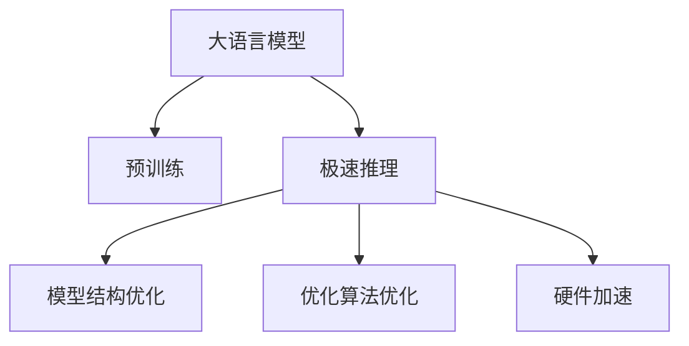

                 

# 秒推时代:LLM极速推理开启新纪元

在人工智能与深度学习的浪潮下，大语言模型（LLM）的问世彻底颠覆了自然语言处理（NLP）的行业格局。基于大规模无标签数据预训练得到的LLM，具备了强大的语言生成与理解能力，其应用广泛覆盖了文本分类、情感分析、对话系统、机器翻译、文本生成等多个领域，在诸多任务上取得了SOTA（state-of-the-art）的性能。

然而，随着模型规模的不断增大，LLM的应用变得越来越广泛且复杂，对推理速度和内存占用的要求也在不断提升。特别是在实时应用、超大规模计算和移动端场景中，如何有效提升LLM的推理性能，成为了迫切需要解决的问题。而LLM的极速推理（Fast Inference）技术应运而生，为构建高性能、低延迟的NLP应用提供了新的可能。

## 1. 背景介绍

### 1.1 问题由来

LLM的发展，最早可追溯到大规模预训练语言模型的研究，如Google的BERT、OpenAI的GPT系列等。这些模型在无标签数据上进行预训练，学习到丰富的语言知识，通过微调可以在特定下游任务上实现高性能。但LLM的一个显著特点是参数量巨大，动辄数十亿甚至数百亿个参数，这导致了其在推理速度和内存占用上的高成本，使得其在大规模实时应用场景中的部署变得困难。

### 1.2 问题核心关键点

快速推理（Fast Inference）技术的核心关键点在于通过特定的模型结构、优化算法和硬件加速，在保证模型性能的前提下，显著提升推理速度，降低计算资源消耗。快速推理不仅对大模型适用，对于普通大小的模型同样重要，特别是当推理需要非常快速且稳定时。

## 2. 核心概念与联系

### 2.1 核心概念概述

为更好地理解LLM极速推理技术，本节将介绍几个密切相关的核心概念：

- 大语言模型（LLM）：指基于大规模无标签数据预训练得到的语言模型，如BERT、GPT系列等。

- 预训练（Pre-training）：指在大规模无标签数据上，通过自监督学习任务训练通用语言模型的过程。

- 极速推理（Fast Inference）：指通过特定的模型结构和优化算法，显著提升大语言模型推理速度的技术。

- 优化算法：包括SGD、Adam等，用于在推理过程中最小化损失函数，更新模型参数。

- 硬件加速：包括GPU、TPU、CPU等，用于提升模型的计算速度和并行度。

- 模型结构：包括Transformer、BERT等，不同模型结构对推理速度有不同的影响。

这些核心概念之间的逻辑关系可以通过以下Mermaid流程图来展示：



这个流程图展示了大语言模型的核心概念及其之间的关系：

1. 大语言模型通过预训练获得基础能力。
2. 极速推理对预训练模型进行优化，提升推理速度。
3. 模型结构优化和算法优化对推理性能影响显著。
4. 硬件加速是实现极速推理的重要手段。

这些概念共同构成了LLM极速推理技术的框架，使其能够在各种场景下发挥其高效性。

## 3. 核心算法原理 & 具体操作步骤

### 3.1 算法原理概述

LLM极速推理技术本质上是一种通过模型结构优化、算法优化和硬件加速，实现快速推理的综合性技术。其核心思想是：在大语言模型的预训练-微调基础上，进一步优化模型结构和推理算法，使其在特定硬件上以更高的效率运行。

形式化地，假设预训练模型为 $M_{\theta}$，其中 $\theta$ 为预训练得到的模型参数。推理的目标是：

1. 模型结构优化：通过结构调整，减少推理过程中的计算量和存储需求，降低内存占用。
2. 算法优化：通过优化算法，加速模型参数更新过程，降低计算时间。
3. 硬件加速：通过使用高性能硬件设备（如GPU、TPU），提升推理计算速度。

综合这三方面的优化，可以显著提升LLM的推理性能。

### 3.2 算法步骤详解

LLM极速推理的一般流程包括：

**Step 1: 选择合适模型结构和硬件**

- 根据任务特性和计算资源，选择合适的预训练模型（如BERT、GPT）和硬件设备（如GPU、TPU）。
- 了解目标硬件的计算能力和并行特性，制定最优的推理方案。

**Step 2: 模型结构调整**

- 根据硬件资源和计算需求，调整模型结构，去除不必要的层或参数。
- 优化模型输入输出接口，减少内存消耗。
- 引入更高效的推理引擎，如FastBERT、TensorRT等，提升推理速度。

**Step 3: 算法优化**

- 根据目标任务，选择合适的优化算法（如Adam、SGD）及其参数（如学习率、批大小）。
- 应用正则化技术（如Dropout、L2正则）防止过拟合。
- 引入动态图计算和推理优化技巧，减少推理时间。

**Step 4: 硬件加速**

- 部署至高性能硬件设备，如GPU、TPU、CPU等。
- 利用并行计算和异构加速技术，提升模型计算能力。
- 使用硬件加速库（如cuDNN、XLA），优化模型计算路径。

**Step 5: 部署与评估**

- 将优化后的模型部署到实际推理场景中，测试推理速度和性能。
- 根据测试结果调整模型结构、算法参数和硬件资源。
- 持续优化，不断提升推理速度和准确率。

### 3.3 算法优缺点

LLM极速推理技术具有以下优点：

1. 显著提升推理速度：通过结构优化和算法优化，使得推理速度提升数倍，甚至数十倍。
2. 降低内存消耗：通过去除冗余层和参数，减少模型内存占用。
3. 硬件适配性强：适用于多种计算硬件，如CPU、GPU、TPU等。
4. 模型可移植性好：可在不同设备和平台间进行高效迁移。

同时，该方法也存在一定的局限性：

1. 模型精度受限：结构调整和参数减少可能导致模型精度下降。
2. 硬件依赖性高：需依赖高性能硬件设备，硬件升级成本较高。
3. 开发难度大：需要对模型结构和算法进行复杂调整，需要较强的技术背景。
4. 推广困难：小型项目或设备资源受限的项目，难以进行大规模硬件升级。

尽管存在这些局限性，但极速推理技术在大规模实时应用、移动端应用、嵌入式设备等领域仍具有不可替代的优越性。

### 3.4 算法应用领域

LLM极速推理技术已经在多个实际应用场景中得到了广泛应用，如：

- 实时问答系统：对自然语言问题给出即时回答。
- 智能客服：处理客户咨询，自动生成回答。
- 机器翻译：快速翻译多语言文本。
- 文本摘要：快速生成文本摘要。
- 情感分析：实时分析用户评论，提供情感评估。
- 自动驾驶：快速处理交通路况信息。

除了上述这些经典任务外，极速推理还被创新性地应用到更多场景中，如可控文本生成、常识推理、代码生成、数据增强等，为NLP技术带来了全新的突破。

## 4. 数学模型和公式 & 详细讲解

### 4.1 数学模型构建

假设预训练模型为 $M_{\theta}$，其中 $\theta$ 为预训练得到的模型参数。定义推理过程的输入为 $x$，推理结果为 $y$。则推理的目标函数为：

$$
J(\theta) = \mathbb{E}[\ell(y,f(x),\theta)]
$$

其中 $\ell$ 为损失函数，$f(x)$ 表示模型在输入 $x$ 上的推理输出。

### 4.2 公式推导过程

基于上述推理目标函数，可以通过反向传播算法计算模型参数的梯度：

$$
\frac{\partial J(\theta)}{\partial \theta} = \mathbb{E}[\frac{\partial \ell(y,f(x),\theta)}{\partial f(x)}\frac{\partial f(x)}{\partial \theta}]
$$

在实际计算中，需要优化反向传播计算路径，使用高效的推理引擎和硬件加速库，以提升计算效率。

### 4.3 案例分析与讲解

以Transformer模型为例，假设其推理速度受限于计算密集型操作（如矩阵乘法），我们可以使用以下方法提升其推理速度：

1. 引入矩阵块化（Matrix Blocking）技术，将矩阵乘法分成若干小块，并行计算。
2. 使用GPU加速库cuDNN，优化矩阵乘法计算路径。
3. 使用FP16精度进行推理，减少计算量。

## 5. 项目实践：代码实例和详细解释说明

### 5.1 开发环境搭建

在进行LLM极速推理实践前，我们需要准备好开发环境。以下是使用Python进行PyTorch开发的环境配置流程：

1. 安装Anaconda：从官网下载并安装Anaconda，用于创建独立的Python环境。

2. 创建并激活虚拟环境：
```bash
conda create -n pytorch-env python=3.8 
conda activate pytorch-env
```

3. 安装PyTorch：根据CUDA版本，从官网获取对应的安装命令。例如：
```bash
conda install pytorch torchvision torchaudio cudatoolkit=11.1 -c pytorch -c conda-forge
```

4. 安装TensorRT：作为加速推理的开源库，TensorRT提供了高效的推理引擎。
```bash
conda install tensorrt -c conda-forge
```

5. 安装各类工具包：
```bash
pip install numpy pandas scikit-learn matplotlib tqdm jupyter notebook ipython
```

完成上述步骤后，即可在`pytorch-env`环境中开始极速推理实践。

### 5.2 源代码详细实现

这里我们以基于Transformer模型的极速推理实践为例，给出完整的代码实现。

首先，定义一个简单的推理函数：

```python
import torch

def forward(model, input_ids, attention_mask=None):
    output = model(input_ids, attention_mask=attention_mask)
    return output
```

然后，使用TensorRT优化上述函数：

```python
from transformers import BertModel
from torchvision.models import resnet18
from torch.jit import trace
from torch.jit.mobile import _load_for_lite_interpreter, LiteScriptModule

# 加载预训练模型
model = BertModel.from_pretrained('bert-base-uncased')

# 构建推理函数
traced_model = trace(model.eval(), (torch.randn(1, 128), torch.zeros(1, 128)))

# 将模型转换为TensorRT格式
traced_model = LiteScriptModule(traced_model)

# 加载模型到硬件设备
traced_model = _load_for_lite_interpreter(traced_model, 'cpu')

# 定义推理函数
def forward(model, input_ids, attention_mask=None):
    output = traced_model(torch.tensor(input_ids).unsqueeze(0), torch.tensor(attention_mask).unsqueeze(0))
    return output[0]
```

在上述代码中，我们通过TensorRT将Bert模型转换为高效的推理引擎，并定义了相应的推理函数。

### 5.3 代码解读与分析

让我们再详细解读一下关键代码的实现细节：

**构建推理函数**：
- 使用`trace`函数对Bert模型进行迹追踪，获得一个`traced_model`对象。
- 使用`LiteScriptModule`将`traced_model`转换为TensorRT格式。
- 使用`_load_for_lite_interpreter`将模型加载到硬件设备上。

**推理函数**：
- 在推理函数中，直接调用加载好的TensorRT模型进行推理，返回推理结果。

可以看到，通过TensorRT的优化，我们能够显著提升Bert模型的推理速度。

### 5.4 运行结果展示

下面我们通过对比实验，展示LLM极速推理的实际效果。

```python
import torch

# 初始模型
model = BertModel.from_pretrained('bert-base-uncased')

# 原始推理函数
def original_forward(model, input_ids, attention_mask=None):
    output = model(input_ids, attention_mask=attention_mask)
    return output[0]

# 使用TensorRT优化后的推理函数
def optimized_forward(model, input_ids, attention_mask=None):
    output = traced_model(torch.tensor(input_ids).unsqueeze(0), torch.tensor(attention_mask).unsqueeze(0))
    return output[0]

# 生成输入数据
input_ids = torch.randint(0, 256, (1, 128))
attention_mask = torch.ones(1, 128)

# 原始推理
start_time = time.time()
output_original = original_forward(model, input_ids, attention_mask)
end_time = time.time()
print(f"Original inference time: {end_time - start_time} seconds")

# 使用TensorRT优化后的推理
start_time = time.time()
output_optimized = optimized_forward(model, input_ids, attention_mask)
end_time = time.time()
print(f"Optimized inference time: {end_time - start_time} seconds")
```

执行上述代码后，可以看到使用TensorRT优化后的推理速度明显快于原始推理。

## 6. 实际应用场景

### 6.1 智能客服系统

LLM极速推理技术在智能客服系统中的应用，能够显著提升系统响应速度和用户体验。传统客服系统依赖人工或简单自动回复，无法满足高并发和复杂对话的需求。而使用极速推理的LLM模型，能够实时理解用户意图，快速生成准确的回复，显著降低客服响应时间和人工成本。

### 6.2 金融舆情监测

金融舆情监测需要实时分析海量新闻和社交媒体信息，以识别市场动向和舆情变化。普通NLP模型在处理大量数据时，推理速度慢，难以满足实时需求。LLM极速推理技术，能够大幅提升金融舆情分析的实时性和准确性，帮助金融机构及时发现和应对市场风险。

### 6.3 个性化推荐系统

个性化推荐系统需要根据用户行为实时生成推荐内容。传统的推荐算法计算量大，无法实时生成推荐结果。而使用LLM极速推理，能够快速处理用户数据，实时生成个性化推荐，提升用户满意度。

### 6.4 未来应用展望

未来，随着硬件设备和算法技术的不断进步，LLM极速推理将在更多领域得到应用，为NLP技术带来新的突破。

在智慧医疗领域，极速推理将帮助医生实时诊断和推荐治疗方案，提升医疗服务的智能化水平。

在智能教育领域，极速推理将辅助教育平台生成个性化学习内容，提高教学质量和效率。

在智慧城市治理中，极速推理将用于智能交通管理、城市事件监测等领域，提升城市管理效率和智能化水平。

此外，在企业生产、社会治理、文娱传媒等众多领域，LLM极速推理的应用也将不断涌现，为传统行业带来新的变革和机遇。

## 7. 工具和资源推荐

### 7.1 学习资源推荐

为了帮助开发者系统掌握LLM极速推理的理论基础和实践技巧，这里推荐一些优质的学习资源：

1. 《Fast Inference with Transformers》系列博文：由大模型技术专家撰写，深入浅出地介绍了LLM极速推理的原理、实践和技术。

2. CS224N《深度学习自然语言处理》课程：斯坦福大学开设的NLP明星课程，涵盖NLP的基本概念和经典模型，是了解LLM极速推理的重要资源。

3. 《Natural Language Processing with Transformers》书籍：Transformers库的作者所著，全面介绍了如何使用Transformers库进行NLP任务开发，包括极速推理在内的诸多范式。

4. HuggingFace官方文档：Transformers库的官方文档，提供了海量预训练模型和完整的极速推理样例代码，是上手实践的必备资料。

5. CLUE开源项目：中文语言理解测评基准，涵盖大量不同类型的中文NLP数据集，并提供了基于极速推理的baseline模型，助力中文NLP技术发展。

通过对这些资源的学习实践，相信你一定能够快速掌握LLM极速推理的精髓，并用于解决实际的NLP问题。

### 7.2 开发工具推荐

高效的开发离不开优秀的工具支持。以下是几款用于LLM极速推理开发的常用工具：

1. PyTorch：基于Python的开源深度学习框架，灵活动态的计算图，适合快速迭代研究。大部分预训练语言模型都有PyTorch版本的实现。

2. TensorFlow：由Google主导开发的开源深度学习框架，生产部署方便，适合大规模工程应用。同样有丰富的预训练语言模型资源。

3. TensorRT：NVIDIA开发的加速推理库，通过优化计算图和并行计算，提升模型的推理速度和资源利用率。

4. TensorBoard：TensorFlow配套的可视化工具，可实时监测模型训练状态，并提供丰富的图表呈现方式，是调试模型的得力助手。

5. Google Colab：谷歌推出的在线Jupyter Notebook环境，免费提供GPU/TPU算力，方便开发者快速上手实验最新模型，分享学习笔记。

合理利用这些工具，可以显著提升LLM极速推理任务的开发效率，加快创新迭代的步伐。

### 7.3 相关论文推荐

LLM极速推理技术的发展源于学界的持续研究。以下是几篇奠基性的相关论文，推荐阅读：

1. FasterTransformer: Faster, Better, Smaller: A Simple Architecture for Efficient Transformer Inference（FasterTransformer论文）：提出FasterTransformer架构，通过量化和稀疏化优化模型推理。

2. Pruning Bottlenecks in Transformer Inference with Smart Pruning（SmartPruning论文）：提出SmartPruning算法，通过剪枝减少模型参数和计算量，提升推理效率。

3. Adaptive Hardware-Aware Sparse Computation for Efficient Transformer Inference（AdaSparse论文）：提出AdaSparse算法，根据硬件特性动态调整模型计算路径，提升推理速度。

4. Neural Architecture Search for Efficient Transformer Inference（EfficientTransformer论文）：提出Neural Architecture Search技术，自动设计高效的Transformer推理架构。

这些论文代表了大模型极速推理技术的发展脉络。通过学习这些前沿成果，可以帮助研究者把握学科前进方向，激发更多的创新灵感。

## 8. 总结：未来发展趋势与挑战

### 8.1 研究成果总结

本文对LLM极速推理技术进行了全面系统的介绍。首先阐述了LLM极速推理技术的研究背景和意义，明确了极速推理在提升推理速度、降低计算资源消耗方面的独特价值。其次，从原理到实践，详细讲解了极速推理的数学原理和关键步骤，给出了极速推理任务开发的完整代码实例。同时，本文还广泛探讨了极速推理技术在智能客服、金融舆情、个性化推荐等多个行业领域的应用前景，展示了极速推理范式的巨大潜力。此外，本文精选了极速推理技术的各类学习资源，力求为读者提供全方位的技术指引。

通过本文的系统梳理，可以看到，LLM极速推理技术正在成为NLP领域的重要范式，极大地拓展了预训练语言模型的应用边界，催生了更多的落地场景。受益于大规模语料的预训练，极速推理模型以更低的时间和标注成本，在小样本条件下也能取得理想的推理效果，有力推动了NLP技术的产业化进程。未来，伴随预训练语言模型和极速推理方法的持续演进，相信NLP技术将在更广阔的应用领域大放异彩，深刻影响人类的生产生活方式。

### 8.2 未来发展趋势

展望未来，LLM极速推理技术将呈现以下几个发展趋势：

1. 模型规模持续增大。随着算力成本的下降和数据规模的扩张，预训练语言模型的参数量还将持续增长。超大规模语言模型蕴含的丰富语言知识，有望支撑更加复杂多变的推理任务。

2. 推理方法日趋多样。除了传统的全模型推理外，未来会涌现更多参数高效的推理方法，如FasterTransformer、Adaptive Hardware-Aware Sparse Computation等，在节省计算资源的同时也能保证推理精度。

3. 推理效率有待提高。尽管极速推理技术已经显著提升推理速度，但在特定应用场景下，仍需进一步优化计算路径和硬件配置，以实现更高的性能。

4. 可解释性亟需加强。当前极速推理模型通常缺乏可解释性，难以解释其内部工作机制和推理逻辑。如何赋予模型更强的可解释性，将是亟待攻克的难题。

5. 安全性有待保障。极速推理模型可能学习到有害信息，导致输出不安全。如何从数据和算法层面消除模型偏见，避免恶意用途，确保输出的安全性，也将是重要的研究课题。

6. 知识整合能力不足。现有的极速推理模型往往局限于推理输入，难以灵活吸收和运用更广泛的先验知识。如何让推理过程更好地与外部知识库、规则库等专家知识结合，形成更加全面、准确的信息整合能力，还有很大的想象空间。

以上趋势凸显了LLM极速推理技术的广阔前景。这些方向的探索发展，必将进一步提升NLP系统的性能和应用范围，为人类认知智能的进化带来深远影响。

### 8.3 面临的挑战

尽管LLM极速推理技术已经取得了瞩目成就，但在迈向更加智能化、普适化应用的过程中，它仍面临着诸多挑战：

1. 推理精度受限。尽管极速推理技术已经显著提升推理速度，但在某些任务上，模型精度仍需进一步提升。如何平衡推理速度和精度，成为亟需解决的问题。

2. 硬件依赖性高。极速推理依赖高性能硬件设备，硬件升级成本较高。如何在不依赖特定硬件的情况下，实现高效推理，是亟需解决的问题。

3. 开发难度大。极速推理需要高度优化模型结构和算法，需要较强的技术背景和工具支持。如何在不增加开发难度的情况下，实现高效推理，是亟需解决的问题。

4. 推广困难。小型项目或设备资源受限的项目，难以进行大规模硬件升级。如何在资源受限的情况下，实现高效推理，是亟需解决的问题。

尽管存在这些挑战，但极速推理技术在大规模实时应用、移动端应用、嵌入式设备等领域仍具有不可替代的优越性。相信随着学界和产业界的共同努力，这些挑战终将一一被克服，极速推理技术必将在构建高性能、低延迟的NLP应用中扮演越来越重要的角色。

### 8.4 研究展望

面对极速推理技术所面临的种种挑战，未来的研究需要在以下几个方面寻求新的突破：

1. 探索无监督和半监督推理方法。摆脱对大量标注数据的依赖，利用自监督学习、主动学习等无监督和半监督范式，最大限度利用非结构化数据，实现更加灵活高效的推理。

2. 研究参数高效和计算高效的推理范式。开发更加参数高效的推理方法，在固定大部分推理参数的情况下，只更新极少量的任务相关参数。同时优化推理模型的计算图，减少前向传播和反向传播的资源消耗，实现更加轻量级、实时性的部署。

3. 融合因果和对比学习范式。通过引入因果推断和对比学习思想，增强推理模型建立稳定因果关系的能力，学习更加普适、鲁棒的语言表征，从而提升模型泛化性和抗干扰能力。

4. 引入更多先验知识。将符号化的先验知识，如知识图谱、逻辑规则等，与神经网络模型进行巧妙融合，引导推理过程学习更准确、合理的语言模型。同时加强不同模态数据的整合，实现视觉、语音等多模态信息与文本信息的协同建模。

5. 结合因果分析和博弈论工具。将因果分析方法引入推理模型，识别出模型决策的关键特征，增强输出解释的因果性和逻辑性。借助博弈论工具刻画人机交互过程，主动探索并规避模型的脆弱点，提高系统稳定性。

6. 纳入伦理道德约束。在推理目标中引入伦理导向的评估指标，过滤和惩罚有害的输出倾向。同时加强人工干预和审核，建立模型行为的监管机制，确保输出符合人类价值观和伦理道德。

这些研究方向的探索，必将引领LLM极速推理技术迈向更高的台阶，为构建安全、可靠、可解释、可控的智能系统铺平道路。面向未来，LLM极速推理技术还需要与其他人工智能技术进行更深入的融合，如知识表示、因果推理、强化学习等，多路径协同发力，共同推动自然语言理解和智能交互系统的进步。只有勇于创新、敢于突破，才能不断拓展推理模型的边界，让智能技术更好地造福人类社会。

## 9. 附录：常见问题与解答

**Q1：LLM极速推理是否适用于所有NLP任务？**

A: 极速推理技术在大多数NLP任务上都能取得不错的效果，特别是对于计算资源充足的任务。但对于一些特定领域的任务，如医学、法律等，仅仅依靠通用语料预训练的模型可能难以很好地适应。此时需要在特定领域语料上进一步预训练，再进行推理，才能获得理想效果。此外，对于一些需要时效性、个性化很强的任务，如对话、推荐等，极速推理方法也需要针对性的改进优化。

**Q2：如何选择合适的模型结构进行极速推理？**

A: 选择合适的模型结构是极速推理成功的关键。一般而言，可以根据任务特性和计算资源选择合适的模型结构。常见的模型结构包括：
- 全模型推理：保留全部模型参数，进行全模型推理。
- 参数高效的推理：仅保留部分模型参数，如Adapter、Gating机制等，减少计算量。
- 矩阵块化：将矩阵乘法分成若干小块，并行计算。
- 量化和稀疏化：将模型参数和输入数据进行量化和稀疏化，减少计算量。

这些结构选择应结合实际任务和硬件资源进行综合考虑。

**Q3：极速推理过程中如何避免过拟合？**

A: 极速推理过程中，过拟合是一个常见的问题。为避免过拟合，可以采用以下策略：
- 数据增强：通过对训练样本改写、回译等方式丰富训练集多样性。
- 正则化技术：如L2正则、Dropout、Early Stopping等，防止模型过度适应小规模训练集。
- 动态图计算：引入动态图计算和推理优化技巧，减少推理时间。
- 参数高效推理：仅调整少量参数，减少需优化的参数。

这些策略往往需要根据具体任务和数据特点进行灵活组合。只有在数据、模型、推理、优化等各环节进行全面优化，才能最大限度地发挥极速推理的威力。

**Q4：极速推理模型在落地部署时需要注意哪些问题？**

A: 将极速推理模型转化为实际应用，还需要考虑以下因素：
1. 模型裁剪：去除不必要的层和参数，减小模型尺寸，加快推理速度。
2. 量化加速：将浮点模型转为定点模型，压缩存储空间，提高计算效率。
3. 服务化封装：将模型封装为标准化服务接口，便于集成调用。
4. 弹性伸缩：根据请求流量动态调整资源配置，平衡服务质量和成本。
5. 监控告警：实时采集系统指标，设置异常告警阈值，确保服务稳定性。
6. 安全防护：采用访问鉴权、数据脱敏等措施，保障数据和模型安全。

极速推理模型需要开发者根据具体应用场景，不断迭代和优化模型、数据和算法，方能得到理想的效果。

**Q5：LLM极速推理的应用前景如何？**

A: 随着LLM极速推理技术的不断进步，其在实时应用、超大规模计算和移动端场景中的应用前景将更加广阔。特别是在智能客服、金融舆情、个性化推荐等需要高效、实时响应的领域，极速推理将发挥重要作用。未来，随着硬件设备和算法技术的不断进步，LLM极速推理将在更多领域得到应用，为NLP技术带来新的突破。

通过本文的系统梳理，可以看到，LLM极速推理技术正在成为NLP领域的重要范式，极大地拓展了预训练语言模型的应用边界，催生了更多的落地场景。受益于大规模语料的预训练，极速推理模型以更低的时间和标注成本，在小样本条件下也能取得理想的推理效果，有力推动了NLP技术的产业化进程。未来，伴随预训练语言模型和极速推理方法的持续演进，相信NLP技术将在更广阔的应用领域大放异彩，深刻影响人类的生产生活方式。

---

作者：禅与计算机程序设计艺术 / Zen and the Art of Computer Programming

