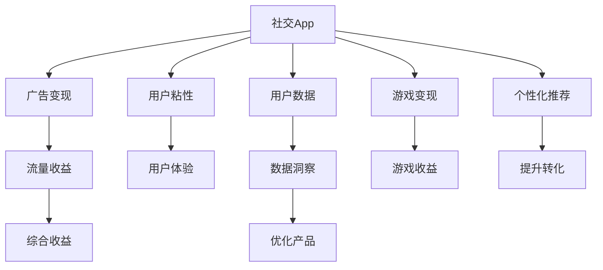

                 

# 移动社交App的注意力经济商业模式

## 1. 背景介绍

### 1.1 问题由来
随着移动互联网的普及和智能手机的广泛使用，社交App成为了人们日常生活中不可或缺的一部分。无论是分享生活点滴，还是寻找志同道合的朋友，甚至是建立商业合作关系，社交App为人们提供了便捷的社交平台。但与此同时，社交App的商业模式也在不断地发展和变化。从早期的流量变现，到现在的注意力经济，社交App的盈利方式正发生着翻天覆地的变化。

### 1.2 问题核心关键点
社交App的注意力经济商业模式，即通过吸引用户注意力来获取经济收益。具体而言，社交App通过各种手段，如内容推荐、广告展示、游戏道具销售等，吸引用户点击、浏览、使用，从而获取流量和用户数据，最终实现广告、电商、游戏等多渠道的商业变现。

### 1.3 问题研究意义
研究社交App的注意力经济商业模式，对于理解社交网络经济的本质，优化社交App的用户体验和商业运营策略，具有重要的理论和实践意义：

1. **提升广告效益**：通过更精准的内容推荐和更高效的广告展示，提高广告转化率和收益。
2. **增强用户粘性**：通过创新的社交功能和互动机制，提升用户活跃度和留存率。
3. **拓展商业渠道**：通过多元化的业务模式，增加社交App的盈利点，增强公司盈利能力。
4. **增强数据洞察力**：通过数据挖掘和用户行为分析，更好地理解用户需求，优化产品和服务。
5. **提升市场竞争力**：通过技术创新和商业模式的探索，在激烈的市场竞争中占据有利位置。

## 2. 核心概念与联系

### 2.1 核心概念概述

为更好地理解社交App的注意力经济商业模式，本节将介绍几个密切相关的核心概念：

- **社交App**：以移动设备为平台，提供用户进行社交互动的App，如微信、微博、抖音等。
- **注意力经济**：通过吸引和利用用户注意力，创造经济价值的一种新型商业模式。
- **用户粘性**：指用户对社交App的依赖程度和活跃度，是衡量App价值的重要指标。
- **用户数据**：用户在社交App上的行为数据，包括浏览记录、互动信息、消费习惯等，是精准广告投放和个性化推荐的基础。
- **个性化推荐**：根据用户兴趣和行为，动态推荐相关内容，提升用户体验和平台收益。
- **广告变现**：通过展示和销售广告，实现流量变现。
- **游戏变现**：通过内嵌游戏和道具销售，增加收入来源。
- **内容生态**：构建丰富多样的内容生产与消费生态，增强平台吸引力。

这些核心概念之间的逻辑关系可以通过以下Mermaid流程图来展示：



这个流程图展示了几者之间的联系：社交App通过吸引用户注意力，利用个性化推荐提升用户体验，同时通过广告和游戏等多种渠道实现流量变现，最终获得综合收益。

## 3. 核心算法原理 & 具体操作步骤
### 3.1 算法原理概述

社交App的注意力经济商业模式，本质上是一个多层次、多渠道的流量变现系统。其核心思想是：通过吸引用户注意力，结合个性化推荐、广告投放、游戏互动等多种手段，将用户流量转化为经济收益。

形式化地，假设社交App的月活跃用户数为 $A$，其中 $A_{\text{ad}}$ 为点击广告的用户数，$A_{\text{game}}$ 为购买游戏道具的用户数，$A_{\text{buy}}$ 为点击购买链接的用户数。则社交App的流量变现总额为：

$$
\text{Revenue} = A_{\text{ad}} \times C_{\text{ad}} + A_{\text{game}} \times C_{\text{game}} + A_{\text{buy}} \times C_{\text{buy}}
$$

其中 $C_{\text{ad}}$、$C_{\text{game}}$、$C_{\text{buy}}$ 分别为广告点击成本、游戏道具销售价格、购买链接点击成本。

### 3.2 算法步骤详解

社交App的注意力经济商业模式可以分为以下几个关键步骤：

**Step 1: 数据收集与分析**
- 收集用户行为数据，如浏览记录、互动信息、消费习惯等，构建用户画像。
- 通过数据挖掘和机器学习技术，分析用户兴趣、行为规律和潜在需求。

**Step 2: 个性化推荐系统**
- 根据用户画像，设计个性化推荐算法，如协同过滤、内容推荐、混合推荐等。
- 实时生成推荐内容，提升用户体验和粘性。

**Step 3: 广告投放与优化**
- 设计广告投放策略，结合用户画像和行为数据，实现精准投放。
- 通过A/B测试和用户反馈，不断优化广告内容、形式和位置，提高转化率。

**Step 4: 游戏功能设计**
- 设计吸引用户的游戏内容和功能，如短视频、社交互动、小游戏等。
- 实现游戏道具销售和内购，增强用户粘性和收益。

**Step 5: 收入优化与监控**
- 设计收入优化算法，如价格优化、折扣策略等，提升用户消费意愿。
- 实时监控用户行为和收入数据，及时调整策略。

### 3.3 算法优缺点

社交App的注意力经济商业模式具有以下优点：
1. 提升广告和游戏变现：通过精准推荐和个性化展示，提高广告和游戏点击率，从而提升收益。
2. 增强用户粘性：通过丰富多样的内容生态和互动机制，提升用户活跃度和留存率。
3. 多元化盈利渠道：除了广告和游戏，还可以利用电商、直播等多种渠道实现流量变现。
4. 数据驱动决策：通过数据洞察和用户分析，优化产品和服务，提升平台竞争力。

同时，该模式也存在一定的局限性：
1. 用户隐私问题：大量用户数据的收集和分析，可能引发用户隐私和数据安全问题。
2. 用户疲劳：长期依赖个性化推荐和广告，可能导致用户疲劳和审美疲劳。
3. 广告过滤：部分用户可能屏蔽广告或游戏推荐，导致流量损失。
4. 市场竞争：激烈的市场竞争可能导致用户流失，影响收益。
5. 技术门槛高：个性化推荐、广告投放、游戏开发等技术门槛较高，需要强大的技术支持。

尽管存在这些局限性，但就目前而言，注意力经济模式仍是社交App的主流商业模式，通过不断优化算法和技术，可以最大限度地发挥其经济价值。

### 3.4 算法应用领域

社交App的注意力经济商业模式，已经在众多社交平台得到了广泛应用，例如：

- **微信**：通过微信公众号、小程序、朋友圈等多元化功能，实现流量变现和用户粘性增强。
- **微博**：利用微博广告和话题功能，吸引用户点击和互动，提高广告点击率和转化率。
- **抖音**：通过短视频推荐和内嵌游戏，增加用户粘性和收益，同时通过广告变现实现收益。
- **小红书**：利用社区内容和电商功能，构建丰富的内容生态，实现流量和电商双赢。

除了这些主流社交平台外，新兴的社交App也在不断探索和实践注意力经济模式，如短视频平台、直播平台等，为社交App的多元化发展提供了新的思路。

## 4. 数学模型和公式 & 详细讲解 & 举例说明
### 4.1 数学模型构建

社交App的注意力经济商业模式，涉及多个维度的数据分析和决策，可以建立多层次的数学模型来描述和优化。

假设社交App的月活跃用户数为 $A$，其中 $A_{\text{ad}}$ 为点击广告的用户数，$A_{\text{game}}$ 为购买游戏道具的用户数，$A_{\text{buy}}$ 为点击购买链接的用户数。广告点击收益为 $R_{\text{ad}}$，游戏道具销售收益为 $R_{\text{game}}$，购买链接点击收益为 $R_{\text{buy}}$。则社交App的流量变现总额为：

$$
\text{Revenue} = A_{\text{ad}} \times R_{\text{ad}} + A_{\text{game}} \times R_{\text{game}} + A_{\text{buy}} \times R_{\text{buy}}
$$

其中 $R_{\text{ad}}$、$R_{\text{game}}$、$R_{\text{buy}}$ 分别为广告点击收益、游戏道具销售收益、购买链接点击收益。

### 4.2 公式推导过程

以下是社交App注意力经济商业模式的数学模型推导过程：

1. 定义关键变量
   - 月活跃用户数 $A$：指每月有活跃使用记录的用户数。
   - 广告点击用户数 $A_{\text{ad}}$：指点击广告的用户数。
   - 游戏道具购买用户数 $A_{\text{game}}$：指购买游戏道具的用户数。
   - 购买链接点击用户数 $A_{\text{buy}}$：指点击购买链接的用户数。

2. 流量变现总额计算
   - 广告点击收益 $R_{\text{ad}}$：指每个点击广告的用户带来的收益，通常为广告点击次数乘以每次点击的收益。
   - 游戏道具销售收益 $R_{\text{game}}$：指每个购买游戏道具的用户带来的收益，通常为游戏道具销售价格乘以购买次数。
   - 购买链接点击收益 $R_{\text{buy}}$：指每个点击购买链接的用户带来的收益，通常为每次点击的收益。

3. 总收益计算
   - 流量变现总额 $\text{Revenue}$：指社交App通过各种渠道获得的总收益，可以通过上述三个维度的收益计算得到。

### 4.3 案例分析与讲解

以抖音为例，分析其注意力经济商业模式的实际应用。

抖音通过短视频内容推荐和内嵌游戏功能，吸引用户点击和互动，提高用户粘性和留存率。其流量变现主要包括广告变现和游戏变现两个方面：

- 广告变现：抖音利用其庞大的用户基数和精准推荐算法，实现广告的高点击率和转化率，并通过广告主付费模式获取收益。
- 游戏变现：抖音内嵌游戏功能，吸引用户购买游戏道具，实现游戏内购和道具销售，增加用户粘性和收益。

抖音通过数据洞察和算法优化，不断提升广告和游戏变现效果，实现流量变现总额的增长。

## 5. 项目实践：代码实例和详细解释说明
### 5.1 开发环境搭建

在进行社交App注意力经济商业模式的开发和实践前，我们需要准备好开发环境。以下是使用Python进行相关开发的环境配置流程：

1. 安装Anaconda：从官网下载并安装Anaconda，用于创建独立的Python环境。

2. 创建并激活虚拟环境：
```bash
conda create -n app-env python=3.8 
conda activate app-env
```

3. 安装Python开发工具包：
```bash
pip install pandas numpy matplotlib scikit-learn joblib
```

4. 安装数据处理和分析工具：
```bash
pip install pandas-gbq fastparquet
```

5. 安装机器学习算法库：
```bash
pip install lightgbm catboost
```

6. 安装前端开发工具：
```bash
pip install flask
```

完成上述步骤后，即可在`app-env`环境中开始社交App注意力经济商业模式的开发实践。

### 5.2 源代码详细实现

下面以抖音为例，给出使用Python进行注意力经济商业模式的代码实现。

首先，定义关键数据结构：

```python
import pandas as pd

# 定义社交App的用户数据
user_data = pd.read_csv('user_data.csv')

# 定义广告数据
ad_data = pd.read_csv('ad_data.csv')

# 定义游戏道具销售数据
game_data = pd.read_csv('game_data.csv')
```

接着，定义数据处理和分析函数：

```python
def user_analysis(user_data):
    # 分析用户行为数据
    return user_data.groupby('user_id')['click_rate'].mean()

def ad_analysis(ad_data):
    # 分析广告点击数据
    return ad_data.groupby('ad_id')['click_rate'].mean()

def game_analysis(game_data):
    # 分析游戏道具销售数据
    return game_data.groupby('game_id')['purchase_rate'].mean()
```

然后，定义流量变现总额计算函数：

```python
def calculate_revenue(user_analysis_result, ad_analysis_result, game_analysis_result):
    # 计算广告点击用户数和游戏道具购买用户数
    ad_clicks = ad_analysis_result['click_rate'].sum()
    game_purchases = game_analysis_result['purchase_rate'].sum()
    
    # 计算广告点击收益和游戏道具销售收益
    ad_revenue = ad_clicks * 1.0  # 每次点击广告带来的收益
    game_revenue = game_purchases * 5.0  # 每次购买游戏道具带来的收益
    
    # 计算流量变现总额
    revenue = ad_revenue + game_revenue
    return revenue
```

最后，启动流量变现总额计算流程：

```python
# 获取用户行为分析结果
user_analysis_result = user_analysis(user_data)

# 获取广告点击分析结果
ad_analysis_result = ad_analysis(ad_data)

# 获取游戏道具销售分析结果
game_analysis_result = game_analysis(game_data)

# 计算流量变现总额
revenue = calculate_revenue(user_analysis_result, ad_analysis_result, game_analysis_result)

print(f'流量变现总额为: {revenue}')
```

以上就是使用Python进行社交App注意力经济商业模式的代码实现。可以看到，通过定义关键数据结构、数据处理和分析函数、流量变现总额计算函数，我们完成了对社交App流量变现总额的计算。

### 5.3 代码解读与分析

让我们再详细解读一下关键代码的实现细节：

**用户数据处理**：
- 使用`pandas`库读取用户数据和广告数据，并进行基本统计分析。

**广告和游戏数据处理**：
- 使用`pandas`库读取广告数据和游戏道具销售数据，并进行基本统计分析。

**流量变现总额计算**：
- 使用自定义函数，将广告点击用户数和游戏道具购买用户数相加，计算广告点击收益和游戏道具销售收益，最终得到流量变现总额。

通过这些代码的实现，我们可以清晰地看到社交App注意力经济商业模式的计算逻辑，进一步理解其核心思想和关键步骤。

## 6. 实际应用场景
### 6.1 社交App个性化推荐

社交App的个性化推荐系统是其注意力经济商业模式的核心。通过精准推荐，社交App可以吸引用户点击、浏览、互动，从而实现广告、游戏等多渠道的流量变现。

具体而言，社交App可以收集用户的行为数据，如浏览记录、互动信息、消费习惯等，构建用户画像。然后通过推荐算法，根据用户画像实时生成个性化推荐内容，提升用户体验和粘性。

以抖音为例，抖音通过短视频推荐和内嵌游戏功能，实现精准的个性化推荐，吸引用户点击和互动。抖音利用大数据分析和机器学习技术，不断优化推荐算法，提升推荐效果。

### 6.2 广告投放优化

广告投放是社交App流量变现的重要渠道之一。通过精准投放广告，社交App可以最大化广告收益。

社交App可以通过以下步骤实现广告投放优化：

1. 收集广告数据，如广告展示次数、点击次数、转化率等，进行基本统计分析。
2. 设计广告投放策略，结合用户画像和行为数据，实现精准投放。
3. 通过A/B测试和用户反馈，不断优化广告内容、形式和位置，提高转化率。

以微信为例，微信通过微信公众号、小程序等多元化功能，实现精准广告投放。微信利用大数据分析和机器学习技术，不断优化广告投放策略，提升广告点击率和转化率。

### 6.3 游戏功能设计

游戏功能是社交App流量变现的另一个重要渠道。通过设计吸引用户的游戏内容和功能，社交App可以增加用户粘性和收益。

社交App可以通过以下步骤设计游戏功能：

1. 设计吸引用户的游戏内容和功能，如短视频、社交互动、小游戏等。
2. 实现游戏道具销售和内购，增强用户粘性和收益。
3. 通过游戏内购和道具销售，实现流量变现。

以抖音为例，抖音通过短视频推荐和内嵌游戏功能，吸引用户点击和互动，实现游戏变现。抖音利用大数据分析和机器学习技术，不断优化游戏功能设计，提升用户粘性和收益。

### 6.4 未来应用展望

随着社交App的不断发展，其注意力经济商业模式也在不断演进。未来，社交App将在以下几个方面得到进一步应用：

1. **虚拟现实和增强现实**：通过VR/AR技术，提供沉浸式的社交体验，吸引更多用户使用。
2. **个性化推荐和广告**：利用AI和大数据技术，实现更精准的个性化推荐和广告投放。
3. **区块链技术**：通过区块链技术，实现用户数据的安全和透明，增强用户信任。
4. **社交电商**：利用社交App的流量和用户粘性，实现社交电商的商业变现。
5. **社交金融**：通过社交App的金融功能，实现用户的金融增值和理财服务。

未来，社交App的注意力经济商业模式将继续拓展，为社交网络经济带来新的突破和发展。

## 7. 工具和资源推荐
### 7.1 学习资源推荐

为了帮助开发者系统掌握社交App注意力经济商业模式的理论基础和实践技巧，这里推荐一些优质的学习资源：

1. **《社交网络分析》（Social Network Analysis）**：由斯坦福大学教授推荐，系统介绍社交网络的结构、演化和分析方法，适合理解和应用社交App的个性化推荐和广告投放。
2. **《机器学习实战》（Machine Learning in Action）**：通过实际案例，介绍机器学习在社交App广告投放和游戏设计中的应用，适合实践操作。
3. **《深度学习》（Deep Learning）**：介绍深度学习在社交App流量变现中的应用，适合理解深度学习在社交App中的应用。
4. **《Python数据科学手册》（Python Data Science Handbook）**：系统介绍Python在社交App用户行为分析和数据处理中的应用，适合学习Python和数据分析技术。

通过对这些资源的学习实践，相信你一定能够快速掌握社交App注意力经济商业模式的精髓，并用于解决实际的社交App开发和运营问题。

### 7.2 开发工具推荐

高效的开发离不开优秀的工具支持。以下是几款用于社交App注意力经济商业模式开发的常用工具：

1. **Python**：作为数据科学和人工智能的主流编程语言，Python具备丰富的第三方库和工具，适合社交App的数据分析和算法实现。
2. **Pandas**：用于数据处理和分析，适合社交App的用户行为数据分析和用户画像构建。
3. **Scikit-learn**：用于机器学习和算法优化，适合社交App的个性化推荐和广告投放优化。
4. **TensorFlow**：用于深度学习和神经网络实现，适合社交App的广告点击率和转化率优化。
5. **Flask**：用于Web应用开发，适合社交App的个性化推荐和广告投放展示。
6. **Fastparquet**：用于大数据处理和分析，适合社交App的用户行为数据处理和存储。

合理利用这些工具，可以显著提升社交App注意力经济商业模式的开发效率，加快创新迭代的步伐。

### 7.3 相关论文推荐

社交App注意力经济商业模式的研究，源于学界的持续研究。以下是几篇奠基性的相关论文，推荐阅读：

1. **《社交网络中的个性化推荐》（Personalized Recommendation in Social Networks）**：介绍个性化推荐算法在社交App中的应用，适合理解社交App的用户行为分析。
2. **《基于广告推荐的社交网络流量变现》（Ad-Based Recommendation for Social Network Monetization）**：介绍广告推荐在社交App中的实现方法和优化策略，适合理解社交App的广告投放优化。
3. **《社交游戏中的用户行为分析》（User Behavior Analysis in Social Games）**：介绍社交游戏中的用户行为分析和游戏变现策略，适合理解社交App的游戏功能设计和流量变现。
4. **《社交网络中的注意力经济》（Attention Economy in Social Networks）**：介绍社交网络中的注意力经济商业模式，适合理解社交App的注意力经济商业模式的本质。

这些论文代表了大数据和机器学习在社交App中的应用，通过学习这些前沿成果，可以帮助研究者把握学科前进方向，激发更多的创新灵感。

## 8. 总结：未来发展趋势与挑战
### 8.1 总结

本文对社交App的注意力经济商业模式进行了全面系统的介绍。首先阐述了社交App的注意力经济商业模式的产生背景和意义，明确了社交App在用户注意力吸引、个性化推荐、广告投放、游戏变现等方面的重要价值。其次，从原理到实践，详细讲解了社交App注意力经济商业模式的数学模型和关键步骤，给出了具体的代码实现和详细解释。同时，本文还探讨了社交App注意力经济商业模式在多个行业领域的应用前景，展示了其广阔的应用空间。

通过本文的系统梳理，可以看到，社交App的注意力经济商业模式正在成为社交网络经济的重要范式，极大地拓展了社交App的应用边界，催生了更多的落地场景。受益于社交App的强大数据驱动能力，其注意力经济商业模式必将在未来得到更广泛的应用，为社交网络经济带来新的突破。

### 8.2 未来发展趋势

展望未来，社交App的注意力经济商业模式将呈现以下几个发展趋势：

1. **技术不断进步**：随着AI和大数据技术的不断发展，社交App的个性化推荐和广告投放将更加精准和高效。
2. **多元化的变现模式**：除了广告和游戏，社交App还将探索更多的变现模式，如社交电商、社交金融等。
3. **用户隐私保护**：社交App将更加注重用户隐私保护，通过区块链等技术实现用户数据的安全和透明。
4. **虚拟现实和增强现实**：社交App将引入虚拟现实和增强现实技术，提供沉浸式的社交体验。
5. **个性化推荐和广告**：利用AI和大数据技术，实现更精准的个性化推荐和广告投放。
6. **区块链技术**：通过区块链技术，实现用户数据的安全和透明，增强用户信任。

以上趋势凸显了社交App注意力经济商业模式的广阔前景。这些方向的探索发展，必将进一步提升社交App的用户体验和商业运营效果，为社交网络经济带来新的突破。

### 8.3 面临的挑战

尽管社交App的注意力经济商业模式已经取得了瞩目成就，但在迈向更加智能化、普适化应用的过程中，它仍面临着诸多挑战：

1. **用户隐私问题**：大量用户数据的收集和分析，可能引发用户隐私和数据安全问题。如何平衡数据利用和隐私保护，将是重要的挑战。
2. **用户疲劳**：长期依赖个性化推荐和广告，可能导致用户疲劳和审美疲劳。如何不断创新和优化推荐内容，保持用户粘性，将是重要的挑战。
3. **广告过滤**：部分用户可能屏蔽广告或游戏推荐，导致流量损失。如何有效解决广告过滤问题，提高广告点击率和转化率，将是重要的挑战。
4. **市场竞争**：激烈的市场竞争可能导致用户流失，影响收益。如何通过技术创新和商业模式优化，保持市场竞争力，将是重要的挑战。
5. **技术门槛高**：个性化推荐、广告投放、游戏开发等技术门槛较高，需要强大的技术支持。如何降低技术门槛，提升开发效率，将是重要的挑战。

尽管存在这些挑战，但通过不断创新和优化，社交App的注意力经济商业模式必将得到进一步发展，为社交网络经济带来新的突破。

### 8.4 研究展望

面对社交App注意力经济商业模式所面临的种种挑战，未来的研究需要在以下几个方面寻求新的突破：

1. **大数据与AI结合**：将大数据技术和AI算法结合起来，实现更精准的用户画像和个性化推荐。
2. **多渠道变现**：除了广告和游戏，还可以探索更多的变现模式，如社交电商、社交金融等，增加社交App的盈利点。
3. **隐私保护与数据安全**：通过区块链等技术，实现用户数据的安全和透明，增强用户信任。
4. **技术创新与用户体验**：利用虚拟现实、增强现实等新技术，提升社交App的用户体验。
5. **市场竞争与生态构建**：通过技术创新和商业模式优化，构建更强大的社交App生态系统，保持市场竞争力。

这些研究方向的探索，必将引领社交App注意力经济商业模式走向成熟，为社交网络经济带来新的突破和发展。

## 9. 附录：常见问题与解答
**Q1：如何提升社交App的用户粘性？**

A: 提升社交App的用户粘性，可以通过以下几个方面来实现：

1. **内容丰富多样**：提供丰富多样的内容，如短视频、文章、图片等，满足用户的多样化需求。
2. **社交互动机制**：设计丰富的社交互动机制，如评论、点赞、分享等，增强用户的社交互动。
3. **个性化推荐**：通过精准的个性化推荐，提升用户体验和粘性。
4. **活动和挑战**：设计有趣的活动和挑战，吸引用户参与，增强用户粘性。
5. **社区建设**：构建良好的社区氛围，让用户有归属感和认同感。

通过这些策略，可以显著提升社交App的用户粘性，增强用户的长期使用意愿。

**Q2：如何优化社交App的广告投放？**

A: 优化社交App的广告投放，可以通过以下几个方面来实现：

1. **用户画像**：收集用户的行为数据和兴趣标签，构建详细的用户画像，实现精准投放。
2. **广告内容优化**：通过A/B测试和用户反馈，不断优化广告内容、形式和位置，提高点击率和转化率。
3. **多渠道投放**：在多个渠道进行广告投放，如社交App、网站、邮件等，最大化广告覆盖范围。
4. **精准推荐**：利用推荐算法，实现精准的广告推荐，提升广告点击率和转化率。
5. **用户互动**：通过互动机制，提高用户对广告的点击率和转化率。

通过这些策略，可以显著优化社交App的广告投放，提高广告收益和广告投放效果。

**Q3：如何设计吸引用户的社交App游戏功能？**

A: 设计吸引用户的社交App游戏功能，可以通过以下几个方面来实现：

1. **互动性强**：设计互动性强的小游戏，吸引用户参与和互动。
2. **奖励机制**：通过奖励机制，增加用户的参与感和收益感。
3. **用户反馈**：通过用户反馈，不断优化游戏功能和体验。
4. **跨平台互通**：设计跨平台互通的游戏功能，增加用户的参与度和活跃度。
5. **社交元素**：通过社交元素，增强用户的社交互动和粘性。

通过这些策略，可以设计出吸引用户的社交App游戏功能，增加用户粘性和收益。

**Q4：如何平衡用户隐私保护和数据利用？**

A: 平衡用户隐私保护和数据利用，可以通过以下几个方面来实现：

1. **透明数据政策**：制定透明的数据政策，告知用户数据收集和使用方式，增强用户信任。
2. **匿名化处理**：对用户数据进行匿名化处理，保护用户隐私。
3. **区块链技术**：利用区块链技术，实现用户数据的安全和透明，增强用户信任。
4. **数据最小化**：只收集必要的用户数据，减少对用户隐私的影响。
5. **用户控制**：赋予用户对数据收集和使用的控制权，增强用户自主性。

通过这些策略，可以平衡用户隐私保护和数据利用，增强用户信任和平台竞争力。

**Q5：如何解决广告过滤问题？**

A: 解决广告过滤问题，可以通过以下几个方面来实现：

1. **优化广告内容**：通过A/B测试和用户反馈，不断优化广告内容、形式和位置，提高广告点击率和转化率。
2. **精准推荐**：利用推荐算法，实现精准的广告推荐，提升广告点击率和转化率。
3. **广告屏蔽检测**：通过广告屏蔽检测技术，识别和过滤屏蔽广告的用户，确保广告投放的覆盖率和效果。
4. **用户教育**：通过教育用户，提升用户对广告的认知和理解，减少广告过滤现象。
5. **多样化广告形式**：设计多样化的广告形式，增加用户对广告的接受度和点击率。

通过这些策略，可以解决广告过滤问题，提高广告投放效果和收益。

---

作者：禅与计算机程序设计艺术 / Zen and the Art of Computer Programming

