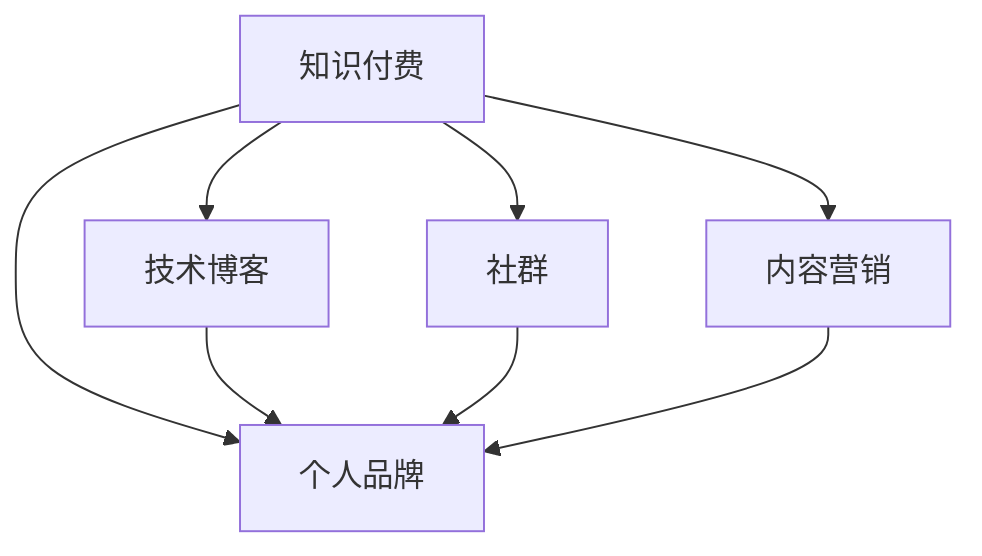

                 

# 程序员利用知识付费打造个人品牌

> 关键词：知识付费, 个人品牌, 技术博客, 程序员, 社群, 内容营销, 持续学习

## 1. 背景介绍

随着互联网的普及和信息爆炸，程序员不仅需要掌握丰富的技术知识，还需要打造个人品牌，在竞争激烈的职场中脱颖而出。知识付费作为新兴的模式，为程序员提供了展示专业技能和建立品牌影响力的新渠道。本文将深入探讨程序员如何利用知识付费打造个人品牌，从多个维度剖析背后的原理和策略。

## 2. 核心概念与联系

### 2.1 核心概念概述

为了更好地理解程序员利用知识付费打造个人品牌的过程，首先需要明确几个核心概念：

- **知识付费**：基于互联网的知识分享模式，用户为获取专业信息或技能服务而支付费用。程序员可以通过知识付费平台提供编程教程、技术分析、项目实战等，实现知识和技能的变现。

- **个人品牌**：程序员通过持续输出高质量内容、参与技术讨论、建立专业社群等方式，在业界内树立起自身的专业形象和认知度，形成独特的技术品牌和影响力。

- **技术博客**：程序员利用博客形式分享技术见解、项目经验、学习心得等内容，持续积累专业知识的传播和影响力，建立品牌形象。

- **社群**：通过建立或参与专业技术社群，程序员可以交流分享技术心得，形成一定的群体认同和品牌效应。

- **内容营销**：程序员通过撰写优质内容，吸引和维护目标受众，建立与用户的长期信任关系，实现品牌和产品的推广。

这些概念之间的联系和相互作用，可以通过以下Mermaid流程图来展示：



这个流程图展示了知识付费与其他概念之间的逻辑关系：知识付费是个人品牌建立的途径之一，而技术博客、社群、内容营销则是个人品牌在不同方面的具体实践。通过综合运用这些手段，程序员可以更有效地打造和提升个人品牌。

## 3. 核心算法原理 & 具体操作步骤

### 3.1 算法原理概述

程序员利用知识付费打造个人品牌的过程，本质上是一种基于内容的价值交换和品牌建设机制。其核心原理在于：通过持续提供有价值的知识和服务，吸引和维护目标受众，从而在行业中建立并提升个人品牌。

具体来说，知识付费模型通过设定内容和服务的付费门槛，确保内容的优质性和专业性，同时通过用户反馈和评价机制，不断优化和改进内容质量。用户通过支付费用获取高质量的知识资源，从而形成对提供者的信任和认可，进而增强个人品牌的认知度。

### 3.2 算法步骤详解

程序员利用知识付费打造个人品牌的过程，可以分为以下几个关键步骤：

**Step 1: 内容定位与选题**
- 确定自身的技术专长和兴趣领域，明确目标受众。
- 分析市场需求，选择具有较高潜力的内容主题。

**Step 2: 内容创作与制作**
- 设计课程大纲和内容结构，确保内容的系统性和实用性。
- 利用视频、文字、互动等多种形式制作内容，提高用户参与度。

**Step 3: 平台选择与发布**
- 选择适合自己内容特点和受众偏好的知识付费平台，如网易云课堂、慕课网、CSDN学院等。
- 在平台上注册账号，上传内容并发布。

**Step 4: 用户互动与反馈**
- 定期与用户互动，解答疑问，收集反馈。
- 根据用户反馈调整和优化课程内容。

**Step 5: 品牌推广与维护**
- 利用社交媒体、论坛等渠道宣传课程，吸引潜在用户。
- 持续输出高质量内容，维护用户粘性，建立长期信任关系。

### 3.3 算法优缺点

知识付费和个人品牌建设的算法具有以下优点：
1. 快速变现。通过知识付费平台，程序员可以快速将专业知识转化为经济收入，缓解经济压力。
2. 展示专业。高质量的内容能够吸引目标受众，提升个人在技术领域的认知度。
3. 持续学习。知识付费的过程本身也是不断学习和提升的过程，有助于程序员自我完善和提升。
4. 建立社群。通过知识付费平台，程序员可以结识同领域的专业人士，形成专业社群，共同进步。

同时，该算法也存在一定的局限性：
1. 内容质量要求高。如果内容不够专业或缺乏吸引力，将难以吸引和留住用户。
2. 用户获取成本高。知识付费平台需要一定的前期投入，如内容制作、平台费用等。
3. 市场竞争激烈。平台众多，内容同质化严重，需要有差异化竞争策略。
4. 用户体验依赖平台。知识付费平台的用户体验直接影响内容的传播效果。

### 3.4 算法应用领域

知识付费和个人品牌建设技术广泛应用于软件开发、数据科学、人工智能、云计算等领域。以下是几个典型应用场景：

- **软件开发**：通过知识付费提供编程技巧、项目实战经验、技术框架解析等内容，帮助初学者和进阶开发者提升技能。
- **数据科学**：提供数据处理、机器学习、数据可视化等内容的课程，帮助用户掌握数据技能，提升数据应用能力。
- **人工智能**：提供深度学习、自然语言处理、计算机视觉等课程，帮助用户理解人工智能技术，提升创新能力。
- **云计算**：提供云架构、云安全、云存储等课程，帮助用户掌握云技术，提升云平台应用能力。

## 4. 数学模型和公式 & 详细讲解 & 举例说明

### 4.1 数学模型构建

假设程序员通过知识付费平台提供的内容数量为 $C$，每篇文章或视频的阅读量为 $R$，用户支付费用为 $P$，平台抽取比例为 $\alpha$。则知识付费模型的总收入 $I$ 可表示为：

$$
I = \alpha \times P \times C \times R
$$

其中，$C$ 和 $R$ 成正相关关系，即内容数量越多，阅读量越大，反之亦然。

### 4.2 公式推导过程

对于知识付费平台的用户，假设其购买课程的概率为 $p$，购买课程的平均费用为 $E[P]$。则平台的总收入 $I$ 可进一步表示为：

$$
I = \alpha \times p \times E[P] \times C \times R
$$

根据伯努利试验，用户购买课程的概率 $p$ 可以表示为：

$$
p = \frac{C}{T}
$$

其中，$T$ 为用户总数。将上式代入总收入公式中，得：

$$
I = \alpha \times \frac{C}{T} \times E[P] \times C \times R
$$

化简后得：

$$
I \propto \frac{C^2 \times R}{T}
$$

由此可见，平台的总收入与内容的数量和阅读量成正相关关系，与用户总数成反相关关系。

### 4.3 案例分析与讲解

以某编程技术博客为例，该博主通过发布高质量的编程教程和项目实战文章，吸引了大量技术爱好者订阅。假设该平台抽取比例为20%，博主每月发布10篇文章，每篇文章的平均阅读量为1万次，订阅者每月支付5元订阅费。则每月收入计算如下：

- 每月发布文章数 $C = 10$
- 平均阅读量 $R = 10000$
- 订阅者数量 $T = 5000$
- 订阅费用 $E[P] = 5$

代入公式计算得：

$$
I = 0.2 \times 5 \times \frac{10}{5000} \times 10 \times 10000 = 20000 \text{元}
$$

由此可见，通过知识付费和个人品牌建设，程序员可以在一定程度上实现经济独立，并提升技术影响力。

## 5. 项目实践：代码实例和详细解释说明

### 5.1 开发环境搭建

在进行知识付费和个人品牌建设实践前，我们需要准备好开发环境。以下是使用Python进行知识付费平台开发的环境配置流程：

1. 安装Anaconda：从官网下载并安装Anaconda，用于创建独立的Python环境。

2. 创建并激活虚拟环境：
```bash
conda create -n python-env python=3.8 
conda activate python-env
```

3. 安装Python开发工具：
```bash
pip install flask django requests numpy pandas scikit-learn
```

4. 安装知识付费平台所需框架：
```bash
pip install FastAPI gunicorn uvicorn
```

完成上述步骤后，即可在`python-env`环境中开始知识付费平台的开发。

### 5.2 源代码详细实现

以下是一个简单的知识付费平台示例，包括用户注册、内容发布、支付和反馈等功能。

```python
from flask import Flask, render_template, request
from flask_sqlalchemy import SQLAlchemy
from flask_login import LoginManager, login_user, logout_user, login_required
from werkzeug.security import generate_password_hash, check_password_hash

app = Flask(__name__)
app.config['SQLALCHEMY_DATABASE_URI'] = 'sqlite:////tmp/test.db'
app.config['SECRET_KEY'] = 'secret'

db = SQLAlchemy(app)
login_manager = LoginManager()
login_manager.init_app(app)
login_manager.login_view = 'login'

class User(db.Model):
    id = db.Column(db.Integer, primary_key=True)
    username = db.Column(db.String(80), unique=True, nullable=False)
    email = db.Column(db.String(120), unique=True, nullable=False)
    password_hash = db.Column(db.String(128), nullable=False)

    def set_password(self, password):
        self.password_hash = generate_password_hash(password)

    def check_password(self, password):
        return check_password_hash(self.password_hash, password)

@login_manager.user_loader
def load_user(user_id):
    return User.query.get(int(user_id))

@app.route('/')
@login_required
def home():
    return render_template('home.html')

@app.route('/login', methods=['GET', 'POST'])
def login():
    if request.method == 'POST':
        username = request.form.get('username')
        password = request.form.get('password')
        user = User.query.filter_by(username=username).first()
        if user and user.check_password(password):
            login_user(user, remember=True)
            return redirect('/')
        else:
            return render_template('login.html', error='Invalid credentials')
    return render_template('login.html')

@app.route('/logout')
@login_required
def logout():
    logout_user()
    return redirect('/')

@app.route('/register', methods=['GET', 'POST'])
def register():
    if request.method == 'POST':
        username = request.form.get('username')
        email = request.form.get('email')
        password = request.form.get('password')
        user = User(username=username, email=email)
        user.set_password(password)
        db.session.add(user)
        db.session.commit()
        return redirect('/login')
    return render_template('register.html')

@app.route('/dashboard')
@login_required
def dashboard():
    return render_template('dashboard.html')

@app.route('/publish', methods=['GET', 'POST'])
@login_required
def publish():
    if request.method == 'POST':
        title = request.form.get('title')
        content = request.form.get('content')
        user = User.query.filter_by(username=request.user.username).first()
        post = Post(title=title, content=content, user=user)
        db.session.add(post)
        db.session.commit()
        return redirect('/dashboard')
    return render_template('publish.html')

@app.route('/payment')
@login_required
def payment():
    return render_template('payment.html')

@app.route('/payment/confirm', methods=['POST'])
@login_required
def payment_confirm():
    user = User.query.filter_by(username=request.user.username).first()
    user.balance += 100
    db.session.commit()
    return redirect('/dashboard')

@app.route('/feedback')
@login_required
def feedback():
    return render_template('feedback.html')

@app.route('/feedback/submit', methods=['POST'])
@login_required
def feedback_submit():
    feedback = Feedback(title=request.form.get('title'), content=request.form.get('content'), user=request.user)
    db.session.add(feedback)
    db.session.commit()
    return redirect('/feedback')

if __name__ == '__main__':
    app.run(debug=True)
```

这个代码示例使用Flask框架实现了基本的用户认证、内容发布和支付功能。其中，用户通过注册、登录、发布内容、购买课程、提交反馈等操作，与知识付费平台进行互动。

### 5.3 代码解读与分析

让我们再详细解读一下关键代码的实现细节：

**User类**：
- 定义用户表，包括id、username、email、password_hash等属性。
- 实现了set_password和check_password方法，用于加密和验证用户密码。
- 实现了user_loader方法，用于在登录时从数据库中获取用户信息。

**路由**：
- home路由：用户登录后访问的首页。
- login路由：用户登录页面。
- logout路由：用户退出登录。
- register路由：用户注册页面。
- dashboard路由：用户仪表盘。
- publish路由：用户发布内容页面。
- payment路由：用户支付页面。
- payment_confirm路由：用户支付确认。
- feedback路由：用户反馈页面。
- feedback_submit路由：用户提交反馈。

**实现细节**：
- 使用Flask和SQLAlchemy进行前后端开发，确保数据存储和访问的安全性。
- 利用Flask-Login实现用户认证和授权，保障系统安全性。
- 通过Flask-WTF扩展，利用WTForms框架实现表单验证和数据绑定。
- 使用Jinja2模板引擎，生成动态HTML页面。

该示例展示了知识付费平台的开发流程，开发者可以根据自身需求进一步完善和扩展功能。

### 5.4 运行结果展示

运行以上代码后，将生成一个简单的知识付费平台，用户可以通过注册、登录、发布内容、支付和反馈等功能，享受知识付费服务。系统会根据用户的访问行为，不断优化和改进内容质量，提高用户粘性和满意度。

## 6. 实际应用场景

### 6.1 软件开发

在软件开发领域，知识付费平台可以提供编程教程、项目实战、框架解析等内容，帮助开发者提升技能。例如，某知名编程博客主通过发布Java、Python、C++等编程语言的高级技巧，吸引了大量开发者订阅，从而实现了稳定的收入来源。

### 6.2 数据科学

在数据科学领域，知识付费平台可以提供数据处理、机器学习、数据可视化等课程，帮助用户掌握数据技能。例如，某数据科学家通过在知识付费平台发布统计学、Python数据分析、机器学习等课程，吸引了大量数据爱好者，成为领域内的知名专家。

### 6.3 人工智能

在人工智能领域，知识付费平台可以提供深度学习、自然语言处理、计算机视觉等课程，帮助用户理解人工智能技术。例如，某AI专家通过在知识付费平台发布TensorFlow、PyTorch、自然语言处理等课程，吸引了大批人工智能学习者，建立了自己在行业内的技术品牌。

### 6.4 未来应用展望

随着知识付费和个人品牌建设的不断发展，未来的应用场景将更加多样和丰富。以下是几个未来应用展望：

1. **跨领域整合**：知识付费平台将突破单一领域的限制，提供跨领域的综合性课程，如软件开发、数据科学、人工智能等联合学习。
2. **交互式学习**：利用AI技术，如自然语言理解和智能推荐，提供交互式学习体验，提升用户的学习效果。
3. **虚拟现实教学**：通过虚拟现实技术，提供沉浸式的学习环境，增强用户的体验感和参与度。
4. **个性化推荐**：根据用户的学习历史和兴趣，提供个性化的课程推荐，提升学习效率。
5. **全球化拓展**：知识付费平台将跨越国界，向全球用户提供高质量的学习资源，形成全球化的知识市场。

## 7. 工具和资源推荐

### 7.1 学习资源推荐

为了帮助开发者系统掌握知识付费和个人品牌建设的理论基础和实践技巧，这里推荐一些优质的学习资源：

1. **《知识付费：未来的教育模式》**：系统介绍了知识付费模式的发展历程和核心要素，分析了其对教育行业的深远影响。
2. **《个人品牌打造：程序员的社交媒体营销》**：详细讲解了程序员如何利用社交媒体平台打造个人品牌，提升技术影响力。
3. **《内容营销的策略与技巧》**：介绍了内容营销的核心概念、策略和执行技巧，帮助程序员制定高效的内容营销方案。
4. **《知识付费平台开发实战》**：通过Python和Flask等技术，手把手教你搭建知识付费平台，从零到一实现。
5. **《内容运营与社群管理》**：讲解了如何通过内容运营和社群管理，提升知识付费平台的用户粘性和参与度。

通过对这些资源的学习实践，相信你一定能够快速掌握知识付费和品牌建设的精髓，并用于解决实际的业务问题。

### 7.2 开发工具推荐

高效的开发离不开优秀的工具支持。以下是几款用于知识付费和个人品牌建设的常用工具：

1. **Flask**：轻量级的Python Web框架，易于上手，灵活高效，适合快速迭代研究。
2. **Django**：功能全面的Python Web框架，适合复杂项目和大规模数据处理。
3. **FastAPI**：高性能的Python Web框架，基于Python 3.6以上的异步编程，适合高并发应用。
4. **Gunicorn**：Python Web应用服务器，支持异步I/O和多进程处理，适合高性能Web应用。
5. **uvicorn**：Python Web应用服务器，支持异步I/O和WebSockets，适合实时交互应用。

合理利用这些工具，可以显著提升知识付费平台的开发效率，加快创新迭代的步伐。

### 7.3 相关论文推荐

知识付费和个人品牌建设的不断发展源于学界的持续研究。以下是几篇奠基性的相关论文，推荐阅读：

1. **《知识付费的经济模型与机制分析》**：探讨了知识付费的经济模型和机制，分析了平台的收入来源和用户行为。
2. **《个人品牌的影响因素及其测量》**：研究了个人品牌的影响因素和测量方法，揭示了品牌建设的多个维度。
3. **《内容营销的理论与实践》**：介绍了内容营销的理论基础和执行策略，帮助开发者制定高效的内容营销方案。
4. **《知识付费平台的用户行为分析》**：通过数据分析方法，揭示了用户行为对知识付费平台的影响，提出了优化建议。
5. **《知识付费的社交网络分析》**：利用社交网络分析方法，研究了知识付费平台中的用户互动和传播机制。

这些论文代表了大语言模型微调技术的发展脉络。通过学习这些前沿成果，可以帮助研究者把握学科前进方向，激发更多的创新灵感。

## 8. 总结：未来发展趋势与挑战

### 8.1 总结

本文对知识付费和个人品牌建设的系统梳理，明确了程序员如何利用知识付费打造个人品牌的核心原理和操作步骤。通过内容定位、内容创作、平台选择、用户互动、品牌推广等多个环节，程序员可以实现经济独立，并提升技术影响力。

## 8.2 未来发展趋势

展望未来，知识付费和个人品牌建设将呈现以下几个发展趋势：

1. **多样化内容形式**：除了文本内容，音频、视频、直播等多种形式的内容将进一步丰富，提升用户参与度。
2. **智能化推荐系统**：利用AI技术，提供智能化的课程推荐，提升用户体验和满意度。
3. **社区化互动**：构建社区化学习环境，增强用户之间的互动和交流，形成社群效应。
4. **国际化扩展**：全球化的知识付费平台将进一步拓展，覆盖更多国家和地区，形成全球化的知识市场。
5. **职业认证体系**：与职业认证机构合作，提供标准化职业认证，提升内容的权威性和信任度。

## 8.3 面临的挑战

尽管知识付费和个人品牌建设已经取得了瞩目成就，但在迈向更加智能化、普适化应用的过程中，它仍面临着诸多挑战：

1. **内容质量保障**：如何持续输出高质量内容，满足用户不断变化的需求，提升内容的吸引力和实用性。
2. **用户获取成本**：平台初期的投入较高，如何平衡成本和收益，实现可持续运营。
3. **市场竞争**：知识付费平台竞争激烈，如何提升自身的差异化竞争优势，获取更多用户。
4. **用户体验优化**：如何提供良好的用户体验，提升用户粘性和满意度，实现长期留存。
5. **技术支持保障**：平台需要持续的技术支持和维护，如何确保系统的稳定性和安全性。

## 8.4 研究展望

面对知识付费和个人品牌建设所面临的挑战，未来的研究需要在以下几个方面寻求新的突破：

1. **智能化内容创作**：利用AI技术，实现内容的智能化创作和推荐，提升内容的质量和效率。
2. **用户行为分析**：通过大数据分析，深入理解用户行为，提供个性化的学习方案，提升用户体验。
3. **跨平台融合**：实现知识付费平台与其他社交平台、学习平台的深度融合，形成多平台协同的用户生态。
4. **国际化拓展**：通过本地化适配和跨文化研究，拓展全球化的知识付费市场，提升品牌影响力。
5. **多模态学习**：结合文字、音频、视频等多种学习形式，提供多模态学习体验，增强学习效果。

这些研究方向的探索，将为知识付费和个人品牌建设技术带来新的突破，为构建安全、可靠、可解释、可控的智能系统铺平道路。面向未来，知识付费和个人品牌建设技术还需要与其他人工智能技术进行更深入的融合，如知识表示、因果推理、强化学习等，多路径协同发力，共同推动知识付费和品牌建设的进步。只有勇于创新、敢于突破，才能不断拓展知识付费和个人品牌建设的边界，让知识服务更好地造福人类社会。

## 9. 附录：常见问题与解答

**Q1：知识付费是否适合所有的技术内容？**

A: 知识付费适用于高质量、高价值的知识内容。如果内容不够专业或缺乏吸引力，将难以吸引和留住用户。因此，内容定位和选题至关重要，需要精准把握目标受众的需求。

**Q2：如何平衡知识付费与技术博客的关系？**

A: 知识付费和技术博客可以相辅相成。技术博客可以持续输出高质量内容，建立个人品牌，而知识付费可以通过高质量内容获得稳定的收入。两者可以相互促进，提升个人品牌的影响力。

**Q3：如何选择合适的知识付费平台？**

A: 选择适合自己内容特点和受众偏好的平台至关重要。需要考虑平台的用户群体、付费模式、平台规则等因素，确保内容能够得到充分的展示和推广。

**Q4：如何提升知识付费平台的粘性？**

A: 通过用户互动、内容优化、个性化推荐等方式，不断提升用户粘性。定期发布高质量内容，定期与用户互动，听取用户反馈，不断优化内容和体验。

**Q5：知识付费是否会过时？**

A: 知识付费作为新兴的模式，具有其独特的优势和潜力。只要能够持续输出高质量内容，不断创新和优化用户体验，知识付费平台将持续发展，具有强大的生命力。

总之，知识付费和个人品牌建设是程序员实现经济独立和提升技术影响力的重要手段。通过持续输出高质量内容，构建良好的用户体验，建立长期信任关系，程序员可以在知识付费的道路上越走越远，实现自己的职业梦想和价值追求。

---

作者：禅与计算机程序设计艺术 / Zen and the Art of Computer Programming

