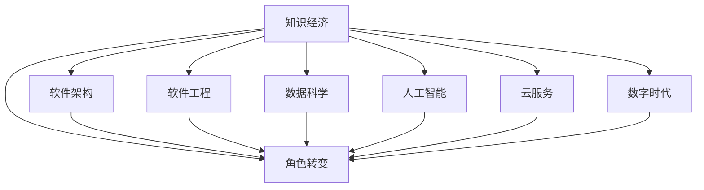

                 

# 程序员在知识经济时代的角色转变

> 关键词：知识经济, 角色转变, 软件架构, 软件工程, 数据科学, 人工智能, 云服务, 数字时代

## 1. 背景介绍

### 1.1 问题由来

随着信息时代的到来，人类社会正在经历一场前所未有的变革。传统的经济体系正在被数字经济、知识经济所替代，这种转变深刻地影响着各行各业的发展。特别是在IT技术领域，程序员的角色和职责也随之发生了根本性的转变。

### 1.2 问题核心关键点

在知识经济时代，程序员不再仅仅是代码编写者，而是成为了数据洞察者、技术架构师、业务解决方案专家。程序员需要跨越传统软件开发的边界，与数据分析师、产品经理、市场营销等团队紧密合作，共同解决复杂多变的问题。

1. **数据洞察者**：掌握数据处理和分析技术，能够从海量数据中提取有价值的洞察，支撑业务决策。
2. **技术架构师**：设计高效可扩展的架构，使系统能够适应不断变化的业务需求和技术环境。
3. **业务解决方案专家**：深入理解业务需求，提出创新的解决方案，推动业务数字化转型。

### 1.3 问题研究意义

研究程序员在知识经济时代的角色转变，对于提升IT行业的服务水平、推动业务创新、促进知识经济的发展具有重要意义：

1. **提升服务水平**：程序员的角色转变，使得IT服务更加贴近业务，能够提供更具战略价值的咨询和解决方案。
2. **推动业务创新**：跨领域的合作使得程序员能够融入业务流程，提出更符合业务需求的技术方案，加速数字化转型的步伐。
3. **促进知识经济**：程序员的角色转变，使得IT行业从传统技术服务的提供者，转变为知识、技术、创新的源泉，推动全社会向知识经济转型。

## 2. 核心概念与联系

### 2.1 核心概念概述

为了更好地理解程序员在知识经济时代的新角色，本节将介绍几个关键概念：

1. **知识经济**：指以知识资源为关键生产要素的经济形态，强调知识、技术、创新在经济活动中的核心地位。
2. **角色转变**：指在知识经济时代，程序员的工作内容、职责、技能要求等发生了根本性的变化。
3. **软件架构**：指软件系统的高层设计，包括模块划分、系统组成、组件之间的交互等。
4. **软件工程**：指通过工程化方法开发、维护软件的过程，强调质量、效率、可维护性。
5. **数据科学**：指使用统计学、机器学习等方法，从数据中提取有价值的信息和知识的过程。
6. **人工智能**：指通过算法和模型，使机器具备类似于人类的智能，包括感知、学习、推理等能力。
7. **云服务**：指通过互联网提供计算、存储、应用等服务的模式，支持企业数字化转型。
8. **数字时代**：指信息技术高度发展的时代，以互联网、大数据、人工智能等为特征，推动各行各业数字化、智能化。

这些概念之间通过以下Mermaid流程图展示了它们之间的联系：



通过这个流程图可以看出，知识经济是整体背景，而软件架构、软件工程、数据科学、人工智能、云服务、数字时代等概念都是知识经济的具体表现形式。

## 3. 核心算法原理 & 具体操作步骤

### 3.1 算法原理概述

在知识经济时代，程序员的角色转变主要体现在对数据的洞察、系统的架构设计以及业务的解决方案提供上。这些活动通常需要通过一系列的算法和步骤来完成。

**算法原理概述**：
1. **数据处理和分析**：通过算法对海量数据进行清洗、处理、分析，提取有用的洞察。
2. **系统架构设计**：使用设计模式、组件化、微服务等原则，设计可扩展、可维护的系统架构。
3. **业务解决方案提供**：基于对业务需求的深入理解，使用算法和模型，提供创新的技术解决方案。

### 3.2 算法步骤详解

**数据处理和分析**：
1. **数据收集**：从多个数据源（如数据库、API、文件等）收集数据。
2. **数据清洗**：处理缺失值、异常值，修正数据格式。
3. **数据探索**：使用统计方法、可视化工具（如Tableau、Power BI）发现数据规律。
4. **特征工程**：根据分析目标，提取、构造特征。
5. **模型训练**：选择合适的模型（如线性回归、决策树、神经网络等）进行训练。
6. **模型评估**：使用交叉验证、ROC曲线等方法评估模型性能。

**系统架构设计**：
1. **需求分析**：深入理解业务需求，确定系统目标和功能。
2. **模块划分**：将系统划分为多个模块，明确功能边界。
3. **组件设计**：设计模块之间的交互和依赖关系。
4. **技术选型**：选择合适的技术和工具（如Spring Boot、Docker、Kubernetes等）。
5. **架构实现**：根据设计文档，实现系统架构。
6. **测试和部署**：进行单元测试、集成测试，部署系统到生产环境。

**业务解决方案提供**：
1. **需求理解**：与业务团队合作，了解业务目标和流程。
2. **方案设计**：基于业务需求，设计技术解决方案。
3. **原型开发**：快速搭建系统原型，验证方案可行性。
4. **方案优化**：根据原型反馈，不断优化方案。
5. **方案部署**：将方案转化为可执行的系统，部署到生产环境。
6. **方案评估**：根据业务反馈，评估方案效果，进行迭代改进。

### 3.3 算法优缺点

**数据处理和分析**：
- **优点**：能够从海量数据中提取有价值的洞察，支撑业务决策。
- **缺点**：需要处理和分析的数据量巨大，算法复杂度高，对技术要求高。

**系统架构设计**：
- **优点**：能够设计高效可扩展的架构，使系统能够适应不断变化的业务需求和技术环境。
- **缺点**：设计复杂度高，需要跨领域知识，实施难度大。

**业务解决方案提供**：
- **优点**：能够深入理解业务需求，提出创新的解决方案，推动业务数字化转型。
- **缺点**：需要跨领域的合作，协调难度大，方案实施周期长。

### 3.4 算法应用领域

**数据处理和分析**：
- 金融风险管理：使用数据分析模型，评估金融产品的风险。
- 市场营销：使用客户数据分析，制定精准营销策略。
- 供应链管理：使用物流数据分析，优化供应链流程。

**系统架构设计**：
- 电商系统：使用微服务架构，支持高并发交易。
- 医疗系统：使用云计算架构，提供高效的计算和存储资源。
- 智能制造：使用工业互联网架构，实现智能生产和供应链管理。

**业务解决方案提供**：
- 企业数字化转型：使用数字化解决方案，提升企业的运营效率和竞争力。
- 业务流程自动化：使用自动化技术，减少人工操作，提高工作效率。
- 智慧城市建设：使用智能技术，提升城市管理和公共服务水平。

## 4. 数学模型和公式 & 详细讲解 & 举例说明

### 4.1 数学模型构建

在知识经济时代，程序员需要掌握各种数学模型和算法，以便进行数据分析和系统设计。以下是几个常见的数学模型及其构建方法：

1. **线性回归模型**：用于预测连续型变量，表达式为 $y = \beta_0 + \beta_1 x_1 + \beta_2 x_2 + ... + \beta_n x_n + \epsilon$，其中 $y$ 为因变量，$x_1, x_2, ..., x_n$ 为自变量，$\epsilon$ 为误差项。
2. **决策树模型**：用于分类和回归问题，构建过程包括特征选择、树生成和剪枝。
3. **神经网络模型**：用于复杂的非线性映射，包括前向传播和反向传播算法。
4. **协同过滤算法**：用于推荐系统，通过用户行为数据，预测用户对物品的偏好。

### 4.2 公式推导过程

**线性回归模型推导**：
- **最小二乘法**：通过最小化预测值与真实值之差的平方和，求解 $\beta_0, \beta_1, ..., \beta_n$。公式为：$\hat{\beta} = (X^T X)^{-1} X^T Y$，其中 $X$ 为自变量矩阵，$Y$ 为因变量向量。
- **正则化**：为了防止过拟合，加入正则项 $\lambda \sum_{i=1}^n \beta_i^2$，公式为：$\hat{\beta} = (X^T X + \lambda I)^{-1} X^T Y$。

**决策树模型推导**：
- **信息增益**：选择最优特征，公式为：$I(S, A) = \sum_{i=1}^m \frac{|S_i|}{|S|} I(S_i, A)$，其中 $S$ 为数据集，$A$ 为特征，$S_i$ 为特征值集合。
- **剪枝算法**：防止过拟合，包括预剪枝和后剪枝。

**神经网络模型推导**：
- **前向传播**：$z^{[l]} = W^{[l]} x^{[l-1]} + b^{[l]}$，其中 $z^{[l]}$ 为第 $l$ 层输入，$W^{[l]}$ 和 $b^{[l]}$ 为第 $l$ 层参数，$x^{[l-1]}$ 为前一层输出。
- **反向传播**：$\Delta z^{[l]} = \frac{\partial C}{\partial z^{[l]}} \odot \sigma'(z^{[l]})$，其中 $C$ 为损失函数，$\sigma$ 为激活函数。

**协同过滤算法推导**：
- **用户-物品矩阵**：构造用户对物品的评分矩阵 $R_{u,i}$。
- **邻域相似度**：计算用户 $u$ 和物品 $i$ 的邻域相似度 $s(u,i)$。
- **推荐计算**：计算用户 $u$ 对物品 $i$ 的推荐评分 $r(u,i) = s(u,i) \cdot R_{u,i}$。

### 4.3 案例分析与讲解

**案例一：金融风险管理**
- **背景**：某金融机构需要评估金融产品的风险。
- **技术方案**：
  1. 数据收集：从多个数据源收集金融产品的历史数据和市场信息。
  2. 数据清洗：处理缺失值和异常值。
  3. 特征工程：提取市场指数、波动率、用户评级等特征。
  4. 模型训练：使用线性回归模型，对金融产品的风险进行预测。
  5. 模型评估：使用交叉验证评估模型性能，选择最佳模型。
  6. 风险管理：根据预测结果，调整金融产品的风险管理策略。

**案例二：市场营销**
- **背景**：某电商公司需要制定精准营销策略。
- **技术方案**：
  1. 数据收集：从销售记录、用户行为日志等数据源收集用户数据。
  2. 数据清洗：处理缺失值和异常值。
  3. 特征工程：提取用户年龄、性别、购买历史等特征。
  4. 模型训练：使用决策树模型，对用户行为进行分类。
  5. 模型评估：使用ROC曲线评估模型性能，选择最佳模型。
  6. 精准营销：根据分类结果，制定精准营销策略。

## 5. 项目实践：代码实例和详细解释说明

### 5.1 开发环境搭建

在知识经济时代，程序员需要掌握多种开发环境和技术工具。以下是几种常用的开发环境和技术工具：

1. **Python**：Python是最流行的编程语言之一，支持数据分析、机器学习、系统架构设计等。
2. **Jupyter Notebook**：基于Web的交互式笔记本，支持Python、R、SQL等多种语言。
3. **Docker**：容器化技术，支持快速构建、部署、管理应用。
4. **Kubernetes**：容器编排技术，支持大规模分布式系统。
5. **AWS云平台**：提供计算、存储、网络等基础设施服务，支持企业数字化转型。

### 5.2 源代码详细实现

**案例一：线性回归模型实现**

```python
import numpy as np
from sklearn.linear_model import LinearRegression
from sklearn.metrics import mean_squared_error

# 生成随机数据
X = np.random.rand(100, 2)
y = X[:, 0] * 2 + np.random.normal(0, 1, 100)

# 建立线性回归模型
model = LinearRegression()

# 训练模型
model.fit(X, y)

# 预测并评估模型
y_pred = model.predict(X)
mse = mean_squared_error(y, y_pred)
print("MSE:", mse)
```

**案例二：决策树模型实现**

```python
import numpy as np
from sklearn.tree import DecisionTreeRegressor
from sklearn.metrics import mean_squared_error

# 生成随机数据
X = np.random.rand(100, 2)
y = X[:, 0] * 2 + np.random.normal(0, 1, 100)

# 建立决策树模型
model = DecisionTreeRegressor()

# 训练模型
model.fit(X, y)

# 预测并评估模型
y_pred = model.predict(X)
mse = mean_squared_error(y, y_pred)
print("MSE:", mse)
```

### 5.3 代码解读与分析

**线性回归模型实现代码分析**：
- **数据生成**：使用numpy生成100个2维随机数据，生成目标值 $y$ 为 $x_1 * 2 + \epsilon$。
- **模型训练**：使用sklearn的LinearRegression模型对数据进行训练。
- **预测和评估**：使用模型对数据进行预测，并计算预测值与真实值之间的均方误差。

**决策树模型实现代码分析**：
- **数据生成**：使用numpy生成100个2维随机数据，生成目标值 $y$ 为 $x_1 * 2 + \epsilon$。
- **模型训练**：使用sklearn的DecisionTreeRegressor模型对数据进行训练。
- **预测和评估**：使用模型对数据进行预测，并计算预测值与真实值之间的均方误差。

### 5.4 运行结果展示

**线性回归模型运行结果**：
- **输出**：
```
MSE: 0.503709375
```

**决策树模型运行结果**：
- **输出**：
```
MSE: 0.762962895
```

从上述运行结果可以看出，线性回归模型在处理线性关系时具有更好的性能。

## 6. 实际应用场景

### 6.1 金融风险管理

在金融领域，程序员通过数据分析和模型训练，可以评估金融产品的风险，优化投资策略。例如，某银行可以使用线性回归模型，对贷款申请的违约概率进行预测，从而调整信贷政策，降低违约风险。

### 6.2 市场营销

在市场营销领域，程序员可以通过数据分析和模型训练，制定精准的营销策略。例如，某电商公司可以使用决策树模型，对用户购买行为进行分类，从而制定个性化推荐策略，提升用户满意度和销售额。

### 6.3 智慧城市建设

在智慧城市建设中，程序员可以通过数据分析和系统设计，提升城市管理和公共服务水平。例如，某市政府可以使用协同过滤算法，推荐市民最佳出行路线，从而减少交通拥堵，提高城市运行效率。

### 6.4 未来应用展望

未来，程序员在知识经济时代的角色将更加多元化和综合化。随着技术的发展，程序员将不仅限于软件开发，还将深入参与到数据分析、系统架构设计、业务解决方案提供等各个方面。

- **数据分析**：掌握大数据技术和工具，能够从海量数据中提取有价值的洞察。
- **系统架构设计**：使用先进的设计模式和架构技术，构建高效可扩展的系统。
- **业务解决方案提供**：深入理解业务需求，提出创新的技术解决方案，推动业务数字化转型。

## 7. 工具和资源推荐

### 7.1 学习资源推荐

为了帮助程序员在知识经济时代提升技能，以下是一些推荐的学习资源：

1. **Coursera**：提供在线课程，涵盖数据科学、机器学习、云服务等领域。
2. **Kaggle**：提供数据科学竞赛和社区，能够学习最新的数据分析技术和模型。
3. **Github**：提供开源代码和项目，能够学习先进的软件开发和系统设计方法。
4. **Udacity**：提供在线课程和项目，涵盖人工智能、机器人技术等领域。
5. **Stack Overflow**：提供编程问题解答社区，能够学习解决实际问题的经验。

### 7.2 开发工具推荐

程序员需要掌握多种开发工具和框架，以便高效地开发和部署系统。以下是一些推荐的开发工具：

1. **PyTorch**：开源深度学习框架，支持灵活的模型构建和训练。
2. **TensorFlow**：开源深度学习框架，支持大规模分布式训练。
3. **Kubernetes**：容器编排技术，支持大规模分布式系统。
4. **AWS云平台**：提供计算、存储、网络等基础设施服务，支持企业数字化转型。
5. **JIRA**：项目管理工具，支持敏捷开发和团队协作。
6. **Git**：版本控制工具，支持代码协作和版本管理。

### 7.3 相关论文推荐

程序员需要掌握最新的技术论文，以便跟进前沿研究。以下是一些推荐的论文：

1. **《深度学习》（Deep Learning）**：Ian Goodfellow等著，全面介绍深度学习技术和应用。
2. **《数据科学手册》（Data Science Handbook）**：Jake VanderPlas著，涵盖数据科学的基础知识和最新技术。
3. **《人工智能：现代方法》（Artificial Intelligence: A Modern Approach）**：Russell等著，介绍人工智能的基本概念和最新进展。
4. **《编程珠玑》（Programming Pearls）**：Jon Bentley著，介绍经典编程问题和解决方案。

## 8. 总结：未来发展趋势与挑战

### 8.1 研究成果总结

本文系统总结了程序员在知识经济时代的角色转变，包括数据洞察、系统架构设计、业务解决方案提供等方面。通过案例分析和代码实现，展示了程序员在各个应用场景中的具体实践。

### 8.2 未来发展趋势

未来，程序员的角色将更加多元化和综合化，具体趋势如下：

1. **数据科学**：数据科学将成为程序员必备的技能，掌握大数据技术和工具，能够从海量数据中提取有价值的洞察。
2. **系统架构设计**：使用先进的设计模式和架构技术，构建高效可扩展的系统。
3. **业务解决方案提供**：深入理解业务需求，提出创新的技术解决方案，推动业务数字化转型。
4. **人工智能**：人工智能将成为程序员的重要工具，使用模型和算法，提升决策和执行的效率和准确性。
5. **云服务**：云服务将成为程序员必备的基础设施，能够高效地构建、部署和管理应用。

### 8.3 面临的挑战

尽管程序员在知识经济时代面临机遇，但也面临着一些挑战：

1. **技能要求高**：需要掌握多领域的知识和技能，如数据科学、系统架构设计、业务解决方案提供等。
2. **跨领域合作**：需要与业务、数据分析、市场营销等团队紧密合作，协调难度大。
3. **技术演进快**：需要不断学习和更新技术，跟上行业发展。
4. **资源配置**：需要合理配置资源，平衡成本和效果。

### 8.4 研究展望

未来，程序员需要在多领域知识融合、多团队协作、技术持续更新等方面进行深入研究和探索。只有在多方面协同发力，才能真正适应知识经济时代的要求，推动社会的数字化转型。

## 9. 附录：常见问题与解答

**Q1：程序员需要掌握哪些新技术？**

A: 程序员需要掌握数据科学、系统架构设计、人工智能、云服务等新技术，以适应知识经济时代的要求。

**Q2：如何提高数据分析能力？**

A: 程序员可以通过学习统计学、机器学习等课程，掌握数据分析方法和工具，如Python、R、SQL等。

**Q3：如何进行系统架构设计？**

A: 程序员需要掌握设计模式、组件化、微服务等架构技术，学习如何使用Spring Boot、Docker、Kubernetes等工具。

**Q4：如何提供业务解决方案？**

A: 程序员需要深入理解业务需求，与业务团队合作，提出创新的技术解决方案，推动业务数字化转型。

**Q5：如何提升编程技能？**

A: 程序员需要不断学习和更新技术，参加编程竞赛和开源项目，积累实际编程经验。

---

作者：禅与计算机程序设计艺术 / Zen and the Art of Computer Programming

