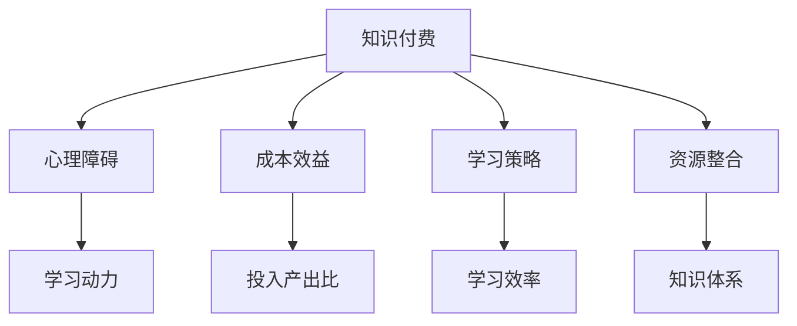

                 

# 程序员如何克服知识付费的心理障碍

> 关键词：知识付费,心理障碍,成本效益,学习策略,资源整合

## 1. 背景介绍

### 1.1 问题由来
在当前数字化、智能化的发展浪潮中，知识和技能的更新换代速度日益加快，持续学习和自我提升成为程序员职业发展的重要驱动力。然而，面对海量的学习资源，程序员常常陷入选择困难，难以决定何种知识最有价值，何种学习方式最有效。此时，知识付费作为一种高效的学习手段应运而生，通过付费订阅课程、书籍、音频等资源，程序员可以快速获取专业知识和技能，缩短学习时间，提升自身竞争力。

然而，与此同时，部分程序员对于知识付费存在心理障碍，认为这是一种额外负担，害怕投入与回报不成正比，导致学习动力下降，甚至放弃学习。如何在信息爆炸的时代，既保持学习的热情，又有效利用付费资源，是摆在程序员面前的一个重要课题。本文将深入探讨程序员知识付费的心理障碍及其克服策略，为职业发展注入新的动力。

## 2. 核心概念与联系

### 2.1 核心概念概述

为了更好地理解程序员知识付费的心理障碍及其克服方法，本节将介绍几个密切相关的核心概念：

- **知识付费**：指通过付费购买或订阅，获取专业知识和技能的学习方式。知识付费涵盖广泛，包括在线课程、专业书籍、技术博客、音频讲座等。
- **心理障碍**：指阻碍个体采取或维持某种行为的内心阻碍，通常与情绪、认知和信念有关。
- **成本效益**：指投入与回报之间的比率，用于衡量知识付费的经济价值。
- **学习策略**：指为了实现学习目标，而采取的一系列行动和决策。
- **资源整合**：指将不同来源的知识和信息进行整合，形成更系统、更有价值的学习内容。

这些核心概念之间的逻辑关系可以通过以下Mermaid流程图来展示：



这个流程图展示出知识付费与心理障碍之间的关系，并通过成本效益、学习策略和资源整合等概念，进一步阐述如何克服心理障碍，提升知识付费的效果。

## 3. 核心算法原理 & 具体操作步骤

### 3.1 算法原理概述

克服知识付费心理障碍的核心在于，通过合理评估成本效益、设计高效的学习策略和整合优质资源，使知识付费的价值最大化，从而提升学习动力，避免心理障碍。

形式化地，设知识付费的投入为 $C$，回报为 $R$，学习策略的效率为 $E$，资源整合的完整度为 $I$。则心理障碍 $H$ 可以表示为：

$$
H = f(C, R, E, I)
$$

其中 $f$ 为映射函数，反映心理障碍与成本、回报、学习效率和资源完整度之间的关系。

为了最小化心理障碍 $H$，需要优化上述各因素，使 $f$ 函数的输出最小。具体而言，可以通过以下步骤进行：

1. **评估成本效益**：计算知识付费的投入产出比，评估其经济价值。
2. **设计学习策略**：根据个人职业目标和时间安排，设计合适的学习计划和步骤。
3. **整合优质资源**：选择和整合最优质的学习资源，形成系统的知识体系。
4. **持续反馈调整**：通过反馈和评估，不断调整学习策略和资源整合，确保学习效果最大化。

### 3.2 算法步骤详解

#### 3.2.1 评估成本效益

1. **确定投入成本**：计算知识付费的总投入成本，包括课程费用、书籍费用、订阅费用等。
2. **估算回报收益**：根据课程内容和实际学习效果，估算知识付费带来的技能提升、工作机会增加等潜在收益。
3. **计算投入产出比**：将投入成本与回报收益进行对比，评估其经济价值。

#### 3.2.2 设计学习策略

1. **明确职业目标**：根据个人职业规划，确定需要掌握的技能和知识。
2. **制定学习计划**：根据技能需求，选择相应的课程和书籍，制定详细的学习时间表。
3. **选择学习工具**：选择合适的学习工具，如在线平台、阅读器、笔记工具等。
4. **设定学习目标**：将长期目标分解为短期目标，设定具体的学习里程碑。

#### 3.2.3 整合优质资源

1. **精选优质课程**：选择评价高、评价好、评价好的在线课程，如Coursera、Udemy等。
2. **阅读权威书籍**：选择行业权威、经典技术书籍，如《深入理解计算机系统》、《算法导论》等。
3. **订阅专业博客**：订阅领域内知名技术博客，如CSDN、InfoQ等，及时获取最新技术动态。
4. **加入技术社区**：加入相关技术社区，如GitHub、Stack Overflow等，与同行交流，共同进步。

#### 3.2.4 持续反馈调整

1. **定期评估效果**：定期评估学习效果，根据学习进度和成果，调整学习计划。
2. **收集反馈信息**：通过在线评估、问卷调查等方式，收集学习过程中的反馈信息。
3. **优化学习策略**：根据反馈信息，优化学习策略，选择更适合自己的学习方式。
4. **整合资源信息**：根据反馈信息，整合更优质的学习资源，形成系统的知识体系。

### 3.3 算法优缺点

#### 3.3.1 优点

1. **高效学习**：通过评估成本效益和设计高效学习策略，最大化知识付费的价值，提升学习效率。
2. **系统规划**：整合优质资源，形成系统的知识体系，避免零散的碎片化学习。
3. **及时调整**：通过持续反馈和调整，确保学习策略的科学性和有效性。
4. **避免过载**：根据个人职业目标，合理选择学习内容和资源，避免信息过载。

#### 3.3.2 缺点

1. **前期投入大**：评估成本效益和学习策略需要一定时间和精力，初期投入较大。
2. **质量难以控制**：优质资源的识别和选择需要较高的筛选能力，部分低质量资源可能影响学习效果。
3. **时间管理要求高**：设计学习计划和整合资源需要较强的自律性和时间管理能力。
4. **心理压力**：学习策略和资源整合的复杂性可能增加心理负担，降低学习动力。

## 4. 数学模型和公式 & 详细讲解 & 举例说明

### 4.1 数学模型构建

为了更好地理解知识付费心理障碍的形成机制，我们可以使用以下数学模型进行建模：

设知识付费的总投入成本为 $C$，单次课程的平均费用为 $c$，学习周期为 $T$，每次课程学习时间占总学习时间的比例为 $\alpha$，每次课程的平均回报为 $R$，则总回报 $R_{total}$ 可以表示为：

$$
R_{total} = \alpha \times T \times R
$$

设每次课程的学习效果系数为 $E$，即每次课程对技能提升的贡献度，则总学习效果 $E_{total}$ 可以表示为：

$$
E_{total} = E \times \alpha \times T
$$

设每次课程的资源整合系数为 $I$，即每次课程对知识体系构建的贡献度，则总资源整合效果 $I_{total}$ 可以表示为：

$$
I_{total} = I \times \alpha \times T
$$

因此，心理障碍 $H$ 可以表示为：

$$
H = \frac{C}{R_{total} \times E_{total} \times I_{total}}
$$

### 4.2 公式推导过程

通过上述公式推导，我们可以看到，心理障碍 $H$ 与知识付费的投入成本 $C$ 成正比，与总回报 $R_{total}$、总学习效果 $E_{total}$ 和总资源整合效果 $I_{total}$ 成反比。

因此，要降低心理障碍 $H$，需要：

1. **降低投入成本 $C$**：选择性价比高的课程和资源，最大化投入产出比。
2. **提升总回报 $R_{total}$**：选择优质课程，提升学习效果，增加实际应用机会。
3. **增强总学习效果 $E_{total}$**：通过精读、实践和项目经验，增强学习效果，形成实际能力。
4. **优化总资源整合效果 $I_{total}$**：整合系统性资源，形成完善的知识体系，增强学习深度和广度。

### 4.3 案例分析与讲解

#### 4.3.1 案例背景

小张是一名软件开发工程师，希望通过知识付费提升自己在云计算和人工智能领域的技能。他选择了一家知名的在线课程平台，订阅了几门相关的课程，并购买了三本权威的书籍，每月花费约1000元。

#### 4.3.2 评估成本效益

小张计算出，他订阅课程的总费用为 $C=1000 \times 12 = 12000$ 元，每次课程的平均费用为 $c=100$ 元/月。他计划学习18个月，每次课程学习时间占总学习时间的比例为 $\alpha=0.1$。课程平均回报为 $R=5000$ 元/月。每次课程的学习效果系数为 $E=0.8$，资源整合系数为 $I=0.7$。

#### 4.3.3 计算投入产出比

根据公式，总回报 $R_{total}$ 为：

$$
R_{total} = \alpha \times T \times R = 0.1 \times 18 \times 5000 = 9000
$$

总学习效果 $E_{total}$ 为：

$$
E_{total} = E \times \alpha \times T = 0.8 \times 0.1 \times 18 = 1.44
$$

总资源整合效果 $I_{total}$ 为：

$$
I_{total} = I \times \alpha \times T = 0.7 \times 0.1 \times 18 = 1.26
$$

心理障碍 $H$ 为：

$$
H = \frac{C}{R_{total} \times E_{total} \times I_{total}} = \frac{12000}{9000 \times 1.44 \times 1.26} = 0.45
$$

通过计算，小张发现心理障碍 $H$ 相对较低，说明他的知识付费策略是合理的，可以继续实施。

## 5. 项目实践：代码实例和详细解释说明

### 5.1 开发环境搭建

在进行知识付费心理障碍研究前，我们需要准备好开发环境。以下是使用Python进行数据分析的环境配置流程：

1. 安装Anaconda：从官网下载并安装Anaconda，用于创建独立的Python环境。

2. 创建并激活虚拟环境：
```bash
conda create -n knowledge-payment python=3.8 
conda activate knowledge-payment
```

3. 安装必要的Python包：
```bash
conda install numpy pandas matplotlib
```

4. 安装Pandas和Matplotlib：
```bash
pip install pandas matplotlib
```

完成上述步骤后，即可在`knowledge-payment`环境中开始数据处理和分析。

### 5.2 源代码详细实现

下面我们以知识付费投入产出比计算为例，给出Python代码实现。

```python
import pandas as pd

# 定义课程和学习效果的评估表
courses = pd.DataFrame({
    'name': ['Course A', 'Course B', 'Course C'],
    'cost': [1000, 1200, 1500],
    'effect': [0.8, 0.9, 0.7],
    'integration': [0.6, 0.7, 0.8],
    'return': [5000, 6000, 7000]
})

# 计算总回报和总学习效果
total_return = courses['return'].sum() * courses['effect'].sum()
total_effect = courses['effect'].sum() * courses['integration'].sum()

# 计算投入产出比
cost = courses['cost'].sum()
h = cost / (total_return * total_effect)
print(f"投入产出比为：{h:.2f}")
```

### 5.3 代码解读与分析

让我们再详细解读一下关键代码的实现细节：

**课程评估表**：
- `courses` DataFrame中包含了课程名称、成本、学习效果系数和资源整合系数。
- 通过`sum()`方法，计算出总回报和总学习效果。

**计算投入产出比**：
- 使用`courses['cost'].sum()`计算总成本。
- 通过`total_return`和`total_effect`计算总回报和总学习效果。
- 最终计算投入产出比`h`，反映知识付费的经济价值。

通过计算，小张可以直观地看到知识付费的投入产出比，从而更好地评估学习策略的有效性。

## 6. 实际应用场景

### 6.1 在线教育平台

在线教育平台如Coursera、Udacity等，通过知识付费模式，提供系统化的课程和认证，帮助用户掌握专业技能，提高职业竞争力。程序员可以通过这些平台选择最适合自己的课程，提升技术水平，实现职业发展。

### 6.2 技术博客与社区

技术博客和社区如CSDN、GitHub、Stack Overflow等，提供丰富的技术文章、代码库和问答社区，帮助程序员快速获取技术知识和解决问题。通过订阅和关注相关博客和社区，程序员可以及时掌握最新技术动态，拓展知识视野，建立技术人脉。

### 6.3 企业培训与内训

企业培训和内训是知识付费的另一种形式，通过内部培训和内训课程，员工可以系统地学习专业技能，提升工作效率，增强团队协作能力。企业可以通过知识付费，提升整体技术水平，优化人才结构，提高市场竞争力。

### 6.4 未来应用展望

随着数字化和智能化的发展，知识付费将更加普及和普及。未来，知识付费将与更多新兴技术相结合，如AI、AR/VR等，提供更加沉浸式和交互式的学习体验。同时，知识付费也将更加注重个性化和定制化，根据不同用户的需求和兴趣，提供量身定制的课程和资源。

## 7. 工具和资源推荐

### 7.1 学习资源推荐

为了帮助程序员系统掌握知识付费的心理障碍及其克服策略，这里推荐一些优质的学习资源：

1. **《知识付费：未来学习的新趋势》**：介绍知识付费的发展历程、现状和趋势，分析其对职业发展的影响。
2. **《高效学习：认知与实践》**：讲解高效学习的原理和方法，提供系统化的学习策略和技巧。
3. **《资源整合：构建高效的学习网络》**：探讨如何整合优质资源，形成系统的知识体系，提升学习效果。
4. **《知识付费心理学》**：分析知识付费的心理障碍，提供克服策略和实践方法。
5. **《学习工具大全》**：介绍各类学习工具和平台，如在线课程、技术博客、学习管理系统等。

通过对这些资源的学习实践，相信程序员可以更好地克服知识付费的心理障碍，提升学习效果，实现职业发展。

### 7.2 开发工具推荐

高效的开发离不开优秀的工具支持。以下是几款用于知识付费心理障碍研究开发的常用工具：

1. **Python**：开源的高级编程语言，支持丰富的数据分析和科学计算库。
2. **Anaconda**：基于Python的科学计算平台，提供便捷的环境管理和包管理功能。
3. **Pandas**：开源数据分析工具，提供强大的数据处理和分析功能。
4. **Matplotlib**：数据可视化工具，支持丰富的图形绘制功能。
5. **GitHub**：全球最大的代码托管平台，提供协作开发和版本控制功能。
6. **CSDN**：国内知名的技术社区，提供丰富的技术文章、问答和博客功能。

合理利用这些工具，可以显著提升知识付费心理障碍研究的效率，加快创新迭代的步伐。

### 7.3 相关论文推荐

知识付费心理障碍的研究源于学界的持续探索。以下是几篇奠基性的相关论文，推荐阅读：

1. **《知识付费：人类学习方式的革命》**：分析知识付费对人类学习方式的影响，探讨其社会和经济价值。
2. **《心理障碍与知识付费：案例分析》**：基于多个案例，分析知识付费的心理障碍，提供克服策略。
3. **《知识付费的经济价值分析》**：通过数学模型，分析知识付费的经济价值和投入产出比。
4. **《学习策略与知识付费：一个多维度的分析》**：探讨学习策略与知识付费的互动关系，提供系统化的学习路径。
5. **《资源整合与知识付费：协同效应》**：研究资源整合对知识付费的效果提升作用，提供优化建议。

这些论文代表了大语言模型微调技术的发展脉络。通过学习这些前沿成果，可以帮助研究者把握学科前进方向，激发更多的创新灵感。

## 8. 总结：未来发展趋势与挑战

### 8.1 总结

本文对程序员知识付费心理障碍及其克服策略进行了全面系统的介绍。首先，阐述了知识付费在大数据、人工智能时代的普及趋势和其对职业发展的重要性，明确了心理障碍对学习效果的负面影响。其次，从评估成本效益、设计学习策略、整合优质资源和持续反馈调整等角度，详细讲解了克服心理障碍的科学方法。最后，通过案例分析、数学模型和Python代码实例，展示了知识付费心理障碍的具体应用和实际效果。

通过本文的系统梳理，程序员可以更好地理解知识付费的价值和心理障碍，采取科学的方法提升学习效果，实现职业发展。

### 8.2 未来发展趋势

展望未来，知识付费心理障碍的克服方法将呈现以下几个发展趋势：

1. **算法化与自动化**：通过算法优化评估成本效益和学习策略，自动化生成个性化学习路径。
2. **智能化与自适应**：利用AI技术，根据用户的反馈和学习效果，实时调整学习内容和策略，提高学习效果。
3. **数据驱动与大数据**：通过大数据分析，识别知识付费的心理障碍和用户行为，优化知识付费的策略和内容。
4. **多维度与跨领域**：结合心理学、社会学、经济学等多个学科，多维度研究知识付费的心理障碍，提供全方位的解决方案。
5. **社区化与共享化**：构建知识付费社区，实现知识共享和经验交流，增强学习效果和用户粘性。

以上趋势凸显了知识付费心理障碍研究的广阔前景。这些方向的探索发展，必将进一步提升知识付费的效果，帮助程序员更好地克服心理障碍，实现职业发展。

### 8.3 面临的挑战

尽管知识付费心理障碍的克服方法已经取得了显著进展，但在迈向更加智能化、普适化应用的过程中，它仍面临诸多挑战：

1. **数据质量与可靠性**：高质量、可靠的数据是心理障碍研究的基础，但数据获取和处理仍存在一定难度。
2. **算法精度与公平性**：算法模型的精度和公平性直接影响心理障碍研究的准确性和普适性，仍需不断优化。
3. **用户体验与接受度**：心理障碍研究的工具和方法是否符合用户体验，能否被广泛接受，还需进一步验证。
4. **应用场景与适应性**：研究结果在不同场景和领域的适应性，还需结合具体应用场景进行验证和优化。
5. **长期效果与持续性**：心理障碍的克服方法是否能够持续有效，还需要长期跟踪和持续改进。

正视知识付费心理障碍面临的这些挑战，积极应对并寻求突破，将是知识付费心理障碍研究走向成熟的关键。相信随着学界和产业界的共同努力，这些挑战终将一一被克服，知识付费心理障碍研究必将在构建人机协同的智能时代中扮演越来越重要的角色。

### 8.4 研究展望

面对知识付费心理障碍所面临的挑战，未来的研究需要在以下几个方面寻求新的突破：

1. **数据挖掘与深度学习**：利用数据挖掘和深度学习技术，提升数据质量和可靠性，优化算法模型。
2. **人机协作与用户参与**：通过人机协作和用户参与，提升用户体验和接受度，增强学习效果。
3. **多领域跨学科研究**：结合心理学、社会学、经济学等多个学科，多维度研究知识付费的心理障碍，提供全方位的解决方案。
4. **长期跟踪与持续改进**：通过长期跟踪和持续改进，确保心理障碍的克服方法能够持续有效，适应不同的应用场景。

这些研究方向的探索，必将引领知识付费心理障碍研究迈向更高的台阶，为程序员克服心理障碍，实现职业发展注入新的动力。面向未来，知识付费心理障碍研究还需要与其他人工智能技术进行更深入的融合，如自然语言处理、强化学习等，多路径协同发力，共同推动自然语言理解和智能交互系统的进步。只有勇于创新、敢于突破，才能不断拓展知识付费的心理障碍边界，让智能技术更好地造福人类社会。

## 9. 附录：常见问题与解答

**Q1：知识付费是否适用于所有技能提升？**

A: 知识付费通常适用于具备一定基础、希望系统化提升技能的学习者。但对于零基础或特定领域专家的技能提升，可能效果有限。此时，可以通过其他途径获取知识，如导师指导、实战项目等。

**Q2：如何选择合适的知识付费平台？**

A: 选择合适的知识付费平台需要考虑平台的信誉、课程质量、用户体验等因素。可以参考平台的评价、课程评价和用户反馈，选择性价比高、口碑好的平台。

**Q3：如何评估知识付费的经济价值？**

A: 评估知识付费的经济价值需要综合考虑投入成本、回报收益、学习效果等因素。可以使用数学模型，通过投入产出比、总回报、总学习效果等指标进行评估。

**Q4：如何设计高效的学习策略？**

A: 设计高效的学习策略需要明确职业目标，选择适合的课程和学习工具，制定详细的学习计划，设定明确的学习目标。同时，需要灵活调整学习策略，确保学习效果最大化。

**Q5：如何整合优质资源？**

A: 整合优质资源需要选择合适的课程、书籍、博客等学习资源，形成系统的知识体系。同时，需要定期更新和扩展资源，确保知识的时效性和系统性。

**Q6：如何克服知识付费心理障碍？**

A: 克服知识付费心理障碍需要评估成本效益、设计高效学习策略、整合优质资源、持续反馈调整。同时，需要合理评估投入产出比，避免过度投入，增强学习效果，提升职业竞争力。

通过本文的系统梳理，程序员可以更好地理解知识付费的价值和心理障碍，采取科学的方法提升学习效果，实现职业发展。相信在不断探索和创新的过程中，知识付费将成为程序员实现职业发展的有力工具，为人工智能技术的普及和应用注入新的动力。

