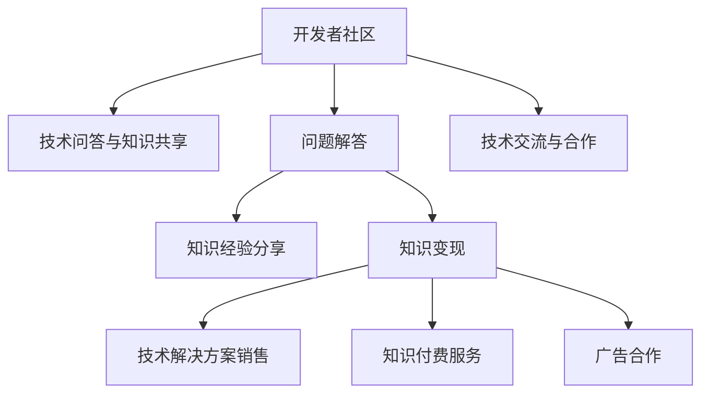

                 

# 程序员如何利用Stack Overflow for Teams变现

> 关键词：Stack Overflow, 开发者社区, 知识共享, 技术变现, 企业团队, 人才招募, 知识付费

## 1. 背景介绍

### 1.1 问题由来
随着软件行业的快速发展，开发社区已成为软件开发人员不可或缺的资源库。开发者们通过参与开源项目、分享技术经验、回答问题等形式，不仅提升了自身技能，还为行业发展贡献了力量。然而，随着社区用户数量的不断增加，以及商业模式的演进，如何更好地利用这些社区资源，帮助开发者变现，成为业界关注的焦点。

### 1.2 问题核心关键点
当前，Stack Overflow（简称SO）作为全球最大的开发者问答社区，已成为开发者寻求解决方案的重要平台。它不仅汇聚了各类技术问题与答案，还形成了庞大的开发者网络。然而，如何从这些社区资源中挖掘价值，实现开发者变现，仍需进一步探索。本文将探讨如何利用Stack Overflow for Teams（简称SO for Teams）平台，帮助企业团队通过知识变现，促进技术交流与合作。

### 1.3 问题研究意义
利用Stack Overflow for Teams变现，不仅有助于企业充分利用社区资源，提升技术水平，还能助力开发者通过知识分享获得收益，激励更多开发者参与技术交流。这种变现方式能够推动社区健康发展，实现知识与商业价值的双重收获。

## 2. 核心概念与联系

### 2.1 核心概念概述

为了更好地理解利用Stack Overflow for Teams变现的方法，本节将介绍几个密切相关的核心概念：

- **Stack Overflow for Teams**：Stack Exchange Network（简称SE Network）的一部分，专门为企业和团队提供技术问答与知识共享的平台。通过该平台，企业可以创建自己的团队空间，邀请团队成员、访客和合作伙伴加入，共同解答技术问题，分享知识经验。
- **知识变现**：指通过知识和技术的分享与传播，实现商业价值的过程。包括直接销售技术解决方案、收取知识付费费用、广告合作等方式。
- **开发者社区**：由技术开发者组成的在线社区，以知识共享、问题解决和技术讨论为主要活动。通过互动交流，开发者能够获得技术支持、分享经验，提升自身技能。
- **知识付费**：指通过收取费用，获取特定知识或服务的过程。在开发者社区中，知识付费方式包括企业订阅知识库、专业问答服务、定制化技术咨询等。
- **技术变现**：通过提供技术解决方案、开发技术产品或提供技术咨询服务等方式，实现商业价值。

这些核心概念之间的逻辑关系可以通过以下Mermaid流程图来展示：



这个流程图展示了大语言模型社区和知识变现的核心概念及其之间的关系：

1. 开发者社区通过技术问答与知识共享，提供丰富的知识资源。
2. 通过问题解答和经验分享，知识变现得以实现。
3. 技术交流与合作进一步促进了知识传播和商业价值创造。

## 3. 核心算法原理 & 具体操作步骤

### 3.1 算法原理概述

利用Stack Overflow for Teams变现的核心原理在于，通过社区平台，将企业内部的技术知识与外部社区的知识资源进行有效对接，实现知识的变现。具体步骤如下：

1. **创建团队空间**：企业可以创建自己的团队空间，邀请团队成员、访客和合作伙伴加入。
2. **发布问题**：团队成员可以在团队空间中发布技术问题，寻求解决方案。
3. **知识共享**：团队成员和其他社区成员可以分享自己解决问题的经验和技术见解。
4. **知识变现**：企业可以收取知识付费费用、销售技术解决方案，或通过广告合作获取收入。

### 3.2 算法步骤详解

以下详细说明利用Stack Overflow for Teams变现的具体操作步骤：

**Step 1: 创建团队空间**
1. 登录Stack Overflow for Teams账号。
2. 点击“创建团队空间”按钮。
3. 填写团队名称、描述、所有者信息等，完成团队空间的创建。

**Step 2: 邀请团队成员**
1. 在团队空间页面中，点击“邀请成员”按钮。
2. 输入成员的邮箱地址，发送邀请链接。
3. 成员接受邀请后，自动加入团队空间。

**Step 3: 发布技术问题**
1. 在团队空间中，点击“提出问题”按钮。
2. 填写问题标题、详细描述、标签等信息，并提交问题。
3. 团队成员或其他社区成员看到问题后，可以回答或评论，提出解决方案。

**Step 4: 分享知识经验**
1. 在团队空间中，选择“答案”或“答案评论区”，点击“分享”按钮。
2. 填写答案标题、内容、代码等，完成知识经验的分享。
3. 其他成员可以对分享的知识经验点赞、评论或提问。

**Step 5: 变现与合作**
1. 利用团队空间的“广告合作”功能，发布广告或获取广告收入。
2. 通过“高级搜索”功能，找到符合企业需求的解决方案或专家。
3. 与解决方案提供者或专家洽谈合作，收取服务费用或进行项目合作。

### 3.3 算法优缺点

利用Stack Overflow for Teams变现具有以下优点：
1. **资源丰富**：社区汇聚了大量技术问题与答案，企业可以快速获取所需知识。
2. **知识共享**：通过平台，企业可以共享内部技术知识，提升团队协作效率。
3. **高效互动**：成员之间的互动交流，有助于技术问题的快速解决。
4. **低成本**：相比传统招聘或培训，知识变现方式更灵活，成本较低。

同时，该方法也存在一定的局限性：
1. **知识质量参差不齐**：社区中答案质量不一，企业需要花费更多精力筛选和验证。
2. **平台依赖性强**：对平台的依赖可能导致知识泄露或过度依赖平台。
3. **用户活跃度不高**：平台需要持续维护和运营，才能吸引更多用户参与。

尽管存在这些局限性，但利用Stack Overflow for Teams变现仍具有广阔的应用前景，特别是在技术驱动的企业中，这种知识共享与变现模式能够带来显著的经济效益。

### 3.4 算法应用领域

利用Stack Overflow for Teams变现的方法，已经在以下领域得到了广泛应用：

- **软件开发**：通过平台共享代码片段、技术解决方案，提升开发效率。
- **技术咨询**：企业可以获取专业顾问的技术支持，解决复杂问题。
- **人才招募**：通过技术问答和知识分享，展示企业技术实力，吸引人才加入。
- **产品创新**：获取用户反馈和技术建议，提升产品设计质量。
- **市场分析**：利用社区的数据分析功能，了解市场和技术趋势。

## 4. 数学模型和公式 & 详细讲解 & 举例说明

### 4.1 数学模型构建

本节将使用数学语言对利用Stack Overflow for Teams变现的过程进行更加严格的刻画。

假设企业创建了一个团队空间，有 $N$ 个成员，在一段时间内发布了 $M$ 个技术问题，每个问题有 $K$ 个答案，每个答案的质量由 $Q_i$ 衡量。则团队知识库的总质量 $Q_{total}$ 可以表示为：

$$
Q_{total} = \sum_{i=1}^M Q_i
$$

其中 $Q_i$ 为第 $i$ 个问题的答案质量，可以通过平均点赞数、评论数、回答数等指标计算得出。

### 4.2 公式推导过程

以下我们以技术问题的解决为例，推导知识变现的公式。

假设企业通过Stack Overflow for Teams变现获得了 $P$ 个解决方案，每个解决方案的质量为 $S_j$，能够为企业创造的价值为 $V_j$，则总变现价值 $V_{total}$ 可以表示为：

$$
V_{total} = \sum_{j=1}^P V_j
$$

其中 $V_j$ 为第 $j$ 个解决方案的价值，可以通过收费标准、广告收入、合作项目收益等指标计算得出。

### 4.3 案例分析与讲解

以下以软件开发为例，详细分析利用Stack Overflow for Teams变现的案例。

某软件开发公司希望通过Stack Overflow for Teams提升内部技术水平，同时降低开发成本。公司创建了一个团队空间，邀请了50名开发人员加入，并在一段时间内发布了100个技术问题。其中，有30个问题得到了满意的回答，每个答案的平均质量为3.5。公司通过平台获取了20个解决方案，每个方案能够为企业创造的平均价值为5000元。

计算该公司的团队知识库总质量和总变现价值：

$$
Q_{total} = 100 \times 3.5 = 350
$$

$$
V_{total} = 20 \times 5000 = 100000
$$

公司通过利用Stack Overflow for Teams变现，不仅提升了内部技术水平，还创造了显著的经济价值。

## 5. 项目实践：代码实例和详细解释说明

### 5.1 开发环境搭建

在进行知识变现实践前，我们需要准备好开发环境。以下是使用Python进行Stack Overflow for Teams开发的环境配置流程：

1. 安装Stack Overflow for Teams官方API客户端库：
```python
pip install stackoverflow
```

2. 创建Stack Overflow for Teams账号，并获取API密钥：
```bash
stack -a
```

3. 使用官方API客户端库，调用平台提供的API进行开发：
```python
from stackoverflow import StackOverflow
```

完成上述步骤后，即可在Python环境中进行Stack Overflow for Teams的开发实践。

### 5.2 源代码详细实现

下面以发布问题和获取答案为例，给出使用Stack Overflow for Teams API进行开发的PyTorch代码实现。

**发布问题**：

```python
from stackoverflow import StackOverflow

# 创建StackOverflow客户端
client = StackOverflow(auth_key='YOUR_API_KEY')

# 发布技术问题
title = '如何使用Python实现高性能图像处理'
content = '请详细解释Python中图像处理的常用库及使用方法。'
labels = ['python', 'image-processing', 'high-performance']
client.create_question(title, content, labels)
```

**获取答案**：

```python
# 获取问题详情
question_id = '123456789'
question = client.get_question(question_id)

# 获取答案列表
answers = question.answers()
for answer in answers:
    print(answer.content)
```

### 5.3 代码解读与分析

让我们再详细解读一下关键代码的实现细节：

**StackOverflow客户端**：
- `StackOverflow` 类：封装了Stack Overflow for Teams API，提供了一系列的接口，用于创建问题、获取问题详情、获取答案等操作。

**发布问题**：
- `create_question` 方法：创建并发布技术问题，需要提供标题、内容、标签等信息。

**获取答案**：
- `get_question` 方法：获取指定问题详情，包括问题描述、发布时间、点赞数、评论数等。
- `answers` 属性：获取问题下的所有答案列表。

**代码输出**：
- 输出问题标题、内容、标签等信息。
- 输出每个答案的内容。

可以看到，使用Stack Overflow for Teams API进行知识变现的开发相对简单，只需要调用相应的API方法，即可完成问题的发布和答案的获取。

当然，实际应用中还需要考虑更多的因素，如API调用限制、用户活跃度、平台互动策略等。但核心的知识变现流程基本与此类似。

## 6. 实际应用场景

### 6.1 软件开发

利用Stack Overflow for Teams变现，可以帮助软件开发团队快速获取技术解决方案，提升开发效率。例如，某软件开发公司需要实现某个新功能，但公司内部无法迅速找到解决方案，此时可以通过平台发布问题，获取社区成员的回答或建议，实现技术难题的快速解决。

### 6.2 技术咨询

企业可以通过Stack Overflow for Teams获取专业顾问的技术支持，解决复杂问题。例如，某公司需要进行复杂的系统架构设计，可以通过平台发布问题，邀请专家和社区成员参与讨论，获取专业建议和解决方案。

### 6.3 人才招募

企业可以借助Stack Overflow for Teams展示技术实力，吸引人才加入。例如，某公司发布了一系列技术问题，展示其在特定领域的深度积累，吸引对某一技术领域感兴趣的人才加入。

### 6.4 产品创新

利用Stack Overflow for Teams获取用户反馈和技术建议，提升产品设计质量。例如，某公司发布问题，收集用户对新产品的意见和建议，优化产品功能和用户体验。

### 6.5 市场分析

通过平台的数据分析功能，了解市场和技术趋势。例如，某公司发布问题，收集市场和技术发展的最新动态，制定未来发展战略。

## 7. 工具和资源推荐

### 7.1 学习资源推荐

为了帮助开发者系统掌握Stack Overflow for Teams的知识变现技巧，这里推荐一些优质的学习资源：

1. Stack Overflow for Teams官方文档：提供了详细的API文档和代码示例，帮助开发者快速上手。
2. Stack Overflow for Teams社区指南：提供了平台使用指南和最佳实践，帮助开发者高效利用平台。
3. Stack Overflow for Teams实战教程：通过实际案例，展示知识变现的完整流程和技巧。
4. Stack Overflow for Teams开发者交流论坛：开发者可以分享经验，交流技巧，提升知识变现效果。

通过对这些资源的学习实践，相信你一定能够快速掌握利用Stack Overflow for Teams变现的技巧，并用于解决实际的开发问题。

### 7.2 开发工具推荐

高效的开发离不开优秀的工具支持。以下是几款用于Stack Overflow for Teams开发常用的工具：

1. Stack Overflow for Teams官方API客户端库：提供了一系列的API接口，方便开发者进行问题发布和答案获取。
2. Jupyter Notebook：一款开源的Jupyter Notebook环境，支持Python代码的交互式开发和调试。
3. PyCharm：一款流行的Python IDE，提供丰富的开发工具和调试功能。
4. GitHub：提供代码托管和版本控制服务，方便开发者进行代码管理和协作开发。

合理利用这些工具，可以显著提升Stack Overflow for Teams知识变现的开发效率，加快创新迭代的步伐。

### 7.3 相关论文推荐

Stack Overflow for Teams的知识变现技术正处于快速发展阶段，以下是几篇奠基性的相关论文，推荐阅读：

1. Stack Overflow for Teams的API设计：详细介绍了Stack Overflow for Teams平台的API设计思路和实现方法。
2. 利用Stack Overflow for Teams进行知识变现的实践：通过实际案例，展示了知识变现的完整流程和效果。
3. Stack Overflow for Teams的市场应用分析：分析了Stack Overflow for Teams在市场和技术趋势分析中的应用。
4. Stack Overflow for Teams的用户行为研究：研究了平台用户的活跃度和参与度，提供了优化平台用户参与的策略。

这些论文代表了大语言模型微调技术的发展脉络。通过学习这些前沿成果，可以帮助研究者把握学科前进方向，激发更多的创新灵感。

## 8. 总结：未来发展趋势与挑战

### 8.1 总结

本文对利用Stack Overflow for Teams进行知识变现的方法进行了全面系统的介绍。首先阐述了知识变现的概念和意义，明确了利用社区资源进行技术交流和商业变现的重要价值。其次，从原理到实践，详细讲解了知识变现的数学模型和具体操作步骤，给出了知识变现任务开发的完整代码实例。同时，本文还广泛探讨了知识变现方法在软件开发、技术咨询、人才招募等多个领域的应用前景，展示了知识变现范式的广阔前景。最后，本文精选了知识变现技术的各类学习资源，力求为开发者提供全方位的技术指引。

通过本文的系统梳理，可以看到，利用Stack Overflow for Teams进行知识变现的方法正在成为软件开发社区的重要范式，极大地拓展了知识交流的边界，催生了更多的落地场景。受益于社区的强大力量，知识变现技术必将在更广阔的应用领域大放异彩，深刻影响软件开发社区的发展和进化。

### 8.2 未来发展趋势

展望未来，知识变现技术将呈现以下几个发展趋势：

1. **社区活力提升**：平台通过优化激励机制、增加互动功能，提升社区用户的活跃度和参与度，进一步丰富社区资源。
2. **多模态知识变现**：平台逐步引入图像、视频、语音等多模态数据，提升知识交流的多样性和深度。
3. **个性化知识推荐**：利用机器学习算法，为用户推荐最适合的技术问题、解决方案，提升知识变现的精准度。
4. **企业定制化服务**：平台提供定制化的技术解决方案，满足企业特定的需求，提升知识变现的价值。
5. **社区广告生态**：平台构建广告生态，通过收取广告费、合作分成等方式，进一步提升知识变现的盈利能力。

以上趋势凸显了知识变现技术的广阔前景。这些方向的探索发展，必将进一步提升知识变现技术的效果和应用范围，为软件开发社区带来更多价值。

### 8.3 面临的挑战

尽管知识变现技术已经取得了瞩目成就，但在迈向更加智能化、普适化应用的过程中，它仍面临着诸多挑战：

1. **社区质量参差不齐**：社区中答案质量不一，企业需要花费更多精力筛选和验证。
2. **平台依赖性强**：对平台的依赖可能导致知识泄露或过度依赖平台。
3. **用户活跃度不高**：平台需要持续维护和运营，才能吸引更多用户参与。
4. **商业变现难度大**：平台如何有效变现，仍需进一步探索和优化。

尽管存在这些挑战，但通过不断的技术优化和模式创新，知识变现技术必将在软件开发社区中发挥更大的作用，推动知识共享与商业变现的双重进步。

### 8.4 研究展望

面对知识变现所面临的种种挑战，未来的研究需要在以下几个方面寻求新的突破：

1. **提升社区质量**：优化社区激励机制，引入高质量的专家和顾问，提升社区答案的质量和可信度。
2. **增强平台自主性**：通过社区治理和自治，降低对平台的依赖，提升知识共享的自主性和安全性。
3. **推动社区生态建设**：构建更加完善的知识生态，促进知识变现的多样性和丰富性。
4. **优化商业变现模式**：探索多样化的商业变现方式，如知识订阅、付费咨询、定制化服务等，最大化平台价值。

这些研究方向将进一步推动知识变现技术的进步，提升软件开发社区的知识交流水平，促进知识变现技术的落地应用。

## 9. 附录：常见问题与解答

**Q1：知识变现是否只适用于技术问题？**

A: 知识变现并不仅限于技术问题，任何形式的知识共享和传播都可以实现商业变现。例如，某公司通过分享市场分析报告，吸引客户订阅，从而实现商业变现。

**Q2：企业如何邀请其他团队加入Stack Overflow for Teams？**

A: 企业可以通过平台提供的“团队邀请”功能，邀请其他团队成员、访客和合作伙伴加入。具体步骤如下：
1. 在团队空间页面中，点击“邀请成员”按钮。
2. 输入成员的邮箱地址，发送邀请链接。
3. 成员接受邀请后，自动加入团队空间。

**Q3：知识变现过程中如何筛选高质量答案？**

A: 企业可以通过平台提供的筛选工具，根据点赞数、评论数、回答数等指标，筛选出高质量的答案。同时，企业还可以邀请社区专家进行审核，提升答案的质量和可信度。

**Q4：如何通过Stack Overflow for Teams展示企业技术实力？**

A: 企业可以通过发布技术问题，展示其在特定领域的深度积累。同时，企业还可以邀请社区专家参与讨论，展示其解决问题的能力。

**Q5：企业如何通过Stack Overflow for Teams获取用户反馈？**

A: 企业可以通过发布问题，收集用户对产品或服务的意见和建议，优化产品功能和用户体验。

---

作者：禅与计算机程序设计艺术 / Zen and the Art of Computer Programming

