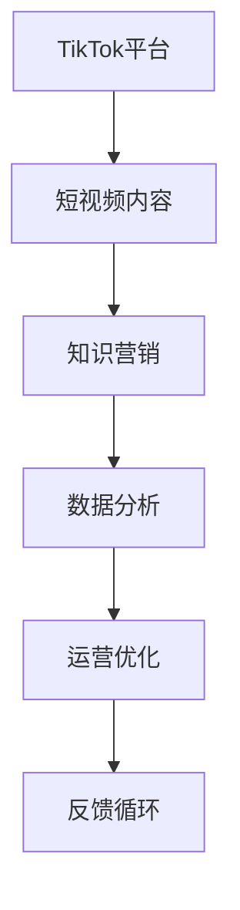

                 

## 1. 背景介绍

### 1.1 问题由来

随着数字媒体和短视频的兴起，TikTok（抖音）等短视频平台迅速崛起，成为全球用户最喜爱的社交应用之一。程序员群体中，越来越多的开发者开始尝试在TikTok上发布技术视频，进行知识分享和互动。但很多程序员对此还是缺乏系统的理解，因此本文将详细介绍如何利用TikTok进行知识营销，帮助程序员更好地融入短视频时代，分享知识和经验。

### 1.2 问题核心关键点

TikTok知识营销的核心在于如何通过短视频形式，将复杂的技术问题以简单、生动、有趣的方式展现出来，吸引观众并有效传达技术知识。这不仅需要优秀的技术功底，更需要一定的创意和表达能力。本文将从内容创作、平台运营和数据分析三个方面，系统讲解TikTok知识营销的策略和实践方法。

## 2. 核心概念与联系

### 2.1 核心概念概述

为更好地理解TikTok知识营销，需要明确几个核心概念：

- **TikTok平台**：全球最流行的短视频社交平台，具有海量的用户基础和强大的算法推荐机制。
- **知识营销**：通过知识分享和技术传播，实现品牌或个人的市场推广，提升品牌影响力。
- **短视频内容**：时长较短（通常小于60秒）的视频内容，形式多样，易于传播。
- **数据驱动运营**：利用平台提供的数据分析工具，监测和优化内容表现。

这些核心概念之间的联系紧密，主要体现在通过TikTok平台，利用短视频内容进行知识传播，并通过数据分析提升运营效果。

### 2.2 核心概念原理和架构的 Mermaid 流程图



该流程图展示了TikTok知识营销的核心流程：
1. 利用TikTok平台，创建和发布短视频内容。
2. 内容通过知识营销的方式，传达技术和知识。
3. 利用数据分析，监测内容表现。
4. 根据数据分析结果，进行运营优化。
5. 形成反馈循环，不断改进和提升营销效果。

## 3. 核心算法原理 & 具体操作步骤

### 3.1 算法原理概述

TikTok知识营销的算法原理主要涉及视频推荐、观众互动和数据分析三方面：

- **视频推荐算法**：利用TikTok的推荐算法，将内容推荐给潜在的目标观众。推荐算法主要基于用户的兴趣、观看历史和互动行为，进行内容的适配和排序。
- **观众互动算法**：TikTok的算法还包含观众互动环节，根据观众的反应（如点赞、评论、转发等），调整内容的曝光度和曝光位置。
- **数据分析算法**：TikTok提供了强大的数据分析工具，帮助内容创作者监测视频的观看量、互动率和转化率等指标。

### 3.2 算法步骤详解

#### 3.2.1 内容创作

- **选题**：选择具有较高观看潜力和观众兴趣的选题。选题应具有时效性、实用性或娱乐性。
- **脚本编写**：撰写短视频脚本，包括开场白、技术知识点、示例代码、互动环节等。
- **内容录制**：录制视频，通常采用手机或电脑摄像头，保证画面清晰和声音清晰。
- **编辑和特效**：使用视频编辑软件进行剪辑、特效添加和字幕生成，提升视频质量。
- **上传与发布**：将视频上传到TikTok平台，并设定好标题、标签和隐私策略等。

#### 3.2.2 平台运营

- **观众互动**：积极与观众互动，回复评论，鼓励观众点赞和分享。
- **数据分析**：利用TikTok提供的工具，分析视频表现，如观看量、点赞数、互动率等。
- **内容优化**：根据数据分析结果，优化脚本和制作流程，提升视频质量。
- **定期发布**：建立内容发布计划，保持内容的持续性和稳定性。

#### 3.2.3 数据分析

- **视频数据**：查看视频的观看量、点赞数、评论数、分享数等关键指标。
- **观众数据**：分析观众的年龄、性别、地理位置和观看偏好等。
- **内容表现**：评估不同主题、时长、语言和风格的视频表现。
- **反馈分析**：利用观众反馈和数据分析结果，优化未来内容创作和运营策略。

### 3.3 算法优缺点

#### 3.3.1 优点

- **高效传播**：短视频形式易于传播，能够快速吸引用户关注。
- **互动性强**：TikTok的算法设计鼓励观众互动，增加用户粘性。
- **数据支持**：平台提供的数据分析工具，方便内容创作者监测和优化。

#### 3.3.2 缺点

- **时长限制**：短视频时长有限，难以深入讲解复杂技术问题。
- **用户质量参差不齐**：部分观众可能对技术内容缺乏兴趣，影响整体效果。
- **算法依赖性强**：依赖TikTok的推荐算法，对算法的理解和利用能力要求较高。

### 3.4 算法应用领域

TikTok知识营销不仅适用于技术开发者，也广泛应用于各种知识分享场景，包括但不限于：

- **教育培训**：利用短视频讲解知识要点，提升学习效率。
- **企业培训**：制作技能培训视频，提升员工技能水平。
- **创意设计**：展示设计作品和技术实现过程，提升创意表达。
- **品牌推广**：通过品牌故事和技术应用，提升品牌影响力和美誉度。

## 4. 数学模型和公式 & 详细讲解 & 举例说明

### 4.1 数学模型构建

假设TikTok推荐算法主要基于用户兴趣和内容质量两个维度，分别用 $u$ 和 $c$ 表示。用户兴趣 $u$ 通过用户的历史行为数据进行建模，内容质量 $c$ 通过内容的互动数据进行评估。则推荐算法可以表示为：

$$
\text{推荐评分} = f(u, c)
$$

其中，$f$ 为综合兴趣和内容质量的推荐函数。推荐函数 $f$ 可以表示为加权求和形式：

$$
f(u, c) = \alpha u + \beta c
$$

其中，$\alpha$ 和 $\beta$ 为兴趣和内容质量的重要性权重。

### 4.2 公式推导过程

在实际应用中，$f(u, c)$ 的计算过程可以分为以下几步：

1. **用户兴趣建模**：
   - 利用用户的历史观看数据 $D_u = \{x_i\}_{i=1}^N$，计算用户对不同视频的兴趣权重 $w_u = \{w_{ui}\}_{i=1}^N$。
   - 兴趣权重 $w_{ui}$ 可以根据用户观看时间、点赞数、评论数等指标计算得出。

2. **内容质量评估**：
   - 利用视频互动数据 $D_c = \{y_j\}_{j=1}^M$，计算内容质量评分 $v_j$。
   - 内容质量评分 $v_j$ 可以通过点赞数、评论数、分享数等指标计算得出。

3. **综合计算**：
   - 根据用户兴趣权重和内容质量评分，计算推荐评分 $s_i$。
   - 推荐评分 $s_i$ 可以通过加权求和公式计算：$s_i = \sum_{j=1}^M w_{ij} v_j$。

### 4.3 案例分析与讲解

假设某视频内容 $i$ 的观看量为 $x_i$，点赞数为 $y_i$，评论数为 $z_i$，分享数为 $w_i$。根据上述模型，用户 $u$ 对视频内容 $i$ 的推荐评分 $s_{ui}$ 可以计算为：

$$
s_{ui} = \alpha w_{ui} + \beta (y_i + z_i + w_i)
$$

其中，$w_{ui}$ 表示用户 $u$ 对视频内容 $i$ 的兴趣权重，$y_i, z_i, w_i$ 分别表示视频的点赞数、评论数和分享数，$\alpha$ 和 $\beta$ 为兴趣和内容质量的重要性权重。

## 5. 项目实践：代码实例和详细解释说明

### 5.1 开发环境搭建

#### 5.1.1 安装Python

1. 下载Python安装包，根据系统需求选择32位或64位。
2. 安装pip依赖管理工具。

#### 5.1.2 安装TikTok开发工具包

1. 安装Python video editing工具包（如OpenShot、Shotcut等）。
2. 安装TikTok官方SDK，用于视频上传和数据查询。

#### 5.1.3 配置开发环境

1. 搭建本地开发环境，安装相关依赖库（如ffmpeg、numpy、pandas等）。
2. 配置TikTok官方SDK的API密钥和认证信息，以进行视频上传和数据查询。

### 5.2 源代码详细实现

#### 5.2.1 视频内容制作

1. **选题**：选择具有较高观看潜力和观众兴趣的选题，例如“Python编程技巧”、“Java面试经验”等。
2. **脚本编写**：撰写短视频脚本，包括开场白、技术知识点、示例代码、互动环节等。
3. **内容录制**：录制视频，通常采用手机或电脑摄像头，保证画面清晰和声音清晰。
4. **编辑和特效**：使用视频编辑软件进行剪辑、特效添加和字幕生成，提升视频质量。
5. **上传与发布**：将视频上传到TikTok平台，并设定好标题、标签和隐私策略等。

#### 5.2.2 平台运营

1. **观众互动**：积极与观众互动，回复评论，鼓励观众点赞和分享。
2. **数据分析**：利用TikTok提供的工具，分析视频表现，如观看量、点赞数、评论数、分享数等。
3. **内容优化**：根据数据分析结果，优化脚本和制作流程，提升视频质量。
4. **定期发布**：建立内容发布计划，保持内容的持续性和稳定性。

#### 5.2.3 数据分析

1. **视频数据**：查看视频的观看量、点赞数、评论数、分享数等关键指标。
2. **观众数据**：分析观众的年龄、性别、地理位置和观看偏好等。
3. **内容表现**：评估不同主题、时长、语言和风格的视频表现。
4. **反馈分析**：利用观众反馈和数据分析结果，优化未来内容创作和运营策略。

### 5.3 代码解读与分析

#### 5.3.1 脚本编写

脚本编写需要结合技术内容和观众兴趣，设计简洁明了的表达方式。例如，对于“Python编程技巧”视频，脚本可以设计为：

```python
# 开场白
print("大家好，今天我们来学习Python的字符串处理技巧。")
# 技术知识点
print("字符串操作非常重要，掌握它们可以大大提升编程效率。")
# 示例代码
print("首先，我们可以使用字符串的join方法，将列表中的元素拼接成一个字符串。")
# 互动环节
print("请各位观众在评论区分享你常用的字符串操作技巧。")
```

#### 5.3.2 内容录制

内容录制需要保证视频画面清晰和声音清晰。以下是示例代码：

```python
import cv2
import numpy as np

# 视频录制
def record_video():
    cap = cv2.VideoCapture(0)  # 摄像头录制
    while cap.isOpened():
        ret, frame = cap.read()
        if ret:
            cv2.imshow('frame', frame)
            if cv2.waitKey(1) & 0xFF == ord('q'):
                break
    cap.release()
    cv2.destroyAllWindows()

record_video()
```

#### 5.3.3 视频编辑

视频编辑需要使用Python视频编辑工具包进行剪辑、特效添加和字幕生成。以下是示例代码：

```python
# 视频剪辑
import shotcut
from shotcut import VideoEdit

video_edit = VideoEdit("input.mp4")
video_edit.cut(start_time=0, end_time=10, name="开头")
video_edit.cut(start_time=20, end_time=30, name="中间")
video_edit.cut(start_time=40, end_time=50, name="结尾")
video_edit.save("output.mp4")

# 特效添加
video_edit.add_filter(filter_name="慢动作")
video_edit.add_filter(filter_name="黑白")
video_edit.save("output_filter.mp4")

# 字幕生成
video_edit.add_caption(text="Python编程技巧", start_time=0, end_time=10)
video_edit.save("output_caption.mp4")
```

#### 5.3.4 数据查询

利用TikTok官方SDK，可以查询视频观看量、点赞数、评论数等数据。以下是示例代码：

```python
import tiktok  # 导入TikTok SDK

# 查询视频信息
video_id = "1234567890"
video_data = tiktok.get_video(video_id)
print(video_data)
```

### 5.4 运行结果展示

运行上述代码后，可以分别展示以下结果：

- **视频剪辑**：生成的视频可以在本地播放，内容保持清晰流畅。
- **特效添加**：视频中添加了慢动作和黑白滤镜，视觉效果提升。
- **字幕生成**：视频底部添加了字幕，观众可以更清晰地看到视频内容。
- **数据查询**：通过TikTok SDK，获取了视频的观看量、点赞数、评论数等数据。

## 6. 实际应用场景

### 6.1 教育培训

TikTok知识营销在教育培训中的应用非常广泛。通过短视频形式，可以将复杂的技术问题简洁明了地讲解出来，让学习者更易理解。例如，可以将Python编程技巧、机器学习算法等技术内容，以短视频形式进行讲解，提升学习效率和互动性。

### 6.2 企业培训

企业在培训员工时，可以通过TikTok发布技能培训视频，提升员工技能水平。例如，IT部门可以发布Python编程、SQL查询等技能的培训视频，帮助员工快速掌握新技能。

### 6.3 创意设计

设计师可以通过TikTok展示设计作品和技术实现过程，提升创意表达能力。例如，展示UI设计作品、Web开发实现过程等，吸引更多关注和互动。

### 6.4 品牌推广

品牌可以通过TikTok发布品牌故事和技术应用，提升品牌影响力和美誉度。例如，电子产品品牌可以发布产品使用教程、技术创新点等，提升品牌知名度和用户粘性。

## 7. 工具和资源推荐

### 7.1 学习资源推荐

1. **TikTok官方文档**：提供详细的SDK文档和API接口说明。
2. **Coursera在线课程**：提供TikTok营销的在线课程，涵盖内容创作、平台运营、数据分析等方面。
3. **YouTube教程**：YouTube上有大量TikTok营销的实战教程，适合新手学习。
4. **《短视频营销指南》**：系统介绍短视频营销的理论与实践，涵盖内容创作、平台运营和数据分析等方面。

### 7.2 开发工具推荐

1. **OpenShot**：简单易用的视频编辑工具，支持剪辑、特效添加和字幕生成。
2. **Shotcut**：功能丰富的视频编辑工具，支持复杂的视频编辑需求。
3. **ffmpeg**：强大的多媒体处理工具，支持视频转换、剪辑、合并等操作。
4. **Pandas和NumPy**：Python的数据分析库，用于数据处理和统计分析。

### 7.3 相关论文推荐

1. **《短视频内容推荐系统》**：介绍短视频推荐系统的算法原理和实现方法。
2. **《用户行为分析与互动设计》**：探讨用户行为分析与互动设计的理论和方法。
3. **《视频内容效果评估》**：分析视频内容表现，评估不同主题和风格的观看效果。

## 8. 总结：未来发展趋势与挑战

### 8.1 总结

本文详细介绍了程序员如何利用TikTok进行知识营销，涵盖了内容创作、平台运营和数据分析等方面。TikTok知识营销不仅能够提升个人品牌影响力，还能推动技术知识的传播和应用。通过系统的学习和实践，程序员可以更好地融入短视频时代，分享知识和经验。

### 8.2 未来发展趋势

未来，TikTok知识营销将呈现以下几个发展趋势：

1. **内容形式多样化**：除了短视频，还可以利用图文、直播等多种形式进行知识传播。
2. **互动模式丰富化**：增加更多互动方式，如投票、挑战等，提升观众参与度。
3. **数据驱动决策**：利用AI和大数据技术，进行更精准的内容推荐和运营优化。
4. **技术创新不断**：利用新技术如AR、VR等，增强内容体验和互动效果。

### 8.3 面临的挑战

尽管TikTok知识营销具有广阔的前景，但仍面临以下挑战：

1. **内容创意不足**：许多开发者缺乏创意，难以创作高质量的视频内容。
2. **平台算法变化**：TikTok算法更新较快，开发者需要持续学习才能保持内容竞争力。
3. **观众质量参差不齐**：部分观众可能对技术内容缺乏兴趣，影响整体效果。
4. **数据分析复杂**：平台提供的数据分析工具较为复杂，开发者需要具备一定的数据处理能力。

### 8.4 研究展望

面对这些挑战，未来的研究需要在以下几个方面寻求新的突破：

1. **内容创作创新**：探索更多创意和表达方式，提升视频内容质量。
2. **算法理解和应用**：深入学习TikTok算法原理，灵活应用推荐和互动技术。
3. **数据分析技能提升**：提升数据处理和分析能力，提高内容创作效率。
4. **用户互动优化**：设计更多互动形式，提升观众参与度和反馈效果。

## 9. 附录：常见问题与解答

**Q1: TikTok知识营销的优缺点是什么？**

**A1:** TikTok知识营销的优点在于：
- **高效传播**：短视频形式易于传播，能够快速吸引用户关注。
- **互动性强**：TikTok的算法设计鼓励观众互动，增加用户粘性。
- **数据支持**：平台提供的数据分析工具，方便内容创作者监测和优化。

缺点在于：
- **时长限制**：短视频时长有限，难以深入讲解复杂技术问题。
- **用户质量参差不齐**：部分观众可能对技术内容缺乏兴趣，影响整体效果。
- **算法依赖性强**：依赖TikTok的推荐算法，对算法的理解和利用能力要求较高。

**Q2: 如何利用TikTok进行内容创作？**

**A2:**
1. **选题**：选择具有较高观看潜力和观众兴趣的选题，例如“Python编程技巧”、“Java面试经验”等。
2. **脚本编写**：撰写短视频脚本，包括开场白、技术知识点、示例代码、互动环节等。
3. **内容录制**：录制视频，通常采用手机或电脑摄像头，保证画面清晰和声音清晰。
4. **编辑和特效**：使用视频编辑软件进行剪辑、特效添加和字幕生成，提升视频质量。
5. **上传与发布**：将视频上传到TikTok平台，并设定好标题、标签和隐私策略等。

**Q3: 如何进行数据分析和运营优化？**

**A3:**
1. **视频数据**：查看视频的观看量、点赞数、评论数、分享数等关键指标。
2. **观众数据**：分析观众的年龄、性别、地理位置和观看偏好等。
3. **内容表现**：评估不同主题、时长、语言和风格的视频表现。
4. **反馈分析**：利用观众反馈和数据分析结果，优化未来内容创作和运营策略。

---

作者：禅与计算机程序设计艺术 / Zen and the Art of Computer Programming

