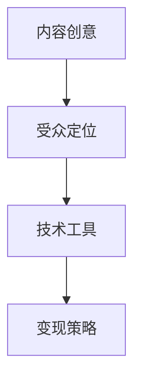

                 

# 程序员如何利用播客进行知识变现

## 1. 背景介绍

### 1.1 问题由来

在信息爆炸的时代，知识迅速贬值，人们在获取信息的同时，面临着筛选和判断信息的困难。播客作为一种新兴的信息传递方式，凭借其低门槛、高便利性和互动性，迅速崛起。对于程序员而言，播客不仅可以作为技术交流的平台，还可以成为知识变现的重要渠道。程序员可以通过播客分享技术经验、项目案例、行业趋势等内容，获取听众的认可，进而实现价值转换。

### 1.2 问题核心关键点

播客作为一种新型媒介，程序员可以通过以下关键点进行知识变现：

- 内容创意：播客的核心在于内容。程序员需要挖掘技术痛点、行业热点、用户关注点，形成具有话题性和实用性的内容。
- 受众定位：找到目标受众，了解他们的需求和兴趣，针对性地制作播客内容。
- 技术工具：掌握播客制作的基本技术，包括录音、剪辑、编辑、发布等，确保高质量的播客输出。
- 变现策略：探索多样化的变现方式，如会员订阅、广告分成、付费课程等，实现商业化运作。

## 2. 核心概念与联系

### 2.1 核心概念概述

播客（Podcast）是一种通过互联网发布和共享音频内容的方式，通常包含多个独立片段。程序员播客是指程序员制作和分享技术相关的播客内容，以传递专业知识、分享技术经验和推动行业交流。

- **内容创意**：播客的内容创意来源于程序员的技术积累、项目实践和行业观察。高质量的内容能够吸引听众，提升播客的影响力。
- **受众定位**：确定目标受众是初级开发者、高级开发者、特定技术领域的专业人士，还是广大的编程爱好者，有助于针对性制作内容，提升播客的覆盖面和粘性。
- **技术工具**：播客制作包括录音、剪辑、编辑、发布等多个环节，涉及音频处理、图形设计、网络推广等技术。掌握这些工具，能够保证播客的高效制作和传播。
- **变现策略**：播客变现可以通过多种渠道实现，如会员订阅、广告分成、付费课程、赞助支持等。不同的变现方式适用于不同的播客定位和受众群体。

这些核心概念之间的联系可以通过以下Mermaid流程图来展示：



## 3. 核心算法原理 & 具体操作步骤

### 3.1 算法原理概述

程序员播客的知识变现过程，本质上是一个内容创作与市场匹配的过程。播客创作者需要不断创作高质量内容，并通过各种方式将其传递给目标受众，从而实现变现。

算法原理可以概括为以下几个步骤：

1. **内容生成**：基于程序员自身的技术积累和项目经验，创作出具有深度和实用性的播客内容。
2. **内容推广**：利用社交媒体、搜索引擎优化、用户口碑等多种渠道，将播客内容推广给目标受众。
3. **市场反馈**：根据受众反馈和订阅情况，不断优化播客内容和推广策略。
4. **变现实现**：根据播客的受众群体和变现方式，实现商业化运作，如会员订阅、广告分成、付费课程等。

### 3.2 算法步骤详解

#### 步骤1：内容生成

1. **选题与规划**：选择受众感兴趣的话题，规划播客的选题和内容结构。
2. **内容创作**：录制播客内容，进行音频编辑和后期制作。
3. **内容发布**：将制作完成的播客内容发布到各大平台，如Apple Podcasts、Spotify、SoundCloud等。

#### 步骤2：内容推广

1. **社交媒体营销**：在Twitter、LinkedIn、GitHub等平台分享播客内容和预告，吸引目标受众关注。
2. **搜索引擎优化**：使用SEO策略，提高播客在搜索结果中的排名，增加曝光率。
3. **用户口碑传播**：鼓励用户分享播客内容，通过口碑传播吸引新听众。

#### 步骤3：市场反馈

1. **用户反馈收集**：通过播客平台的用户评价和评论，收集听众的反馈。
2. **数据分析**：利用播客平台提供的数据分析工具，了解播客的收听情况和用户行为。
3. **内容优化**：根据反馈和数据分析结果，调整播客内容和推广策略。

#### 步骤4：变现实现

1. **会员订阅**：设置播客的会员订阅功能，通过订阅费实现变现。
2. **广告分成**：与播客平台合作，通过广告分成获得收入。
3. **付费课程**：将播客内容转化为付费课程，通过课程销售实现变现。

### 3.3 算法优缺点

#### 优点：

- **低成本进入**：播客制作门槛较低，不需要昂贵设备，适合程序员利用业余时间创作。
- **高传播潜力**：播客可以通过多种渠道传播，受众覆盖面广，传播速度快。
- **灵活性强**：播客内容形式多样，可以根据受众需求调整话题和形式。

#### 缺点：

- **内容创作耗时**：高质量内容创作耗时较长，难以快速产出大量内容。
- **变现效率较低**：初期播客听众数量有限，变现效率相对较低。
- **竞争激烈**：播客领域竞争激烈，吸引和留住听众需要持续努力。

### 3.4 算法应用领域

程序员播客不仅适用于技术分享和交流，还能广泛应用于以下几个领域：

- **技术教程**：制作编程语言、框架、工具的入门和进阶教程，帮助初学者入门。
- **项目案例**：分享实际项目的开发经验、遇到的问题及解决方案，提高项目实践能力。
- **行业趋势**：分析当前技术发展趋势，探讨行业热点话题，为从业者提供行业洞察。
- **职业发展**：分享职业规划、面试技巧、晋升经验等，帮助听众在职业生涯中取得突破。

## 4. 数学模型和公式 & 详细讲解 & 举例说明

### 4.1 数学模型构建

假设播客受众数量为 $N$，播客订阅率为 $R$，播客单次订阅费为 $P$，每次广告收入为 $A$，则播客的总收益 $R$ 可以表示为：

$$
R = N \times R \times P + N \times A
$$

其中，$N$ 为总受众数量，$R$ 为订阅率，$P$ 为单次订阅费，$A$ 为每次广告收入。

### 4.2 公式推导过程

1. **订阅收益计算**：
   $$
   N \times R \times P
   $$

   表示总受众数量 $N$ 乘以订阅率 $R$，再乘以单次订阅费 $P$。

2. **广告收入计算**：
   $$
   N \times A
   $$

   表示总受众数量 $N$ 乘以每次广告收入 $A$。

3. **总收益计算**：
   $$
   R = N \times R \times P + N \times A
   $$

   将订阅收益和广告收入相加，得到总收益 $R$。

### 4.3 案例分析与讲解

假设一个程序员播客有1000名订阅用户，订阅率为30%，每次订阅费为10元，每次广告收入为100元，则其总收益为：

$$
R = 1000 \times 0.3 \times 10 + 1000 \times 100 = 3000 + 100000 = 103000
$$

## 5. 项目实践：代码实例和详细解释说明

### 5.1 开发环境搭建

1. **录制设备**：选择一款高性能的麦克风和录音设备，确保音质清晰。
2. **音频编辑软件**：使用Audacity、Adobe Audition等软件进行音频录制和编辑。
3. **播客平台账号**：注册并登录各大播客平台账号，如Apple Podcasts、Spotify、SoundCloud等。

### 5.2 源代码详细实现

以下是一个简单的Python代码示例，用于计算播客订阅收益和广告收入：

```python
def calculate_revenue(subscribers: int, subscription_rate: float, subscription_price: float, ad_income: float) -> float:
    """
    计算播客的总收益
    :param subscribers: 总订阅用户数
    :param subscription_rate: 订阅率
    :param subscription_price: 单次订阅费
    :param ad_income: 每次广告收入
    :return: 总收益
    """
    subscription_revenue = subscribers * subscription_rate * subscription_price
    ad_revenue = subscribers * ad_income
    total_revenue = subscription_revenue + ad_revenue
    return total_revenue
```

### 5.3 代码解读与分析

1. **参数说明**：
   - `subscribers`：总订阅用户数。
   - `subscription_rate`：订阅率，0.0到1.0之间。
   - `subscription_price`：单次订阅费。
   - `ad_income`：每次广告收入。

2. **计算过程**：
   - 订阅收益为 `subscribers * subscription_rate * subscription_price`。
   - 广告收入为 `subscribers * ad_income`。
   - 总收益为订阅收益与广告收入之和。

3. **输出结果**：
   - 返回计算得到的总收益。

### 5.4 运行结果展示

假设某程序员播客有1000名订阅用户，订阅率为30%，每次订阅费为10元，每次广告收入为100元，则调用上述代码计算得到总收益为：

```python
calculate_revenue(1000, 0.3, 10, 100)
```

输出结果为：

```python
103000
```

## 6. 实际应用场景

### 6.1 编程入门教育

针对初学者，程序员可以制作编程语言和框架的入门教程，通过播客分享编程基础知识、代码结构、调试技巧等，帮助听众快速入门。

### 6.2 技术交流与合作

程序员可以通过播客分享项目开发经验、技术挑战和解决方案，与听众互动交流，分享技术心得，促进行业内外的技术交流与合作。

### 6.3 行业洞察与趋势分析

程序员可以利用播客分享行业热点、技术趋势、未来展望等内容，为从业者提供有价值的行业洞察，帮助听众更好地把握行业动态。

### 6.4 未来应用展望

随着人工智能和播客技术的不断发展，未来程序员播客将呈现出以下趋势：

1. **人工智能播客**：结合人工智能技术，自动生成播客内容，提升内容产出效率。
2. **交互式播客**：利用VR、AR技术，增加播客的互动性和沉浸感。
3. **社区播客**：建立线上社区，听众可以在播客平台上进行评论和互动，形成更加活跃的社群生态。
4. **跨平台播客**：通过多平台分发，提升播客的覆盖面和听众数量。

## 7. 工具和资源推荐

### 7.1 学习资源推荐

1. **播客制作教程**：如“Podcast in a Nutshell”、“The Podcast Made Easy”等。
2. **编程语言和框架教程**：如“JavaScript Podcast”、“Python Podcast”等。
3. **行业趋势分析**：如“Tech Trends Podcast”、“Talking AI Podcast”等。

### 7.2 开发工具推荐

1. **录音设备**：如Blue Yeti、Audio-Technica ATR2100X等。
2. **音频编辑软件**：如Audacity、Adobe Audition等。
3. **播客平台**：如Apple Podcasts、Spotify、SoundCloud等。

### 7.3 相关论文推荐

1. "Podcasting: A New Media for the Age of Information Overload"（L. R. Bashir et al.）
2. "Podcasting: The New Radio"（T. Powers）
3. "Podcasting: A Tool for Digital Content Creation and Distribution"（J. Engelbrecht）

## 8. 总结：未来发展趋势与挑战

### 8.1 研究成果总结

本文详细介绍了程序员利用播客进行知识变现的方法和流程，通过内容生成、内容推广、市场反馈和变现实现的循环，帮助程序员在技术交流、教育培训、行业洞察等方面实现商业化运作。

### 8.2 未来发展趋势

未来，程序员播客将结合人工智能和跨平台分发技术，实现内容自动生成、互动增强和更广泛的受众覆盖。随着技术的发展和受众的需求变化，播客形式和内容也将不断创新，为程序员提供更多的变现渠道和机会。

### 8.3 面临的挑战

程序员播客面临的挑战包括：

1. **内容质量**：高质量内容的创作需要时间和精力，如何提升内容产出效率是一个重要问题。
2. **受众获取**：如何吸引和保持听众，尤其是在竞争激烈的播客市场中。
3. **商业化运作**：播客变现需要找到合适的商业模式，平衡内容质量和商业化需求。

### 8.4 研究展望

未来的研究可以从以下几个方向进行探索：

1. **内容自动化**：利用人工智能技术，自动生成播客内容，提升产出效率。
2. **互动增强**：结合VR、AR等技术，增加播客的互动性和沉浸感，提升听众体验。
3. **社群建设**：建立线上社群，促进听众之间的交流和互动，形成活跃的社区生态。
4. **多平台分发**：通过多平台分发，扩大播客的覆盖面和听众数量，提升变现潜力。

## 9. 附录：常见问题与解答

**Q1：如何选择播客平台？**

A: 选择播客平台时，需要考虑平台的受众数量、用户口碑、功能特性等因素。如Apple Podcasts、Spotify等平台拥有大量用户和丰富的功能，适合内容分发和听众互动。

**Q2：如何提升播客的内容质量？**

A: 提升播客内容质量，可以从以下几个方面入手：
1. **选题策划**：选择受众感兴趣的话题，进行深入研究和策划。
2. **录制设备**：选择高性能的麦克风和录音设备，确保音质清晰。
3. **后期制作**：利用专业的音频编辑软件，进行降噪、剪辑和混音。

**Q3：如何吸引和保持听众？**

A: 吸引和保持听众，需要不断优化播客内容和推广策略：
1. **定期更新**：定期发布新内容，保持听众的兴趣。
2. **互动交流**：通过社交媒体、播客平台进行互动，鼓励听众留言和评论。
3. **优质内容**：持续提供高质量的内容，吸引新听众。

**Q4：播客变现有哪些方式？**

A: 播客变现可以通过以下方式实现：
1. **会员订阅**：设置播客的会员订阅功能，通过订阅费实现变现。
2. **广告分成**：与播客平台合作，通过广告分成获得收入。
3. **付费课程**：将播客内容转化为付费课程，通过课程销售实现变现。
4. **赞助支持**：接受企业的赞助和支持，获取额外的资金支持。

**Q5：如何利用播客进行技术交流？**

A: 利用播客进行技术交流，可以从以下几个方面入手：
1. **技术分享**：分享实际项目的开发经验、技术挑战和解决方案。
2. **互动讨论**：通过播客平台进行听众互动，回答听众的疑问和问题。
3. **案例分析**：分析实际项目的成功案例和失败教训，提供可借鉴的经验和教训。

---

作者：禅与计算机程序设计艺术 / Zen and the Art of Computer Programming

