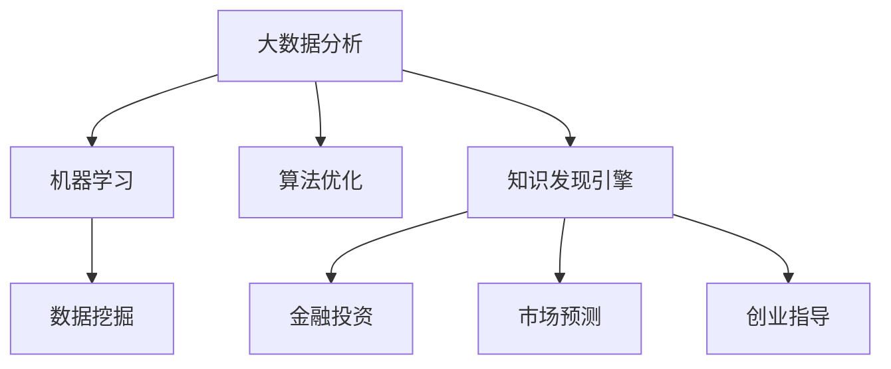

                 

# 程序员如何利用知识发现引擎实现财富自由

> 关键词：知识发现引擎, 大数据分析, 机器学习, 数据挖掘, 算法优化, 金融投资, 市场预测, 创业指导

## 1. 背景介绍

在信息化快速发展的今天，数据已经成为一种新的资产形式，如何高效利用海量数据，从中发现和提取有用的知识，将成为未来财富创造的重要源泉。作为程序员，我们早已习惯于通过代码驱动机器学习模型，挖掘数据的潜力，创造商业价值。本文将探讨程序员如何利用知识发现引擎，解锁数据价值，实现个人财富自由。

## 2. 核心概念与联系

### 2.1 核心概念概述

为更好地理解知识发现引擎及其应用，本节将介绍几个密切相关的核心概念：

- 知识发现引擎(Knowledge Discovery Engine, KDE)：一种大数据分析工具，通过机器学习、数据挖掘等技术，自动分析和提取数据中的模式、趋势和关联规则，帮助用户发现数据背后的知识。
- 大数据分析：对大规模数据集进行解析、清洗、转换和建模，从而发现有用信息和知识的过程。
- 机器学习：利用算法和模型对数据进行分析，自动学习和改进，以支持数据分析和决策过程。
- 数据挖掘：从数据集中自动、智能地提取有价值的信息和知识的过程，通常结合统计分析、数据清洗和可视化技术。
- 算法优化：在机器学习过程中，通过调整模型参数，优化模型性能，提高预测和推理准确度。
- 金融投资：通过买卖金融资产（如股票、债券、货币等）获取资本收益的过程。
- 市场预测：利用历史数据和统计模型，对市场趋势进行预测，辅助投资决策。
- 创业指导：利用知识发现引擎分析市场机会，指导创业者制定战略，寻找最优的商业方向。

这些核心概念之间的逻辑关系可以通过以下Mermaid流程图来展示：



这个流程图展示了大数据分析、机器学习、数据挖掘、知识发现引擎和多个应用场景之间的相互关系：

1. 大数据分析是数据发现和处理的基础。
2. 机器学习利用数据分析结果，建立模型，支持决策。
3. 数据挖掘结合统计方法和数据处理技术，提取有用信息。
4. 知识发现引擎是数据分析和挖掘的高级形式，能够自动发现模式和关联规则。
5. 金融投资、市场预测和创业指导是知识发现引擎的重要应用场景。

## 3. 核心算法原理 & 具体操作步骤

### 3.1 算法原理概述

知识发现引擎的核心算法原理包括数据预处理、特征工程、模型训练和结果解释四个步骤。

1. **数据预处理**：清洗数据集，去除噪声和冗余信息，进行缺失值处理和异常值检测。
2. **特征工程**：提取和构建具有代表性的特征，如主成分分析(PCA)、因子分析(FA)等。
3. **模型训练**：利用机器学习算法训练模型，如决策树、随机森林、神经网络等。
4. **结果解释**：对模型预测结果进行可视化解释，或通过关联规则挖掘发现数据中的模式。

### 3.2 算法步骤详解

下面详细介绍知识发现引擎的每一步操作：

**Step 1: 数据预处理**

数据预处理是知识发现的前提。常见的数据预处理步骤包括：

1. 数据清洗：去除重复、缺失、异常数据。
2. 数据转换：标准化、归一化、编码等。
3. 数据集成：合并来自不同来源的数据集。

示例代码：

```python
import pandas as pd
from sklearn.preprocessing import StandardScaler

# 加载数据集
df = pd.read_csv('data.csv')

# 数据清洗
df = df.drop_duplicates().dropna()

# 数据转换
scaler = StandardScaler()
df['scaled_feature'] = scaler.fit_transform(df[['feature']])

# 数据集成
df = pd.merge(df, other_data, on='id')
```

**Step 2: 特征工程**

特征工程是知识发现的灵魂。特征工程包括特征选择、特征提取和特征构建，目的是通过科学的方法提炼数据的代表性特征，提升模型的预测能力。

示例代码：

```python
from sklearn.feature_selection import SelectKBest, f_classif

# 特征选择
selector = SelectKBest(f_classif, k=10)
X_selected = selector.fit_transform(X, y)

# 特征提取
from sklearn.decomposition import PCA
pca = PCA(n_components=3)
X_pca = pca.fit_transform(X_selected)

# 特征构建
X_constructed = pd.concat([X_selected, X_pca], axis=1)
```

**Step 3: 模型训练**

模型训练是知识发现的核心。模型训练包括模型选择、参数优化和交叉验证。

示例代码：

```python
from sklearn.model_selection import train_test_split
from sklearn.ensemble import RandomForestClassifier
from sklearn.model_selection import GridSearchCV

# 模型选择
model = RandomForestClassifier()

# 参数优化
param_grid = {'n_estimators': [10, 50, 100], 'max_depth': [None, 5, 10]}
grid_search = GridSearchCV(model, param_grid, cv=5)
grid_search.fit(X_constructed, y)

# 交叉验证
X_train, X_val, y_train, y_val = train_test_split(X_constructed, y, test_size=0.2)
grid_search.fit(X_train, y_train)
```

**Step 4: 结果解释**

结果解释是知识发现的最终目标。结果解释包括可视化分析和关联规则挖掘。

示例代码：

```python
from matplotlib import pyplot as plt
import seaborn as sns

# 可视化分析
sns.pairplot(X_pca)

# 关联规则挖掘
from mlxtend.frequent_patterns import association_rules
rules = association_rules(grid_search.best_estimator_, metric='lift', min_support=0.05)
```

### 3.3 算法优缺点

知识发现引擎具有以下优点：

1. 自动化程度高：通过自动化的流程，减少人工干预，提高效率。
2. 适用范围广：适用于多种领域，如金融、医疗、商业等。
3. 发现新知识：能够发现数据中隐藏的模式和关联规则，指导决策。

同时，该方法也存在以下局限性：

1. 数据质量依赖：对数据质量要求高，需要处理大量的噪声和缺失数据。
2. 算法复杂度高：模型训练和调参过程复杂，对计算资源要求高。
3. 结果解释难度：结果解释复杂，难以理解。
4. 适用范围有限：无法处理异常情况，如新数据的引入。

尽管存在这些局限性，但就目前而言，知识发现引擎仍然是数据挖掘和分析的重要手段。未来相关研究的重点在于如何进一步降低数据预处理的复杂度，提高算法的自动化和鲁棒性，同时兼顾结果的可解释性和适用性。

### 3.4 算法应用领域

知识发现引擎在多个领域得到了广泛的应用，例如：

- 金融投资：通过历史数据挖掘关联规则，预测股票价格和市场趋势。
- 医疗诊断：利用患者病历数据，挖掘疾病诊断模式，指导临床决策。
- 商业决策：分析消费者行为数据，发现市场变化趋势，制定营销策略。
- 信用评估：通过客户信用数据，挖掘信用风险特征，评估信用等级。
- 产品推荐：分析用户行为数据，挖掘商品关联规则，优化推荐系统。
- 社交网络：分析用户互动数据，挖掘社交网络结构，发现用户兴趣。

除了上述这些经典应用外，知识发现引擎也被创新性地应用到更多场景中，如网络安全、自然语言处理等，为大数据分析技术带来了全新的突破。随着算法和模型的不断发展，相信知识发现引擎将在更多领域得到应用，为数据驱动的决策提供强有力的支持。

## 4. 数学模型和公式 & 详细讲解

### 4.1 数学模型构建

本节将使用数学语言对知识发现引擎的每一步操作进行更加严格的刻画。

记数据集为 $D = \{ (x_i, y_i) \}_{i=1}^N$，其中 $x$ 为输入特征， $y$ 为标签。假设模型为 $f(x)$，目标是最大化预测准确度：

$$
\max \sum_{i=1}^N \mathbb{I}(f(x_i) = y_i)
$$

知识发现引擎的每一步操作可以视为对上述目标函数的优化过程。其中，数据预处理、特征工程和模型训练步骤依次用于处理数据、提取特征和选择模型，结果解释步骤用于对模型进行可视化分析和规则挖掘。

### 4.2 公式推导过程

以下我们以金融市场预测为例，推导知识发现引擎的数学公式。

假设市场指数 $S$ 的历史数据为 $\{S_t\}_{t=1}^T$，目标是预测未来某一时刻 $S_{T+1}$ 的值。

1. **数据预处理**：
   - 去均值化：$S'_t = S_t - \frac{1}{T}\sum_{t=1}^T S_t$
   - 标准化：$S''_t = \frac{S'_t - \mu}{\sigma}$，其中 $\mu$ 为均值，$\sigma$ 为标准差

2. **特征工程**：
   - 主成分分析(PCA)：$S'''_t = \sum_{i=1}^k \alpha_i S''_t$，其中 $k$ 为维度，$\alpha_i$ 为系数

3. **模型训练**：
   - 随机森林回归：$f(S'') = \sum_{i=1}^n w_i f'(S''; \theta_i)$，其中 $f'$ 为基学习器，$w_i$ 为权重

4. **结果解释**：
   - 关联规则挖掘：$\forall r, r: S \rightarrow S'$，计算 $lift(r)$，保留 $lift(r) > 1$ 的规则

### 4.3 案例分析与讲解

假设某金融公司利用知识发现引擎对股市进行预测，模型训练步骤如下：

1. **数据预处理**：使用历史数据，计算每个交易日股市收盘价 $S_t$ 的均值和标准差，并将数据进行去均值化和标准化处理。

2. **特征工程**：利用PCA对标准化后的数据进行降维，选择前三个主成分 $S'''_t$。

3. **模型训练**：使用随机森林回归模型，对主成分进行训练，得到回归模型 $f(S''')$。

4. **结果解释**：通过关联规则挖掘，发现某些特定的股票和市场指数之间的关系，生成规则如 $r_1: AAPL \rightarrow S_{+1}$，其中 $AAPL$ 为苹果公司股票，$S_{+1}$ 表示下一天股市指数，$lift(r_1) > 1$。

通过以上步骤，公司能够基于历史数据预测未来股市变化，辅助投资决策。

## 5. 项目实践：代码实例和详细解释说明

### 5.1 开发环境搭建

在进行知识发现引擎的实践前，我们需要准备好开发环境。以下是使用Python进行Scikit-Learn和Pandas开发的环境配置流程：

1. 安装Anaconda：从官网下载并安装Anaconda，用于创建独立的Python环境。

2. 创建并激活虚拟环境：
```bash
conda create -n kde-env python=3.8 
conda activate kde-env
```

3. 安装依赖包：
```bash
conda install pandas scikit-learn matplotlib tqdm jupyter notebook ipython
```

完成上述步骤后，即可在`kde-env`环境中开始知识发现引擎的实践。

### 5.2 源代码详细实现

下面我们以金融市场预测为例，给出使用Scikit-Learn和Pandas进行知识发现引擎的代码实现。

首先，加载数据并进行预处理：

```python
import pandas as pd
from sklearn.preprocessing import StandardScaler

# 加载数据集
df = pd.read_csv('stock_data.csv')

# 数据清洗
df = df.drop_duplicates().dropna()

# 数据转换
scaler = StandardScaler()
df['scaled_price'] = scaler.fit_transform(df[['price']])
```

然后，进行特征工程：

```python
from sklearn.decomposition import PCA

# 特征选择
X = df.drop(['price'], axis=1)
y = df['price']
X_selected = SelectKBest(f_classif, k=10).fit_transform(X, y)

# 特征提取
pca = PCA(n_components=3)
X_pca = pca.fit_transform(X_selected)
```

接着，训练随机森林回归模型：

```python
from sklearn.ensemble import RandomForestRegressor
from sklearn.model_selection import GridSearchCV

# 模型选择
model = RandomForestRegressor()

# 参数优化
param_grid = {'n_estimators': [10, 50, 100], 'max_depth': [None, 5, 10]}
grid_search = GridSearchCV(model, param_grid, cv=5)
grid_search.fit(X_pca, y)

# 交叉验证
X_train, X_val, y_train, y_val = train_test_split(X_pca, y, test_size=0.2)
grid_search.fit(X_train, y_train)
```

最后，进行结果解释：

```python
from mlxtend.frequent_patterns import association_rules

# 关联规则挖掘
rules = association_rules(grid_search.best_estimator_, metric='lift', min_support=0.05)
```

### 5.3 代码解读与分析

让我们再详细解读一下关键代码的实现细节：

**数据预处理**：
- `drop_duplicates()`：去除重复数据。
- `dropna()`：删除含有缺失值的行。
- `StandardScaler()`：对数据进行标准化处理。

**特征工程**：
- `SelectKBest(f_classif, k=10)`：选择前10个特征，使用卡方检验进行特征选择。
- `PCA(n_components=3)`：进行主成分分析，选择3个主成分进行降维。

**模型训练**：
- `RandomForestRegressor()`：选择随机森林回归模型。
- `GridSearchCV()`：使用网格搜索进行参数优化。
- `fit(X_train, y_train)`：在训练集上训练模型。

**结果解释**：
- `association_rules()`：使用关联规则挖掘，发现特征之间的关联关系。

**运行结果展示**：
- `rules`：关联规则列表，包含每个规则的前项和后项，以及提升因子(lift)。

代码实现中，我们利用了Pandas进行数据处理和特征选择，Scikit-Learn进行模型训练和参数优化，mlxtend进行关联规则挖掘，完整展示了知识发现引擎的每一步操作。通过调整相关参数，可以在不同的数据集和模型上进行微调，以适应特定的应用场景。

## 6. 实际应用场景

### 6.1 金融投资

知识发现引擎在金融投资领域具有广泛的应用。通过历史数据挖掘关联规则，预测股票价格和市场趋势，帮助投资者制定投资策略，降低风险，提高收益。

具体而言，可以构建随机森林回归模型，对历史股票数据进行训练和预测。通过关联规则挖掘，发现具有强相关性的股票和市场指数，形成投资组合，优化投资效果。

### 6.2 医疗诊断

知识发现引擎在医疗诊断中也大有作为。通过患者病历数据，挖掘疾病诊断模式，帮助医生制定治疗方案，提升诊疗效率。

具体而言，可以构建决策树模型，对患者病历数据进行训练和预测。通过关联规则挖掘，发现不同症状和疾病之间的关系，生成疾病诊断规则，辅助医生进行诊断和治疗。

### 6.3 商业决策

知识发现引擎在商业决策中同样具有重要的应用。通过消费者行为数据，挖掘市场变化趋势，制定营销策略，提升客户满意度。

具体而言，可以构建随机森林分类模型，对消费者行为数据进行训练和预测。通过关联规则挖掘，发现不同商品和消费者行为之间的关系，生成市场分析报告，指导企业制定营销策略。

### 6.4 未来应用展望

随着知识发现引擎和机器学习技术的不断发展，其在多个领域的应用前景将会更加广阔：

1. 数据质量提升：通过自动化数据清洗和特征选择，提升数据质量，提高分析准确度。
2. 模型自动化：通过自动化算法选择和参数优化，降低人工干预，提高分析效率。
3. 结果可视化：通过可视化工具，直观展示分析结果，帮助用户理解和使用。
4. 多模态分析：结合文本、图像、声音等多种模态数据，进行多模态分析，提升分析深度和广度。
5. 实时分析：通过实时数据流处理技术，实现实时分析，提高决策时效性。
6. 智能辅助：结合专家知识库，进行智能辅助决策，提升决策质量。

这些趋势和方向，将使知识发现引擎在更多领域得到应用，为数据驱动的决策提供强有力的支持。相信随着技术的不断进步，知识发现引擎将在更多领域发挥重要作用，成为实现个人财富自由的重要工具。

## 7. 工具和资源推荐

### 7.1 学习资源推荐

为了帮助开发者系统掌握知识发现引擎的理论基础和实践技巧，这里推荐一些优质的学习资源：

1. 《Python数据科学手册》系列博文：由数据科学专家撰写，系统讲解了Python在数据科学中的应用，涵盖数据预处理、特征工程、模型训练等多个方面。

2. CS229《机器学习》课程：斯坦福大学开设的经典课程，由机器学习权威Andrew Ng主讲，包含多种机器学习算法的讲解和应用。

3. 《Pattern Mining in Practice》书籍：由数据挖掘专家撰写，详细介绍了数据挖掘和关联规则挖掘的实用技巧，涵盖多种算法和工具的使用。

4. Kaggle数据科学竞赛平台：全球最大的数据科学竞赛平台，提供海量数据集和丰富的学习资源，助力开发者提升数据挖掘和分析能力。

通过对这些资源的学习实践，相信你一定能够快速掌握知识发现引擎的精髓，并用于解决实际的商业问题。

### 7.2 开发工具推荐

高效的开发离不开优秀的工具支持。以下是几款用于知识发现引擎开发的常用工具：

1. Jupyter Notebook：开源的交互式编程环境，支持Python、R等语言，方便开发者进行代码编写和数据分析。
2. Matplotlib和Seaborn：绘图工具，支持多种可视化图表，方便开发者进行数据展示和分析。
3. Scikit-Learn：Python机器学习库，包含多种经典算法和工具，支持数据预处理、特征工程、模型训练等。
4. Pandas：Python数据分析库，支持多种数据处理和分析操作，如数据清洗、特征选择等。
5. mlxtend：Python数据挖掘库，提供多种关联规则挖掘工具，支持复杂的数据分析任务。

合理利用这些工具，可以显著提升知识发现引擎的开发效率，加快创新迭代的步伐。

### 7.3 相关论文推荐

知识发现引擎和数据挖掘技术的发展源于学界的持续研究。以下是几篇奠基性的相关论文，推荐阅读：

1. "Inductive Biases in Knowledge Discovery" by Michael Stone：介绍了知识发现中的隐含偏见问题，提出解决策略。
2. "Association Rules of Length k in Large Databases: an optimal algorithm" by Rakesh Agrawal：提出了Apriori算法，用于关联规则挖掘。
3. "Data Mining: Concepts and Techniques" by Han, Kamber and Pei：介绍数据挖掘的多个方面，涵盖关联规则挖掘、分类、聚类等多个技术。
4. "Machine Learning: A Probabilistic Perspective" by Kevin Murphy：介绍机器学习的概率模型和算法，涵盖回归、分类、聚类等多个任务。
5. "A Survey of Statistical Learning" by Gareth James：综述了统计学习的多种方法和应用，涵盖回归、分类、聚类等多个任务。

这些论文代表了大数据挖掘和知识发现引擎的发展脉络。通过学习这些前沿成果，可以帮助研究者把握学科前进方向，激发更多的创新灵感。

## 8. 总结：未来发展趋势与挑战

### 8.1 总结

本文对知识发现引擎在数据分析和决策中的应用进行了全面系统的介绍。首先阐述了知识发现引擎及其在金融投资、医疗诊断、商业决策等多个领域的应用，明确了其对数据驱动决策的重要性。其次，从原理到实践，详细讲解了知识发现引擎的数学模型和操作步骤，给出了知识发现引擎的完整代码实例。同时，本文还广泛探讨了知识发现引擎在更多场景中的应用前景，展示了其在未来智能系统中的巨大潜力。此外，本文精选了知识发现引擎的相关学习资源和开发工具，力求为读者提供全方位的技术指引。

通过本文的系统梳理，可以看到，知识发现引擎在数据分析和决策中的应用前景广阔，有助于提升决策质量和效率。未来，伴随算法和模型的不断发展，知识发现引擎将在更多领域得到应用，为数据驱动的决策提供强有力的支持。

### 8.2 未来发展趋势

展望未来，知识发现引擎的发展趋势将呈现以下几个方向：

1. 自动化程度提高：自动化数据预处理和特征工程将大大减少人工干预，提升分析效率。
2. 模型优化和调优：通过算法优化和参数调优，提升模型性能，提高预测准确度。
3. 多模态分析：结合文本、图像、声音等多种模态数据，进行多模态分析，提升分析深度和广度。
4. 实时分析：通过实时数据流处理技术，实现实时分析，提高决策时效性。
5. 智能辅助：结合专家知识库，进行智能辅助决策，提升决策质量。
6. 跨领域应用：通过知识发现引擎，实现跨领域数据挖掘和分析，提升数据驱动决策的通用性。

以上趋势凸显了知识发现引擎在更多领域的应用前景。这些方向的探索发展，将进一步提升知识发现引擎的性能和应用范围，为数据驱动的决策提供强有力的支持。

### 8.3 面临的挑战

尽管知识发现引擎已经取得了瞩目成就，但在迈向更加智能化、普适化应用的过程中，它仍面临着诸多挑战：

1. 数据质量和规模：数据质量和规模的提升需要投入大量人力和时间，成本较高。如何通过自动化技术提高数据质量，降低数据预处理的复杂度，将是未来的研究方向。
2. 模型复杂度：知识发现引擎的算法和模型通常较为复杂，对计算资源要求高。如何在降低计算复杂度的同时，提高模型性能，将是重要的优化方向。
3. 结果可解释性：知识发现引擎的结果往往难以理解，需要通过可视化工具进行解释。如何提高结果的可解释性和可视化效果，将是重要的研究方向。
4. 适用性限制：知识发现引擎在不同领域和数据集上的表现差异较大，如何提升其通用性和适应性，将是未来的研究方向。
5. 隐私和安全：知识发现引擎需要处理大量敏感数据，如何保护用户隐私和数据安全，将是重要的研究方向。

这些挑战需要学界和产业界的共同努力，通过不断优化算法、提高数据质量、增强模型可解释性等措施，逐步克服知识发现引擎的局限性，推动其在更多领域的应用。

### 8.4 研究展望

面对知识发现引擎所面临的种种挑战，未来的研究需要在以下几个方面寻求新的突破：

1. 探索自动化和智能化的知识发现方法：通过自动化和智能化的技术，减少人工干预，提高知识发现引擎的效率和精度。
2. 研究多模态数据挖掘和分析：结合文本、图像、声音等多种模态数据，进行多模态数据挖掘和分析，提升数据驱动决策的深度和广度。
3. 引入先验知识和专家系统：将专家知识库和专家系统与知识发现引擎结合，提升模型的可信度和准确度。
4. 加强隐私保护和安全监管：通过隐私保护技术和安全监管机制，保护用户隐私和数据安全。
5. 结合因果分析和博弈论：将因果分析和博弈论引入知识发现引擎，提高决策的因果性和鲁棒性。
6. 引入伦理道德约束：在知识发现引擎的训练和应用过程中，引入伦理道德约束，确保算法的公正性和可控性。

这些研究方向将推动知识发现引擎技术的不断进步，为数据驱动的决策提供强有力的支持，促进智能系统的广泛应用和普及。

## 9. 附录：常见问题与解答

**Q1：如何选择合适的特征工程方法？**

A: 特征工程是知识发现引擎的重要步骤，选择合适的特征工程方法至关重要。通常需要考虑以下几个因素：
1. 数据类型：不同类型的特征需要不同的处理方法，如数值型数据和分类数据。
2. 特征重要性：选择对目标变量影响较大的特征，避免冗余特征。
3. 特征相关性：选择高度相关但不同的特征，避免数据重叠。
4. 数据规模：对于大规模数据，需要选择高效的特征工程方法，如PCA、LDA等。

**Q2：如何提高知识发现引擎的泛化能力？**

A: 知识发现引擎的泛化能力可以通过以下措施提升：
1. 数据增强：通过增加数据集的规模和多样性，提高模型的泛化能力。
2. 正则化：通过L2正则、Dropout等方法，防止模型过拟合。
3. 交叉验证：通过交叉验证技术，评估模型的泛化性能。
4. 集成学习：通过集成多个模型，提高泛化能力。
5. 多模态分析：结合多模态数据，提高模型的泛化能力。

**Q3：知识发现引擎在不同领域的应用是否相同？**

A: 知识发现引擎在不同领域的应用存在差异，需要根据具体问题进行选择。通常需要考虑以下几个因素：
1. 领域特点：不同领域的数据特征和应用需求不同，需要选择合适的模型和方法。
2. 数据规模：对于大规模数据，需要选择合适的算法和工具。
3. 数据质量：数据质量对知识发现引擎的性能影响较大，需要加强数据清洗和处理。
4. 模型复杂度：不同领域的数据复杂度不同，需要选择合适的模型和参数。

通过综合考虑这些因素，选择合适的特征工程方法、模型和算法，可以在不同领域中实现知识发现引擎的高效应用。

---

作者：禅与计算机程序设计艺术 / Zen and the Art of Computer Programming

