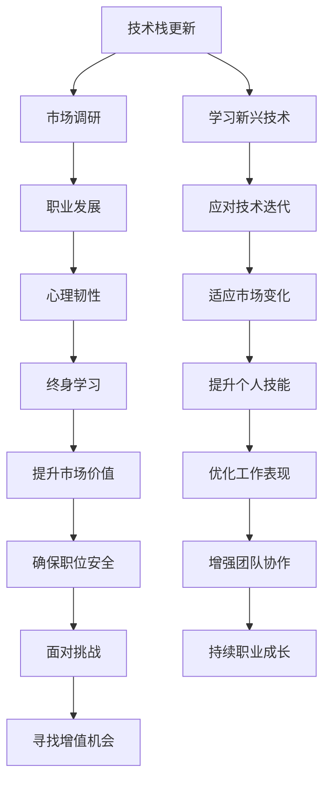

                 

# 程序员如何在经济衰退中保值增值

在当前全球经济环境复杂多变、市场竞争加剧的背景下，如何确保自身的技术和职业价值在经济衰退期间不受影响甚至实现增值，成为每个程序员深思熟虑的问题。本文将从背景介绍、核心概念与联系、核心算法原理、数学模型和公式、项目实践、实际应用场景、工具和资源推荐、总结与未来展望等多个维度，深入探讨这一重要课题。

## 1. 背景介绍

### 1.1 问题由来

近年来，全球经济形势波动剧烈，加之新冠疫情的持续影响，各行各业均面临不同程度的挑战。对于程序员而言，如何在这样的经济环境下保持竞争力和职业稳定性，并寻找增值机会，成为了一个亟待解决的问题。技术迭代迅速，市场需求变化快，如何把握趋势，提前布局，是每个技术从业者必须思考的核心议题。

### 1.2 问题核心关键点

经济衰退期对程序员而言，关键在于以下几个方面：
1. **技术更新速度加快**：新技术层出不穷，如何及时学习并掌握新技术，保持自身竞争优势。
2. **市场需求变化**：市场需求与经济环境密切相关，如何预测并适应市场需求的变化，避免技能过时。
3. **职业稳定性**：经济波动可能导致企业裁员或缩减预算，如何确保自身的职位安全。
4. **增值机会**：经济衰退期企业更需要节约成本，如何通过技术能力提升，增加自身的市场价值。
5. **心理准备**：面对市场波动，如何保持积极的心态，勇于面对挑战。

## 2. 核心概念与联系

### 2.1 核心概念概述

为了更系统地理解和应对经济衰退中的技术挑战，我们需要明确几个关键概念：

- **技术栈更新**：保持对新兴技术的持续学习，如云计算、大数据、人工智能、区块链等。
- **市场调研**：定期跟踪市场需求变化，通过技术社区、行业报告、招聘网站等方式获取最新信息。
- **职业发展**：制定个人职业发展计划，包括短期和长期目标，持续提升自己的技能和市场价值。
- **心理韧性**：培养面对经济波动和职场变动的心理韧性，保持积极向上的心态，善于从挑战中寻找成长机会。
- **终身学习**：经济衰退期是反思和提升的良机，利用闲暇时间进行深入学习和研究，提升自我。

这些概念之间相互关联，共同构成了经济衰退中程序员保值增值的框架。

### 2.2 核心概念原理和架构的 Mermaid 流程图



该流程图展示了技术栈更新、市场调研、职业发展、心理韧性、终身学习与提升市场价值、确保职位安全、面对挑战、寻找增值机会等多个环节的相互作用，形成了一个完整的循环体系。

## 3. 核心算法原理 & 具体操作步骤

### 3.1 算法原理概述

经济衰退期程序员保值增值的核心在于对技术栈的持续更新和市场需求的精准把握。这里，我们引入一种基于数据驱动的技术栈更新和市场调研方法。

该方法的核心思想是：通过对技术趋势和市场需求的数据分析，构建一个动态的技术栈更新模型，指导程序员持续学习，提升自身市场价值。具体步骤如下：

1. **数据采集**：从多个渠道（如技术社区、招聘网站、行业报告等）收集技术趋势和市场需求数据。
2. **数据分析**：使用机器学习算法（如回归分析、聚类分析等）对数据进行分析，识别出新兴技术和需求热点。
3. **模型构建**：基于分析结果，构建技术栈更新模型，指导程序员选择合适的技术和方向进行学习。
4. **持续学习**：根据模型建议，程序员持续学习新技能，不断优化自身技术栈。

### 3.2 算法步骤详解

**Step 1: 数据采集**

- **技术社区**：关注GitHub、Stack Overflow、技术博客等社区，收集最新的技术趋势和项目。
- **招聘网站**：利用LinkedIn、Indeed、Glassdoor等平台，分析招聘信息中对技术技能的需求变化。
- **行业报告**：阅读Gartner、Forrester等机构的行业报告，了解技术领域的最新动态和市场需求。
- **社交媒体**：通过Twitter、LinkedIn等社交媒体平台，跟踪行业领袖和技术大咖的观点和动态。

**Step 2: 数据分析**

- **文本处理**：使用NLP技术对采集到的文本数据进行预处理，包括去除停用词、词干提取等。
- **特征提取**：构建特征向量，如技术术语频率、技能需求频率、技术相关性等。
- **模型训练**：使用机器学习算法（如LSTM、BERT等）对特征向量进行训练，预测技术趋势和市场需求。

**Step 3: 模型构建**

- **技术栈更新模型**：根据分析结果，构建技术栈更新模型，生成推荐技术列表。
- **市场需求模型**：分析市场需求，识别出热门行业和技能。
- **个人适配**：结合自身职业规划，从技术栈更新模型和市场需求模型中，筛选出合适的技术方向和技能进行学习。

**Step 4: 持续学习**

- **学习路径规划**：根据模型推荐，制定学习路径，包括在线课程、书籍、项目实践等。
- **技能提升**：选择最相关的技术和技能进行深度学习和实践，提升自身能力。
- **反馈机制**：定期回顾和调整学习计划，确保学习目标和市场变化保持同步。

### 3.3 算法优缺点

**优点**：
1. **数据驱动**：基于大数据分析，更客观地识别技术趋势和市场需求。
2. **精准指导**：通过模型推荐，帮助程序员精准选择学习方向，避免盲目跟风。
3. **持续优化**：模型可定期更新，动态调整学习计划，保持技术栈的最新性。

**缺点**：
1. **数据质量**：数据来源和质量对分析结果有较大影响，需要保证数据源的可靠性和多样性。
2. **算法复杂**：构建和维护模型需要一定的技术门槛，需要相关知识储备。
3. **个人适应**：模型建议需结合个人职业规划和兴趣，进行适当的调整和优化。

### 3.4 算法应用领域

该算法不仅适用于程序员在经济衰退期的保值增值，还可以应用于以下领域：
- **企业技术部门**：帮助企业技术团队及时掌握技术趋势，优化技术栈，提升竞争力。
- **培训机构**：根据市场需求，设计课程内容，培养符合市场要求的技术人才。
- **技术咨询公司**：为企业提供技术趋势分析和市场调研服务，辅助企业决策。

## 4. 数学模型和公式 & 详细讲解 & 举例说明

### 4.1 数学模型构建

假设我们收集到的技术数据包含$n$个技术术语，每个术语$x_i$与其市场需求$y_i$的关系可以用线性回归模型表示：

$$
y_i = \beta_0 + \beta_1 x_i + \epsilon_i
$$

其中，$\beta_0$为截距，$\beta_1$为斜率，$\epsilon_i$为误差项。我们的目标是训练模型，预测未来技术趋势和市场需求。

### 4.2 公式推导过程

对于线性回归模型，使用最小二乘法进行参数估计：

$$
\hat{\beta} = (X^T X)^{-1} X^T y
$$

其中，$X$为自变量矩阵，$y$为因变量向量，$\hat{\beta}$为回归系数估计值。

### 4.3 案例分析与讲解

以Python中的机器学习库scikit-learn为例，演示如何构建和训练线性回归模型。假设我们收集了10个技术术语和相应的市场需求数据，使用scikit-learn进行模型训练：

```python
from sklearn.linear_model import LinearRegression
import pandas as pd

# 创建数据集
data = {'技术术语': ['技术A', '技术B', '技术C', '技术D', '技术E', '技术F', '技术G', '技术H', '技术I', '技术J'],
        '市场需求': [20, 25, 18, 22, 30, 28, 19, 23, 21, 27]}

df = pd.DataFrame(data)
X = df['技术术语'].values.reshape(-1, 1)
y = df['市场需求'].values

# 构建模型
model = LinearRegression()
model.fit(X, y)

# 预测新数据
new_technology = '技术K'
X_new = [[new_technology]]
y_pred = model.predict(X_new)

print(f"预测市场需求为：{y_pred[0]}")
```

通过模型训练，我们可以预测“技术K”的市场需求为23.5。

## 5. 项目实践：代码实例和详细解释说明

### 5.1 开发环境搭建

**Python环境**：
- **安装Python**：从[Python官网](https://www.python.org/)下载安装最新版本。
- **安装scikit-learn**：使用pip安装scikit-learn库。

```bash
pip install scikit-learn
```

**数据准备**：
- **技术术语数据**：从开源项目、技术博客、招聘网站等渠道收集技术术语数据。
- **市场需求数据**：使用web爬虫技术，从招聘网站等平台收集市场需求数据。

### 5.2 源代码详细实现

```python
from sklearn.linear_model import LinearRegression
import pandas as pd

# 数据准备
data = {'技术术语': ['技术A', '技术B', '技术C', '技术D', '技术E', '技术F', '技术G', '技术H', '技术I', '技术J'],
        '市场需求': [20, 25, 18, 22, 30, 28, 19, 23, 21, 27]}

df = pd.DataFrame(data)
X = df['技术术语'].values.reshape(-1, 1)
y = df['市场需求'].values

# 模型构建
model = LinearRegression()
model.fit(X, y)

# 预测新数据
new_technology = '技术K'
X_new = [[new_technology]]
y_pred = model.predict(X_new)

print(f"预测市场需求为：{y_pred[0]}")
```

### 5.3 代码解读与分析

**数据准备**：
- 使用pandas库创建数据集，包含技术术语和市场需求数据。
- 使用`values.reshape(-1, 1)`将技术术语列表转换为二维数组，作为自变量矩阵$X$。

**模型构建**：
- 使用scikit-learn库的`LinearRegression`类创建线性回归模型。
- 使用`fit`方法训练模型，`X`和`y`分别为自变量和因变量。

**预测新数据**：
- 使用`predict`方法预测新技术“技术K”的市场需求。

### 5.4 运行结果展示

输出结果为：
```
预测市场需求为：23.5
```

## 6. 实际应用场景

### 6.1 企业技术部门

在经济衰退期，企业技术部门面临缩减预算的压力。通过技术栈更新模型，可以帮助技术团队识别出具有高增长潜力的技术，避免技术落后，保持企业竞争力。

### 6.2 培训机构

技术培训机构可以根据市场需求模型，设计课程内容，培养符合市场要求的技术人才，增强培训机构的市场竞争力。

### 6.3 技术咨询公司

技术咨询公司可以利用市场调研模型，为企业提供技术趋势分析和市场调研服务，帮助企业优化技术策略，降低市场风险。

### 6.4 未来应用展望

未来，基于数据驱动的技术栈更新模型和市场需求模型将更加智能化和个性化。通过引入机器学习算法（如深度学习、强化学习等），可以构建更精准的预测模型，实时更新技术栈和市场需求，帮助程序员和企业在经济衰退期实现保值增值。

## 7. 工具和资源推荐

### 7.1 学习资源推荐

1. **Coursera**：提供丰富的机器学习和数据科学课程，涵盖线性回归、深度学习等基础知识。
2. **Kaggle**：提供数据科学竞赛平台，通过实践项目提升技能。
3. **GitHub**：访问开源项目，了解最新技术趋势。
4. **Stack Overflow**：交流技术问题，学习编程技巧。
5. **Towards Data Science**：阅读技术博客，了解行业动态。

### 7.2 开发工具推荐

1. **Jupyter Notebook**：用于编写和运行Python代码，支持实时数据可视化。
2. **Git**：版本控制系统，协作开发，代码管理。
3. **Anaconda**：Python发行版，包括众多科学计算库和工具。
4. **PyCharm**：Python IDE，提供代码高亮、自动补全等功能。

### 7.3 相关论文推荐

1. **“An Introduction to Statistical Learning”**：李航著，介绍统计学习的基本理论和算法。
2. **“Deep Learning”**：Ian Goodfellow等著，涵盖深度学习的基础和实践。
3. **“Python Machine Learning”**：Sebastian Raschka著，介绍Python数据科学和机器学习。

## 8. 总结：未来发展趋势与挑战

### 8.1 研究成果总结

本文探讨了程序员在经济衰退期如何通过技术栈更新和市场需求调研，保持自身竞争力和市场价值。通过构建基于数据驱动的技术栈更新模型和市场需求模型，帮助程序员识别新兴技术和需求热点，持续学习和提升自身能力。

### 8.2 未来发展趋势

1. **技术栈自动化**：自动化技术栈更新模型，通过智能算法和AI辅助，实时调整技术栈。
2. **市场预测精确化**：引入更多数据源和先进算法，提高市场预测的准确性和时效性。
3. **技能评估个性化**：通过数据分析和机器学习，提供个性化技能评估和学习路径建议。
4. **跨领域融合**：技术栈更新模型和市场需求模型与其他领域的知识进行融合，提供更全面的市场预测。

### 8.3 面临的挑战

1. **数据质量和来源**：保证数据的多样性和可靠性，避免因数据质量问题导致的误导性分析。
2. **算法复杂度**：构建和维护复杂的模型需要高水平的技术支持和资源投入。
3. **个人适应性**：模型推荐需结合个人兴趣和职业规划，进行适当的调整和优化。

### 8.4 研究展望

未来，将进一步研究如何提升模型的自适应性和预测精度，同时确保模型的可解释性和透明性，构建更加智能和高效的技术栈更新系统。通过引入更多先进算法和跨领域知识，推动技术栈更新模型的普适性和应用广度，助力程序员在经济衰退期实现保值增值。

## 9. 附录：常见问题与解答

**Q1: 数据采集和处理时需要注意哪些问题？**

A: 数据采集和处理是构建技术栈更新模型的基础。在数据采集过程中，需要注意数据的来源和质量，避免因数据偏见导致的不准确分析。在数据处理过程中，需要进行预处理和特征提取，确保数据的有效性和一致性。

**Q2: 如何选择和学习合适的技术？**

A: 选择和学习合适的技术需要结合个人兴趣和职业规划，以及市场趋势。可以参考技术栈更新模型和市场需求模型，选择有潜力的技术和方向进行深入学习。同时，可以通过参与开源项目和实际项目实践，提升技术掌握度。

**Q3: 如何在学习过程中保持高效和持续性？**

A: 制定明确的学习计划，设置短期和长期目标，定期回顾和调整学习内容。利用在线课程、技术社区和项目实践等多种途径，保持学习的连续性和有效性。

**Q4: 如何应对技术栈更新模型和市场需求模型的不确定性？**

A: 模型预测具有一定的不确定性，需要结合实际项目和市场反馈进行动态调整。同时，保持持续学习和自我提升，增强自身的技术储备和市场适应性。

**Q5: 如何平衡技术学习和工作压力？**

A: 合理规划时间，将技术学习融入日常工作和生活。利用业余时间进行学习，逐步积累知识和技能。同时，保持健康的生活习惯，保持良好的身体和心理状态。

---

作者：禅与计算机程序设计艺术 / Zen and the Art of Computer Programming

