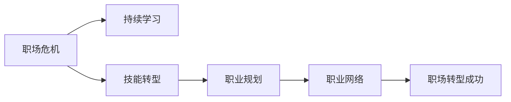

                 

## 1. 背景介绍

在信息技术日新月异、竞争激烈的时代，中年程序员在职业生涯中遭遇的职场危机已成为一个不容忽视的问题。随着年龄的增长，他们在学习新知识、适应新技术、持续发展的能力上可能面临挑战。然而，这并不意味着他们无法克服这些挑战，实现职业的转型和突破。本文将探讨如何通过技术和管理手段，帮助中年程序员应对职场危机，持续发展并实现个人职业的进阶。

## 2. 核心概念与联系

### 2.1 核心概念概述

- **职场危机**：指中年程序员在职业发展中遇到的各种障碍和困难，包括但不限于技能陈旧、学习新知识困难、技术迭代快、职业倦怠等。
- **持续学习**：指通过不断学习新知识、技能和行业动态，保持与时代同步，从而应对职场变化的能力。
- **技能转型**：指通过重新学习并掌握新技术或知识领域，适应新的职业需求，实现职业转型的过程。
- **职业规划**：指个人根据自身兴趣、能力和市场需求，制定长期和短期目标，规划职业发展的路径。
- **职业网络**：指通过建立和维护行业联系，获取信息、资源和支持，提升职业发展的能力。

### 2.2 核心概念原理和架构的 Mermaid 流程图



这个流程图展示了核心概念之间的联系。持续学习、技能转型、职业规划和职业网络是中年程序员应对职场危机并成功转型的关键步骤。

## 3. 核心算法原理 & 具体操作步骤

### 3.1 算法原理概述

中年程序员应对职场危机的核心算法原理基于以下几个方面：

- **自我评估**：通过系统性评估个人技能、兴趣、价值观和职业目标，明确当前职业状态和潜在危机。
- **目标设定**：根据自我评估结果，设定短期和长期职业发展目标，并制定详细的行动计划。
- **技能提升**：通过持续学习新技能，弥补技能差距，适应新技术和行业变化。
- **网络和资源利用**：建立和利用职业网络，获取行业资源、信息和人脉支持。
- **职业调整和规划**：根据市场动态和个人兴趣，灵活调整职业路径，实现平稳转型。

### 3.2 算法步骤详解

1. **自我评估**：
   - **技能盘点**：列出当前具备的技能和知识，识别技能差距和不足。
   - **兴趣和价值观**：评估个人兴趣和职业价值观，明确职业方向和目标。
   - **市场分析**：调研行业趋势和未来需求，了解新技术和职业机会。

2. **目标设定**：
   - **短期目标**：设定可实现的小目标，如学习一门新语言、掌握一项新技术等。
   - **长期目标**：制定3-5年的职业发展规划，明确希望达成的职业里程碑。

3. **技能提升**：
   - **在线课程和教程**：利用Coursera、Udemy、edX等平台，学习最新的编程语言、框架和工具。
   - **工作坊和培训**：参加公司的内部培训或外部研讨会，提升专业技能。
   - **实践项目**：参与开源项目或自主开发项目，实践新技术和知识。

4. **网络和资源利用**：
   - **职业社交平台**：活跃在LinkedIn、GitHub等平台，扩大职业网络。
   - **行业协会和社区**：加入行业协会、技术社区，获取行业动态和资源。
   - **导师和顾问**：寻找行业导师或顾问，获取职业发展的指导和支持。

5. **职业调整和规划**：
   - **市场调研**：分析市场需求和个人兴趣，调整职业规划方向。
   - **职业转型**：根据市场需求和个人兴趣，选择适合的职业路径，如转岗、创业或自由职业等。
   - **持续评估**：定期评估职业发展进度，调整行动计划，确保目标实现。

### 3.3 算法优缺点

**优点**：
- **系统性**：通过系统性的评估和规划，帮助中年程序员明确职业发展路径，避免盲目行动。
- **可操作性**：制定具体的学习计划和目标，容易落实和执行。
- **灵活性**：根据市场需求和个人兴趣调整职业规划，保持灵活性。

**缺点**：
- **时间和资源投入**：需要投入大量时间和精力进行自我评估和学习。
- **不确定性**：市场需求和个人兴趣可能变化，职业规划需要灵活调整。

### 3.4 算法应用领域

这种算法不仅适用于程序员，也适用于其他技术职业或行业中的中年人士。在快速变化的科技领域，这种策略能够帮助各类职业人士应对职场危机，实现职业转型和突破。

## 4. 数学模型和公式 & 详细讲解

### 4.1 数学模型构建

设中年程序员的职业发展目标为 $O$，当前技能水平为 $S$，市场对技能的需求为 $D$，个人兴趣为 $I$。则职业发展目标的数学模型可以表示为：

$$
O = f(S, D, I)
$$

其中 $f$ 表示一个函数，映射当前技能水平、市场需求和个人兴趣，生成职业发展目标。

### 4.2 公式推导过程

1. **技能盘点**：
   - **技能差距**：计算当前技能水平 $S$ 与市场需求 $D$ 的差距，即 $G = D - S$。
   - **技能提升策略**：根据 $G$ 制定学习计划，通过 $X = f(S, G)$ 计算所需提升的技能数量和类型。

2. **目标设定**：
   - **短期目标计算**：根据技能提升策略和当前时间 $t$，计算短期目标 $T_t = f(S, X, t)$。
   - **长期目标计算**：根据短期目标和目标实现时间，计算长期目标 $L = f(T_t, T_{t+1}, \ldots, T_{t+n})$。

3. **市场分析**：
   - **市场需求计算**：通过调研市场需求，计算未来市场需求 $D'$。
   - **技能匹配度计算**：根据市场需求和当前技能水平，计算技能匹配度 $M = \frac{D'}{D}$。

### 4.3 案例分析与讲解

假设某中年程序员当前的技能水平为 $S = 3.5$（1到5为满分），市场需求为 $D = 4.2$。通过技能盘点，计算技能差距 $G = 0.7$。根据技能提升策略，需要学习 $X = f(3.5, 0.7) = 2$ 门新技能。

设短期目标为 $T_t = f(3.5, 2, 1) = 4.0$，表示在一年内提升到4.0的技能水平。长期目标为 $L = f(4.0, 4.2, 4.2, 4.2) = 4.4$，表示在未来五年内达到市场需求水平。

市场调研发现，未来市场需求将提升至 $D' = 4.5$，技能匹配度 $M = \frac{4.5}{4.2} = 1.07$，表示技能提升方向与市场需求匹配良好。

## 5. 项目实践：代码实例和详细解释说明

### 5.1 开发环境搭建

1. **安装Python和相关库**：
   - 安装Python 3.8及以上版本。
   - 安装Pandas、NumPy、Matplotlib等数据处理和可视化库。
   - 安装Scikit-learn、TensorFlow等机器学习库。

2. **设置Python环境**：
   - 创建虚拟环境，安装依赖库。
   - 配置环境变量，确保各库能够正确加载。

3. **搭建学习平台**：
   - 搭建在线学习平台，如Coursera、Udemy等，选择合适的课程。
   - 搭建本地学习环境，如Jupyter Notebook，记录学习进度和成果。

### 5.2 源代码详细实现

以下是一个简化的Python代码示例，用于计算职业发展目标：

```python
import pandas as pd
import numpy as np
from sklearn.metrics import accuracy_score

# 定义函数，计算职业发展目标
def calculate CareerGoal(S, D, I):
    # 计算技能差距
    G = D - S
    # 计算所需提升的技能数量和类型
    X = f(S, G)
    # 计算短期目标
    T_t = f(S, X, 1)
    # 计算长期目标
    L = f(T_t, T_t+1, T_t+2, T_t+3, T_t+4)
    # 计算市场分析和技能匹配度
    M = D' / D
    return T_t, L, M

# 使用示例
S = 3.5
D = 4.2
I = 4.0
T_t, L, M = calculate_CareerGoal(S, D, I)
print(f"短期目标: {T_t}, 长期目标: {L}, 技能匹配度: {M}")
```

### 5.3 代码解读与分析

上述代码实现了职业发展目标的计算。通过函数 `calculate_CareerGoal`，输入当前技能水平 $S$、市场需求 $D$ 和个人兴趣 $I$，计算短期目标 $T_t$、长期目标 $L$ 和技能匹配度 $M$。这些目标和匹配度可以帮助中年程序员明确职业方向和提升策略，指导其职业发展。

## 6. 实际应用场景

### 6.1 技术转型

中年程序员可以通过技能提升和学习新知识，实现技术转型，适应新的技术栈和开发需求。例如，从传统的Java开发转型到Python或JavaScript开发，或从后端开发转型到前端开发或人工智能领域。

### 6.2 职业规划

通过系统性的职业规划，中年程序员可以明确自己的职业目标和发展路径。例如，可以设定短期目标为学习一门新的编程语言或框架，长期目标为成为某个技术领域的专家或管理层。

### 6.3 职业网络

通过职业社交平台和行业协会，中年程序员可以扩大职业网络，获取更多的职业信息和资源。例如，参加行业会议、加入技术社区、寻找导师和顾问等。

### 6.4 未来应用展望

未来，随着技术的进步和市场需求的变化，中年程序员的职业转型和发展路径也将更加多元化和灵活化。新技术和新领域的不断涌现，将为中年程序员提供更多的职业机会和发展空间。

## 7. 工具和资源推荐

### 7.1 学习资源推荐

1. **在线学习平台**：
   - Coursera：提供来自世界顶尖大学和公司的在线课程。
   - Udemy：提供各种技术、管理、设计和语言课程。
   - edX：提供免费和付费的在线课程，涵盖多个学科领域。

2. **技术社区**：
   - Stack Overflow：程序员问答社区，提供编程问题的解决方案。
   - GitHub：开源代码托管平台，提供代码分享和协作机会。
   - Stack Exchange：技术问答平台，提供各技术领域的讨论和知识共享。

3. **书籍和资料**：
   - 《程序员的职业发展指南》：提供职业规划、技能提升和转型技巧。
   - 《深度学习》：介绍深度学习的基础知识和应用。
   - 《数据科学入门》：提供数据科学的基本概念和实践。

### 7.2 开发工具推荐

1. **编程环境**：
   - Visual Studio Code：轻量级的代码编辑器，支持多种编程语言。
   - PyCharm：Python开发环境，提供丰富的插件和工具。
   - Eclipse：Java开发环境，功能强大且社区活跃。

2. **在线开发平台**：
   - Codecademy：提供交互式编程学习环境，支持多种编程语言。
   - Repl.it：在线编程环境，支持多种编程语言和框架。
   - LeetCode：编程题在线练习平台，提高编程能力和算法思维。

### 7.3 相关论文推荐

1. **职业发展**：
   - 《职业规划与技能发展：中年程序员的职业转型策略》
   - 《中年程序员的技能提升与学习路径分析》
   - 《中年程序员的职业规划与转型研究》

2. **技能提升**：
   - 《技能提升与职业发展：中年程序员的学习方法论》
   - 《大数据时代的职业转型与技能升级》
   - 《技术栈变化下的职业适应性分析》

3. **持续学习**：
   - 《持续学习与职业成长：中年程序员的职业发展策略》
   - 《自我驱动的持续学习与职业转型》
   - 《基于大数据的职业发展路径规划》

## 8. 总结：未来发展趋势与挑战

### 8.1 研究成果总结

本文从系统性的自我评估、目标设定、技能提升、职业网络和职业规划五个方面，探讨了中年程序员应对职场危机的算法原理和操作步骤。通过持续学习、技能转型、职业规划和职业网络，中年程序员可以克服职场危机，实现职业的转型和突破。

### 8.2 未来发展趋势

1. **技术发展**：随着技术的不断进步，新的技术栈和框架将不断涌现，中年程序员需要持续学习和掌握新的技能。
2. **市场需求变化**：市场需求和技术栈的变化将驱动职业规划的调整和职业转型。
3. **全球化趋势**：国际化的技术交流和合作将为中年程序员提供更多的职业机会和资源。

### 8.3 面临的挑战

1. **技术更新速度快**：新技术和新框架的更新速度快，中年程序员需要投入大量时间和精力学习新知识。
2. **职业转型难度大**：技能和职业方向的转换存在一定的难度，需要克服心理和实际上的障碍。
3. **资源投入高**：持续学习和职业转型需要较高的资源投入，包括时间和金钱。

### 8.4 研究展望

未来研究应关注以下几点：

1. **个性化职业规划**：根据个人的兴趣、能力和市场需求，制定个性化的职业规划和发展路径。
2. **持续学习模型**：构建持续学习的智能推荐系统，帮助中年程序员自动选择学习路径和资源。
3. **职业转型支持**：建立职业转型支持系统，提供导师、顾问和资源，帮助中年程序员顺利过渡。

## 9. 附录：常见问题与解答

**Q1: 如何评估自己的技能水平和市场需求？**

A: 可以通过技能盘点、市场需求调研和技能匹配度分析来评估。使用在线测试、自我评估问卷和市场需求报告等工具，获取准确的技能和市场信息。

**Q2: 如何选择合适的学习路径和资源？**

A: 根据职业目标和兴趣，选择合适的在线课程和教材。利用在线平台的学习推荐系统，获取个性化的学习资源和路径。

**Q3: 如何平衡工作与学习？**

A: 制定合理的学习计划，利用碎片化时间进行学习。提高学习效率，集中注意力，确保学习效果。

**Q4: 如何应对职业转型中的心理障碍？**

A: 建立正面的心态，接受变化和挑战。寻求支持和指导，与同行交流经验，建立信心。

通过本文的系统分析和具体指导，中年程序员可以更好地应对职场危机，实现职业转型和发展。持续学习、技能提升和职业规划是应对中年职场危机的关键，利用技术和资源支持，可以有效提升职业竞争力。

