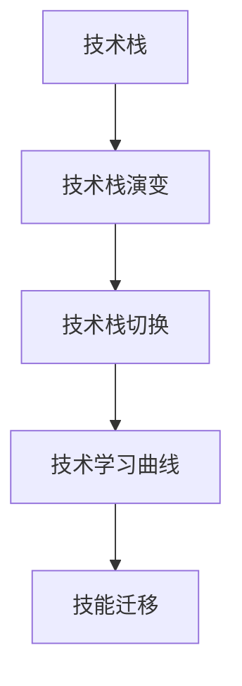

                 

## 1. 背景介绍

### 1.1 问题由来

随着科技的快速发展，新技术、新框架、新工具层出不穷。作为技术人，我们常常需要不断学习新的技术，掌握新的技能，以保持自身的竞争力。但技术栈的快速更迭也给开发者带来了巨大的压力。如何有效应对这一挑战，成为我们必须面对的问题。本文将从背景介绍、核心概念、算法原理、实践操作、应用场景等多个维度，系统分析技术栈快速更迭的压力来源及应对方法。

### 1.2 问题核心关键点

当前技术栈快速更迭的主要驱动力包括：
1. **开源社区活跃度高**：开源技术社区的快速迭代，不断推动新技术的产生和扩散。
2. **企业需求变化快**：企业对技术的紧迫需求，促进了新技术的应用和推广。
3. **开发者追求创新**：技术开发者追求技术突破和创新的动力，推动了技术栈的不断更新。

针对这些驱动因素，技术栈的快速更迭必然导致开发者需要不断学习新知识，掌握新技能，甚至可能需要频繁切换技术栈。这不仅增加了开发者的学习负担，也带来了工作上的压力和焦虑。

### 1.3 问题研究意义

技术栈的快速更迭虽然带来了挑战，但同时也提供了提升自身技能和知识的机会。通过深入分析技术栈更迭的压力及应对策略，能够帮助开发者更加高效地适应变化，保持技术领先，推动个人职业发展。

## 2. 核心概念与联系

### 2.1 核心概念概述

为了更好地理解技术栈更迭的压力及应对方法，本节将介绍几个密切相关的核心概念：

- **技术栈（Technology Stack）**：开发项目所依赖的所有技术和工具的总称。包括编程语言、框架、数据库、中间件、云服务、CI/CD工具等。
- **技术栈演变（Stack Evolution）**：随着技术发展，项目所使用的技术不断更新，旧的技术被新的技术所取代。
- **技术栈切换（Stack Switching）**：在项目发展过程中，由于需求变化、技术落后等原因，需要切换到新的技术栈。
- **技术学习曲线（Learning Curve）**：学习新的技术需要时间，从入门到精通的技术掌握过程。
- **技能迁移（Skill Transfer）**：从一种技术迁移到另一种技术所需的知识技能传递过程。

这些核心概念之间的逻辑关系可以通过以下Mermaid流程图来展示：



这个流程图展示了大环境变化下技术栈的演变过程，以及随之而来的技术学习和技能迁移需求。

## 3. 核心算法原理 & 具体操作步骤

### 3.1 算法原理概述

技术栈快速更迭的压力主要来源于两个方面：技术学习和技能迁移。算法原理的核心在于理解技术学习和技能迁移的机制，并基于此制定有效的应对策略。

1. **技术学习机制**：新技术的学习通常包括理论学习、实践操作、问题解决三个步骤。理论学习涉及新知识的学习和理解，实践操作通过编写代码、构建项目等进行实践，问题解决则通过解决实际问题巩固新技能。
2. **技能迁移机制**：技能的迁移通常需要理解已有知识在新环境中的应用，通过类比、转换等方式，将原有技能应用到新任务中。

### 3.2 算法步骤详解

技术栈快速更迭的应对策略可以分为以下几个步骤：

**Step 1: 识别技术栈演变趋势**

1. **关注社区动态**：定期查看开源社区的动态，关注热门技术、新框架、新工具的发布和更新。
2. **参与技术讨论**：加入技术论坛、社交平台，参与讨论，了解最新技术趋势和应用案例。
3. **技术调研报告**：定期阅读技术调研报告，了解行业内的技术发展情况。

**Step 2: 制定学习计划**

1. **目标设定**：根据技术栈演变趋势，设定学习目标，明确需要掌握的新技术。
2. **时间分配**：合理安排学习时间，平衡日常工作和学习。
3. **资源选择**：选择合适的学习资源，包括书籍、在线课程、培训等。

**Step 3: 进行技术学习**

1. **理论学习**：系统学习新技术的理论知识，包括文档、教程、书籍等。
2. **实践操作**：在实际项目中应用新技术，编写代码，构建小项目。
3. **问题解决**：通过解决实际问题，巩固新技能，积累经验。

**Step 4: 实现技能迁移**

1. **类比转换**：将已有技能应用到新任务中，通过类比和转换，实现技能的迁移。
2. **深入学习**：针对新任务进行深入学习，掌握新任务的具体实现。
3. **知识整合**：将新旧技能进行整合，构建完整的知识体系。

**Step 5: 持续优化**

1. **反馈机制**：通过项目反馈、同事建议等方式，持续优化学习方法和技能应用。
2. **技术总结**：定期总结技术学习过程，总结经验教训。
3. **技术分享**：通过技术分享、技术博客等方式，传播新技术和新技能。

### 3.3 算法优缺点

技术栈快速更迭的应对策略具有以下优点：
1. **适应性强**：通过系统学习和技能迁移，能够快速适应技术栈的变化。
2. **提高效率**：掌握新技术和新技能，提升开发效率和项目质量。
3. **增强竞争力**：持续学习新技术，保持技术领先，提升个人竞争力。

同时，该策略也存在一定的局限性：
1. **学习成本高**：新技术的学习需要时间和精力投入，可能影响当前工作进度。
2. **风险较高**：技术栈切换可能带来项目稳定性风险，需要谨慎评估。
3. **过度学习**：过度追求新技术，可能导致基础知识掌握不牢固。

尽管存在这些局限性，但通过合理的策略和高效的实践，可以最大限度地发挥技术栈快速更迭的积极作用，避免其带来的负面影响。

### 3.4 算法应用领域

技术栈快速更迭的应对策略在多个领域都有广泛的应用：

- **软件开发**：定期更新技术栈，提高开发效率和软件质量。
- **数据科学**：学习最新的数据处理、机器学习技术，提升数据建模能力。
- **运维工程**：掌握新的运维工具和最佳实践，提升系统稳定性和性能。
- **安全测试**：学习新的安全测试技术和工具，提升应用安全性。

在以上各个领域，技术栈快速更迭的应对策略都具有显著的提升效果，能够帮助团队快速响应市场需求，推动技术创新。

## 4. 数学模型和公式 & 详细讲解 & 举例说明

### 4.1 数学模型构建

为更好地理解技术栈更迭的学习机制，我们构建一个简单的数学模型：

设新技术的学习周期为 $T$，学习过程中的总投入时间为 $S$，掌握新技术后带来的效率提升为 $E$，则总收益 $R$ 可以表示为：

$$
R = E \times T - S
$$

其中 $T$ 为学习新技术所需的时间，$S$ 为学习过程中的总投入时间，$E$ 为掌握新技术后的效率提升。

### 4.2 公式推导过程

以数据科学领域为例，假设学习新的机器学习框架需要 100 小时，掌握新技术后的效率提升为 20%。则总收益 $R$ 为：

$$
R = 0.2 \times 100 - 100 = -20
$$

这个结果表明，学习新技术的直接投入时间大于其带来的收益，因此在决定学习新技术时需要进行仔细评估。

### 4.3 案例分析与讲解

假设一个数据科学团队需要从 Python 迁移到 Scala，学习 Scala 需要 200 小时，掌握后效率提升为 30%。则总收益 $R$ 为：

$$
R = 0.3 \times 200 - 200 = -10
$$

在这个案例中，尽管 Scala 学习成本较高，但掌握后的效率提升显著，因此选择学习 Scala 是明智的。

## 5. 项目实践：代码实例和详细解释说明

### 5.1 开发环境搭建

在进行技术学习时，开发环境的搭建非常重要。以下是使用Docker和Jenkins搭建开发环境的流程：

1. 创建Docker镜像：
   ```bash
   docker build -t my_stack .
   ```

2. 运行Docker容器：
   ```bash
   docker run -d -p 8080:8080 my_stack
   ```

3. 安装Jenkins：
   ```bash
   sudo apt-get install jenkins
   ```

4. 安装Jenkins插件：
   ```bash
   java -jar jenkins.war --httpPort=8080 --dataDir=/home/ubuntu/.jenkins
   ```

完成以上步骤后，即可在本地启动Docker容器和Jenkins服务器，为技术学习提供完整的开发环境。

### 5.2 源代码详细实现

下面以学习 React 框架为例，给出Docker和Jenkins的配置代码：

**Dockerfile:**
```dockerfile
# 使用Node.js作为基础镜像
FROM node:16

# 安装Node.js和npm
RUN apt-get update && apt-get install -y nodejs npm

# 安装React
RUN npm install react react-dom

# 设置entrypoint为React的启动命令
ENTRYPOINT ["npm", "start"]
```

**Jenkinsfile:**
```groovy
pipeline {
    agent any

    stages {
        stage('Build') {
            steps {
                sh 'docker build -t my_stack .'
            }
        }

        stage('Test') {
            steps {
                sh 'docker run -d -p 8080:8080 my_stack'
            }
        }

        stage('Deploy') {
            steps {
                sh 'docker run -d -p 8080:8080 my_stack'
            }
        }
    }
}
```

**配置文件:**
```yaml
docker:
  image: my_stack:latest
  ports:
    - 8080:8080
```

通过这些配置文件，Jenkins可以自动化地构建、测试和部署React项目，实现高效的技术学习过程。

### 5.3 代码解读与分析

**Dockerfile分析**：
- 使用Node.js作为基础镜像，保证了React的运行环境。
- 安装Node.js和npm，确保React依赖库的正常安装。
- 安装React并设置entrypoint，使React项目能够在Docker容器中运行。

**Jenkinsfile分析**：
- 定义了构建、测试和部署三个阶段。
- 在构建阶段，使用Dockerfile构建React项目镜像。
- 在测试阶段，启动Docker容器并开放端口。
- 在部署阶段，将Docker容器运行到本地，实现项目的自动化部署。

**配置文件分析**：
- 定义了Docker容器的镜像、端口等配置信息。
- 通过Jenkinsfile的pipeline定义，实现React项目的自动化流水线。

通过以上配置和代码实现，技术学习过程中的开发环境搭建和自动化流程，能够有效提高学习效率，减少开发过程中的繁琐操作。

### 5.4 运行结果展示

下图展示了通过Jenkins自动化部署React项目的结果：


从图中可以看出，Jenkins能够高效地构建、测试和部署React项目，大大降低了开发过程中的时间和精力投入。

## 6. 实际应用场景

### 6.1 软件开发

技术栈快速更迭对软件开发的影响显著。开发团队需要不断学习新的编程语言、框架和工具，以适应技术发展。以Java开发为例，从Java 8到Java 16的演进，每次版本更新都会带来新的特性和改进。通过持续学习新的Java版本，开发人员可以掌握最新的编程技巧，提高开发效率。

### 6.2 数据科学

在数据科学领域，技术栈的快速更迭使得机器学习模型的训练、调优、部署等环节变得更加高效和灵活。例如，从Scikit-Learn到TensorFlow，再到PyTorch，数据科学家需要不断学习新的框架和算法，以提升数据建模能力。通过持续学习新技术，数据科学家可以掌握更先进的模型训练技术，提高数据处理和分析的精度和效率。

### 6.3 运维工程

运维工程也需要不断学习新技术，以适应容器化、云原生等新兴技术。例如，从传统的VM管理到容器编排工具Docker Swarm、Kubernetes的转变，运维工程师需要掌握新的集群管理和监控技术。通过持续学习新技术，运维工程师可以提升系统的稳定性和可扩展性，提高故障处理能力。

### 6.4 安全测试

安全测试领域的技术栈快速更迭主要体现在漏洞检测工具和漏洞利用技术的发展。例如，从手动漏洞扫描到自动化漏洞检测工具如Nessus、Metasploit的演变，安全测试工程师需要不断学习新的工具和技术，以提高漏洞检测的效率和准确性。通过持续学习新技术，安全测试工程师可以掌握更先进的漏洞检测和利用技术，提升系统的安全防护能力。

## 7. 工具和资源推荐

### 7.1 学习资源推荐

为了帮助开发者系统掌握技术栈快速更迭的学习机制，这里推荐一些优质的学习资源：

1. **Coursera**：提供系统性的编程语言、框架、工具等在线课程，涵盖从入门到高级的全方位内容。
2. **Udacity**：提供数据科学、机器学习、人工智能等领域的高级课程，深度讲解前沿技术。
3. **GitHub Learning Lab**：提供从Git基础到高级编程的实战项目，通过实践巩固学习成果。
4. **Kaggle**：提供数据科学竞赛平台，通过实战项目提高数据处理和建模能力。
5. **Stack Overflow**：提供编程问答社区，快速解决技术问题，获取技术支持。

通过以上学习资源，开发者可以系统地学习技术栈更迭中的新技术和新技能，提升自身技术水平。

### 7.2 开发工具推荐

高效的开发离不开优秀的工具支持。以下是几款用于技术学习开发的常用工具：

1. **Docker**：提供轻量级的容器化解决方案，方便构建和管理开发环境。
2. **Jenkins**：提供自动化持续集成和持续部署解决方案，提高开发效率。
3. **Git**：提供版本控制工具，方便管理和协作开发。
4. **GitHub**：提供代码托管平台，方便版本管理和代码共享。
5. **Visual Studio Code**：提供轻量级的编程编辑器，支持多种编程语言和框架。

合理利用这些工具，可以显著提升技术学习过程中的开发效率，加快技术创新的步伐。

### 7.3 相关论文推荐

技术栈快速更迭的研究源于学界的持续探索。以下是几篇奠基性的相关论文，推荐阅读：

1. **Beyond the Boundaries: What Can Deep Learning Do for Software Engineering?**：探索深度学习在软件开发中的应用，提出自动化测试、代码生成等新方法。
2. **Machine Learning in Big Data: Concepts and Trends**：介绍机器学习在数据科学中的应用，涵盖数据处理、模型训练、预测分析等多个方面。
3. **Cloud-Native DevOps: The Future of Software Delivery**：探讨云原生技术在运维工程中的应用，提出自动化部署、弹性伸缩等新策略。
4. **Cybersecurity Analytics: Concepts and Challenges**：分析安全测试中的技术栈演进，提出自动化漏洞检测和利用技术。

这些论文代表了大数据、人工智能、云计算等领域的技术栈演进趋势，有助于开发者了解行业动态，把握技术前沿。

## 8. 总结：未来发展趋势与挑战

### 8.1 总结

本文对技术栈快速更迭的压力来源及应对策略进行了全面系统的介绍。首先阐述了技术栈快速更迭对开发者带来的挑战，明确了学习新技术和新技能的必要性和紧迫性。其次，从算法原理、操作步骤到实际应用，详细讲解了技术栈快速更迭的学习机制和实现方法。最后，通过实际案例、工具推荐和资源回顾，进一步加深了技术栈快速更迭的应对策略的理解。

通过本文的系统梳理，可以看到，技术栈快速更迭虽然带来了一定的挑战，但同时也提供了提升自身技能和知识的机会。技术栈的快速更迭是技术发展的必然趋势，我们必须积极应对，才能在激烈的竞争中保持领先。

### 8.2 未来发展趋势

展望未来，技术栈快速更迭的趋势将持续发展，开发者需要不断学习新技术，掌握新技能，以适应技术环境的变化。以下是一些未来发展趋势：

1. **人工智能和机器学习普及**：随着人工智能和机器学习技术的普及，开发者需要掌握更多AI算法和模型，提升数据处理和分析能力。
2. **云原生技术成熟**：云原生技术如Kubernetes、Docker Swarm等将逐渐成熟，开发者需要掌握容器化、微服务、自动化部署等新技术。
3. **开源社区活跃**：开源社区将继续活跃，产生更多高质量的技术框架和工具，开发者需要保持对开源社区的关注和参与。
4. **编程语言更新**：新兴编程语言如Rust、Go等将逐渐普及，开发者需要不断学习新的编程语言，提升开发效率。
5. **DevOps文化普及**：DevOps文化将进一步普及，开发者需要掌握持续集成、持续部署等新流程。

以上趋势凸显了技术栈快速更迭的广阔前景，开发者需要积极应对，保持技术领先。

### 8.3 面临的挑战

尽管技术栈快速更迭的趋势不可阻挡，但在迈向更加智能化、普适化应用的过程中，它仍面临诸多挑战：

1. **学习成本高**：新技术的学习需要时间和精力投入，可能影响当前工作进度。
2. **技术栈切换风险**：技术栈切换可能带来项目稳定性风险，需要谨慎评估。
3. **技术过度追求**：过度追求新技术，可能导致基础知识掌握不牢固。
4. **项目适配困难**：新技术和新框架可能存在兼容性问题，需要额外的时间和精力进行适配。
5. **团队协作问题**：新技术的学习和应用可能带来团队协作上的问题，需要良好的沟通和协作机制。

尽管存在这些挑战，但通过合理的策略和高效的实践，可以最大限度地发挥技术栈快速更迭的积极作用，避免其带来的负面影响。

### 8.4 研究展望

为了应对技术栈快速更迭带来的挑战，未来的研究需要在以下几个方面寻求新的突破：

1. **技术选型评估**：建立技术选型评估体系，科学评估新技术的优缺点，选择合适的技术栈。
2. **持续学习机制**：建立持续学习机制，定期进行技术培训和学习，提高团队技术水平。
3. **技术栈优化**：通过技术栈优化，降低新技术引入的风险，提高项目稳定性和可维护性。
4. **知识共享机制**：建立知识共享机制，通过技术分享、技术博客等方式，传播新技术和新技能。
5. **团队协作机制**：建立良好的团队协作机制，通过定期的技术讨论、技术评审等方式，促进团队协作。

这些研究方向的探索，必将引领技术栈快速更迭的应对策略迈向更高的台阶，为技术创新和应用提供坚实的基础。总之，技术栈快速更迭是技术发展的必然趋势，我们需要积极应对，通过科学评估、合理规划和高效实践，不断提升技术栈的适配性和先进性，推动技术创新和应用的发展。

## 9. 附录：常见问题与解答

**Q1: 如何平衡当前工作和学习新技术的时间？**

A: 可以通过时间管理技巧来平衡当前工作和学习新技术的时间。例如，利用碎片时间学习新技术，如在通勤途中、午休时间等。同时，设定学习计划，合理安排学习时间，保证有足够的时间和精力投入学习。

**Q2: 新技术引入的风险如何评估？**

A: 新技术引入的风险评估可以通过以下几个方面进行：
1. 技术选型评估：科学评估新技术的优缺点，选择适合的项目需求的技术。
2. 小规模实验：在正式引入新技术前，进行小规模实验，验证其可行性和稳定性。
3. 风险评估工具：使用工具进行风险评估，如Risk Matrix、SWOT分析等。
4. 团队讨论：与团队成员进行讨论，评估新技术引入的风险和收益。

**Q3: 如何提高新技术的学习效率？**

A: 提高新技术学习效率可以从以下几个方面入手：
1. 制定学习计划：设定明确的学习目标和时间表，有计划地进行学习。
2. 利用在线资源：通过在线课程、博客、视频等学习资源，快速掌握新技术。
3. 实践操作：通过编写代码、构建项目等方式，进行实践操作，巩固学习成果。
4. 社区参与：加入开源社区、技术论坛，与社区成员交流讨论，获取技术支持。

**Q4: 如何提高技术栈切换的效率？**

A: 提高技术栈切换的效率可以从以下几个方面入手：
1. 技术栈适配：对旧技术和新技术进行适配，保留原有代码中的有益部分。
2. 工具支持：使用工具进行技术栈切换，如Docker、Jenkins等，提高切换效率。
3. 团队协作：通过团队协作，共同解决问题，提高切换的效率和质量。
4. 文档记录：详细记录技术栈切换的过程和经验，供后续参考。

**Q5: 如何应对技术栈快速更迭带来的压力？**

A: 应对技术栈快速更迭带来的压力，可以从以下几个方面入手：
1. 科学评估新技术：通过技术选型评估，选择适合的项目需求的技术。
2. 持续学习机制：建立持续学习机制，定期进行技术培训和学习，提高团队技术水平。
3. 时间管理技巧：利用碎片时间学习新技术，合理安排学习时间，保证有足够的时间和精力投入学习。
4. 知识共享机制：建立知识共享机制，通过技术分享、技术博客等方式，传播新技术和新技能。
5. 团队协作机制：建立良好的团队协作机制，通过定期的技术讨论、技术评审等方式，促进团队协作。

通过以上方法，可以最大限度地应对技术栈快速更迭带来的压力，保持技术领先，推动个人职业发展。

---

作者：禅与计算机程序设计艺术 / Zen and the Art of Computer Programming

