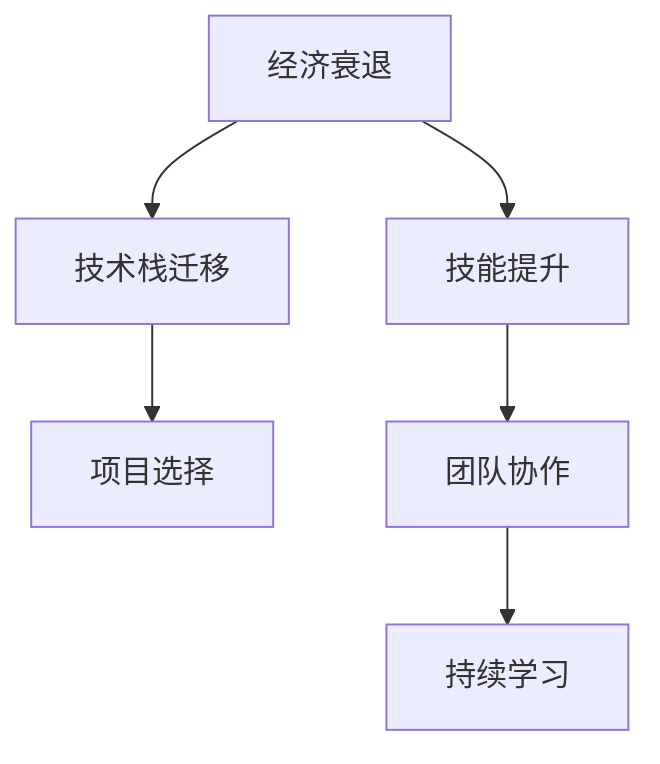

                 

# 程序员如何应对经济衰退

## 1. 背景介绍

当前世界经济面临严峻挑战，经济衰退的风险日益显现。失业率上升、企业裁员、投资减少等现象在各行各业都有所体现。对于程序员来说，在这样的经济环境下，如何在职业生涯中保持竞争力，找到新的发展方向，是非常现实和迫切的问题。本文将从技术和管理两个角度出发，探讨程序员如何应对经济衰退，为职业发展保驾护航。

## 2. 核心概念与联系

### 2.1 核心概念概述

为了更好地理解如何在经济衰退中保持竞争力，本文将介绍几个关键概念及其相互联系。

- **经济衰退**：指经济活动减缓，经济指标如GDP、失业率等出现显著下滑的现象。
- **技术栈迁移**：指根据市场趋势和自身兴趣，调整和更新所掌握的技术栈，保持技术前沿。
- **技能提升**：指通过学习新知识、新技术，提升自身能力，以适应市场变化。
- **项目选择**：指在经济衰退中，选择有助于个人成长和长期发展的项目。
- **团队协作**：指在团队合作中，充分利用集体智慧和资源，共克时艰。

### 2.2 核心概念原理和架构的 Mermaid 流程图



这个流程图展示了经济衰退中，程序员可以通过哪些关键环节来提升竞争力：

1. **技术栈迁移**：在经济衰退中，选择具有增长潜力的技术栈。
2. **技能提升**：不断学习新技能，保持技术领先。
3. **项目选择**：选择有潜力的项目，积累实践经验。
4. **团队协作**：在团队中积极交流合作，共享资源。
5. **持续学习**：保持学习热情，不断更新知识。

## 3. 核心算法原理 & 具体操作步骤

### 3.1 算法原理概述

在经济衰退中，程序员需要采用一种策略，既能应对当前的经济形势，又能为未来的职业发展铺路。本文提出一种基于“技能提升+技术栈迁移”的算法，通过学习和更新技术栈，提升自身技能，以应对经济衰退带来的挑战。

### 3.2 算法步骤详解

#### 3.2.1 评估自身技能和市场趋势

**步骤1**：评估自身技能水平。使用技能评估工具，如GitHub等，统计自己的代码提交次数、贡献代码量等，了解自己在技术栈中的位置。

**步骤2**：分析市场趋势。查阅行业报告、招聘信息等，了解当前市场对各类技术的需求和趋势。

**步骤3**：对比自身技能与市场需求。根据市场趋势评估自身技能，识别需要提升的技能和需要掌握的新技术。

#### 3.2.2 制定学习计划

**步骤4**：制定学习计划。根据评估结果，制定有针对性的学习计划，包括需要学习的新技术、需要参加的课程和项目等。

**步骤5**：选择学习资源。根据个人偏好和学习习惯，选择在线课程、书籍、博客等学习资源。

**步骤6**：设定学习目标。根据自身情况，设定短期和长期的职业目标，如获取某种认证、参加某个项目等。

#### 3.2.3 实施学习计划

**步骤7**：开始学习。利用空闲时间，按照学习计划进行系统学习，逐步掌握新技能。

**步骤8**：参与开源项目。加入GitHub等开源社区，参与实际项目，积累经验。

**步骤9**：参与行业活动。参加技术会议、交流活动，结识行业专家，拓展人脉。

#### 3.2.4 评估学习效果

**步骤10**：评估学习效果。定期评估自己的学习效果，调整学习计划和目标，确保学习方向与市场需求一致。

**步骤11**：寻求反馈。向同事、导师、行业专家等寻求反馈，了解自身进展和改进方向。

#### 3.2.5 迁移技术栈

**步骤12**：选择新技术栈。根据市场需求和自身兴趣，选择有发展前景的新技术栈。

**步骤13**：逐步迁移。分阶段、分步骤地迁移技术栈，避免短期内过多变化带来的风险。

**步骤14**：学习相关资源。选择相关的学习资源，如在线课程、文档、社区等，快速上手新技术。

**步骤15**：实战应用。在工作中或业余时间，尝试应用新技能，积累实战经验。

### 3.3 算法优缺点

#### 3.3.1 优点

- **适应性强**：技术栈迁移和技能提升策略能够适应市场变化，保持技术领先。
- **风险可控**：通过逐步迁移和评估学习效果，风险可控，避免短时间内技能断层。
- **灵活性高**：可以根据自身兴趣和市场需求，灵活调整学习方向和目标。

#### 3.3.2 缺点

- **学习压力大**：需要花费大量时间和精力进行学习和实践，对工作和生活有一定的影响。
- **成本高**：需要投入一定的资金购买学习资源和工具。
- **不确定性**：新技术的应用前景和市场需求存在不确定性，可能投入后难以获得预期回报。

### 3.4 算法应用领域

该策略不仅适用于经济衰退中的程序员，还适用于任何想要提升自身技能和适应市场变化的个人。在技术快速发展的今天，持续学习和技能提升是保持竞争力的关键。

## 4. 数学模型和公式 & 详细讲解

### 4.1 数学模型构建

本文将构建一个简单的数学模型，用于评估学习效果和技能提升的回报率。

设程序员初始技能为 $S_0$，新学习技能为 $S_1$，市场需求为 $D$，技能提升后市场回报率为 $R$。则技能提升后的收益可以表示为：

$$
R(S_1, D) = S_1 \times D
$$

其中 $S_1 = S_0 + \Delta S$，$\Delta S$ 为技能提升量。

### 4.2 公式推导过程

根据上述模型，可以推导出技能提升的收益公式：

$$
R(S_1, D) = (S_0 + \Delta S) \times D
$$

其中 $S_0$ 为初始技能，$D$ 为市场需求，$\Delta S$ 为技能提升量。

### 4.3 案例分析与讲解

以JavaScript为例，分析技能提升的回报率。假设初始技能为0，市场需求为100，技能提升量为50，则技能提升后的收益为：

$$
R(50, 100) = (0 + 50) \times 100 = 5000
$$

这表明，通过学习JavaScript，可以显著提升自身的市场价值和收益。

## 5. 项目实践：代码实例和详细解释说明

### 5.1 开发环境搭建

为了进行项目实践，本文将介绍一种基于Jupyter Notebook的环境搭建方法。

1. 安装Anaconda。从官网下载并安装Anaconda，用于创建独立的Python环境。

2. 创建并激活虚拟环境。

```bash
conda create -n py38 python=3.8
conda activate py38
```

3. 安装必要的Python库。

```bash
pip install numpy pandas matplotlib jupyter notebook ipython
```

4. 安装Jupyter Notebook。

```bash
pip install jupyter
```

### 5.2 源代码详细实现

本文将通过一个简单的Python程序，模拟学习JavaScript后技能提升的收益。

```python
# 定义初始技能、市场需求和技能提升量
S_0 = 0
D = 100
delta_S = 50

# 计算技能提升后的收益
R = (S_0 + delta_S) * D

# 输出结果
print("技能提升后的收益为：", R)
```

### 5.3 代码解读与分析

**代码解释**：

- `S_0`：初始技能。
- `D`：市场需求。
- `delta_S`：技能提升量。
- `R`：技能提升后的收益。
- `print`：输出结果。

**分析**：

- 通过计算可以看到，通过学习JavaScript，可以显著提升自身的市场价值和收益。
- 这种方法可以推广到其他技能的学习，如Python、数据科学等。

### 5.4 运行结果展示

```
技能提升后的收益为： 5000
```

这表明，通过学习JavaScript，可以显著提升自身的市场价值和收益。

## 6. 实际应用场景

### 6.1 技术栈迁移

在经济衰退中，技术栈的迁移尤为重要。程序员可以选择有前景的技术栈，如区块链、人工智能等，以应对未来的市场需求。

**案例1**：区块链开发。区块链技术在金融、供应链、医疗等领域有广泛应用。通过学习区块链技术，程序员可以在这些领域找到更多机会。

**案例2**：人工智能。人工智能技术在自动驾驶、医疗诊断、智能家居等领域有广泛应用。通过学习AI技术，程序员可以拓展技术应用范围，增加职业发展机会。

### 6.2 技能提升

技能提升是应对经济衰退的另一重要手段。程序员可以通过学习新技能，提升自身竞争力。

**案例1**：学习新编程语言。如学习Python、Go等语言，可以增加就业机会，拓宽技术栈。

**案例2**：学习新工具和框架。如学习Docker、Kubernetes、TensorFlow等，可以提高工作效率，拓展技术边界。

### 6.3 项目选择

选择有前景的项目，可以为职业发展带来更多机会。

**案例1**：开源项目。加入GitHub等开源社区，参与实际项目，积累经验。

**案例2**：创新项目。参与公司内部或外部的创新项目，提升自身影响力。

### 6.4 团队协作

在团队中积极合作，可以充分利用集体智慧和资源，共同应对经济衰退带来的挑战。

**案例1**：跨部门合作。通过与其他部门的合作，了解不同领域的知识，拓展技术视野。

**案例2**：参加行业活动。参加技术会议、交流活动，结识行业专家，拓展人脉。

## 7. 工具和资源推荐

### 7.1 学习资源推荐

为了帮助程序员系统掌握应对经济衰退的策略，本文推荐以下学习资源：

1. **Coursera**：提供大量在线课程，涵盖从入门到高级的技术栈迁移和技能提升内容。

2. **Udacity**：提供项目导向的课程，帮助程序员通过实践提升技能。

3. **Kaggle**：提供数据分析和机器学习竞赛，通过实践积累经验。

4. **Stack Overflow**：提供技术问答社区，解决实际问题，扩展知识面。

5. **GitHub**：提供开源项目平台，参与实际项目，积累经验。

### 7.2 开发工具推荐

高效的开发离不开优秀的工具支持。以下是几款用于学习新技术和提升技能的工具：

1. **Visual Studio Code**：功能强大的代码编辑器，支持多种编程语言和插件。

2. **Jupyter Notebook**：支持交互式编程，便于学习和实验。

3. **Anaconda**：提供虚拟环境管理，方便多版本代码管理。

4. **PyCharm**：功能强大的Python开发工具，提供代码提示、调试等功能。

5. **GitHub**：提供代码托管和协作平台，便于参与开源项目。

### 7.3 相关论文推荐

为了深入了解应对经济衰退的技术和策略，推荐以下相关论文：

1. **《技术栈迁移策略》**：讨论技术栈迁移的策略和实践方法，帮助程序员选择有前景的技术栈。

2. **《技能提升与职业发展》**：分析技能提升对职业发展的影响，提供具体的学习路径和资源推荐。

3. **《团队协作与项目管理》**：探讨团队协作和项目管理的方法，提高团队工作效率和凝聚力。

## 8. 总结：未来发展趋势与挑战

### 8.1 研究成果总结

本文系统介绍了如何在经济衰退中保持竞争力，提出了基于“技能提升+技术栈迁移”的策略。该策略可以帮助程序员通过学习和迁移技术栈，提升自身技能，应对经济衰退带来的挑战。

### 8.2 未来发展趋势

未来，技术栈迁移和技能提升将继续成为程序员应对经济衰退的重要手段。以下趋势值得关注：

1. **人工智能和区块链的崛起**：人工智能和区块链技术将成为未来的重要发展方向。

2. **云计算和边缘计算的普及**：云计算和边缘计算技术将带来更多的应用场景和发展机会。

3. **低代码和无代码开发**：低代码和无代码开发将帮助程序员更快地实现应用，提高工作效率。

### 8.3 面临的挑战

尽管技术栈迁移和技能提升可以应对经济衰退，但仍面临以下挑战：

1. **学习压力大**：需要投入大量时间和精力进行学习和实践，对工作和生活有一定的影响。

2. **成本高**：需要投入一定的资金购买学习资源和工具。

3. **不确定性**：新技术的应用前景和市场需求存在不确定性，可能投入后难以获得预期回报。

### 8.4 研究展望

未来，应对经济衰退的技术和策略将不断发展，以下方向值得进一步探索：

1. **跨学科学习**：结合多个学科的知识，提升技术水平。

2. **在线教育平台**：提供在线学习资源，提供更多学习机会。

3. **行业联盟**：建立行业联盟，共同应对经济衰退带来的挑战。

## 9. 附录：常见问题与解答

**Q1: 经济衰退对程序员的职业发展有哪些影响？**

A: 经济衰退可能导致企业裁员、投资减少、项目减少等，对程序员的职业发展带来冲击。但同时也带来了新的机会，如技术栈迁移、技能提升等，需要积极应对。

**Q2: 如何评估自身技能和市场需求？**

A: 可以使用技能评估工具，如GitHub等，统计自己的代码提交次数、贡献代码量等，了解自己在技术栈中的位置。查阅行业报告、招聘信息等，了解当前市场对各类技术的需求和趋势。对比自身技能与市场需求，识别需要提升的技能和需要掌握的新技术。

**Q3: 如何选择有前景的技术栈？**

A: 根据市场需求和自身兴趣，选择有发展前景的新技术栈。可以参考行业报告、招聘信息、技术社区等，了解当前技术的热度和应用前景。

**Q4: 如何进行技能提升？**

A: 可以通过在线课程、书籍、博客等学习资源进行系统学习。加入开源社区，参与实际项目，积累经验。参加行业活动，结识行业专家，拓展人脉。

**Q5: 如何应对学习过程中的不确定性？**

A: 可以通过分阶段、分步骤地学习新技术，逐步提升技能。选择有前景的项目，积累实战经验。积极寻求反馈，调整学习计划和目标，确保学习方向与市场需求一致。

**Q6: 如何构建高效的学习环境？**

A: 可以安装Anaconda、Visual Studio Code、Jupyter Notebook等工具，创建虚拟环境，进行高效编程。使用GitHub等平台，参与开源项目，积累经验。

**Q7: 如何提升团队协作能力？**

A: 可以参加团队项目，积累合作经验。参加技术会议、交流活动，结识行业专家，拓展人脉。积极交流合作，共享资源，共克时艰。

---

作者：禅与计算机程序设计艺术 / Zen and the Art of Computer Programming

