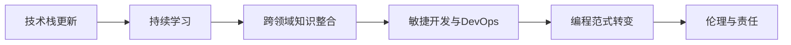

                 

## 1. 背景介绍

在日新月异的科技浪潮中，IT行业不断迎来新的变革与挑战。从云计算、大数据到人工智能、区块链，每一次技术的飞跃都重新定义了行业格局，对从业者提出了更高的要求。对于程序员而言，如何适应这些变化，快速掌握新技术，推动自身与行业共同发展，已成为迫在眉睫的问题。本文旨在帮助程序员们理解行业变革的本质，探索应对转型的有效策略，从而在新的竞争环境中脱颖而出。

### 1.1 行业变革的内涵与驱动因素

行业变革通常是指一个行业在技术、市场、业务模式等方面发生的根本性变化。驱动因素多样，主要包括但不限于以下几点：

- **技术创新**：如云计算、大数据、人工智能等新技术的出现与应用，促使传统IT架构和开发范式发生变革。
- **市场需求变化**：用户需求的多样化和个性化推动企业不断调整产品和服务，甚至重新定义业务模型。
- **政策法规影响**：如数据隐私保护、网络安全等法律法规的出台，要求企业在技术应用中做出相应调整。
- **全球化与多元化**：国际贸易与合作加深，企业需要跨越不同地域和文化，提供全球化解决方案。

### 1.2 变革对程序员的影响

行业变革对程序员的影响主要体现在以下几个方面：

- **技能需求更新**：新技术的出现要求程序员不断学习新技能，更新知识体系。
- **工作方式变化**：云计算和DevOps理念推广，推动了远程工作、容器化、自动化等新工作方式的兴起。
- **职业发展路径变化**：跨领域融合和新技术创新，拓展了程序员的职业发展方向，但同时增加了选择难度。
- **市场需求变化**：企业和客户对软件的需求更加注重性能、安全、易用性，程序员需要不断提升软技能以适应变化。

## 2. 核心概念与联系

### 2.1 核心概念概述

为帮助程序员更好地理解和应对行业变革，本节将介绍几个关键概念及其相互关系。

- **技术栈更新**：指开发者需要掌握和使用的技术集合随行业发展而动态变化。
- **持续学习**：面对快速变化的技术和需求，程序员需要不断学习新知识，保持技术栈的先进性。
- **跨领域知识整合**：IT与业务、其他技术领域的交叉融合，要求程序员具备更广博的跨学科知识。
- **敏捷开发与DevOps**：强调快速迭代、持续交付和协作，提升软件开发效率和质量。
- **编程范式转变**：如从面向过程编程到面向对象编程，再到函数式编程和并发编程，反映了编程思维和工具的演变。
- **伦理与责任**：程序员在设计和实现软件时，需要考虑伦理问题，如隐私保护、数据安全等，履行社会责任。

### 2.2 核心概念原理和架构的 Mermaid 流程图



通过这个流程图，我们可以看到这些概念之间的相互影响和依赖关系。技术栈的更新驱动程序员不断学习，而跨领域的知识整合又进一步推动了编程范式和开发模式的转变。与此同时，敏捷开发和DevOps理念的推广，提升了软件开发的效率和质量。在这一过程中，程序员还应始终牢记伦理与责任，确保软件应用的正面社会影响。

## 3. 核心算法原理 & 具体操作步骤

### 3.1 算法原理概述

技术变革往往伴随着新算法和工具的涌现，理解这些算法原理是程序员应对转型的重要一步。

- **机器学习与深度学习**：如神经网络、强化学习、自然语言处理等，已成为数据驱动应用的核心算法。
- **云计算架构**：包括云存储、云数据库、弹性计算等，改变了软件部署和数据处理的方式。
- **区块链技术**：通过去中心化、加密和共识机制，提供了新型数据处理和交互方式。
- **微服务架构**：将应用拆分为独立、自治的服务单元，支持更高的灵活性和可扩展性。

### 3.2 算法步骤详解

为了更好地应对行业变革，程序员需要掌握以下步骤：

1. **识别技术趋势**：通过阅读技术博客、参加行业会议、订阅科技新闻等途径，及时获取行业动态。
2. **学习新技能**：根据技术栈的变化，制定个人学习计划，利用在线课程、书籍、文档等资源进行系统学习。
3. **实践应用**：通过实际项目或实验，巩固所学知识，理解技术原理和应用场景。
4. **参与社区**：加入技术社群，分享学习心得，交流问题解决经验，扩展人脉资源。
5. **持续迭代**：技术栈更新是一个持续的过程，程序员需要不断更新知识，保持技术栈的前沿性。

### 3.3 算法优缺点

新技术带来新机遇的同时，也伴随着挑战：

- **优点**：
  - **提升效率**：自动化工具和云计算等技术，大大提高了软件开发的效率和质量。
  - **多样化应用**：新技术的应用场景更加广泛，程序员可以探索更多创新性解决方案。
  - **协作便捷**：远程工作、DevOps等模式，提升了团队协作的效率和灵活性。
  
- **缺点**：
  - **学习曲线陡峭**：新技术往往涉及复杂概念，学习曲线较陡，短期内难以掌握。
  - **技术栈分散**：多样化的技术栈选择增加了技术栈管理和维护的复杂度。
  - **安全与隐私问题**：新技术带来新的安全挑战，程序员需要提高安全意识，保障数据安全。

### 3.4 算法应用领域

新技术的应用领域广泛，涵盖多个行业，程序员需具备跨行业的应用能力：

- **金融科技**：区块链、人工智能等技术应用于金融领域，提升金融服务的效率和安全性。
- **医疗健康**：云计算、大数据、人工智能等技术支持远程医疗、智能诊断等应用。
- **智能制造**：物联网、人工智能等技术推动制造业的智能化转型。
- **智慧城市**：云计算、大数据、人工智能等技术支持城市管理和服务，提升城市智能化水平。
- **教育培训**：在线教育、虚拟现实等技术支持个性化学习和教育资源的优化配置。

## 4. 数学模型和公式 & 详细讲解 & 举例说明

### 4.1 数学模型构建

本节将介绍几个核心算法的数学模型及其构建过程。

- **神经网络模型**：
  - **输入层**：将原始数据映射为向量。
  - **隐藏层**：通过一系列线性变换和非线性激活函数，提取特征。
  - **输出层**：根据任务需求，输出预测结果。

- **深度学习模型**：
  - **卷积神经网络**：用于图像识别、视频处理等任务，通过卷积和池化操作提取特征。
  - **循环神经网络**：用于序列数据处理，如文本生成、语音识别等任务，通过循环结构处理序列信息。

- **机器学习模型**：
  - **决策树**：基于树形结构，通过划分数据集进行分类。
  - **支持向量机**：通过构建最优超平面进行分类和回归。
  - **随机森林**：通过集成多个决策树提升分类准确率。

### 4.2 公式推导过程

以神经网络模型为例，下面展示前向传播和反向传播的公式推导过程：

**前向传播**：
- 输入层：$x_i$，其中$i=1,...,N$
- 隐藏层：$h_i=\sigma(W_i x_i+b_i)$，其中$\sigma$为激活函数，$W_i,b_i$为权重和偏置
- 输出层：$y_i=\phi(W_O h_i+b_O)$，其中$\phi$为输出层激活函数，$W_O,b_O$为权重和偏置

**反向传播**：
- 输出层误差：$\Delta^2=\frac{\partial L}{\partial y}$，其中$L$为损失函数
- 隐藏层误差：$\Delta^1=\frac{\partial L}{\partial h} \frac{\partial h}{\partial x}$
- 权重更新：$W_i=W_i-\eta \frac{\partial L}{\partial W_i}$，$b_i=b_i-\eta \frac{\partial L}{\partial b_i}$

### 4.3 案例分析与讲解

以深度学习在计算机视觉领域的应用为例，展示神经网络模型的构建和训练过程。

- **数据集准备**：使用CIFAR-10或ImageNet等图像数据集，将图像数据进行预处理和划分。
- **模型定义**：使用卷积神经网络定义模型架构，包括卷积层、池化层、全连接层等。
- **模型训练**：使用反向传播算法优化模型参数，最小化损失函数，提高模型准确率。
- **模型评估**：在验证集上评估模型性能，调整超参数和模型结构，防止过拟合。
- **模型部署**：将训练好的模型导出为可执行文件，部署到生产环境，提供服务。

## 5. 项目实践：代码实例和详细解释说明

### 5.1 开发环境搭建

为了快速构建和测试新项目，程序员需要准备以下开发环境：

1. **编程语言**：Python、Java、C++等主流编程语言，支持跨平台开发。
2. **开发工具**：IDE如Visual Studio、PyCharm、Eclipse等，提供代码编辑、调试、版本控制等功能。
3. **版本控制**：Git等版本控制系统，支持代码版本管理、协作开发等。
4. **容器化技术**：Docker、Kubernetes等，支持应用打包、部署和管理。
5. **云服务**：AWS、Azure、Google Cloud等，提供云存储、云数据库、云计算等基础设施。

### 5.2 源代码详细实现

下面以一个简单的图像分类项目为例，展示神经网络的代码实现过程。

```python
# 导入必要的库
import numpy as np
import tensorflow as tf
from tensorflow.keras import layers, models

# 定义模型
model = models.Sequential([
    layers.Conv2D(32, (3, 3), activation='relu', input_shape=(32, 32, 3)),
    layers.MaxPooling2D((2, 2)),
    layers.Conv2D(64, (3, 3), activation='relu'),
    layers.MaxPooling2D((2, 2)),
    layers.Flatten(),
    layers.Dense(64, activation='relu'),
    layers.Dense(10, activation='softmax')
])

# 编译模型
model.compile(optimizer='adam',
              loss='categorical_crossentropy',
              metrics=['accuracy'])

# 训练模型
model.fit(train_images, train_labels, epochs=10, validation_data=(test_images, test_labels))
```

### 5.3 代码解读与分析

上述代码实现了一个简单的卷积神经网络，用于图像分类任务。具体分析如下：

- **模型定义**：使用Sequential模型，包含多个卷积层、池化层和全连接层，定义了神经网络的架构。
- **编译模型**：设置优化器、损失函数和评估指标，准备模型训练。
- **训练模型**：使用fit方法，指定训练集和测试集，迭代训练模型，提高准确率。

### 5.4 运行结果展示

在训练完成后，可以绘制训练曲线，评估模型性能：

```python
import matplotlib.pyplot as plt

plt.plot(history.history['loss'], label='Train Loss')
plt.plot(history.history['val_loss'], label='Validation Loss')
plt.legend()
plt.show()

plt.plot(history.history['accuracy'], label='Train Accuracy')
plt.plot(history.history['val_accuracy'], label='Validation Accuracy')
plt.legend()
plt.show()
```

## 6. 实际应用场景

### 6.1 金融科技

金融科技（FinTech）是行业变革的重要驱动力之一，涵盖支付、贷款、保险等多个领域。程序员在这一领域可以发挥重要作用，利用新技术推动金融服务的创新。

- **支付系统**：利用区块链和智能合约，实现去中心化支付和自动交易，提升支付效率和安全性。
- **贷款风控**：使用大数据分析和机器学习技术，提升贷款审批的准确性和效率，降低风险。
- **保险产品**：通过人工智能和自然语言处理，提供智能客服、智能理赔等服务，提升用户体验。

### 6.2 智慧医疗

智慧医疗（HealthTech）利用信息技术，改善医疗服务的质量和效率。程序员在这一领域可以开发多种创新应用：

- **电子病历管理**：利用自然语言处理技术，自动记录和分析患者病历，提高医疗数据管理效率。
- **远程医疗**：通过云计算和视频会议技术，支持远程诊断和治疗，扩大医疗服务的覆盖范围。
- **智能辅助诊断**：使用深度学习技术，辅助医生进行疾病诊断，提高诊断准确率。

### 6.3 智能制造

智能制造（Smart Manufacturing）通过信息化和智能化手段，提升制造业的生产效率和质量。程序员在这一领域可以开发多种智能应用：

- **设备监控**：利用物联网技术，实时监控设备运行状态，预防故障，提升生产稳定性。
- **供应链管理**：使用区块链技术，实现供应链的透明化和可追溯性，降低成本和风险。
- **质量检测**：通过机器视觉技术，自动检测产品缺陷，提高产品质量和生产效率。

### 6.4 未来应用展望

未来，行业变革将继续深化，带来更多新的技术和应用场景。程序员在这一过程中需要保持敏锐的洞察力和创新精神：

- **量子计算**：随着量子计算技术的成熟，程序员将有机会开发基于量子算法的创新应用。
- **边缘计算**：边缘计算技术将数据处理和存储从云端转移到设备端，程序员需要掌握相关技术，开发低延迟、高效率的应用。
- **增强现实**：增强现实技术结合了虚拟信息和现实世界的交互，程序员可以开发多种增强现实应用，提升用户体验。

## 7. 工具和资源推荐

### 7.1 学习资源推荐

为了帮助程序员掌握新技术，以下是一些优质的学习资源：

1. **在线课程平台**：如Coursera、edX、Udacity等，提供系统化课程，涵盖多种新技术和应用场景。
2. **技术博客和论坛**：如Stack Overflow、GitHub、Medium等，提供丰富的技术讨论和资源分享。
3. **官方文档和教程**：如TensorFlow、PyTorch、Kubernetes等官方文档，提供详细的技术指南和案例实现。
4. **开源项目和社区**：如Open Source Initiative、Apache Software Foundation等，提供丰富的开源资源和社区支持。
5. **书籍和论文**：如《深度学习》、《软件工程：原理与实践》等经典书籍，以及最新的学术论文，深入理解技术原理和应用。

### 7.2 开发工具推荐

高效的工具是程序员应对行业变革的重要保障，以下是几款推荐工具：

1. **IDE集成开发环境**：如Visual Studio、PyCharm、Eclipse等，支持代码编辑、调试、版本控制等功能。
2. **版本控制工具**：如Git、SVN等，支持代码版本管理、协作开发等。
3. **容器化平台**：如Docker、Kubernetes等，支持应用打包、部署和管理。
4. **云服务平台**：如AWS、Azure、Google Cloud等，提供云存储、云数据库、云计算等基础设施。
5. **自动化测试和部署工具**：如Jenkins、Ansible等，支持自动化测试、持续集成和持续部署。

### 7.3 相关论文推荐

深入理解新技术和应用场景，阅读相关的学术论文是必不可少的：

1. **深度学习领域**：如《ImageNet Classification with Deep Convolutional Neural Networks》、《TensorFlow: A System for Large-Scale Machine Learning》等经典论文。
2. **区块链领域**：如《Bitcoin: A Peer-to-Peer Electronic Cash System》、《Smart Contracts: Code for the Future》等前沿论文。
3. **云计算领域**：如《Cloud Computing: Concepts, Technology and Architecture》、《A Survey on Internet of Things Cloud Platforms》等综合概述。
4. **智慧医疗领域**：如《Health Information Technology in the United States: HIT in the Age of Precision Medicine》、《AI in Healthcare: The Next Five Years》等应用研究。
5. **智能制造领域**：如《The Industry 4.0 Revolution: Smart Manufacturing Meets Digital Twins》、《Industry 4.0: Harnessing the Industrial Internet of Things (IIoT)》等前沿研究。

## 8. 总结：未来发展趋势与挑战

### 8.1 研究成果总结

本文从技术栈更新、持续学习、跨领域知识整合等多个角度，探讨了程序员如何应对行业变革与转型。通过深入理解新技术原理，掌握新工具和应用，程序员能够在快速变化的技术环境中保持竞争优势。

### 8.2 未来发展趋势

展望未来，行业变革将继续推动技术创新和应用拓展，程序员需具备以下趋势意识：

- **技术融合**：人工智能、物联网、区块链等技术将深度融合，推动更多创新应用场景。
- **自动化与智能化**：自动化工具和智能化系统将大幅提升工作效率和质量，程序员需掌握相关技术。
- **多领域应用**：跨行业融合将拓展程序员的就业方向，带来更多创新机遇。

### 8.3 面临的挑战

尽管行业变革带来了新的机遇，但也伴随着诸多挑战：

- **技术更新速度快**：新技术层出不穷，程序员需保持持续学习，不断更新知识体系。
- **跨领域能力需求高**：跨学科知识和技能需求增加，程序员需具备更强的适应性和灵活性。
- **技术栈选择多样化**：技术栈选择多样，程序员需提高技术栈管理和维护能力。
- **伦理与责任**：新技术应用需考虑伦理问题，程序员需提高安全意识，履行社会责任。

### 8.4 研究展望

面对未来挑战，程序员需从以下几个方面进行探索：

- **终身学习**：建立终身学习机制，保持技术栈的前沿性。
- **跨学科合作**：加强跨领域合作，借鉴其他学科的知识和技术。
- **创新思维**：培养创新思维，敢于尝试新应用场景，推动技术创新。
- **伦理与安全**：增强安全意识，确保技术应用的伦理性和安全性。

## 9. 附录：常见问题与解答

**Q1：如何有效管理多个技术栈？**

A: 使用分层架构和组件化开发方法，将不同技术栈拆分成独立的模块和组件，通过接口进行交互。使用容器化和微服务架构，提升系统的可扩展性和维护性。

**Q2：如何快速上手新技术？**

A: 利用在线课程和官方文档，进行系统学习。通过实践项目和开源项目，巩固所学知识。加入技术社区，获取专家指导和同行交流。

**Q3：如何在多任务中保持高效？**

A: 使用自动化工具和DevOps理念，实现持续集成和持续交付。合理安排任务优先级，避免多任务间的冲突。使用时间管理工具，提高工作效率。

**Q4：如何处理安全与隐私问题？**

A: 遵守相关法律法规，设计安全架构，防止数据泄露和攻击。使用加密技术和访问控制，保障数据安全。定期进行安全审计和漏洞扫描，及时发现并修复问题。

**Q5：如何提升团队协作效率？**

A: 使用协作工具和版本控制系统，支持团队协作和代码管理。设立明确的沟通机制，促进信息共享和问题解决。使用敏捷开发和Scrum等管理方法，提高团队协作效率。

总之，行业变革与转型对程序员提出了更高的要求，但也是发展的机遇。通过不断学习、实践和创新，程序员能够更好地应对挑战，推动自身和行业的共同发展。

