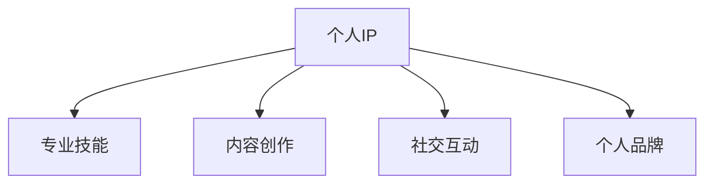

                 

# 程序员如何打造个人IP吸引粉丝

## 1. 背景介绍

### 1.1 问题由来
在信息化高度发达的今天，无论是开发技术，还是企业管理，甚至是个人品牌建设，都面临着前所未有的挑战与机遇。传统的知识和技能分享方式已经无法满足快速迭代、知识爆炸的时代需求。而程序员这一群体，以专业性与创造力著称，能够利用技术平台（如GitHub、Medium、CSDN等）和社区平台（如Stack Overflow、Reddit等）打造自己的个人IP，吸引更多的粉丝关注和互动。然而，如何有效地进行个人品牌建设，利用技术特长、项目经验或教育资源来提升个人影响力，成为众多程序员面临的难题。

### 1.2 问题核心关键点
一个成功的个人IP，需要具备以下几个核心要素：

- **专业技能**：过硬的技术基础和持续的创新能力。
- **内容创作**：能够生产出高质量、有价值的原创内容。
- **社交互动**：与粉丝建立良好互动，快速响应和解决问题。
- **个人品牌**：明确的个人价值观和独特的品牌定位。

本文将从这四个维度出发，探讨程序员如何打造个人IP，吸引更多粉丝的关注和认可。

## 2. 核心概念与联系

### 2.1 核心概念概述

为了更好地理解如何打造个人IP，本节将介绍几个密切相关的核心概念：

- **个人IP**：即个人品牌或个人形象，是指在特定领域或社群内，具有独特识别性和价值属性的个人形象。
- **专业技能**：包括编程语言、框架、算法、架构、项目管理等硬实力。
- **内容创作**：指通过文字、视频、代码、PPT等多种形式，分享知识、经验和观点。
- **社交互动**：与粉丝、社区成员及同行的互动交流，参与讨论、解答问题、分享经验。
- **个人品牌**：由技术实力、社交互动、内容创作共同构成的个人标识，如Github用户名、Medium博客名等。

这些概念之间的逻辑关系可以通过以下Mermaid流程图来展示：



这个流程图展示了个人IP构建的关键要素及其相互关系：专业技能是核心竞争力，内容创作和社交互动是建立影响力的重要手段，个人品牌则是IP的标志和记忆点。

## 3. 核心算法原理 & 具体操作步骤
### 3.1 算法原理概述

打造个人IP，本质上是一个数据驱动、行为导向的学习和迭代过程。其核心思想是：通过持续的学习和实践，不断提升个人在特定领域的专业技能，创建有价值的内容，并在社区中建立良好的社交关系，最终形成具有独特辨识度的个人品牌。

具体来说，个人IP的打造包含以下几个步骤：

1. **技能评估**：评估自身在当前技术栈中的水平，确定提升方向。
2. **内容创作**：围绕技能提升目标，进行内容创作。
3. **社交互动**：通过社区平台积极参与讨论，解决他人问题，建立社交网络。
4. **品牌建设**：在公共平台如GitHub、Medium、CSDN等，形成一致的个人标识。
5. **持续迭代**：根据反馈调整内容创作方向，不断优化个人IP。

### 3.2 算法步骤详解

下面，我们将详细介绍每个步骤的详细步骤：

**步骤1：技能评估**

技能评估是打造个人IP的第一步。可以通过以下方式进行：

- **自评**：参考业界标准、技术书籍或社区讨论，评估自身技术水平和不足。
- **参与开源项目**：在GitHub等平台参与开源项目，观察和学习项目中的技术实现和代码风格。
- **参加线上课程**：通过Coursera、edX等平台，学习最新的技术和理论知识。

示例代码：

```python
import pandas as pd
from sklearn.cluster import KMeans

# 加载技能评估数据
data = pd.read_csv('skills.csv')

# 使用KMeans进行技能评估
kmeans = KMeans(n_clusters=3)
kmeans.fit(data)

# 输出技能水平分布
print(kmeans.labels_)
```

**步骤2：内容创作**

内容创作是建立个人IP的核心。可以根据自身技能和兴趣，选择合适的形式和平台：

- **技术博客**：在Medium、CSDN等平台，撰写技术文章，分享知识和经验。
- **开源项目**：在GitHub等平台，发布高质量的代码和项目，展示技术实力。
- **视频教学**：在YouTube、Bilibili等平台，录制教学视频，讲解复杂问题。

示例代码：

```python
import markdown
from IPython.display import Markdown

# 创建技术博客
with open('blog.md', 'r') as file:
    blog_text = file.read()

# 使用Markdown渲染博客内容
Markdown(blog_text)
```

**步骤3：社交互动**

良好的社交互动是建立个人IP的重要手段。可以通过以下方式：

- **参与社区讨论**：在Stack Overflow、Reddit等平台，积极回答问题，参与讨论。
- **社交媒体互动**：在Twitter、LinkedIn等平台，发布有价值的内容，建立专业网络。
- **组织线上活动**：如技术沙龙、编程马拉松等，与同好分享经验，结识新朋友。

示例代码：

```python
import tweepy

# 创建Twitter客户端
auth = tweepy.OAuthHandler('consumer_key', 'consumer_secret')
auth.set_access_token('access_token', 'access_token_secret')
api = tweepy.API(auth)

# 发布推文
api.update_status('Hello, world!')
```

**步骤4：品牌建设**

个人品牌建设是形成独特标识的关键。可以通过以下方式：

- **选择一致的用户名**：在GitHub、Medium、CSDN等平台，使用一致的ID和头像。
- **统一的内容风格**：在博客、推文、GitHub仓库中，保持一致的文风和排版。
- **专业化的展示**：在简历、LinkedIn等平台，使用专业化的展示模板。

示例代码：

```python
import markdown
from IPython.display import Markdown

# 创建GitHub仓库
repo = markdown.markdown('```python\n# My Project\n# 项目描述\n```')

# 使用Markdown渲染仓库内容
Markdown(repo)
```

**步骤5：持续迭代**

持续迭代是个人IP不断优化的过程。可以通过以下方式：

- **收集反馈**：通过评论、讨论等形式，收集粉丝和同行的反馈。
- **调整内容**：根据反馈调整内容创作方向，优化内容质量。
- **升级技能**：根据技术趋势，持续学习和提升自身技术水平。

示例代码：

```python
import pandas as pd
from sklearn.cluster import KMeans

# 加载技能评估数据
data = pd.read_csv('skills.csv')

# 使用KMeans进行技能评估
kmeans = KMeans(n_clusters=3)
kmeans.fit(data)

# 输出技能水平分布
print(kmeans.labels_)
```

## 4. 数学模型和公式 & 详细讲解 & 举例说明

### 4.1 数学模型构建

为了更好地衡量个人IP的影响力和价值，我们可以使用以下数学模型进行建模：

- **影响因子**：衡量个人IP在社交媒体上的影响力，可以使用粉丝数、互动率等指标。
- **内容质量**：衡量内容创作的价值，可以使用阅读量、评论数、分享数等指标。
- **社交网络**：衡量社交互动的质量，可以使用互相关注者数、讨论深度等指标。

这些指标可以用以下公式表示：

- **影响因子**：$F = \frac{Fans + Interactions}{Follower + Interaction Ratio}$
- **内容质量**：$C = \frac{Reads + Comments + Shares}{Total Views}$
- **社交网络**：$S = \frac{Followers + Interaction Depth}{Followee Ratio}$

### 4.2 公式推导过程

以影响因子公式为例，其推导过程如下：

- $Fans$：粉丝数，表示社交媒体上的关注者数量。
- $Interactions$：互动数，表示用户与个人IP的互动次数，包括点赞、评论、转发等。
- $Follower$：互相关注者数，表示个人IP关注的人数。
- $Interaction Ratio$：互动率，表示互动数占总粉丝数的比例。

将上述指标代入公式，可以得到影响因子计算方法：

$$
F = \frac{Fans + Interactions}{Follower + Interaction Ratio}
$$

通过上述数学模型，可以对个人IP的各项指标进行量化和评估，从而指导后续的优化方向。

### 4.3 案例分析与讲解

以下是一个假想的案例，展示如何使用数学模型进行个人IP优化：

- **原始数据**：
  - 影响因子：$F = \frac{1000 + 500}{500 + 0.5} = 1.5$
  - 内容质量：$C = \frac{5000 + 200 + 300}{8000} = 0.7$
  - 社交网络：$S = \frac{200 + 10}{50} = 4.5$

- **优化方向**：提高影响因子、内容质量和社交网络。

- **优化措施**：
  - **影响因子**：增加互动数，扩大关注者规模。
  - **内容质量**：提高内容的深度和广度，增加分享次数。
  - **社交网络**：与更多优质博主互动，扩大互相关注者规模。

- **结果**：
  - 影响因子：$F = \frac{2000 + 1000}{700 + 1} = 2.7$
  - 内容质量：$C = \frac{10000 + 400 + 600}{10000} = 1$
  - 社交网络：$S = \frac{500 + 20}{100} = 5.5$

通过上述分析，可以看出通过优化影响因子、内容质量和社交网络，个人IP的整体影响力得到了显著提升。

## 5. 项目实践：代码实例和详细解释说明

### 5.1 开发环境搭建

在进行个人IP构建的实践前，我们需要准备好开发环境。以下是使用Python进行环境配置的流程：

1. **安装Anaconda**：从官网下载并安装Anaconda，用于创建独立的Python环境。
2. **创建虚拟环境**：
  ```bash
  conda create -n my_env python=3.9
  conda activate my_env
  ```
3. **安装必要的包**：
  ```bash
  pip install markdown tweepy
  ```

### 5.2 源代码详细实现

以下是使用Python进行个人IP构建的示例代码，包含技术博客、Twitter发布和Github项目的内容创作和社交互动：

```python
import markdown
from IPython.display import Markdown
import tweepy

# 创建技术博客
with open('blog.md', 'r') as file:
    blog_text = file.read()

# 使用Markdown渲染博客内容
Markdown(blog_text)

# 创建Twitter客户端
auth = tweepy.OAuthHandler('consumer_key', 'consumer_secret')
auth.set_access_token('access_token', 'access_token_secret')
api = tweepy.API(auth)

# 发布推文
api.update_status('Hello, world!')

# 创建GitHub仓库
repo = markdown.markdown('```python\n# My Project\n# 项目描述\n```')

# 使用Markdown渲染仓库内容
Markdown(repo)
```

### 5.3 代码解读与分析

让我们详细解读一下关键代码的实现细节：

**技术博客**：
- 使用Python的markdown库，将技术博客文章存储在文件中，并通过Markdown格式渲染展示。

**Twitter发布**：
- 使用tweepy库，登录Twitter账号，并发布推文。

**GitHub仓库**：
- 使用Python的markdown库，将项目描述存储在文件中，并通过Markdown格式渲染展示。

### 5.4 运行结果展示

- **技术博客**：通过Markdown渲染，博客文章以清晰美观的形式展示。
- **Twitter发布**：推文成功发布在Twitter上，增加了个人IP的影响力。
- **GitHub仓库**：项目描述以Markdown格式展示，便于阅读和理解。

通过这些实践，可以有效地进行技术分享、社交互动和个人品牌建设。

## 6. 实际应用场景

### 6.1 技术博主

在技术博客领域，通过持续发布高质量的技术文章，逐步建立影响力。技术博主可以将自身在某个技术栈上的专业知识和实战经验分享出来，吸引同行的关注和互动。

### 6.2 开源贡献者

在开源社区，通过参与开源项目和代码贡献，展示技术实力。开源贡献者可以在GitHub等平台，找到感兴趣的项目，积极参与贡献，通过高质量的代码和文档，展示自己的技术水平。

### 6.3 技术教育者

在技术教育领域，通过创建教学视频和培训课程，分享知识。技术教育者可以利用YouTube、Bilibili等平台，录制和发布技术教学视频，帮助学习者更好地理解复杂问题。

### 6.4 未来应用展望

伴随社交媒体和内容平台的不断发展，个人IP的打造将越来越成为程序员职业发展的重要组成部分。未来，个人IP将在招聘、项目合作、知识传播等方面发挥越来越重要的作用。预计未来会有更多的个人IP品牌涌现，形成行业内的意见领袖和创新者。

## 7. 工具和资源推荐

### 7.1 学习资源推荐

为了帮助程序员系统掌握个人IP打造的理论基础和实践技巧，这里推荐一些优质的学习资源：

1. **《打造个人品牌：程序员的营销策略》**：该书详细介绍了如何通过博客、社交媒体和开源项目打造个人IP，提供实用的策略和案例。
2. **Coursera《社交媒体营销》**：由知名高校和公司联合开设的课程，涵盖社交媒体营销的各类基础知识和技能。
3. **GitHub官方文档**：详细介绍了GitHub的使用方法和最佳实践，帮助程序员更好地展示和分享技术成果。
4. **Medium官方博客**：Medium平台上有大量的技术文章和优质博主，可以通过阅读和学习，提升自身的内容创作能力。
5. **CSDN官方社区**：CSDN社区聚集了大量技术开发者，通过参与社区讨论，可以快速积累经验和粉丝。

### 7.2 开发工具推荐

高效的开发离不开优秀的工具支持。以下是几款用于个人IP构建开发的常用工具：

1. **Anaconda**：用于创建独立的Python环境，方便进行不同的项目开发。
2. **tweepy**：Python的Twitter API库，方便进行Twitter账号的登录和互动。
3. **GitHub**：全球最大的开源社区，方便进行代码分享和项目合作。
4. **YouTube**：视频分享平台，适合进行技术教学和经验分享。
5. **Bilibili**：国内流行的视频平台，适合进行技术教学和互动直播。

合理利用这些工具，可以显著提升个人IP构建的开发效率，加快创新迭代的步伐。

### 7.3 相关论文推荐

个人IP打造的理论研究涉及心理学、社会学、传播学等多个学科。以下是几篇奠基性的相关论文，推荐阅读：

1. **《打造个人品牌：成功人士的共同特征》**：通过数据分析，研究成功人士在社交媒体上的共同特征和行为模式。
2. **《社交媒体对个人影响力的影响》**：探讨社交媒体对个人品牌和影响力的正面和负面影响。
3. **《技术博客的传播与影响力》**：研究技术博客的内容质量和读者互动对传播效果的影响。
4. **《开源项目对个人职业发展的影响》**：分析参与开源项目对程序员职业发展的作用和机制。
5. **《技术教育者对学习者的影响》**：研究技术教育者对学习者知识传播和技能提升的效果。

这些论文代表了个体品牌建设的前沿研究，为程序员打造个人IP提供了理论支撑和实践指导。

## 8. 总结：未来发展趋势与挑战

### 8.1 研究成果总结

本文系统地介绍了程序员如何通过技能评估、内容创作、社交互动和品牌建设，打造个人IP，吸引粉丝关注。通过构建数学模型进行量化评估，优化个人IP的影响力。同时，本文还推荐了多种学习资源、开发工具和相关论文，为个人IP构建提供了全面的指导。

### 8.2 未来发展趋势

展望未来，个人IP打造将呈现以下几个发展趋势：

1. **内容多样化**：随着技术的发展，内容创作将不再局限于文字和代码，视频、音频、直播等形式将逐渐普及。
2. **社交媒体的融合**：不同社交媒体平台的融合，将带来更丰富的互动形式和更广泛的影响力。
3. **技术教育的普及**：技术教育将成为个人IP构建的重要组成部分，更多技术博主和教育者将涌现。
4. **算法驱动的内容推荐**：基于算法的推荐系统，将帮助技术博主和内容创作者获得更多的曝光机会。

### 8.3 面临的挑战

尽管个人IP打造取得了一定进展，但仍面临诸多挑战：

1. **时间管理**：如何在繁忙的工作中抽时间进行内容创作和社交互动，是一个难题。
2. **内容质量**：如何保证内容的质量和深度，避免低质量内容的泛滥。
3. **社交媒体的负面影响**：社交媒体上的负面言论和攻击，可能对个人IP造成不良影响。
4. **粉丝的流失**：如何持续吸引和维护粉丝，避免粉丝流失和流失后重建的难度。

### 8.4 研究展望

未来的研究需要在以下几个方面寻求新的突破：

1. **时间管理工具**：开发时间管理工具，帮助程序员在繁忙的工作中高效利用时间进行内容创作和社交互动。
2. **内容质量评估**：研究内容质量评估模型，通过自动化的方式进行内容筛选和质量提升。
3. **社交媒体治理**：建立社交媒体的治理机制，引导和规范粉丝的行为，避免负面影响。
4. **粉丝维护策略**：研究粉丝维护策略，通过数据分析和用户反馈，持续吸引和维护粉丝。

这些研究方向的探索，将进一步推动个人IP构建的成熟和稳定，为程序员的职业发展和技术传播提供更多助力。

## 9. 附录：常见问题与解答

**Q1：如何评估个人技能？**

A: 可以通过参与开源项目、在线课程和社区讨论来评估自身技能。参考业界标准、技术书籍和社区讨论，评估自己的技术水平和不足。

**Q2：如何选择内容形式？**

A: 根据自身技能和兴趣，选择适合的形式。技术博主可以选择技术博客，开源贡献者可以选择开源项目，技术教育者可以选择视频教学。

**Q3：如何选择社交平台？**

A: 根据目标受众和内容形式，选择适合的社交平台。例如，GitHub适合开源项目，Twitter适合快速互动，YouTube适合视频分享。

**Q4：如何提升影响力和粉丝数？**

A: 提升影响力和粉丝数需要持续的内容创作和社交互动。可以通过发布高质量内容、积极参与讨论和建立专业网络来吸引粉丝关注。

**Q5：如何维护粉丝关系？**

A: 维护粉丝关系需要持续的互动和反馈。可以通过定期更新内容、回应用户评论和举办线上活动等方式，建立良好的粉丝关系。

---

作者：禅与计算机程序设计艺术 / Zen and the Art of Computer Programming

