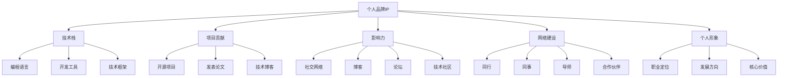

                 

## 1. 背景介绍

在当前高度竞争和快速迭代的科技行业，个人品牌IP（Intellectual Property）的建设对于程序员来说，已不仅仅是一种职业发展的手段，更是彰显个人专业价值、提升行业地位的重要途径。尤其在数字化和云原生时代，个人品牌成为软件工程师区别于其他职位，进而快速崛起、快速成长的独特方式。

### 1.1 问题由来

技术日新月异，行业动向瞬息万变，如何让自己在众多同行中脱颖而出？个人品牌IP的构建，实质上是一种长期、系统的策略，需要程序员具备高瞻远瞩的视角和执行力。通过个人品牌IP的打造，不仅能提升自我，还能在职业发展中获得更多机会和更大空间。

### 1.2 问题核心关键点

个人品牌IP的建设，涵盖多方面内容，包括但不限于：

- **专业技能**：核心专业技术的深度和广度，是个人品牌的基础。
- **项目贡献**：参与开源项目、技术博客、演讲、课程等，对行业做出实际贡献。
- **影响力和网络**：构建社群、影响社区、连接同行、赢得更多关注和机会。
- **个人IP识别**：定位清晰、个性鲜明、品牌形象鲜明，易于记忆、传播和建立信任。

构建个人品牌IP的过程，实际上是对个人职业规划、知识结构、社交网络、公共形象等多方面的整合和提升。本文将从个人品牌IP的核心概念出发，详细探讨其构建方法和实践路径。

## 2. 核心概念与联系

### 2.1 核心概念概述

以下是对个人品牌IP建设核心概念的全面梳理：

- **个人品牌IP**：个人在专业领域的标识和影响力。它涵盖了个人在技术栈、项目贡献、社交网络等方面的综合体现。
- **技术栈**：程序员在编程语言、开发工具、技术框架等技术方面的专长。
- **项目贡献**：参与开源项目、发表论文、撰写技术博客等形式，对行业技术进步的实际贡献。
- **影响力**：通过社交网络、博客、论坛、技术社区等渠道，扩大自身影响力和知名度。
- **网络建设**：建立并维护广泛的人脉网络，包括同行、同事、导师、合作伙伴等。
- **个人形象**：明确个人职业定位、发展方向和核心价值，树立独特、鲜明、易于识别的个人形象。

这些概念间的关系可以通过以下Mermaid流程图来展示：



## 3. 核心算法原理 & 具体操作步骤

### 3.1 算法原理概述

个人品牌IP的建设是一个系统工程，涉及技术、市场、社交等多方面因素。其核心算法原理是利用数据挖掘、网络分析、机器学习等技术手段，从个人职业经历、项目成就、社交网络等数据中挖掘出关键因素，并加以优化和提升，形成具有独特竞争力的个人品牌形象。

### 3.2 算法步骤详解

个人品牌IP的建设，主要包括以下几个步骤：

**Step 1: 自我评估**
- **技能盘点**：列出自己掌握的编程语言、开发工具、技术框架等技术栈。
- **项目经历**：记录参与的开源项目、技术博客、演讲、课程等项目贡献。
- **社交网络**：统计在LinkedIn、GitHub、Stack Overflow等平台的关注度和粉丝数。
- **个人形象**：分析个人技术博客、GitHub仓库、简历等资料，确定职业定位、发展方向和核心价值。

**Step 2: 定位和目标设定**
- **核心竞争力**：确定自己在技术栈中最有优势的几个领域，并将其作为个人品牌的核心竞争力。
- **目标受众**：明确希望影响的主要受众群体，如同行、技术社区、潜在雇主等。
- **建设路线**：制定详细的个人品牌IP建设路线图，包含时间节点、具体任务和预期效果。

**Step 3: 持续学习和提升**
- **技术学习**：不断学习新知识、新技术，保持技术栈的前沿性和领先性。
- **项目贡献**：积极参与开源项目、社区贡献，发表高质量技术文章和博客。
- **社交互动**：通过社交媒体、技术社区、线下活动等渠道，保持与同行和粉丝的互动。

**Step 4: 品牌推广和优化**
- **网络优化**：优化个人社交网络，提升LinkedIn、GitHub等平台的关注度和互动度。
- **博客运营**：维护并优化个人技术博客，定期发布高质量的技术文章和博客。
- **个人形象**：通过技术博客、GitHub仓库、个人网站等渠道，传递清晰、一致的个人形象。

### 3.3 算法优缺点

个人品牌IP建设的优势在于：
- **自我提升**：通过持续学习和项目贡献，提升自身技术水平和职业能力。
- **影响力扩大**：通过社交网络、博客等渠道，扩大个人在行业中的影响力。
- **机会获得**：品牌IP的建设能够帮助获取更多工作机会、合作伙伴、投资等。

但其缺点也显而易见：
- **投入时间**：品牌IP建设需要大量时间和精力投入，可能影响日常工作和生活。
- **策略风险**：品牌策略不当可能适得其反，影响个人形象和声誉。
- **技术限制**：对技术学习、项目贡献的持续性要求较高，需要保持高度的自我驱动力。

### 3.4 算法应用领域

个人品牌IP的建设在各个职业发展阶段都能发挥作用：

- **职业初入期**：通过技术学习、项目贡献建立初步影响力，为未来发展打下基础。
- **职业发展期**：通过品牌推广和优化，提升职业竞争力，拓宽职业机会。
- **职业成熟期**：通过个人形象的塑造和品牌影响力的持续提升，进入行业领导层。

## 4. 数学模型和公式 & 详细讲解

### 4.1 数学模型构建

个人品牌IP建设涉及的模型包括：

- **技术栈矩阵模型**：列出所有技术栈，评估每个技术的掌握程度。
- **影响力评估模型**：统计社交网络、博客、论坛等平台的影响力指标。
- **学习成长模型**：评估个人技术成长速度和学习效率。

**技术栈矩阵模型**：

$$
\begin{align}
\text{技术栈矩阵} &= \begin{bmatrix}
\text{技能} & \text{熟练度} \\
\text{语言A} & \text{熟练度A} \\
\text{语言B} & \text{熟练度B} \\
\text{框架C} & \text{熟练度C} \\
\end{bmatrix}
\end{align}
$$

**影响力评估模型**：

$$
\begin{align}
\text{影响力} &= \text{社交网络影响力} + \text{博客影响力} + \text{论坛影响力} \\
&= (\text{LinkedIn关注度} + \text{GitHub粉丝数} + \text{Stack Overflow投票数}) \\
&+ (\text{博客访问量} + \text{博客评论数} + \text{技术文章阅读量}) \\
&+ (\text{论坛活跃度} + \text{技术帖子回复数} + \text{技术帖子点赞数})
\end{align}
$$

### 4.2 公式推导过程

**技术栈矩阵推导**：

1. **技术栈评估**：采用0到10分制评估每个技能的掌握程度，总分100分。
2. **权重设定**：根据市场趋势和自身兴趣，设定各个技能的重要性权重。
3. **综合评分**：按权重计算综合评分，评估技术栈的全面性和专业度。

**影响力评估推导**：

1. **平台评分**：根据各平台的功能特点，设定不同的影响力评分标准。
2. **数据统计**：统计每个平台上的指标数据，包括关注度、互动度、影响力等。
3. **加权求和**：按权重计算各平台评分之和，得到总影响力。

### 4.3 案例分析与讲解

以一名开源贡献者为例：

- **技术栈矩阵**：
  $$
  \begin{align}
  \text{技术栈矩阵} &= \begin{bmatrix}
  \text{技能} & \text{熟练度} \\
  \text{Python} & 9 \\
  \text{Java} & 7 \\
  \text{React} & 8 \\
  \end{bmatrix} \\
  \text{综合评分} &= 9 \times 0.4 + 7 \times 0.3 + 8 \times 0.3 = 7.8
  \end{align}
  $$

- **影响力评估**：
  $$
  \begin{align}
  \text{社交网络影响力} &= 1000 + 500 + 200 = 1700 \\
  \text{博客影响力} &= 5000 + 1000 + 2000 = 8000 \\
  \text{论坛影响力} &= 100 + 200 + 300 = 600
  \end{align}
  $$

## 5. 项目实践：代码实例和详细解释说明

### 5.1 开发环境搭建

**环境搭建**：

1. **开发语言**：选择Python作为开发语言，因其丰富的库和广泛的使用。
2. **开发框架**：选择Flask或Django作为Web框架，用于搭建技术博客和GitHub仓库。
3. **数据库**：选择MySQL或PostgreSQL作为存储技术栈、项目贡献、社交网络等数据的后台数据库。
4. **云服务**：选择AWS、GCP或阿里云等云服务，部署Web应用和数据库。

### 5.2 源代码详细实现

**技术栈记录**：

```python
from flask import Flask, render_template, request
from flask_sqlalchemy import SQLAlchemy
from datetime import datetime

app = Flask(__name__)
app.config['SQLALCHEMY_DATABASE_URI'] = 'sqlite:///./tech_stack.db'
db = SQLAlchemy(app)

class TechStack(db.Model):
    id = db.Column(db.Integer, primary_key=True)
    name = db.Column(db.String(64), unique=True, nullable=False)
    skill = db.Column(db.Integer, nullable=False)

@app.route('/techstack', methods=['GET', 'POST'])
def techstack():
    if request.method == 'POST':
        name = request.form['name']
        skill = request.form['skill']
        tech_stack = TechStack(name=name, skill=skill)
        db.session.add(tech_stack)
        db.session.commit()
    tech_stacks = TechStack.query.all()
    return render_template('techstack.html', tech_stacks=tech_stacks)

if __name__ == "__main__":
    db.create_all()
    app.run(debug=True)
```

**项目贡献记录**：

```python
class ProjectContribution(db.Model):
    id = db.Column(db.Integer, primary_key=True)
    name = db.Column(db.String(64), unique=True, nullable=False)
    platform = db.Column(db.String(64), nullable=False)
    rating = db.Column(db.Integer, nullable=False)
    comment = db.Column(db.String(512), nullable=True)

@app.route('/contribution', methods=['GET', 'POST'])
def contribution():
    if request.method == 'POST':
        name = request.form['name']
        platform = request.form['platform']
        rating = request.form['rating']
        comment = request.form['comment']
        contribution = ProjectContribution(name=name, platform=platform, rating=rating, comment=comment)
        db.session.add(contribution)
        db.session.commit()
    contributions = ProjectContribution.query.all()
    return render_template('contribution.html', contributions=contributions)
```

**社交网络记录**：

```python
class SocialNetwork(db.Model):
    id = db.Column(db.Integer, primary_key=True)
    platform = db.Column(db.String(64), unique=True, nullable=False)
    followers = db.Column(db.Integer, nullable=False)
    interactions = db.Column(db.Integer, nullable=False)

@app.route('/social', methods=['GET', 'POST'])
def social():
    if request.method == 'POST':
        platform = request.form['platform']
        followers = request.form['followers']
        interactions = request.form['interactions']
        social = SocialNetwork(platform=platform, followers=followers, interactions=interactions)
        db.session.add(social)
        db.session.commit()
    social_networks = SocialNetwork.query.all()
    return render_template('social.html', social_networks=social_networks)
```

### 5.3 代码解读与分析

**代码解读**：

1. **Flask框架**：使用Flask作为Web框架，搭建前后端。
2. **SQLAlchemy**：使用SQLAlchemy作为ORM框架，方便与数据库进行交互。
3. **模型设计**：设计技术栈、项目贡献、社交网络三个模型，用于记录相关信息。
4. **视图处理**：实现技术栈记录、项目贡献记录、社交网络记录等视图，用于前端数据展示。

**分析说明**：

- **技术栈记录视图**：前端展示技术栈数据，提供技术栈添加功能。
- **项目贡献记录视图**：前端展示项目贡献数据，提供贡献记录功能。
- **社交网络记录视图**：前端展示社交网络数据，提供社交网络记录功能。

## 6. 实际应用场景

### 6.1 开发者社区

**应用场景**：开发者社区中的个人品牌建设，包括GitHub、Stack Overflow、Medium等平台。

**实际应用**：
- **技术栈展示**：在GitHub个人仓库中，通过README文件展示技术栈。
- **项目贡献记录**：在GitHub开源项目中，记录个人贡献数据。
- **社交网络互动**：在Stack Overflow、Medium等社区中，积极参与讨论和评论，建立个人影响力。

### 6.2 企业内部

**应用场景**：企业内部技术分享、知识库搭建、技术传承等。

**实际应用**：
- **技术栈分享**：通过企业内部平台分享个人技术栈，提升团队技术水平。
- **项目贡献记录**：记录个人在企业项目中的贡献，评估个人价值。
- **社交网络互动**：通过企业内部社交工具，建立个人品牌，提升内部影响力。

### 6.3 技术博客和媒体

**应用场景**：个人技术博客、技术媒体文章撰写。

**实际应用**：
- **技术文章发布**：在个人技术博客或Medium等技术媒体平台，发布高质量技术文章。
- **社区互动**：通过评论、点赞等方式，提升文章影响力。
- **社交媒体曝光**：通过LinkedIn、Twitter等平台，分享技术文章，扩大影响力。

### 6.4 未来应用展望

**未来趋势**：
- **多平台协同**：跨平台品牌IP建设，通过多渠道互动，提升综合影响力。
- **内容创新**：通过视频、播客等新媒体形式，丰富个人品牌内容。
- **技术前沿**：在AI、区块链、云原生等前沿技术领域，打造技术品牌。
- **国际交流**：通过开源项目、国际会议等方式，扩大国际影响力。

## 7. 工具和资源推荐

### 7.1 学习资源推荐

**资源推荐**：

1. **在线课程**：Coursera、Udemy、edX等平台，提供系统性的编程和项目管理课程。
2. **技术博客**：Medium、CSDN、GitHub技术文章等，阅读高质量技术文章，提升技术水平。
3. **技术社区**：Stack Overflow、GitHub、Reddit等平台，参与技术讨论，获取问题解答。
4. **开源项目**：GitHub、GitLab等平台，参与开源项目，贡献代码和文档。
5. **读书学习**：O'Reilly、 Manning等出版社，阅读经典技术书籍，扩展技术视野。

### 7.2 开发工具推荐

**工具推荐**：

1. **编程语言**：Python、Java、JavaScript等主流编程语言。
2. **Web框架**：Flask、Django、React等框架，用于开发技术博客和应用。
3. **数据库**：MySQL、PostgreSQL、MongoDB等，存储个人品牌相关数据。
4. **云服务**：AWS、GCP、阿里云等，提供开发环境、数据库托管服务。
5. **版本控制**：Git、SVN等，管理个人代码和项目贡献。

### 7.3 相关论文推荐

**论文推荐**：

1. **技术栈管理**："Software Engineering Analysis and Planning" by I.T. Jensen。
2. **项目管理**："The Agile Manifesto" by Ken Schwaber。
3. **社交网络分析**："Social Network Analysis" by Mark Newman。
4. **开源贡献**："Community in Software Development: The Case for Open Source" by Torin Klein。

## 8. 总结：未来发展趋势与挑战

### 8.1 研究成果总结

本文系统介绍了个人品牌IP建设的各个方面，包括技术栈、项目贡献、社交网络、个人形象等核心概念，并通过具体案例、代码实现和模型推导，展示了其在开发和应用中的具体操作流程。

### 8.2 未来发展趋势

**趋势一**：跨平台品牌建设，多渠道互动，提升综合影响力。

**趋势二**：内容创新，通过视频、播客等新媒体形式，丰富品牌内容。

**趋势三**：技术前沿，在AI、区块链、云原生等前沿技术领域，打造技术品牌。

**趋势四**：国际交流，通过开源项目、国际会议等方式，扩大国际影响力。

### 8.3 面临的挑战

**挑战一**：时间投入，品牌建设需要大量时间和精力，可能影响日常工作和生活。

**挑战二**：策略风险，品牌策略不当可能适得其反，影响个人形象和声誉。

**挑战三**：技术限制，对技术学习、项目贡献的持续性要求较高，需要保持高度的自我驱动力。

### 8.4 研究展望

**展望一**：通过数据驱动，构建更精准的个人品牌评估模型。

**展望二**：引入智能算法，优化品牌建设路径，提升效率和效果。

**展望三**：结合人工智能技术，如自然语言处理、图像识别等，提升个人品牌展示和互动体验。

**展望四**：跨学科融合，结合心理学、社会学等学科知识，优化个人品牌IP的建设策略。

## 9. 附录：常见问题与解答

**Q1: 如何平衡品牌建设和日常工作？**

**A1:** 设定明确的时间规划，合理分配品牌建设时间。利用碎片化时间，如通勤、午休等，进行品牌内容创作和社交互动。

**Q2: 如何提升品牌影响力？**

**A2:** 积极参与社区互动，持续发布高质量内容。建立稳定的内容发布节奏，保持粉丝关注。

**Q3: 如何选择正确的技术栈展示方式？**

**A3:** 根据自身职业定位和目标受众，选择最合适的技术栈展示方式，如技术博客、GitHub仓库、LinkedIn档案等。

**Q4: 如何选择正确的项目贡献方式？**

**A4:** 选择与自身兴趣和技术栈匹配的开源项目，进行高质量的贡献。参与社区讨论，提升知名度和影响力。

**Q5: 如何选择正确的社交平台？**

**A5:** 根据目标受众和品牌建设策略，选择适合的社交平台。如LinkedIn适合职场发展，GitHub适合开源贡献，Twitter适合技术分享。

---

作者：禅与计算机程序设计艺术 / Zen and the Art of Computer Programming

