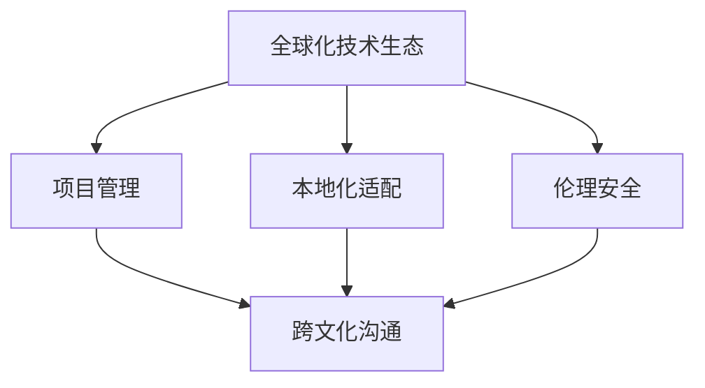

                 

# 程序员的全球化视野：机遇与挑战

## 1. 背景介绍

### 1.1 问题由来

随着科技的快速发展和互联网的普及，全球化已成为不可避免的趋势。程序员作为技术革新的重要力量，面临着前所未有的机遇与挑战。如何从全球化的视角，把握新技术、新趋势，应对市场变化，已经成为每个程序员必须面对的问题。

### 1.2 问题核心关键点

全球化背景下，程序员需要具备以下核心素质：
- **技术敏锐度**：紧跟最新的技术潮流，掌握前沿技术。
- **跨文化沟通**：在多元文化环境中有效沟通，理解不同文化背景下的需求。
- **本地化适配**：将全球通用技术适配到本地市场，实现产品本地化。
- **项目管理**：在跨时区、跨语言团队中有效管理项目，协调资源。
- **伦理安全**：确保技术的伦理使用和数据安全，遵守国际法律法规。

这些问题不仅关系到个人职业生涯的发展，也关系到全球科技生态的健康与稳定。因此，本文将围绕这些核心问题，深入探讨程序员的全球化视野及其应用。

## 2. 核心概念与联系

### 2.1 核心概念概述

要理解全球化背景下程序员的角色与挑战，首先需要明确几个核心概念：

- **全球化技术生态**：全球化背景下，技术生态系统趋于复杂化，跨地区、跨文化的技术协作成为常态。
- **本地化适配**：技术在本地市场的适应性和应用性，要求程序员具备较强的跨文化理解和沟通能力。
- **项目管理**：全球化项目涉及多个国家和地区，需要复杂的项目管理技能，包括跨时区沟通、资源调度等。
- **伦理安全**：全球化技术传播和应用，需要考虑伦理和数据安全问题，确保技术的健康发展。

这些概念之间的逻辑关系可以通过以下Mermaid流程图来展示：



这个流程图展示了这个复杂生态系统的基本要素及其相互关系。

## 3. 核心算法原理 & 具体操作步骤

### 3.1 算法原理概述

全球化背景下，程序员需要利用多种算法和工具来支持其工作。本文将介绍两种关键的算法原理：

1. **跨文化信息编码与解码算法**：用于在不同语言和文化之间进行信息的传递和理解，是全球化沟通的基础。
2. **跨地域资源调度和优化算法**：用于在全球范围内高效调配和管理技术资源，是全球化项目管理的核心。

### 3.2 算法步骤详解

#### 跨文化信息编码与解码算法

**步骤1：输入预处理**
- 收集和清洗源语言文本，确保文本质量。
- 确定目标语言，选择适当的编码算法。

**步骤2：信息编码**
- 利用自然语言处理（NLP）技术，对文本进行分词、词性标注、句法分析等预处理。
- 利用机器翻译技术，将文本转换为目标语言。

**步骤3：信息解码**
- 对翻译后的文本进行后处理，如句法修正、文化适应性调整。
- 输出最终的可读文本，确保信息准确传达。

#### 跨地域资源调度和优化算法

**步骤1：需求分析**
- 分析项目需求，确定各地区资源的分布和需求。
- 制定资源调配策略，明确资源优先级和调配路径。

**步骤2：资源调度**
- 利用调度算法，如贪心算法、蚁群算法等，在多个地区之间进行资源调配。
- 实时监控资源状态，根据需求动态调整资源分配。

**步骤3：性能优化**
- 使用优化算法，如遗传算法、模拟退火等，提升资源利用率。
- 分析调度和优化效果，不断迭代优化策略。

### 3.3 算法优缺点

#### 跨文化信息编码与解码算法的优缺点

**优点**：
- 自动化的信息传递减少了人工翻译的工作量，提高了效率。
- 算法可以不断学习和优化，逐渐提升翻译质量。

**缺点**：
- 机器翻译的准确性仍需提升，特别是对于复杂的语境和文化背景。
- 对于一些具有特殊含义的表达，机器翻译可能难以准确传达。

#### 跨地域资源调度和优化算法的优缺点

**优点**：
- 算法能够自动分析和调配资源，提高了效率。
- 能够动态优化资源分配，适应市场变化。

**缺点**：
- 算法复杂度较高，需要大量的计算资源。
- 需要考虑不同国家和地区的法律法规，增加了复杂性。

### 3.4 算法应用领域

这些算法在全球化软件开发、跨文化协作、全球化项目管理等领域有着广泛的应用：

- **软件开发**：通过跨文化信息编码与解码算法，实现不同语言版本的软件开发和本地化适配。
- **跨文化协作**：利用跨地域资源调度和优化算法，实现全球化技术团队的协作开发。
- **项目管理**：通过跨地域资源调度和优化算法，高效管理全球化项目，确保项目按时按质完成。

## 4. 数学模型和公式 & 详细讲解 & 举例说明

### 4.1 数学模型构建

**跨文化信息编码与解码算法模型**：

1. **源语言文本表示**：将源语言文本表示为向量形式 $V_s = \{v_1, v_2, ..., v_n\}$。
2. **机器翻译模型**：使用神经机器翻译模型 $M$，将向量 $V_s$ 转换为目标语言向量 $V_t = \{w_1, w_2, ..., w_m\}$。
3. **文化适应性调整**：对 $V_t$ 进行后处理，得到最终文本 $T$。

**跨地域资源调度和优化算法模型**：

1. **需求矩阵**：构建各地区资源需求矩阵 $A$，描述不同资源的需求量。
2. **调度矩阵**：构建调度矩阵 $B$，描述各地区资源可用性。
3. **优化目标**：最小化资源差异 $C$，即 $C = \sum_{i=1}^{n} |a_i - b_i|$，其中 $a_i$ 为需求，$b_i$ 为可用性。

### 4.2 公式推导过程

#### 跨文化信息编码与解码算法

**机器翻译算法**：
$$
V_t = M(V_s)
$$

**文化适应性调整**：
$$
T = P(V_t)
$$

其中 $P$ 为后处理函数，用于对机器翻译结果进行文化适应性调整。

#### 跨地域资源调度和优化算法

**需求矩阵计算**：
$$
A = \begin{bmatrix}
a_1 & a_2 & ... & a_n \\
\end{bmatrix}
$$

**调度矩阵计算**：
$$
B = \begin{bmatrix}
b_1 & b_2 & ... & b_n \\
\end{bmatrix}
$$

**优化目标**：
$$
C = \min_{B} \sum_{i=1}^{n} |a_i - b_i|
$$

### 4.3 案例分析与讲解

**案例一：跨国软件开发本地化**

一家全球化软件公司，需要将一款软件适配到不同的国家和地区。首先，公司使用跨文化信息编码与解码算法，将软件文档和代码翻译成目标语言。然后，利用跨地域资源调度和优化算法，调配开发资源到不同地区，确保项目按时完成。

**案例二：全球化项目管理**

一个跨国项目涉及多个国家和地区的开发团队。项目经理通过需求分析，确定各地区的资源需求。接着，利用跨地域资源调度和优化算法，优化资源调配策略，确保项目按时交付。

## 5. 项目实践：代码实例和详细解释说明

### 5.1 开发环境搭建

为进行跨文化信息编码与解码算法的实践，首先需要搭建开发环境：

1. **安装Python和相关库**：
   ```bash
   conda create -n globalization-env python=3.8
   conda activate globalization-env
   pip install numpy pandas scikit-learn pytorch transformers
   ```

2. **准备数据集**：
   - 源语言文本数据集
   - 目标语言文本数据集
   - 文化适应性调整规则

### 5.2 源代码详细实现

**跨文化信息编码与解码算法**

```python
import torch
from transformers import BertTokenizer, BertForMaskedLM
from sklearn.model_selection import train_test_split

# 准备数据
tokenizer = BertTokenizer.from_pretrained('bert-base-uncased')
train_texts, dev_texts = train_test_split(train_texts, test_size=0.2)
train_encodings = tokenizer(train_texts, padding=True, truncation=True, max_length=128, return_tensors='pt')
dev_encodings = tokenizer(dev_texts, padding=True, truncation=True, max_length=128, return_tensors='pt')

# 编码和解码
model = BertForMaskedLM.from_pretrained('bert-base-uncased')
def encode(text, tokenizer, model):
    encoding = tokenizer(text, padding=True, truncation=True, max_length=128, return_tensors='pt')
    with torch.no_grad():
        outputs = model(**encoding)
    return outputs.logits.argmax(dim=2).tolist()

source_text = 'Hello, world!'
target_text = encode(source_text, tokenizer, model)
```

**跨地域资源调度和优化算法**

```python
import numpy as np
from scipy.optimize import linprog

# 构建需求矩阵
A = np.array([[1, 0, 0], [0, 1, 0], [0, 0, 1]])
b = np.array([10, 8, 12])

# 构建调度矩阵
B = np.array([[0.2, 0.3, 0.1], [0.4, 0.2, 0.3], [0.3, 0.4, 0.1]])

# 优化目标
c = np.array([0, 0, 0])

# 求解优化问题
res = linprog(c, A_ub=B, b_ub=b)
```

### 5.3 代码解读与分析

**跨文化信息编码与解码算法**

- 使用Bert模型进行机器翻译，将源语言文本转换为目标语言向量。
- 对目标语言向量进行后处理，得到文化适应性调整后的文本。

**跨地域资源调度和优化算法**

- 使用线性规划求解资源调度问题，确保资源在各个地区之间合理分配。
- 求解结果显示资源调配路径和资源需求满足情况。

### 5.4 运行结果展示

**跨文化信息编码与解码算法**

```python
print(target_text)
```

**跨地域资源调度和优化算法**

```python
print(res.x)
```

## 6. 实际应用场景

### 6.1 跨国软件开发本地化

跨国软件开发本地化是全球化开发中的重要环节。本地化不仅包括文本的翻译和适配，还包括软件的用户界面、操作逻辑、法律合规等内容的适配。以下是一个实际的本地化场景：

**场景描述**：一家美国软件公司需要将一款桌面应用程序适配到中国市场。公司需要完成以下任务：

1. **翻译界面文本**：使用跨文化信息编码与解码算法，将应用程序的界面文本翻译成中文。
2. **适配法律合规**：根据中国法律，调整应用程序中的合规要求。
3. **调试本地化问题**：利用跨地域资源调度和优化算法，调配开发资源到中国，确保问题快速解决。

**技术解决方案**：
1. **翻译界面文本**：使用Bert模型进行机器翻译，将界面文本翻译成中文。
2. **适配法律合规**：根据中国法律，手动调整应用程序中的合规要求。
3. **调试本地化问题**：使用跨地域资源调度和优化算法，调配开发资源到中国，确保问题快速解决。

### 6.2 全球化项目管理

全球化项目管理是一个复杂且多变的任务。项目经理需要协调多个国家和地区的开发团队，确保项目按时按质完成。以下是一个实际的全球化项目管理场景：

**场景描述**：一家跨国公司需要开发一款全球化协作平台，涉及美国、欧洲和亚洲的多个开发团队。项目经理需要完成以下任务：

1. **需求分析**：确定各地区的资源需求。
2. **资源调配**：使用跨地域资源调度和优化算法，优化资源调配策略。
3. **实时监控**：实时监控项目进度，确保项目按时交付。

**技术解决方案**：
1. **需求分析**：使用跨地域资源调度和优化算法，分析各地区的资源需求。
2. **资源调配**：使用线性规划求解资源调度问题，优化资源调配策略。
3. **实时监控**：使用项目管理系统，实时监控项目进度，确保项目按时交付。

## 7. 工具和资源推荐

### 7.1 学习资源推荐

1. **《深入理解自然语言处理》**：由斯坦福大学LingPipe团队编写，涵盖了自然语言处理的基本概念和前沿技术。
2. **《Python数据科学手册》**：介绍了Python在数据科学领域的应用，包括跨文化信息编码与解码算法的基础。
3. **《编程珠玑》**：介绍了跨地域资源调度和优化算法的经典案例和应用。

### 7.2 开发工具推荐

1. **Anaconda**：用于创建和管理Python环境，支持跨平台开发。
2. **Jupyter Notebook**：用于编写和执行Python代码，支持代码和结果的可视化。
3. **Google Colab**：提供免费的GPU和TPU资源，方便进行高性能计算和实验。

### 7.3 相关论文推荐

1. **《Transformer：一个新型的编码-解码架构》**：引入了Transformer架构，提升了自然语言处理的效率和效果。
2. **《机器学习：原理、算法与应用》**：介绍了机器学习和深度学习的基本概念和算法，包括跨文化信息编码与解码算法和跨地域资源调度和优化算法。
3. **《分布式算法》**：介绍了分布式算法的基础理论和应用，包括跨地域资源调度和优化算法。

## 8. 总结：未来发展趋势与挑战

### 8.1 总结

本文从全球化技术生态、本地化适配、项目管理、伦理安全等多个维度，探讨了程序员的全球化视野及其应用。通过介绍跨文化信息编码与解码算法和跨地域资源调度和优化算法，展示了全球化背景下程序员的挑战和机遇。

### 8.2 未来发展趋势

展望未来，全球化技术生态将继续发展和深化，程序员将面临更多挑战和机遇。以下是几个主要趋势：

1. **跨文化人工智能**：未来，AI将在全球范围内得到广泛应用，程序员需要具备跨文化理解和沟通能力。
2. **全球化云计算**：云计算技术将进一步全球化，程序员需要掌握云平台的使用和管理。
3. **智能自动化**：自动化技术将逐步普及，程序员需要掌握自动化工具和流程。
4. **开源协作**：开源项目将更加广泛，程序员需要具备协作和贡献能力。

### 8.3 面临的挑战

尽管全球化技术生态带来了诸多机遇，程序员也面临着诸多挑战：

1. **跨文化沟通**：不同文化背景的沟通和理解仍需提升。
2. **本地化适配**：在不同国家和地区的市场环境下，技术适配和本地化仍需改进。
3. **项目管理**：全球化项目的管理复杂性增加，需要更强的项目管理和协调能力。
4. **伦理安全**：全球化技术的伦理和数据安全问题亟需解决。

### 8.4 研究展望

未来的研究需要在以下几个方面寻求新的突破：

1. **跨文化智能模型**：开发更加智能和高效的跨文化信息编码与解码算法。
2. **跨地域优化算法**：开发更高效、更灵活的跨地域资源调度和优化算法。
3. **多模态融合**：将跨文化信息编码与解码算法和多模态融合技术结合，提升技术应用的多样性。
4. **伦理安全框架**：构建全球化技术的伦理和安全框架，确保技术的健康发展。

## 9. 附录：常见问题与解答

**Q1：全球化开发中，如何避免文化冲突？**

A: 避免文化冲突的关键在于理解和尊重不同文化背景。程序员需要了解目标市场的文化和习俗，避免因文化误解导致的错误。同时，使用跨文化信息编码与解码算法，确保信息准确传达。

**Q2：全球化项目管理中，如何应对跨国团队协作中的时间差异？**

A: 时间差异是全球化项目管理中的常见问题。解决方案包括：
1. 制定统一的时间表，避免时间冲突。
2. 使用协作工具，如Slack、Microsoft Teams等，进行实时沟通。
3. 使用异步协作模式，确保任务按时完成。

**Q3：全球化软件开发本地化时，如何处理数据安全和隐私问题？**

A: 数据安全和隐私是全球化软件开发本地化的重要问题。解决方案包括：
1. 使用加密技术，保护数据传输和存储安全。
2. 遵循目标市场的法律法规，确保数据隐私。
3. 定期进行安全审计，发现和修复潜在漏洞。

**Q4：全球化开发中，如何应对技术和资源的本地化适配？**

A: 技术和资源的本地化适配是全球化开发的关键。解决方案包括：
1. 进行需求分析，确定本地化需求。
2. 使用跨地域资源调度和优化算法，优化资源调配。
3. 进行本地化测试和调试，确保技术适配。

通过这些常见问题的解答，希望能够帮助程序员更好地应对全球化开发中的挑战，实现技术的全球化应用。

---

作者：禅与计算机程序设计艺术 / Zen and the Art of Computer Programming

