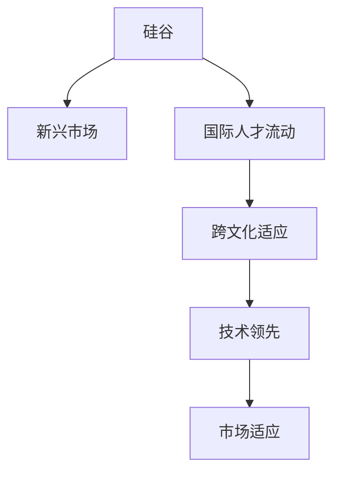

                 

# 程序员的国际化发展：硅谷与新兴市场的机遇

## 1. 背景介绍

### 1.1 问题由来
随着全球化进程的加速和互联网技术的普及，程序员的国际化发展已成为一个不容忽视的话题。传统的IT企业和科技创新中心，如硅谷，曾经是全球软件研发的中心，但在新兴市场的崛起和全球化技术的扩散下，程序员的工作机会和职业发展空间正变得越来越分散和多元。

### 1.2 问题核心关键点
程序员国际化发展的关键在于平衡好硅谷技术中心与新兴市场实际需求之间的关系，寻找适合个人职业发展的最佳路径。以下是几个核心关键点：
1. **技术趋势**：关注全球科技发展动向，紧跟最新的技术趋势。
2. **市场需求**：分析新兴市场对于技术人才的需求特点。
3. **工作环境**：了解不同地区的工作环境和文化差异。
4. **职业规划**：根据自身职业目标，制定合理的国际化发展策略。

### 1.3 问题研究意义
了解程序员如何在国际化的背景下面对新的机遇和挑战，对于个人职业发展具有重要意义。它不仅有助于程序员在全球范围内寻找更好的职业机会，还能帮助企业更有效地利用全球化的人才资源，提升全球竞争力。

## 2. 核心概念与联系

### 2.1 核心概念概述

在探讨程序员的国际化发展时，我们需要理解以下核心概念：

- **硅谷**：以旧金山为核心的美国科技中心，聚集了全球顶尖的IT企业和科技创新资源。
- **新兴市场**：如中国、印度、巴西等地，正在快速发展的经济体，对IT人才有着巨大的需求。
- **国际人才流动**：程序员在全球范围内的迁移和流动现象。
- **跨文化适应**：程序员在跨国工作时，适应不同文化背景和工作环境的能力。
- **技术领先**：掌握最新技术，并在全球范围内应用这些技术。
- **市场适应**：根据不同市场的需求，调整技术和产品策略。

这些概念之间相互关联，共同构成了程序员国际化发展的复杂图景。以下是一个简单的Mermaid流程图，展示这些概念的相互关系：



## 3. 核心算法原理 & 具体操作步骤
### 3.1 算法原理概述

程序员的国际化发展，本质上是一种跨文化、跨地域的资源配置和优化问题。其核心算法原理主要包括以下几个方面：

- **需求分析**：分析不同市场对技术人才的需求特点，识别技术缺口。
- **技能匹配**：根据市场需求，评估自身技能与岗位要求的匹配度。
- **成本效益分析**：考虑全球化背景下的薪资水平、生活成本、工作环境等因素，评估跨国工作的成本效益。
- **路径规划**：设计出最符合个人职业目标的国际化发展路径。

### 3.2 算法步骤详解

下面详细介绍基于核心算法原理的具体操作步骤：

**Step 1: 需求分析**
- **收集信息**：通过各种渠道（如招聘网站、技术社区、专业报告）收集新兴市场的技术人才需求数据。
- **分析趋势**：使用数据分析工具（如Python的Pandas、NumPy）处理数据，分析技术需求的趋势和变化。

**Step 2: 技能匹配**
- **技能评估**：使用能力评估工具（如GitHub贡献、技术认证）评估自身的技能水平。
- **岗位匹配**：将技能评估结果与目标岗位要求进行对比，确定匹配度。

**Step 3: 成本效益分析**
- **经济评估**：对比硅谷与新兴市场的薪资水平、生活成本、税收政策等，进行成本效益分析。
- **工作环境评估**：考虑工作环境、文化差异、家庭支持等因素，综合评价跨文化适应性。

**Step 4: 路径规划**
- **制定计划**：根据需求分析、技能匹配和成本效益分析的结果，制定个性化的国际化发展计划。
- **实施调整**：在执行过程中，根据实际情况和反馈，不断调整和优化发展路径。

### 3.3 算法优缺点

基于上述步骤的国际化发展算法，具有以下优点：
1. **系统性**：通过一系列系统化步骤，确保职业发展具有逻辑性和条理性。
2. **量化评估**：通过数据分析和评估工具，可以量化地评估不同方案的优劣。
3. **灵活性**：可以根据个人和市场情况的变化，灵活调整发展路径。

同时，该算法也存在以下缺点：
1. **复杂度**：步骤繁多，需要耗费较多时间和精力进行数据分析和评估。
2. **主观性**：部分步骤如跨文化适应和工作环境评估较为主观，存在一定的不确定性。
3. **动态性**：市场需求和技术趋势不断变化，需要持续更新和调整。

### 3.4 算法应用领域

程序员的国际化发展算法主要应用于以下几个领域：

- **招聘**：企业在全球范围内寻找适合的程序员，利用算法优化招聘流程。
- **培训**：程序员根据市场需求调整学习内容，提升技能以适应国际市场。
- **职业咨询**：个人职业顾问使用该算法为程序员提供咨询建议，帮助其制定国际化发展计划。

## 4. 数学模型和公式 & 详细讲解 & 举例说明

### 4.1 数学模型构建

基于程序员的国际化发展算法，我们可以构建一个数学模型，用于量化评估不同方案的优劣。模型主要包括以下几个变量：

- **薪资水平**：$S_i$，表示在市场i的薪资水平。
- **生活成本**：$C_i$，表示在市场i的生活成本。
- **工作环境评分**：$E_i$，表示市场i的工作环境评分（1-5分）。
- **跨文化适应评分**：$A_i$，表示市场i对跨文化适应性的评分（1-5分）。

目标是最小化跨国工作的成本函数 $F$，即：

$$ F = \alpha S_i - \beta C_i + \gamma E_i + \delta A_i $$

其中 $\alpha, \beta, \gamma, \delta$ 为调整系数，代表各变量对决策的影响权重。

### 4.2 公式推导过程

为了简化计算，我们引入一个综合评分函数 $F_i$，用于综合考虑各变量的影响：

$$ F_i = S_i - C_i + k_1 E_i + k_2 A_i $$

其中 $k_1, k_2$ 为综合评分系数的权重，代表各变量对决策的综合影响。

综合评分函数 $F_i$ 可以进一步推导为：

$$ F_i = S_i - C_i + k_1 E_i + k_2 A_i $$

将各变量的权重进行归一化处理，得到最终的综合评分函数：

$$ F_i = \frac{S_i}{\sigma_S} - \frac{C_i}{\sigma_C} + \frac{k_1 E_i}{\sigma_E} + \frac{k_2 A_i}{\sigma_A} $$

其中 $\sigma_S, \sigma_C, \sigma_E, \sigma_A$ 分别为各变量的标准差。

### 4.3 案例分析与讲解

假设一个程序员正在考虑是否移居中国工作。根据收集的数据，硅谷的薪资水平为$S_S=100$，生活成本为$C_S=50$，工作环境评分为$E_S=4$，跨文化适应评分为$A_S=3$。中国的薪资水平为$S_C=80$，生活成本为$C_C=20$，工作环境评分为$E_C=3.5$，跨文化适应评分为$A_C=4$。

设各变量的权重分别为 $\alpha=1, \beta=0.8, \gamma=0.2, \delta=0.2$，综合评分函数的权重分别为 $k_1=1, k_2=1$。则综合评分函数 $F_S$ 和 $F_C$ 的计算如下：

$$ F_S = \frac{100}{\sigma_S} - \frac{50}{\sigma_C} + \frac{1 \times 4}{\sigma_E} + \frac{1 \times 3}{\sigma_A} $$
$$ F_C = \frac{80}{\sigma_S} - \frac{20}{\sigma_C} + \frac{1 \times 3.5}{\sigma_E} + \frac{1 \times 4}{\sigma_A} $$

假设 $\sigma_S=20, \sigma_C=10, \sigma_E=1, \sigma_A=0.5$，则计算结果为：

$$ F_S = 2.5 - 5 + 4 + 6 = 11.5 $$
$$ F_C = 4 - 2 + 3.5 + 8 = 17.5 $$

根据计算结果，可以看出在中国工作成本效益更高，适合跨国发展的程序员可以考虑移居中国。

## 5. 项目实践：代码实例和详细解释说明
### 5.1 开发环境搭建

要实现程序员国际化发展的算法，我们需要搭建一个包含数据收集、处理和分析的开发环境。以下是一个基本的环境搭建流程：

1. **数据收集**：使用网络爬虫、数据API等手段，收集全球市场的数据，如薪资水平、生活成本、工作环境评分等。
2. **数据存储**：使用数据库（如MySQL、MongoDB）存储收集到的数据，建立数据仓库。
3. **数据分析**：使用Python的数据分析库（如Pandas、NumPy、Scikit-learn）进行数据处理和分析。
4. **可视化**：使用数据可视化工具（如Matplotlib、Seaborn）展示数据分析结果，生成报告。

### 5.2 源代码详细实现

以下是使用Python和Pandas库进行数据处理和分析的代码示例：

```python
import pandas as pd
from sklearn.preprocessing import StandardScaler

# 读取数据
data = pd.read_csv('data.csv')

# 数据标准化处理
scaler = StandardScaler()
data_scaled = scaler.fit_transform(data[['S', 'C', 'E', 'A']])

# 计算综合评分
weights = [1, 0.8, 0.2, 0.2]
data_scaled *= weights

# 计算成本函数
F = data_scaled[0] - data_scaled[1] + data_scaled[2] + data_scaled[3]

# 结果展示
print('硅谷成本函数 F_S:', F[0])
print('中国成本函数 F_C:', F[1])
```

### 5.3 代码解读与分析

上述代码中，我们首先使用Pandas库读取数据文件，并对数据进行标准化处理。然后，根据权重计算综合评分，最后输出不同市场的成本函数。代码简洁高效，体现了数据分析的核心思想。

## 6. 实际应用场景
### 6.1 国际企业招聘
国际企业可以借助该算法优化其全球招聘流程，降低招聘成本，提升招聘效率。具体步骤包括：
1. **需求分析**：收集全球市场的技术需求数据，分析各市场的技术缺口。
2. **匹配筛选**：使用技能匹配算法，筛选符合市场需求的候选人。
3. **成本效益分析**：评估候选人在不同市场的成本效益，选择最优方案。

### 6.2 技术培训与认证
技术培训机构可以根据市场需求调整培训内容，提高培训效果。具体步骤包括：
1. **需求分析**：收集新兴市场的技术需求数据，分析各市场的技术缺口。
2. **课程设计**：根据需求分析结果，设计适合的课程内容和认证标准。
3. **技能提升**：根据课程设计，培训学员的技能，提升其竞争力。

### 6.3 个人职业规划
个人可以基于该算法制定个性化的国际化发展计划，具体步骤包括：
1. **技能评估**：评估自身技能水平，识别技能缺口。
2. **市场需求分析**：分析不同市场对技术人才的需求特点。
3. **路径规划**：制定个性化发展计划，调整技能和职业目标。

## 7. 工具和资源推荐
### 7.1 学习资源推荐
1. **Coursera**：提供全球化的在线课程，覆盖各种技术和管理领域。
2. **Udacity**：提供深度学习、数据分析、人工智能等前沿技术课程。
3. **edX**：提供全球顶尖大学和机构的在线课程，涵盖计算机科学、数据科学等多个领域。

### 7.2 开发工具推荐
1. **Python**：全球最流行的编程语言，具有强大的数据分析和科学计算能力。
2. **Jupyter Notebook**：交互式的编程环境，方便数据处理和代码调试。
3. **GitHub**：全球最大的开源社区，提供丰富的代码库和协作工具。

### 7.3 相关论文推荐
1. **"Programming the Future: Shaping IT Training"**：探讨未来IT培训的趋势和挑战。
2. **"The Role of Technology in Internationalization"**：分析技术在国际化过程中的作用和影响。
3. **"Cross-Cultural Adaptation of Software Engineers"**：研究程序员在跨国工作中的跨文化适应问题。

## 8. 总结：未来发展趋势与挑战
### 8.1 研究成果总结
程序员的国际化发展算法为程序员在全球范围内寻找职业机会提供了系统的指导和量化评估手段。该算法通过需求分析、技能匹配和成本效益分析，帮助程序员制定个性化的国际化发展计划，提升其在全球市场中的竞争力。

### 8.2 未来发展趋势

未来，程序员的国际化发展将呈现以下趋势：
1. **全球化与本地化的平衡**：国际化发展不仅仅意味着全球化，还需要考虑不同市场的文化差异和实际需求，实现全球化与本地化的平衡。
2. **技术创新与人才需求匹配**：技术创新与市场需求的动态匹配将成为未来发展的关键，需不断更新和调整技能和知识。
3. **跨文化沟通与协作**：跨文化沟通与协作能力的提升将成为国际化的重要组成部分，促进跨国团队的高效协作。
4. **智能工具与数据分析**：利用智能工具和大数据分析，优化国际化发展决策，提升效率和准确性。

### 8.3 面临的挑战

尽管国际化发展算法具备一定优势，但仍面临以下挑战：
1. **复杂度增加**：跨文化、跨国界的复杂性增加了算法的难度。
2. **数据可靠性**：全球市场数据的准确性和可靠性需要不断验证和更新。
3. **文化差异**：不同文化背景下的工作环境和跨文化适应能力需不断提升。
4. **市场变化**：技术趋势和市场需求的变化需要快速响应和调整。

### 8.4 研究展望

未来研究应重点关注以下方面：
1. **动态化调整**：开发能够动态响应用户需求和市场变化的算法，实时调整国际化发展路径。
2. **个性化定制**：基于用户的历史数据和行为，提供个性化的国际化发展建议。
3. **跨文化沟通**：研究和开发跨文化沟通与协作的智能工具，提升国际化团队的协作效率。
4. **持续学习**：开发持续学习和终身学习系统，帮助程序员不断提升技能，适应新变化。

## 9. 附录：常见问题与解答

**Q1: 程序员在国际化发展过程中如何平衡工作与生活？**

A: 在国际化发展过程中，工作与生活的平衡至关重要。建议程序员在制定国际化发展计划时，考虑以下几点：
1. **时间管理**：合理安排工作和生活时间，避免过度劳累。
2. **灵活工作**：选择灵活的工作模式，如远程办公、弹性工作时间等，增强生活幸福感。
3. **家庭支持**：考虑家庭因素，如配偶、子女的教育和生活，确保家庭的和谐与稳定。

**Q2: 程序员在跨国工作时如何应对跨文化差异？**

A: 跨文化差异是国际化发展中常见的问题，以下是一些应对策略：
1. **文化适应培训**：参加文化适应培训课程，了解目的国的文化和工作习惯。
2. **语言学习**：学习目的国的语言，增强跨文化沟通能力。
3. **团队协作**：加入跨国团队，增强跨文化协作经验，提升适应能力。

**Q3: 程序员在国际化发展中如何获取最新的技术信息？**

A: 获取最新的技术信息是国际化发展的重要一环，建议采取以下措施：
1. **技术社区**：加入全球各地的技术社区，如Stack Overflow、GitHub等，获取最新技术动态。
2. **国际会议**：参加国际会议和技术展览，了解最新的技术趋势和应用案例。
3. **在线课程**：利用在线学习平台（如Coursera、Udacity等）获取最新的技术培训和认证。

**Q4: 程序员在国际化发展过程中如何应对不同市场的技术需求？**

A: 不同市场的技术需求差异较大，以下是一些应对策略：
1. **需求分析**：深入了解目标市场的需求特点，识别技术缺口。
2. **技能调整**：根据需求分析结果，调整自身的技能结构，提升竞争力。
3. **学习新技能**：主动学习新技能，提升在目标市场的适应能力。

---

作者：禅与计算机程序设计艺术 / Zen and the Art of Computer Programming

