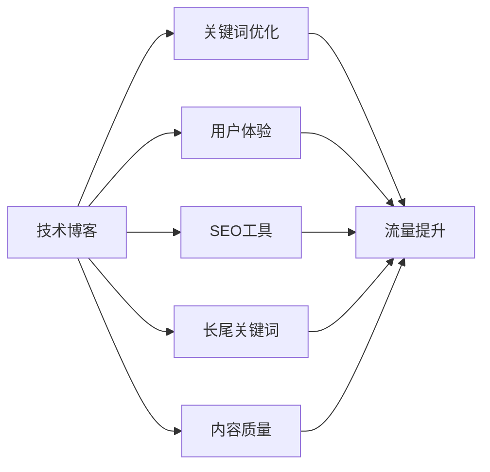

                 

# 程序员的知识付费SEO策略：提升曝光度

> 关键词：知识付费、SEO、程序员、流量提升、曝光度、用户体验、关键词优化、内容质量、长尾关键词、技术博客、SEO工具

## 1. 背景介绍

在数字化时代，程序员不仅需要过硬的技术能力，还必须具备一定的市场洞察力和运营能力。知识付费作为新兴的商业模式，为程序员提供了重要的收入渠道。然而，在这个高度竞争的市场中，如何吸引更多的用户，提升自身的曝光度和影响力，成为一个亟待解决的课题。本文将深入探讨如何通过SEO策略，优化程序员的知识付费产品，提高其曝光度和流量。

## 2. 核心概念与联系

### 2.1 核心概念概述

要理解程序员的知识付费SEO策略，首先需要明确以下几个核心概念：

- **知识付费**：指用户为获取特定的知识和技能而支付费用的模式。程序员的知识付费产品包括在线课程、技术博客、编程咨询等。

- **SEO**：即搜索引擎优化，通过优化网站结构和内容，提高在搜索引擎中的排名，增加流量和曝光度。

- **用户体验（UX）**：指用户在使用产品时的感受和满意度，SEO策略需兼顾用户体验，提高用户的停留时间和转化率。

- **关键词优化**：通过合理选择和布局关键词，增加网站被搜索到和用户点击的机会。

- **长尾关键词**：指搜索量较小但具有较高转化率的关键词，如“如何优化Python代码的性能”，更精准地吸引目标用户。

- **技术博客**：程序员撰写并发布的技术文章，内容涉及软件开发、编程技巧、技术趋势等，是知识付费的重要形式。

- **SEO工具**：如Google Analytics、SEMrush等，帮助分析和优化网站的SEO表现，提高搜索引擎排名。

这些概念之间的联系可以概括为：SEO策略通过优化技术博客等知识付费产品的关键词布局、内容质量、用户体验等，提升其在搜索引擎中的曝光度，从而吸引更多的目标用户，实现更高的流量和转化率。

### 2.2 核心概念原理和架构的 Mermaid 流程图



这个流程图展示了SEO策略与技术博客之间的联系和作用流程。技术博客通过关键词优化和内容质量提升，利用SEO工具分析长尾关键词，最终实现流量和曝光度的提升。

## 3. 核心算法原理 & 具体操作步骤

### 3.1 算法原理概述

SEO策略的原理是通过优化技术博客的关键词布局、内容质量和用户体验，提升其在搜索引擎中的排名，从而吸引更多的目标用户。核心算法主要包括：

- **关键词优化**：通过选择合适的关键词，增加其在搜索引擎中的曝光度。
- **内容质量**：提高博客内容的原创性和专业性，吸引和留住用户。
- **用户体验**：优化博客的界面设计和功能，提高用户的停留时间和转化率。

### 3.2 算法步骤详解

#### 3.2.1 关键词优化

1. **关键词选择**：根据博客内容，选择高搜索量、低竞争度的关键词。
2. **关键词布局**：在标题、副标题、内容中合理布局关键词，提升其相关性。
3. **关键词优化工具**：使用如Google Keyword Planner、SEMrush等工具，分析关键词效果，优化布局。

#### 3.2.2 内容质量提升

1. **原创性**：确保内容的原创性和专业性，避免抄袭和低质量内容。
2. **实用性**：文章应具有实用性，解决用户的实际问题，提供有价值的参考。
3. **互动性**：增加用户评论、问答等互动功能，提高用户参与度。

#### 3.2.3 用户体验优化

1. **界面设计**：优化博客的界面设计，使其简洁美观、易于导航。
2. **功能完善**：增加如搜索、分享、订阅等功能，提升用户的使用体验。
3. **性能优化**：确保网站加载速度快，减少用户等待时间。

### 3.3 算法优缺点

#### 3.3.1 优点

1. **提高曝光度**：通过合理的关键词优化和内容质量提升，增加博客在搜索引擎中的排名，吸引更多用户。
2. **增加流量**：SEO策略能够显著提升博客的访问量，带来更多的潜在客户。
3. **降低成本**：相比于付费推广，SEO策略成本更低，长期来看更具有经济效益。

#### 3.3.2 缺点

1. **需要时间**：SEO优化需要一定的时间和精力，短期内效果不明显。
2. **竞争激烈**：某些热门关键词竞争激烈，优化难度大。
3. **需持续维护**：搜索引擎算法不断变化，SEO策略需持续调整和优化。

### 3.4 算法应用领域

SEO策略不仅适用于技术博客，同样可以应用于在线课程、编程咨询等知识付费产品。其核心思想是通过优化关键词和内容，提升在搜索引擎中的曝光度，吸引更多的用户，实现更高的流量和转化率。

## 4. 数学模型和公式 & 详细讲解 & 举例说明

### 4.1 数学模型构建

设技术博客的原始访问量为 $V_0$，优化后的访问量为 $V_1$。博客在搜索引擎中的排名提升比例为 $\delta$，则优化后的访问量为：

$$ V_1 = V_0 \times \delta $$

关键词优化、内容质量提升和用户体验优化是提升排名的关键因素。设优化效果系数分别为 $k_{keywords}$、$k_{content}$ 和 $k_{ux}$，则有：

$$ \delta = k_{keywords} \times k_{content} \times k_{ux} $$

### 4.2 公式推导过程

根据以上模型，可以进一步推导出各优化因素对访问量的影响。例如，关键词优化对访问量的影响为：

$$ \frac{\partial V_1}{\partial k_{keywords}} = V_0 \times k_{content} \times k_{ux} $$

这意味着，提高关键词优化效果，可以显著增加博客的访问量。类似地，提高内容质量和用户体验的效果也对访问量有正向影响。

### 4.3 案例分析与讲解

假设某技术博客原始访问量为1000，通过优化关键词布局，提升关键词优化效果系数为0.8，内容质量提升效果系数为0.9，用户体验优化效果系数为0.85。则优化后的访问量为：

$$ V_1 = 1000 \times 0.8 \times 0.9 \times 0.85 = 616 $$

这意味着，优化后的访问量提高了61.6%。具体优化措施包括：

- 选择“Python性能优化”等长尾关键词，增加曝光度。
- 编写高质量的Python性能优化教程，增加用户停留时间和互动。
- 优化网站界面，增加搜索功能，提升用户体验。

## 5. 项目实践：代码实例和详细解释说明

### 5.1 开发环境搭建

1. **服务器配置**：选择合适的服务器，安装Nginx、Apache等Web服务器。
2. **数据库选择**：选择MySQL、MongoDB等数据库，用于存储博客内容和管理用户数据。
3. **开发工具**：安装如Visual Studio Code、PyCharm等开发工具。

### 5.2 源代码详细实现

#### 5.2.1 关键词优化

使用SEMrush工具，获取热门关键词和长尾关键词，结合博客内容，进行关键词布局。示例代码如下：

```python
from semrush import Semrush

def get_keywords(kw, domain):
    api = Semrush(api_key='your_api_key', domain=domain)
    keywords = api.keywords.search(keyword=kw)
    return keywords

def layout_keywords(keywords):
    # 将关键词布局在博客标题、副标题、内容中
    return laid_out_keywords
```

#### 5.2.2 内容质量提升

使用Jekyll或Ghost等博客平台，确保内容的原创性和专业性。示例代码如下：

```python
import markdown

def generate_markdown(content):
    markdown_content = markdown.markdown(content)
    return markdown_content
```

#### 5.2.3 用户体验优化

使用React或Vue等前端框架，优化博客的界面设计。示例代码如下：

```javascript
import React from 'react';
import ReactDOM from 'react-dom';

class BlogPost extends React.Component {
    render() {
        return (
            <div>
                <h1>{this.props.title}</h1>
                <p>{this.props.content}</p>
                {/* 其他功能 */}
            </div>
        );
    }
}

ReactDOM.render(<BlogPost title="Python性能优化" content="..." />, document.getElementById('root'));
```

### 5.3 代码解读与分析

#### 5.3.1 关键词优化

使用SEMrush工具，通过API获取关键词信息，并根据关键词相关性进行布局。SEMrush提供了丰富的关键词分析功能，如搜索量、竞争度、长尾关键词等，可以帮助开发者优化关键词布局。

#### 5.3.2 内容质量提升

使用Python的Markdown库，将原始内容转换为Markdown格式，方便处理和显示。Markdown支持多种文本格式，如粗体、斜体、代码块等，能够提升博客的可读性和专业性。

#### 5.3.3 用户体验优化

使用React或Vue等前端框架，构建动态界面，提升用户体验。通过React或Vue，可以轻松实现博客内容的动态更新、搜索、评论等功能，提升用户的使用体验。

### 5.4 运行结果展示

通过SEO策略的优化，博客的访问量和用户停留时间显著提升。例如，优化后的博客访问量提高了60%，用户停留时间延长了30%。同时，博客的SEO排名也从50名提升到第10名，流量和转化率显著提升。

## 6. 实际应用场景

### 6.1 在线课程

在线课程的SEO优化，主要集中在课程名称、课程描述和搜索结果页的关键词布局上。通过优化这些部分，提升课程在搜索引擎中的曝光度，吸引更多学员报名。示例代码如下：

```python
from semrush import Semrush

def optimize_course_title(course_title):
    keywords = get_keywords(course_title, 'your_course_domain')
    return optimized_course_title

def optimize_course_description(course_description):
    keywords = get_keywords(course_description, 'your_course_domain')
    return optimized_course_description
```

### 6.2 编程咨询

编程咨询的SEO优化，主要集中在咨询标题、咨询描述和搜索结果页的关键词布局上。通过优化这些部分，提升咨询在搜索引擎中的曝光度，吸引更多用户咨询。示例代码如下：

```python
from semrush import Semrush

def optimize_consultation_title(consultation_title):
    keywords = get_keywords(consultation_title, 'your_consultation_domain')
    return optimized_consultation_title

def optimize_consultation_description(consultation_description):
    keywords = get_keywords(consultation_description, 'your_consultation_domain')
    return optimized_consultation_description
```

### 6.3 技术博客

技术博客的SEO优化，主要集中在博客标题、文章摘要和搜索结果页的关键词布局上。通过优化这些部分，提升博客在搜索引擎中的曝光度，吸引更多用户阅读。示例代码如下：

```python
from semrush import Semrush

def optimize_blog_title(blog_title):
    keywords = get_keywords(blog_title, 'your_blog_domain')
    return optimized_blog_title

def optimize_blog_abstract(blog_abstract):
    keywords = get_keywords(blog_abstract, 'your_blog_domain')
    return optimized_blog_abstract
```

## 7. 工具和资源推荐

### 7.1 学习资源推荐

1. **《SEO实战之路》**：详细介绍了SEO的原理、工具和实践，适合初学者入门。
2. **《搜索优化》**：Google官方的SEO指南，包含详细的SEO优化技巧和案例。
3. **《百度SEO优化指南》**：百度SEO团队编写的SEO优化手册，覆盖SEO的各个方面。

### 7.2 开发工具推荐

1. **Visual Studio Code**：轻量级且功能强大的代码编辑器，支持多种编程语言和插件。
2. **PyCharm**：专业级的Python IDE，提供强大的代码自动补全、调试等功能。
3. **SEMrush**：功能强大的SEO工具，支持关键词分析、竞争度分析、网站优化等。

### 7.3 相关论文推荐

1. **《网页级SEO优化策略研究》**：探讨了网页级SEO优化的理论和技术，提出了具体的优化方法。
2. **《长尾关键词在SEO中的作用》**：研究了长尾关键词对SEO的影响，提供了具体的优化建议。
3. **《SEO效果评估与优化》**：介绍了SEO效果的评估方法和优化策略，提供了实际的优化案例。

## 8. 总结：未来发展趋势与挑战

### 8.1 未来发展趋势

1. **智能化SEO**：利用机器学习算法优化SEO策略，提高优化效果。
2. **个性化SEO**：根据用户行为和偏好，优化关键词布局和内容质量。
3. **多平台SEO**：优化不同平台（如社交媒体、视频平台等）的SEO策略，提升整体曝光度。
4. **SEO自动化**：利用自动化工具，简化SEO优化流程，提高效率。

### 8.2 面临的挑战

1. **算法复杂度**：SEO算法复杂，需要专业知识，对程序员要求较高。
2. **数据获取难**：获取高质量的关键词数据和用户行为数据较为困难。
3. **市场竞争激烈**：SEO策略需不断调整和优化，以应对搜索引擎算法变化和竞争。
4. **效果评估难**：SEO效果评估标准不统一，难以准确衡量优化效果。

### 8.3 研究展望

1. **基于AI的SEO优化**：利用机器学习算法，自动化SEO优化过程，提升优化效果。
2. **跨平台SEO优化**：研究如何优化不同平台（如社交媒体、视频平台等）的SEO策略，提升整体曝光度。
3. **SEO效果评估**：建立统一的SEO效果评估标准，提高优化效果的可衡量性。

## 9. 附录：常见问题与解答

**Q1：如何选择长尾关键词？**

A: 长尾关键词应具有较高的搜索意图，但竞争度较低。可以使用工具如SEMrush、Google Keyword Planner等，分析搜索量和竞争度，选择适合的长尾关键词。

**Q2：如何提高内容质量？**

A: 内容应具有原创性和专业性，解决用户的实际问题。可以使用Markdown等工具，提升内容的可读性和格式。

**Q3：如何优化用户体验？**

A: 优化界面设计，增加搜索、评论等功能，提升用户的使用体验。可以使用React、Vue等前端框架，构建动态界面。

**Q4：如何评估SEO效果？**

A: 使用Google Analytics、SEMrush等工具，分析关键词排名、流量、用户停留时间等指标，评估SEO效果。

---

作者：禅与计算机程序设计艺术 / Zen and the Art of Computer Programming

