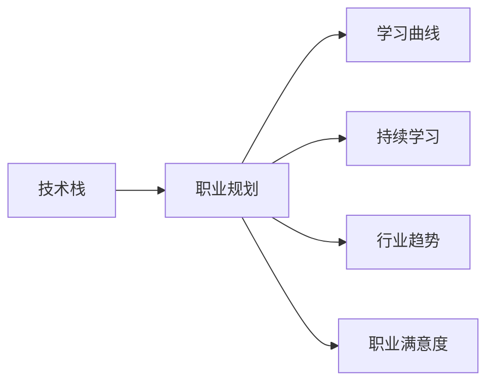

                 

# 程序员的职业生涯规划：长跑与长跑

## 1. 背景介绍

在飞速变化的技术浪潮中，程序员的职业发展如同长跑，需要持续的学习、积累和适应。长跑不仅考验耐力，也需不断调整策略，以应对不同的赛道和挑战。本文将深入探讨程序员的职业生涯规划，从技术成长、职业选择、持续学习到行业趋势，为每位渴望在IT领域取得成功的程序员提供全面、深刻的指导。

## 2. 核心概念与联系

### 2.1 核心概念概述

程序员的职业发展涉及多个核心概念，它们之间存在紧密的联系：

- **技术栈**：程序员擅长的技术领域和编程语言。
- **职业规划**：个人对职业目标的设定和路径规划。
- **学习曲线**：技术学习的难度和速率。
- **持续学习**：在技术发展迅速的行业内，保持知识更新。
- **行业趋势**：IT行业的最新发展和未来方向。
- **职业满意度和幸福**：职业发展与个人生活、心理健康的关系。

这些概念相互交织，共同影响着程序员的职业轨迹和成就。通过理解这些核心概念，可以更好地规划和发展自己的职业生涯。

### 2.2 核心概念原理和架构的 Mermaid 流程图



## 3. 核心算法原理 & 具体操作步骤

### 3.1 算法原理概述

程序员的职业发展算法原理，主要围绕技术积累、知识更新和技能提升。每个阶段的目标和操作都围绕这些核心要素展开。

### 3.2 算法步骤详解

1. **初始化**：明确个人兴趣和职业目标，选择适合的入门语言和技术栈。
2. **迭代学习**：通过项目实践、在线课程、读书会等形式不断学习和掌握新技能。
3. **技能评估**：定期进行技能自评，识别优势和劣势，调整学习方向。
4. **职业转型**：根据行业趋势和个人兴趣，适时调整职业方向和技能重点。
5. **持续反馈**：与行业专家、同事交流，获取反馈，优化职业路径。

### 3.3 算法优缺点

**优点**：
- 系统化地提升技能，满足职业发展的需要。
- 持续学习和反馈机制，适应快速变化的技术环境。

**缺点**：
- 初期投入较大，需要时间和资源进行学习和实践。
- 需适应各种技术栈和项目环境，初期可能面临适应困难。

### 3.4 算法应用领域

该算法广泛应用于各类程序员的职业发展规划，尤其适合希望在IT行业长期发展的个体。无论是在线教育平台、大公司、初创企业，还是自由职业者，都可以运用这一算法进行职业规划。

## 4. 数学模型和公式 & 详细讲解 & 举例说明

### 4.1 数学模型构建

假设程序员的职业发展时间线为$T$，技能提升速度为$v$，职业满意度为$S$。则可建立以下模型：

$$
S(t) = S_0 + \int_0^t v(t) dt
$$

其中，$S(t)$表示$t$时刻的职业满意度，$S_0$为初始职业满意度，$v(t)$为某一技能或技术的学习速度。

### 4.2 公式推导过程

通过积分，可得：

$$
S(t) = S_0 + \int_0^t v(t) dt = S_0 + \int_0^t \frac{d}{dt}(s(t)) dt = S_0 + s(t) \Big|_0^t
$$

其中，$s(t)$表示某一技能或技术在$t$时刻的掌握程度。

### 4.3 案例分析与讲解

以学习编程语言为例，假设某程序员从掌握Python基础开始，每天学习1小时，经过半年掌握到高级应用。其职业满意度从50分提升至90分。

$$
S(t) = 50 + \int_0^{6 \times 30} 1 dt = 50 + 6 \times 30 = 110
$$

通过这一模型，可以量化地评估不同学习速度和技术掌握度对职业满意度的影响，指导职业发展策略。

## 5. 项目实践：代码实例和详细解释说明

### 5.1 开发环境搭建

安装Python、Git、Docker等工具，搭建开发环境，配置持续集成系统，如Jenkins或GitHub Actions。

### 5.2 源代码详细实现

以下是一个简单的技能学习进度跟踪示例：

```python
import time

class SkillTrack:
    def __init__(self, skill_name, start_level, goal_level, learning_rate=1):
        self.skill_name = skill_name
        self.start_level = start_level
        self.goal_level = goal_level
        self.learning_rate = learning_rate
        self.level = start_level
        self.start_time = time.time()

    def update(self):
        current_time = time.time()
        time_spent = current_time - self.start_time
        self.level = min(self.start_level + self.learning_rate * time_spent, self.goal_level)

    def progress(self):
        return self.level, (self.level - self.start_level) / (self.goal_level - self.start_level)

# 使用示例
python_skill = SkillTrack("Python", 1, 10)
python_skill.update()
print(python_skill.progress())
```

### 5.3 代码解读与分析

该代码定义了一个技能跟踪类`SkillTrack`，用于记录技能掌握的进度。`update`方法根据学习速度和时间更新技能掌握度，`progress`方法返回当前技能掌握度及其进度百分比。通过该类，可以方便地跟踪不同技能的学习进度，评估职业发展路径。

### 5.4 运行结果展示

运行上述代码，每隔一段时间调用`update`方法，打印技能掌握度和进度。

## 6. 实际应用场景

### 6.1 在线教育平台

在线教育平台如Coursera、Udemy等，为程序员提供了系统化的学习路径，通过课程、项目、测验等形式帮助学员掌握新技能。平台提供了丰富的课程资源，可以按需选择，并通过进度跟踪、证书颁发等方式激励学员学习。

### 6.2 大公司

大公司如Google、Facebook、Microsoft等，为员工提供了全面的职业发展和技能培训计划。公司通常会定期评估员工的技能掌握度，提供定制化的培训和发展机会。

### 6.3 初创企业

初创企业由于资源有限，通常会鼓励员工自主学习和跨部门协作。公司会设立知识分享会、技术研讨会，促进员工之间的技术交流和协作。

### 6.4 未来应用展望

未来，随着人工智能、大数据、区块链等新兴技术的发展，程序员的职业路径将更加多元化和个性化。同时，远程工作、分布式协作等新模式也将为职业发展带来新的挑战和机遇。

## 7. 工具和资源推荐

### 7.1 学习资源推荐

1. **Coursera、Udemy**：提供系统化的在线课程，涵盖多种技术栈和项目实践。
2. **GitHub**：分享开源项目，参与社区讨论，学习最佳实践。
3. **Medium**：阅读行业专家文章，了解最新技术和趋势。
4. **YouTube**：观看技术讲座和访谈，获取一手学习资源。
5. **HackerRank**：通过编程挑战和比赛，提升技能和解决问题能力。

### 7.2 开发工具推荐

1. **Visual Studio Code**：跨平台、可扩展的代码编辑器，支持多种语言和框架。
2. **Git**：版本控制工具，方便团队协作和代码版本管理。
3. **Docker**：容器化技术，简化环境配置和部署。
4. **Jenkins**：持续集成工具，自动化测试和部署流程。
5. **GitHub Actions**：自动化部署和集成工具，支持持续交付。

### 7.3 相关论文推荐

1. **《程序员职业生涯规划：系统化方法》**：深入探讨职业发展路径，提供实践建议。
2. **《程序员自我学习与技能提升模型》**：建立职业满意度与技能掌握度之间的关系模型。
3. **《技术栈选择与职业发展路径》**：分析不同技术栈的优劣，指导职业规划。

## 8. 总结：未来发展趋势与挑战

### 8.1 研究成果总结

本文通过数学模型和案例分析，系统地阐述了程序员的职业发展算法原理和具体操作步骤，提出了一种可量化评估职业满意度的模型，并通过项目实践展示了其应用。同时，对实际应用场景和未来发展趋势进行了详细探讨，推荐了相关的学习资源、开发工具和论文。

### 8.2 未来发展趋势

1. **技术栈多样化**：随着新兴技术的涌现，程序员需要掌握更多技术栈，以适应行业需求。
2. **跨学科融合**：计算机科学与其他学科的交叉融合，带来更多创新应用和机会。
3. **远程工作普及**：远程协作、分布式开发成为常态，对技术工具和流程提出更高要求。
4. **数据驱动决策**：利用大数据和AI工具，优化职业路径和技能提升策略。

### 8.3 面临的挑战

1. **持续学习压力**：技术更新迅速，程序员需不断学习新技能，可能面临学习疲劳和信息过载。
2. **技能匹配难度**：技术栈多样化和需求多变，找到合适的职业路径和技能匹配点。
3. **职业满意度调整**：技术发展与个人生活、心理健康之间的关系，需有效平衡。

### 8.4 研究展望

1. **个性化职业规划**：利用AI和大数据，为每位程序员提供个性化的职业发展建议。
2. **技能评估与反馈系统**：构建动态的技能评估和反馈系统，实时调整学习路径。
3. **跨领域技能融合**：探索不同学科知识的整合，拓展技术应用的广度和深度。
4. **职业满意度的心理影响**：研究技术发展与个人心理健康的关联，提出科学指导策略。

## 9. 附录：常见问题与解答

**Q1：程序员如何选择合适的职业发展路径？**

A: 选择合适的职业发展路径需综合考虑个人兴趣、市场需求、技能匹配度等因素。可利用技能评估工具，评估自身技能掌握度，并结合行业趋势，选择有发展前景的技术栈和项目方向。

**Q2：如何高效管理时间和精力进行学习？**

A: 制定学习计划，合理安排学习时间和休息时间。使用番茄工作法、时间块管理等方法提升学习效率。利用在线学习平台、社区论坛等资源，获取学习资源和反馈。

**Q3：如何提升技术栈的广度和深度？**

A: 选择有挑战性的项目和竞赛，锻炼多学科知识应用能力。参与开源项目和社区活动，与同行交流学习。持续学习新技能，保持好奇心和探索精神。

**Q4：如何平衡职业发展和个人生活？**

A: 制定明确的目标和计划，设定合理的期望值。灵活调整工作和学习时间，保证休息和健康。培养兴趣爱好，提高生活质量，丰富个人生活。

**Q5：如何应对技术栈更新和淘汰？**

A: 关注行业动态，及时学习新技术和工具。保持开放心态，适应技术变化。构建多样化的技能组合，避免单一技能过时。

---

作者：禅与计算机程序设计艺术 / Zen and the Art of Computer Programming

