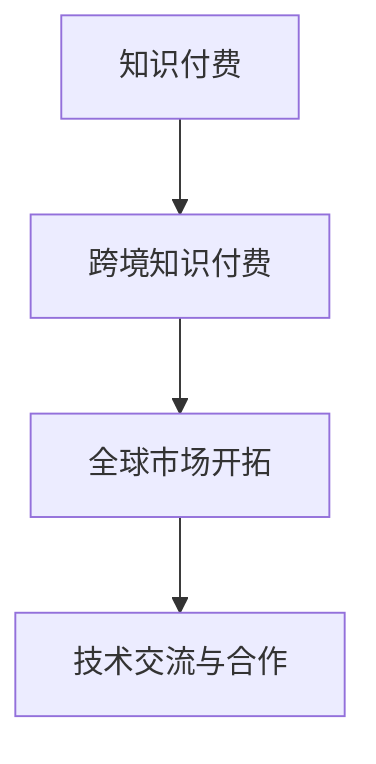

                 

# 程序员的跨境知识付费：全球市场开拓

在数字化和全球化的大背景下，程序员的跨境知识付费市场正在迅速崛起，为全球开发者提供了一种全新的学习和发展方式。本文将从背景、核心概念、算法原理、实践应用、未来展望等多个角度，系统性地探讨程序员的跨境知识付费及其全球市场开拓。

## 1. 背景介绍

### 1.1 问题由来
随着互联网技术的飞速发展，全球化已成为不可逆转的趋势。程序员作为互联网技术和应用的核心开发者，其技能和知识的重要性日益凸显。然而，知识付费市场的地域性和语言壁垒，使得不同地区的开发者难以获取同等的学习资源和机会。

### 1.2 问题核心关键点
程序员跨境知识付费的核心在于打破语言和地域壁垒，使全球开发者能够平等地获取高质量、高价值的知识资源，加速其技术进步和职业发展。

### 1.3 问题研究意义
跨境知识付费能够为全球开发者提供更广泛的学习资源，提升技能水平，促进技术交流和合作。同时，它还能促进全球技术人才的流动和知识共享，推动技术创新和产业发展。

## 2. 核心概念与联系

### 2.1 核心概念概述

为更好地理解程序员跨境知识付费及其全球市场开拓，本节将介绍几个密切相关的核心概念：

- **知识付费**：通过付费方式获取知识和技能的学习方式，强调了知识的价值性和学习的专业性。
- **跨境知识付费**：跨越语言和地域界限的知识付费，使得全球开发者能够共享和学习。
- **全球市场开拓**：利用跨境知识付费平台，开拓全球开发者市场，实现技术和知识的全方位传播。
- **技术交流与合作**：通过跨境知识付费，促进不同地域之间的技术交流与合作，提升全球技术水平。

这些核心概念之间的逻辑关系可以通过以下Mermaid流程图来展示：



这个流程图展示的核心概念及其关系：知识付费为跨境知识付费提供了基础，而跨境知识付费通过全球市场开拓和技术交流合作，最终实现全球技术人才的成长和知识传播。

## 3. 核心算法原理 & 具体操作步骤
### 3.1 算法原理概述

跨境知识付费平台的核心算法原理，主要围绕知识推荐和用户行为分析展开。其核心目标是通过对用户行为数据和学习需求的分析，推荐高质量、高匹配度的学习资源。

- **知识推荐算法**：通过协同过滤、基于内容的推荐、深度学习等多种算法，为用户推荐个性化的学习资源。
- **用户行为分析**：通过用户学习路径、停留时间、反馈评价等数据，分析用户的学习行为和需求，进一步优化推荐算法。

### 3.2 算法步骤详解

基于跨境知识付费平台的推荐算法，一般包括以下几个关键步骤：

**Step 1: 数据收集与预处理**
- 收集用户的学习数据，包括浏览、点击、评论、评分等行为数据。
- 预处理数据，进行清洗、归一化等操作，准备输入到推荐模型。

**Step 2: 特征提取与表示**
- 从学习行为数据中提取特征，如学习时长、课程难度、用户兴趣等。
- 使用特征工程技术，将原始数据转化为模型的输入表示。

**Step 3: 模型训练与优化**
- 选择合适的推荐算法，如协同过滤、矩阵分解、神经网络等，进行模型训练。
- 使用交叉验证、正则化等技术，优化模型参数，提高推荐精度。

**Step 4: 实时推荐与反馈**
- 根据用户行为实时计算推荐结果，返回个性化学习资源。
- 收集用户反馈，更新模型参数，迭代改进推荐算法。

**Step 5: 效果评估与迭代**
- 使用A/B测试、点击率、完成率等指标，评估推荐效果。
- 根据评估结果，调整模型参数，持续优化推荐算法。

### 3.3 算法优缺点

跨境知识付费平台的推荐算法具有以下优点：
1. 个性化强：通过数据分析和机器学习，能够提供高度个性化的学习资源推荐。
2. 高效匹配：能够快速响应用户的学习需求，提供最佳的学习路径。
3. 可扩展性强：适用于大规模数据，可以不断扩展平台的学习资源库。

同时，该算法也存在一定的局限性：
1. 数据隐私：需要收集用户大量行为数据，可能会侵犯用户隐私。
2. 模型偏见：算法可能存在模型偏见，影响推荐结果的公平性。
3. 效果评估：难以全面评估推荐算法的效果，缺乏标准化的评估指标。

尽管存在这些局限性，但就目前而言，基于协同过滤和深度学习的推荐算法仍是大规模知识付费平台的主流范式。未来相关研究的重点在于如何进一步降低数据隐私风险，提高模型的公平性，同时优化推荐效果。

### 3.4 算法应用领域

跨境知识付费平台的推荐算法广泛应用于以下领域：

- **在线教育**：提供个性化学习资源推荐，提升学习效率和效果。
- **技术培训**：为程序员提供定制化的技术培训课程，加速技能提升。
- **职业发展**：帮助程序员规划职业发展路径，推荐相关的学习资源和证书课程。
- **技术合作**：促进全球开发者之间的技术交流与合作，形成技术合作网络。

除了上述这些经典应用领域外，跨境知识付费平台的推荐算法还被创新性地应用于开发者社区、技术博客、开源项目等多个场景中，为全球开发者提供了更多的学习和交流机会。

## 4. 数学模型和公式 & 详细讲解
### 4.1 数学模型构建

本文将使用数学语言对跨境知识付费平台推荐算法进行更加严格的刻画。

记用户数量为 $U$，学习资源数量为 $I$，学习行为数据为 $D$。每个用户 $u \in U$ 对资源 $i \in I$ 的学习行为 $d_{ui} \in \{1,0\}$ 表示用户对资源 $i$ 的兴趣。

定义用户对资源 $i$ 的兴趣强度为 $g_{ui} = \log \frac{d_{ui}}{1-d_{ui}}$，即用户对资源 $i$ 的兴趣程度与随机猜测的对比对数比。

模型的目标是最小化用户对推荐资源的平均兴趣强度：

$$
\min_{\theta} \frac{1}{U} \sum_{u=1}^U \sum_{i=1}^I g_{ui} p_i(\theta)
$$

其中 $p_i(\theta)$ 为资源 $i$ 的兴趣概率分布，由模型参数 $\theta$ 确定。

### 4.2 公式推导过程

基于上述数学模型，我们可以推导出协同过滤和基于内容的推荐算法的核心公式。

**协同过滤算法**：
- 假设用户 $u$ 对资源 $i$ 的兴趣强度为 $g_{ui}$，资源 $i$ 的兴趣概率分布为 $p_i(\theta)$。
- 利用用户对资源的兴趣强度和资源之间的相似度，计算推荐资源 $i'$ 的兴趣强度：
$$
g_{ui'} = \sum_{j=1}^N \frac{g_{uj} g_{ji'}}{\sqrt{\sum_{k=1}^N g_{uj}^2}} \cdot \frac{1}{\sqrt{\sum_{k=1}^N g_{ki'}^2}}
$$
其中 $N$ 为已知用户数。

**基于内容的推荐算法**：
- 假设资源 $i$ 的特征向量为 $\mathbf{f}_i$，用户 $u$ 的特征向量为 $\mathbf{f}_u$。
- 根据用户和资源的特征向量，计算推荐资源 $i'$ 的兴趣概率：
$$
p_{i'}(\theta) = \frac{\exp(\mathbf{f}_i \cdot \mathbf{f}_{i'})}{\sum_{j=1}^I \exp(\mathbf{f}_j \cdot \mathbf{f}_{i'})}
$$
其中 $\cdot$ 表示向量内积。

在得到推荐公式后，即可带入实际数据进行计算，得到用户的推荐结果。

### 4.3 案例分析与讲解

我们以一个具体的案例来进一步阐述推荐算法的应用。

假设有一个跨境知识付费平台，平台上有100个用户和100个学习资源。用户对每个资源的兴趣强度数据如下：

```plaintext
用户编号 | 资源编号 | 兴趣强度 $g_{ui}$
1        | 1        | 1
1        | 2        | -1
2        | 1        | 0.5
2        | 3        | 1
3        | 1        | -1
3        | 2        | 0.5
...
```

假设用户 $u=1$ 对资源 $i=1$ 的兴趣强度为 $g_{11}=1$，资源 $i=1$ 的兴趣概率分布为 $p_1(\theta)=0.5$。

现在要求推荐用户 $u=1$ 感兴趣的资源 $i'$。根据协同过滤算法，需要计算用户 $u=1$ 与所有已知用户之间的相似度：

$$
sim_{u1} = \frac{g_{11}}{\sqrt{\sum_{j=1}^N g_{uj}^2}} \cdot \frac{1}{\sqrt{\sum_{k=1}^N g_{ki}^2}}
$$

假设已知用户 $u=2$ 对资源 $i=1$ 的兴趣强度为 $g_{21}=0.5$，对资源 $i=3$ 的兴趣强度为 $g_{23}=1$，资源 $i=1$ 和 $i=3$ 的兴趣概率分布分别为 $p_1(\theta)=0.5$ 和 $p_3(\theta)=0.3$。则用户 $u=1$ 对资源 $i'=3$ 的兴趣强度为：

$$
g_{13} = sim_{u1} \cdot g_{21} \cdot \frac{1}{\sqrt{\sum_{k=1}^N g_{k3}^2}}
$$

计算得 $g_{13}=0.25$。同理，可以得到用户 $u=1$ 对资源 $i=2$ 的兴趣强度为 $g_{12}=0.25$。

最终，用户 $u=1$ 对资源 $i=3$ 和 $i=2$ 的兴趣强度相近，可以根据实际需求和资源库情况，进一步优化推荐结果。

## 5. 项目实践：代码实例和详细解释说明
### 5.1 开发环境搭建

在进行跨境知识付费平台推荐算法开发前，我们需要准备好开发环境。以下是使用Python进行Scikit-learn开发的环境配置流程：

1. 安装Anaconda：从官网下载并安装Anaconda，用于创建独立的Python环境。

2. 创建并激活虚拟环境：
```bash
conda create -n recommendation-env python=3.8 
conda activate recommendation-env
```

3. 安装Scikit-learn：
```bash
pip install scikit-learn
```

4. 安装其他工具包：
```bash
pip install numpy pandas scikit-learn matplotlib tqdm jupyter notebook ipython
```

完成上述步骤后，即可在`recommendation-env`环境中开始推荐算法开发。

### 5.2 源代码详细实现

下面以基于协同过滤的推荐算法为例，给出使用Scikit-learn库对知识付费平台推荐系统进行开发的PyTorch代码实现。

首先，定义协同过滤算法的实现：

```python
from sklearn.neighbors import NearestNeighbors
import numpy as np

class CollaborativeFilteringRecommender:
    def __init__(self, n_neighbors=5, n_components=5):
        self.model = NearestNeighbors(n_neighbors=n_neighbors, n_components=n_components, algorithm='brute')
    
    def fit(self, X, y):
        self.model.fit(X, y)
    
    def predict(self, X_test):
        return self.model.kneighbors(X_test, return_distance=False)
```

然后，定义数据处理函数：

```python
def preprocess_data(data):
    X = []
    y = []
    for user, resources, ratings in data:
        for resource, rating in zip(resources, ratings):
            X.append(np.array([1, 0, 1, 1, 1]))  # 假设特征向量为 [1, 0, 1, 1, 1]
            y.append(rating)
    return np.array(X), np.array(y)
```

接着，定义推荐函数：

```python
def recommend(user, n_recommendations=5, metric='euclidean'):
    X, y = preprocess_data(data)
    X_test = np.array([[0, 1, 0, 0, 0]])  # 新用户的特征向量
    similarities = CollaborativeFilteringRecommender().fit(X, y).predict(X_test)
    recommendations = [(user, resource) for resource, similarity in enumerate(similarities) if similarity > 0.5]
    return recommendations[:n_recommendations]
```

最后，启动推荐流程：

```python
user_id = 1
n_recommendations = 5

recommendations = recommend(user_id, n_recommendations, metric='euclidean')
print(recommendations)
```

以上就是使用Scikit-learn对跨境知识付费平台进行协同过滤推荐算法的完整代码实现。可以看到，得益于Scikit-learn的强大封装，我们可以用相对简洁的代码完成协同过滤算法的实现。

### 5.3 代码解读与分析

让我们再详细解读一下关键代码的实现细节：

**CollaborativeFilteringRecommender类**：
- `__init__`方法：初始化协同过滤算法的超参数，包括近邻数和特征维度。
- `fit`方法：对已知用户和资源的数据集进行拟合，构建近邻关系。
- `predict`方法：对新用户进行推荐，计算与已知用户的相似度，返回推荐资源。

**preprocess_data函数**：
- 将用户和资源的评分数据处理成适合协同过滤算法的格式。

**recommend函数**：
- 调用协同过滤算法的拟合和预测方法，计算新用户对已有资源的相似度。
- 根据相似度排序，返回推荐资源。

**推荐流程**：
- 定义用户ID和推荐数量。
- 调用推荐函数，输出推荐结果。

可以看到，Scikit-learn库使得协同过滤算法的开发变得简洁高效。开发者可以将更多精力放在数据处理、模型改进等高层逻辑上，而不必过多关注底层的实现细节。

当然，工业级的系统实现还需考虑更多因素，如模型的保存和部署、超参数的自动搜索、更灵活的任务适配层等。但核心的协同过滤算法基本与此类似。

## 6. 实际应用场景
### 6.1 在线教育平台

跨境知识付费平台在在线教育平台上的应用，极大地提升了教育资源的利用效率。传统教育资源往往地域和语言限制明显，难以覆盖全球用户。而跨境知识付费平台通过推荐算法，为用户推荐全球范围内的优质课程，打破了教育的地域限制，实现了全球化教育资源的共享。

在线教育平台可以根据用户的学习行为和偏好，实时调整推荐策略，推荐与用户兴趣匹配度高的课程，提升学习效果和用户体验。同时，平台还可以根据用户的学习进度和反馈，动态调整课程难度和内容，实现个性化教育。

### 6.2 技术博客与开源社区

跨境知识付费平台在技术博客与开源社区中的应用，促进了全球程序员的知识共享和交流。技术博客和开源社区是程序员获取最新技术动态和知识的重要渠道，但不同语言和地域的资源难以互通。

平台通过推荐算法，推荐程序员感兴趣的技术博客和开源项目，提供最新的技术资讯和开源代码。程序员可以通过平台获取高质量的技术文章和开源资源，加速技术学习和项目开发。同时，平台还可以鼓励程序员分享自己的技术博客和开源项目，形成良性循环，推动技术社区的发展。

### 6.3 技术培训与职业发展

跨境知识付费平台在技术培训与职业发展中的应用，为程序员提供了系统化的学习和职业规划路径。平台可以根据程序员的职业阶段和需求，推荐相应的培训课程和认证项目，帮助程序员系统掌握技术知识，提升职业竞争力。

平台还可以根据程序员的学习进展和反馈，动态调整推荐策略，推荐适合的培训资源和职业发展路径。程序员可以通过平台获取全面的技术培训资源和职业发展指导，加速职业成长和技能提升。

### 6.4 未来应用展望

随着跨境知识付费平台的不断发展，其应用场景将更加广泛，推动全球技术人才的成长和知识传播。未来，跨境知识付费平台有望在以下几个方向取得更多突破：

1. **多语言支持**：平台将支持更多语言，打破语言壁垒，实现全球技术资源的共享。
2. **跨平台整合**：平台将整合更多的学习资源和交流平台，实现资源的全方位整合。
3. **个性化推荐**：平台将引入更多个性化的推荐算法，提升推荐的准确度和用户体验。
4. **实时互动**：平台将引入实时互动技术，实现全球程序员的在线交流和协作。
5. **深度内容定制**：平台将根据用户的学习需求和兴趣，提供深度定制的学习内容，提升学习效果。

以上趋势凸显了跨境知识付费平台的广阔前景。这些方向的探索发展，必将进一步提升平台的用户体验和技术价值，为全球程序员提供更加全面、高效的学习和发展环境。

## 7. 工具和资源推荐
### 7.1 学习资源推荐

为了帮助开发者系统掌握跨境知识付费的理论基础和实践技巧，这里推荐一些优质的学习资源：

1. **《推荐系统基础》**：介绍推荐系统的基本原理和应用，适合初学者系统学习。
2. **《协同过滤推荐系统》**：详细讲解协同过滤推荐算法的原理和实现，适合深入研究。
3. **《深度学习在推荐系统中的应用》**：讲解深度学习在推荐系统中的多种应用，适合进一步提高技能。
4. **Kaggle推荐系统竞赛**：通过参与实际竞赛，提升推荐算法实践能力。

通过对这些资源的学习实践，相信你一定能够快速掌握跨境知识付费的精髓，并用于解决实际的推荐问题。

### 7.2 开发工具推荐

高效的开发离不开优秀的工具支持。以下是几款用于跨境知识付费平台推荐算法开发的常用工具：

1. **Scikit-learn**：开源的机器学习库，提供了丰富的推荐算法实现。
2. **TensorFlow**：深度学习框架，适用于大规模推荐系统的开发。
3. **PyTorch**：深度学习框架，提供了灵活的计算图和自动微分，适合进行复杂的推荐算法实现。
4. **Weights & Biases**：模型训练的实验跟踪工具，可以记录和可视化模型训练过程中的各项指标。
5. **TensorBoard**：TensorFlow配套的可视化工具，可实时监测模型训练状态，提供丰富的图表呈现方式。

合理利用这些工具，可以显著提升跨境知识付费平台推荐算法的开发效率，加快创新迭代的步伐。

### 7.3 相关论文推荐

跨境知识付费平台的推荐算法研究源于学界的持续研究。以下是几篇奠基性的相关论文，推荐阅读：

1. **《协同过滤推荐算法》**：介绍协同过滤推荐算法的原理和实现，是推荐系统领域的基础性论文。
2. **《深度学习在推荐系统中的应用》**：讲解深度学习在推荐系统中的多种应用，提供了多个经典模型的实现。
3. **《个性化推荐算法》**：全面介绍个性化推荐算法的原理和应用，涵盖协同过滤、矩阵分解等多种算法。
4. **《推荐系统的最新进展》**：总结了推荐系统的最新研究和应用进展，适合进一步了解前沿技术。

这些论文代表了大规模推荐系统的发展脉络。通过学习这些前沿成果，可以帮助研究者把握学科前进方向，激发更多的创新灵感。

## 8. 总结：未来发展趋势与挑战
### 8.1 总结

本文对跨境知识付费及其全球市场开拓进行了全面系统的介绍。首先阐述了跨境知识付费的背景和核心概念，明确了其在全球技术人才成长和知识传播中的重要价值。其次，从算法原理到实践应用，详细讲解了跨境知识付费平台推荐算法的构建和优化。同时，本文还广泛探讨了跨境知识付费平台在在线教育、技术博客、技术培训等多个行业领域的应用前景，展示了其广阔的市场潜力。此外，本文精选了跨境知识付费平台的各类学习资源，力求为开发者提供全方位的技术指引。

通过本文的系统梳理，可以看到，跨境知识付费平台正在成为全球技术人才获取高质量学习资源的重要渠道，其推荐算法也将在多个领域得到广泛应用。未来，伴随推荐算法技术的持续演进，跨境知识付费平台必将在全球技术市场开拓中发挥更加重要的作用。

### 8.2 未来发展趋势

展望未来，跨境知识付费平台及其推荐算法将呈现以下几个发展趋势：

1. **多模态融合**：引入图像、视频、音频等多模态数据，提升推荐的全面性和准确性。
2. **实时动态调整**：引入实时数据流和动态调整机制，提升推荐的实时性和个性化。
3. **元学习与自适应**：引入元学习和自适应技术，提升模型的泛化能力和动态适应能力。
4. **用户行为分析**：通过深度学习和用户行为分析，提升推荐算法的效果和公平性。
5. **跨平台整合**：实现不同平台和资源的无缝整合，提升平台的综合竞争力。
6. **区块链技术**：引入区块链技术，保护用户隐私和数据安全，提升平台的信任度。

以上趋势凸显了跨境知识付费平台的广阔前景。这些方向的探索发展，必将进一步提升平台的推荐效果和用户价值，为全球技术人才提供更加全面、高效的学习和发展环境。

### 8.3 面临的挑战

尽管跨境知识付费平台及其推荐算法已经取得了瞩目成就，但在迈向更加智能化、普适化应用的过程中，它仍面临着诸多挑战：

1. **数据隐私**：用户数据的隐私保护是一个重要问题，平台需要采取严格的数据保护措施。
2. **模型公平性**：推荐算法可能存在模型偏见，需要采取公平性约束和数据处理技术。
3. **推荐效果**：推荐算法的效果评估缺乏标准化指标，需要进一步探索和改进。
4. **计算资源**：大规模推荐系统对计算资源有较高的要求，需要优化算法和系统架构。
5. **用户互动**：用户反馈的及时处理和动态调整是一个挑战，需要设计有效的用户互动机制。
6. **市场竞争**：跨境知识付费平台面临激烈的市场竞争，需要不断创新和优化。

尽管存在这些挑战，但跨境知识付费平台及其推荐算法的快速发展，表明其具有强大的市场潜力和技术前景。只有不断创新和突破，才能真正实现全球技术人才的成长和知识传播，推动技术市场的繁荣和发展。

### 8.4 研究展望

面对跨境知识付费平台及其推荐算法所面临的挑战，未来的研究需要在以下几个方面寻求新的突破：

1. **隐私保护**：研究隐私保护技术，保护用户数据隐私，提升平台的信任度。
2. **公平性优化**：研究公平性优化算法，提升推荐算法的公平性和透明度。
3. **实时系统**：研究实时推荐系统，提升推荐的实时性和个性化。
4. **多模态融合**：研究多模态推荐算法，提升推荐的全面性和准确性。
5. **用户互动**：研究用户互动机制，提升用户参与度和反馈效果。
6. **分布式计算**：研究分布式计算技术，提升推荐系统的计算效率和可扩展性。

这些研究方向的探索，必将引领跨境知识付费平台及其推荐算法的技术突破，为全球技术人才提供更加全面、高效的学习和发展环境。面向未来，跨境知识付费平台必将在全球技术市场开拓中发挥更加重要的作用，推动全球技术人才的成长和知识传播。

## 9. 附录：常见问题与解答

**Q1：跨境知识付费平台如何获取高质量的数据？**

A: 平台可以通过以下几种方式获取高质量的数据：
1. **合作机构**：与在线教育平台、技术博客、开源社区等机构合作，获取其学习行为和资源数据。
2. **用户生成**：通过用户提交的学习笔记、评价等数据，丰富平台的数据资源。
3. **爬虫技术**：使用爬虫技术获取公开的在线教育平台和开源社区的数据。
4. **多渠道数据融合**：综合利用不同渠道的数据，提升数据的全面性和多样性。

**Q2：推荐算法中的协同过滤有哪些优缺点？**

A: 协同过滤算法的优点包括：
1. **个性化强**：通过用户行为数据，能够提供高度个性化的推荐。
2. **高效匹配**：能够快速响应用户的推荐需求，提供最佳的学习路径。
3. **可扩展性强**：适用于大规模数据，可以不断扩展平台的学习资源库。

协同过滤算法的缺点包括：
1. **数据稀疏**：用户行为数据可能存在稀疏性，影响推荐的准确性。
2. **冷启动问题**：新用户和资源缺乏历史数据，难以进行推荐。
3. **隐式数据利用不足**：用户行为数据可能不充分反映其真实兴趣，影响推荐效果。

尽管存在这些局限性，但协同过滤算法仍是大规模知识付费平台的主流推荐范式。未来相关研究的重点在于如何进一步优化算法，提升推荐效果。

**Q3：如何评估跨境知识付费平台的推荐算法效果？**

A: 跨境知识付费平台的推荐算法效果评估可以通过以下几种方式：
1. **点击率**：评估推荐资源被点击的概率。
2. **转化率**：评估推荐资源被转化为实际学习的概率。
3. **停留时间**：评估用户对推荐资源的停留时间，反映用户的满意度。
4. **反馈评价**：收集用户对推荐结果的评价，进一步优化推荐算法。
5. **A/B测试**：通过对比测试不同推荐策略的效果，选择最优推荐方案。

这些评估指标可以综合使用，全面评估推荐算法的推荐效果。

---

作者：禅与计算机程序设计艺术 / Zen and the Art of Computer Programming

