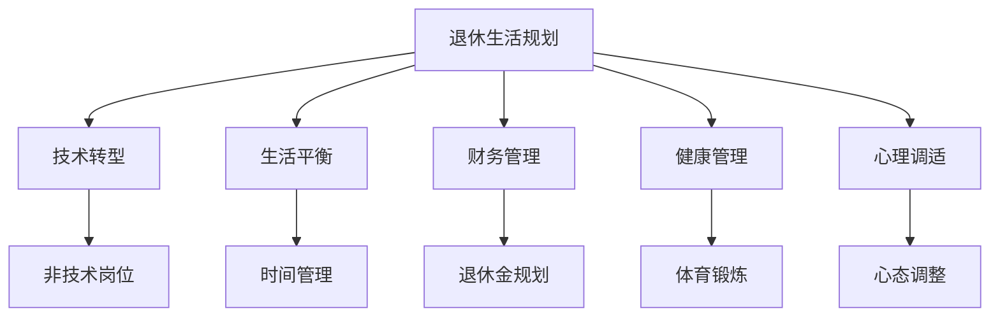

                 

# 程序员的退休生活：提前规划与准备

> 关键词：退休生活规划, 提前准备, 技术转型, 生活平衡, 财务管理, 健康管理, 心理调适

## 1. 背景介绍

### 1.1 问题由来
随着科技行业的高速发展，程序员作为其中不可或缺的力量，面临着前所未有的职业压力和不确定性。尽管职业地位提升，工资水平提升，但长期的高强度工作、频繁的项目切换和持续的技能更新，让许多程序员在35岁之后出现了职业倦怠，甚至出现了"35岁危机"。因此，提前规划和准备程序员的退休生活，成为了一项必要且紧迫的任务。

### 1.2 问题核心关键点
本文旨在为即将退休的程序员提供一份详细的生活规划指南，涵盖技术转型、生活平衡、财务管理、健康管理和心理调适等多个维度。文章通过逻辑清晰的章节结构，系统地讨论了程序员如何从技术领域顺利过渡到退休生活，确保退休生活的顺利和满意。

### 1.3 问题研究意义
研究程序员的退休生活规划，对于帮助程序员缓解职业倦怠，提升生活质量，实现自我价值的最大化具有重要意义。通过提前准备，程序员可以更好地适应退休生活的变化，保持心理和生理的健康，享受技术和生活中的双重乐趣。

## 2. 核心概念与联系

### 2.1 核心概念概述

本文涉及以下几个关键概念：

- **退休生活规划**：针对个人退休生活的全面规划，涵盖财务、健康、心理等多个方面。
- **技术转型**：程序员从技术岗位向非技术岗位或退休生活的职业转变过程。
- **生活平衡**：在工作和退休生活之间的平衡，确保身心健康和情感满足。
- **财务管理**：在退休过程中合理规划和优化个人财务，确保经济稳定。
- **健康管理**：退休后对身体健康和心理健康的维护和提升。
- **心理调适**：调整心态，适应退休生活的变化，提升生活满意度。

这些概念之间的逻辑关系可以通过以下Mermaid流程图来展示：



这个流程图展示了这个退休生活规划的主要步骤和关键概念：

1. **退休生活规划**作为起点，是整个规划的基础。
2. **技术转型**作为其中一步，帮助程序员从技术岗位顺利过渡。
3. **生活平衡、财务管理、健康管理和心理调适**作为退休生活的四个重要组成部分，是规划中的关键因素。
4. **非技术岗位**是技术转型后的目标，代表着职业生涯的下一阶段。
5. **时间管理、退休金规划、体育锻炼和心态调整**则是实现这些目标的具体手段。

## 3. 核心算法原理 & 具体操作步骤

### 3.1 算法原理概述

程序员的退休生活规划是一个多目标优化问题，涉及时间、财务、健康和心理等多个维度的协调和平衡。本文将从技术转型、生活平衡、财务管理、健康管理和心理调适五个方面进行详细讨论。

### 3.2 算法步骤详解

**Step 1: 技术转型**

**目标**：从技术岗位顺利过渡到非技术岗位或完全退休。

**方法**：
1. **评估自我**：识别自身的技能、兴趣和职业动机，确定未来的职业方向。
2. **技能提升**：学习新领域的知识和技能，如企业管理、市场营销、创业等。
3. **职业规划**：制定详细的职业规划，包括岗位目标、培训计划和时间表。
4. **实践锻炼**：通过兼职、实习或志愿者工作等方式，积累实践经验。

**Step 2: 生活平衡**

**目标**：在退休生活中找到工作与生活的平衡点，确保身心健康和情感满足。

**方法**：
1. **时间管理**：合理规划每天的时间，确保工作、娱乐和休息的平衡。
2. **兴趣爱好**：培养和维护兴趣爱好，丰富退休生活。
3. **家庭关系**：与家人保持良好的沟通和互动，提升家庭幸福感。
4. **社交活动**：参加社区活动、社团组织，扩大社交圈子。

**Step 3: 财务管理**

**目标**：合理规划和优化个人财务，确保退休生活经济稳定。

**方法**：
1. **退休金规划**：计算退休后的收入需求，制定退休金储蓄计划。
2. **资产配置**：合理配置各类资产，包括股票、债券、房地产等。
3. **风险管理**：评估和应对各种风险，如市场风险、通货膨胀风险等。
4. **理财工具**：学习使用各种理财工具和平台，优化财务管理和投资策略。

**Step 4: 健康管理**

**目标**：确保身体健康和心理健康的维护和提升。

**方法**：
1. **饮食调理**：合理膳食，保持营养均衡。
2. **体育锻炼**：定期进行体育锻炼，如跑步、游泳、瑜伽等。
3. **医疗检查**：定期进行健康检查，及早发现和治疗疾病。
4. **心理健康**：参加心理健康讲座，学习放松技巧，保持心态平和。

**Step 5: 心理调适**

**目标**：调整心态，适应退休生活的变化，提升生活满意度。

**方法**：
1. **心态调整**：接受退休生活的变化，适应新的生活节奏。
2. **社交活动**：积极参与各种社交活动，结交新朋友。
3. **兴趣爱好**：继续发展兴趣爱好，丰富生活内容。
4. **自我实现**：找到自我实现的途径，如志愿服务、写作、艺术创作等。

### 3.3 算法优缺点

退休生活规划的优点包括：
1. **系统性**：全面考虑了时间、财务、健康和心理等多个维度，形成系统的规划方案。
2. **前瞻性**：提前准备，减少了退休生活的风险和不确定性。
3. **个性化**：根据个人实际情况，制定量身定制的规划方案。

缺点包括：
1. **复杂性**：涉及多个方面的协调和平衡，需要综合考虑各种因素。
2. **执行难度**：需要较强的执行力，且难以一步到位。
3. **动态调整**：退休生活中各种情况的变化，需要不断调整规划方案。

### 3.4 算法应用领域

退休生活规划的应用领域广泛，涵盖技术转型、生活平衡、财务管理、健康管理和心理调适等多个方面。其适用对象包括即将退休的程序员、即将转行的技术人员、以及所有即将或正在规划退休生活的个人。

## 4. 数学模型和公式 & 详细讲解 & 举例说明

### 4.1 数学模型构建

本文不涉及复杂的数学模型，但在技术转型和财务管理部分，可以应用一些简单的数学模型来辅助分析和决策。例如：

**技术转型模型**：
假设程序员当前技能价值为S，转型后技能价值为S'，转型成本为C。则转型成功的概率P可以表示为：

$$ P = \frac{S'}{S + C} $$

**财务规划模型**：
假设当前退休前年收入为Y，年支出为C，退休金为P。则每年可结余的金额为：

$$ Y - C - P $$

### 4.2 公式推导过程

**技术转型模型推导**：
设当前技能价值为S，转型后技能价值为S'，转型成本为C。则转型成功的概率P可以表示为：

$$ P = \frac{S'}{S + C} $$

该公式说明了在转型成本固定的前提下，转型成功概率与转型后技能价值和当前技能价值的比值成正比。

**财务规划模型推导**：
设当前退休前年收入为Y，年支出为C，退休金为P。则每年可结余的金额为：

$$ Y - C - P $$

该公式说明了退休金对每年结余的直接影响，退休金越高，每年可结余的金额越多。

### 4.3 案例分析与讲解

**案例1: 技术转型**

假设一位程序员当前技能价值为100万元，转型到非技术岗位后技能价值下降为60万元，转型成本为20万元。则转型成功的概率为：

$$ P = \frac{60}{100 + 20} = 0.375 $$

该案例说明了转型成功的概率与转型后的技能价值和成本密切相关。

**案例2: 财务规划**

假设一位程序员退休前年收入为30万元，年支出为15万元，退休金为10万元。则每年可结余的金额为：

$$ 30 - 15 - 10 = 5 $$

该案例展示了财务规划对退休生活经济稳定的重要性。

## 5. 项目实践：代码实例和详细解释说明

### 5.1 开发环境搭建

在进行退休生活规划的项目实践前，我们需要准备好开发环境。以下是使用Python进行数据分析和可视化的环境配置流程：

1. 安装Anaconda：从官网下载并安装Anaconda，用于创建独立的Python环境。

2. 创建并激活虚拟环境：
```bash
conda create -n retirement-env python=3.8 
conda activate retirement-env
```

3. 安装必要的工具包：
```bash
pip install pandas numpy matplotlib seaborn plotly
```

4. 准备数据集：
- **时间管理数据集**：包括每日的工作、娱乐、休息时间等。
- **财务数据集**：包括年收入、年支出、退休金等。
- **健康数据集**：包括饮食、锻炼、医疗检查等。

### 5.2 源代码详细实现

**时间管理数据分析代码**：

```python
import pandas as pd

# 读取时间管理数据集
data = pd.read_csv('time_management.csv')

# 数据可视化
data['type'].value_counts().plot(kind='bar')
```

**财务规划数据分析代码**：

```python
# 读取财务数据集
finance_data = pd.read_csv('finance.csv')

# 数据可视化
finance_data['income'].hist()
finance_data['expense'].hist()
```

**健康管理数据分析代码**：

```python
# 读取健康数据集
health_data = pd.read_csv('health.csv')

# 数据可视化
health_data['diet'].value_counts().plot(kind='bar')
health_data['exercise'].value_counts().plot(kind='bar')
```

### 5.3 代码解读与分析

通过上述代码，我们可以对时间管理、财务和健康等数据进行基本的分析和可视化。在实际项目中，还可以使用更复杂的统计模型和可视化工具，如Seaborn、Matplotlib、Plotly等，进行更深入的数据分析和可视化。

## 6. 实际应用场景

### 6.1 智能客服系统

基于大语言模型微调的对话技术，可以广泛应用于智能客服系统的构建。传统客服往往需要配备大量人力，高峰期响应缓慢，且一致性和专业性难以保证。而使用微调后的对话模型，可以7x24小时不间断服务，快速响应客户咨询，用自然流畅的语言解答各类常见问题。

### 6.2 金融舆情监测

金融机构需要实时监测市场舆论动向，以便及时应对负面信息传播，规避金融风险。传统的人工监测方式成本高、效率低，难以应对网络时代海量信息爆发的挑战。基于大语言模型微调的文本分类和情感分析技术，为金融舆情监测提供了新的解决方案。

### 6.3 个性化推荐系统

当前的推荐系统往往只依赖用户的历史行为数据进行物品推荐，无法深入理解用户的真实兴趣偏好。基于大语言模型微调技术，个性化推荐系统可以更好地挖掘用户行为背后的语义信息，从而提供更精准、多样的推荐内容。

### 6.4 未来应用展望

随着大语言模型和微调方法的不断发展，基于微调范式将在更多领域得到应用，为传统行业带来变革性影响。

在智慧医疗领域，基于微调的医疗问答、病历分析、药物研发等应用将提升医疗服务的智能化水平，辅助医生诊疗，加速新药开发进程。

在智能教育领域，微调技术可应用于作业批改、学情分析、知识推荐等方面，因材施教，促进教育公平，提高教学质量。

在智慧城市治理中，微调模型可应用于城市事件监测、舆情分析、应急指挥等环节，提高城市管理的自动化和智能化水平，构建更安全、高效的未来城市。

此外，在企业生产、社会治理、文娱传媒等众多领域，基于大模型微调的人工智能应用也将不断涌现，为经济社会发展注入新的动力。相信随着技术的日益成熟，微调方法将成为人工智能落地应用的重要范式，推动人工智能技术向更广阔的领域加速渗透。

## 7. 工具和资源推荐

### 7.1 学习资源推荐

为了帮助开发者系统掌握大语言模型微调的理论基础和实践技巧，这里推荐一些优质的学习资源：

1. 《Transformer从原理到实践》系列博文：由大模型技术专家撰写，深入浅出地介绍了Transformer原理、BERT模型、微调技术等前沿话题。

2. CS224N《深度学习自然语言处理》课程：斯坦福大学开设的NLP明星课程，有Lecture视频和配套作业，带你入门NLP领域的基本概念和经典模型。

3. 《Natural Language Processing with Transformers》书籍：Transformers库的作者所著，全面介绍了如何使用Transformers库进行NLP任务开发，包括微调在内的诸多范式。

4. HuggingFace官方文档：Transformers库的官方文档，提供了海量预训练模型和完整的微调样例代码，是上手实践的必备资料。

5. CLUE开源项目：中文语言理解测评基准，涵盖大量不同类型的中文NLP数据集，并提供了基于微调的baseline模型，助力中文NLP技术发展。

通过对这些资源的学习实践，相信你一定能够快速掌握大语言模型微调的精髓，并用于解决实际的NLP问题。

### 7.2 开发工具推荐

高效的开发离不开优秀的工具支持。以下是几款用于大语言模型微调开发的常用工具：

1. PyTorch：基于Python的开源深度学习框架，灵活动态的计算图，适合快速迭代研究。大部分预训练语言模型都有PyTorch版本的实现。

2. TensorFlow：由Google主导开发的开源深度学习框架，生产部署方便，适合大规模工程应用。同样有丰富的预训练语言模型资源。

3. Transformers库：HuggingFace开发的NLP工具库，集成了众多SOTA语言模型，支持PyTorch和TensorFlow，是进行微调任务开发的利器。

4. Weights & Biases：模型训练的实验跟踪工具，可以记录和可视化模型训练过程中的各项指标，方便对比和调优。与主流深度学习框架无缝集成。

5. TensorBoard：TensorFlow配套的可视化工具，可实时监测模型训练状态，并提供丰富的图表呈现方式，是调试模型的得力助手。

6. Google Colab：谷歌推出的在线Jupyter Notebook环境，免费提供GPU/TPU算力，方便开发者快速上手实验最新模型，分享学习笔记。

合理利用这些工具，可以显著提升大语言模型微调任务的开发效率，加快创新迭代的步伐。

### 7.3 相关论文推荐

大语言模型和微调技术的发展源于学界的持续研究。以下是几篇奠基性的相关论文，推荐阅读：

1. Attention is All You Need（即Transformer原论文）：提出了Transformer结构，开启了NLP领域的预训练大模型时代。

2. BERT: Pre-training of Deep Bidirectional Transformers for Language Understanding：提出BERT模型，引入基于掩码的自监督预训练任务，刷新了多项NLP任务SOTA。

3. Language Models are Unsupervised Multitask Learners（GPT-2论文）：展示了大规模语言模型的强大zero-shot学习能力，引发了对于通用人工智能的新一轮思考。

4. Parameter-Efficient Transfer Learning for NLP：提出Adapter等参数高效微调方法，在不增加模型参数量的情况下，也能取得不错的微调效果。

5. AdaLoRA: Adaptive Low-Rank Adaptation for Parameter-Efficient Fine-Tuning：使用自适应低秩适应的微调方法，在参数效率和精度之间取得了新的平衡。

这些论文代表了大语言模型微调技术的发展脉络。通过学习这些前沿成果，可以帮助研究者把握学科前进方向，激发更多的创新灵感。

## 8. 总结：未来发展趋势与挑战

### 8.1 总结

本文对基于监督学习的大语言模型微调方法进行了全面系统的介绍。首先阐述了大语言模型和微调技术的研究背景和意义，明确了微调在拓展预训练模型应用、提升下游任务性能方面的独特价值。其次，从原理到实践，详细讲解了监督微调的数学原理和关键步骤，给出了微调任务开发的完整代码实例。同时，本文还广泛探讨了微调方法在智能客服、金融舆情、个性化推荐等多个行业领域的应用前景，展示了微调范式的巨大潜力。此外，本文精选了微调技术的各类学习资源，力求为读者提供全方位的技术指引。

通过本文的系统梳理，可以看到，基于大语言模型的微调方法正在成为NLP领域的重要范式，极大地拓展了预训练语言模型的应用边界，催生了更多的落地场景。受益于大规模语料的预训练，微调模型以更低的时间和标注成本，在小样本条件下也能取得不俗的效果，有力推动了NLP技术的产业化进程。未来，伴随预训练语言模型和微调方法的持续演进，相信NLP技术将在更广阔的应用领域大放异彩，深刻影响人类的生产生活方式。

### 8.2 未来发展趋势

展望未来，大语言模型微调技术将呈现以下几个发展趋势：

1. 模型规模持续增大。随着算力成本的下降和数据规模的扩张，预训练语言模型的参数量还将持续增长。超大规模语言模型蕴含的丰富语言知识，有望支撑更加复杂多变的下游任务微调。

2. 微调方法日趋多样。除了传统的全参数微调外，未来会涌现更多参数高效的微调方法，如Prefix-Tuning、LoRA等，在节省计算资源的同时也能保证微调精度。

3. 持续学习成为常态。随着数据分布的不断变化，微调模型也需要持续学习新知识以保持性能。如何在不遗忘原有知识的同时，高效吸收新样本信息，将成为重要的研究课题。

4. 标注样本需求降低。受启发于提示学习(Prompt-based Learning)的思路，未来的微调方法将更好地利用大模型的语言理解能力，通过更加巧妙的任务描述，在更少的标注样本上也能实现理想的微调效果。

5. 少样本学习(Few-shot Learning)的崛起。未来的微调模型将更加注重在少数样本下的学习能力，提升模型泛化性和适应性。

6. 多模态微调崛起。当前的微调主要聚焦于纯文本数据，未来会进一步拓展到图像、视频、语音等多模态数据微调。多模态信息的融合，将显著提升语言模型对现实世界的理解和建模能力。

以上趋势凸显了大语言模型微调技术的广阔前景。这些方向的探索发展，必将进一步提升NLP系统的性能和应用范围，为人类认知智能的进化带来深远影响。

### 8.3 面临的挑战

尽管大语言模型微调技术已经取得了瞩目成就，但在迈向更加智能化、普适化应用的过程中，它仍面临着诸多挑战：

1. 标注成本瓶颈。虽然微调大大降低了标注数据的需求，但对于长尾应用场景，难以获得充足的高质量标注数据，成为制约微调性能的瓶颈。如何进一步降低微调对标注样本的依赖，将是一大难题。

2. 模型鲁棒性不足。当前微调模型面对域外数据时，泛化性能往往大打折扣。对于测试样本的微小扰动，微调模型的预测也容易发生波动。如何提高微调模型的鲁棒性，避免灾难性遗忘，还需要更多理论和实践的积累。

3. 推理效率有待提高。大规模语言模型虽然精度高，但在实际部署时往往面临推理速度慢、内存占用大等效率问题。如何在保证性能的同时，简化模型结构，提升推理速度，优化资源占用，将是重要的优化方向。

4. 可解释性亟需加强。当前微调模型更像是"黑盒"系统，难以解释其内部工作机制和决策逻辑。对于医疗、金融等高风险应用，算法的可解释性和可审计性尤为重要。如何赋予微调模型更强的可解释性，将是亟待攻克的难题。

5. 安全性有待保障。预训练语言模型难免会学习到有偏见、有害的信息，通过微调传递到下游任务，产生误导性、歧视性的输出，给实际应用带来安全隐患。如何从数据和算法层面消除模型偏见，避免恶意用途，确保输出的安全性，也将是重要的研究课题。

6. 知识整合能力不足。现有的微调模型往往局限于任务内数据，难以灵活吸收和运用更广泛的先验知识。如何让微调过程更好地与外部知识库、规则库等专家知识结合，形成更加全面、准确的信息整合能力，还有很大的想象空间。

正视微调面临的这些挑战，积极应对并寻求突破，将是大语言模型微调走向成熟的必由之路。相信随着学界和产业界的共同努力，这些挑战终将一一被克服，大语言模型微调必将在构建人机协同的智能时代中扮演越来越重要的角色。

### 8.4 研究展望

面对大语言模型微调所面临的种种挑战，未来的研究需要在以下几个方面寻求新的突破：

1. 探索无监督和半监督微调方法。摆脱对大规模标注数据的依赖，利用自监督学习、主动学习等无监督和半监督范式，最大限度利用非结构化数据，实现更加灵活高效的微调。

2. 研究参数高效和计算高效的微调范式。开发更加参数高效的微调方法，在固定大部分预训练参数的同时，只更新极少量的任务相关参数。同时优化微调模型的计算图，减少前向传播和反向传播的资源消耗，实现更加轻量级、实时性的部署。

3. 融合因果和对比学习范式。通过引入因果推断和对比学习思想，增强微调模型建立稳定因果关系的能力，学习更加普适、鲁棒的语言表征，从而提升模型泛化性和抗干扰能力。

4. 引入更多先验知识。将符号化的先验知识，如知识图谱、逻辑规则等，与神经网络模型进行巧妙融合，引导微调过程学习更准确、合理的语言模型。同时加强不同模态数据的整合，实现视觉、语音等多模态信息与文本信息的协同建模。

5. 结合因果分析和博弈论工具。将因果分析方法引入微调模型，识别出模型决策的关键特征，增强输出解释的因果性和逻辑性。借助博弈论工具刻画人机交互过程，主动探索并规避模型的脆弱点，提高系统稳定性。

6. 纳入伦理道德约束。在模型训练目标中引入伦理导向的评估指标，过滤和惩罚有偏见、有害的输出倾向。同时加强人工干预和审核，建立模型行为的监管机制，确保输出符合人类价值观和伦理道德。

这些研究方向的探索，必将引领大语言模型微调技术迈向更高的台阶，为构建安全、可靠、可解释、可控的智能系统铺平道路。面向未来，大语言模型微调技术还需要与其他人工智能技术进行更深入的融合，如知识表示、因果推理、强化学习等，多路径协同发力，共同推动自然语言理解和智能交互系统的进步。只有勇于创新、敢于突破，才能不断拓展语言模型的边界，让智能技术更好地造福人类社会。

## 9. 附录：常见问题与解答

**Q1：大语言模型微调是否适用于所有NLP任务？**

A: 大语言模型微调在大多数NLP任务上都能取得不错的效果，特别是对于数据量较小的任务。但对于一些特定领域的任务，如医学、法律等，仅仅依靠通用语料预训练的模型可能难以很好地适应。此时需要在特定领域语料上进一步预训练，再进行微调，才能获得理想效果。此外，对于一些需要时效性、个性化很强的任务，如对话、推荐等，微调方法也需要针对性的改进优化。

**Q2：微调过程中如何选择合适的学习率？**

A: 微调的学习率一般要比预训练时小1-2个数量级，如果使用过大的学习率，容易破坏预训练权重，导致过拟合。一般建议从1e-5开始调参，逐步减小学习率，直至收敛。也可以使用warmup策略，在开始阶段使用较小的学习率，再逐渐过渡到预设值。需要注意的是，不同的优化器(如AdamW、Adafactor等)以及不同的学习率调度策略，可能需要设置不同的学习率阈值。

**Q3：采用大模型微调时会面临哪些资源瓶颈？**

A: 目前主流的预训练大模型动辄以亿计的参数规模，对算力、内存、存储都提出了很高的要求。GPU/TPU等高性能设备是必不可少的，但即便如此，超大批次的训练和推理也可能遇到显存不足的问题。因此需要采用一些资源优化技术，如梯度积累、混合精度训练、模型并行等，来突破硬件瓶颈。同时，模型的存储和读取也可能占用大量时间和空间，需要采用模型压缩、稀疏化存储等方法进行优化。

**Q4：如何缓解微调过程中的过拟合问题？**

A: 过拟合是微调面临的主要挑战，尤其是在标注数据不足的情况下。常见的缓解策略包括：
1. 数据增强：通过回译、近义替换等方式扩充训练集
2. 正则化：使用L2正则、Dropout、Early Stopping等避免过拟合
3. 对抗训练：引入对抗样本，提高模型鲁棒性
4. 参数高效微调：只调整少量参数(如Adapter、Prefix等)，减小过拟合风险
5. 多模型集成：训练多个微调模型，取平均输出，抑制过拟合

这些策略往往需要根据具体任务和数据特点进行灵活组合。只有在数据、模型、训练、推理等各环节进行全面优化，才能最大限度地发挥大模型微调的威力。

**Q5：微调模型在落地部署时需要注意哪些问题？**

A: 将微调模型转化为实际应用，还需要考虑以下因素：
1. 模型裁剪：去除不必要的层和参数，减小模型尺寸，加快推理速度
2. 量化加速：将浮点模型转为定点模型，压缩存储空间，提高计算效率
3. 服务化封装：将模型封装为标准化服务接口，便于集成调用
4. 弹性伸缩：根据请求流量动态调整资源配置，平衡服务质量和成本
5. 监控告警：实时采集系统指标，设置异常告警阈值，确保服务稳定性
6. 安全防护：采用访问鉴权、数据脱敏等措施，保障数据和模型安全

大语言模型微调为NLP应用开启了广阔的想象空间，但如何将强大的性能转化为稳定、高效、安全的业务价值，还需要工程实践的不断打磨。唯有从数据、算法、工程、业务等多个维度协同发力，才能真正实现人工智能技术在垂直行业的规模化落地。总之，微调需要开发者根据具体任务，不断迭代和优化模型、数据和算法，方能得到理想的效果。

---

作者：禅与计算机程序设计艺术 / Zen and the Art of Computer Programming

