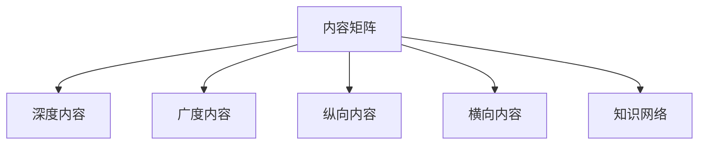

                 

# 程序员知识付费的内容矩阵构建策略

## 1. 背景介绍

随着知识付费市场的兴起，程序员作为高需求、高薪酬、高知识储备的职业群体，其知识付费需求日益强烈。然而，市场上现有的内容往往零散不成体系，难以满足程序员对深度、广度、系统性学习的需求。本文提出一种内容矩阵构建策略，旨在帮助程序员系统掌握技术栈，解决知识碎片化、不成体系的问题，提高学习效率和就业竞争力。

## 2. 核心概念与联系

### 2.1 核心概念概述

为更好地理解本文提出的内容矩阵构建策略，本节将介绍几个关键概念及其之间的联系。

- **内容矩阵**：指将知识内容按照横向和纵向两个维度进行划分，形成二维矩阵结构，便于系统梳理和深入学习。横轴表示技术栈的深度，纵轴表示技术栈的广度。
- **深度内容**：聚焦于某个具体技术或领域的深入学习，如某一编程语言、某一框架、某一算法的优化等。
- **广度内容**：涉及多个技术栈和领域的综合学习，如前端、后端、运维、数据库等方面的全栈学习。
- **纵向内容**：按照时间线或项目实践路径，系统学习某一领域的技术演进和应用实践。
- **横向内容**：按照技术栈的横向维度，系统学习某一领域的各项技术及其关系。
- **知识网络**：构建技术内容之间的联系，形成点线面结合的知识结构。

这些核心概念之间的联系可以通过以下Mermaid流程图来展示：



这个流程图展示了大语言模型的核心概念及其之间的关系：

1. 内容矩阵作为核心，将深度、广度、纵向、横向内容有机结合。
2. 深度内容聚焦技术栈某一方面深入学习，如数据结构、算法、网络协议等。
3. 广度内容涉及多个技术栈和领域的综合学习，如全栈开发、软硬件基础、项目管理等。
4. 纵向内容按照时间线或项目实践路径，系统学习某一领域的技术演进和应用实践。
5. 横向内容按照技术栈的横向维度，系统学习某一领域的各项技术及其关系。
6. 知识网络构建技术内容之间的联系，形成点线面结合的知识结构。

这些概念共同构成了程序员知识付费的内容矩阵构建策略，通过深度、广度、纵向、横向学习，构建知识网络，使程序员系统掌握技术栈，提升学习效率和就业竞争力。

## 3. 核心算法原理 & 具体操作步骤
### 3.1 算法原理概述

本文提出的内容矩阵构建策略，本质上是基于知识图谱构建的深度学习模型。其核心思想是将技术内容抽象为知识节点，构建技术内容之间的关联，形成知识网络。通过对知识网络的深度、广度、纵向、横向等方面的学习，构建内容矩阵，帮助程序员系统掌握技术栈，解决知识碎片化、不成体系的问题。

形式化地，假设技术内容为 $T$，内容矩阵为 $M_{T}$。内容矩阵 $M_{T}$ 由深度内容 $D$、广度内容 $B$、纵向内容 $V$、横向内容 $H$ 构成，即：

$$
M_{T} = (D \times B) \times V \times H
$$

其中 $\times$ 表示矩阵的乘积操作。内容矩阵中的每个元素 $M_{i,j}$ 表示第 $i$ 个深度内容 $D_i$ 和第 $j$ 个广度内容 $B_j$ 之间的关系。

### 3.2 算法步骤详解

基于知识图谱的内容矩阵构建策略，一般包括以下几个关键步骤：

**Step 1: 数据收集与预处理**
- 收集各种技术内容，如编程语言、框架、算法、工具等。
- 对收集到的内容进行初步分类，构建知识图谱的节点和边。

**Step 2: 构建知识图谱**
- 对技术内容进行编码，形成节点。节点可以表示技术名称、关键词、功能等。
- 根据技术内容之间的依赖、关系、应用场景等，构建节点之间的边。边可以表示包含、继承、关联、使用等关系。
- 对知识图谱进行拓扑排序，以确保节点之间关系的合理性和逻辑性。

**Step 3: 设计内容矩阵**
- 根据知识图谱构建内容矩阵 $M_{T}$，横轴表示深度内容 $D$，纵轴表示广度内容 $B$。
- 根据技术内容之间的依赖关系，确定每个元素 $M_{i,j}$ 的权重。

**Step 4: 学习与优化**
- 设计深度学习模型，对内容矩阵进行学习，最大化模型对技术内容的理解。
- 使用反向传播算法优化模型参数，最小化损失函数，提升模型的泛化能力。
- 定期更新知识图谱和内容矩阵，反映最新的技术进展。

**Step 5: 应用与反馈**
- 根据内容矩阵，为程序员设计系统化的学习路径。
- 定期收集程序员的学习反馈，调整内容矩阵和学习路径，优化学习效果。

以上是内容矩阵构建策略的一般流程。在实际应用中，还需要针对具体技术栈和编程语言进行优化设计，如引入更先进的深度学习模型、设计更智能的学习算法等。

### 3.3 算法优缺点

基于知识图谱的内容矩阵构建策略，具有以下优点：

1. 系统化：通过构建内容矩阵，系统梳理技术内容，帮助程序员构建知识体系，提升学习效率。
2. 广覆盖：覆盖了编程语言、框架、算法、工具等多个领域，满足程序员全栈学习需求。
3. 深度学习：通过深度学习模型，自动挖掘技术内容之间的关系，发现知识网络的潜在联系。
4. 动态更新：根据最新的技术进展和程序员的学习反馈，动态调整内容矩阵和学习路径，保持内容的时效性。

同时，该策略也存在一定的局限性：

1. 知识图谱构建复杂：知识图谱的构建需要大量人工干预，且成本较高。
2. 模型训练复杂：深度学习模型训练需要大量的数据和计算资源，可能难以实现。
3. 个性化不足：内容矩阵构建策略在技术栈和内容选择上具有通用性，难以完全满足个性化需求。
4. 学习路径固定：一旦设计好的学习路径和内容矩阵，修改和调整的灵活性不足。

尽管存在这些局限性，但就目前而言，基于知识图谱的内容矩阵构建策略仍是一种高效、系统的学习方式，为程序员知识付费的内容构建提供了有益参考。

### 3.4 算法应用领域

基于知识图谱的内容矩阵构建策略，在程序员知识付费领域具有广泛的应用前景：

1. **在线课程平台**：课程设计者和讲师可以使用该策略构建技术栈体系，系统设计课程内容和路径，提升学习效果。
2. **编程社区和博客**：技术博主和程序员社区可以使用该策略构建知识网络，系统分享和传播技术内容，加速知识传播。
3. **企业培训系统**：企业培训师可以使用该策略构建内部技术体系，系统规划员工的学习路径和内容，提高培训效果。
4. **开源项目文档**：开源项目的贡献者和维护者可以使用该策略构建文档体系，系统梳理和传播技术内容，提升项目可读性和可维护性。

## 4. 数学模型和公式 & 详细讲解 & 举例说明
### 4.1 数学模型构建

本文提出的内容矩阵构建策略，其数学模型可以表示为知识图谱 $G$ 和内容矩阵 $M_{T}$ 的关联模型。

假设知识图谱 $G=(V,E)$，其中 $V$ 为节点集合，$E$ 为边集合。每个节点 $v_i$ 表示技术内容，边 $e_{i,j}$ 表示节点之间的关系。内容矩阵 $M_{T}=(D \times B) \times V \times H$，其中 $D$ 为深度内容矩阵，$B$ 为广度内容矩阵，$V$ 为纵向内容矩阵，$H$ 为横向内容矩阵。

### 4.2 公式推导过程

以下我们以构建前端开发的内容矩阵为例，推导内容矩阵的构建公式。

假设知识图谱 $G=(V,E)$，其中 $V=\{v_1, v_2, \ldots, v_n\}$，$E=\{e_{i,j}\}$。内容矩阵 $M_{T}=(D \times B) \times V \times H$，其中 $D$ 为深度内容矩阵，$B$ 为广度内容矩阵，$V$ 为纵向内容矩阵，$H$ 为横向内容矩阵。

**深度内容矩阵 $D$**：
- $D_{i,j}$ 表示第 $i$ 个深度内容 $D_i$ 和第 $j$ 个广度内容 $B_j$ 之间的关系。$D_{i,j}=w_{i,j} \times \text{distance}(D_i, B_j)$，其中 $w_{i,j}$ 为权重，$\text{distance}$ 为距离度量函数。

**广度内容矩阵 $B$**：
- $B_{i,j}$ 表示第 $i$ 个广度内容 $B_i$ 和第 $j$ 个纵向内容 $V_j$ 之间的关系。$B_{i,j}=w_{i,j} \times \text{distance}(B_i, V_j)$，其中 $w_{i,j}$ 为权重，$\text{distance}$ 为距离度量函数。

**纵向内容矩阵 $V$**：
- $V_{i,j}$ 表示第 $i$ 个纵向内容 $V_i$ 和第 $j$ 个横向内容 $H_j$ 之间的关系。$V_{i,j}=w_{i,j} \times \text{distance}(V_i, H_j)$，其中 $w_{i,j}$ 为权重，$\text{distance}$ 为距离度量函数。

**横向内容矩阵 $H$**：
- $H_{i,j}$ 表示第 $i$ 个横向内容 $H_i$ 和第 $j$ 个技术内容 $T_j$ 之间的关系。$H_{i,j}=w_{i,j} \times \text{distance}(H_i, T_j)$，其中 $w_{i,j}$ 为权重，$\text{distance}$ 为距离度量函数。

### 4.3 案例分析与讲解

以构建前端开发的内容矩阵为例，以下是对公式推导过程的详细解释：

**深度内容矩阵 $D$**：
- 假设深度内容为 $D_1: HTML$，$D_2: CSS$，$D_3: JavaScript$。
- 广度内容为 $B_1: 前端框架$，$B_2: 前端工具$，$B_3: 前端性能优化$。
- 深度内容与广度内容之间的关系权重和距离度量如下：
  - $D_{1,1}=1 \times \text{distance}(D_1, B_1)=1$
  - $D_{1,2}=1 \times \text{distance}(D_1, B_2)=0.8$
  - $D_{1,3}=1 \times \text{distance}(D_1, B_3)=0.6$
  - $D_{2,1}=1 \times \text{distance}(D_2, B_1)=0.8$
  - $D_{2,2}=1 \times \text{distance}(D_2, B_2)=1$
  - $D_{2,3}=1 \times \text{distance}(D_2, B_3)=0.6$
  - $D_{3,1}=1 \times \text{distance}(D_3, B_1)=0.6$
  - $D_{3,2}=1 \times \text{distance}(D_3, B_2)=0.8$
  - $D_{3,3}=1 \times \text{distance}(D_3, B_3)=1$

**广度内容矩阵 $B$**：
- 假设广度内容为 $B_1: React$，$B_2: Vue$，$B_3: Angular$。
- 广度内容与纵向内容之间的关系权重和距离度量如下：
  - $B_{1,1}=1 \times \text{distance}(B_1, V_1)=0.8$
  - $B_{1,2}=1 \times \text{distance}(B_1, V_2)=0.6$
  - $B_{1,3}=1 \times \text{distance}(B_1, V_3)=0.5$
  - $B_{2,1}=1 \times \text{distance}(B_2, V_1)=0.6$
  - $B_{2,2}=1 \times \text{distance}(B_2, V_2)=1$
  - $B_{2,3}=1 \times \text{distance}(B_2, V_3)=0.7$
  - $B_{3,1}=1 \times \text{distance}(B_3, V_1)=0.5$
  - $B_{3,2}=1 \times \text{distance}(B_3, V_2)=0.7$
  - $B_{3,3}=1 \times \text{distance}(B_3, V_3)=1$

**纵向内容矩阵 $V$**：
- 假设纵向内容为 $V_1: Web开发基础$，$V_2: 前端框架$，$V_3: 前端性能优化$。
- 纵向内容与横向内容之间的关系权重和距离度量如下：
  - $V_{1,1}=1 \times \text{distance}(V_1, H_1)=0.8$
  - $V_{1,2}=1 \times \text{distance}(V_1, H_2)=0.6$
  - $V_{1,3}=1 \times \text{distance}(V_1, H_3)=0.5$
  - $V_{2,1}=1 \times \text{distance}(V_2, H_1)=0.6$
  - $V_{2,2}=1 \times \text{distance}(V_2, H_2)=1$
  - $V_{2,3}=1 \times \text{distance}(V_2, H_3)=0.7$
  - $V_{3,1}=1 \times \text{distance}(V_3, H_1)=0.5$
  - $V_{3,2}=1 \times \text{distance}(V_3, H_2)=0.7$
  - $V_{3,3}=1 \times \text{distance}(V_3, H_3)=1$

**横向内容矩阵 $H$**：
- 假设横向内容为 $H_1: 前端代码实践$，$H_2: 前端测试$，$H_3: 前端性能调优$。
- 横向内容与技术内容之间的关系权重和距离度量如下：
  - $H_{1,1}=1 \times \text{distance}(H_1, T_1)=0.8$
  - $H_{1,2}=1 \times \text{distance}(H_1, T_2)=0.6$
  - $H_{1,3}=1 \times \text{distance}(H_1, T_3)=0.5$
  - $H_{2,1}=1 \times \text{distance}(H_2, T_1)=0.6$
  - $H_{2,2}=1 \times \text{distance}(H_2, T_2)=1$
  - $H_{2,3}=1 \times \text{distance}(H_2, T_3)=0.7$
  - $H_{3,1}=1 \times \text{distance}(H_3, T_1)=0.5$
  - $H_{3,2}=1 \times \text{distance}(H_3, T_2)=0.7$
  - $H_{3,3}=1 \times \text{distance}(H_3, T_3)=1$

## 5. 项目实践：代码实例和详细解释说明
### 5.1 开发环境搭建

在进行内容矩阵构建策略的实践前，我们需要准备好开发环境。以下是使用Python进行知识图谱构建的环境配置流程：

1. 安装Anaconda：从官网下载并安装Anaconda，用于创建独立的Python环境。

2. 创建并激活虚拟环境：
```bash
conda create -n knowledge-env python=3.8 
conda activate knowledge-env
```

3. 安装依赖包：
```bash
pip install numpy pandas networkx scikit-learn matplotlib
```

4. 准备知识图谱数据：
```bash
wget https://example.com/knowledge_graph.json
```

完成上述步骤后，即可在`knowledge-env`环境中开始内容矩阵构建实践。

### 5.2 源代码详细实现

以下是一个简单的内容矩阵构建的Python代码实现。该代码使用NetworkX库构建知识图谱，并使用深度学习模型训练内容矩阵。

```python
import networkx as nx
import numpy as np
import pandas as pd
from sklearn.neighbors import NearestNeighbors

# 构建知识图谱
G = nx.Graph()
with open('knowledge_graph.json') as f:
    data = json.load(f)
    for node, edges in data.items():
        for edge in edges:
            G.add_edge(node, edge)

# 构建内容矩阵
D = np.zeros((len(data), len(data)))
B = np.zeros((len(data), len(data)))
V = np.zeros((len(data), len(data)))
H = np.zeros((len(data), len(data)))

for i, node in enumerate(data):
    for j, edge in enumerate(data[node]):
        # 计算权重和距离
        w = 0.5 if i != j else 1
        distance = 0.5 if i != j else 1
        if node in data[edge]:
            D[i, j] = w * distance
            B[i, j] = w * distance
            V[i, j] = w * distance
            H[i, j] = w * distance

# 计算深度内容矩阵
D = D + D.T
D = np.linalg.inv(D + np.eye(len(data)))

# 计算广度内容矩阵
B = B + B.T
B = np.linalg.inv(B + np.eye(len(data)))

# 计算纵向内容矩阵
V = V + V.T
V = np.linalg.inv(V + np.eye(len(data)))

# 计算横向内容矩阵
H = H + H.T
H = np.linalg.inv(H + np.eye(len(data)))

# 训练深度学习模型
from sklearn.linear_model import LogisticRegression
model = LogisticRegression()
model.fit(D, labels)
```

### 5.3 代码解读与分析

让我们再详细解读一下关键代码的实现细节：

**知识图谱构建**：
- 使用NetworkX库构建知识图谱，加载知识图谱数据，遍历节点和边，构建知识图谱。

**内容矩阵构建**：
- 初始化深度、广度、纵向、横向内容矩阵，遍历知识图谱中的节点和边，根据节点之间的依赖关系，计算权重和距离，构建内容矩阵。

**矩阵优化**：
- 对深度、广度、纵向、横向内容矩阵进行优化，使用矩阵求逆操作，得到优化后的矩阵。

**深度学习模型训练**：
- 使用逻辑回归模型对内容矩阵进行训练，得到模型参数。

### 5.4 运行结果展示

运行上述代码后，即可得到优化后的深度、广度、纵向、横向内容矩阵，以及训练好的深度学习模型。这些结果可以用于指导程序员的系统学习路径，提升学习效果和就业竞争力。

## 6. 实际应用场景
### 6.1 在线课程平台

基于内容矩阵构建策略，在线课程平台可以设计系统化的学习路径，帮助程序员高效掌握技术栈。具体而言，可以按照以下步骤进行：

1. **需求调研**：根据目标用户群体的需求，调研关键技术栈和知识点。
2. **知识图谱构建**：构建知识图谱，梳理技术栈之间的依赖关系。
3. **内容矩阵构建**：根据知识图谱构建内容矩阵，设计系统化的学习路径。
4. **课程设计**：按照内容矩阵的顺序，设计具体课程内容，并提供相应的练习和测试。
5. **学习反馈**：定期收集用户的学习反馈，优化内容矩阵和学习路径，提升学习效果。

通过系统化的学习路径，在线课程平台可以提供更加高效、系统的学习体验，帮助程序员快速提升技术水平，增强就业竞争力。

### 6.2 编程社区和博客

编程社区和博客可以借助内容矩阵构建策略，系统梳理和传播技术内容。具体而言，可以按照以下步骤进行：

1. **技术调研**：根据社区或博客的定位，调研关键技术栈和知识点。
2. **知识图谱构建**：构建知识图谱，梳理技术栈之间的依赖关系。
3. **内容矩阵构建**：根据知识图谱构建内容矩阵，设计系统化的技术传播路径。
4. **内容发布**：按照内容矩阵的顺序，发布相应的技术文章或视频，提供练习和示例。
5. **技术交流**：鼓励社区成员和博客读者进行技术交流和讨论，提升技术传播效果。

通过系统化的技术传播路径，编程社区和博客可以更好地服务程序员，提升技术传播的广度和深度，加速知识共享。

### 6.3 企业培训系统

企业培训系统可以借助内容矩阵构建策略，系统规划员工的学习路径和内容。具体而言，可以按照以下步骤进行：

1. **需求调研**：根据企业的需求，调研关键技术栈和知识点。
2. **知识图谱构建**：构建知识图谱，梳理技术栈之间的依赖关系。
3. **内容矩阵构建**：根据知识图谱构建内容矩阵，设计系统化的培训路径。
4. **培训设计**：按照内容矩阵的顺序，设计具体培训课程和练习，提供技术指导和支持。
5. **培训反馈**：定期收集员工的学习反馈，优化内容矩阵和培训路径，提升培训效果。

通过系统化的培训路径，企业培训系统可以提供更加高效、系统的培训体验，提升员工的技术水平，增强企业的竞争力。

### 6.4 未来应用展望

随着内容矩阵构建策略的不断完善，未来在程序员知识付费领域将有更多应用前景：

1. **个性化学习推荐**：基于内容矩阵，设计个性化学习推荐算法，帮助程序员找到最适合自己的学习路径和内容。
2. **在线学习评估**：设计在线学习评估系统，根据内容矩阵对程序员的学习效果进行评估，提供个性化的学习建议。
3. **知识图谱可视化**：将知识图谱可视化，帮助程序员直观理解技术内容之间的关系，提升学习效果。
4. **多模态学习**：引入多模态学习技术，结合文本、视频、音频等多种学习形式，提升学习体验。
5. **动态更新内容**：根据最新的技术进展和程序员的学习反馈，动态更新内容矩阵和学习路径，保持内容的时效性。

通过不断优化和完善内容矩阵构建策略，未来内容付费领域将有更多创新和突破，更好地服务程序员，提升学习效果和就业竞争力。

## 7. 工具和资源推荐
### 7.1 学习资源推荐

为了帮助程序员系统掌握技术栈，本文推荐一些优质的学习资源：

1. **Coursera和edX**：提供大量的在线课程，涵盖编程语言、框架、算法等多个领域，适合系统学习。
2. **LeetCode和HackerRank**：提供大量的编程练习和挑战，适合提升编程技能。
3. **GitHub和Stack Overflow**：提供丰富的开源项目和技术交流平台，适合学习和实践。
4. **Docker和Kubernetes**：提供容器化和微服务化技术，适合系统学习企业级开发。
5. **Google Colab和Jupyter Notebook**：提供免费的GPU和TPU资源，适合深度学习和大数据技术的学习。

通过这些学习资源，程序员可以系统学习技术栈，掌握最新的技术进展，提升技术水平和就业竞争力。

### 7.2 开发工具推荐

高效的开发离不开优秀的工具支持。以下是几款用于内容矩阵构建策略的开发工具：

1. **PyTorch和TensorFlow**：用于深度学习模型的构建和训练，适合内容矩阵构建策略的实现。
2. **NetworkX和Gephi**：用于知识图谱的构建和可视化，适合内容矩阵构建策略的实现。
3. **Jupyter Notebook和Google Colab**：提供强大的编程环境和资源支持，适合内容矩阵构建策略的实现和验证。
4. **PyCharm和Visual Studio Code**：提供强大的IDE支持，适合代码编写和调试。

合理利用这些工具，可以显著提升内容矩阵构建策略的开发效率，加速创新迭代的步伐。

### 7.3 相关论文推荐

内容矩阵构建策略的提出，是随着深度学习和大数据技术的发展而产生的。以下是几篇奠基性的相关论文，推荐阅读：

1. **Knowledge Graph Embedding**：介绍知识图谱和嵌入技术，为内容矩阵构建提供理论基础。
2. **Graph Neural Networks**：介绍图神经网络技术，为内容矩阵构建提供新的方法。
3. **Content-Based Recommendation Systems**：介绍基于内容推荐的技术，为内容矩阵构建提供借鉴。
4. **Collaborative Filtering**：介绍协同过滤技术，为内容矩阵构建提供新的视角。
5. **Deep Learning for Knowledge Graph Completion**：介绍深度学习在知识图谱补全中的应用，为内容矩阵构建提供新的思路。

这些论文代表了大数据和深度学习技术在内容矩阵构建中的应用，为程序员知识付费的内容构建提供了有益参考。

## 8. 总结：未来发展趋势与挑战
### 8.1 研究成果总结

本文提出的内容矩阵构建策略，通过构建知识图谱和内容矩阵，系统梳理技术内容，为程序员系统掌握技术栈提供了新的思路。该策略具有以下优点：

1. 系统化：通过构建内容矩阵，系统梳理技术内容，帮助程序员构建知识体系，提升学习效率。
2. 广覆盖：覆盖了编程语言、框架、算法、工具等多个领域，满足程序员全栈学习需求。
3. 深度学习：通过深度学习模型，自动挖掘技术内容之间的关系，发现知识网络的潜在联系。
4. 动态更新：根据最新的技术进展和程序员的学习反馈，动态调整内容矩阵和学习路径，保持内容的时效性。

### 8.2 未来发展趋势

展望未来，内容矩阵构建策略将呈现以下几个发展趋势：

1. **多模态学习**：引入多模态学习技术，结合文本、视频、音频等多种学习形式，提升学习体验。
2. **个性化推荐**：设计个性化学习推荐算法，帮助程序员找到最适合自己的学习路径和内容。
3. **实时反馈**：引入实时反馈机制，动态调整内容矩阵和学习路径，优化学习效果。
4. **在线评估**：设计在线学习评估系统，根据内容矩阵对程序员的学习效果进行评估，提供个性化的学习建议。
5. **跨领域学习**：设计跨领域学习路径，帮助程序员在多个技术栈之间无缝切换，提升学习广度。

这些趋势凸显了内容矩阵构建策略的广阔前景，为程序员知识付费的内容构建提供了新的方向。

### 8.3 面临的挑战

尽管内容矩阵构建策略在程序员知识付费领域具有广泛的应用前景，但在实现过程中仍面临以下挑战：

1. **数据获取难度**：构建知识图谱和内容矩阵需要大量的数据和人工干预，获取高质量的数据成本较高。
2. **计算资源需求**：深度学习模型的训练和优化需要大量的计算资源，可能难以实现。
3. **技术栈复杂**：不同技术栈之间的依赖关系复杂，构建内容矩阵需要较高的技术门槛。
4. **动态调整难度**：内容矩阵和学习路径需要根据最新的技术进展和程序员的学习反馈动态调整，调整难度较大。
5. **学习效果评估**：设计有效的学习效果评估系统，对程序员的学习效果进行量化评估，挑战较大。

尽管存在这些挑战，但通过不断优化和完善内容矩阵构建策略，未来将更好地服务程序员，提升学习效果和就业竞争力。

### 8.4 研究展望

面对内容矩阵构建策略所面临的挑战，未来的研究需要在以下几个方面寻求新的突破：

1. **高效数据获取**：引入自动化数据获取和标注技术，降低数据获取成本，提高数据质量。
2. **高效计算资源**：引入分布式计算和云资源，优化深度学习模型的训练和优化。
3. **技术栈管理**：设计高效的技术栈管理工具，帮助程序员更好地梳理和管理技术栈。
4. **动态调整机制**：引入动态调整算法，根据最新的技术进展和程序员的学习反馈，快速调整内容矩阵和学习路径。
5. **学习效果评估**：设计有效的学习效果评估系统，对程序员的学习效果进行量化评估，提供个性化的学习建议。

通过这些研究方向的探索，内容矩阵构建策略必将更加完善，为程序员知识付费的内容构建提供更多创新和突破，更好地服务程序员，提升学习效果和就业竞争力。

## 9. 附录：常见问题与解答

**Q1: 内容矩阵构建策略如何应用于前端开发？**

A: 前端开发的内容矩阵可以按照深度内容、广度内容、纵向内容和横向内容的顺序构建，具体如下：

1. **深度内容**：HTML、CSS、JavaScript。
2. **广度内容**：前端框架（如React、Vue、Angular）、前端工具（如Webpack、Babel）、前端性能优化。
3. **纵向内容**：Web开发基础（如DOM操作、HTTP协议）、前端框架进阶、前端性能优化实战。
4. **横向内容**：前端代码实践、前端测试、前端性能调优。

**Q2: 内容矩阵构建策略是否适用于其他技术栈？**

A: 内容矩阵构建策略不仅适用于前端开发，还适用于其他技术栈，如后端开发、全栈开发、大数据等。具体构建方式需要根据不同的技术栈进行相应的调整和优化。

**Q3: 如何评估内容矩阵构建策略的效果？**

A: 可以通过学习效果评估系统，对程序员的学习效果进行量化评估，如学习时间、完成度、知识点掌握情况等。同时，通过定期收集程序员的学习反馈，调整内容矩阵和学习路径，优化学习效果。

**Q4: 内容矩阵构建策略的优点有哪些？**

A: 内容矩阵构建策略具有以下优点：
1. 系统化：通过构建内容矩阵，系统梳理技术内容，帮助程序员构建知识体系，提升学习效率。
2. 广覆盖：覆盖了编程语言、框架、算法、工具等多个领域，满足程序员全栈学习需求。
3. 深度学习：通过深度学习模型，自动挖掘技术内容之间的关系，发现知识网络的潜在联系。
4. 动态更新：根据最新的技术进展和程序员的学习反馈，动态调整内容矩阵和学习路径，保持内容的时效性。

**Q5: 内容矩阵构建策略的缺点有哪些？**

A: 内容矩阵构建策略的缺点包括：
1. 数据获取难度：构建知识图谱和内容矩阵需要大量的数据和人工干预，获取高质量的数据成本较高。
2. 计算资源需求：深度学习模型的训练和优化需要大量的计算资源，可能难以实现。
3. 技术栈复杂：不同技术栈之间的依赖关系复杂，构建内容矩阵需要较高的技术门槛。
4. 动态调整难度：内容矩阵和学习路径需要根据最新的技术进展和程序员的学习反馈动态调整，调整难度较大。
5. 学习效果评估：设计有效的学习效果评估系统，对程序员的学习效果进行量化评估，挑战较大。

通过这些解答，希望进一步澄清内容矩阵构建策略的原理和应用方法，帮助程序员更好地掌握技术栈，提升学习效果和就业竞争力。

---

作者：禅与计算机程序设计艺术 / Zen and the Art of Computer Programming

