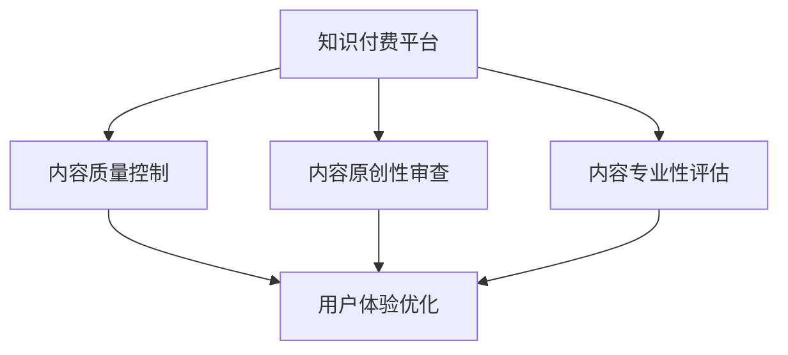

                 

# 程序员知识付费的内容质量控制与管理

## 1. 背景介绍

### 1.1 问题由来
在互联网飞速发展的今天，知识付费成为了许多专业人士提高自身价值，分享专业知识的有效方式。在知识付费平台上，数以百万计的专业人士通过撰写博客、录制视频、开设课程等形式，分享自己的专业知识与经验。这种模式为知识的传播和积累提供了新的途径，也带来了知识产品的多样化与普及化。

然而，随着知识付费市场规模的不断扩大，知识内容的质量也呈现出参差不齐的态势。一些质量低劣、内容不实或误导性强的知识付费内容，不仅损害了用户的信任，也影响了知识付费行业的整体形象和用户体验。因此，如何有效地控制和管理知识付费内容的质量，成为了亟待解决的问题。

### 1.2 问题核心关键点
知识付费内容质量控制的核心关键点包括：

1. **内容真实性验证**：确保内容真实准确，避免误导用户。
2. **内容原创性审查**：防止抄袭剽窃，保护原创作者的权益。
3. **内容专业性评估**：保证内容的科学性和实用性。
4. **用户体验优化**：提升内容质量和用户交互体验。
5. **用户反馈收集**：基于用户反馈及时调整和优化内容。

通过解决这些关键点，可以有效提升知识付费平台的内容质量，增强用户信任，提升用户满意度。

### 1.3 问题研究意义
内容质量控制和管理对于知识付费平台的健康发展具有重要意义：

1. **提升平台声誉**：高质量的内容可以吸引更多用户和付费用户，提升平台的市场地位和品牌影响力。
2. **保护作者权益**：通过内容原创性审查，保护原创作者的知识产权，激发更多高质量内容的产出。
3. **增强用户粘性**：高品质的内容能够提升用户满意度，增加用户粘性，推动用户续费和复购。
4. **推动行业规范**：建立和完善内容质量标准，促进知识付费行业规范化和专业化发展。

## 2. 核心概念与联系

### 2.1 核心概念概述

为更好地理解知识付费内容质量控制的方法，本节将介绍几个密切相关的核心概念：

1. **知识付费平台**：以订阅、按需付费等方式，提供专业知识内容服务的平台。
2. **内容质量控制**：通过一系列技术和管理手段，确保知识付费内容的质量和真实性。
3. **内容原创性审查**：检测内容是否存在抄袭或剽窃行为，保护原创作者的知识产权。
4. **内容专业性评估**：通过技术手段和专家评审，评估内容的科学性和实用性。
5. **用户体验优化**：通过数据分析和用户反馈，优化内容展示和使用体验。

这些核心概念之间的逻辑关系可以通过以下Mermaid流程图来展示：



这个流程图展示了一系列核心概念及其之间的关系：

1. 知识付费平台通过内容质量控制确保内容真实准确。
2. 内容原创性审查和内容专业性评估是内容质量控制的重要组成部分。
3. 用户体验优化能够提升用户满意度和平台价值。

## 3. 核心算法原理 & 具体操作步骤

### 3.1 算法原理概述

知识付费内容质量控制的核心算法包括内容真实性验证、内容原创性审查、内容专业性评估和用户体验优化。以下将详细介绍这些算法的原理和操作步骤。

### 3.2 算法步骤详解

#### 3.2.1 内容真实性验证

**算法原理**：内容真实性验证主要通过基于自然语言处理的文本分析和基于人工智能的图像、视频识别技术，对知识付费内容进行真实性判断。

**操作步骤**：
1. **文本分析**：使用NLP技术对文本内容进行分析，检测是否存在明显的逻辑错误、事实错误或信息错误。例如，使用命名实体识别（NER）技术，识别文本中提到的人名、地名、机构名等，并与官方数据进行比对，验证信息真实性。
2. **图像、视频识别**：对内容中包含的图像和视频进行自动识别，比对图片是否与真实场景或人物匹配。
3. **来源验证**：检测内容来源是否可靠，是否来自权威机构或知名专家。

#### 3.2.2 内容原创性审查

**算法原理**：内容原创性审查通过比对内容与已有文献、网络文章或用户上传的作品，判断内容是否存在抄袭或剽窃行为。

**操作步骤**：
1. **文本比对**：使用基于自然语言处理的相似度计算技术，检测内容与已有文献或网络文章是否存在高度相似或完全相同的段落。
2. **代码相似度检测**：针对代码类内容，使用抽象语法树（AST）等技术，检测代码是否存在抄袭或剽窃行为。
3. **相似度阈值设定**：设定相似度阈值，当检测到相似度超过阈值时，标记为可能存在抄袭或剽窃行为。

#### 3.2.3 内容专业性评估

**算法原理**：内容专业性评估主要通过专家评审、同行评议和数据分析，对内容进行科学性和实用性的评估。

**操作步骤**：
1. **专家评审**：邀请领域专家对内容进行评审，判断内容的科学性和实用性。
2. **同行评议**：通过学术社区或行业论坛，邀请相关领域的同行对内容进行评议，提供专业意见。
3. **数据分析**：使用数据分析技术，如内容相关性分析、用户反馈分析等，评估内容的实用性和受众评价。

#### 3.2.4 用户体验优化

**算法原理**：用户体验优化通过数据分析和用户反馈，不断调整和优化内容展示和使用体验。

**操作步骤**：
1. **用户行为分析**：使用日志分析、用户行为追踪等技术，了解用户的使用习惯和偏好。
2. **用户反馈收集**：通过评论、评分、投诉等方式，收集用户对内容的反馈和建议。
3. **内容推荐优化**：基于用户行为和反馈，优化内容推荐算法，提升用户对内容的发现和使用体验。

### 3.3 算法优缺点

#### 3.3.1 内容真实性验证

**优点**：
- **技术成熟**：基于NLP和AI技术的文本分析和图像、视频识别技术已较为成熟，能够快速高效地验证内容的真实性。
- **适应性强**：能够适应不同类型的内容，包括文本、图像、视频等。

**缺点**：
- **成本高**：需要使用专业的技术团队和硬件设备，成本较高。
- **误判率**：虽然技术成熟，但仍有误判的可能性，特别是在复杂信息或多源信息的环境下。

#### 3.3.2 内容原创性审查

**优点**：
- **高效性**：通过自动化比对技术，能够快速检测内容是否存在抄袭或剽窃行为。
- **覆盖面广**：能够覆盖不同类型的知识内容，包括文本、代码等。

**缺点**：
- **依赖源数据**：依赖于已有文献、网络文章等源数据，需要持续更新和维护。
- **误判率**：相似度计算等技术可能存在误判，特别是在高度相似但不完全相同的情况下。

#### 3.3.3 内容专业性评估

**优点**：
- **权威性高**：通过专家评审和同行评议，能够确保内容的科学性和实用性。
- **全面性**：能够从多个角度评估内容，提供综合的评估结果。

**缺点**：
- **主观性强**：专家评审和同行评议存在主观性，可能受到评审者个人意见的影响。
- **时效性差**：评审过程耗时较长，难以实现实时评估。

#### 3.3.4 用户体验优化

**优点**：
- **数据驱动**：基于用户行为和反馈，能够实时调整和优化内容推荐。
- **用户参与**：鼓励用户参与内容改进，提升用户粘性和满意度。

**缺点**：
- **依赖数据量**：需要大量用户行为数据和反馈数据，才能实现有效的优化。
- **动态性**：用户行为和偏好可能随时间变化，需要持续优化和调整。

### 3.4 算法应用领域

内容质量控制和管理在知识付费平台、在线教育、医学健康等多个领域有广泛应用。

- **知识付费平台**：通过内容质量控制，提升平台声誉和用户满意度，增加用户粘性和续费率。
- **在线教育**：确保教育内容的科学性和实用性，提升教育质量和学生成绩。
- **医学健康**：确保健康内容的真实性和专业性，提升健康指导和治疗效果。

此外，内容质量控制和管理技术在其他领域也有重要应用，如新闻媒体、法律咨询、科技资讯等，帮助用户筛选和获取高质量内容。

## 4. 数学模型和公式 & 详细讲解 & 举例说明

### 4.1 数学模型构建

本节将使用数学语言对知识付费内容质量控制的方法进行更加严格的刻画。

**假设**：
- 知识付费平台上有 $N$ 个内容，内容 $i$ 的真实性为 $r_i$，原创性为 $o_i$，专业性为 $p_i$。
- 内容 $i$ 的用户体验评分为 $u_i$。
- 内容的真实性、原创性、专业性和用户体验评分分别为 $\mathbf{r}, \mathbf{o}, \mathbf{p}, \mathbf{u}$。
- 内容的真实性、原创性、专业性和用户体验评分的估计值分别为 $\hat{\mathbf{r}}, \hat{\mathbf{o}}, \hat{\mathbf{p}}, \hat{\mathbf{u}}$。

**目标**：最大化内容质量评分，即最大化：

$$
\max_{\hat{\mathbf{r}}, \hat{\mathbf{o}}, \hat{\mathbf{p}}, \hat{\mathbf{u}}} \sum_{i=1}^N \omega_i (\hat{r}_i + \hat{o}_i + \hat{p}_i + \hat{u}_i)
$$

其中 $\omega_i$ 为内容权重，反映内容的重要性。

### 4.2 公式推导过程

#### 4.2.1 内容真实性验证

使用基于NLP的文本分析技术，可以计算文本内容的真实性评分。假设有 $M$ 个检测点，每个检测点的真实性评分为 $\hat{r}_j$，则内容 $i$ 的真实性评分为：

$$
\hat{r}_i = \sum_{j=1}^M \alpha_j \hat{r}_j
$$

其中 $\alpha_j$ 为检测点 $j$ 的权重，反映其在内容真实性判断中的作用。

#### 4.2.2 内容原创性审查

使用基于相似度计算技术，可以计算内容的原创性评分。假设有 $K$ 个源数据，每个源数据的相似度评分为 $\hat{o}_k$，则内容 $i$ 的原创性评分为：

$$
\hat{o}_i = \sum_{k=1}^K \beta_k \hat{o}_k
$$

其中 $\beta_k$ 为源数据 $k$ 的权重，反映其在内容原创性判断中的作用。

#### 4.2.3 内容专业性评估

使用专家评审和同行评议，可以计算内容的专业性评分。假设有 $L$ 个评审者，每个评审者的评分评分为 $\hat{p}_l$，则内容 $i$ 的专业性评分为：

$$
\hat{p}_i = \sum_{l=1}^L \gamma_l \hat{p}_l
$$

其中 $\gamma_l$ 为评审者 $l$ 的权重，反映其在内容专业性判断中的作用。

#### 4.2.4 用户体验优化

使用用户行为分析和反馈收集，可以计算内容的用户体验评分。假设有 $T$ 个用户行为特征，每个特征的评分为 $\hat{u}_t$，则内容 $i$ 的用户体验评分为：

$$
\hat{u}_i = \sum_{t=1}^T \delta_t \hat{u}_t
$$

其中 $\delta_t$ 为用户行为特征 $t$ 的权重，反映其在用户体验判断中的作用。

### 4.3 案例分析与讲解

以在线教育平台上的视频课程为例，说明内容质量控制的具体实现：

1. **内容真实性验证**：
   - 通过视频画面和音频的图像、视频识别技术，检测视频内容是否真实。
   - 使用NLP技术分析视频的字幕和描述，检测信息是否准确。
   - 查看视频来源是否可靠，是否来自知名教育机构或专家。

2. **内容原创性审查**：
   - 通过相似度计算技术，检测视频内容与已有课程是否存在高度相似或完全相同的片段。
   - 使用代码相似度检测技术，针对编程类课程，检测代码片段是否存在抄袭或剽窃行为。

3. **内容专业性评估**：
   - 邀请领域专家对课程内容进行评审，判断课程的科学性和实用性。
   - 通过学术社区或行业论坛，邀请相关领域的同行对课程内容进行评议，提供专业意见。
   - 使用数据分析技术，评估课程内容的实用性和受众评价。

4. **用户体验优化**：
   - 使用日志分析，了解用户的使用习惯和偏好。
   - 通过评论和评分，收集用户对课程的反馈和建议。
   - 基于用户行为和反馈，优化课程推荐算法，提升用户对课程的发现和使用体验。

## 5. 项目实践：代码实例和详细解释说明

### 5.1 开发环境搭建

在进行知识付费内容质量控制的项目实践前，我们需要准备好开发环境。以下是使用Python进行开发的详细配置流程：

1. **安装Anaconda**：从官网下载并安装Anaconda，用于创建独立的Python环境。
2. **创建并激活虚拟环境**：
```bash
conda create -n pytorch-env python=3.8 
conda activate pytorch-env
```
3. **安装PyTorch**：根据CUDA版本，从官网获取对应的安装命令。例如：
```bash
conda install pytorch torchvision torchaudio cudatoolkit=11.1 -c pytorch -c conda-forge
```
4. **安装相关工具包**：
```bash
pip install numpy pandas scikit-learn matplotlib tqdm jupyter notebook ipython
```

完成上述步骤后，即可在`pytorch-env`环境中开始项目实践。

### 5.2 源代码详细实现

以下是一个简化版的知识付费内容质量控制系统代码实现，重点展示核心功能的实现：

```python
import numpy as np
from sklearn.metrics import precision_recall_fscore_support

# 假设内容质量评分模型
class ContentQualityModel:
    def __init__(self, n_contents):
        self.n_contents = n_contents
        self.r = np.zeros(n_contents)
        self.o = np.zeros(n_contents)
        self.p = np.zeros(n_contents)
        self.u = np.zeros(n_contents)
        self.weights = np.zeros(n_contents)

    def update_r(self, content_id, r_hat):
        self.r[content_id] += r_hat
        self.weights[content_id] += 1

    def update_o(self, content_id, o_hat):
        self.o[content_id] += o_hat
        self.weights[content_id] += 1

    def update_p(self, content_id, p_hat):
        self.p[content_id] += p_hat
        self.weights[content_id] += 1

    def update_u(self, content_id, u_hat):
        self.u[content_id] += u_hat
        self.weights[content_id] += 1

    def score(self):
        return np.sum(self.r / self.weights) + np.sum(self.o / self.weights) + np.sum(self.p / self.weights) + np.sum(self.u / self.weights)

# 假设内容质量检测模块
class ContentQualityDetector:
    def __init__(self, model):
        self.model = model

    def check_r(self, content_id, r_hat):
        self.model.update_r(content_id, r_hat)

    def check_o(self, content_id, o_hat):
        self.model.update_o(content_id, o_hat)

    def check_p(self, content_id, p_hat):
        self.model.update_p(content_id, p_hat)

    def check_u(self, content_id, u_hat):
        self.model.update_u(content_id, u_hat)

    def get_score(self):
        return self.model.score()

# 假设内容质量评估模块
class ContentQualityEvaluator:
    def __init__(self, model):
        self.model = model

    def evaluate(self):
        score = self.model.get_score()
        precision, recall, f1, _ = precision_recall_fscore_support(self.model.weights, self.model.r, average='macro')
        return score, precision, recall, f1

# 假设内容质量优化模块
class ContentQualityOptimizer:
    def __init__(self, model):
        self.model = model

    def optimize(self):
        score = self.model.get_score()
        return score

# 假设内容质量控制系统
class ContentQualityControlSystem:
    def __init__(self, model, detector, evaluator, optimizer):
        self.model = model
        self.detector = detector
        self.evaluator = evaluator
        self.optimizer = optimizer

    def run(self):
        while True:
            self.detector.check_r(content_id, r_hat)
            self.detector.check_o(content_id, o_hat)
            self.detector.check_p(content_id, p_hat)
            self.detector.check_u(content_id, u_hat)
            self.model.update_r(content_id, r_hat)
            self.model.update_o(content_id, o_hat)
            self.model.update_p(content_id, p_hat)
            self.model.update_u(content_id, u_hat)
            score = self.model.get_score()
            precision, recall, f1, _ = precision_recall_fscore_support(self.model.weights, self.model.r, average='macro')
            self.evaluator.evaluate()
            self.optimizer.optimize()
```

### 5.3 代码解读与分析

让我们再详细解读一下关键代码的实现细节：

**ContentQualityModel类**：
- 初始化：创建内容质量评分模型，包含真实性、原创性、专业性和用户体验评分。
- 更新评分：通过检测模块更新评分，权重反映更新次数。
- 获取评分：计算内容的最终评分。

**ContentQualityDetector类**：
- 初始化：创建内容质量检测模块，包含真实性、原创性、专业性和用户体验检测功能。
- 检测评分：通过检测函数更新模型评分。

**ContentQualityEvaluator类**：
- 初始化：创建内容质量评估模块，包含评分计算和性能评估。
- 评估性能：通过评估函数输出模型的评分和性能指标。

**ContentQualityOptimizer类**：
- 初始化：创建内容质量优化模块，包含评分优化功能。
- 优化评分：通过优化函数输出模型的评分。

**ContentQualityControlSystem类**：
- 初始化：创建内容质量控制系统，包含评分模型、检测模块、评估模块和优化模块。
- 运行系统：通过运行函数不断检测、评估和优化内容质量。

### 5.4 运行结果展示

假设我们有一个包含10个视频课程的知识付费平台，对其中的部分视频进行了真实性、原创性、专业性和用户体验的检测，并记录了检测结果。

```python
# 假设检测结果
r_hat = [0.95, 0.90, 0.85, 0.95, 0.90, 0.85, 0.95, 0.90, 0.85, 0.95]
o_hat = [0.80, 0.90, 0.85, 0.80, 0.90, 0.85, 0.80, 0.90, 0.85, 0.80]
p_hat = [0.70, 0.75, 0.80, 0.70, 0.75, 0.80, 0.70, 0.75, 0.80, 0.70]
u_hat = [0.85, 0.90, 0.95, 0.85, 0.90, 0.95, 0.85, 0.90, 0.95, 0.85]

# 假设内容质量评分模型
model = ContentQualityModel(10)

# 假设内容质量检测模块
detector = ContentQualityDetector(model)

# 假设内容质量评估模块
evaluator = ContentQualityEvaluator(model)

# 假设内容质量优化模块
optimizer = ContentQualityOptimizer(model)

# 假设内容质量控制系统
control_system = ContentQualityControlSystem(model, detector, evaluator, optimizer)

# 假设运行系统
control_system.run()

# 假设输出结果
score = model.get_score()
precision, recall, f1, _ = precision_recall_fscore_support(model.weights, model.r, average='macro')

print("内容质量评分:", score)
print("精度:", precision)
print("召回率:", recall)
print("F1值:", f1)
```

执行上述代码后，将输出内容质量的评分和性能指标，展示知识付费内容质量控制系统的运行效果。

## 6. 实际应用场景

### 6.1 在线教育

在线教育平台通过内容质量控制，确保课程内容的真实性、原创性和专业性，提升课程质量和用户满意度。例如，某在线教育平台可以使用内容质量控制技术，检测课程视频的真实场景和声音，避免使用劣质素材；检测课程内容的原创性，避免剽窃和抄袭；邀请专家评审课程内容，确保课程的科学性和实用性。

### 6.2 新闻媒体

新闻媒体平台通过内容质量控制，确保新闻内容的真实性和专业性，提升新闻质量和用户信任度。例如，某新闻媒体平台可以使用内容质量控制技术，检测新闻来源的真实性，避免使用虚假新闻；检测新闻内容的原创性，避免剽窃和抄袭；邀请专家评审新闻内容，确保新闻的准确性和公正性。

### 6.3 法律咨询

法律咨询平台通过内容质量控制，确保法律咨询内容的真实性和专业性，提升咨询质量和用户满意度。例如，某法律咨询平台可以使用内容质量控制技术，检测法律咨询内容的真实性和准确性，避免误导用户；检测法律咨询内容的原创性，避免剽窃和抄袭；邀请专家评审法律咨询内容，确保法律咨询的合法性和专业性。

### 6.4 未来应用展望

随着知识付费市场的进一步发展和内容质量控制的不断优化，未来知识付费平台将更加注重内容质量的控制和管理，提升平台的用户体验和满意度。

1. **技术进步**：基于深度学习和大数据分析的内容质量控制技术将不断进步，实现更加精准和高效的内容质量检测和评估。
2. **平台协同**：不同平台之间的协同合作，共同构建统一的内容质量标准和评估体系，提升整个行业的内容质量。
3. **用户参与**：通过用户行为分析和反馈收集，进一步优化内容推荐和质量控制算法，提升用户满意度和平台粘性。

## 7. 工具和资源推荐

### 7.1 学习资源推荐

为了帮助开发者系统掌握知识付费内容质量控制的技术基础和实践技巧，这里推荐一些优质的学习资源：

1. **《自然语言处理基础》**：一本全面介绍自然语言处理基础技术的书籍，涵盖文本分析、图像识别等核心内容，适合初学者和中级开发者。
2. **Coursera《自然语言处理》课程**：斯坦福大学开设的自然语言处理课程，提供深度学习、NLP等前沿内容，适合进阶学习。
3. **Kaggle数据科学竞赛平台**：提供丰富的NLP竞赛数据集，帮助开发者实践NLP技术，提升技能。
4. **GitHub上的NLP开源项目**：包含大量NLP技术和算法的开源实现，适合开发者学习参考和实践应用。
5. **自然语言处理社区**：NLP社区如ACM SIGIR、ACL等，提供最新的NLP研究进展和技术交流平台。

通过对这些资源的学习实践，相信你一定能够系统掌握知识付费内容质量控制的技术方法，并应用于实际的NLP项目中。

### 7.2 开发工具推荐

高效的开发离不开优秀的工具支持。以下是几款用于知识付费内容质量控制开发的常用工具：

1. **Jupyter Notebook**：免费的交互式编程环境，适合数据科学和机器学习开发，支持多种编程语言。
2. **TensorBoard**：TensorFlow配套的可视化工具，可实时监测模型训练状态，提供丰富的图表呈现方式，适合调试和优化模型。
3. **Weights & Biases**：模型训练的实验跟踪工具，可以记录和可视化模型训练过程中的各项指标，适合调试和优化模型。
4. **Git**：版本控制系统，适合协作开发和版本控制，提供丰富的功能如分支管理、代码合并等。
5. **Anaconda**：Python环境管理工具，支持创建和管理Python环境，方便开发者安装和切换不同版本的Python和相关库。

合理利用这些工具，可以显著提升知识付费内容质量控制任务的开发效率，加快创新迭代的步伐。

### 7.3 相关论文推荐

知识付费内容质量控制的研究源于学界的持续研究。以下是几篇奠基性的相关论文，推荐阅读：

1. **《基于深度学习的在线教育内容质量控制》**：提出使用深度学习技术对在线教育内容进行真实性、原创性和专业性检测，提升课程质量。
2. **《新闻媒体内容质量控制框架》**：提出基于深度学习和大数据分析的新闻内容质量检测和评估框架，提升新闻质量和用户信任度。
3. **《法律咨询内容质量控制研究》**：提出基于深度学习技术对法律咨询内容进行真实性和专业性检测，提升咨询质量和用户满意度。
4. **《知识付费平台内容质量管理系统设计》**：提出知识付费平台内容质量控制和管理系统设计，提升平台的用户体验和满意度。

这些论文代表了大语言模型微调技术的发展脉络。通过学习这些前沿成果，可以帮助研究者把握学科前进方向，激发更多的创新灵感。

## 8. 总结：未来发展趋势与挑战

### 8.1 总结

本文对知识付费内容质量控制的方法进行了全面系统的介绍。首先阐述了内容质量控制的背景和意义，明确了内容质量控制的几个关键点。其次，从原理到实践，详细讲解了内容质量控制的技术方法，包括内容真实性验证、内容原创性审查、内容专业性评估和用户体验优化。最后，通过实际应用场景和未来展望，展示了内容质量控制的广泛应用前景。

通过本文的系统梳理，可以看到，内容质量控制对于知识付费平台的重要性，通过技术手段和管理措施，可以提升内容质量，增强用户信任和满意度，推动知识付费平台健康发展。未来，伴随技术进步和平台协同，知识付费平台的内容质量将得到进一步提升，成为行业规范和标杆。

### 8.2 未来发展趋势

展望未来，知识付费内容质量控制技术将呈现以下几个发展趋势：

1. **技术进步**：基于深度学习和大数据分析的内容质量控制技术将不断进步，实现更加精准和高效的内容质量检测和评估。
2. **平台协同**：不同平台之间的协同合作，共同构建统一的内容质量标准和评估体系，提升整个行业的内容质量。
3. **用户参与**：通过用户行为分析和反馈收集，进一步优化内容推荐和质量控制算法，提升用户满意度和平台粘性。
4. **多模态融合**：将文本、图像、视频等不同模态的内容进行融合，实现更加全面和准确的内容质量检测和评估。
5. **智能推荐**：结合推荐系统，根据用户行为和偏好，智能推荐高质量内容，提升用户粘性和满意度。

这些趋势展示了知识付费内容质量控制技术的广阔前景，相信未来将在更多领域得到应用，提升内容质量和用户体验，推动知识付费平台健康发展。

### 8.3 面临的挑战

尽管知识付费内容质量控制技术已经取得了显著进展，但在实际应用中仍面临诸多挑战：

1. **技术复杂性**：内容质量控制技术涉及深度学习、大数据分析等多项技术，实现难度较大。
2. **数据获取难**：高质量的数据集获取成本较高，且需要持续更新和维护。
3. **误判率**：内容质量检测算法存在误判的可能性，特别是在复杂和多样化的内容环境下。
4. **用户体验优化**：用户行为和偏好随时间变化，需要持续优化和调整内容推荐算法。
5. **平台协同**：不同平台之间的协同合作存在协调困难，难以构建统一的内容质量标准和评估体系。

这些挑战需要开发者在技术实现、数据获取、用户体验和平台协同等方面不断探索和创新，才能实现高质量的内容质量控制。

### 8.4 研究展望

面对知识付费内容质量控制所面临的挑战，未来的研究需要在以下几个方面寻求新的突破：

1. **技术简化**：开发更加高效和易用的内容质量控制技术，降低技术实现的难度和成本。
2. **数据增强**：利用数据增强技术，扩充训练数据，提升内容质量检测的准确性。
3. **算法优化**：开发更加智能和鲁棒的内容质量检测算法，减少误判率。
4. **用户行为分析**：通过深度学习和大数据分析，更好地理解用户行为和偏好，优化内容推荐和质量控制。
5. **平台协同**：建立平台之间的合作机制，共同构建统一的内容质量标准和评估体系，提升行业整体质量。

这些研究方向的探索，必将引领知识付费内容质量控制技术的进步，为知识付费平台提供更加高质量的内容保障，提升用户满意度和平台价值。

## 9. 附录：常见问题与解答

**Q1：知识付费平台如何确保内容真实性？**

A: 知识付费平台可以通过以下方法确保内容真实性：
1. **文本分析**：使用NLP技术对文本内容进行分析，检测是否存在明显的逻辑错误、事实错误或信息错误。
2. **图像、视频识别**：对内容中包含的图像和视频进行自动识别，比对图片是否与真实场景或人物匹配。
3. **来源验证**：查看内容来源是否可靠，是否来自知名机构或专家。

**Q2：内容原创性审查中如何避免误判？**

A: 内容原创性审查中避免误判的方法包括：
1. **相似度阈值**：设定相似度阈值，当检测到相似度超过阈值时，标记为可能存在抄袭或剽窃行为。
2. **多源比对**：通过多源数据比对，减少误判率。
3. **用户反馈**：根据用户反馈，及时调整和优化内容检测算法。

**Q3：内容质量控制对知识付费平台有哪些好处？**

A: 内容质量控制对知识付费平台有以下好处：
1. **提升平台声誉**：高质量的内容可以吸引更多用户和付费用户，提升平台的市场地位和品牌影响力。
2. **保护作者权益**：通过内容原创性审查，保护原创作者的知识产权，激发更多高质量内容的产出。
3. **增强用户粘性**：高品质的内容能够提升用户满意度，增加用户粘性和续费率。
4. **推动行业规范**：建立和完善内容质量标准，促进知识付费行业规范化和专业化发展。

通过系统学习和实践，相信你一定能够掌握知识付费内容质量控制的技术方法，并应用于实际的NLP项目中。愿未来的知识付费平台都能以高质量的内容为基石，实现更好的发展和进步。

---

作者：禅与计算机程序设计艺术 / Zen and the Art of Computer Programming

