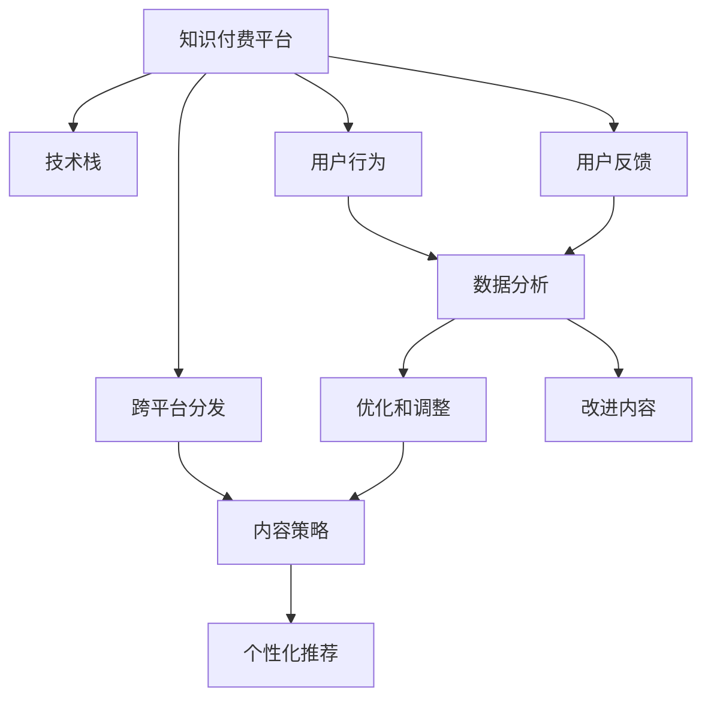

                 

# 程序员知识付费的跨平台内容分发策略

> 关键词：知识付费, 跨平台分发, 内容策略, 技术栈, 用户行为, 数据分析

## 1. 背景介绍

### 1.1 问题由来

在当今信息爆炸的时代，程序员面临的学习资源如海量化，如何高效地筛选和获取有价值的信息，已成为他们的一项重要挑战。知识付费平台（如Udemy、Coursera、代码在线等）应运而生，通过提供专业课程和项目实践，帮助程序员提升技能。但与此同时，内容过度分散、平台间交互困难等问题也日益凸显，亟需一种更加系统化、跨平台的分发策略。

### 1.2 问题核心关键点

1. **知识付费内容的分散性**：当前知识付费内容主要分散在各个平台，缺乏统一管理和分发机制。
2. **用户需求的复杂性**：不同程序员有不同层次和类型的学习需求，需要精细化的内容推荐。
3. **交互和分享机制的缺乏**：平台间的内容互动和用户社区交流不足，难以形成有效的知识共享和反馈循环。
4. **个性化推荐系统的需求**：根据用户行为和学习习惯，推荐个性化的课程和项目，提高学习效率。
5. **跨平台数据整合的挑战**：需要解决不同平台之间的数据格式、技术栈和接口差异，实现无缝连接。

### 1.3 问题研究意义

本文旨在探索一种跨平台的内容分发策略，提升知识付费内容的覆盖率、参与度和转化率，从而更好地服务程序员的学习和发展。通过系统化地整合和分发知识付费内容，可以降低学习成本，提高学习效率，同时促进程序员之间的知识共享和经验交流。

## 2. 核心概念与联系

### 2.1 核心概念概述

为更好地理解跨平台内容分发策略，本节将介绍几个关键概念：

- **知识付费平台**：提供专业知识、技能培训和项目实践的平台，如Udemy、Coursera、代码在线等。
- **跨平台内容分发**：打破各平台之间的壁垒，实现知识付费内容的统一管理和分发，包括课程、文章、代码库等。
- **内容策略**：针对不同的用户群体和需求，设计内容分发的策略和机制，包括课程组合、推荐算法等。
- **技术栈**：不同平台使用的技术框架和开发工具，如JavaScript、Python、React、Flask等。
- **用户行为**：用户在平台上的浏览、订阅、购买、评论等行为数据。
- **数据分析**：通过收集和分析用户数据，指导内容策略的制定和优化。

这些概念之间通过数据流动、技术整合和用户反馈，形成了紧密的联系。

### 2.2 核心概念原理和架构的 Mermaid 流程图



这个流程图展示了跨平台内容分发的核心概念及其关系：

1. 知识付费平台通过跨平台分发实现内容的整合和统一管理。
2. 内容策略根据用户行为和数据分析进行制定和调整。
3. 个性化推荐系统根据内容策略，实现精细化的内容分发。
4. 技术栈是实现跨平台分发的基础。
5. 用户行为数据通过数据分析进行挖掘，指导内容策略和推荐系统的优化。
6. 用户反馈进一步优化内容，形成良性循环。

## 3. 核心算法原理 & 具体操作步骤

### 3.1 算法原理概述

跨平台内容分发的核心在于如何整合和管理内容，并通过数据分析和个性化推荐，实现高效的内容分发。算法原理包括以下几个方面：

1. **数据整合**：将各平台的内容数据进行归一化处理，建立统一的内容库。
2. **用户画像构建**：通过分析用户行为，建立用户画像，包括技能水平、学习偏好、需求类型等。
3. **推荐算法设计**：基于用户画像和内容特征，设计推荐算法，实现个性化推荐。
4. **算法优化**：通过在线学习算法，不断优化推荐算法，提升推荐效果。

### 3.2 算法步骤详解

1. **数据采集与清洗**：
    - 采集各个平台的内容数据，如课程描述、大纲、评价等。
    - 清洗数据，去除重复、不完整、格式不一致的数据。

2. **用户画像构建**：
    - 收集用户行为数据，如浏览记录、订阅列表、购买历史等。
    - 使用数据挖掘技术，分析用户的学习路径、技能树、需求类型等，构建用户画像。

3. **内容特征提取**：
    - 对课程内容进行分词、实体识别、情感分析等自然语言处理技术，提取课程的特征。
    - 使用机器学习技术，对课程进行分类和聚类，形成不同层次和类型的课程集合。

4. **推荐算法设计**：
    - 设计基于协同过滤、内容过滤、混合推荐的推荐算法。
    - 使用深度学习技术，如深度神经网络、知识图谱等，提升推荐精度。

5. **算法优化与部署**：
    - 通过在线学习算法（如FTRL、OnlineLR等）不断优化推荐算法。
    - 将推荐算法部署到各个平台，实现跨平台的内容推荐。

### 3.3 算法优缺点

跨平台内容分发策略的优势在于：

- **内容整合**：实现知识付费内容的统一管理和分发，减少内容分散性。
- **个性化推荐**：通过用户画像和数据分析，提供个性化的内容推荐，提升学习效率。
- **用户互动**：增强平台间的内容互动和用户社区交流，形成知识共享和反馈循环。

然而，该策略也存在以下挑战：

- **技术整合难度大**：需要整合不同平台的技术栈，实现数据和算法的兼容。
- **用户隐私问题**：跨平台分发需要收集和分析大量用户数据，涉及隐私保护问题。
- **算法复杂度高**：推荐算法的优化和部署需要高水平的技术支持和数据科学能力。

### 3.4 算法应用领域

跨平台内容分发策略适用于多种知识付费平台，如Udemy、Coursera、代码在线等。具体应用场景包括：

- **课程推荐**：基于用户画像和课程特征，实现个性化课程推荐。
- **技能树规划**：根据用户的学习路径和技能需求，规划系统的学习路径和技能树。
- **知识共享与交流**：增强平台间的互动和用户社区交流，促进知识共享和经验交流。

## 4. 数学模型和公式 & 详细讲解 & 举例说明

### 4.1 数学模型构建

基于协同过滤的推荐算法可以分为用户-物品协同过滤和物品-物品协同过滤。

设用户集合为 $U$，物品集合为 $I$，用户-物品评分矩阵为 $R$，$R_{ui}$ 表示用户 $u$ 对物品 $i$ 的评分。

### 4.2 公式推导过程

**用户-物品协同过滤公式**：
$$
\hat{R}_{ui} = \hat{\theta}_u^T A_i
$$
其中 $A_i$ 为物品 $i$ 的特征向量，$\hat{\theta}_u$ 为用户 $u$ 的特征向量。

**物品-物品协同过滤公式**：
$$
\hat{R}_{ui} = \frac{\sum_{j \in I} R_{uj} A_i^T A_j}{\sqrt{\sum_{j \in I} A_i^T A_j^T} \sqrt{\sum_{j \in I} A_j^T A_j}}
$$

### 4.3 案例分析与讲解

以代码在线平台为例，用户画像可以包括用户浏览记录、订阅课程、学习时长、代码提交记录等。通过对这些数据的分析，可以构建用户画像，并进行以下操作：

- **课程推荐**：根据用户的历史行为数据，推荐相关的课程。
- **技能树规划**：根据用户的学习路径，规划系统的学习路径和技能树。
- **知识共享与交流**：增强平台间的互动和用户社区交流，促进知识共享和经验交流。

## 5. 项目实践：代码实例和详细解释说明

### 5.1 开发环境搭建

在开始实践之前，需要准备以下开发环境：

1. **Python环境**：安装Python 3.7及以上版本，并配置虚拟环境。
2. **数据处理工具**：安装Pandas、NumPy、Scikit-Learn等数据处理库。
3. **机器学习框架**：安装TensorFlow、Keras、PyTorch等机器学习框架。
4. **自然语言处理工具**：安装NLTK、spaCy等自然语言处理工具。
5. **数据可视化工具**：安装Matplotlib、Seaborn等数据可视化工具。

### 5.2 源代码详细实现

以下是一个基于协同过滤算法推荐系统的Python代码实现，具体步骤如下：

1. 数据采集与清洗：
```python
import pandas as pd
from sklearn.model_selection import train_test_split

# 读取用户数据和课程数据
user_data = pd.read_csv('user_data.csv')
course_data = pd.read_csv('course_data.csv')

# 清洗数据
user_data.drop_duplicates(inplace=True)
course_data.drop_duplicates(inplace=True)
```

2. 用户画像构建：
```python
# 提取用户特征
user_features = user_data[['浏览记录', '订阅课程', '学习时长', '代码提交记录']]

# 构建用户画像
user_profiles = user_features.groupby('用户ID').mean()
```

3. 内容特征提取：
```python
# 提取课程特征
course_features = course_data[['课程名称', '课程描述', '课程大纲', '课程评价']]

# 使用NLTK进行自然语言处理，提取课程的特征向量
from nltk.corpus import stopwords
from sklearn.feature_extraction.text import TfidfVectorizer

stop_words = set(stopwords.words('english'))
tfidf = TfidfVectorizer(stop_words=stop_words)
course_features = tfidf.fit_transform(course_features['课程描述'])
```

4. 推荐算法设计：
```python
# 使用协同过滤算法进行推荐
from sklearn.metrics.pairwise import cosine_similarity

# 计算用户画像与课程特征的相似度
user_similarity = cosine_similarity(user_profiles.to_numpy().reshape(-1, 1), course_features)

# 计算课程推荐列表
recommended_courses = []
for user_id in user_data['用户ID']:
    similarity = user_similarity[user_id][0]
    recommended_courses.append((course_data['课程名称'], similarity))

# 推荐课程
for user_id in user_data['用户ID']:
    recommended_courses.sort(key=lambda x: x[1], reverse=True)
    for course_name, similarity in recommended_courses:
        if similarity >= 0.5:
            print(f"推荐课程：{course_name}")
```

### 5.3 代码解读与分析

这个代码实现中，我们通过Pandas、Scikit-Learn和NLTK等库，实现了用户画像构建和协同过滤推荐算法。代码的主要逻辑包括：

1. **数据采集与清洗**：使用Pandas库读取和清洗用户数据和课程数据。
2. **用户画像构建**：提取用户特征，使用Scikit-Learn进行特征处理和用户画像构建。
3. **内容特征提取**：使用NLTK进行自然语言处理，提取课程的特征向量。
4. **推荐算法设计**：使用Scikit-Learn的协同过滤算法进行推荐，输出推荐课程列表。

通过这个代码实例，我们可以理解跨平台内容分发的基本实现流程，以及推荐算法的基本思路。

### 5.4 运行结果展示

运行代码后，输出推荐课程列表，用户可以看到自己当前最相关的课程推荐，帮助其进行学习规划和路径优化。

## 6. 实际应用场景

### 6.1 智能教育平台

智能教育平台可以通过跨平台内容分发策略，实现课程的统一管理和个性化推荐。例如，Coursera和Udemy平台，可以通过该策略实现课程之间的无缝连接和推荐，帮助用户更高效地学习。

### 6.2 在线编程社区

在线编程社区如GitHub、Stack Overflow等，可以通过该策略实现代码库和知识文档的整合和推荐，促进开发者之间的知识共享和经验交流。

### 6.3 企业培训平台

企业培训平台如腾讯课堂、网易云课堂等，可以通过该策略实现员工培训课程的统一管理和个性化推荐，提升企业培训的效果和参与度。

### 6.4 未来应用展望

未来，随着技术的进步和数据的丰富，跨平台内容分发策略将更加智能化和个性化。例如：

- **深度学习推荐系统**：引入深度学习技术，提高推荐算法的精度和效果。
- **知识图谱构建**：建立知识图谱，实现课程之间的关联和推荐。
- **实时推荐**：根据用户实时行为数据，实现实时推荐和动态调整。

## 7. 工具和资源推荐

### 7.1 学习资源推荐

1. **《推荐系统实战》**：详细介绍推荐系统的理论基础和实现方法，适合初学者入门。
2. **《深度学习》**：深度学习领域的经典教材，涵盖机器学习、深度学习的基础知识和算法。
3. **《Python网络爬虫与数据挖掘》**：介绍如何使用Python进行数据采集和处理，适合数据处理初学者。
4. **Kaggle竞赛平台**：提供大量数据集和比赛，通过实践提升数据分析和机器学习能力。
5. **Coursera、Udemy等平台**：提供丰富的在线课程，覆盖机器学习、数据科学、深度学习等方向。

### 7.2 开发工具推荐

1. **PyCharm**：功能强大的Python开发工具，支持代码编写、调试和测试。
2. **Jupyter Notebook**：支持Python、R等语言，支持代码块、数据可视化等，适合数据科学和机器学习开发。
3. **Flask**：轻量级的Web框架，适合快速搭建Web应用。
4. **TensorFlow**：Google开发的机器学习框架，支持深度学习模型的构建和训练。
5. **PyTorch**：Facebook开发的深度学习框架，支持动态计算图和GPU加速。

### 7.3 相关论文推荐

1. **《协同过滤推荐算法研究》**：介绍协同过滤算法的原理和实现方法，适合初学者入门。
2. **《深度学习在推荐系统中的应用》**：详细介绍深度学习技术在推荐系统中的应用。
3. **《知识图谱构建与推荐系统》**：介绍知识图谱在推荐系统中的应用，适合进阶学习。
4. **《实时推荐系统的设计与实现》**：介绍实时推荐系统的设计与实现方法，适合实践应用。

## 8. 总结：未来发展趋势与挑战

### 8.1 研究成果总结

本文详细探讨了跨平台内容分发的核心概念、算法原理和操作步骤，通过代码实例和数据分析，展示了跨平台内容分发的实现过程和应用效果。通过该策略，可以显著提升知识付费内容的覆盖率和参与度，促进程序员的学习和发展。

### 8.2 未来发展趋势

未来，跨平台内容分发策略将呈现以下几个发展趋势：

1. **深度学习推荐系统**：引入深度学习技术，提高推荐算法的精度和效果。
2. **知识图谱构建**：建立知识图谱，实现课程之间的关联和推荐。
3. **实时推荐**：根据用户实时行为数据，实现实时推荐和动态调整。

### 8.3 面临的挑战

尽管跨平台内容分发策略具有很大的潜力，但在实施过程中仍面临以下挑战：

1. **技术整合难度大**：需要整合不同平台的技术栈，实现数据和算法的兼容。
2. **用户隐私问题**：跨平台分发需要收集和分析大量用户数据，涉及隐私保护问题。
3. **算法复杂度高**：推荐算法的优化和部署需要高水平的技术支持和数据科学能力。

### 8.4 研究展望

未来，跨平台内容分发策略的研究方向包括：

1. **隐私保护技术**：开发隐私保护算法，保护用户数据安全。
2. **跨平台数据标准**：制定跨平台数据标准，促进数据整合和共享。
3. **个性化推荐算法**：优化推荐算法，提高个性化推荐效果。

## 9. 附录：常见问题与解答

**Q1: 如何选择合适的跨平台分发策略？**

A: 选择合适的跨平台分发策略需要考虑平台的技术栈、用户需求和内容特性。可以采用多种策略进行比较实验，选择效果最优的策略。

**Q2: 如何进行跨平台数据整合？**

A: 跨平台数据整合需要解决数据格式、技术栈和接口差异。可以采用数据清洗、标准化、API集成等方式进行整合。

**Q3: 如何保证推荐算法的精度和效果？**

A: 保证推荐算法的精度和效果需要进行不断的优化和调整。可以使用A/B测试、在线学习算法、用户反馈等方式进行优化。

**Q4: 如何进行隐私保护？**

A: 进行隐私保护需要遵守相关的法律法规，如GDPR、CCPA等。可以采用数据匿名化、差分隐私、访问控制等方式进行隐私保护。

通过本文的系统梳理，可以看到，跨平台内容分发策略在知识付费领域具有广阔的应用前景，但也需要面临技术、隐私、算法等多方面的挑战。唯有不断创新和优化，才能实现高效的内容分发和智能学习。

