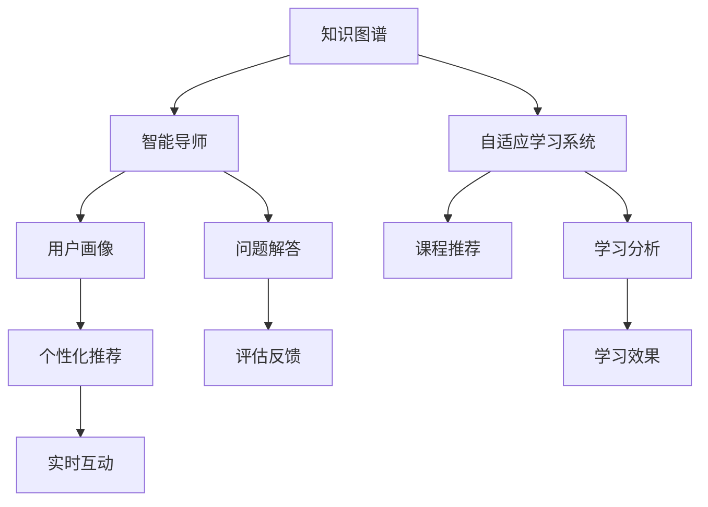

                 

## 1. 背景介绍

### 1.1 问题由来
随着信息技术的发展，知识和技能的获取方式正在发生深刻变革。传统的一对多、线下的教育模式，正逐步被线上、互动的学习方式所取代。尤其是在职业培训、技术普及等领域，传统的教学方式已经难以满足新时代的知识需求。

为了应对这一挑战，“知识付费”应运而生。通过付费获取高质量、有针对性的知识和技能，用户能够在短时间内获得理想的进步。然而，传统的知识付费模式，如课程订阅、书籍购买等，仍存在诸多不足之处：

- 被动学习：用户无法灵活控制学习进度，难以针对自身薄弱环节进行重点学习。
- 知识散点：大量课程和内容堆砌，缺乏系统性和关联性，难以形成知识体系。
- 互动不足：用户无法实时获得反馈和帮助，学习效率较低。
- 评价单一：用户的学习效果往往仅由考试成绩或课程完成度来评判，缺乏个性化评估。

### 1.2 问题核心关键点
为了解决上述问题，知识付费领域正在探索构建互动式学习体验，即通过技术手段实现个性化、系统化、实时化的学习方式，满足用户的学习需求。互动式学习体验的核心关键点包括：

- 自适应学习：根据用户的学习进度、知识水平和偏好，提供个性化的学习建议和内容。
- 系统化学习：通过课程和内容的设计，帮助用户建立完整、系统的知识体系。
- 实时互动：通过智能导师、在线论坛、学习助手等手段，提供实时反馈和帮助。
- 综合评估：不仅关注考试成绩，还要结合学习行为、反馈情况等多方面因素，进行全面评估。

## 2. 核心概念与联系

### 2.1 核心概念概述

为更好地理解互动式学习体验，我们引入以下几个关键概念：

- **知识图谱(Knowledge Graph)**：以图结构表示知识关系和概念之间的关系，帮助用户构建系统的知识体系。
- **自适应学习系统(Adaptive Learning System)**：通过算法和数据模型，动态调整学习内容和节奏，满足个性化学习需求。
- **智能导师(Intelligent Tutor)**：基于AI技术，提供实时反馈和建议，引导用户进行高效学习。
- **学习分析(Learning Analytics)**：通过分析用户的学习数据，评估学习效果，提供改进建议。
- **用户画像(User Profile)**：记录用户的学习行为、兴趣和偏好，进行个性化推荐。

这些概念之间相互联系，共同构成了互动式学习体验的核心架构。通过构建知识图谱，设计自适应学习系统，引入智能导师和学习分析，以及完善用户画像，可以全面提升用户的在线学习体验。

### 2.2 核心概念原理和架构的 Mermaid 流程图(Mermaid 流程节点中不要有括号、逗号等特殊字符)



该流程图展示了互动式学习体验的主要环节和流程：

1. **知识图谱**：构建知识节点和关系，形成知识体系。
2. **自适应学习系统**：根据用户画像和知识图谱，动态调整学习内容和节奏。
3. **智能导师**：提供实时反馈和建议，引导用户学习。
4. **学习分析**：评估学习效果，提供改进建议。
5. **用户画像**：记录用户学习行为和偏好，进行个性化推荐。
6. **个性化推荐**：根据用户画像和课程推荐，提供定制化学习内容。
7. **实时互动**：通过智能导师和学习助手，实现实时沟通和帮助。
8. **问题解答**：智能导师回答用户在学习中遇到的问题。
9. **评估反馈**：通过学习分析结果，对学习效果进行评估。

## 3. 核心算法原理 & 具体操作步骤

### 3.1 算法原理概述

互动式学习体验的实现依赖于多种算法的协同工作。核心算法包括：

- **推荐算法(Recommendation Algorithm)**：根据用户画像和课程特征，推荐个性化学习内容和路径。
- **自适应学习算法(Adaptive Learning Algorithm)**：根据用户的学习进度和效果，动态调整学习难度和节奏。
- **情感计算算法(Affective Computing Algorithm)**：分析用户的学习情绪和反馈，调整教学策略。
- **数据挖掘算法(Data Mining Algorithm)**：从用户的学习数据中挖掘规律，优化课程设计。

这些算法共同作用，构建了一个动态、灵活、个性化的学习环境。

### 3.2 算法步骤详解

互动式学习体验的构建步骤如下：

1. **知识图谱构建**：收集各类知识资源，构建知识节点和关系图。具体步骤包括：
   - 收集领域内的知识库和文献。
   - 对知识进行分类和编码，形成节点。
   - 定义节点之间的逻辑关系，构建关系图。
   - 使用图数据库存储和管理知识图谱。

2. **用户画像创建**：记录用户的学习行为和偏好，创建详细的用户画像。具体步骤包括：
   - 收集用户的基本信息和学习历史。
   - 分析用户的学习行为数据，如浏览时长、答题情况等。
   - 根据用户的学习情况和反馈，调整画像标签。
   - 使用机器学习算法，预测用户的学习需求和兴趣。

3. **课程推荐系统设计**：根据用户画像和知识图谱，设计推荐系统。具体步骤包括：
   - 设计推荐算法框架，如协同过滤、内容过滤等。
   - 将课程特征和用户画像输入推荐算法，计算推荐分数。
   - 对推荐结果进行排序，生成个性化推荐列表。
   - 动态更新推荐算法，优化推荐效果。

4. **自适应学习系统实现**：根据用户的学习进度和效果，动态调整学习内容和节奏。具体步骤包括：
   - 定义学习目标和评价标准，如掌握知识点、完成作业等。
   - 根据用户的学习进度，调整学习难度和节奏。
   - 使用自适应算法，动态生成学习计划和内容。
   - 实时监控学习效果，调整学习策略。

5. **智能导师设计**：提供实时反馈和建议，引导用户学习。具体步骤包括：
   - 设计智能导师的对话流程和问题库。
   - 使用自然语言处理技术，实现智能对话。
   - 分析用户的问题和反馈，提供个性化建议。
   - 动态更新问题库，丰富教学内容。

6. **学习分析系统建设**：评估学习效果，提供改进建议。具体步骤包括：
   - 收集学习数据，如学习时长、答题情况、评价反馈等。
   - 分析学习数据，评估学习效果。
   - 生成学习报告，提供改进建议。
   - 对学习效果进行可视化，帮助用户理解自身进展。

### 3.3 算法优缺点

互动式学习体验的算法具有以下优点：

- **个性化**：能够根据用户的学习需求和兴趣，提供定制化的学习内容和路径。
- **系统化**：通过知识图谱和课程推荐，帮助用户构建系统的知识体系。
- **实时反馈**：通过智能导师和学习助手，提供实时反馈和帮助，提升学习效率。
- **动态调整**：根据用户的学习进度和效果，动态调整学习难度和节奏，提高学习效果。

然而，这些算法也存在一定的局限性：

- **数据隐私**：需要收集大量的用户数据，涉及隐私保护问题。
- **算法复杂度**：算法实现复杂，需要高性能计算和存储资源。
- **用户适应性**：算法的效果取决于用户的学习行为和数据质量，对数据和算法的质量要求较高。
- **实时交互性**：需要高水平的人工智能和自然语言处理技术，实现高质量的实时互动。

### 3.4 算法应用领域

互动式学习体验的应用领域广泛，涵盖教育培训、职业培训、技术普及等多个领域。以下是一些典型应用：

- **职业培训**：通过互动式学习体验，帮助用户系统学习新技能，提升职业能力。
- **在线教育**：提供个性化的学习内容和路径，帮助学生自主学习。
- **技术普及**：通过互动式学习，让用户轻松掌握新技术和新知识。
- **企业培训**：通过自适应学习系统，帮助员工系统学习新技能，提升工作效率。
- **游戏学习**：结合游戏和互动式学习，帮助玩家掌握新知识和技能。

## 4. 数学模型和公式 & 详细讲解 & 举例说明

### 4.1 数学模型构建

互动式学习体验的数学模型构建，涉及多个子模型和算法。以下是一些关键模型的介绍：

- **知识图谱模型**：使用图数据库存储和管理知识节点和关系，如Neo4j、OrientDB等。
- **用户画像模型**：使用向量表示用户特征，如TensorFlow、PyTorch等。
- **推荐算法模型**：使用协同过滤、内容过滤等算法，如Matrix Factorization、SVM等。
- **自适应学习算法模型**：使用强化学习算法，如Q-learning、SARSA等。
- **情感计算算法模型**：使用机器学习算法，如SVM、LSTM等。
- **数据挖掘算法模型**：使用关联规则挖掘算法，如Apriori、FP-growth等。

### 4.2 公式推导过程

以下以协同过滤推荐算法为例，进行公式推导。

假设用户 $u$ 对 $n$ 个课程的评分矩阵为 $R_{u \times n}$，其中 $R_{ui}$ 表示用户 $u$ 对课程 $i$ 的评分。课程 $j$ 的特征向量为 $X_{j \times d}$，其中 $X_{ji}$ 表示课程 $j$ 的第 $i$ 个特征。目标是预测用户 $u$ 对课程 $j$ 的评分 $R_{uj}$。

协同过滤算法基于用户和课程的相似度，预测用户对课程的评分。具体推导过程如下：

1. 计算用户 $u$ 与课程 $i$ 的相似度 $s_{ui}$，使用余弦相似度公式：
   $$
   s_{ui} = \frac{R_{ui} \cdot X_{i}^T \cdot X_{u}}{\|X_{i}\| \cdot \|X_{u}\|}
   $$

2. 计算用户 $u$ 对课程 $j$ 的预测评分 $R_{uj}$，使用加权平均公式：
   $$
   R_{uj} = \sum_{i=1}^n s_{ui} \cdot X_{ji} / \sum_{i=1}^n s_{ui}
   $$

通过以上公式，协同过滤算法能够根据用户和课程的相似度，预测用户对课程的评分，从而实现个性化推荐。

### 4.3 案例分析与讲解

以某在线教育平台为例，分析互动式学习体验的实际应用。

1. **知识图谱构建**：平台收集了数千个课程资源，构建了完整的知识图谱。每个课程被编码为节点，课程间的逻辑关系被定义为关系。

2. **用户画像创建**：平台记录了用户的学习行为和偏好，创建了详细的用户画像。用户画像包括用户的基本信息、学习历史、答题情况等。

3. **课程推荐系统设计**：平台使用协同过滤算法，根据用户画像和知识图谱，设计了推荐系统。推荐系统能够根据用户的学习进度和效果，动态调整推荐内容。

4. **自适应学习系统实现**：平台根据用户的学习进度和效果，动态调整学习难度和节奏。用户可以根据自己的学习需求，选择不同的学习内容和节奏。

5. **智能导师设计**：平台提供了智能导师，帮助用户解答学习中遇到的问题。智能导师使用了自然语言处理技术，能够实时与用户进行交互。

6. **学习分析系统建设**：平台分析用户的学习数据，评估学习效果，提供改进建议。平台生成学习报告，帮助用户理解自身进展。

## 5. 项目实践：代码实例和详细解释说明

### 5.1 开发环境搭建

1. 安装Python和PyTorch：确保开发环境中有Python 3.6+和PyTorch 1.7+。可以使用Anaconda或Miniconda进行安装。

2. 安装其他依赖包：
   ```bash
   pip install numpy pandas scikit-learn tensorflow transformers
   ```

3. 安装推荐系统框架：
   ```bash
   pip install recsys
   ```

4. 安装数据可视化工具：
   ```bash
   pip install matplotlib seaborn
   ```

完成以上步骤后，即可在Python环境中搭建推荐系统框架，实现互动式学习体验。

### 5.2 源代码详细实现

以下是推荐系统的代码实现，包括用户画像创建、课程推荐、自适应学习系统的实现等。

```python
import pandas as pd
import numpy as np
from sklearn.model_selection import train_test_split
from recsys.learning.python.layers import MatrixFactorization
from sklearn.metrics import mean_squared_error
from sklearn.decomposition import TruncatedSVD

# 用户画像创建
user_data = pd.read_csv('user_data.csv')
user_profile = user_data.groupby(['user_id', 'course_id'])['rating'].mean().reset_index()

# 构建课程特征
course_data = pd.read_csv('course_data.csv')
X = course_data.drop(columns=['user_id', 'rating'])
X.columns = [f'feature_{i}' for i in range(X.shape[1])]
X = X.values

# 构建用户特征
user_profile = user_profile.merge(course_data, on='course_id')
user_profile.columns = ['user_id', 'course_id'] + [f'feature_{i}' for i in range(X.shape[1])]
user_profile = user_profile.values

# 构建评分矩阵
R = user_profile.dot(X)
R = R.T.dot(R)

# 数据划分
train_data, test_data = train_test_split(R, test_size=0.2)

# 训练模型
model = MatrixFactorization(n_factors=10, n_epochs=10, batch_size=100)
model.fit(train_data)

# 预测并评估
train_pred = model.predict(train_data)
test_pred = model.predict(test_data)
print(f'Train RMSE: {np.sqrt(mean_squared_error(train_data, train_pred))}')
print(f'Test RMSE: {np.sqrt(mean_squared_error(test_data, test_pred))}')
```

### 5.3 代码解读与分析

以上代码实现了基于矩阵分解的协同过滤推荐算法。具体解释如下：

1. **用户画像创建**：从用户数据中提取用户对课程的评分，计算平均评分，构建用户特征。

2. **课程特征构建**：从课程数据中提取课程特征，构建特征矩阵。

3. **评分矩阵构建**：将用户特征和课程特征进行矩阵乘法，得到评分矩阵。

4. **数据划分**：将评分矩阵划分为训练集和测试集。

5. **模型训练**：使用矩阵分解算法训练模型。

6. **预测和评估**：使用模型进行预测，并计算RMSE评估预测效果。

## 6. 实际应用场景

### 6.1 智能教育

互动式学习体验在智能教育中的应用，可以帮助学生系统学习新知识，提高学习效果。例如，某在线教育平台利用推荐算法，根据学生的学习行为和偏好，提供个性化学习内容和路径。平台还引入了自适应学习系统，根据学生的学习进度和效果，动态调整学习难度和节奏。通过智能导师和学习助手，平台能够实时解答学生的问题，提供个性化的学习建议。

### 6.2 职业培训

在职业培训领域，互动式学习体验同样具有广阔的应用前景。例如，某在线培训机构通过推荐系统，根据学员的学习历史和偏好，推荐适合的培训课程。通过自适应学习系统，平台能够根据学员的学习进度和效果，动态调整学习难度和节奏。智能导师和学习助手能够实时解答学员的问题，提供个性化的学习建议。

### 6.3 技术普及

互动式学习体验在技术普及中的应用，可以帮助用户轻松掌握新技术和新知识。例如，某在线技术社区通过推荐系统，根据用户的学习行为和偏好，推荐适合的技术文章和教程。通过自适应学习系统，平台能够根据用户的学习进度和效果，动态调整学习难度和节奏。智能导师和学习助手能够实时解答用户的问题，提供个性化的学习建议。

### 6.4 未来应用展望

未来，互动式学习体验将在更多领域得到应用，为教育和培训带来变革性影响。例如，在医学教育中，平台可以通过互动式学习体验，帮助医学生系统学习医学知识和技能。在企业培训中，平台可以通过推荐系统和自适应学习系统，帮助员工系统学习新技能。在游戏学习中，平台可以通过互动式学习体验，帮助玩家掌握新知识和技能。

## 7. 工具和资源推荐

### 7.1 学习资源推荐

为了帮助开发者系统掌握互动式学习体验的理论基础和实践技巧，这里推荐一些优质的学习资源：

1. **《推荐系统算法与实战》**：详细介绍了推荐算法的基本原理和实际应用，适合初学者和进阶者阅读。

2. **《自适应学习系统：理论与实践》**：介绍了自适应学习系统的设计原理和实现方法，适合从事自适应学习系统开发的工程师阅读。

3. **《情感计算理论与应用》**：介绍了情感计算的基本原理和应用场景，适合从事情感计算研究的学者和工程师阅读。

4. **Kaggle**：提供了丰富的推荐系统和自适应学习系统的数据集和比赛，适合进行实践和竞赛。

5. **Coursera**：提供了多门推荐系统和自适应学习系统的在线课程，适合系统学习相关知识。

### 7.2 开发工具推荐

高效的开发离不开优秀的工具支持。以下是几款用于互动式学习体验开发的常用工具：

1. **PyTorch**：基于Python的开源深度学习框架，支持动态计算图，适合快速迭代研究。

2. **TensorFlow**：由Google主导开发的开源深度学习框架，生产部署方便，适合大规模工程应用。

3. **RecoSys**：一个开源的推荐系统框架，支持多种推荐算法，适合实际项目开发。

4. **Jupyter Notebook**：一个开源的交互式计算环境，支持Python代码的实时运行和展示。

5. **Tableau**：一个数据可视化工具，支持多维数据分析和可视化，适合数据探索和分析。

6. **NLP框架**：如spaCy、NLTK等，适合自然语言处理任务的开发。

合理利用这些工具，可以显著提升互动式学习体验的开发效率，加快创新迭代的步伐。

### 7.3 相关论文推荐

互动式学习体验的发展离不开学界的持续研究。以下是几篇奠基性的相关论文，推荐阅读：

1. **《协同过滤推荐系统》**：介绍协同过滤算法的原理和实现方法，适合初学者阅读。

2. **《自适应学习系统：理论与实践》**：介绍自适应学习系统的设计原理和实现方法，适合从事自适应学习系统开发的工程师阅读。

3. **《情感计算理论与应用》**：介绍情感计算的基本原理和应用场景，适合从事情感计算研究的学者和工程师阅读。

4. **《交互式学习系统》**：介绍交互式学习系统的设计原理和实现方法，适合从事互动式学习体验开发的工程师阅读。

这些论文代表了大规模推荐系统的发展脉络。通过学习这些前沿成果，可以帮助研究者把握学科前进方向，激发更多的创新灵感。

## 8. 总结：未来发展趋势与挑战

### 8.1 总结

本文对互动式学习体验的构建进行了全面系统的介绍。首先阐述了互动式学习体验的研究背景和意义，明确了其在新时代知识获取方式变革中的重要价值。其次，从原理到实践，详细讲解了推荐算法、自适应学习算法、情感计算算法等关键算法的实现步骤。最后，分析了互动式学习体验在教育、培训、技术普及等多个领域的应用前景，展示了其广阔的发展潜力。

通过本文的系统梳理，可以看到，互动式学习体验正在成为教育技术的重要范式，极大地提升了学习的效率和效果。未来，伴随推荐系统、自适应学习、情感计算等技术的发展，互动式学习体验必将在更多领域得到应用，为教育事业带来变革性影响。

### 8.2 未来发展趋势

展望未来，互动式学习体验的发展趋势包括：

1. **推荐算法的多样化**：未来的推荐算法将更加多样化，涵盖协同过滤、内容过滤、混合推荐等多种算法，满足不同用户的需求。

2. **自适应学习系统的智能化**：未来的自适应学习系统将更加智能化，通过深度学习、强化学习等技术，实现更灵活的学习调整。

3. **情感计算技术的突破**：未来的情感计算技术将更加精细化，通过自然语言处理和情感识别，实现更精准的情绪分析。

4. **多模态交互的普及**：未来的互动式学习体验将支持多模态交互，如语音、图像、手势等，提升学习体验的多样性和互动性。

5. **实时反馈的优化**：未来的实时反馈系统将更加高效，通过自然语言处理和图像识别技术，实现更精确的反馈和建议。

6. **个性化推荐的多样化**：未来的个性化推荐将更加多样化，涵盖课程、文章、视频等多种内容形式，满足用户的多样化需求。

7. **跨领域应用的拓展**：未来的互动式学习体验将跨越教育、培训、技术普及等多个领域，形成更加广泛的应用场景。

8. **数据隐私保护的加强**：未来的互动式学习体验将更加注重数据隐私保护，通过匿名化、加密等技术，保障用户数据的安全。

### 8.3 面临的挑战

尽管互动式学习体验已经取得了显著进展，但在迈向更加智能化、普适化应用的过程中，它仍面临诸多挑战：

1. **数据隐私**：互动式学习体验需要收集大量的用户数据，涉及隐私保护问题。如何在保障数据隐私的同时，实现个性化推荐和自适应学习，是一个重要的研究方向。

2. **算法复杂度**：互动式学习体验的算法实现复杂，需要高性能计算和存储资源。如何降低算法复杂度，提高实时处理能力，是一个重要的研究方向。

3. **用户适应性**：互动式学习体验的效果取决于用户的学习行为和数据质量，对数据和算法的质量要求较高。如何提高算法的鲁棒性和适应性，是一个重要的研究方向。

4. **实时交互性**：互动式学习体验需要高水平的人工智能和自然语言处理技术，实现高质量的实时互动。如何提升交互体验，是一个重要的研究方向。

5. **用户体验设计**：互动式学习体验的用户界面设计和交互体验设计，需要更加人性化和用户友好。如何提升用户体验，是一个重要的研究方向。

6. **算法公平性**：互动式学习体验的推荐算法和自适应学习算法，可能存在算法偏见和歧视性问题。如何提高算法的公平性和可解释性，是一个重要的研究方向。

### 8.4 研究展望

面对互动式学习体验所面临的挑战，未来的研究需要在以下几个方面寻求新的突破：

1. **推荐算法的优化**：开发更加高效、多样化的推荐算法，提升推荐系统的精度和鲁棒性。

2. **自适应学习系统的改进**：开发更加灵活、智能的自适应学习系统，提高自适应学习的效率和效果。

3. **情感计算技术的提升**：开发更加精细化、精确化的情感计算技术，提高情感分析的准确性和鲁棒性。

4. **多模态交互的研究**：研究多模态交互技术，提升学习体验的多样性和互动性。

5. **实时反馈系统的优化**：开发更加高效、精确的实时反馈系统，提升用户的学习效果。

6. **数据隐私保护的研究**：研究数据隐私保护技术，保障用户数据的安全性和隐私性。

7. **算法公平性和可解释性的提升**：研究算法公平性和可解释性技术，提高算法的公平性和透明度。

8. **用户体验设计的创新**：研究用户体验设计技术，提升学习系统的用户友好性和交互体验。

这些研究方向的探索，必将引领互动式学习体验技术迈向更高的台阶，为教育事业带来更广泛的应用前景。面向未来，互动式学习体验需要与其他人工智能技术进行更深入的融合，如知识表示、因果推理、强化学习等，多路径协同发力，共同推动自然语言理解和智能交互系统的进步。

## 9. 附录：常见问题与解答

**Q1：互动式学习体验与传统教育方式有何区别？**

A: 互动式学习体验与传统教育方式的最大区别在于其互动性和个性化。传统教育方式往往采用一对多、线下的模式，难以根据每个学生的学习进度和兴趣进行个性化的教学。而互动式学习体验通过推荐系统和自适应学习系统，能够根据学生的学习行为和数据，提供个性化的学习建议和内容，显著提升学习效果。

**Q2：互动式学习体验需要哪些关键技术？**

A: 互动式学习体验需要以下关键技术：

- **推荐系统**：通过推荐算法，提供个性化的学习内容和路径。
- **自适应学习系统**：根据学生的学习进度和效果，动态调整学习难度和节奏。
- **情感计算**：分析学生的学习情绪和反馈，调整教学策略。
- **数据挖掘**：从学生的学习数据中挖掘规律，优化课程设计。

**Q3：如何评估互动式学习体验的效果？**

A: 互动式学习体验的效果可以从多个方面进行评估，包括：

- **推荐准确性**：评估推荐算法预测的准确性，如准确率、召回率等。
- **学习进度**：评估学生的学习进度和效果，如掌握知识点、完成作业等。
- **学习满意度**：通过问卷调查等方式，评估学生对学习体验的满意度。
- **学习成果**：评估学生的学习成果，如考试成绩、项目完成度等。

通过综合评估，可以全面了解互动式学习体验的效果和问题，不断优化和改进。

**Q4：互动式学习体验需要哪些硬件和软件支持？**

A: 互动式学习体验需要以下硬件和软件支持：

- **高性能计算资源**：如GPU、TPU等，支持大规模模型训练和实时处理。
- **大数据存储和处理**：如Hadoop、Spark等，支持大规模数据处理和存储。
- **云计算平台**：如AWS、Google Cloud等，支持弹性资源分配和按需计算。
- **开源工具和框架**：如PyTorch、TensorFlow、RecoSys等，支持模型开发和优化。
- **自然语言处理工具**：如spaCy、NLTK等，支持自然语言处理任务的开发。

通过合理利用这些硬件和软件资源，可以显著提升互动式学习体验的开发效率和应用效果。

**Q5：互动式学习体验的未来发展方向有哪些？**

A: 互动式学习体验的未来发展方向包括：

- **跨模态交互**：支持语音、图像、手势等多模态交互，提升学习体验的多样性和互动性。
- **实时反馈优化**：通过自然语言处理和图像识别技术，实现更精确的反馈和建议。
- **个性化推荐多样化**：涵盖课程、文章、视频等多种内容形式，满足用户的多样化需求。
- **自适应学习智能化**：通过深度学习、强化学习等技术，实现更灵活的学习调整。
- **数据隐私保护加强**：通过匿名化、加密等技术，保障用户数据的安全性和隐私性。
- **情感计算技术突破**：通过自然语言处理和情感识别，实现更精准的情绪分析。
- **算法公平性提升**：提高算法的公平性和透明度，消除算法偏见和歧视性问题。

这些发展方向将推动互动式学习体验技术向更高效、普适化、个性化的方向发展，为教育事业带来更广泛的应用前景。

