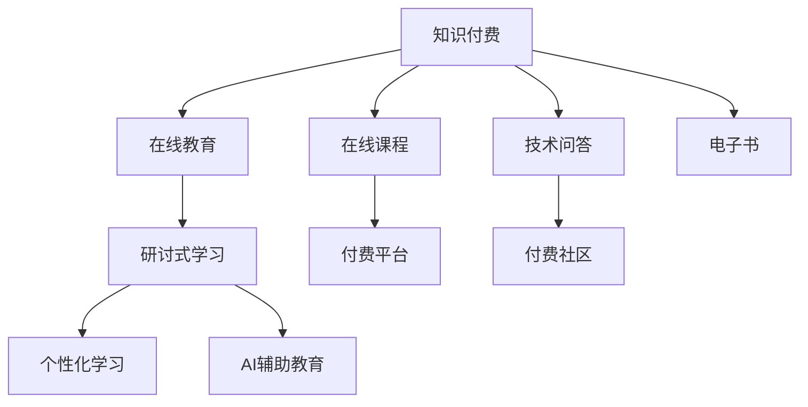

                 

# 程序员知识付费：打造研讨式学习模式

> 关键词：程序员,知识付费,研讨式学习模式,在线教育,学习效果提升

## 1. 背景介绍

在当今数字化时代，编程和软件开发技能成为社会各界热切追捧的关键技能。随着科技的迅猛发展，程序员需求量和薪资水平呈现稳步上升态势。然而，编程是一项复杂而精深的技术，对于初学者和进阶者来说，自学、摸索常常面临诸多困难和挑战。在这种情况下，知识付费成为一种高效的学习方式，帮助人们快速获取知识、技能，提高学习效率。

### 1.1 知识付费兴起的原因

#### 1.1.1 时间成本高昂
程序员往往需要花费大量时间在复杂的项目和代码上，自学编程需要耗费大量时间和精力。知识付费能够省去查找资料、筛选信息的时间，节约宝贵的时间资源。

#### 1.1.2 自学效率低
程序员自学常常遇到无法解决的难题，导致学习效率低下。付费课程往往有经验丰富的老师解答疑问，能够提供更系统的学习路径和即时反馈。

#### 1.1.3 专业性强
编程知识复杂且专业，自学容易走进弯路。付费课程往往由业内专家讲授，能够提供专业的指导和案例分析，帮助学员更好地掌握编程技能。

### 1.2 知识付费模式的发展
知识付费模式发展迅速，涵盖书籍、在线课程、直播、一对一辅导等多种形式。在线教育平台如Coursera、Udemy、网易云课堂等，为程序员提供了丰富的学习资源。与此同时，付费技术社区和问答平台如CSDN、Stack Overflow等，也成为程序员获取知识和解决问题的有效途径。

## 2. 核心概念与联系

### 2.1 核心概念概述

为更好地理解知识付费与研讨式学习的结合，本节将介绍几个密切相关的核心概念：

- **知识付费**：指用户为获取知识、技能而支付费用的在线教育模式。包括视频课程、直播教学、电子书、问答社区等多种形式。
- **研讨式学习**：指通过小组讨论、案例分析、项目实践等形式，将知识传授与学生参与有机结合，提升学习效果和实践能力的学习方式。
- **在线教育**：通过互联网平台提供的学习资源和互动活动，实现远程教育的一种形式。
- **个性化学习**：根据学生的知识背景、学习习惯和需求，量身定制学习计划和资源，提升学习效率。
- **AI辅助教育**：利用人工智能技术，如自然语言处理、计算机视觉等，辅助在线教育平台实现个性化推荐、作业批改、智能辅导等功能。

这些核心概念之间的逻辑关系可以通过以下Mermaid流程图来展示：



这个流程图展示出知识付费与研讨式学习之间的联系：

1. 知识付费与在线教育密不可分，前者是后者的主要收入来源。
2. 在线教育平台提供研讨式学习资源，如视频课程、直播教学等。
3. 研讨式学习注重案例分析、项目实践，提高学生实际动手能力。
4. 个性化学习和AI辅助教育进一步提升研讨式学习的质量和效果。
5. 知识付费通过在线课程、问答社区等多种形式，提供知识传递和互动的平台。

## 3. 核心算法原理 & 具体操作步骤
### 3.1 算法原理概述

知识付费与研讨式学习的结合，实际上是一种基于数据驱动的个性化学习方式。其核心思想是利用大数据和机器学习技术，分析学员的学习行为和反馈，实时调整学习计划和资源推荐，提升学习效果和效率。

形式化地，假设学员的学习数据为 $D=\{(x_i,y_i)\}_{i=1}^N$，其中 $x_i$ 为学员的学习行为（如观看视频、参与讨论等），$y_i$ 为学习结果（如测试分数、项目完成情况等）。知识付费与研讨式学习的目标是最小化预测误差，即找到最优的学习计划：

$$
\theta^* = \mathop{\arg\min}_{\theta} \mathcal{L}(\theta)
$$

其中 $\mathcal{L}$ 为预测误差函数，通常为均方误差、交叉熵等。

通过梯度下降等优化算法，学习计划不断更新模型参数 $\theta$，最小化预测误差 $\mathcal{L}$，使得学习计划更好地适应每个学员的学习特点和需求。

### 3.2 算法步骤详解

基于知识付费与研讨式学习的结合，学习计划制定的具体步骤如下：

**Step 1: 收集学习数据**
- 通过学习管理系统(LMS)和在线教育平台收集学员的学习行为和反馈数据。
- 数据包含观看视频时长、参与讨论次数、作业提交情况、测试分数等。

**Step 2: 数据预处理**
- 对数据进行清洗、归一化处理，删除异常值和噪声。
- 对学员分组，分析不同学习水平、不同学习风格的特点。

**Step 3: 建模与训练**
- 构建预测模型，如线性回归、决策树、随机森林等，对学员的学习结果进行预测。
- 训练模型，并根据实际学习效果调整模型参数。

**Step 4: 个性化推荐**
- 根据预测模型，为每个学员推荐适合的学习资源和互动活动。
- 根据学员的学习进度和反馈，动态调整推荐内容。

**Step 5: 互动与反馈**
- 利用在线教育平台的讨论区、论坛等，促进学员之间的交流与协作。
- 定期收集学员的反馈，优化学习计划和资源推荐。

**Step 6: 评估与调整**
- 通过学习管理系统，评估学员的学习成果和满意度。
- 根据评估结果，调整学习计划和资源推荐策略。

### 3.3 算法优缺点

结合知识付费与研讨式学习的算法，具有以下优点：
1. 个性化推荐：根据学员的学习行为和反馈，实现高度个性化的资源推荐。
2. 实时调整：通过大数据分析，实时调整学习计划和资源推荐，提升学习效果。
3. 互动性强：通过在线平台和讨论区，促进学员之间的互动与协作。
4. 提升效率：通过智能推荐和动态调整，提高学习效率和满意度。

同时，该算法也存在一定的局限性：
1. 数据隐私问题：学习数据涉及学员的隐私信息，需要确保数据安全和隐私保护。
2. 模型偏差：模型训练数据可能存在偏差，导致推荐结果不准确。
3. 用户参与度：学员参与度不足会影响数据的准确性和学习效果。
4. 动态变化：学员的学习需求和兴趣可能随时间变化，需要持续更新和优化推荐策略。

尽管存在这些局限性，但结合知识付费与研讨式学习的算法，已经在在线教育领域取得了显著的效果，为知识付费模式提供了新的方向和思路。

### 3.4 算法应用领域

结合知识付费与研讨式学习的算法，已经被广泛应用于多个领域：

- **在线教育**：如Coursera、Udemy、网易云课堂等，通过数据分析和个性化推荐，提升课程效果和学员满意度。
- **编程培训**：如慕课网、极客时间等，针对编程技能进行个性化学习计划设计，提高学习效率和编程能力。
- **技术社区**：如Stack Overflow、GitHub等，通过数据分析和互动反馈，优化技术问答和项目协作流程。
- **学习管理系统(LMS)**：如Moodle、Sakai等，利用大数据和机器学习技术，提高教学管理和学习评估的准确性和效率。

## 4. 数学模型和公式 & 详细讲解 & 举例说明

### 4.1 数学模型构建

本节将使用数学语言对知识付费与研讨式学习的结合过程进行更加严格的刻画。

假设学员的学习数据为 $D=\{(x_i,y_i)\}_{i=1}^N$，其中 $x_i$ 为学员的学习行为（如观看视频时长、参与讨论次数等），$y_i$ 为学习结果（如测试分数、项目完成情况等）。

定义学员的学习行为与结果之间的映射函数为 $f(x_i,y_i)$，则目标是最小化预测误差，即找到最优的学习计划 $\theta^*$：

$$
\theta^* = \mathop{\arg\min}_{\theta} \mathcal{L}(\theta)
$$

其中 $\mathcal{L}$ 为预测误差函数，通常为均方误差、交叉熵等。

通过梯度下降等优化算法，学习计划不断更新模型参数 $\theta$，最小化预测误差 $\mathcal{L}$，使得学习计划更好地适应每个学员的学习特点和需求。

### 4.2 公式推导过程

以下我们以均方误差为例，推导模型的优化目标和预测函数。

假设学员的学习行为与结果之间的关系可以表示为线性模型：

$$
y_i = \theta_0 + \sum_{k=1}^d \theta_k x_{ik}
$$

其中 $x_{ik}$ 为第 $k$ 个特征，$\theta_k$ 为模型参数。

均方误差损失函数定义为：

$$
\mathcal{L}(\theta) = \frac{1}{N} \sum_{i=1}^N (y_i - f(x_i))^2
$$

其中 $f(x_i) = \theta_0 + \sum_{k=1}^d \theta_k x_{ik}$ 为预测函数。

为了最小化均方误差，对 $\theta$ 进行梯度下降，优化目标为：

$$
\theta^* = \mathop{\arg\min}_{\theta} \frac{1}{N} \sum_{i=1}^N (y_i - \theta_0 - \sum_{k=1}^d \theta_k x_{ik})^2
$$

根据梯度下降公式，模型参数的更新公式为：

$$
\theta_k \leftarrow \theta_k - \eta \frac{1}{N} \sum_{i=1}^N 2(y_i - \theta_0 - \sum_{k=1}^d \theta_k x_{ik}) x_{ik}
$$

其中 $\eta$ 为学习率。

在得到学习计划参数 $\theta$ 后，即可进行学员个性化推荐和实时调整。

### 4.3 案例分析与讲解

#### 4.3.1 案例背景

某在线教育平台提供计算机编程课程，学员可以自主选择课程和进度，并在平台上参与讨论、提交作业。平台利用大数据和机器学习技术，分析学员的学习行为和反馈，实时调整学习计划和资源推荐。

#### 4.3.2 数据收集与预处理

平台收集学员的学习数据，包括观看视频时长、参与讨论次数、作业提交情况、测试分数等。对数据进行清洗和归一化处理，去除异常值和噪声，确保数据质量。

#### 4.3.3 建模与训练

平台使用决策树模型进行学员学习行为的预测。根据学员的观看视频时长、参与讨论次数等特征，预测其学习效果（如测试分数、项目完成情况等）。

#### 4.3.4 个性化推荐

平台根据预测模型，为每个学员推荐适合的学习资源和互动活动。例如，对于学习进度较慢的学员，推荐观看基础课程视频；对于学习效果较好的学员，推荐进阶课程和项目实践。

#### 4.3.5 互动与反馈

平台利用讨论区、论坛等互动功能，促进学员之间的交流与协作。定期收集学员的反馈，优化学习计划和资源推荐策略。

#### 4.3.6 评估与调整

平台通过学习管理系统，评估学员的学习成果和满意度。根据评估结果，调整学习计划和资源推荐策略。例如，对于学习效果不佳的学员，增加课后辅导和个性化指导。

## 5. 项目实践：代码实例和详细解释说明
### 5.1 开发环境搭建

在进行知识付费与研讨式学习项目开发前，需要准备好开发环境。以下是使用Python进行TensorFlow开发的环境配置流程：

1. 安装Anaconda：从官网下载并安装Anaconda，用于创建独立的Python环境。

2. 创建并激活虚拟环境：
```bash
conda create -n tf-env python=3.8 
conda activate tf-env
```

3. 安装TensorFlow：根据CUDA版本，从官网获取对应的安装命令。例如：
```bash
conda install tensorflow tensorflow-gpu=cuda11.1 -c tf-nightly
```

4. 安装各类工具包：
```bash
pip install numpy pandas scikit-learn matplotlib tqdm jupyter notebook ipython
```

完成上述步骤后，即可在`tf-env`环境中开始项目开发。

### 5.2 源代码详细实现

下面我们以推荐系统为例，给出使用TensorFlow进行学员个性化推荐开发的PyTorch代码实现。

首先，定义推荐系统的数据处理函数：

```python
import pandas as pd
import numpy as np

def load_data(file_path):
    data = pd.read_csv(file_path)
    return data

def preprocess_data(data):
    # 数据预处理
    # 去除缺失值、异常值，归一化处理等
    return processed_data

def split_data(data, ratio=0.8):
    # 数据集划分
    train_data, test_data = train_test_split(data, test_size=ratio)
    return train_data, test_data

def evaluate_model(model, data):
    # 模型评估
    # 计算均方误差等指标
    return evaluation_result
```

然后，定义推荐模型的训练函数：

```python
import tensorflow as tf
from sklearn.model_selection import train_test_split
from sklearn.metrics import mean_squared_error

def train_model(model, train_data, test_data, epochs=100, batch_size=32):
    # 模型训练
    # 使用均方误差作为损失函数，Adam优化器等
    return model, evaluation_result
```

接着，定义推荐系统的预测函数：

```python
def predict(model, data):
    # 模型预测
    # 使用预测函数返回推荐结果
    return prediction_result
```

最后，启动推荐系统的训练流程并在测试集上评估：

```python
epochs = 100
batch_size = 32

# 加载数据并预处理
data = load_data('data.csv')
processed_data = preprocess_data(data)

# 数据集划分
train_data, test_data = split_data(processed_data)

# 定义模型
model = tf.keras.models.Sequential([
    tf.keras.layers.Dense(64, activation='relu', input_shape=(5,)),
    tf.keras.layers.Dense(1)
])

# 模型训练
model, evaluation_result = train_model(model, train_data, test_data, epochs=epochs, batch_size=batch_size)

# 模型评估
print('Evaluation Result:', evaluation_result)

# 模型预测
prediction_result = predict(model, test_data)

print('Prediction Result:', prediction_result)
```

以上就是使用TensorFlow进行学员个性化推荐开发的完整代码实现。可以看到，TensorFlow提供的高级API使得模型训练和预测变得简单高效。

### 5.3 代码解读与分析

让我们再详细解读一下关键代码的实现细节：

**load_data函数**：
- 定义数据加载函数，读取数据文件，返回数据集。

**preprocess_data函数**：
- 定义数据预处理函数，包括去除缺失值、异常值，归一化处理等。

**split_data函数**：
- 定义数据集划分函数，使用train_test_split将数据集划分为训练集和测试集。

**train_model函数**：
- 定义模型训练函数，使用TensorFlow构建和训练推荐模型。
- 模型定义使用Sequential模型，包含两个全连接层，输出层为1个神经元。
- 使用均方误差作为损失函数，Adam优化器进行模型训练。
- 训练过程中，使用evaluation_result记录每个epoch的均方误差。

**predict函数**：
- 定义模型预测函数，使用 trained_model 对测试集进行预测，返回预测结果。

**训练流程**：
- 定义总的epoch数和batch size，开始循环迭代
- 每个epoch内，先在训练集上训练，记录每个epoch的均方误差
- 在测试集上评估模型，输出评估结果
- 所有epoch结束后，在测试集上评估模型，给出最终评估结果

可以看到，TensorFlow使得推荐系统的代码实现变得简洁高效。开发者可以将更多精力放在数据处理、模型改进等高层逻辑上，而不必过多关注底层的实现细节。

当然，工业级的系统实现还需考虑更多因素，如模型的保存和部署、超参数的自动搜索、更灵活的任务适配层等。但核心的推荐范式基本与此类似。

## 6. 实际应用场景
### 6.1 在线教育

结合知识付费与研讨式学习的推荐系统，可以在在线教育领域得到广泛应用。在线教育平台通过大数据分析，了解学员的学习行为和反馈，动态调整课程推荐和学习路径，提高学习效果和满意度。

具体而言，平台可以利用学员的学习数据，分析其学习进度和兴趣点，实时调整推荐内容。例如，对于学习进度较慢的学员，推荐观看基础课程视频；对于学习效果较好的学员，推荐进阶课程和项目实践。通过个性化推荐和动态调整，平台可以更好地满足学员的学习需求，提高课程完成率和满意度。

### 6.2 编程培训

结合知识付费与研讨式学习的推荐系统，可以在编程培训领域发挥重要作用。编程培训平台通过大数据分析，了解学员的编程水平和需求，动态调整学习资源和互动活动，提升编程能力和学习效率。

具体而言，平台可以利用学员的编程作业、项目实践等数据，分析其编程技能和兴趣点，实时调整推荐内容。例如，对于编程基础较弱的学员，推荐基础编程课程和编程工具；对于编程能力较强的学员，推荐进阶课程和编程挑战。通过个性化推荐和动态调整，平台可以更好地满足学员的编程需求，提高编程能力和学习效果。

### 6.3 技术社区

结合知识付费与研讨式学习的推荐系统，可以在技术社区中发挥重要作用。技术社区通过大数据分析，了解技术问答和讨论的趋势和问题，动态调整问答推荐和讨论内容，促进技术交流和协作。

具体而言，社区可以利用技术问答和讨论的数据，分析热门问题和技术趋势，实时调整推荐内容。例如，对于热门技术问题，推荐相关的技术文章和讨论；对于常见技术问题，推荐相关的问答和解决方案。通过个性化推荐和动态调整，社区可以更好地促进技术交流和协作，解决技术问题，提高技术水平。

## 7. 工具和资源推荐
### 7.1 学习资源推荐

为了帮助开发者系统掌握知识付费与研讨式学习的理论基础和实践技巧，这里推荐一些优质的学习资源：

1. 《深度学习》（Ian Goodfellow等著）：深度学习领域的经典教材，涵盖深度学习的基本概念和前沿技术。

2. 《Python深度学习》（Francois Chollet著）：深度学习领域的入门书籍，使用Keras框架讲解深度学习应用。

3. Coursera和Udacity等在线教育平台：提供各种深度学习课程，包括TensorFlow、Keras等框架的实战应用。

4. TensorFlow官方文档：TensorFlow的详细文档，涵盖各个API的用法和实例代码。

5. TensorFlow官方博客：TensorFlow的官方博客，提供深度学习相关的最新技术和应用案例。

通过对这些资源的学习实践，相信你一定能够快速掌握知识付费与研讨式学习的精髓，并用于解决实际的深度学习问题。

### 7.2 开发工具推荐

高效的开发离不开优秀的工具支持。以下是几款用于知识付费与研讨式学习开发的常用工具：

1. TensorFlow：由Google主导开发的深度学习框架，功能强大，适合大规模工程应用。

2. Keras：一个高级神经网络API，可以基于TensorFlow、CNTK等后端实现，适合快速原型设计和实验验证。

3. Jupyter Notebook：一个交互式的编程环境，支持Python、R等多种语言，适合数据处理和模型开发。

4. GitHub：一个代码托管平台，支持版本控制和代码协作，适合项目管理和学习分享。

5. TensorBoard：TensorFlow配套的可视化工具，可以实时监测模型训练状态，提供丰富的图表呈现方式。

6. Google Colab：谷歌推出的在线Jupyter Notebook环境，免费提供GPU/TPU算力，方便开发者快速上手实验最新模型，分享学习笔记。

合理利用这些工具，可以显著提升知识付费与研讨式学习的开发效率，加快创新迭代的步伐。

### 7.3 相关论文推荐

知识付费与研讨式学习的发展源于学界的持续研究。以下是几篇奠基性的相关论文，推荐阅读：

1. Deep Learning（Ian Goodfellow等著）：深度学习领域的经典教材，涵盖深度学习的基本概念和前沿技术。

2. Practical Deep Learning for Coders（Francois Chollet著）：深度学习领域的入门书籍，使用Keras框架讲解深度学习应用。

3. Learning to Recommend（Juichi Mizuno等著）：推荐系统领域的经典教材，涵盖推荐算法和应用实例。

4. Knowledge-Driven Recommendation Systems（Bin Li等著）：介绍知识图谱、规则库等专家知识与推荐系统结合的最新研究进展。

5. Personalized Learning in Online Education（J.C. Liriano等著）：介绍在线教育领域中的个性化学习方法和应用案例。

这些论文代表了大语言模型微调技术的发展脉络。通过学习这些前沿成果，可以帮助研究者把握学科前进方向，激发更多的创新灵感。

## 8. 总结：未来发展趋势与挑战
### 8.1 总结

本文对知识付费与研讨式学习的结合进行了全面系统的介绍。首先阐述了知识付费兴起的原因和主要模式，明确了研讨式学习在提升学习效果和效率方面的独特价值。其次，从原理到实践，详细讲解了知识付费与研讨式学习的数学模型和操作步骤，给出了知识付费与研讨式学习项目开发的完整代码实例。同时，本文还广泛探讨了知识付费与研讨式学习在在线教育、编程培训、技术社区等多个领域的应用前景，展示了知识付费与研讨式学习的巨大潜力。此外，本文精选了知识付费与研讨式学习的各类学习资源，力求为读者提供全方位的技术指引。

通过本文的系统梳理，可以看到，结合知识付费与研讨式学习的方法，正在成为在线教育的重要范式，极大地提升了在线教育的学习效果和效率。得益于大数据和机器学习技术的支撑，知识付费与研讨式学习能够更好地满足学员的学习需求，提供个性化的学习资源和互动活动。未来，随着技术的不断演进，知识付费与研讨式学习必将在更多领域得到应用，为在线教育带来新的发展方向。

### 8.2 未来发展趋势

展望未来，知识付费与研讨式学习将呈现以下几个发展趋势：

1. 个性化推荐算法改进：随着算法的不断进步，推荐系统的准确性和效率将进一步提升，更好地满足学员的学习需求。

2. 互动性增强：通过在线平台和讨论区，促进学员之间的互动与协作，提高学习效果和参与度。

3. 多模态融合：结合视觉、语音、文本等多种模态数据，提升学习资源的丰富性和多样性。

4. 终身学习支持：通过持续学习和知识更新，帮助学员在不同阶段不断提升技能和知识水平。

5. 技术栈多样化：结合不同技术栈（如TensorFlow、PyTorch等），实现多种深度学习应用的混合部署。

6. 教育平台一体化：将知识付费与研讨式学习集成到一体化教育平台中，提供一站式学习体验。

以上趋势凸显了知识付费与研讨式学习的广阔前景。这些方向的探索发展，必将进一步提升在线教育的质量和效果，为知识付费模式提供新的发展空间。

### 8.3 面临的挑战

尽管知识付费与研讨式学习已经取得了显著的效果，但在迈向更加智能化、普适化应用的过程中，它仍面临着诸多挑战：

1. 数据隐私问题：学习数据涉及学员的隐私信息，需要确保数据安全和隐私保护。

2. 算法偏差：推荐系统可能存在数据偏差，导致推荐结果不准确。

3. 用户参与度：学员参与度不足会影响数据的准确性和学习效果。

4. 动态变化：学员的学习需求和兴趣可能随时间变化，需要持续更新和优化推荐策略。

5. 技术复杂度：知识付费与研讨式学习涉及大数据分析、深度学习等多个领域，技术门槛较高。

尽管存在这些挑战，但结合知识付费与研讨式学习的方法，已经在在线教育领域取得了显著的效果，为知识付费模式提供了新的方向和思路。未来，随着技术的不断演进，知识付费与研讨式学习必将在更多领域得到应用，为在线教育带来新的发展方向。

### 8.4 研究展望

面向未来，知识付费与研讨式学习还需要在以下几个方面进行深入研究：

1. 知识图谱融合：将知识图谱与推荐系统结合，提升推荐内容的可信度和准确性。

2. 协同过滤改进：利用协同过滤算法，提升推荐系统的多样性和公平性。

3. 深度学习增强：利用深度学习技术，提升推荐系统的复杂度和效果。

4. 多模态融合：结合视觉、语音、文本等多种模态数据，提升推荐内容的丰富性和多样性。

5. 终身学习支持：通过持续学习和知识更新，帮助学员在不同阶段不断提升技能和知识水平。

6. 技术栈多样化：结合不同技术栈（如TensorFlow、PyTorch等），实现多种深度学习应用的混合部署。

这些研究方向将推动知识付费与研讨式学习技术的不断进步，为在线教育带来更多的创新和发展空间。相信随着技术的不断演进，知识付费与研讨式学习必将在更多领域得到应用，为在线教育带来新的发展方向。

## 9. 附录：常见问题与解答

**Q1：知识付费与研讨式学习如何结合？**

A: 知识付费与研讨式学习的结合，实际上是一种基于数据驱动的个性化学习方式。其核心思想是利用大数据和机器学习技术，分析学员的学习行为和反馈，实时调整学习计划和资源推荐，提升学习效果和效率。

**Q2：知识付费平台如何实现个性化推荐？**

A: 知识付费平台通过大数据分析，了解学员的学习行为和反馈，动态调整学习资源和互动活动。具体实现步骤如下：
1. 收集学员的学习数据，包括观看视频时长、参与讨论次数等。
2. 对数据进行清洗和归一化处理，去除异常值和噪声。
3. 构建预测模型，如决策树、随机森林等，对学员的学习效果进行预测。
4. 根据预测模型，为每个学员推荐适合的学习资源和互动活动。
5. 动态调整推荐内容，根据学员的学习进度和反馈，优化推荐策略。

**Q3：知识付费平台如何保障学员数据隐私？**

A: 知识付费平台通过以下措施保障学员数据隐私：
1. 数据匿名化处理：去除学员的姓名、身份证号等敏感信息，保护学员隐私。
2. 数据加密传输：采用HTTPS协议传输数据，防止数据泄露和篡改。
3. 权限控制：设置数据访问权限，只有授权人员才能查看和处理数据。
4. 数据存储安全：采用加密存储、备份等措施，防止数据丢失和损坏。

**Q4：知识付费平台的推荐系统如何应对推荐偏差？**

A: 知识付费平台的推荐系统通过以下措施应对推荐偏差：
1. 数据采集全面：采集多样化的学习数据，减少数据偏差。
2. 数据预处理完善：对数据进行清洗和归一化处理，去除异常值和噪声。
3. 推荐算法优化：使用协同过滤、内容推荐等算法，减少推荐偏差。
4. 用户反馈机制：设置用户反馈机制，及时调整推荐策略，减少偏差影响。

**Q5：知识付费平台如何提高用户参与度？**

A: 知识付费平台通过以下措施提高用户参与度：
1. 交互设计优化：优化平台的用户界面和交互体验，提高用户体验。
2. 推荐内容多样：提供多样化的学习资源和互动活动，满足不同学员的需求。
3. 社区氛围营造：通过讨论区、论坛等互动功能，促进学员之间的交流与协作。
4. 激励机制设计：设计激励机制，如积分、奖励等，提高学员的学习积极性。

这些措施有助于提高学员的参与度和学习效果，推动知识付费平台的持续发展。

---

作者：禅与计算机程序设计艺术 / Zen and the Art of Computer Programming

