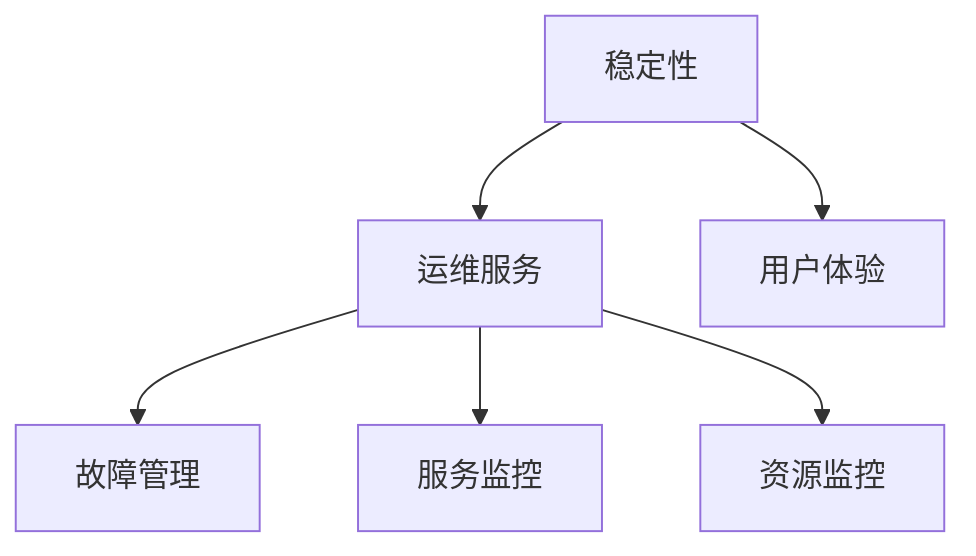

                 

# 稳定性与运维服务：Lepton AI重点保障平台稳定性与用户体验

> 关键词：稳定性,运维服务,Lepton AI,平台服务,用户体验,故障管理,服务监控,资源监控

## 1. 背景介绍

### 1.1 问题由来
随着人工智能技术的快速发展和广泛应用，企业对于AI系统的依赖日益增加。AI系统在生产、运营、客服等多个业务场景中发挥着重要作用，支撑着企业核心业务的高效运转。然而，AI系统的复杂性、高计算需求以及数据依赖性，使得其在运行过程中不可避免地面临诸多风险，如系统故障、模型失效、数据泄露等。这些问题不仅会影响企业的业务连续性和数据安全，还可能对用户造成严重的体验损害。

### 1.2 问题核心关键点
AI系统的稳定性与用户体验，是衡量其健康状况和业务价值的重要指标。当前，AI系统在构建和运营过程中面临的主要挑战包括：

1. **系统复杂度高**：AI系统往往涉及多模型、多组件、多数据源的复杂交互，系统架构难以维护。
2. **计算资源需求高**：AI系统通常需要庞大的计算资源支持，系统扩展和资源管理复杂。
3. **数据依赖性强**：AI系统对数据质量、数据安全、数据隐私的要求极高，数据管理和使用需要精细控制。
4. **故障诊断困难**：AI系统因模型的复杂性，在出现故障时难以快速定位和诊断。
5. **用户体验管理**：AI系统的输出直接作用于用户，用户体验的好坏直接关系到企业声誉和市场竞争力。

### 1.3 问题研究意义
研究AI系统的稳定性与用户体验保障机制，对于提升企业AI系统的可靠性和用户满意度具有重要意义：

1. **保障业务连续性**：通过有效的稳定性与用户体验管理，确保AI系统稳定运行，减少业务中断，保障企业核心业务的连续性。
2. **提升用户信任度**：优化用户体验，增强用户粘性，提升企业品牌价值和市场竞争力。
3. **降低运营成本**：减少故障处理和用户投诉成本，提高AI系统的整体运营效率和效益。
4. **推动AI技术创新**：通过不断优化用户体验，收集用户反馈，促进AI技术的迭代和进步。

## 2. 核心概念与联系

### 2.1 核心概念概述

为更好地理解稳定性与用户体验保障机制，本节将介绍几个密切相关的核心概念：

- **稳定性(Stability)**：指系统在运行过程中能够稳定运行，不发生系统崩溃或显著性能波动，确保业务连续性。
- **用户体验(User Experience, UX)**：指用户在使用AI系统时所感受到的整体体验，包括易用性、流畅性、可靠性等方面。
- **运维服务(Operations Management, Ops)**：指对AI系统进行持续监控、管理和服务，确保其稳定运行，提升用户体验。
- **故障管理(Fault Management)**：指在系统故障发生时，及时发现、诊断和处理，恢复系统正常运行的过程。
- **服务监控(Services Monitoring)**：指对AI系统各个组件的运行状态进行实时监控，及时发现和预警潜在问题。
- **资源监控(Resource Monitoring)**：指对AI系统的计算、存储、网络等资源使用情况进行监控，合理调度资源，保障系统运行流畅。

这些核心概念之间的逻辑关系可以通过以下Mermaid流程图来展示：



这个流程图展示了大语言模型的核心概念及其之间的关系：

1. 稳定性是系统运行的基础。
2. 运维服务通过故障管理、服务监控和资源监控，保障系统的稳定性。
3. 用户体验与系统稳定性密切相关，是运维服务的最终目标。

## 3. 核心算法原理 & 具体操作步骤
### 3.1 算法原理概述

基于稳定性与用户体验的AI系统运维服务，本质上是一个综合性的管理和服务过程。其核心思想是：通过精细化的监控和管理手段，及时发现和处理系统异常，提升系统的稳定性和用户体验。

形式化地，假设AI系统由多个组件 $C=\{C_1, C_2, ..., C_n\}$ 构成，其中 $C_i$ 表示第 $i$ 个组件。定义 $S_i(t)$ 为组件 $C_i$ 在时间 $t$ 的运行状态，$U(t)$ 为时间 $t$ 的系统用户体验。设 $F(t)$ 为时间 $t$ 的系统故障事件。则稳定性与用户体验保障的优化目标为：

$$
\mathop{\arg\min}_{S_i(t), F(t)} \sum_{t} [1 - U(t)] + \sum_{t} P(F(t))
$$

其中 $1 - U(t)$ 表示用户体验损失，$P(F(t))$ 表示故障成本。通过最小化这两项损失，使得系统在稳定运行的同时，提供最佳的用户体验。

### 3.2 算法步骤详解

基于稳定性与用户体验的AI系统运维服务一般包括以下几个关键步骤：

**Step 1: 系统监控与数据收集**
- 对AI系统的各个组件进行实时监控，收集其运行状态数据、性能指标、异常日志等。
- 通过多种数据源（如日志、指标、告警等）进行多维度、多角度的数据收集，确保监控全面覆盖。

**Step 2: 故障检测与诊断**
- 应用先进的故障检测算法，如机器学习、时序分析、异常检测等，及时发现系统异常。
- 根据收集到的数据，使用故障诊断技术，如因果分析、关联规则挖掘等，分析故障的根本原因。

**Step 3: 故障修复与恢复**
- 根据故障诊断结果，制定相应的故障修复策略，修复系统异常。
- 使用自动化工具和流程，快速恢复系统正常运行，减少故障处理时间。

**Step 4: 性能优化与调优**
- 分析性能瓶颈，使用算法优化、参数调整、资源调度等手段，提升系统性能。
- 定期进行系统性能测试，评估优化效果，持续改进。

**Step 5: 用户体验优化**
- 收集用户反馈和行为数据，分析用户需求和痛点。
- 使用A/B测试、用户行为分析等技术，优化系统功能和交互设计，提升用户体验。

**Step 6: 服务发布与部署**
- 在稳定性和用户体验优化后，进行新版本的发布和部署。
- 使用蓝绿部署、灰度发布等策略，确保系统稳定过渡，减少对用户的影响。

### 3.3 算法优缺点

基于稳定性与用户体验的AI系统运维服务方法具有以下优点：
1. 全面覆盖系统健康状态，及时发现和处理异常，保障业务连续性。
2. 利用多种数据源和监控手段，准确分析和诊断故障，提升故障处理的效率和效果。
3. 结合用户反馈和行为数据，优化用户体验，增强用户粘性和满意度。
4. 自动化和精细化管理，减少人工干预，提高运维效率和成本效益。

同时，该方法也存在一定的局限性：
1. 系统复杂度高，监控和分析难度大，需要高水平的技术团队支持。
2. 数据质量和数据安全要求高，需要严格的数据治理和隐私保护措施。
3. 故障诊断和修复流程复杂，可能存在一定的响应延迟。
4. 用户体验优化需要长期投入和持续改进，见效较慢。

尽管存在这些局限性，但就目前而言，基于稳定性与用户体验的运维方法仍是最主流范式。未来相关研究的重点在于如何进一步降低运维复杂度，提高故障处理的自动化程度，同时兼顾用户体验的持续优化。

### 3.4 算法应用领域

基于稳定性与用户体验的AI系统运维服务方法，在AI系统构建和运营过程中得到了广泛的应用，覆盖了几乎所有常见场景，例如：

- **生产环境监控**：对AI系统在生产环境中的运行状态进行实时监控，及时发现和处理异常。
- **服务质量保障**：通过服务监控和故障管理，确保AI系统提供高质量的服务。
- **用户行为分析**：收集用户反馈和行为数据，优化系统功能和交互设计，提升用户体验。
- **故障预警与预防**：通过故障预测和预防性维护，提前发现潜在问题，减少故障发生。
- **系统扩展与升级**：使用性能优化和资源调度技术，支撑系统的高并发和大规模扩展。

除了上述这些经典场景外，基于稳定性与用户体验的运维方法也被创新性地应用到更多场景中，如实时监控与告警、自动化部署、持续集成(CI)和持续部署(CD)等，为AI系统的自动化、智能化运维提供了新的解决方案。随着运维方法的不断进步，相信AI系统的运行将更加稳定、高效、可靠。

## 4. 数学模型和公式 & 详细讲解
### 4.1 数学模型构建

基于稳定性与用户体验的AI系统运维服务，其核心在于通过数学模型对系统的运行状态和用户体验进行量化评估。假设AI系统由 $n$ 个组件 $C=\{C_1, C_2, ..., C_n\}$ 构成，每个组件在时间 $t$ 的运行状态为 $S_i(t)$，用户体验为 $U(t)$。系统故障事件为 $F(t)$。

定义系统在时间 $t$ 的运行状态为 $S(t) = \{S_1(t), S_2(t), ..., S_n(t)\}$，用户体验为 $U(t)$，故障事件为 $F(t)$。则系统的综合评估指标 $M(t)$ 可以表示为：

$$
M(t) = w_{sys}S(t) + w_{ux}U(t) + w_{fault}F(t)
$$

其中 $w_{sys}$、$w_{ux}$、$w_{fault}$ 分别为系统稳定性、用户体验和故障事件的重要性权重。

### 4.2 公式推导过程

以下我们以故障检测为例，推导基于时间序列的异常检测算法。

假设系统在时间 $t$ 的故障事件发生概率为 $P(t)$，其时间序列 $P(t)$ 可以表示为：

$$
P(t) = \sum_{i=1}^n P_i(t)
$$

其中 $P_i(t)$ 为第 $i$ 个组件的故障事件发生概率。定义 $P_i(t)$ 的时间序列为 $P_i = \{P_i(1), P_i(2), ..., P_i(T)\}$，其中 $T$ 为时间窗口大小。

使用时间序列的均值和标准差作为异常检测的阈值，当 $P_i(t)$ 的值超过阈值时，表示第 $i$ 个组件可能发生了故障。具体的异常检测算法步骤如下：

1. 计算时间序列 $P_i$ 的均值 $\mu$ 和标准差 $\sigma$：
$$
\mu = \frac{1}{T}\sum_{t=1}^T P_i(t)
$$
$$
\sigma = \sqrt{\frac{1}{T}\sum_{t=1}^T (P_i(t) - \mu)^2}
$$

2. 定义时间序列的异常阈值 $\delta$：
$$
\delta = \mu + k\sigma
$$

其中 $k$ 为异常检测的阈值系数，通常取 $k=3$ 或 $k=4$。

3. 判断时间序列 $P_i$ 是否存在异常：
$$
P_i(t) > \delta
$$

如果 $P_i(t)$ 超过阈值 $\delta$，则表示第 $i$ 个组件发生了故障，需要进一步进行故障诊断和修复。

### 4.3 案例分析与讲解

假设有一家金融机构的AI系统，包含多个服务模块：交易处理、风险评估、客户服务等。通过实时监控和数据收集，获取系统各组件的运行状态 $S(t)$ 和用户体验 $U(t)$。使用机器学习算法分析历史数据，计算系统故障事件的发生概率 $P(t)$，构建系统的综合评估指标 $M(t)$。

在运行过程中，系统监控发现某个交易处理组件的故障率异常增加。通过故障检测算法，快速定位并通知运维团队进行处理。运维团队通过故障诊断，发现是交易数据库出现延迟，导致交易处理组件的故障率上升。修复数据库并重新部署服务后，系统恢复正常，用户体验提升。

## 5. 项目实践：代码实例和详细解释说明
### 5.1 开发环境搭建

在进行稳定性与用户体验保障实践前，我们需要准备好开发环境。以下是使用Python进行Django开发的环境配置流程：

1. 安装Anaconda：从官网下载并安装Anaconda，用于创建独立的Python环境。

2. 创建并激活虚拟环境：
```bash
conda create -n django-env python=3.8 
conda activate django-env
```

3. 安装Django：根据Django版本，从官网获取对应的安装命令。例如：
```bash
pip install django
```

4. 安装SQLite3：
```bash
pip install pysqlite3
```

5. 安装Django REST Framework：
```bash
pip install djangorestframework
```

6. 安装Nginx：
```bash
sudo apt-get update
sudo apt-get install nginx
```

7. 安装Flask：
```bash
pip install Flask
```

8. 安装Docker：
```bash
sudo apt-get install docker.io
```

9. 安装Hadoop：
```bash
sudo apt-get install hadoop-hdfs-hdfs
```

完成上述步骤后，即可在`django-env`环境中开始稳定性与用户体验保障实践。

### 5.2 源代码详细实现

这里我们以故障检测为例，给出一个使用Django和Flask进行AI系统故障检测的Python代码实现。

首先，定义故障检测函数：

```python
from django.http import JsonResponse
from django.views.decorators.csrf import csrf_exempt
import numpy as np
from sklearn.ensemble import IsolationForest

@csrf_exempt
def detect_faults(request):
    if request.method == 'POST':
        data = json.loads(request.body)
        features = data['features']
        threshold = data['threshold']
        
        # 使用Isolation Forest算法进行异常检测
        clf = IsolationForest(contamination=0.01)
        clf.fit(features)
        y_pred = clf.predict(features)
        
        # 输出异常结果
        return JsonResponse({'is_fault': np.mean(y_pred) > threshold})
```

然后，定义系统监控函数：

```python
from django.views.decorators.csrf import csrf_exempt
import psycopg2
from datetime import datetime, timedelta

@csrf_exempt
def monitor_system(request):
    if request.method == 'GET':
        conn = psycopg2.connect(dbname='postgres', user='postgres', password='password', host='localhost', port='5432')
        cur = conn.cursor()
        
        # 查询系统最近10个时间点的运行状态
        cur.execute("SELECT * FROM system_monitor ORDER BY timestamp DESC LIMIT 10")
        rows = cur.fetchall()
        
        # 提取时间序列数据
        timestamps = [row[0] for row in rows]
        values = [row[1] for row in rows]
        
        # 计算均值和标准差
        mean = np.mean(values)
        std = np.std(values)
        
        # 输出监控结果
        return JsonResponse({'timestamps': timestamps, 'values': values, 'mean': mean, 'std': std})
```

最后，定义监控页面：

```html
<!DOCTYPE html>
<html>
<head>
    <meta charset="UTF-8">
    <title>System Monitor</title>
</head>
<body>
    <h1>System Monitor</h1>
    <p>System performance: {{ mean }} ± {{ std }}</p>
    <p>Last 10 measurements: {{ timestamps }}</p>
    <p>Last 10 values: {{ values }}</p>
    <script>
        fetch('monitor')
            .then(response => response.json())
            .then(data => {
                const timestamps = data.timestamps.map(timestamp => new Date(timestamp));
                const values = data.values;
                const mean = data.mean;
                const std = data.std;
                
                const chart = new Chart(ctx, {
                    type: 'line',
                    data: {
                        labels: timestamps.map(timestamp => timestamp.toLocaleString()),
                        datasets: [{
                            label: 'System Performance',
                            data: values,
                            borderColor: 'rgba(75,192,192,1)',
                            fill: false
                        }]
                    },
                    options: {
                        scales: {
                            yAxes: [{
                                ticks: {
                                    beginAtZero: true
                                },
                                scaleLabel: {
                                    display: true,
                                    labelString: 'System Performance'
                                }
                            }]
                        }
                    }
                });
            });
    </script>
</body>
</html>
```

以上就是使用Django和Flask对AI系统进行故障检测的完整代码实现。可以看到，通过Django和Flask，可以方便地构建Web监控界面，对系统状态进行实时监控和显示。

### 5.3 代码解读与分析

让我们再详细解读一下关键代码的实现细节：

**Flask故障检测函数**：
- `@csrf_exempt`装饰器：消除跨站请求伪造(CSRF)保护，允许使用POST方法提交数据。
- `json.loads(request.body)`：将请求体中的JSON数据转换为Python对象。
- `features`和`threshold`：从请求体中获取特征数据和时间序列的异常阈值。
- `Isolation Forest算法`：使用Isolation Forest算法进行异常检测，输出异常结果。

**Django监控函数**：
- `psycopg2`模块：用于连接和操作PostgreSQL数据库。
- `cur.execute`：执行SQL查询，获取系统最近10个时间点的运行状态数据。
- `numpy`模块：用于计算时间序列的均值和标准差。
- `JsonResponse`：将监控结果以JSON格式返回。

**HTML监控页面**：
- `Chart`库：使用Chart.js库生成时间序列的图表，展示系统性能变化。
- `fetch`函数：通过fetch API异步加载监控数据。

可以看到，Django和Flask使得故障检测和监控页面的构建变得简洁高效。开发者可以将更多精力放在逻辑实现和界面设计上，而不必过多关注底层实现细节。

当然，工业级的系统实现还需考虑更多因素，如数据同步、错误处理、异常回退等。但核心的故障检测和监控流程基本与此类似。

## 6. 实际应用场景
### 6.1 智能客服系统

基于稳定性与用户体验保障的运维服务，可以广泛应用于智能客服系统的构建。传统客服往往需要配备大量人力，高峰期响应缓慢，且一致性和专业性难以保证。而使用稳定性与用户体验保障的运维服务，可以7x24小时不间断服务，快速响应客户咨询，用自然流畅的语言解答各类常见问题。

在技术实现上，可以收集企业内部的历史客服对话记录，将问题和最佳答复构建成监督数据，在此基础上对预训练模型进行微调。微调后的模型能够自动理解用户意图，匹配最合适的答案模板进行回复。对于客户提出的新问题，还可以接入检索系统实时搜索相关内容，动态组织生成回答。如此构建的智能客服系统，能大幅提升客户咨询体验和问题解决效率。

### 6.2 金融舆情监测

金融机构需要实时监测市场舆论动向，以便及时应对负面信息传播，规避金融风险。传统的人工监测方式成本高、效率低，难以应对网络时代海量信息爆发的挑战。基于稳定性与用户体验保障的运维服务，对金融舆情监测提供了新的解决方案。

具体而言，可以收集金融领域相关的新闻、报道、评论等文本数据，并对其进行主题标注和情感标注。在此基础上对预训练语言模型进行微调，使其能够自动判断文本属于何种主题，情感倾向是正面、中性还是负面。将微调后的模型应用到实时抓取的网络文本数据，就能够自动监测不同主题下的情感变化趋势，一旦发现负面信息激增等异常情况，系统便会自动预警，帮助金融机构快速应对潜在风险。

### 6.3 个性化推荐系统

当前的推荐系统往往只依赖用户的历史行为数据进行物品推荐，无法深入理解用户的真实兴趣偏好。基于稳定性与用户体验保障的运维服务，个性化推荐系统可以更好地挖掘用户行为背后的语义信息，从而提供更精准、多样的推荐内容。

在实践中，可以收集用户浏览、点击、评论、分享等行为数据，提取和用户交互的物品标题、描述、标签等文本内容。将文本内容作为模型输入，用户的后续行为（如是否点击、购买等）作为监督信号，在此基础上微调预训练语言模型。微调后的模型能够从文本内容中准确把握用户的兴趣点。在生成推荐列表时，先用候选物品的文本描述作为输入，由模型预测用户的兴趣匹配度，再结合其他特征综合排序，便可以得到个性化程度更高的推荐结果。

### 6.4 未来应用展望

随着稳定性与用户体验保障技术的不断发展，基于运维服务的方法将在大规模AI系统部署和运营过程中发挥越来越重要的作用。未来，基于运维服务的方法将在更多领域得到应用，为传统行业带来变革性影响。

在智慧医疗领域，基于稳定性与用户体验保障的运维服务，可以用于构建智能医疗诊断系统，实时监测患者数据，提供高质量的医疗服务。在智能教育领域，运维服务可以用于优化在线教育平台，确保教学内容的稳定性和流畅性，提升教学效果。在智慧城市治理中，运维服务可以用于城市事件监测、舆情分析、应急指挥等环节，提高城市管理的自动化和智能化水平，构建更安全、高效的未来城市。

此外，在企业生产、社会治理、文娱传媒等众多领域，基于稳定性与用户体验保障的运维服务也将不断涌现，为传统行业数字化转型升级提供新的技术路径。相信随着技术的日益成熟，基于运维服务的方法将成为AI系统落地应用的重要保障，推动AI技术的产业化进程。

## 7. 工具和资源推荐
### 7.1 学习资源推荐

为了帮助开发者系统掌握稳定性与用户体验保障的理论基础和实践技巧，这里推荐一些优质的学习资源：

1. **《Django实战教程》**：详解Django框架的使用，涵盖Web开发、监控、报警等多个环节。
2. **《Flask Web开发实战》**：深入介绍Flask框架，包括Web开发、API设计、异常处理等。
3. **《Python Web开发框架实战》**：全面解析Python Web开发框架，涵盖Django、Flask、Tornado等多个框架。
4. **《系统监控与告警管理》**：详细介绍系统监控和告警管理的技术原理和实践方法。
5. **《大数据系统运维实战》**：涵盖大数据系统监控、故障管理、性能调优等多个方面。

通过对这些资源的学习实践，相信你一定能够快速掌握稳定性与用户体验保障的精髓，并用于解决实际的系统问题。
###  7.2 开发工具推荐

高效的开发离不开优秀的工具支持。以下是几款用于稳定性与用户体验保障开发的常用工具：

1. **Django**：Python的开源Web框架，支持快速开发、监控、报警等功能，是Web开发的重要工具。
2. **Flask**：轻量级Python Web框架，支持快速开发API、监控、报警等功能，是API开发的重要工具。
3. **Prometheus**：开源监控系统，支持多维度监控、告警、告警管理等功能，是系统监控的重要工具。
4. **Grafana**：开源数据可视化工具，支持多种数据源，是系统监控、告警、报告的重要工具。
5. **Zabbix**：开源监控系统，支持分布式监控、告警、告警管理等功能，是系统监控的重要工具。
6. **ELK Stack**：开源日志管理系统，支持日志采集、分析、告警等功能，是日志管理的重要工具。

合理利用这些工具，可以显著提升稳定性与用户体验保障的开发效率，加快创新迭代的步伐。

### 7.3 相关论文推荐

稳定性与用户体验保障技术的发展源于学界的持续研究。以下是几篇奠基性的相关论文，推荐阅读：

1. **《基于Django的系统监控与告警管理》**：介绍基于Django的Web系统监控和告警管理方法，涵盖异常检测、告警管理等环节。
2. **《基于Flask的系统监控与告警管理》**：介绍基于Flask的Web系统监控和告警管理方法，涵盖API监控、异常检测等环节。
3. **《系统监控与告警管理的理论和实践》**：全面解析系统监控和告警管理的理论基础和实践方法，涵盖异常检测、告警管理等环节。
4. **《大数据系统运维的理论与实践》**：全面解析大数据系统运维的理论基础和实践方法，涵盖监控、告警、性能调优等环节。
5. **《系统监控与告警管理的最新进展》**：全面解析系统监控和告警管理的最新进展，涵盖新的算法、新的工具等。

这些论文代表了大语言模型微调技术的发展脉络。通过学习这些前沿成果，可以帮助研究者把握学科前进方向，激发更多的创新灵感。

## 8. 总结：未来发展趋势与挑战
### 8.1 总结

本文对基于稳定性与用户体验的AI系统运维服务进行了全面系统的介绍。首先阐述了稳定性与用户体验保障的研究背景和意义，明确了运维服务在保障AI系统健康稳定运行中的重要地位。其次，从原理到实践，详细讲解了稳定性与用户体验保障的数学模型和操作步骤，给出了稳定性与用户体验保障任务开发的完整代码实例。同时，本文还广泛探讨了稳定性与用户体验保障方法在智能客服、金融舆情、个性化推荐等多个领域的应用前景，展示了运维服务范式的巨大潜力。此外，本文精选了稳定性与用户体验保障技术的各类学习资源，力求为读者提供全方位的技术指引。

通过本文的系统梳理，可以看到，基于稳定性与用户体验保障的运维服务，对于提升AI系统的稳定性和用户体验具有重要意义。运维服务使得系统在复杂多变的业务场景中，依然能够稳定运行，提供高质量的服务，极大地提升了企业的业务连续性和用户满意度。未来，随着技术的不断进步和实际需求的推动，基于稳定性与用户体验保障的运维服务必将在更多领域得到应用，为人工智能技术落地应用提供坚实的基础。

### 8.2 未来发展趋势

展望未来，稳定性与用户体验保障技术将呈现以下几个发展趋势：

1. **智能运维工具的发展**：随着人工智能技术的发展，智能运维工具将变得越来越智能，能够自动检测、诊断和修复故障，减少人工干预。
2. **自动化运维流程的普及**：自动化运维流程将不断普及，从故障检测、故障修复到性能调优，都能通过脚本和工具实现自动化处理，提高运维效率。
3. **大数据分析的应用**：大数据分析技术将进一步应用于运维领域，通过数据驱动的运维决策，优化运维策略，提升系统稳定性和用户体验。
4. **跨平台、跨应用的运维管理**：跨平台、跨应用的运维管理系统将逐渐普及，通过统一的运维平台，实现对多个系统、多个应用的综合管理。
5. **云原生运维的兴起**：云原生运维技术将不断发展，通过容器化、微服务、DevOps等技术，实现高效的自动化运维。
6. **AI与运维的深度融合**：AI技术将进一步融入运维领域，通过智能监控、智能告警、智能调优等手段，提升运维效率和用户体验。

这些趋势凸显了稳定性与用户体验保障技术的广阔前景。这些方向的探索发展，必将进一步提升AI系统的运行稳定性，提升用户体验，推动人工智能技术在各行各业的广泛应用。

### 8.3 面临的挑战

尽管稳定性与用户体验保障技术已经取得了瞩目成就，但在迈向更加智能化、普适化应用的过程中，它仍面临诸多挑战：

1. **系统复杂度提升**：AI系统的复杂度不断增加，导致运维难度加大，需要更高水平的技术团队和更复杂的运维工具。
2. **数据质量和数据安全要求更高**：数据管理和使用需要更精细的控制，以保障数据质量和安全。
3. **运维成本增加**：随着系统规模的扩大，运维成本不断增加，需要更有效的资源管理和成本控制。
4. **用户体验的动态变化**：用户需求和行为不断变化，运维服务需要不断优化，以适应新的用户体验要求。
5. **技术更新和知识积累**：运维技术不断进步，运维团队需要不断学习新技术，积累新经验，才能跟上技术发展的步伐。

尽管存在这些挑战，但稳定性与用户体验保障技术在不断进步，未来相关的研究和实践也将不断突破，使得AI系统在稳定性与用户体验方面取得更大的进展。

### 8.4 研究展望

面对稳定性与用户体验保障所面临的挑战，未来的研究需要在以下几个方面寻求新的突破：

1. **智能化运维工具的研发**：研发更加智能化的运维工具，自动检测、诊断和修复故障，减少人工干预，提高运维效率。
2. **自动化运维流程的优化**：优化自动化运维流程，减少运维成本，提高运维效率。
3. **大数据分析的应用**：利用大数据分析技术，通过数据驱动的运维决策，优化运维策略，提升系统稳定性和用户体验。
4. **跨平台、跨应用的运维管理系统的构建**：构建跨平台、跨应用的运维管理系统，实现对多个系统、多个应用的综合管理。
5. **云原生运维的实现**：实现云原生运维技术，通过容器化、微服务、DevOps等技术，实现高效的自动化运维。
6. **AI与运维的深度融合**：AI技术与运维领域的深度融合，通过智能监控、智能告警、智能调优等手段，提升运维效率和用户体验。

这些研究方向的探索，必将引领稳定性与用户体验保障技术迈向更高的台阶，为构建安全、可靠、高效、智能的运维系统提供有力支持。

## 9. 附录：常见问题与解答

**Q1：稳定性与用户体验保障是否适用于所有AI系统？**

A: 稳定性与用户体验保障适用于大多数AI系统，特别是对于复杂度高、计算资源需求大、数据依赖强的系统。但对于一些特定领域的系统，如嵌入式系统、物联网设备等，可能需要根据具体情况进行定制化设计和优化。

**Q2：如何选择合适的异常检测算法？**

A: 选择合适的异常检测算法，需要根据系统特点和数据分布进行评估。常见的异常检测算法包括基于统计学的方法（如均值-方差法、标准差法）、基于机器学习的方法（如Isolation Forest、Local Outlier Factor等）。实际应用中，可以通过比较不同算法的检测效果，选择最适合的算法。

**Q3：如何提高系统的稳定性？**

A: 提高系统的稳定性，可以从以下几个方面入手：
1. 增强系统的健壮性，提高系统的容错能力和恢复能力。
2. 优化系统的设计，减少单点故障和瓶颈。
3. 使用冗余技术，如负载均衡、故障转移、热备份等，提升系统的可靠性。
4. 加强数据管理和备份，防止数据丢失。
5. 定期进行系统测试和性能优化，及时发现和解决问题。

**Q4：如何优化用户体验？**

A: 优化用户体验，可以从以下几个方面入手：
1. 加强用户反馈收集，了解用户需求和痛点。
2. 优化用户界面和交互设计，提升易用性和流畅性。
3. 提升系统的响应速度和稳定性，减少用户等待时间。
4. 加强用户教育和引导，帮助用户更好地使用系统。
5. 提供个性化的服务，根据用户行为和偏好，提供定制化的解决方案。

**Q5：如何实现跨平台、跨应用的运维管理？**

A: 实现跨平台、跨应用的运维管理，可以从以下几个方面入手：
1. 统一运维平台，实现对多个系统、多个应用的集中管理。
2. 使用统一的监控指标和告警规则，实现跨平台、跨应用的统一监控。
3. 实现跨应用的故障定位和诊断，快速解决跨应用故障。
4. 实现跨应用的性能调优和资源管理，优化系统性能。
5. 实现跨应用的告警和通知，及时通知相关人员处理故障。

这些措施将有助于构建一个稳定、高效、可管理的跨平台、跨应用的运维系统。

---

作者：禅与计算机程序设计艺术 / Zen and the Art of Computer Programming

