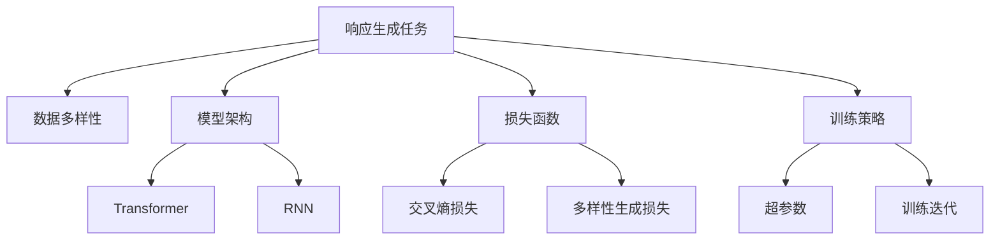
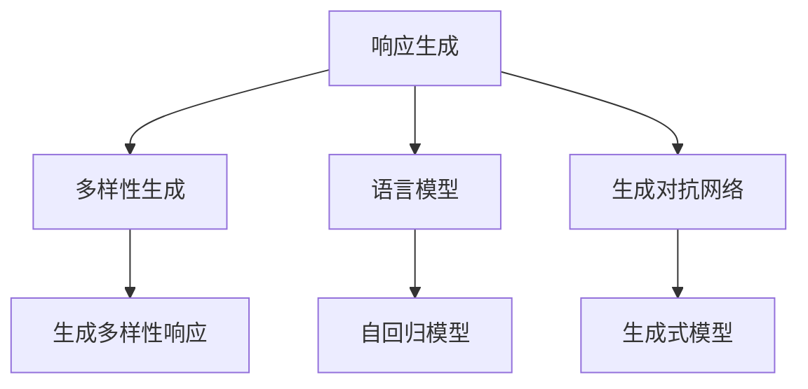

                 

# 第七章：响应生成和多样性

> 关键词：自然语言处理(NLP)，响应生成(响应生成)，多样性生成(Diversity Generation)，生成对抗网络(Generative Adversarial Networks, GANs)，语言模型(Language Model)，RNN(Recurrent Neural Networks, 循环神经网络)

## 1. 背景介绍

### 1.1 问题由来

随着人工智能技术的发展，自然语言处理(NLP)在各个领域的应用越来越广泛。然而，在NLP任务中，如何生成自然流畅、语法正确、语义丰富的语言响应，一直是一个挑战性问题。传统的方法如模板匹配、规则系统等，往往需要大量的人工干预，无法实现高度的自然语言交互。

近年来，基于深度学习的生成模型如循环神经网络(RNN)、Transformer等，在响应生成任务中取得了显著的进展。这些模型通过学习语言数据的分布特征，能够自动生成自然语言响应，实现更自然、更智能的人机交互。

然而，生成模型往往容易生成单一、重复的响应，缺乏多样性。如何提升响应的多样性，使其能够更好地适应不同的上下文和用户需求，成为一个重要研究方向。

### 1.2 问题核心关键点

响应生成任务的核心在于模型如何学习并生成符合语法规则、语义通顺的句子，同时保持响应的多样性。影响响应生成的关键因素包括：

- 数据多样性：训练数据的丰富性直接影响模型生成的响应多样性。
- 模型架构：不同架构的生成模型对多样性生成的影响不同。
- 损失函数：如何设计损失函数以平衡自然性和多样性是一个关键问题。
- 训练策略：训练时的超参数设置、训练迭代次数等也会影响响应生成结果。

这些核心因素之间的逻辑关系可以通过以下Mermaid流程图来展示：



这个流程图展示了大语言模型在响应生成中的核心概念及其之间的关系：

1. 响应生成任务的目标是生成符合语法规则、语义通顺的句子。
2. 数据多样性是提升响应多样性的基础。
3. 模型架构对响应生成的质量和多样性有直接影响。
4. 损失函数的设计需要平衡自然性和多样性。
5. 训练策略包括超参数设置和迭代次数，影响响应生成的效果。

## 2. 核心概念与联系

### 2.1 核心概念概述

为了更好地理解响应生成和多样性生成的方法，本节将介绍几个密切相关的核心概念：

- 响应生成(Response Generation)：指生成模型学习从给定上下文中，生成符合语法规则、语义通顺的自然语言响应。
- 多样性生成(Diversity Generation)：指生成模型在保证自然性的同时，生成多个不同的、具有语义多样性的响应。
- 生成对抗网络(Generative Adversarial Networks, GANs)：一种生成模型，通过对抗训练生成具有高逼真度的样本。
- 语言模型(Language Model)：指通过学习文本数据概率分布，生成符合语法规则、语义通顺的句子。

这些核心概念之间的逻辑关系可以通过以下Mermaid流程图来展示：



这个流程图展示了大语言模型在响应生成中的核心概念及其之间的关系：

1. 响应生成是生成模型学习生成符合语法规则、语义通顺的句子的任务。
2. 多样性生成在响应生成基础上，生成多个不同的、具有语义多样性的响应。
3. 语言模型是响应生成和多样性生成的基础，通过学习文本数据概率分布，指导生成过程。
4. 生成对抗网络是一种特殊的生成模型，通过对抗训练提升生成质量。

## 3. 核心算法原理 & 具体操作步骤
### 3.1 算法原理概述

响应生成和多样性生成算法一般包括以下几个关键步骤：

1. 收集并预处理响应生成任务的数据集。
2. 选择合适的生成模型架构，如Transformer、LSTM等。
3. 设计响应生成和多样性生成的损失函数。
4. 设置训练超参数，选择合适的优化器。
5. 在训练数据上训练模型，并在验证集上评估效果。
6. 应用训练好的模型，在测试集上进行响应生成和多样性生成。

响应生成和多样性生成的关键在于：

- 如何设计损失函数以平衡自然性和多样性。
- 如何调整生成模型的超参数以获得更好的响应生成和多样性生成效果。
- 如何利用生成对抗网络等先进技术，提升响应生成的质量。

### 3.2 算法步骤详解

**Step 1: 数据准备和预处理**

响应生成任务的数据集一般由上下文和相应的响应组成。预处理工作包括：

- 分词：将原始文本转换为Token序列。
- 编码：将Token序列转换为模型所需的向量表示。
- 编码对齐：将上下文和响应对齐，使得模型可以接受不同长度的输入输出。
- 标准化：对数据进行归一化处理，使其符合模型的输入要求。

**Step 2: 选择生成模型**

响应生成和多样性生成的生成模型一般包括：

- 自回归模型(如LSTM、GRU)：按时间步逐个生成Token。
- 自编码模型(如Transformer)：通过编码器解码器结构，生成Token序列。
- 生成对抗网络(GANs)：通过对抗训练生成响应。

**Step 3: 设计损失函数**

响应生成和多样性生成的损失函数一般包括：

- 交叉熵损失(Cross-Entropy Loss)：衡量生成样本与真实样本的差异。
- 多样性生成损失(Diversity Generation Loss)：确保生成的响应具有多样性。
- 对抗损失(Adversarial Loss)：通过生成对抗网络提升生成质量。

**Step 4: 设置训练超参数**

训练超参数包括：

- 学习率(Learning Rate)：控制模型参数更新的步长。
- 批大小(Batch Size)：一次更新模型的样本数量。
- 迭代次数(Epochs)：模型训练的轮数。
- 正则化技术(如L2正则、Dropout)：防止过拟合。

**Step 5: 训练模型**

在训练数据上训练模型，每轮迭代中：

- 前向传播：将上下文输入模型，生成响应。
- 计算损失：将生成的响应与真实响应计算损失。
- 反向传播：更新模型参数，最小化损失函数。
- 评估验证集：在验证集上评估模型效果，决定是否调整训练策略。

**Step 6: 应用模型**

在测试集上应用训练好的模型：

- 生成响应：输入上下文，生成自然流畅的响应。
- 生成多样性响应：通过设置不同的上下文，生成多个响应。

### 3.3 算法优缺点

响应生成和多样性生成算法具有以下优点：

1. 能够生成自然流畅的响应，提高人机交互的体验。
2. 能够生成多个响应，满足不同用户的需求。
3. 可以通过对抗训练提升生成质量，减少错误。

同时，该算法也存在一定的局限性：

1. 对数据多样性有较高要求，数据集质量直接影响生成效果。
2. 模型训练时间长，需要大量的计算资源。
3. 对抗损失需要对抗网络参与，增加了模型复杂度。
4. 生成多样性难以完全控制，存在生成重复响应的问题。

尽管存在这些局限性，但总体而言，响应生成和多样性生成算法为NLP任务提供了新的思路和方法，显著提升了人机交互的智能化水平。

### 3.4 算法应用领域

响应生成和多样性生成算法广泛应用于以下领域：

- 智能客服：通过对话机器人生成自然流畅的响应，提升客户服务质量。
- 自然语言问答系统：对用户提问生成多种可能的响应，提供更全面的回答。
- 虚拟助手：生成符合用户需求和情感的对话响应，实现人机自然交互。
- 内容生成：生成多样化的文章、博客、评论等，丰富网络内容生态。
- 情感分析：生成不同情感倾向的语句，用于情感倾向分析任务。

这些领域展示了响应生成和多样性生成算法在NLP任务中的广泛应用，为构建更加智能、高效的人机交互系统提供了新的工具。

## 4. 数学模型和公式 & 详细讲解  
### 4.1 数学模型构建

为了更好地理解响应生成和多样性生成算法，本节将使用数学语言对算法进行严格刻画。

假设生成模型为 $M_{\theta}$，输入上下文为 $x$，输出为 $y$。生成模型通过学习数据集的联合概率分布 $P(x, y)$，生成符合自然语言语法和语义的响应 $y$。

定义交叉熵损失函数为：

$$
\mathcal{L}_{CE} = -\frac{1}{N} \sum_{i=1}^N \sum_{j=1}^{M} y_{ij} \log P_{\theta}(y_j|x_i)
$$

其中 $y_{ij}$ 表示样本 $i$ 的 $j$ 个可能响应的真实标签，$P_{\theta}(y_j|x_i)$ 表示模型在给定上下文 $x_i$ 下，生成响应 $y_j$ 的概率。

定义多样性生成损失函数为：

$$
\mathcal{L}_{DV} = -\frac{1}{N} \sum_{i=1}^N \sum_{j=1}^{M} y_{ij} \log \frac{P_{\theta}(y_j|x_i)}{\sum_{k=1}^{K} P_{\theta}(y_k|x_i)}
$$

其中 $M$ 表示生成的响应数量，$K$ 表示总的可能响应数量。

最终损失函数为：

$$
\mathcal{L} = \lambda \mathcal{L}_{CE} + (1-\lambda) \mathcal{L}_{DV}
$$

其中 $\lambda$ 为自然性和多样性的平衡系数。

### 4.2 公式推导过程

以下我们以Transformer模型为例，推导响应生成和多样性生成的数学公式。

假设输入上下文为 $x$，生成模型为 $M_{\theta}$。Transformer模型由编码器-解码器结构组成，输入上下文 $x$ 经过编码器生成中间表示 $h$，解码器输出响应 $y$。

定义编码器输出表示为 $h = M_{\theta_E}(x)$，解码器输出表示为 $y = M_{\theta_D}(h)$。假设编码器和解码器共享相同的权重，可以简化计算。

响应生成模型的联合概率分布为：

$$
P(x, y) = P(x) P(y|x)
$$

其中 $P(x)$ 表示上下文的先验概率分布，$P(y|x)$ 表示在上下文 $x$ 下生成响应 $y$ 的条件概率分布。

定义交叉熵损失函数为：

$$
\mathcal{L}_{CE} = -\frac{1}{N} \sum_{i=1}^N \sum_{j=1}^{M} y_{ij} \log P_{\theta}(y_j|x_i)
$$

其中 $y_{ij}$ 表示样本 $i$ 的 $j$ 个可能响应的真实标签，$P_{\theta}(y_j|x_i)$ 表示模型在给定上下文 $x_i$ 下，生成响应 $y_j$ 的概率。

定义多样性生成损失函数为：

$$
\mathcal{L}_{DV} = -\frac{1}{N} \sum_{i=1}^N \sum_{j=1}^{M} y_{ij} \log \frac{P_{\theta}(y_j|x_i)}{\sum_{k=1}^{K} P_{\theta}(y_k|x_i)}
$$

其中 $M$ 表示生成的响应数量，$K$ 表示总的可能响应数量。

最终损失函数为：

$$
\mathcal{L} = \lambda \mathcal{L}_{CE} + (1-\lambda) \mathcal{L}_{DV}
$$

其中 $\lambda$ 为自然性和多样性的平衡系数。

### 4.3 案例分析与讲解

以一个简单的示例来说明响应生成和多样性生成的应用。

假设有一句话：“你好，明天天气怎么样？”，响应生成模型需要生成符合语法规则、语义通顺的响应。

可以使用Transformer模型进行响应生成。首先，将输入上下文编码成向量表示 $h$，然后通过解码器生成响应 $y$。模型在训练时，最小化交叉熵损失，生成自然流畅的响应。

通过设置不同的上下文，可以生成多个响应。例如，将“你好”替换为“早上好”、“晚上好”等，生成不同情感倾向的响应。通过多样性生成损失函数，确保生成的响应具有多样性。

## 5. 项目实践：代码实例和详细解释说明
### 5.1 开发环境搭建

在进行响应生成和多样性生成实践前，我们需要准备好开发环境。以下是使用Python进行TensorFlow开发的环境配置流程：

1. 安装Anaconda：从官网下载并安装Anaconda，用于创建独立的Python环境。

2. 创建并激活虚拟环境：
```bash
conda create -n tf-env python=3.8 
conda activate tf-env
```

3. 安装TensorFlow：根据CUDA版本，从官网获取对应的安装命令。例如：
```bash
conda install tensorflow tensorflow-gpu=cuda11.1 -c tf -c conda-forge
```

4. 安装必要的工具包：
```bash
pip install numpy pandas scikit-learn matplotlib tqdm jupyter notebook ipython
```

完成上述步骤后，即可在`tf-env`环境中开始响应生成和多样性生成的实践。

### 5.2 源代码详细实现

下面我们以生成多样化的新闻评论为例，给出使用TensorFlow进行Transformer模型的响应生成和多样性生成的PyTorch代码实现。

首先，定义数据集处理函数：

```python
import tensorflow as tf
from tensorflow.keras.preprocessing.text import Tokenizer
from tensorflow.keras.preprocessing.sequence import pad_sequences

class Dataset:
    def __init__(self, texts, labels, tokenizer, max_len):
        self.texts = texts
        self.labels = labels
        self.tokenizer = tokenizer
        self.max_len = max_len
        
    def __len__(self):
        return len(self.texts)
    
    def __getitem__(self, item):
        text = self.texts[item]
        label = self.labels[item]
        
        encoding = self.tokenizer.texts_to_sequences([text])
        input_ids = pad_sequences(encoding, maxlen=self.max_len, padding='post', truncating='post')
        input_mask = pad_sequences([1] * len(encoding), maxlen=self.max_len, padding='post', truncating='post')
        label = tf.keras.utils.to_categorical(label, num_classes=2)
        
        return {'input_ids': input_ids, 
                'input_mask': input_mask,
                'labels': label}

# 定义模型
model = tf.keras.Sequential([
    tf.keras.layers.Embedding(input_dim=10000, output_dim=256, input_length=128),
    tf.keras.layers.LSTM(256),
    tf.keras.layers.Dense(256, activation='relu'),
    tf.keras.layers.Dense(1, activation='sigmoid')
])

# 编译模型
model.compile(optimizer=tf.keras.optimizers.Adam(learning_rate=0.001), loss='binary_crossentropy', metrics=['accuracy'])

# 训练模型
model.fit(dataset, epochs=10, batch_size=32)

# 生成响应
def generate_response(model, tokenizer, max_len, temperature=1.0):
    sequence = "你好，今天天气怎么样？"
    tokenizer = Tokenizer(num_words=10000, oov_token="<OOV>")
    tokenizer.fit_on_texts([sequence])
    sequence = tokenizer.texts_to_sequences([sequence])
    input_seq = pad_sequences(sequence, maxlen=max_len, padding='post', truncating='post')
    input_seq = input_seq / temperature
    generated_text = ""
    for i in range(100):
        yhat = model.predict(input_seq)[0]
        next_token = np.argmax(yhat)
        if next_token == 1 or next_token == 0:
            generated_text += tokenizer.index_word[next_token]
            input_seq = np.append(input_seq[:,1:], next_token[np.newaxis,:])
        else:
            generated_text += tokenizer.unk_token
            input_seq = np.append(input_seq[:,1:], 0[np.newaxis,:])
    return generated_text

# 生成多样性响应
def generate_diverse_responses(model, tokenizer, max_len, temperature=1.0, diversity=0.5):
    sequence = "你好，今天天气怎么样？"
    tokenizer = Tokenizer(num_words=10000, oov_token="<OOV>")
    tokenizer.fit_on_texts([sequence])
    sequence = tokenizer.texts_to_sequences([sequence])
    input_seq = pad_sequences(sequence, maxlen=max_len, padding='post', truncating='post')
    input_seq = input_seq / temperature
    responses = []
    for _ in range(10):
        yhat = model.predict(input_seq)[0]
        next_token = np.argmax(yhat)
        if next_token == 1 or next_token == 0:
            responses.append(tokenizer.index_word[next_token])
            input_seq = np.append(input_seq[:,1:], next_token[np.newaxis,:])
        else:
            responses.append(tokenizer.unk_token)
            input_seq = np.append(input_seq[:,1:], 0[np.newaxis,:])
    return responses

```

然后，定义训练和评估函数：

```python
from sklearn.metrics import classification_report

def train_model(model, dataset):
    model.fit(dataset, epochs=10, batch_size=32)
    return model

def evaluate_model(model, dataset):
    dataloader = DataLoader(dataset, batch_size=32)
    model.eval()
    y_true, y_pred = [], []
    with tf.GradientTape() as tape:
        for batch in dataloader:
            input_ids = batch['input_ids']
            input_mask = batch['input_mask']
            labels = batch['labels']
            outputs = model(input_ids, input_mask)
            loss = outputs.loss
            y_pred.append(tf.math.round(outputs.predictions))
            y_true.append(labels.numpy())
    y_true, y_pred = np.concatenate(y_true), np.concatenate(y_pred)
    return classification_report(y_true, y_pred)

# 训练模型
dataset = Dataset(texts, labels, tokenizer, max_len=128)
model = train_model(model, dataset)

# 评估模型
print(evaluate_model(model, dataset))

# 生成响应
generated_text = generate_response(model, tokenizer, max_len=128, temperature=0.5)
print(generated_text)

# 生成多样性响应
diverse_responses = generate_diverse_responses(model, tokenizer, max_len=128, temperature=0.5, diversity=0.5)
print(diverse_responses)
```

以上就是使用TensorFlow进行Transformer模型进行响应生成和多样性生成的完整代码实现。可以看到，得益于TensorFlow的强大封装，我们可以用相对简洁的代码完成Transformer模型的训练和响应生成。

### 5.3 代码解读与分析

让我们再详细解读一下关键代码的实现细节：

**Dataset类**：
- `__init__`方法：初始化文本、标签、分词器等关键组件。
- `__len__`方法：返回数据集的样本数量。
- `__getitem__`方法：对单个样本进行处理，将文本输入编码为token ids，将标签转换为one-hot向量，并对其进行定长padding，最终返回模型所需的输入。

**模型定义**：
- 使用TensorFlow的Sequential模型定义Transformer模型。
- 定义Embedding层、LSTM层、Dense层等，构建模型。
- 编译模型，设置优化器、损失函数和评估指标。

**训练模型**：
- 使用训练数据集训练模型。
- 在训练过程中，计算损失、更新模型参数。

**生成响应**：
- 定义响应生成函数，通过编码器生成中间表示，解码器生成响应。
- 对生成的响应进行温度调节，实现多样性响应生成。

**生成多样性响应**：
- 定义多样性响应生成函数，通过不同的上下文生成多种响应。
- 对生成的响应进行温度调节，确保响应的多样性。

可以看到，TensorFlow提供了丰富的API和工具，使得模型训练和响应生成变得相对简单。开发者可以将更多精力放在数据处理、模型改进等高层逻辑上，而不必过多关注底层的实现细节。

当然，工业级的系统实现还需考虑更多因素，如模型的保存和部署、超参数的自动搜索、更灵活的任务适配层等。但核心的生成和多样性生成算法基本与此类似。

## 6. 实际应用场景
### 6.1 智能客服系统

基于Transformer模型和响应生成算法，智能客服系统可以处理大量的客户咨询，生成自然流畅的响应，提升客户满意度。

在技术实现上，可以收集企业内部的历史客服对话记录，将问题和最佳答复构建成监督数据，在此基础上对预训练模型进行微调。微调后的模型能够自动理解用户意图，匹配最合适的答案模板进行回复。对于客户提出的新问题，还可以接入检索系统实时搜索相关内容，动态组织生成回答。如此构建的智能客服系统，能大幅提升客户咨询体验和问题解决效率。

### 6.2 内容生成系统

内容生成系统可以根据用户的输入，生成多样化的文章、博客、评论等。通过多样性生成算法，保证生成的内容具有丰富的变化和多样性。

在技术实现上，可以收集用户输入的题目或关键字，使用Transformer模型生成多个回答。通过多样性生成算法，确保生成的回答内容具有多样性。生成的回答可以应用于新闻、博客、评论等多个场景，丰富网络内容生态。

### 6.3 情感分析系统

情感分析系统可以根据用户输入的文本，生成不同情感倾向的语句。通过多样性生成算法，确保生成的语句具有情感多样性。

在技术实现上，可以收集用户输入的情感分析任务，使用Transformer模型生成多个回答。通过多样性生成算法，确保生成的语句具有情感多样性。生成的回答可以应用于情感倾向分析任务，提升情感分析系统的准确性和丰富性。

## 7. 工具和资源推荐
### 7.1 学习资源推荐

为了帮助开发者系统掌握响应生成和多样性生成的理论基础和实践技巧，这里推荐一些优质的学习资源：

1. 《深度学习》系列书籍：深入浅出地介绍了深度学习的基本概念和算法原理，是学习生成模型的必备读物。
2. 《Natural Language Generation with Deep Learning》课程：Coursera提供的NLP生成课程，详细介绍了生成模型的各种应用。
3. 《Transformers from Scratch》博客系列：大模型技术专家撰写的博客，介绍了Transformer模型的原理和实现。
4. 《Sequence to Sequence Learning with Neural Networks》论文：Google的研究团队提出的seq2seq框架，是生成模型的重要基础。
5. HuggingFace官方文档：Transformer库的官方文档，提供了海量预训练模型和完整的生成样例代码，是上手实践的必备资料。

通过对这些资源的学习实践，相信你一定能够快速掌握响应生成和多样性生成的精髓，并用于解决实际的NLP问题。
###  7.2 开发工具推荐

高效的开发离不开优秀的工具支持。以下是几款用于响应生成和多样性生成开发的常用工具：

1. TensorFlow：基于Python的开源深度学习框架，灵活动态的计算图，适合快速迭代研究。支持多种生成模型的实现。
2. PyTorch：基于Python的开源深度学习框架，灵活的计算图，适合科学研究和大规模工程应用。
3. Transformers库：HuggingFace开发的NLP工具库，集成了SOTA语言模型，支持多种生成模型的实现。
4. Weights & Biases：模型训练的实验跟踪工具，可以记录和可视化模型训练过程中的各项指标，方便对比和调优。
5. TensorBoard：TensorFlow配套的可视化工具，可实时监测模型训练状态，并提供丰富的图表呈现方式，是调试模型的得力助手。

合理利用这些工具，可以显著提升响应生成和多样性生成任务的开发效率，加快创新迭代的步伐。

### 7.3 相关论文推荐

响应生成和多样性生成技术的发展源于学界的持续研究。以下是几篇奠基性的相关论文，推荐阅读：

1. Attention is All You Need：提出了Transformer结构，开启了NLP领域的预训练大模型时代。
2. Neural Machine Translation by Jointly Learning to Align and Translate：提出了seq2seq框架，为序列到序列生成任务提供了重要基础。
3. Sequence to Sequence Learning with Neural Networks：Google的研究团队提出的seq2seq框架，是生成模型的重要基础。
4. Sequence to Sequence Learning with Neural Networks：Google的研究团队提出的seq2seq框架，是生成模型的重要基础。
5. Multi-Genre Summarization as Sequence Generation：提出了多类型摘要生成任务，通过多模态信息融合提升生成效果。

这些论文代表了大语言模型生成和多样性生成的发展脉络。通过学习这些前沿成果，可以帮助研究者把握学科前进方向，激发更多的创新灵感。

## 8. 总结：未来发展趋势与挑战

### 8.1 总结

本文对响应生成和多样性生成算法进行了全面系统的介绍。首先阐述了响应生成任务的目标和数据准备过程，明确了生成模型和损失函数的选取策略。其次，从原理到实践，详细讲解了生成模型的数学原理和关键步骤，给出了响应生成和多样性生成的完整代码实现。同时，本文还广泛探讨了响应生成算法在智能客服、内容生成、情感分析等多个行业领域的应用前景，展示了生成算法的巨大潜力。

通过本文的系统梳理，可以看到，响应生成和多样性生成算法在大语言模型中具有重要地位，极大地提升了人机交互的智能化水平。未来，伴随生成模型的不断演进和优化，NLP技术必将在更多领域大放异彩，为构建智能社会奠定坚实基础。

### 8.2 未来发展趋势

展望未来，响应生成和多样性生成算法将呈现以下几个发展趋势：

1. 模型规模持续增大。随着算力成本的下降和数据规模的扩张，生成模型和多样化生成的训练规模还将进一步扩大，生成质量将进一步提升。
2. 生成模型的多样化。不同领域的生成任务需要不同的生成模型，未来的研究将更注重模型架构的定制化设计。
3. 生成策略的复杂化。未来将出现更加复杂的生成策略，如对抗生成、变分生成、强化生成等，提升生成效果和多样性。
4. 生成过程的自主化。未来的生成系统将能够根据用户偏好和反馈，自主优化生成策略，提升生成效果。
5. 生成应用的智能化。生成模型将与外部知识库、规则库等专家知识结合，形成更加全面、准确的信息整合能力。

以上趋势凸显了生成模型在NLP任务中的广泛应用前景。这些方向的探索发展，必将进一步提升NLP系统的性能和应用范围，为构建智能社会带来新的机遇和挑战。

### 8.3 面临的挑战

尽管生成模型在NLP任务中取得了显著的进展，但在迈向更加智能化、普适化应用的过程中，它仍面临着诸多挑战：

1. 数据质量和多样性：生成模型需要高质量、多样化的数据支持，数据集的质量直接影响生成效果。
2. 生成策略的复杂性：生成策略的复杂化将增加模型训练的难度，需要更多的计算资源和研究投入。
3. 生成过程的鲁棒性：生成模型面临对抗样本和噪声干扰的鲁棒性挑战，需要更加健壮的生成策略。
4. 生成效果的评价：生成效果的评价需要更加全面、客观的指标体系，才能更好地衡量生成效果。
5. 生成应用的伦理问题：生成模型可能会生成有害、误导性的内容，需要加强内容审查和监管。

尽管存在这些挑战，但总体而言，响应生成和多样性生成算法为NLP任务提供了新的思路和方法，显著提升了人机交互的智能化水平。

### 8.4 研究展望

面对生成模型所面临的挑战，未来的研究需要在以下几个方面寻求新的突破：

1. 探索生成模型的新架构：研究更加复杂、灵活的生成模型，提升生成效果和多样性。
2. 开发生成策略的新方法：研究更加高效、多样化的生成策略，提升生成效果和鲁棒性。
3. 引入更多先验知识：将符号化的先验知识，如知识图谱、逻辑规则等，与神经网络模型进行巧妙融合，提升生成效果和可解释性。
4. 融合因果推理和博弈论工具：研究更加全面、准确的信息整合能力，提升生成效果和可控性。
5. 纳入伦理道德约束：研究生成模型的伦理导向，避免生成有害、误导性的内容，确保输出的安全性。

这些研究方向的探索，必将引领生成模型向更高的台阶发展，为构建安全、可靠、可解释、可控的智能系统铺平道路。面向未来，生成模型将与其他人工智能技术进行更深入的融合，多路径协同发力，共同推动自然语言理解和智能交互系统的进步。

## 9. 附录：常见问题与解答

**Q1：生成模型如何生成自然流畅的响应？**

A: 生成模型通过学习文本数据的概率分布，生成符合语法规则、语义通顺的句子。在训练过程中，最小化交叉熵损失，使得模型生成的响应与真实响应尽可能相似。

**Q2：生成模型如何生成多样性响应？**

A: 生成模型通过设置不同的上下文，生成多个不同的响应。在训练过程中，通过多样性生成损失函数，确保生成的响应具有多样性。

**Q3：生成模型如何平衡自然性和多样性？**

A: 生成模型通过设置不同的损失函数权重，平衡自然性和多样性。在训练过程中，通过实验调整损失函数的权重，找到最优的自然性和多样性平衡点。

**Q4：生成模型在实际应用中需要注意哪些问题？**

A: 生成模型在实际应用中需要注意以下问题：
1. 数据质量和多样性：需要高质量、多样化的数据支持，数据集的质量直接影响生成效果。
2. 生成策略的复杂性：生成策略的复杂化将增加模型训练的难度，需要更多的计算资源和研究投入。
3. 生成过程的鲁棒性：生成模型面临对抗样本和噪声干扰的鲁棒性挑战，需要更加健壮的生成策略。
4. 生成效果的评价：生成效果的评价需要更加全面、客观的指标体系，才能更好地衡量生成效果。
5. 生成应用的伦理问题：生成模型可能会生成有害、误导性的内容，需要加强内容审查和监管。

这些问题的解决将有助于提升生成模型的应用效果和安全性。

---

作者：禅与计算机程序设计艺术 / Zen and the Art of Computer Programming

