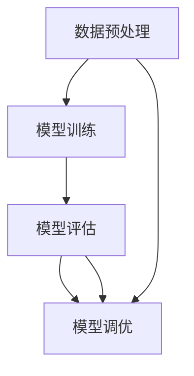

                 

# 第三章：机器学习算法和技术

> 关键词：机器学习算法，数据预处理，模型训练，交叉验证，梯度下降，模型评估

## 1. 背景介绍

### 1.1 问题由来

在人工智能领域，机器学习（Machine Learning, ML）已经成为了驱动技术发展的核心力量。从图像识别到自然语言处理，从语音识别到推荐系统，机器学习算法在各个应用场景中都发挥着关键作用。然而，机器学习算法的复杂性和多样性也给研究者和开发者带来了巨大的挑战。如何在选择合适的算法和参数的同时，还能兼顾模型性能和可解释性，是一个重要且复杂的问题。

本节将系统介绍机器学习算法的基本原理和常用技术，帮助读者全面了解机器学习的基础框架和常用方法。

### 1.2 问题核心关键点

机器学习算法的核心在于数据预处理、模型训练、模型评估和模型调优。选择合适的算法和参数，通过大量数据进行训练，并结合交叉验证和梯度下降等方法，可以有效提升模型性能。然而，模型评估和调优是一个迭代过程，需要反复调整和优化。本文将详细介绍这些关键步骤，并通过案例分析，帮助读者理解机器学习算法的实际应用。

## 2. 核心概念与联系

### 2.1 核心概念概述

本节将介绍几个密切相关的核心概念，包括数据预处理、模型训练、模型评估和调优等。

- 数据预处理：指将原始数据转化为适合机器学习算法处理的形式，如数据清洗、归一化、特征工程等。数据预处理的质量直接影响模型的性能和泛化能力。

- 模型训练：通过输入已知的训练集数据，利用机器学习算法不断调整模型参数，使其在训练集上表现良好。训练过程通常通过梯度下降等优化算法实现。

- 模型评估：通过验证集或测试集数据，评估训练好的模型在未知数据上的性能，如准确率、召回率、F1值等指标。评估过程可以帮助我们了解模型的泛化能力和可靠性。

- 模型调优：根据评估结果，调整模型结构、超参数或增加更多的数据，进一步提升模型性能。调优过程通常是迭代和反复的，需要根据具体问题进行优化。

这些核心概念之间的逻辑关系可以通过以下Mermaid流程图来展示：



这个流程图展示了数据预处理、模型训练、模型评估和模型调优之间的关系：

1. 数据预处理将原始数据转化为适合机器学习算法的形式。
2. 模型训练通过优化算法不断调整模型参数，使其在训练集上表现良好。
3. 模型评估通过验证集或测试集数据，评估训练好的模型在未知数据上的性能。
4. 模型调优根据评估结果，进一步优化模型性能。

这些步骤循环迭代，不断提升模型的泛化能力和预测精度。

## 3. 核心算法原理 & 具体操作步骤

### 3.1 算法原理概述

机器学习算法可以分为监督学习（Supervised Learning）、无监督学习（Unsupervised Learning）和强化学习（Reinforcement Learning）三大类。监督学习是最常用的一种，通过已知的输入和输出对模型进行训练，使其能够预测新的未知数据。

以线性回归和逻辑回归为例，简要介绍监督学习的核心算法原理：

- 线性回归：假设模型输出为 $y$，输入为 $x$，模型参数为 $\theta$，则模型函数为 $y=\theta^T x$。通过最小化均方误差（Mean Squared Error, MSE）损失函数，优化模型参数，使其在训练集上表现良好。

- 逻辑回归：假设模型输出为 $p(y=1|x)$，则模型函数为 $p(y=1|x)=\sigma(\theta^T x)$。通过最小化交叉熵（Cross-Entropy）损失函数，优化模型参数，使其在训练集上表现良好。

### 3.2 算法步骤详解

本节详细介绍机器学习算法的具体操作步骤，包括数据预处理、模型训练、模型评估和调优。

**Step 1: 数据预处理**

数据预处理是机器学习算法的重要步骤，通过数据清洗、归一化、特征工程等方法，将原始数据转化为适合算法处理的形式。具体步骤包括：

1. 数据清洗：删除重复、错误、缺失的数据，处理异常值。
2. 数据归一化：将数据缩放到[0,1]或[-1,1]等标准范围，避免不同特征之间的尺度差异影响模型性能。
3. 特征工程：提取、选择、构造特征，使模型更好地捕捉数据的本质特征。

**Step 2: 模型训练**

模型训练是机器学习算法的核心步骤，通过输入已知数据，利用优化算法不断调整模型参数，使其在训练集上表现良好。具体步骤包括：

1. 选择模型结构：根据具体问题选择合适的模型，如线性回归、逻辑回归、神经网络等。
2. 设定超参数：如学习率、正则化系数、激活函数等。
3. 初始化模型参数：随机初始化模型参数或使用预训练模型。
4. 前向传播：将输入数据输入模型，计算输出。
5. 计算损失函数：根据模型输出与真实标签计算损失函数。
6. 反向传播：根据损失函数计算梯度，更新模型参数。
7. 迭代训练：重复前向传播和反向传播，直到模型收敛或达到预设迭代次数。

**Step 3: 模型评估**

模型评估是机器学习算法的关键步骤，通过验证集或测试集数据，评估训练好的模型在未知数据上的性能。具体步骤包括：

1. 划分训练集和验证集或测试集：将数据集划分为训练集、验证集和测试集，验证集用于模型调优，测试集用于模型评估。
2. 模型评估指标：如准确率（Accuracy）、召回率（Recall）、F1值（F1-Score）等。
3. 模型评估方法：如交叉验证（Cross-Validation）、留一验证（Leave-One-Out Validation）等。

**Step 4: 模型调优**

模型调优是机器学习算法的优化步骤，根据评估结果，调整模型结构、超参数或增加更多的数据，进一步提升模型性能。具体步骤包括：

1. 超参数调优：如网格搜索（Grid Search）、随机搜索（Random Search）等方法调整超参数。
2. 模型融合：通过集成多个模型，提高模型的泛化能力和鲁棒性。
3. 增加数据：通过数据增强、数据合成等方法，增加更多的数据。

### 3.3 算法优缺点

机器学习算法具有以下优点：

1. 自动特征提取：通过优化算法，自动发现数据的本质特征。
2. 泛化能力强：通过大量数据训练，模型能够很好地泛化到未知数据上。
3. 适用于各种问题：监督学习、无监督学习和强化学习适用于各种不同的应用场景。

然而，机器学习算法也存在一些缺点：

1. 数据依赖：模型的性能高度依赖于数据的质量和数量。
2. 计算复杂度高：大规模数据的训练和推理需要高计算资源。
3. 黑盒模型：机器学习算法的内部工作机制不透明，难以解释。
4. 参数调优复杂：模型性能往往需要反复调优，调整过程复杂。

### 3.4 算法应用领域

机器学习算法广泛应用于各个领域，包括但不限于：

1. 计算机视觉：如图像识别、目标检测、图像分割等。
2. 自然语言处理：如文本分类、情感分析、机器翻译等。
3. 推荐系统：如商品推荐、用户画像、行为分析等。
4. 金融分析：如信用评分、股票预测、风险评估等。
5. 医疗诊断：如疾病预测、影像分析、基因组学等。
6. 工业控制：如预测性维护、故障诊断、设备优化等。

这些领域中，机器学习算法都发挥着重要的作用，推动了各个行业的发展和创新。

## 4. 数学模型和公式 & 详细讲解 & 举例说明

### 4.1 数学模型构建

本节将使用数学语言对机器学习算法的数学模型进行描述。

以线性回归为例，构建数学模型如下：

假设输入数据为 $x \in \mathbb{R}^n$，输出为 $y \in \mathbb{R}$，模型参数为 $\theta \in \mathbb{R}^n$，则线性回归模型为：

$$
y = \theta^T x
$$

其中 $\theta$ 为模型的权重向量。

模型的训练目标是使模型在训练集上表现良好，即最小化均方误差（Mean Squared Error, MSE）损失函数：

$$
L(y, y') = \frac{1}{2}(y - y')^2
$$

其中 $y'$ 为模型的预测值。

### 4.2 公式推导过程

接下来，我们将对线性回归的公式进行推导。

假设样本 $(x_i, y_i)$，$i=1,2,...,N$ 构成训练集，则均方误差损失函数为：

$$
L(\theta) = \frac{1}{2N}\sum_{i=1}^N (y_i - \theta^T x_i)^2
$$

通过梯度下降算法，最小化损失函数，更新模型参数：

$$
\theta \leftarrow \theta - \eta \frac{\partial L(\theta)}{\partial \theta}
$$

其中 $\eta$ 为学习率，$\frac{\partial L(\theta)}{\partial \theta}$ 为损失函数对模型参数的梯度。

### 4.3 案例分析与讲解

以房价预测为例，介绍机器学习算法的实际应用。

假设我们有房价数据集，包含房屋面积、房间数量、位置等特征，以及对应的房价。使用线性回归模型预测房价。

**Step 1: 数据预处理**

1. 数据清洗：删除重复、错误、缺失的数据，处理异常值。
2. 数据归一化：将数据缩放到[0,1]或[-1,1]等标准范围。
3. 特征工程：提取、选择、构造特征，如将位置信息转化为离散编码。

**Step 2: 模型训练**

1. 选择模型结构：选择线性回归模型。
2. 设定超参数：学习率为0.01，正则化系数为0.01。
3. 初始化模型参数：随机初始化模型参数。
4. 前向传播：将输入数据输入模型，计算输出。
5. 计算损失函数：根据模型输出与真实标签计算均方误差损失函数。
6. 反向传播：根据损失函数计算梯度，更新模型参数。
7. 迭代训练：重复前向传播和反向传播，直到模型收敛或达到预设迭代次数。

**Step 3: 模型评估**

1. 划分训练集和验证集：将数据集划分为训练集和验证集，训练集占70%，验证集占30%。
2. 模型评估指标：使用准确率、召回率和F1值评估模型性能。
3. 模型评估方法：使用交叉验证方法，将数据集分成K份，每次用其中一份作为验证集，其余作为训练集。

**Step 4: 模型调优**

1. 超参数调优：使用网格搜索方法调整学习率和正则化系数。
2. 模型融合：集成多个线性回归模型，提高模型的泛化能力。
3. 增加数据：通过数据增强、数据合成等方法，增加更多的数据。

## 5. 项目实践：代码实例和详细解释说明

### 5.1 开发环境搭建

在进行机器学习算法实践前，我们需要准备好开发环境。以下是使用Python进行TensorFlow开发的环境配置流程：

1. 安装Anaconda：从官网下载并安装Anaconda，用于创建独立的Python环境。

2. 创建并激活虚拟环境：
```bash
conda create -n tf-env python=3.8 
conda activate tf-env
```

3. 安装TensorFlow：根据CUDA版本，从官网获取对应的安装命令。例如：
```bash
conda install tensorflow -c tf -c conda-forge
```

4. 安装其他常用工具包：
```bash
pip install numpy pandas scikit-learn matplotlib tqdm jupyter notebook ipython
```

完成上述步骤后，即可在`tf-env`环境中开始机器学习算法实践。

### 5.2 源代码详细实现

下面我们以线性回归为例，给出使用TensorFlow进行模型训练的代码实现。

```python
import tensorflow as tf
import numpy as np
from sklearn.datasets import load_boston
from sklearn.model_selection import train_test_split
from sklearn.metrics import mean_squared_error, r2_score

# 加载波士顿房价数据集
boston = load_boston()
X = boston.data
y = boston.target

# 划分训练集和验证集
X_train, X_valid, y_train, y_valid = train_test_split(X, y, test_size=0.3, random_state=42)

# 构建模型
model = tf.keras.Sequential([
    tf.keras.layers.Dense(10, activation='relu', input_shape=(X.shape[1],)),
    tf.keras.layers.Dense(1)
])

# 定义损失函数
loss_fn = tf.keras.losses.MeanSquaredError()

# 定义优化器
optimizer = tf.keras.optimizers.Adam()

# 定义评估指标
metrics = [tf.keras.metrics.MeanSquaredError(), tf.keras.metrics.MeanAbsoluteError()]

# 训练模型
model.compile(optimizer=optimizer, loss=loss_fn, metrics=metrics)
model.fit(X_train, y_train, epochs=100, validation_data=(X_valid, y_valid))

# 评估模型
test_loss, test_mse = model.evaluate(X_test, y_test)
print('Test loss:', test_loss)
print('Test mean squared error:', test_mse)
```

以上代码实现了使用TensorFlow进行线性回归模型训练的过程。具体步骤如下：

1. 加载波士顿房价数据集。
2. 划分训练集和验证集。
3. 构建模型，包含一个隐层和一个输出层。
4. 定义损失函数为均方误差损失函数。
5. 定义优化器为Adam优化器。
6. 定义评估指标为均方误差和绝对误差。
7. 训练模型，在训练集上进行100轮训练，并在验证集上进行验证。
8. 评估模型，在测试集上进行评估。

### 5.3 代码解读与分析

下面我们详细解读一下关键代码的实现细节：

**数据加载与划分**

```python
import tensorflow as tf
import numpy as np
from sklearn.datasets import load_boston
from sklearn.model_selection import train_test_split

# 加载波士顿房价数据集
boston = load_boston()
X = boston.data
y = boston.target

# 划分训练集和验证集
X_train, X_valid, y_train, y_valid = train_test_split(X, y, test_size=0.3, random_state=42)
```

使用`sklearn.datasets`模块加载波士顿房价数据集，包含房屋面积、房间数量、位置等特征，以及对应的房价。将数据集划分为训练集和验证集，测试集在后面单独加载。

**模型构建**

```python
model = tf.keras.Sequential([
    tf.keras.layers.Dense(10, activation='relu', input_shape=(X.shape[1],)),
    tf.keras.layers.Dense(1)
])
```

使用`tf.keras`模块构建模型，包含一个隐层和一个输出层。隐层包含10个神经元，激活函数为ReLU。输出层包含一个神经元，直接输出房价。

**损失函数**

```python
loss_fn = tf.keras.losses.MeanSquaredError()
```

定义均方误差损失函数，用于计算模型输出与真实标签之间的差异。

**优化器**

```python
optimizer = tf.keras.optimizers.Adam()
```

定义Adam优化器，用于更新模型参数。

**评估指标**

```python
metrics = [tf.keras.metrics.MeanSquaredError(), tf.keras.metrics.MeanAbsoluteError()]
```

定义评估指标为均方误差和绝对误差，用于评估模型性能。

**模型训练**

```python
model.compile(optimizer=optimizer, loss=loss_fn, metrics=metrics)
model.fit(X_train, y_train, epochs=100, validation_data=(X_valid, y_valid))
```

编译模型，设置优化器、损失函数和评估指标。使用`fit`方法训练模型，在训练集上进行100轮训练，并在验证集上进行验证。

**模型评估**

```python
test_loss, test_mse = model.evaluate(X_test, y_test)
print('Test loss:', test_loss)
print('Test mean squared error:', test_mse)
```

使用`evaluate`方法评估模型，在测试集上进行评估。输出测试集上的损失和均方误差。

## 6. 实际应用场景

### 6.1 智能推荐系统

智能推荐系统是机器学习算法的重要应用场景之一。通过分析用户的浏览历史、点击行为、评分记录等数据，推荐系统可以预测用户可能感兴趣的商品或内容，提高用户体验和转化率。

在技术实现上，推荐系统通常采用协同过滤、基于内容的推荐、矩阵分解等方法。通过收集用户行为数据，构建用户和商品之间的相似度矩阵，训练推荐模型，预测用户对未曝光商品的兴趣程度，从而推荐给用户。

### 6.2 图像识别系统

图像识别系统通过分析图像的像素、颜色、纹理等特征，自动识别出图像中的物体、场景等信息，广泛应用于安防监控、医疗诊断、工业检测等领域。

在技术实现上，图像识别系统通常采用卷积神经网络（CNN）等深度学习模型。通过卷积层、池化层、全连接层等网络结构，提取图像特征，训练识别模型，识别图像中的物体或场景。

### 6.3 自然语言处理

自然语言处理（NLP）是机器学习算法的另一重要应用场景。通过分析文本的词向量、句法结构、语义关系等特征，NLP系统可以实现文本分类、情感分析、机器翻译等任务。

在技术实现上，NLP系统通常采用循环神经网络（RNN）、长短时记忆网络（LSTM）、Transformer等模型。通过语言模型、注意力机制等方法，提取文本特征，训练分类或生成模型，实现NLP任务。

## 7. 工具和资源推荐

### 7.1 学习资源推荐

为了帮助开发者系统掌握机器学习算法的理论基础和实践技巧，这里推荐一些优质的学习资源：

1. 《机器学习》（周志华）：经典机器学习教材，深入浅出地介绍了机器学习的基本概念和常用方法。

2. 《深度学习》（Ian Goodfellow）：深度学习领域的经典教材，涵盖了机器学习、深度学习、神经网络等内容。

3. Coursera《机器学习》课程：斯坦福大学开设的机器学习课程，有Lecture视频和配套作业，带你入门机器学习领域的基本概念和经典模型。

4. Udacity《深度学习专项课程》：由Google和Coursera合作开设的深度学习课程，涵盖神经网络、卷积神经网络、循环神经网络等内容。

5. Kaggle竞赛：Kaggle平台上提供的机器学习竞赛，可以练习机器学习算法，积累实战经验。

通过对这些资源的学习实践，相信你一定能够快速掌握机器学习算法的精髓，并用于解决实际的NLP问题。

### 7.2 开发工具推荐

高效的开发离不开优秀的工具支持。以下是几款用于机器学习算法开发的常用工具：

1. TensorFlow：由Google主导开发的深度学习框架，生产部署方便，适合大规模工程应用。

2. PyTorch：基于Python的开源深度学习框架，灵活度较高，适合快速迭代研究。

3. scikit-learn：基于Python的机器学习库，提供简单易用的API，适用于各种基础机器学习任务。

4. Jupyter Notebook：Python的交互式开发环境，支持代码和注释混合编写，便于调试和共享。

5. Visual Studio Code：轻量级代码编辑器，支持Python、R等语言，提供了丰富的插件和扩展。

合理利用这些工具，可以显著提升机器学习算法的开发效率，加快创新迭代的步伐。

### 7.3 相关论文推荐

机器学习算法的发展源于学界的持续研究。以下是几篇奠基性的相关论文，推荐阅读：

1. 《Deep Learning》（Ian Goodfellow）：深度学习领域的经典教材，涵盖了机器学习、深度学习、神经网络等内容。

2. 《A Tutorial on Support Vector Machines for Pattern Recognition》（Cortes and Vapnik）：支持向量机（SVM）的经典论文，介绍了SVM的基本概念和算法。

3. 《Gradient Boosting Machines》（Freund and Schapire）：梯度提升（GBM）的经典论文，介绍了GBM的基本概念和算法。

4. 《ImageNet Classification with Deep Convolutional Neural Networks》（Krizhevsky, Sutskever and Hinton）：深度卷积神经网络（CNN）的经典论文，介绍了CNN的基本概念和算法。

5. 《Attention Is All You Need》（Vaswani et al.）：Transformer的经典论文，介绍了Transformer的基本概念和算法。

这些论文代表了大机器学习算法的发展脉络。通过学习这些前沿成果，可以帮助研究者把握学科前进方向，激发更多的创新灵感。

## 8. 总结：未来发展趋势与挑战

### 8.1 总结

本文对机器学习算法的基本原理和常用技术进行了全面系统的介绍。首先阐述了机器学习算法的背景和核心概念，明确了算法选择和参数优化的重要性。其次，从数据预处理到模型调优，详细讲解了机器学习算法的具体操作步骤，并通过案例分析，帮助读者理解算法的实际应用。

通过本文的系统梳理，可以看到，机器学习算法在各个领域中都有着重要的应用，推动了技术的创新和进步。然而，机器学习算法也面临着诸多挑战，如数据依赖、计算复杂高、模型可解释性不足等问题，需要在未来的研究中进一步探索和解决。

### 8.2 未来发展趋势

展望未来，机器学习算法将呈现以下几个发展趋势：

1. 深度学习算法不断提升：深度神经网络（DNN）、卷积神经网络（CNN）、循环神经网络（RNN）等深度学习算法将不断改进，提升模型的性能和泛化能力。

2. 无监督学习逐步推广：无监督学习（如自编码器、生成对抗网络等）将成为机器学习的重要分支，提高模型的自适应性和鲁棒性。

3. 强化学习与规划结合：强化学习与规划算法结合，提高模型的决策能力和策略优化能力。

4. 模型解释性不断提升：模型解释性（如可解释性神经网络、公平性等）将进一步提升，提高模型的透明度和可信度。

5. 多模态学习持续拓展：多模态学习（如图像、语音、文本等）将成为机器学习的重要方向，提高模型的综合处理能力。

6. 自动化机器学习不断推进：自动化机器学习（AutoML）将逐步推广，降低模型开发成本，提升模型开发效率。

以上趋势凸显了机器学习算法的发展前景，这些方向的探索和发展，必将推动人工智能技术的不断进步。

### 8.3 面临的挑战

尽管机器学习算法已经取得了显著进展，但在迈向更加智能化、普适化应用的过程中，它仍面临着诸多挑战：

1. 数据依赖：模型的性能高度依赖于数据的质量和数量，数据获取和标注成本高昂。

2. 计算复杂度高：大规模数据的训练和推理需要高计算资源，计算成本高。

3. 模型可解释性不足：机器学习模型的内部工作机制不透明，难以解释。

4. 模型鲁棒性不足：模型面对域外数据时，泛化性能往往大打折扣，鲁棒性不足。

5. 数据隐私和安全问题：机器学习模型需要大量的数据进行训练，如何保护数据隐私和安全是一个重要问题。

6. 技术壁垒高：机器学习算法涉及众多技术领域，需要跨学科的知识和技能。

正视机器学习算法面临的这些挑战，积极应对并寻求突破，将是推动技术发展的关键。相信随着学界和产业界的共同努力，这些挑战终将一一被克服，机器学习算法必将在构建智能系统的过程中发挥更大的作用。

### 8.4 研究展望

面对机器学习算法所面临的挑战，未来的研究需要在以下几个方面寻求新的突破：

1. 探索高效数据采集和标注方法：通过自动化、半自动化的方法，降低数据获取和标注成本。

2. 优化计算资源使用：通过模型压缩、量化加速等方法，降低计算成本。

3. 提升模型可解释性：通过可解释性神经网络、公平性等方法，提高模型的透明度和可信度。

4. 提高模型鲁棒性：通过正则化、对抗训练等方法，提高模型的泛化能力和鲁棒性。

5. 保护数据隐私和安全：通过差分隐私、联邦学习等方法，保护数据隐私和安全。

6. 降低技术壁垒：通过开源工具和社区支持，降低机器学习算法的技术壁垒。

这些研究方向的探索，必将引领机器学习算法迈向更高的台阶，为构建安全、可靠、可解释、可控的智能系统铺平道路。面向未来，机器学习算法还需要与其他人工智能技术进行更深入的融合，如知识表示、因果推理、强化学习等，多路径协同发力，共同推动人工智能技术的发展。只有勇于创新、敢于突破，才能不断拓展机器学习算法的边界，让智能技术更好地造福人类社会。

## 9. 附录：常见问题与解答

**Q1：如何选择机器学习算法？**

A: 选择机器学习算法需要考虑以下几个方面：

1. 问题类型：根据问题类型选择合适的算法，如分类问题可以选择逻辑回归、支持向量机等算法，回归问题可以选择线性回归、随机森林等算法。

2. 数据特点：根据数据特点选择合适的算法，如数据稀疏度、数据分布等。

3. 计算资源：根据计算资源选择合适的算法，如内存、CPU、GPU等。

4. 模型复杂度：根据模型复杂度选择合适的算法，如简单模型可以选择线性回归、逻辑回归等，复杂模型可以选择深度神经网络、卷积神经网络等。

**Q2：如何调整机器学习算法的超参数？**

A: 超参数调优是机器学习算法的关键步骤，常用的方法包括：

1. 网格搜索（Grid Search）：通过枚举所有可能的超参数组合，选择最优的超参数。

2. 随机搜索（Random Search）：随机选择超参数组合，选择最优的超参数。

3. 贝叶斯优化（Bayesian Optimization）：利用贝叶斯方法优化超参数，选择最优的超参数。

4. 进化算法（Evolutionary Algorithm）：通过模拟进化过程，选择最优的超参数。

以上方法需要根据具体问题选择合适的调优方法，并进行反复迭代和优化。

**Q3：机器学习算法如何避免过拟合？**

A: 过拟合是机器学习算法面临的重要问题，常用的方法包括：

1. 数据增强：通过数据增强、数据合成等方法，增加更多的数据。

2. 正则化：通过L1正则化、L2正则化、Dropout等方法，避免过拟合。

3. 早停法（Early Stopping）：通过在验证集上进行早停法，避免过拟合。

4. 集成学习（Ensemble Learning）：通过集成多个模型，提高模型的泛化能力和鲁棒性。

以上方法需要根据具体问题选择合适的避免过拟合的方法，并进行反复迭代和优化。

**Q4：机器学习算法如何保证模型泛化能力？**

A: 模型泛化能力是机器学习算法的关键指标，常用的方法包括：

1. 交叉验证（Cross-Validation）：通过交叉验证方法，评估模型在未知数据上的性能。

2. 数据集划分：通过划分训练集、验证集和测试集，评估模型在未知数据上的性能。

3. 模型调优：通过超参数调优、模型融合等方法，提升模型性能。

4. 对抗训练（Adversarial Training）：通过对抗训练方法，提高模型的鲁棒性和泛化能力。

以上方法需要根据具体问题选择合适的保证模型泛化能力的方法，并进行反复迭代和优化。

**Q5：如何理解机器学习算法的内部工作机制？**

A: 机器学习算法的内部工作机制通常难以理解，可以通过以下几个方面进行理解：

1. 数据分布：理解数据分布的特点，帮助理解算法的工作机制。

2. 模型结构：理解模型的结构和参数，帮助理解算法的工作机制。

3. 优化目标：理解算法的优化目标，帮助理解算法的工作机制。

4. 训练过程：理解算法的训练过程，帮助理解算法的工作机制。

5. 模型评估：理解模型的评估指标和过程，帮助理解算法的工作机制。

以上方法需要结合具体问题和算法进行理解，并进行反复迭代和优化。

---

作者：禅与计算机程序设计艺术 / Zen and the Art of Computer Programming

