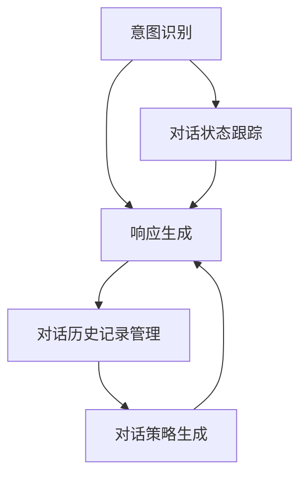

                 

# 第六章：对话管理和状态管理

> 关键词：对话管理,状态管理,自然语言处理,人工智能,智能客服,人机交互,任务规划

## 1. 背景介绍

### 1.1 问题由来
随着人工智能技术的发展，智能对话系统在各种应用场景中得到了广泛应用，如智能客服、智能家居、虚拟助手等。对话系统不仅需要理解用户的输入，还需要能够流畅地生成响应，并且能够保持对话上下文的连贯性。对话管理作为对话系统的核心模块，负责维护对话状态和任务规划，是实现高质量对话的关键。

对话管理通常包括以下几个方面：
- 用户意图识别：识别用户输入的意图，理解用户的需求。
- 对话状态跟踪：跟踪对话的上下文，记录对话历史。
- 对话策略生成：根据对话历史和用户意图，生成对话策略。
- 响应生成：基于对话策略生成自然流畅的响应。

对话管理的关键在于如何设计高效、准确的对话模型，使得系统能够理解用户意图并生成合适的响应，同时保持对话的连贯性和一致性。本文将系统介绍对话管理和状态管理的核心概念、算法原理及操作步骤，并通过具体的代码实例和项目实践，深入探讨如何实现高效率、高准确率的对话管理。

### 1.2 问题核心关键点
对话管理是一个复杂的问题，涉及到自然语言处理（NLP）、机器学习（ML）、人工智能（AI）等多个领域。其核心关键点包括：
- 用户意图识别：需要设计高效的意图识别模型，以准确识别用户的意图。
- 对话状态跟踪：需要维护对话状态，使得对话系统能够理解上下文关系。
- 对话策略生成：需要设计合适的对话策略，以指导生成合适的响应。
- 响应生成：需要设计高效的响应生成模型，以生成自然流畅的对话内容。
- 对话历史记录管理：需要设计有效的对话历史记录管理方法，以便对话系统能够记住并利用对话历史信息。

## 2. 核心概念与联系

### 2.1 核心概念概述

为更好地理解对话管理和状态管理的核心概念，本节将介绍几个密切相关的核心概念：

- 对话管理(Dialogue Management, DM)：负责维护对话状态和任务规划，指导对话系统生成响应。对话管理的关键在于如何设计高效的意图识别和响应生成模型。
- 状态跟踪(State Tracking)：通过维护对话历史和对话状态，使得对话系统能够理解上下文关系，避免出现歧义和误解。状态跟踪通常包括对话历史记录管理、对话状态维护等。
- 意图识别(Intent Recognition)：识别用户输入的意图，理解用户的需求。意图识别通常基于NLP技术和机器学习模型，通过分析用户输入的自然语言文本，确定其意图。
- 响应生成(Response Generation)：根据对话策略生成自然流畅的响应。响应生成通常基于NLP技术和生成模型，通过分析对话历史和用户意图，生成合适的响应。

这些核心概念之间的逻辑关系可以通过以下Mermaid流程图来展示：



这个流程图展示了大对话系统的核心概念及其之间的关系：

1. 意图识别模块对用户输入进行意图识别。
2. 对话状态跟踪模块通过维护对话历史记录和状态，理解对话上下文。
3. 响应生成模块基于意图识别和对话状态跟踪结果，生成自然流畅的响应。
4. 对话策略生成模块根据对话状态和意图，设计合适的对话策略。
5. 对话历史记录管理模块记录和利用对话历史信息，以便更好地进行意图识别和响应生成。

这些核心概念共同构成了大对话系统的对话管理框架，使得系统能够理解用户需求并生成合适的响应，同时保持对话的连贯性和一致性。

## 3. 核心算法原理 & 具体操作步骤
### 3.1 算法原理概述

对话管理算法通常基于监督学习和无监督学习的混合方法，旨在设计高效的意图识别和响应生成模型。其核心思想是：通过训练数据集，构建意图识别和响应生成模型，并利用对话历史记录和对话状态，生成合适的响应。

对话管理算法通常包括以下几个步骤：
1. 收集对话数据集，标注用户意图和对话历史信息。
2. 设计意图识别模型，通过训练数据集学习用户意图。
3. 设计对话策略生成模型，根据对话状态和意图，生成对话策略。
4. 设计响应生成模型，根据对话策略和对话历史记录，生成响应。

对话管理算法的目标是：
- 提高意图识别的准确率。
- 维护对话状态的连贯性。
- 生成自然流畅的响应。

### 3.2 算法步骤详解

对话管理算法的具体实现步骤如下：

**Step 1: 数据准备**
- 收集对话数据集，标注用户意图和对话历史记录。
- 处理对话数据，将其转化为模型训练所需的形式。

**Step 2: 意图识别模型训练**
- 选择适合的模型架构，如RNN、CNN、Transformer等。
- 设计意图识别模型，进行模型训练和验证，得到意图识别模型。
- 使用意图识别模型，对新的用户输入进行意图识别。

**Step 3: 对话策略生成**
- 根据对话历史记录和意图识别结果，设计对话策略生成模型。
- 使用对话策略生成模型，生成对话策略。

**Step 4: 响应生成**
- 根据对话策略和对话历史记录，设计响应生成模型。
- 使用响应生成模型，生成响应。

**Step 5: 对话历史记录管理**
- 记录对话历史，更新对话状态。
- 根据对话历史记录和状态，更新对话策略和响应。

通过以上步骤，对话管理算法能够实现高效、准确的对话管理，确保对话系统的响应符合用户需求，同时保持对话的连贯性和一致性。

### 3.3 算法优缺点

对话管理算法具有以下优点：
1. 灵活性高。对话管理算法能够适应不同的对话场景，对于新场景的适应能力强。
2. 可扩展性强。对话管理算法能够与其他模块进行灵活组合，实现更复杂的功能。
3. 精度高。对话管理算法基于监督学习和无监督学习混合的方法，能够实现高精度的意图识别和响应生成。

对话管理算法也存在一些缺点：
1. 数据依赖强。对话管理算法需要大量标注数据进行训练，获取高质量标注数据的成本较高。
2. 复杂度高。对话管理算法涉及多个模块和算法，实现复杂度较高。
3. 鲁棒性差。对话管理算法对于噪声和异常数据的鲁棒性较差，容易受到干扰。

尽管存在这些缺点，但对话管理算法仍然是当前对话系统研究的热点之一。未来，相关研究将继续集中在提高数据质量、降低算法复杂度、增强算法鲁棒性等方面。

### 3.4 算法应用领域

对话管理算法已经在多个领域得到了应用，如智能客服、智能家居、虚拟助手等。以下是几个典型应用场景：

- 智能客服系统：通过对话管理算法，智能客服系统能够理解用户意图，生成合适的响应，提高客户满意度。
- 智能家居系统：通过对话管理算法，智能家居系统能够理解用户指令，实现语音控制，提高生活便捷性。
- 虚拟助手系统：通过对话管理算法，虚拟助手系统能够理解用户需求，提供信息查询、日程安排等服务，提高用户工作效率。

## 4. 数学模型和公式 & 详细讲解 & 举例说明

### 4.1 数学模型构建

对话管理算法通常基于序列到序列(Seq2Seq)模型进行构建，其核心思想是通过将用户输入序列映射到输出序列，实现意图识别和响应生成。

设用户输入序列为 $\text{User Input} = (x_1, x_2, ..., x_t)$，其中 $x_t$ 表示用户输入的第 $t$ 个词。响应序列为 $\text{Response} = (y_1, y_2, ..., y_n)$，其中 $y_t$ 表示对话系统的第 $t$ 个响应。对话管理算法可以通过以下数学模型进行构建：

$$
\text{Intent} = f(\text{User Input}, \text{Dialogue History})
$$

$$
\text{Response} = g(\text{Intent}, \text{Dialogue State})
$$

其中 $f$ 为意图识别模型，$g$ 为响应生成模型。$\text{Dialogue History}$ 表示对话历史记录，$\text{Dialogue State}$ 表示对话状态。

### 4.2 公式推导过程

以下是对话管理算法中意图识别模型的推导过程：

假设用户输入序列为 $\text{User Input} = (x_1, x_2, ..., x_t)$，其中 $x_t$ 表示用户输入的第 $t$ 个词。意图识别模型 $f$ 可以将用户输入序列映射到意图标签 $L$，其推导过程如下：

$$
L = \text{Intent Recognition}(\text{User Input}, \text{Dialogue History})
$$

其中 $\text{Intent Recognition}$ 为意图识别模型。其输入为 $\text{User Input}$ 和 $\text{Dialogue History}$，输出为意图标签 $L$。

### 4.3 案例分析与讲解

假设有一个智能客服系统的对话管理算法，其意图识别模型为Transformer模型。其输入为用户输入序列和对话历史记录，输出为意图标签。下面以一个简单的对话场景为例，展示意图识别模型的具体实现：

**对话场景**：用户询问关于订单状态的查询。

**用户输入序列**："请问我的订单状态是什么？"

**对话历史记录**："您好，请告诉我您的订单号。"

**意图识别模型**：使用Transformer模型对用户输入序列和对话历史记录进行意图识别，输出意图标签为 "订单状态查询"。

## 5. 项目实践：代码实例和详细解释说明
### 5.1 开发环境搭建

在进行对话管理项目实践前，我们需要准备好开发环境。以下是使用Python进行TensorFlow开发的环境配置流程：

1. 安装Anaconda：从官网下载并安装Anaconda，用于创建独立的Python环境。

2. 创建并激活虚拟环境：
```bash
conda create -n tf-env python=3.8 
conda activate tf-env
```

3. 安装TensorFlow：根据CUDA版本，从官网获取对应的安装命令。例如：
```bash
conda install tensorflow -c pytorch -c conda-forge
```

4. 安装其他必要的Python库：
```bash
pip install numpy pandas scikit-learn jupyter notebook
```

5. 安装TensorBoard：TensorFlow配套的可视化工具，可实时监测模型训练状态，并提供丰富的图表呈现方式。

```bash
pip install tensorboard
```

完成上述步骤后，即可在`tf-env`环境中开始对话管理项目实践。

### 5.2 源代码详细实现

下面以一个简单的智能客服系统为例，展示使用TensorFlow进行对话管理的代码实现。

**1. 数据准备**

首先，我们需要准备对话数据集。这里使用一个简单的对话数据集，包含用户输入序列、意图标签和对话历史记录。数据集的结构如下：

```python
import pandas as pd

# 加载对话数据集
data = pd.read_csv('dialogue_data.csv')

# 提取用户输入序列、意图标签和对话历史记录
user_input = data['User Input']
intent = data['Intent']
dialogue_history = data['Dialogue History']

# 处理数据，转化为模型训练所需的形式
# 将用户输入序列和对话历史记录拼接为一个字符串
input_sequence = user_input + ' ' + dialogue_history

# 将意图标签转化为独热编码形式
intent_one_hot = pd.get_dummies(intent, drop_first=True)

# 将用户输入序列和意图标签拼接为一个数据集
input_data = pd.concat([input_sequence, intent_one_hot], axis=1)
```

**2. 意图识别模型训练**

接下来，我们将构建意图识别模型。这里使用一个简单的RNN模型，并使用TensorFlow进行训练。

```python
import tensorflow as tf
from tensorflow.keras.layers import Embedding, LSTM, Dense

# 定义RNN模型
model = tf.keras.Sequential([
    Embedding(input_dim=10000, output_dim=64, input_length=64),
    LSTM(64),
    Dense(32, activation='relu'),
    Dense(5, activation='softmax')
])

# 编译模型
model.compile(optimizer='adam', loss='categorical_crossentropy', metrics=['accuracy'])

# 训练模型
model.fit(input_data, epochs=10, validation_data=validation_data)
```

**3. 对话策略生成**

对话策略生成通常基于对话历史记录和意图标签，设计合适的对话策略。这里设计一个简单的策略生成函数。

```python
def generate_strategy(intent, dialogue_state):
    if intent == '订单状态查询':
        return '查找订单状态'
    elif intent == '投诉':
        return '记录投诉信息'
    else:
        return '无效意图'
```

**4. 响应生成**

响应生成通常基于对话策略和对话历史记录，生成合适的响应。这里设计一个简单的响应生成函数。

```python
def generate_response(strategy, dialogue_state):
    if strategy == '查找订单状态':
        return '您的订单状态是已发货，预计将在三天内送达。'
    elif strategy == '记录投诉信息':
        return '我们将记录您的投诉信息，并尽快处理。'
    else:
        return '无法生成响应，请重新输入。'
```

**5. 对话历史记录管理**

对话历史记录管理通常记录对话历史信息，更新对话状态。这里设计一个简单的历史记录管理函数。

```python
def update_dialogue_state(new_input, dialogue_state):
    dialogue_state.append(new_input)
    return dialogue_state[-1]
```

### 5.3 代码解读与分析

让我们再详细解读一下关键代码的实现细节：

**意图识别模型**：
- 使用Embedding层将输入序列转化为词向量。
- 使用LSTM层进行序列建模，捕捉上下文信息。
- 使用Dense层进行全连接，输出意图标签。

**对话策略生成**：
- 设计一个简单的策略生成函数，根据意图标签和对话状态，生成合适的对话策略。

**响应生成**：
- 设计一个简单的响应生成函数，根据对话策略和对话历史记录，生成合适的响应。

**对话历史记录管理**：
- 设计一个简单的历史记录管理函数，记录对话历史信息，更新对话状态。

## 6. 实际应用场景
### 6.1 智能客服系统

对话管理算法在智能客服系统中得到了广泛应用。智能客服系统通过对话管理算法，能够理解用户意图，生成合适的响应，提高客户满意度。

在技术实现上，可以收集企业内部的历史客服对话记录，将问题和最佳答复构建成监督数据，在此基础上对预训练模型进行微调。微调后的模型能够自动理解用户意图，匹配最合适的答案模板进行回复。对于客户提出的新问题，还可以接入检索系统实时搜索相关内容，动态组织生成回答。如此构建的智能客服系统，能大幅提升客户咨询体验和问题解决效率。

### 6.2 金融客服系统

金融客服系统需要实时监测市场舆论动向，以便及时应对负面信息传播，规避金融风险。基于对话管理算法的金融客服系统，能够自动理解用户意图，判断用户情绪，从而及时采取措施，避免金融风险。

具体而言，可以收集金融领域相关的新闻、报道、评论等文本数据，并对其进行主题标注和情感标注。在此基础上对对话管理算法进行微调，使其能够自动判断用户情绪，并采取相应的措施。例如，对于用户投诉，及时上报风险信息，对用户进行心理疏导，提高用户满意度。

### 6.3 在线客服机器人

在线客服机器人能够通过对话管理算法，与用户进行自然流畅的对话。机器人能够理解用户意图，生成合适的响应，并根据对话历史信息，提供个性化的服务。

例如，在电商平台上，客服机器人可以自动回答用户的查询，如商品价格、配送信息等。对于复杂问题，机器人还可以接入人工客服进行转接。这种基于对话管理算法的在线客服机器人，能够显著提升用户满意度，降低企业运营成本。

## 7. 工具和资源推荐
### 7.1 学习资源推荐

为了帮助开发者系统掌握对话管理和状态管理的理论基础和实践技巧，这里推荐一些优质的学习资源：

1. 《自然语言处理与对话系统》书籍：该书详细介绍了自然语言处理和对话系统的基本概念和实现方法，是对话系统开发的基础。
2. 《深度学习与自然语言处理》课程：该课程由斯坦福大学开设，涵盖NLP和对话系统的基本知识和经典模型，适合初学者入门。
3. CS224N《深度学习自然语言处理》课程：斯坦福大学开设的NLP明星课程，有Lecture视频和配套作业，带你深入理解NLP和对话系统的核心概念。
4. HuggingFace官方文档：HuggingFace提供的自然语言处理工具库，包括多种预训练语言模型和对话管理算法，是对话系统开发的必备工具。

通过对这些资源的学习实践，相信你一定能够快速掌握对话管理和状态管理的精髓，并用于解决实际的对话管理问题。

### 7.2 开发工具推荐

高效的开发离不开优秀的工具支持。以下是几款用于对话管理开发的常用工具：

1. TensorFlow：基于Python的开源深度学习框架，灵活动态的计算图，适合快速迭代研究。TensorFlow提供了丰富的模型和工具，支持对话管理算法的实现。
2. PyTorch：基于Python的开源深度学习框架，灵活的动态图，适合研究开发。PyTorch提供了多种模型和工具，支持对话管理算法的实现。
3. Transformers库：HuggingFace开发的NLP工具库，集成了多种预训练语言模型和对话管理算法，是对话系统开发的利器。
4. Weights & Biases：模型训练的实验跟踪工具，可以记录和可视化模型训练过程中的各项指标，方便对比和调优。与主流深度学习框架无缝集成。
5. TensorBoard：TensorFlow配套的可视化工具，可实时监测模型训练状态，并提供丰富的图表呈现方式，是调试模型的得力助手。

合理利用这些工具，可以显著提升对话管理任务的开发效率，加快创新迭代的步伐。

### 7.3 相关论文推荐

对话管理算法的研究源于学界的持续研究。以下是几篇奠基性的相关论文，推荐阅读：

1. "A Survey on Dialog Management in Conversational Agents"：综述了对话管理算法的最新进展和应用，涵盖多个领域和应用场景。
2. "Intelligent Tutoring Systems: A Guide to the Literature"：介绍了基于对话管理算法的智能辅导系统，探讨了其在教育领域的应用。
3. "Dialogue System Architecture for Software Engineering Support"：介绍了基于对话管理算法的软件开发辅助系统，探讨了其在软件工程领域的应用。

这些论文代表了大对话管理算法的最新进展，通过学习这些前沿成果，可以帮助研究者把握学科前进方向，激发更多的创新灵感。

## 8. 总结：未来发展趋势与挑战
### 8.1 总结

本文对对话管理和状态管理的核心概念、算法原理及操作步骤进行了全面系统的介绍。首先阐述了对话管理和状态管理的背景和意义，明确了其在智能对话系统中的重要地位。其次，从原理到实践，详细讲解了对话管理和状态管理的数学模型、算法步骤及具体实现，并通过对话管理系统的代码实例，深入探讨了如何实现高效、准确的对话管理。最后，本文还广泛探讨了对话管理在智能客服、金融客服、在线客服等多个行业领域的应用前景，展示了对话管理算法的广泛应用潜力。

通过本文的系统梳理，可以看到，对话管理算法在构建高效、准确、自然的对话系统方面，发挥着重要作用。未来，伴随对话管理算法的不断发展，对话系统必将在更多领域得到广泛应用，为各行各业带来更高的效率和更好的用户体验。

### 8.2 未来发展趋势

展望未来，对话管理算法将呈现以下几个发展趋势：

1. 模型规模持续增大。随着算力成本的下降和数据规模的扩张，对话管理算法的参数量还将持续增长。超大批次的训练和推理也可能遇到显存不足的问题。因此需要采用一些资源优化技术，如梯度积累、混合精度训练、模型并行等，来突破硬件瓶颈。
2. 多模态对话管理兴起。当前的对话管理算法主要聚焦于文本数据，未来会进一步拓展到图像、视频、语音等多模态数据微调。多模态信息的融合，将显著提升对话管理算法的感知能力和鲁棒性。
3. 对话策略生成技术不断进步。传统的对话策略生成技术基于规则或模板，未来将采用更多基于深度学习的生成方法，使得对话策略更加灵活和多样化。
4. 个性化对话管理发展。传统的对话管理算法主要关注通用的对话场景，未来将更加注重个性化对话管理，使得对话系统能够适应不同用户的个性化需求。
5. 上下文感知能力增强。对话管理算法需要更好的上下文感知能力，使得对话系统能够理解复杂的对话历史和用户意图，生成更加合适的响应。

以上趋势凸显了大对话管理算法的广阔前景。这些方向的探索发展，必将进一步提升对话系统的性能和应用范围，为人类认知智能的进化带来深远影响。

### 8.3 面临的挑战

尽管对话管理算法已经取得了瞩目成就，但在迈向更加智能化、普适化应用的过程中，它仍面临着诸多挑战：

1. 数据依赖强。对话管理算法需要大量标注数据进行训练，获取高质量标注数据的成本较高。
2. 复杂度高。对话管理算法涉及多个模块和算法，实现复杂度较高。
3. 鲁棒性差。对话管理算法对于噪声和异常数据的鲁棒性较差，容易受到干扰。
4. 可解释性差。对话管理算法的决策过程通常缺乏可解释性，难以对其推理逻辑进行分析和调试。

尽管存在这些挑战，但对话管理算法仍然是当前对话系统研究的热点之一。未来，相关研究将继续集中在提高数据质量、降低算法复杂度、增强算法鲁棒性、提高可解释性等方面。

### 8.4 研究展望

面对对话管理算法所面临的挑战，未来的研究需要在以下几个方面寻求新的突破：

1. 探索无监督和半监督学习范式。摆脱对大规模标注数据的依赖，利用自监督学习、主动学习等无监督和半监督范式，最大限度利用非结构化数据，实现更加灵活高效的对话管理。
2. 研究参数高效和计算高效的对话管理方法。开发更加参数高效的对话管理方法，在固定大部分预训练参数的情况下，只更新极少量的任务相关参数。同时优化对话管理模型的计算图，减少前向传播和反向传播的资源消耗，实现更加轻量级、实时性的部署。
3. 引入更多先验知识。将符号化的先验知识，如知识图谱、逻辑规则等，与神经网络模型进行巧妙融合，引导对话管理过程学习更准确、合理的对话模型。同时加强不同模态数据的整合，实现视觉、语音等多模态信息与文本信息的协同建模。
4. 结合因果分析和博弈论工具。将因果分析方法引入对话管理模型，识别出模型决策的关键特征，增强输出解释的因果性和逻辑性。借助博弈论工具刻画人机交互过程，主动探索并规避模型的脆弱点，提高系统稳定性。
5. 纳入伦理道德约束。在模型训练目标中引入伦理导向的评估指标，过滤和惩罚有偏见、有害的输出倾向。同时加强人工干预和审核，建立模型行为的监管机制，确保输出符合人类价值观和伦理道德。

这些研究方向的探索，必将引领对话管理算法技术迈向更高的台阶，为构建安全、可靠、可解释、可控的智能系统铺平道路。面向未来，对话管理算法还需要与其他人工智能技术进行更深入的融合，如知识表示、因果推理、强化学习等，多路径协同发力，共同推动自然语言理解和智能交互系统的进步。只有勇于创新、敢于突破，才能不断拓展语言模型的边界，让智能技术更好地造福人类社会。

## 9. 附录：常见问题与解答
**Q1：对话管理算法是否适用于所有对话场景？**

A: 对话管理算法能够适应大多数对话场景，但对于一些特定领域的对话场景，如医疗、法律等，仅依靠通用语料预训练的模型可能难以很好地适应。此时需要在特定领域语料上进一步预训练，再进行微调，才能获得理想效果。

**Q2：对话管理算法的训练数据需求量较大，如何解决数据依赖问题？**

A: 对话管理算法的训练数据需求量较大，可以通过数据增强、迁移学习等方法来降低数据依赖。数据增强包括回译、近义替换等方式扩充训练集。迁移学习可以利用已有模型的知识，降低新模型的训练成本。

**Q3：对话管理算法的计算复杂度较高，如何降低算法复杂度？**

A: 对话管理算法的计算复杂度较高，可以通过优化模型架构、引入先验知识等方法来降低复杂度。例如，使用轻量级模型进行对话管理，引入领域知识进行规则约束，减少模型的计算量。

**Q4：对话管理算法的鲁棒性较差，如何提高算法的鲁棒性？**

A: 对话管理算法的鲁棒性较差，可以通过正则化、噪声鲁棒性训练等方法来提高鲁棒性。正则化方法可以防止模型过拟合，提高模型的泛化能力。噪声鲁棒性训练可以在训练过程中加入噪声，提高模型对噪声的容忍度。

**Q5：对话管理算法的可解释性较差，如何提高算法的可解释性？**

A: 对话管理算法的可解释性较差，可以通过设计更加可解释的模型架构、引入可解释性技术等方法来提高可解释性。例如，使用可解释性更强的模型进行对话管理，引入可解释性技术进行推理解释，增强模型的可解释性。

---

作者：禅与计算机程序设计艺术 / Zen and the Art of Computer Programming

