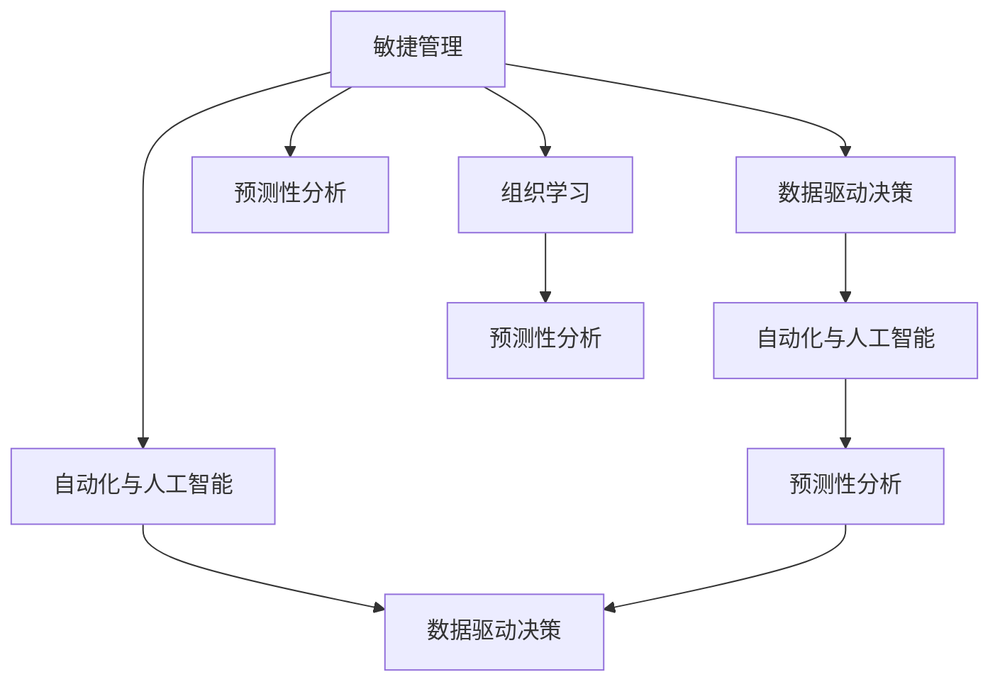

                 

# 管理者如何应对快速变化的商业环境

在当今这个快速发展的时代，商业环境瞬息万变，新技术的涌现、市场需求的更新、以及竞争格局的重塑，都给企业管理者带来了前所未有的挑战。如何在瞬息万变的商业环境中保持竞争优势，适应并引领市场变化，成为管理者必须面对的问题。本文将从多个角度探讨管理者如何应对快速变化的商业环境，包括核心概念、策略和方法，以及未来发展趋势。

## 1. 背景介绍

### 1.1 问题由来

快速变化的环境要求管理者不断调整战略、优化资源分配、提升团队灵活性和创新能力。然而，传统的管理理论和实践往往无法有效应对这些挑战。管理者需要借鉴最新的技术和管理理论，重新思考和构建适应动态环境的决策框架。

### 1.2 问题核心关键点

- **快速变化**：技术进步、市场需求、竞争对手等都在不断变化，管理者需要快速反应。
- **不确定性**：未来趋势难以预测，管理者需要在信息不完全的情况下作出决策。
- **动态资源管理**：资源需求和供给的变化，要求管理者灵活调整资源分配。
- **团队协作与创新**：在快速变化的环境中，团队需要具备高度的协同能力和创新精神。

## 2. 核心概念与联系

### 2.1 核心概念概述

为更好地理解管理者如何应对快速变化的商业环境，本节将介绍几个密切相关的核心概念：

- **敏捷管理(Agile Management)**：一种以快速响应变化为核心的管理方法，通过小步迭代、持续反馈和跨职能团队合作，提升组织的适应性和灵活性。
- **数据驱动决策(Data-Driven Decision Making)**：基于实证数据的分析和模型，支持更科学、精准的决策过程。
- **自动化与人工智能(Automation & AI)**：利用自动化和人工智能技术，提升运营效率和决策质量。
- **预测性分析(Predictive Analytics)**：通过历史数据和机器学习模型，预测未来趋势和行为，帮助管理者前瞻性规划。
- **组织学习(Organizational Learning)**：通过知识分享、经验总结和创新实践，提升组织的学习能力和适应能力。

这些核心概念之间的逻辑关系可以通过以下Mermaid流程图来展示：



这个流程图展示了几大核心概念及其之间的关系：

1. 敏捷管理通过快速响应变化，为数据驱动决策和自动化/AI的实施提供基础。
2. 数据驱动决策为敏捷管理提供科学依据，自动化/AI提高决策效率。
3. 预测性分析帮助敏捷管理识别未来趋势，优化决策和资源分配。
4. 组织学习提升整个组织的适应性和创新能力，支持长期持续的敏捷管理。

这些概念共同构成了管理者应对快速变化商业环境的框架，使其能够有效地适应并引领市场变化。

## 3. 核心算法原理 & 具体操作步骤

### 3.1 算法原理概述

管理者应对快速变化的商业环境，本质上是一种多目标、多约束条件的优化问题。其核心思想是：在变化的商业环境中，通过一系列的策略和操作，最大化组织的目标（如盈利能力、市场份额、客户满意度等），同时满足各种约束条件（如资源限制、时间要求、法规规定等）。

形式化地，假设组织的目标函数为 $f(\text{决策变量})$，约束条件为 $\{g_i(\text{决策变量}) \leq 0\}$。管理者的任务是通过优化决策变量 $\text{决策变量}$，最大化目标函数 $f(\text{决策变量})$，同时满足所有约束条件 $g_i(\text{决策变量}) \leq 0$。

### 3.2 算法步骤详解

管理者应对快速变化的商业环境，一般包括以下几个关键步骤：

**Step 1: 收集数据**
- 收集市场数据、行业报告、竞争情报等，了解环境变化趋势。
- 收集内部运营数据，如财务报表、生产效率、客户反馈等，了解组织现状和问题。

**Step 2: 制定战略**
- 根据环境变化趋势和组织现状，制定长期和短期的战略目标。
- 确定关键成功指标(KPI)，用于衡量战略实施效果。

**Step 3: 资源规划**
- 评估资源需求和供给情况，确定资源分配方案。
- 制定灵活的资源管理策略，如外包、合作、内部调整等。

**Step 4: 执行与调整**
- 根据战略目标和资源规划，制定具体的执行计划。
- 定期评估执行效果，根据反馈调整战略和资源分配。

**Step 5: 学习与创新**
- 总结战略实施过程中的经验和教训，优化后续的决策过程。
- 推动组织学习文化，鼓励员工创新，提升组织的适应能力。

### 3.3 算法优缺点

敏捷管理、数据驱动决策、自动化/AI、预测性分析和组织学习，这些方法各有优缺点：

**敏捷管理**
- 优点：快速响应变化，灵活性强，员工参与度高。
- 缺点：可能导致资源分散，短期内成本较高。

**数据驱动决策**
- 优点：基于实证数据，决策更科学、精准。
- 缺点：数据质量影响决策结果，需要持续的数据收集和更新。

**自动化与人工智能**
- 优点：提升效率，降低人工成本。
- 缺点：需要大量前期投资，技术实现复杂。

**预测性分析**
- 优点：提供未来趋势预测，支持前瞻性规划。
- 缺点：模型复杂度较高，需要专业知识和数据处理能力。

**组织学习**
- 优点：提升组织适应性和创新能力。
- 缺点：学习过程可能较慢，需要时间积累。

尽管存在这些局限性，但这些方法仍然是管理者应对快速变化商业环境的重要工具。未来相关研究的重点在于如何更好地结合这些方法，提升决策的科学性和组织的灵活性。

### 3.4 算法应用领域

敏捷管理、数据驱动决策、自动化/AI、预测性分析和组织学习，这些方法在企业管理中得到了广泛应用，特别是在以下领域：

- **运营管理**：通过敏捷管理和预测性分析，优化生产计划、库存管理、供应链管理等。
- **营销管理**：利用数据驱动决策和自动化工具，提升市场洞察和客户响应速度。
- **人力资源管理**：通过组织学习和自动化技术，提升员工招聘、培训和绩效管理等。
- **财务管理**：通过预测性分析和数据驱动决策，优化预算管理、风险控制和投资决策。

除了上述这些常见领域，管理者还可以将这些方法应用于更多的管理环节，如品牌管理、战略规划、技术创新等，推动企业持续进步。

## 4. 数学模型和公式 & 详细讲解 & 举例说明

### 4.1 数学模型构建

本节将使用数学语言对管理者应对快速变化商业环境的优化问题进行更加严格的刻画。

假设组织的目标函数为最大化利润，约束条件包括资源限制、时间要求等。目标函数和约束条件可以表示为：

$$
\max f(\text{决策变量}) \\
\text{s.t.} \{g_i(\text{决策变量}) \leq 0, i=1,\ldots,m\}
$$

其中 $f(\text{决策变量})$ 为目标函数，$\text{决策变量}$ 为优化变量，$g_i(\text{决策变量})$ 为约束条件。

### 4.2 公式推导过程

以下我们以一个简单的供应链优化问题为例，推导线性规划问题的数学模型。

假设企业有三种产品，分别对应三种资源（原料、设备、劳动力），每种产品的生产需要不同的资源量和生产时间。目标是最大化总利润，同时满足资源限制和生产时间限制。假设每种产品的利润、资源需求、生产时间如下表所示：

| 产品 | 利润 $p$ | 原料需求 $a$ | 设备需求 $b$ | 劳动力需求 $c$ | 生产时间 $t$ |
|------|----------|--------------|--------------|----------------|--------------|
| A    | 100      | 2            | 1            | 1              | 4            |
| B    | 150      | 3            | 2            | 2              | 3            |
| C    | 200      | 4            | 2            | 3              | 2            |

假设原料总量为10，设备总容量为5，劳动力总数量为8，每天的生产时间为8小时。目标最大化总利润，求解每日生产计划。

根据上述条件，可以建立以下线性规划模型：

$$
\max f(x) = 100x_{A1} + 150x_{B1} + 200x_{C1} \\
\text{s.t.} \begin{cases}
2x_{A1} + 3x_{B1} + 4x_{C1} \leq 10 \\
x_{A1} + x_{B1} + x_{C1} \leq 5 \\
x_{A1} + x_{B1} + x_{C1} \leq 8 \\
0 \leq x_{A1}, x_{B1}, x_{C1} \leq 8 \\
x_{A1}, x_{B1}, x_{C1} \in \mathbb{N}
\end{cases}
$$

其中 $x_{A1}, x_{B1}, x_{C1}$ 分别表示产品A、B、C每天的生产数量。

### 4.3 案例分析与讲解

考虑一个典型的快速变化环境下的资源管理案例：一家科技公司需要快速开发和推出新产品。面对市场需求和技术进步的不确定性，公司需要制定灵活的资源管理策略，确保能够及时响应市场变化。

假设公司有以下资源：研发人员、市场调研人员、销售人员。目标是最大化产品销售收入，同时满足项目进度要求。假设每个项目开发需要不同的人员配置，不同项目对时间的需求也不同。

基于以上条件，可以建立以下线性规划模型：

$$
\max f(x) = p_1x_{R1} + p_2x_{M1} + p_3x_{S1} \\
\text{s.t.} \begin{cases}
c_1x_{R1} + c_2x_{M1} + c_3x_{S1} \leq C \\
d_1x_{R1} + d_2x_{M1} + d_3x_{S1} \leq T \\
0 \leq x_{R1}, x_{M1}, x_{S1} \leq c \\
x_{R1}, x_{M1}, x_{S1} \in \mathbb{N}
\end{cases}
$$

其中 $x_{R1}, x_{M1}, x_{S1}$ 分别表示研发、市场调研和销售项目的配置，$p_1, p_2, p_3$ 分别表示不同项目的销售收入，$c_1, c_2, c_3$ 分别表示不同项目的人员需求，$d_1, d_2, d_3$ 分别表示不同项目的时间需求，$C$ 表示公司的人员总和，$T$ 表示项目总时间。

通过求解上述线性规划模型，公司可以制定最优的资源配置方案，确保在资源有限的情况下，最大化产品销售收入，同时满足项目进度要求。

## 5. 项目实践：代码实例和详细解释说明

### 5.1 开发环境搭建

在进行资源管理优化实践前，我们需要准备好开发环境。以下是使用Python进行线性规划优化问题的环境配置流程：

1. 安装Anaconda：从官网下载并安装Anaconda，用于创建独立的Python环境。

2. 创建并激活虚拟环境：
```bash
conda create -n linprog-env python=3.8 
conda activate linprog-env
```

3. 安装PuLP库：用于求解线性规划问题的Python库。
```bash
pip install pulp
```

4. 安装SymPy库：用于符号计算和模型构建。
```bash
pip install sympy
```

5. 安装Matplotlib库：用于绘制优化问题的图形界面。
```bash
pip install matplotlib
```

完成上述步骤后，即可在`linprog-env`环境中开始优化实践。

### 5.2 源代码详细实现

下面以供应链优化为例，给出使用PuLP库进行线性规划优化的PyTorch代码实现。

首先，定义优化问题中的变量和约束条件：

```python
from pulp import LpProblem, LpVariable, lpSum, Maximize

# 定义变量
x_A1, x_B1, x_C1 = LpVariable('x_A1', 0, 8, integer=True), LpVariable('x_B1', 0, 8, integer=True), LpVariable('x_C1', 0, 8, integer=True)

# 定义目标函数
profit = 100 * x_A1 + 150 * x_B1 + 200 * x_C1

# 定义约束条件
resource_constraint = 2 * x_A1 + 3 * x_B1 + 4 * x_C1 <= 10
capacity_constraint = x_A1 + x_B1 + x_C1 <= 5
time_constraint = x_A1 + x_B1 + x_C1 <= 8

# 定义优化问题
problem = LpProblem('supply_chain_optimization', maximize=profit)

# 添加约束条件
problem += resource_constraint
problem += capacity_constraint
problem += time_constraint

# 输出优化问题
print(problem)
```

然后，求解优化问题：

```python
# 求解优化问题
problem.solve()

# 输出优化结果
print(f"Optimal profit: {problem.objective.value()}")
print(f"Optimal solution: {problem.objective.value()}, {x_A1.value(), x_B1.value(), x_C1.value()}")
```

以上代码实现了基本的线性规划优化问题求解，使用PuLP库构建了优化模型，并通过求解器求解得到最优解。

### 5.3 代码解读与分析

让我们再详细解读一下关键代码的实现细节：

**定义变量**
- 使用`LpVariable`函数定义优化问题中的变量，并设置变量范围和整数约束。

**定义目标函数**
- 目标函数通过线性组合表达，即不同产品的利润乘以相应的生产数量。

**定义约束条件**
- 使用`<=`操作符定义约束条件，其中左侧为表达式，右侧为约束条件的限制值。

**构建优化问题**
- 使用`LpProblem`函数创建优化问题，并指定优化目标（最大化）。

**添加约束条件**
- 将约束条件添加到优化问题中，使用`+=`操作符表示添加到目标函数中。

**求解优化问题**
- 调用`problem.solve()`方法求解优化问题。

**输出优化结果**
- 使用`problem.objective.value()`和`x_A1.value(), x_B1.value(), x_C1.value()`获取目标函数值和变量值。

可以看到，PuLP库提供了简单易用的接口，使得构建和求解线性规划问题变得非常容易。

## 6. 实际应用场景

### 6.1 智能制造

在智能制造领域，敏捷管理和预测性分析的应用非常广泛。通过实时监控生产线数据，预测设备故障和生产异常，智能制造系统可以提前采取措施，避免生产中断，提高生产效率。

例如，某汽车制造企业通过智能制造系统，实时监控生产线上的设备状态和生产数据。利用预测性分析模型，预测设备故障的可能性，并提前通知维护人员进行维修。同时，通过敏捷管理方法，快速调整生产计划，确保生产线的高效运转。

### 6.2 金融风控

在金融领域，自动化与AI技术的应用尤为突出。通过大数据和机器学习模型，金融风控系统可以实时监测市场波动，识别潜在风险，提前采取措施。

例如，某银行利用AI模型分析客户的交易行为和信用记录，预测违约风险，并根据预测结果调整贷款利率和授信额度。同时，通过敏捷管理方法，快速响应市场变化，调整金融产品和业务策略。

### 6.3 零售电商

在零售电商领域，数据驱动决策和自动化技术的应用非常普遍。通过数据分析和自动化系统，电商企业可以优化库存管理、提升客户体验和运营效率。

例如，某电商企业通过数据驱动决策，分析销售数据和用户行为，预测未来趋势，优化库存水平。同时，通过自动化系统，实现订单自动化处理、智能推荐和客户服务自动化，提升客户满意度和运营效率。

### 6.4 未来应用展望

随着敏捷管理、数据驱动决策、自动化/AI、预测性分析和组织学习方法的不断成熟，其在更多领域的应用前景将更加广阔。

在智慧医疗领域，敏捷管理可以帮助医疗机构快速响应突发事件，预测病患流向，优化资源配置。在智能交通领域，预测性分析可以优化交通流量，减少拥堵，提高交通安全。在智慧农业领域，数据驱动决策和自动化技术可以优化种植方案，提升农作物产量和质量。

## 7. 工具和资源推荐
### 7.1 学习资源推荐

为了帮助管理者系统掌握敏捷管理、数据驱动决策、自动化/AI、预测性分析和组织学习的理论基础和实践技巧，这里推荐一些优质的学习资源：

1. 《敏捷管理：企业竞争优势的源泉》书籍：系统介绍了敏捷管理方法论，包括Scrum、Kanban、DevOps等，适用于各类企业。

2. 《数据驱动决策：基于实证的数据分析与建模》课程：由数据分析专家开设，涵盖数据预处理、统计分析、机器学习等，适合数据分析初学者。

3. 《Python自动化与AI编程》书籍：全面介绍自动化和AI技术，包括自动化工具、机器学习模型、深度学习框架等，适合Python开发人员。

4. 《预测性分析：基于统计与机器学习的方法》书籍：介绍预测性分析的理论和应用，涵盖时间序列分析、回归模型、决策树等，适合数据分析人员。

5. 《组织学习：个人与组织知识共享与创新》课程：由知识管理专家开设，涵盖组织学习框架、知识管理工具和创新方法，适合管理者。

通过对这些资源的学习实践，相信管理者一定能够掌握这些技术的关键应用，提升企业的适应性和竞争力。

### 7.2 开发工具推荐

高效的开发离不开优秀的工具支持。以下是几款用于敏捷管理、数据驱动决策、自动化/AI、预测性分析和组织学习开发的常用工具：

1. JIRA：敏捷项目管理工具，支持Scrum、Kanban等敏捷管理方法。

2. Tableau：数据可视化工具，支持复杂的数据分析与可视化。

3. Python：自动化和AI开发的编程语言，支持PuLP、TensorFlow等库。

4. Tableau和Python：结合使用，可以实现更高效的数据分析和自动化应用。

5. JIRA和Python：结合使用，可以实现更灵活的敏捷管理和数据驱动决策。

合理利用这些工具，可以显著提升敏捷管理、数据驱动决策、自动化/AI、预测性分析和组织学习任务的开发效率，加快创新迭代的步伐。

### 7.3 相关论文推荐

敏捷管理、数据驱动决策、自动化/AI、预测性分析和组织学习的发展源于学界的持续研究。以下是几篇奠基性的相关论文，推荐阅读：

1. "Scrum: An Agile Framework for Product Management and Development"：提出Scrum敏捷管理框架，成为敏捷管理领域的经典之作。

2. "Kanban: A Model for Scaling Agile to Large Software Development Teams"：提出Kanban敏捷管理方法，适用于大规模软件项目。

3. "Predictive Maintenance of Critical Machine"：提出预测性维护模型，通过预测设备故障，提升生产效率和设备寿命。

4. "Data-Driven Decision Making: A Review"：综述数据驱动决策的方法论和应用案例，涵盖统计分析、机器学习等。

5. "An Organizational Learning Framework"：提出组织学习框架，涵盖知识管理、创新管理等。

这些论文代表了大语言模型微调技术的发展脉络。通过学习这些前沿成果，可以帮助管理者把握学科前进方向，激发更多的创新灵感。

## 8. 总结：未来发展趋势与挑战

### 8.1 总结

本文对管理者应对快速变化的商业环境进行了全面系统的介绍。首先阐述了快速变化的环境对企业管理的挑战，明确了敏捷管理、数据驱动决策、自动化/AI、预测性分析和组织学习在适应变化中的重要性。其次，从原理到实践，详细讲解了这些方法的数学模型和操作步骤，给出了具体的代码实现和案例分析。同时，本文还广泛探讨了这些方法在智能制造、金融风控、零售电商等多个行业领域的应用前景，展示了其巨大的潜力。此外，本文精选了相关资源，力求为管理者提供全方位的技术指引。

通过本文的系统梳理，可以看到，敏捷管理、数据驱动决策、自动化/AI、预测性分析和组织学习等方法，是管理者应对快速变化商业环境的重要工具。这些方法的结合使用，使得企业能够更好地适应市场变化，提升竞争力和创新能力。

### 8.2 未来发展趋势

展望未来，敏捷管理、数据驱动决策、自动化/AI、预测性分析和组织学习将呈现以下几个发展趋势：

1. 数据驱动的敏捷管理：通过大数据分析，优化敏捷管理过程，提升团队协作效率。

2. 自动化与AI的深度融合：自动化工具与AI模型的结合，提升决策的科学性和效率。

3. 预测性分析的智能化：结合机器学习、深度学习等技术，提升预测的准确性和时效性。

4. 组织学习的持续化：建立持续学习和知识共享机制，提升组织适应性和创新能力。

5. 敏捷管理的生态化：敏捷管理方法与其他管理方法的融合，形成更加全面、灵活的管理体系。

以上趋势凸显了敏捷管理、数据驱动决策、自动化/AI、预测性分析和组织学习的广阔前景。这些方向的探索发展，必将进一步提升企业的适应性和竞争力，为企业的持续进步提供有力支持。

### 8.3 面临的挑战

尽管敏捷管理、数据驱动决策、自动化/AI、预测性分析和组织学习方法已经取得了显著成效，但在迈向更加智能化、普适化应用的过程中，仍然面临诸多挑战：

1. 数据质量与数据隐私：数据的质量直接影响分析结果和决策过程，同时数据隐私保护也是一大难题。

2. 技术集成与系统复杂性：多种技术的结合使用，可能导致系统复杂度增加，影响系统的稳定性和可靠性。

3. 跨部门协作与文化冲突：跨部门协作需要统一标准和流程，同时不同部门间的文化差异也可能导致沟通障碍。

4. 持续改进与人员培训：方法的持续改进和人员培训，需要大量的资源和时间投入，短期内难以见效。

5. 风险管理与决策透明性：需要建立完善的决策透明机制，及时发现和纠正风险点，确保决策的合理性和有效性。

正视这些挑战，积极应对并寻求突破，将是大语言模型微调技术走向成熟的必由之路。相信随着学界和产业界的共同努力，这些挑战终将一一被克服，管理者应对快速变化商业环境的能力也将不断提升。

### 8.4 研究展望

面对管理者面临的这些挑战，未来的研究需要在以下几个方面寻求新的突破：

1. 数据治理与隐私保护：研究数据治理框架，建立数据质量监控机制，同时探索隐私保护技术，保障数据安全。

2. 技术融合与系统优化：研究多种技术融合的方法和工具，降低系统复杂性，提升系统稳定性。

3. 跨部门协作机制：研究跨部门协作的标准和流程，建立有效的沟通和协作平台，减少文化冲突。

4. 持续改进与人员培训：探索持续改进和人员培训的最佳实践，建立持续学习和知识共享机制，提升组织适应性和创新能力。

5. 决策透明与风险管理：研究决策透明机制和风险管理工具，确保决策的合理性和有效性，提升系统的稳定性和可靠性。

这些研究方向的探索，必将引领管理者应对快速变化商业环境的研究进入新的高度，为构建安全、可靠、高效的智能系统铺平道路。面向未来，管理者需要勇于创新、敢于突破，才能不断拓展管理方法的新应用，引领企业走向更加辉煌的未来。

## 9. 附录：常见问题与解答

**Q1：敏捷管理是否适用于所有行业？**

A: 敏捷管理在高科技、互联网、金融、医疗等需要快速响应变化、跨部门协作的行业，具有较高的适用性。但对于一些传统行业，如制造业、零售业等，可能需要结合具体行业特点，进行适当调整和改进。

**Q2：数据驱动决策的实施难度大吗？**

A: 数据驱动决策的实施难度主要在于数据收集、处理和分析阶段。需要建立完善的数据治理体系，保障数据的质量和安全性。同时，需要培养数据驱动决策的文化，提升全员的数据意识和分析能力。

**Q3：自动化与AI在企业中的推广难点是什么？**

A: 自动化与AI的推广难点在于技术与现有流程的适配、人员的培训和接受度、技术集成和系统复杂性。需要制定详细的实施计划，逐步推进，同时注重员工的参与和反馈。

**Q4：预测性分析如何应用于实际问题？**

A: 预测性分析的实施需要从具体业务场景出发，选择合适的预测模型，收集和处理相关数据。同时，需要定期评估预测模型的效果，根据反馈进行优化。

**Q5：组织学习的关键要素是什么？**

A: 组织学习的关键要素包括知识共享机制、学习平台、创新文化、绩效评估等。需要建立持续学习的机制，激励员工分享和学习知识，同时定期评估学习效果，提升组织的整体能力。

通过本文的系统梳理，可以看到，敏捷管理、数据驱动决策、自动化/AI、预测性分析和组织学习等方法，是管理者应对快速变化商业环境的重要工具。这些方法的结合使用，使得企业能够更好地适应市场变化，提升竞争力和创新能力。

作者：禅与计算机程序设计艺术 / Zen and the Art of Computer Programming

