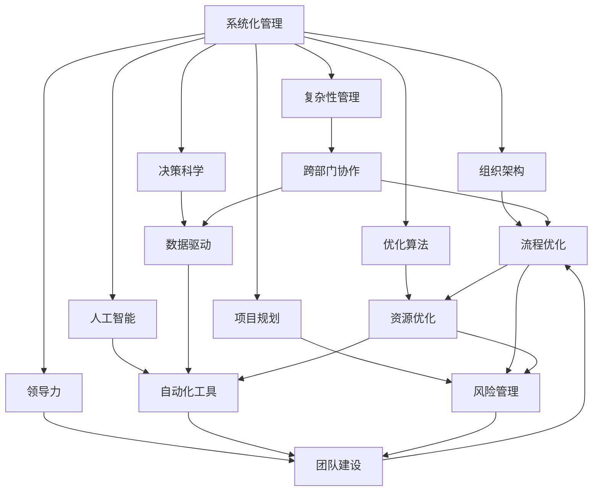

                 

# 系统化思考:管理者战胜复杂的秘诀

> 关键词：系统化管理,复杂性管理,组织架构,领导力,决策科学,人工智能,优化算法,项目规划

## 1. 背景介绍

### 1.1 问题由来

在当今这个快速变化且复杂的世界里，管理者面临着前所未有的挑战。无论是技术创新、市场竞争，还是组织的日常运营，复杂性无处不在。如何有效地管理复杂性，成为现代企业发展的核心问题。传统的管理方法已经无法应对这种复杂性，而系统化思考则提供了一种全新的解决方案。

系统化思考是一种基于系统的视角和思维方式，通过将问题分解成可管理的部分，并通过系统的视角来分析和解决问题。这种方法强调整体的视角和跨部门的协同合作，使得管理者能够更好地应对组织内部的复杂性和不确定性。

### 1.2 问题核心关键点

系统化思考的核心在于其整体的视角和系统的思维方式。它通过以下几个关键点来解决复杂性问题：

- **系统视角**：强调问题是一个整体系统的一部分，需要从整体上进行分析和解决。
- **跨部门协作**：鼓励不同部门之间的协作和信息共享，以实现更高效的管理。
- **数据驱动**：利用数据分析和可视化工具，提供决策支持，帮助管理者做出更明智的决策。
- **持续改进**：通过不断的迭代和优化，提高组织应对复杂性的能力。

系统化思考的核心是系统视角，通过将问题看作一个整体系统，管理者能够更全面地理解和解决复杂性问题。

### 1.3 问题研究意义

掌握系统化思考方法，对于提升管理者的决策能力和组织管理水平，具有重要的意义：

1. **提升决策质量**：系统化思考通过整体视角和数据分析，帮助管理者做出更加全面和准确的决策。
2. **提高效率**：通过跨部门协作和流程优化，系统化思考能够提高组织的工作效率和响应速度。
3. **增强应变能力**：系统化思考强调持续改进和适应性，帮助组织更好地应对外部环境和内部变化。
4. **促进创新**：通过系统化思考，管理者能够更好地理解组织内部的复杂性，从而激发创新。
5. **优化资源配置**：系统化思考通过数据分析和优化算法，帮助管理者更合理地分配资源。

系统化思考方法不仅适用于企业管理，也广泛应用于项目管理、产品开发、技术研发等领域，成为解决复杂性问题的有效手段。

## 2. 核心概念与联系

### 2.1 核心概念概述

为了更好地理解系统化思考方法，本节将介绍几个关键的概念：

- **系统化管理(Systematic Management)**：一种基于系统视角和整体思维方式的管理方法，旨在通过系统的视角来分析和解决问题。
- **复杂性管理(Complexity Management)**：通过系统化方法，对组织内部的复杂性进行识别、分析和优化，以提高组织应对复杂性的能力。
- **组织架构(Organizational Architecture)**：描述组织内部结构、角色和流程的设计，是系统化管理的基础。
- **领导力(Leadership)**：系统化思考强调领导者的角色，领导者需要具备系统思维和跨部门协作的能力。
- **决策科学(Decision Science)**：通过数据分析和建模，提供决策支持，帮助管理者做出更科学的决策。
- **人工智能(Artificial Intelligence, AI)**：系统化思考可以利用AI技术，进行数据分析和预测，辅助决策。
- **优化算法(Optimization Algorithm)**：用于寻找复杂系统最优解的算法，在系统化管理中用于流程优化和资源配置。
- **项目规划(Project Planning)**：系统化思考应用于项目管理的各个环节，确保项目按计划高效执行。

这些概念之间的逻辑关系可以通过以下Mermaid流程图来展示：



这个流程图展示了系统化思考方法的核心概念及其之间的关系：

1. 系统化管理通过整体视角和跨部门协作，对复杂性进行识别和管理。
2. 复杂性管理强调通过系统化方法，对复杂性进行分析和优化。
3. 组织架构是系统化管理的基础，定义了组织内部的结构、角色和流程。
4. 领导力强调领导者的系统思维和跨部门协作能力。
5. 决策科学利用数据分析和建模，提供决策支持。
6. 人工智能通过自动化工具和数据驱动，辅助决策和优化。
7. 优化算法用于寻找复杂系统最优解。
8. 项目规划应用于管理各个环节，确保项目高效执行。

这些概念共同构成了系统化思考的框架，帮助管理者更好地应对组织内部的复杂性。

## 3. 核心算法原理 & 具体操作步骤
### 3.1 算法原理概述

系统化思考的核心算法原理是基于系统的整体视角和跨部门协作的思维方式。其核心思想是将复杂问题分解成可管理的部分，通过系统化的分析和优化，提升组织的整体效能。

系统化思考方法通常包括以下几个步骤：

1. **问题定义**：明确问题的范围和目标，确定需要解决的关键要素。
2. **系统分解**：将问题分解成若干个子系统，明确各个子系统之间的关系和相互作用。
3. **数据分析**：通过数据收集和分析，获取各个子系统的状态和影响因素。
4. **系统优化**：利用优化算法和数据驱动，寻找系统的最优解。
5. **持续改进**：通过不断的迭代和优化，提高系统的整体效能。

### 3.2 算法步骤详解

系统化思考的具体操作步骤包括以下几个关键环节：

**Step 1: 问题定义**

- **明确目标**：定义问题的范围和目标，确定需要解决的关键要素。例如，如何提升产品的市场占有率，需要明确产品的市场定位、竞争对手、目标客户等关键要素。
- **收集数据**：收集与问题相关的数据，包括历史数据、当前数据和预测数据等。例如，收集过去几年的销售数据、市场调研数据和竞争对手信息等。

**Step 2: 系统分解**

- **子系统划分**：将问题分解成若干个子系统，明确各个子系统之间的关系和相互作用。例如，提升产品市场占有率可以分为市场调研、产品开发、销售推广和客户服务等子系统。
- **建立模型**：建立子系统之间的相互关系模型，例如使用因果关系图、网络模型等。例如，可以使用因果关系图来描述市场调研和产品开发之间的关系。

**Step 3: 数据分析**

- **数据收集**：通过各种方式收集数据，例如问卷调查、数据挖掘、传感器等。例如，通过问卷调查获取客户的反馈意见。
- **数据分析**：使用数据分析工具和技术，对数据进行清洗、处理和分析。例如，使用Python的Pandas库进行数据分析和可视化。

**Step 4: 系统优化**

- **建立模型**：建立子系统之间的数学模型，例如线性回归、决策树、神经网络等。例如，使用线性回归模型预测产品的销售情况。
- **求解优化**：利用优化算法求解最优解。例如，使用梯度下降算法优化模型的参数。

**Step 5: 持续改进**

- **迭代优化**：通过不断的迭代和优化，提升系统的整体效能。例如，在每次市场调研后，根据结果调整产品和营销策略。
- **评估效果**：对改进措施的效果进行评估和反馈，例如，使用A/B测试来评估新的销售策略的效果。

### 3.3 算法优缺点

系统化思考方法具有以下优点：

1. **全面视角**：通过整体视角和跨部门协作，系统化思考能够更全面地理解问题。
2. **数据驱动**：利用数据分析和可视化工具，提供决策支持，帮助管理者做出更明智的决策。
3. **跨部门协作**：鼓励不同部门之间的协作和信息共享，以实现更高效的管理。
4. **持续改进**：通过不断的迭代和优化，提高组织应对复杂性的能力。

同时，该方法也存在一些局限性：

1. **复杂度高**：系统化思考需要综合考虑多个子系统的关系和相互作用，复杂度高。
2. **技术门槛**：需要一定的数据分析和建模技术，技术门槛较高。
3. **执行成本高**：系统化思考需要投入大量的人力、物力和时间，执行成本较高。

尽管存在这些局限性，但就目前而言，系统化思考方法仍然是一种非常有效的管理手段。未来相关研究的重点在于如何降低复杂度和技术门槛，同时兼顾全面视角和跨部门协作，进一步提升系统化思考的实用性和可操作性。

### 3.4 算法应用领域

系统化思考方法已经在多个领域得到了广泛的应用，包括但不限于以下领域：

- **企业管理**：通过系统化思考，优化组织结构、流程和资源配置，提升组织效率和市场竞争力。
- **项目管理**：利用系统化思考方法，制定项目规划、风险管理和绩效评估，确保项目高效执行。
- **技术研发**：通过系统化思考，优化产品开发流程和研发资源，提升产品创新能力和市场响应速度。
- **市场营销**：利用系统化思考方法，优化市场调研和客户服务，提升品牌影响力和客户满意度。
- **金融管理**：通过系统化思考，优化财务管理和投资策略，提升企业的金融健康和风险控制能力。

除了上述这些应用领域，系统化思考方法还将进一步拓展到更多场景中，如医疗健康、社会治理、环境保护等，为各个领域的复杂问题提供系统化的解决方案。

## 4. 数学模型和公式 & 详细讲解
### 4.1 数学模型构建

系统化思考的核心是利用数学模型来描述和分析系统。以下是一个简单的系统化思考模型：

设系统由多个子系统组成，每个子系统 $i$ 的状态为 $x_i$，影响因素为 $u_i$，子系统之间的相互作用为 $a_{ij}$，系统总的状态为 $X$。则系统的数学模型可以表示为：

$$
X = \sum_{i=1}^n a_{ij} x_i + u_i
$$

其中 $n$ 为子系统数量，$a_{ij}$ 为子系统 $i$ 和 $j$ 之间的相互作用系数。

### 4.2 公式推导过程

以下对上述系统模型进行详细推导：

**Step 1: 问题定义**

- **目标**：提升产品的市场占有率
- **关键要素**：市场调研、产品开发、销售推广、客户服务

**Step 2: 系统分解**

- **子系统划分**：市场调研、产品开发、销售推广、客户服务
- **关系模型**：因果关系图，描述各个子系统之间的关系

**Step 3: 数据分析**

- **数据收集**：问卷调查、市场调研数据、销售数据
- **数据分析**：使用Pandas库进行数据清洗和分析

**Step 4: 系统优化**

- **建立模型**：线性回归模型，预测产品的销售情况
- **求解优化**：使用梯度下降算法优化模型的参数

**Step 5: 持续改进**

- **迭代优化**：根据市场调研结果，调整产品开发和销售策略
- **评估效果**：使用A/B测试评估新的销售策略的效果

### 4.3 案例分析与讲解

以下是一个具体的系统化思考案例：

**案例：提升产品的市场占有率**

**Step 1: 问题定义**

- **目标**：提升产品的市场占有率
- **关键要素**：市场调研、产品开发、销售推广、客户服务

**Step 2: 系统分解**

- **子系统划分**：市场调研、产品开发、销售推广、客户服务
- **关系模型**：因果关系图，描述各个子系统之间的关系


**Step 3: 数据分析**

- **数据收集**：问卷调查、市场调研数据、销售数据
- **数据分析**：使用Pandas库进行数据清洗和分析

**Step 4: 系统优化**

- **建立模型**：线性回归模型，预测产品的销售情况
- **求解优化**：使用梯度下降算法优化模型的参数

$$
\theta = \arg\min_{\theta} \frac{1}{N}\sum_{i=1}^N (y_i - \theta x_i)^2
$$

其中 $y_i$ 为销售数据，$x_i$ 为市场调研数据。

**Step 5: 持续改进**

- **迭代优化**：根据市场调研结果，调整产品开发和销售策略
- **评估效果**：使用A/B测试评估新的销售策略的效果

通过上述系统化思考模型，可以帮助企业系统性地提升市场占有率，从而实现更高的商业价值。

## 5. 项目实践：代码实例和详细解释说明
### 5.1 开发环境搭建

在进行系统化思考的实践前，我们需要准备好开发环境。以下是使用Python进行系统化思考开发的環境配置流程：

1. 安装Anaconda：从官网下载并安装Anaconda，用于创建独立的Python环境。

2. 创建并激活虚拟环境：
```bash
conda create -n systematic-management python=3.8 
conda activate systematic-management
```

3. 安装必要的库：
```bash
pip install pandas matplotlib scikit-learn numpy statsmodels seaborn
```

完成上述步骤后，即可在`systematic-management`环境中开始系统化思考的实践。

### 5.2 源代码详细实现

这里我们以提升产品市场占有率为例，给出使用Python进行系统化思考的代码实现。

```python
import pandas as pd
import matplotlib.pyplot as plt
import seaborn as sns
from sklearn.linear_model import LinearRegression
from sklearn.metrics import mean_squared_error
from sklearn.model_selection import train_test_split

# 读取数据
data = pd.read_csv('sales_data.csv')

# 数据预处理
X = data[['market_research', 'product_development', 'sales_promotion', 'customer_service']]
y = data['sales']

# 划分训练集和测试集
X_train, X_test, y_train, y_test = train_test_split(X, y, test_size=0.2, random_state=42)

# 建立线性回归模型
model = LinearRegression()
model.fit(X_train, y_train)

# 预测并评估
y_pred = model.predict(X_test)
mse = mean_squared_error(y_test, y_pred)
print(f"MSE: {mse}")

# 可视化分析
plt.figure(figsize=(10, 6))
sns.scatterplot(x='market_research', y='sales', data=data)
plt.xlabel('Market Research')
plt.ylabel('Sales')
plt.title('Market Research vs Sales')
plt.show()
```

以上代码实现了利用线性回归模型预测产品销售情况的系统化思考模型。具体实现步骤如下：

1. 数据读取和预处理：读取销售数据，将其分为自变量和因变量，并划分训练集和测试集。
2. 建立线性回归模型：使用LinearRegression库建立线性回归模型。
3. 模型训练和预测：使用训练集训练模型，并使用测试集进行预测。
4. 评估模型效果：计算模型预测的均方误差，并可视化销售情况。

### 5.3 代码解读与分析

让我们再详细解读一下关键代码的实现细节：

**Step 1: 数据读取和预处理**

- `pd.read_csv()`：读取CSV格式的数据文件。
- `X`和`y`：将数据分为自变量和因变量，并分割为训练集和测试集。

**Step 2: 建立线性回归模型**

- `LinearRegression()`：建立线性回归模型。
- `model.fit()`：使用训练集训练模型。

**Step 3: 模型训练和预测**

- `model.predict()`：使用测试集进行预测。

**Step 4: 评估模型效果**

- `mean_squared_error()`：计算模型预测的均方误差。
- `print()`：输出评估结果。

**Step 5: 可视化分析**

- `plt.figure()`：创建画布。
- `sns.scatterplot()`：绘制散点图，展示自变量和因变量之间的关系。
- `plt.xlabel()`、`plt.ylabel()`和`plt.title()`：设置坐标轴标签和图表标题。

通过上述代码，我们实现了利用线性回归模型预测产品销售情况的系统化思考模型。可以看到，系统化思考方法结合数据分析和可视化工具，能够提供直观的决策支持，帮助管理者更好地理解问题并做出决策。

## 6. 实际应用场景
### 6.1 智能制造

系统化思考方法在智能制造领域得到了广泛的应用，通过优化生产流程和资源配置，提高生产效率和质量。例如，在汽车制造中，系统化思考方法可以优化零部件的采购、生产、装配和物流流程，从而提高生产效率和降低成本。

在智能制造中，系统化思考方法通常包括以下几个关键步骤：

- **系统分解**：将生产流程分解为多个子系统，如采购、生产、装配、物流等。
- **数据分析**：通过数据收集和分析，获取各个子系统的状态和影响因素。
- **系统优化**：利用优化算法和数据驱动，寻找系统的最优解。
- **持续改进**：通过不断的迭代和优化，提升系统的整体效能。

系统化思考方法通过优化生产流程和资源配置，帮助企业实现更高的生产效率和质量，提升市场竞争力。

### 6.2 智慧城市

系统化思考方法在智慧城市治理中也有广泛的应用，通过优化城市管理流程和服务，提高城市的运营效率和居民的生活质量。例如，在城市交通管理中，系统化思考方法可以优化交通信号灯的设置和交通流量的分配，从而提高交通效率和减少拥堵。

在智慧城市治理中，系统化思考方法通常包括以下几个关键步骤：

- **系统分解**：将城市管理流程分解为多个子系统，如交通管理、环境监测、公共安全等。
- **数据分析**：通过数据收集和分析，获取各个子系统的状态和影响因素。
- **系统优化**：利用优化算法和数据驱动，寻找系统的最优解。
- **持续改进**：通过不断的迭代和优化，提升系统的整体效能。

系统化思考方法通过优化城市管理流程和服务，帮助城市实现更高的运营效率和居民生活质量，提升城市的管理水平和居民满意度。

### 6.3 数字营销

系统化思考方法在数字营销中也得到了广泛的应用，通过优化营销策略和资源配置，提高营销效果和投资回报率。例如，在广告投放中，系统化思考方法可以优化广告投放的渠道和时机，从而提高广告的点击率和转化率。

在数字营销中，系统化思考方法通常包括以下几个关键步骤：

- **系统分解**：将营销策略分解为多个子系统，如广告投放、社交媒体营销、客户服务等。
- **数据分析**：通过数据收集和分析，获取各个子系统的状态和影响因素。
- **系统优化**：利用优化算法和数据驱动，寻找系统的最优解。
- **持续改进**：通过不断的迭代和优化，提升系统的整体效能。

系统化思考方法通过优化营销策略和资源配置，帮助企业实现更高的营销效果和投资回报率，提升品牌的市场影响力。

### 6.4 未来应用展望

随着系统化思考方法的发展和应用，未来的应用前景将更加广阔，涵盖更多领域和行业。以下是对未来应用场景的展望：

- **医疗健康**：通过系统化思考方法，优化医疗资源配置和疾病预防控制，提高公共健康水平。
- **环境保护**：利用系统化思考方法，优化环境监测和资源管理，实现可持续发展。
- **金融管理**：通过系统化思考方法，优化财务管理和风险控制，提升企业的金融健康和市场竞争力。
- **教育管理**：利用系统化思考方法，优化教育资源配置和教学过程，提高教育质量和公平性。
- **公共安全**：通过系统化思考方法，优化公共安全监控和应急管理，提升公共安全水平。

这些领域都将受益于系统化思考方法的系统视角和跨部门协作，实现更加高效、智能的管理和治理。

## 7. 工具和资源推荐
### 7.1 学习资源推荐

为了帮助开发者系统掌握系统化思考方法，这里推荐一些优质的学习资源：

1. **《系统化思考：理解复杂系统的艺术》**：通过一系列案例和实例，系统介绍系统化思考的原理和应用。
2. **Coursera《系统动力学》课程**：由麻省理工学院开设的在线课程，深入讲解系统动力学的基础理论和应用。
3. **Kaggle《系统化思考与数据分析》竞赛**：利用真实数据和竞赛任务，训练系统化思考的能力。
4. **Systematically with Python**：一本介绍Python在系统化思考中的应用的书籍，包括系统化建模、数据分析和可视化等。
5. **System Design Guide**：一份系统化思考的指南，涵盖系统设计、优化算法和持续改进等关键内容。

通过对这些资源的学习，相信你一定能够快速掌握系统化思考方法，并应用于解决实际问题。

### 7.2 开发工具推荐

系统化思考方法的开发和应用，需要利用各种数据分析和建模工具。以下是几款常用的工具：

1. **Python**：一个强大的编程语言，适用于数据分析和建模。
2. **Jupyter Notebook**：一个交互式的数据分析和可视化平台，支持Python和其他编程语言。
3. **Pandas**：一个高效的数据处理库，支持数据清洗、处理和分析。
4. **Matplotlib**：一个绘图库，支持多种图表的绘制和展示。
5. **Scikit-learn**：一个机器学习库，支持多种模型的建立和优化。
6. **Statsmodels**：一个统计建模库，支持多种统计模型的建立和分析。
7. **Seaborn**：一个数据可视化库，支持多种图表的绘制和展示。

这些工具的应用，可以显著提高系统化思考的效率和效果。

### 7.3 相关论文推荐

系统化思考方法的发展源于学界的持续研究。以下是几篇奠基性的相关论文，推荐阅读：

1. **《系统动力学：一种新型的系统分析工具》**：介绍系统动力学的基本原理和方法。
2. **《系统优化算法：理论和应用》**：介绍各种系统优化算法的理论和应用。
3. **《系统化思考与项目管理》**：讨论系统化思考在项目管理中的应用。
4. **《智能制造中的系统化思考》**：介绍系统化思考在智能制造中的应用。
5. **《系统化思考在智慧城市治理中的应用》**：讨论系统化思考在智慧城市治理中的应用。

这些论文代表了系统化思考方法的发展脉络，通过学习这些前沿成果，可以帮助研究者把握学科前进方向，激发更多的创新灵感。

## 8. 总结：未来发展趋势与挑战
### 8.1 总结

本文对系统化思考方法进行了全面系统的介绍。首先阐述了系统化思考方法的背景和意义，明确了系统化思考在复杂性管理中的独特价值。其次，从原理到实践，详细讲解了系统化思考的数学模型和关键步骤，给出了系统化思考任务开发的完整代码实例。同时，本文还广泛探讨了系统化思考方法在智能制造、智慧城市、数字营销等多个领域的应用前景，展示了系统化思考方法的系统视角和跨部门协作的强大能力。此外，本文精选了系统化思考技术的各类学习资源，力求为读者提供全方位的技术指引。

通过本文的系统梳理，可以看到，系统化思考方法通过整体视角和跨部门协作，能够更全面地理解和管理复杂性问题，成为现代企业管理的重要工具。随着技术的不断进步和应用的不断拓展，系统化思考方法将发挥更加重要的作用，为复杂性管理提供新的解决方案。

### 8.2 未来发展趋势

展望未来，系统化思考方法将呈现以下几个发展趋势：

1. **技术融合**：系统化思考方法将与人工智能、大数据、云计算等技术进一步融合，形成更加智能和高效的系统。
2. **数据驱动**：利用大数据和数据挖掘技术，系统化思考方法将更加依赖数据驱动，提供更准确的决策支持。
3. **跨领域应用**：系统化思考方法将应用于更多领域，如医疗健康、环境保护、社会治理等，提供跨领域的解决方案。
4. **持续改进**：通过迭代和优化，系统化思考方法将不断提高复杂性管理的水平，适应不断变化的复杂环境。
5. **可扩展性**：系统化思考方法将更加注重系统的可扩展性，支持大规模的复杂系统管理。

这些趋势凸显了系统化思考方法的前景和潜力，未来将有更多的创新和应用出现。

### 8.3 面临的挑战

尽管系统化思考方法已经取得了一定的进展，但在实际应用中也面临一些挑战：

1. **技术门槛**：系统化思考方法需要一定的技术背景和分析能力，技术门槛较高。
2. **数据质量**：数据质量直接影响系统化思考的效果，高质量的数据获取和处理是关键。
3. **跨部门协作**：不同部门之间的协作和信息共享是系统化思考成功的关键，但在实际应用中，跨部门协作往往面临挑战。
4. **持续改进**：系统的持续改进需要不断的优化和迭代，持续改进的资源和精力投入较大。
5. **系统复杂性**：系统化思考方法适用于复杂的系统，但在处理更复杂的系统时，其复杂性也随之增加。

尽管存在这些挑战，但系统化思考方法仍然具有巨大的潜力和发展前景，需要在实践中不断探索和优化。

### 8.4 研究展望

未来的系统化思考研究将在以下几个方面进行：

1. **优化算法**：开发更加高效和通用的优化算法，提高系统化思考的效果和可扩展性。
2. **数据质量提升**：研究数据清洗、数据融合和数据标注等技术，提高数据质量，降低技术门槛。
3. **跨部门协作机制**：研究跨部门协作机制，提高协作效率和效果，解决跨部门协作的挑战。
4. **持续改进技术**：研究持续改进技术，通过迭代和优化，不断提高系统的整体效能。
5. **智能系统设计**：研究智能系统设计方法，将系统化思考方法与人工智能等技术进一步融合。

这些研究方向的探索，将进一步提升系统化思考方法的系统视角和跨部门协作能力，为复杂性管理提供更全面、更高效的解决方案。

## 9. 附录：常见问题与解答
----------------------------------------------------------------

**Q1: 系统化思考方法与传统管理方法有何区别？**

A: 系统化思考方法与传统管理方法的主要区别在于其整体视角和跨部门协作。传统管理方法通常是孤立地考虑单一问题，缺乏整体视角。而系统化思考方法强调整体视角和跨部门协作，能够更好地理解和管理复杂性问题。例如，传统管理方法可能只考虑某个单一部门的绩效，而系统化思考方法则从整个组织的视角出发，优化整体绩效。

**Q2: 系统化思考方法适用于哪些类型的问题？**

A: 系统化思考方法适用于复杂性管理问题，即需要综合考虑多个因素、多个子系统的整体系统问题。例如，提升产品市场占有率、优化生产流程、提高城市管理效率等。对于单一因素、单一部门的问题，系统化思考方法可能不是最优选择。

**Q3: 系统化思考方法如何提高组织的复杂性管理能力？**

A: 系统化思考方法通过整体视角和跨部门协作，能够更好地理解和管理复杂性问题。具体步骤包括：

1. **系统分解**：将复杂问题分解为多个子系统，明确各个子系统之间的关系和相互作用。
2. **数据分析**：通过数据收集和分析，获取各个子系统的状态和影响因素。
3. **系统优化**：利用优化算法和数据驱动，寻找系统的最优解。
4. **持续改进**：通过不断的迭代和优化，提高系统的整体效能。

通过这些步骤，系统化思考方法能够更好地应对复杂性问题，提升组织的复杂性管理能力。

**Q4: 系统化思考方法与人工智能的结合有何优势？**

A: 系统化思考方法与人工智能的结合，能够提供更加智能和高效的系统。具体优势包括：

1. **数据驱动**：利用人工智能技术进行数据分析和建模，提供更准确的决策支持。
2. **自动化**：利用人工智能技术进行自动化优化，减少人工干预，提高效率。
3. **预测能力**：利用人工智能技术进行预测分析，提前识别和应对复杂性问题。
4. **持续改进**：通过人工智能技术进行持续改进，提高系统的整体效能。

这种结合将使得系统化思考方法更加智能和高效，提升复杂性管理的水平。

**Q5: 系统化思考方法的应用有哪些挑战？**

A: 系统化思考方法的应用面临以下挑战：

1. **技术门槛**：系统化思考方法需要一定的技术背景和分析能力，技术门槛较高。
2. **数据质量**：数据质量直接影响系统化思考的效果，高质量的数据获取和处理是关键。
3. **跨部门协作**：不同部门之间的协作和信息共享是系统化思考成功的关键，但在实际应用中，跨部门协作往往面临挑战。
4. **持续改进**：系统的持续改进需要不断的优化和迭代，持续改进的资源和精力投入较大。
5. **系统复杂性**：系统化思考方法适用于复杂的系统，但在处理更复杂的系统时，其复杂性也随之增加。

尽管存在这些挑战，但系统化思考方法仍然具有巨大的潜力和发展前景，需要在实践中不断探索和优化。

---

作者：禅与计算机程序设计艺术 / Zen and the Art of Computer Programming

