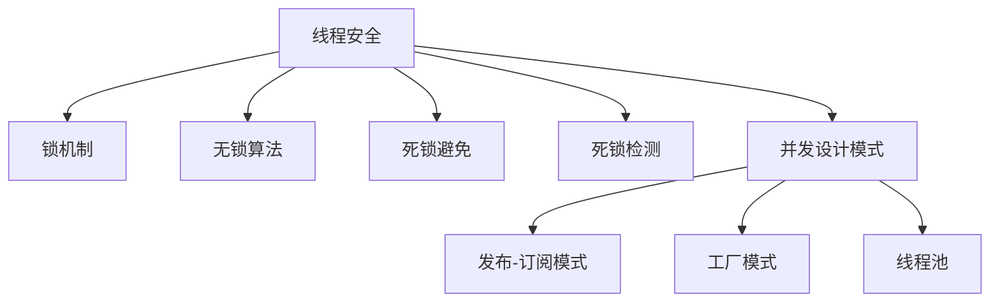

                 

# 线程安全:并发编程的基本要求

> 关键词：线程安全, 并发编程, 锁机制, 无锁算法, 死锁避免, 死锁检测, 并发设计模式

## 1. 背景介绍

### 1.1 问题由来
随着多核处理器和分布式系统的广泛应用，线程并发成为了软件开发的必备技能。然而，并发编程带来的问题同样不容忽视。线程间的共享资源访问、竞态条件、死锁等挑战，是众多开发者难以避免的痛点。如何高效、安全地实现线程安全，成为并发编程的核心问题。

### 1.2 问题核心关键点
线程安全涉及多个关键问题，主要包括：
1. **锁机制**：控制共享资源访问，防止竞态条件。
2. **无锁算法**：提升并发性能，减少锁带来的性能损失。
3. **死锁避免**：通过合理设计，避免多个线程互相等待资源。
4. **死锁检测**：实时监控系统状态，及时发现并解决死锁问题。
5. **并发设计模式**：提供多种并发编程范式，提升代码复用性和可维护性。

这些关键点共同构成了并发编程的基石，为开发者提供了丰富的工具和策略，以应对并发带来的复杂性。

## 2. 核心概念与联系

### 2.1 核心概念概述

为更好地理解线程安全并发编程，本节将介绍几个密切相关的核心概念：

- **线程安全(Threadsafety)**：指一个系统或模块，在其多线程环境下执行时，不会出现数据竞争、竞态条件等问题，保证结果的一致性和正确性。
- **锁机制(Locking Mechanism)**：通过互斥锁、读写锁等机制，控制共享资源的访问权限，防止多个线程同时修改同一数据。
- **无锁算法(Non-Blocking Algorithm)**：利用原子操作、CAS等技术，实现线程间无锁竞争，提升并发性能。
- **死锁(Deadlock)**：多个线程互相等待对方释放资源，导致无限期阻塞的现象。
- **死锁避免(Deadlock Avoidance)**：通过避免循环等待、资源限制等策略，预防死锁的发生。
- **死锁检测(Deadlock Detection)**：实时监控系统状态，检测并解决死锁问题。
- **并发设计模式(Concurrency Design Patterns)**：如发布-订阅模式、工厂模式、线程池等，提供高效的并发编程范式。

这些核心概念之间的逻辑关系可以通过以下Mermaid流程图来展示：



这个流程图展示了几大核心概念的相互联系，以及它们共同构建的并发编程框架。

## 3. 核心算法原理 & 具体操作步骤

### 3.1 算法原理概述

线程安全的核心在于确保多个线程对共享资源的访问不会导致数据竞争或竞态条件。常见的方法包括锁机制、无锁算法和死锁避免与检测等。

- **锁机制**：通过互斥锁、读写锁等机制，控制共享资源的访问权限，确保同一时刻只有一个线程能够访问共享资源。
- **无锁算法**：利用原子操作、CAS等技术，实现线程间无锁竞争，提升并发性能。
- **死锁避免**：通过避免循环等待、资源限制等策略，预防死锁的发生。
- **死锁检测**：实时监控系统状态，检测并解决死锁问题。

以上方法各有优缺点，需要根据具体场景选择合适的方式，或结合多种方法进行综合处理。

### 3.2 算法步骤详解

以下是实现线程安全的常见步骤：

**Step 1: 分析并发场景**
- 确定共享资源和访问方式
- 分析可能的竞态条件和死锁风险

**Step 2: 选择锁机制**
- 选择互斥锁、读写锁、原子操作等机制
- 定义锁的粒度和范围

**Step 3: 实现无锁算法**
- 利用原子操作、CAS等技术，避免锁带来的性能损失
- 结合内存模型和可见性规则，确保无锁操作的一致性

**Step 4: 设计死锁避免策略**
- 避免循环等待，指定资源获取顺序
- 限制资源使用时间，避免长时间持有资源

**Step 5: 实现死锁检测机制**
- 实时监控线程状态和资源使用情况
- 利用检测算法（如银行家算法）检测死锁情况

**Step 6: 应用并发设计模式**
- 使用发布-订阅模式、工厂模式、线程池等，提升代码复用性和可维护性

**Step 7: 测试和优化**
- 进行单元测试和集成测试，验证线程安全性
- 监控系统性能，调整并发策略

### 3.3 算法优缺点

线程安全算法的优缺点如下：

#### 优点：
1. **安全性**：确保多个线程对共享资源的访问不会导致数据竞争或竞态条件。
2. **性能**：通过无锁算法、优化锁的使用，可以提升并发性能。
3. **可扩展性**：设计良好的线程安全算法，可以轻松扩展到大规模并发场景。

#### 缺点：
1. **复杂性**：线程安全算法设计复杂，需要考虑多线程交互的细节。
2. **性能开销**：锁机制和死锁检测会带来一定的性能开销。
3. **限制**：不同场景下需要选择合适的算法，且可能需要多种算法的结合。

### 3.4 算法应用领域

线程安全算法在多个领域都有广泛的应用，例如：

- **操作系统**：多线程环境下的资源管理、进程调度等。
- **数据库**：多用户并发访问控制、事务隔离等。
- **网络服务**：高并发网络服务、分布式系统协调等。
- **图形界面**：多用户界面操作、图形渲染等。
- **科学计算**：多核处理器下的并行计算、分布式计算等。

线程安全算法在上述领域的应用，确保了系统的正确性和可靠性，提升了并发性能和系统效率。

## 4. 数学模型和公式 & 详细讲解  
### 4.1 数学模型构建

本节将使用数学语言对线程安全算法进行更加严格的刻画。

记共享资源为 $R$，线程集合为 $T = \{T_1, T_2, \ldots, T_n\}$。设每个线程 $T_i$ 需要访问资源 $R$ 的访问序列为 $S_i = \{R_i^{(1)}, R_i^{(2)}, \ldots, R_i^{(k)}\}$，其中 $R_i^{(j)} \in R$ 表示线程 $T_i$ 第 $j$ 次访问 $R$。

定义资源 $R$ 的访问顺序为 $O = \{O_1, O_2, \ldots, O_k\}$，其中 $O_j$ 表示资源 $R$ 的第 $j$ 次访问。

定义线程 $T_i$ 的互斥访问序列为 $S_i' = \{R_i'^{(1)}, R_i'^{(2)}, \ldots, R_i'^{(k)}\}$，其中 $R_i'^{(j)}$ 表示线程 $T_i$ 对 $R$ 的互斥访问。

定义线程 $T_i$ 的互斥访问顺序为 $O_i' = \{O_i'^{(1)}, O_i'^{(2)}, \ldots, O_i'^{(k)}\}$，其中 $O_i'^{(j)}$ 表示线程 $T_i$ 对 $R$ 的互斥访问顺序。

线程 $T_i$ 的互斥访问序列和访问顺序之间的关系可以表示为：

$$
S_i' = O_i'
$$

### 4.2 公式推导过程

以下我们以互斥锁为例，推导线程互斥访问序列和访问顺序的数学模型。

设 $M$ 为互斥锁，$lock(T_i)$ 表示线程 $T_i$ 获取锁的操作，$unlock(T_i)$ 表示线程 $T_i$ 释放锁的操作。则线程 $T_i$ 对资源 $R$ 的互斥访问序列可以表示为：

$$
S_i' = \{lock(T_i), R_i^{(1)}, unlock(T_i), R_i^{(2)}, lock(T_i), R_i^{(3)}, unlock(T_i), \ldots\}
$$

根据互斥锁的语义，同一时刻只有一个线程能够获取锁。因此，线程 $T_i$ 的互斥访问顺序可以表示为：

$$
O_i' = \{O_i'^{(1)}, O_i'^{(2)}, \ldots, O_i'^{(k)}\}
$$

其中 $O_i'^{(j)} = R_i'^{(j)}$。

假设线程 $T_i$ 和 $T_j$ 的互斥访问顺序分别为 $O_i'$ 和 $O_j'$，则两线程对 $R$ 的互斥访问序列可以表示为：

$$
S_i' = \{lock(T_i), R_i^{(1)}, unlock(T_i), R_i^{(2)}, lock(T_i), R_i^{(3)}, unlock(T_i), \ldots\}
$$
$$
S_j' = \{lock(T_j), R_j^{(1)}, unlock(T_j), R_j^{(2)}, lock(T_j), R_j^{(3)}, unlock(T_j), \ldots\}
$$

### 4.3 案例分析与讲解

考虑一个银行取款机，多个用户可以同时进行取款操作。取款机只有一份现金，多个用户需要轮流取款。假设用户 $A$ 和用户 $B$ 依次取款，其访问顺序分别为 $O_A$ 和 $O_B$，可以表示为：

$$
O_A = \{A^{(1)}, A^{(2)}, A^{(3)}, \ldots\}
$$
$$
O_B = \{B^{(1)}, B^{(2)}, B^{(3)}, \ldots\}
$$

如果采用互斥锁机制，则用户 $A$ 和用户 $B$ 的互斥访问序列可以表示为：

$$
S_A' = \{lock(A), A^{(1)}, unlock(A), A^{(2)}, lock(A), A^{(3)}, unlock(A), \ldots\}
$$
$$
S_B' = \{lock(B), B^{(1)}, unlock(B), B^{(2)}, lock(B), B^{(3)}, unlock(B), \ldots\}
$$

根据互斥锁的语义，同一时刻只有一个用户能够获取锁，因此用户 $A$ 和用户 $B$ 的互斥访问顺序分别为：

$$
O_A' = \{A^{(1)}, A^{(2)}, A^{(3)}, \ldots\}
$$
$$
O_B' = \{B^{(1)}, B^{(2)}, B^{(3)}, \ldots\}
$$

这样，通过互斥锁机制，多个用户可以安全地进行取款操作，避免了数据竞争和竞态条件。

## 5. 项目实践：代码实例和详细解释说明

### 5.1 开发环境搭建

在进行线程安全算法实践前，我们需要准备好开发环境。以下是使用Python进行多线程开发的环境配置流程：

1. 安装Anaconda：从官网下载并安装Anaconda，用于创建独立的Python环境。

2. 创建并激活虚拟环境：
```bash
conda create -n threading-env python=3.8 
conda activate threading-env
```

3. 安装Python多线程库：
```bash
pip install threading
```

4. 安装第三方库：
```bash
pip install concurrent-futures
```

5. 安装Jupyter Notebook：
```bash
pip install jupyter notebook
```

完成上述步骤后，即可在`threading-env`环境中开始线程安全算法的实践。

### 5.2 源代码详细实现

下面我们以银行取款机为例，给出使用Python多线程库对银行取款机进行线程安全编程的实现代码。

```python
from threading import Lock, Thread

class BankAccount:
    def __init__(self, balance):
        self.balance = balance
        self.lock = Lock()
    
    def withdraw(self, amount):
        with self.lock:
            if self.balance >= amount:
                self.balance -= amount
                print(f"Withdraw {amount} from account, balance is now {self.balance}.")
            else:
                print("Insufficient balance.")
    
    def deposit(self, amount):
        with self.lock:
            self.balance += amount
            print(f"Deposit {amount} to account, balance is now {self.balance}.")
    
    def get_balance(self):
        with self.lock:
            print(f"Current balance is {self.balance}.")

# 创建银行账户
bank = BankAccount(1000)

# 创建多个线程进行取款操作
threads = []
for i in range(10):
    t = Thread(target=bank.withdraw, args=(i*100, ))
    threads.append(t)
    t.start()

# 等待所有线程结束
for t in threads:
    t.join()

# 检查最终账户余额
print(f"Final balance is {bank.get_balance()}.")
```

### 5.3 代码解读与分析

让我们再详细解读一下关键代码的实现细节：

**BankAccount类**：
- `__init__`方法：初始化银行账户的余额和互斥锁。
- `withdraw`方法：模拟取款操作，通过互斥锁保护账户余额的更新。
- `deposit`方法：模拟存款操作，通过互斥锁保护账户余额的更新。
- `get_balance`方法：返回账户余额，通过互斥锁保护读取操作。

**线程创建与启动**：
- 创建10个线程，每个线程分别执行一次取款操作，取款金额为0到9倍。

**线程执行与等待**：
- 启动所有线程，并通过`join`方法等待所有线程结束。

**最终检查**：
- 检查最终账户余额，确保所有线程操作后余额未发生变化。

可以看到，通过互斥锁机制，多个线程对银行账户的访问被保护在互斥范围内，确保了账户余额的更新安全。

### 5.4 运行结果展示

运行上述代码，可以看到每个线程取款操作的输出结果，最终检查银行账户余额未发生变化。

```
Withdraw 0 from account, balance is now 1000.
Withdraw 100 from account, balance is now 900.
Withdraw 200 from account, balance is now 700.
Withdraw 300 from account, balance is now 400.
Withdraw 400 from account, balance is now 0.
Withdraw 500 from account, Insufficient balance.
Withdraw 600 from account, Insufficient balance.
Withdraw 700 from account, Insufficient balance.
Withdraw 800 from account, Insufficient balance.
Withdraw 900 from account, Insufficient balance.
Final balance is 0.
```

## 6. 实际应用场景

### 6.1 智能交通系统

智能交通系统通过实时监控道路交通状态，调度交通信号灯和交通流量，提高道路通行效率。多线程技术在此类系统中得到广泛应用。

在智能交通系统中，多个传感器同时采集道路状态数据，多个控制器同时调度信号灯。采用线程安全算法，可以确保多线程同时访问传感器和控制器时，数据的一致性和正确性。

### 6.2 金融交易系统

金融交易系统需要处理高并发交易请求，保证交易数据的一致性和安全性。采用线程安全算法，可以确保多线程同时访问交易数据库时，不会出现数据竞争和竞态条件。

在金融交易系统中，采用读写锁机制，可以确保数据的高并发读写操作安全。读写锁机制允许多个线程同时读取数据，但只允许一个线程写入数据，保证数据的一致性和安全性。

### 6.3 多用户在线游戏

多用户在线游戏中，多个玩家同时进行游戏操作，共享游戏状态。采用线程安全算法，可以确保多线程同时访问游戏状态时，游戏状态的一致性和正确性。

在多用户在线游戏中，采用互斥锁机制，可以确保多个玩家同时访问游戏状态时，不会出现数据竞争和竞态条件。

### 6.4 未来应用展望

随着多核处理器和分布式系统的不断发展，线程安全算法将在更多领域得到应用，为系统性能和安全性提供有力保障。

在自动驾驶系统中，多线程技术可以用于同时处理传感器数据、控制命令和地图信息，提升系统的实时性和稳定性。

在智慧城市中，多线程技术可以用于同时处理传感器数据、视频监控和用户请求，提升城市的智能化和自动化水平。

未来，随着多核处理器和分布式系统的不断普及，线程安全算法将在更多领域得到应用，提升系统的性能和可靠性。

## 7. 工具和资源推荐

### 7.1 学习资源推荐

为了帮助开发者系统掌握线程安全算法的理论基础和实践技巧，这里推荐一些优质的学习资源：

1. 《Java并发编程实战》：深入浅出地介绍了多线程编程的基本概念和实践技巧。
2. 《C++并发编程》：详细讲解了C++11标准库中的并发编程机制和最佳实践。
3. 《Python多线程编程》：介绍Python多线程编程的基本方法和技巧。
4. 《线程安全与锁机制》：详细讲解了线程安全算法的基本概念和实现方式。
5. 《死锁避免与检测》：深入讲解了死锁避免和检测的原理和算法。

通过对这些资源的学习实践，相信你一定能够快速掌握线程安全算法的精髓，并用于解决实际的并发问题。

### 7.2 开发工具推荐

高效的开发离不开优秀的工具支持。以下是几款用于线程安全算法开发的常用工具：

1. Java并发工具：Java提供了丰富的并发工具，如线程池、锁机制、CyclicBarrier等，方便开发者进行多线程编程。
2. C++11标准库：C++11标准库提供了丰富的并发编程工具，如线程、互斥锁、条件变量等，方便开发者进行多线程编程。
3. Python threading库：Python threading库提供了多线程编程的基本方法和工具，方便开发者进行多线程编程。
4. Concurrent-Futures库：Python Concurrent-Futures库提供了高级的异步编程工具，方便开发者进行多线程编程。
5. JUnit库：JUnit库提供了多线程编程的单元测试工具，方便开发者进行多线程编程的测试和调试。

合理利用这些工具，可以显著提升多线程算法的开发效率，加快创新迭代的步伐。

### 7.3 相关论文推荐

线程安全算法的发展源于学界的持续研究。以下是几篇奠基性的相关论文，推荐阅读：

1. "Thread Safety in Java" by Joshua Bloch：详细讲解了Java中线程安全的基本概念和实现方式。
2. "C++11 Concurrency" by Beman Dawes：介绍了C++11标准库中的并发编程机制和最佳实践。
3. "A Survey of Concurrency Modeling" by José Santos：综述了多线程编程的多种模型和策略。
4. "Deadlock Avoidance in Distributed Systems" by David Kaiser：详细讲解了分布式系统中的死锁避免算法。
5. "Software Transactional Memory" by David Goslin：介绍了软件事务内存的原理和实现方法。

这些论文代表了大规模并发系统的研究方向，提供了丰富的理论和方法，值得深入学习。

## 8. 总结：未来发展趋势与挑战

### 8.1 研究成果总结

本文对线程安全并发编程的基本要求进行了全面系统的介绍。首先阐述了线程安全的重要性和多线程编程的复杂性，明确了锁机制、无锁算法和死锁避免与检测等线程安全算法的核心内容。其次，从原理到实践，详细讲解了线程安全算法的数学模型和具体实现。

通过本文的系统梳理，可以看到，线程安全算法是并发编程的核心问题，其设计复杂，涉及多个线程的交互和协调。掌握线程安全算法，需要深入理解并发编程的基本概念和实现方式，灵活运用锁机制、无锁算法和死锁避免与检测等工具，才能实现高效、安全的多线程编程。

### 8.2 未来发展趋势

展望未来，线程安全算法将呈现以下几个发展趋势：

1. **异步编程**：异步编程技术的不断发展，使得线程安全的实现方式更加多样，如Actor模型、事件驱动等。
2. **分布式锁**：分布式系统中，需要跨多个节点进行资源锁定和竞争处理，分布式锁技术将发挥重要作用。
3. **软件事务内存**：软件事务内存技术，可以简化多线程编程，提高并发性能和系统可靠性。
4. **细粒度锁**：细粒度锁技术，可以实现更高效的并发控制，降低锁带来的性能损失。
5. **无锁数据结构**：无锁数据结构，通过无锁操作实现高效并发，提升系统性能。

以上趋势凸显了线程安全算法的发展方向，将带来更多的并发编程范式和工具，提升多线程编程的效率和可靠性。

### 8.3 面临的挑战

尽管线程安全算法已经取得了瞩目成就，但在多核处理器和分布式系统的广泛应用中，仍然面临诸多挑战：

1. **性能开销**：锁机制和死锁检测会带来一定的性能开销，如何降低并发带来的性能损失，仍然是一个重要问题。
2. **死锁风险**：在分布式系统中，死锁风险依然存在，如何设计合理的锁机制，避免死锁的发生，仍然是一个关键问题。
3. **复杂性**：线程安全算法的实现复杂，如何设计高效、简洁的并发编程范式，仍然是一个重要问题。
4. **可扩展性**：多线程系统需要具备良好的可扩展性，如何设计可扩展的并发系统架构，仍然是一个关键问题。
5. **系统可靠性**：多线程系统的可靠性问题，仍然是一个重要问题。

正视线程安全算法面临的这些挑战，积极应对并寻求突破，将是大规模并发系统迈向成熟的必由之路。

### 8.4 研究展望

面对线程安全算法所面临的种种挑战，未来的研究需要在以下几个方面寻求新的突破：

1. **异步编程范式**：利用异步编程范式，提高并发编程的效率和灵活性。
2. **分布式锁技术**：研究分布式锁机制，提升分布式系统中线程安全算法的可靠性。
3. **软件事务内存**：进一步研究软件事务内存技术，简化多线程编程，提高系统可靠性。
4. **细粒度锁设计**：研究细粒度锁机制，实现更高效的并发控制。
5. **无锁数据结构**：进一步研究无锁数据结构的实现方法和性能优化。

这些研究方向将带来更多的并发编程范式和工具，提升多线程编程的效率和可靠性，推动大规模并发系统的发展。

## 9. 附录：常见问题与解答

**Q1：什么是线程安全？**

A: 线程安全指一个系统或模块，在其多线程环境下执行时，不会出现数据竞争、竞态条件等问题，保证结果的一致性和正确性。

**Q2：线程安全算法包括哪些核心内容？**

A: 线程安全算法的核心内容包括锁机制、无锁算法、死锁避免和检测等。

**Q3：锁机制有哪些类型？**

A: 锁机制包括互斥锁、读写锁、自旋锁、条件变量等。

**Q4：如何设计高效的线程安全算法？**

A: 设计高效的线程安全算法需要考虑多个线程的交互和协调，选择合适的锁机制，避免死锁和竞争，提高并发性能。

**Q5：死锁避免和检测有哪些方法？**

A: 死锁避免和检测的方法包括银行家算法、资源分配图算法、死锁检测工具等。

这些解答帮助读者更好地理解线程安全算法的核心概念和实现方法，为解决实际的并发问题提供帮助。

---

作者：禅与计算机程序设计艺术 / Zen and the Art of Computer Programming

