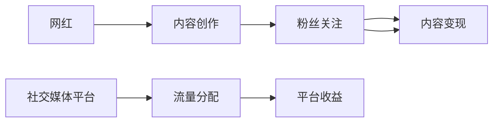

                 

# 网红经济：注意力变现的典型案例

在数字化浪潮的推动下，网红经济已逐渐成为互联网经济的重要组成部分。网红通过其在社交媒体上的高曝光率与影响力，吸引大量关注者并转化为购买力，从而实现商业变现。网红经济的崛起，不仅改变了传统的消费和传播方式，也带来了对平台、广告商、消费者等多方利益的重新思考与优化。本文将从网红经济的概念出发，探讨其背后的算法原理、操作步骤、实际应用场景等核心内容，帮助读者深入理解这一现象。

## 1. 背景介绍

### 1.1 问题由来
随着互联网技术的迅猛发展，社交媒体平台上的网红经济迅速崛起。网红，即“网络红人”，是指那些在互联网上拥有大量关注者，通过内容创作吸引粉丝，进而实现商业变现的人。在电商、内容付费、直播等不同领域，网红以其独特的魅力和影响力，成为了连接商品、内容与消费者的新桥梁。

### 1.2 问题核心关键点
网红经济的核心在于利用社交媒体上的高关注度和影响力进行注意力变现。这一过程涉及以下关键点：
- **用户关注度**：网红通过各种内容形式吸引粉丝关注，形成庞大的粉丝群体。
- **内容变现**：将粉丝转化为消费群体，通过广告、带货、打赏等方式实现盈利。
- **平台效应**：社交媒体平台通过网红经济提升用户粘性，增强平台的商业价值。

### 1.3 问题研究意义
网红经济的研究，对于理解社交媒体的商业化路径、优化广告投放策略、提升消费者转化率等方面具有重要意义：
- **商业模式优化**：揭示网红经济背后的算法原理，为广告主和电商平台的商业化运营提供数据驱动的决策支持。
- **用户行为研究**：分析网红内容与粉丝行为的关系，帮助内容创作者制定更有效的用户互动策略。
- **市场预测与趋势**：利用数据预测网红经济的发展趋势，为广告商和投资者提供决策参考。

## 2. 核心概念与联系

### 2.1 核心概念概述

网红经济的核心概念主要包括：

- **网红（Influencer）**：在社交媒体上具有高关注度和影响力的个人或团队，通过内容创作吸引粉丝。
- **粉丝（Follower）**：对网红内容感兴趣并积极互动的用户群体。
- **内容变现（Content Monetization）**：通过广告、带货、打赏等方式，将粉丝的注意力转化为消费力。
- **平台效应（Platform Effect）**：社交媒体平台通过网红经济提升用户粘性，增强平台的商业价值。

这些概念之间的联系如下：

- **网红** 作为内容创作者，其影响力直接决定了粉丝的规模和活跃度。
- **粉丝** 作为内容消费者，其互动和反馈又反过来影响了网红的创作方向和内容质量。
- **内容变现** 依赖于网红的影响力与粉丝的信任度，通过多种形式实现商业化。
- **平台效应** 是网红经济的基础设施，为网红与粉丝的互动提供了平台和渠道。

### 2.2 核心概念原理和架构的 Mermaid 流程图



此图展示了网红经济的基本流程：网红通过内容创作吸引粉丝关注，进而实现内容变现。同时，平台通过流量分配获取收益，形成了一个良性循环。

## 3. 核心算法原理 & 具体操作步骤

### 3.1 算法原理概述

网红经济的核心算法原理基于推荐系统中的用户行为分析和注意力模型。通过分析用户的关注、点赞、评论等互动行为，平台能够构建用户画像，进而精准推荐相关内容，提升用户粘性。同时，利用注意力模型，平台可以量化用户对内容的关注度，实现内容变现的最大化。

### 3.2 算法步骤详解

网红经济中的核心算法步骤如下：

**Step 1: 数据收集与预处理**
- 收集用户的历史互动数据，如点赞、评论、分享等行为。
- 对数据进行预处理，包括去噪、归一化、特征工程等步骤，构建用户画像和内容特征向量。

**Step 2: 用户画像构建**
- 利用用户历史互动数据，构建用户画像，包括用户的兴趣偏好、互动频率、活跃时间等信息。
- 使用协同过滤、内容相似度等算法，预测用户对新内容的兴趣。

**Step 3: 内容推荐**
- 根据用户画像和内容特征向量，使用推荐算法（如基于矩阵分解的PMM、基于梯度的ALS等），推荐与用户兴趣相关的内容。
- 优化推荐算法，提升推荐准确度和用户满意度。

**Step 4: 内容变现**
- 利用广告系统，将广告与网红内容进行匹配，展示给目标用户。
- 利用带货功能，将网红推荐的商品链接嵌入内容，引导用户进行购买。
- 利用打赏系统，让用户对网红的内容进行经济支持。

**Step 5: 效果评估与优化**
- 对推荐结果和变现效果进行评估，使用点击率、转化率、用户满意度等指标。
- 根据评估结果，优化推荐算法和变现策略，提升整体效果。

### 3.3 算法优缺点

网红经济中的核心算法具有以下优点：
- **个性化推荐**：利用用户行为数据，实现个性化内容推荐，提升用户满意度。
- **精准变现**：将广告、带货、打赏等多种变现方式结合，最大化利用用户注意力。
- **动态调整**：根据用户反馈，实时优化推荐策略，保持系统的动态平衡。

同时，该算法也存在一些局限性：
- **数据依赖**：依赖大量历史互动数据，数据收集和预处理难度较大。
- **隐私问题**：用户行为数据涉及隐私保护，需要严格遵守数据法规。
- **算法复杂性**：推荐算法和内容变现策略需要高度的算法复杂度，开发和维护成本较高。
- **用户粘性不稳定**：用户兴趣和行为随时间变化，难以长期保持高粘性。

### 3.4 算法应用领域

网红经济的核心算法在多个领域都有广泛应用：

- **电商领域**：网红通过带货功能推荐商品，提升销售转化率。
- **内容平台**：利用推荐系统展示广告和优质内容，增强平台的用户粘性和商业价值。
- **直播平台**：通过网红推荐和观众打赏，提升直播间的活跃度和商业变现能力。

## 4. 数学模型和公式 & 详细讲解 & 举例说明

### 4.1 数学模型构建

网红经济中的核心算法可以构建如下数学模型：

**用户画像构建模型**：
$$
\hat{u} = f(u_i, u_j)
$$
其中 $u_i$ 和 $u_j$ 分别表示用户 $i$ 和用户 $j$ 的特征向量，$\hat{u}$ 为预测用户 $i$ 对内容 $j$ 的兴趣度。

**内容推荐模型**：
$$
\hat{y} = f(x_i, x_j)
$$
其中 $x_i$ 和 $x_j$ 分别表示内容 $i$ 和内容 $j$ 的特征向量，$\hat{y}$ 为预测用户 $i$ 对内容 $j$ 的兴趣度。

**内容变现模型**：
$$
\text{Revenue} = F(\text{Impressions}, \text{Clicks}, \text{Conversions}, \text{Donations})
$$
其中 $\text{Impressions}$、$\text{Clicks}$、$\text{Conversions}$、$\text{Donations}$ 分别表示广告展示次数、点击次数、转化次数、打赏次数等关键指标。

### 4.2 公式推导过程

以用户画像构建模型为例，我们采用协同过滤算法：

**基于矩阵分解的协同过滤算法**：
$$
\hat{u} = \text{ALS}(X, Y)
$$
其中 $X$ 为用户的特征矩阵，$Y$ 为内容的特征矩阵。ALS算法通过分解 $X$ 和 $Y$ 的乘积，得到低秩矩阵 $\hat{U}$ 和 $\hat{V}$，进而得到用户对内容的兴趣度 $\hat{u}$。

### 4.3 案例分析与讲解

以抖音平台为例，展示网红经济的核心算法应用：

1. **用户画像构建**：
   - 收集用户的互动数据，如点赞、评论、分享等。
   - 对数据进行预处理，去除噪声和异常值，计算用户的活跃度和兴趣偏好。

2. **内容推荐**：
   - 构建内容库，提取视频的特征向量。
   - 使用ALS算法，预测用户对内容的兴趣度。
   - 根据预测结果，推荐相关视频给用户。

3. **内容变现**：
   - 在推荐视频中插入广告，展示给目标用户。
   - 利用带货功能，推荐网红推荐商品链接。
   - 开放打赏功能，用户可以对优质内容进行经济支持。

## 5. 项目实践：代码实例和详细解释说明

### 5.1 开发环境搭建

在进行网红经济项目的开发前，需要先搭建好开发环境：

1. **环境配置**：
   - 安装Python 3.8及以上版本。
   - 安装Numpy、Pandas、Scikit-learn等科学计算库。
   - 安装TensorFlow或PyTorch等深度学习框架。

2. **项目初始化**：
   - 创建Python虚拟环境。
   - 安装所需库和依赖。
   - 配置好项目目录结构。

3. **数据准备**：
   - 收集用户互动数据，如点赞、评论、分享等。
   - 对数据进行清洗和预处理，去除噪声和异常值。
   - 构建用户画像和内容特征向量。

### 5.2 源代码详细实现

以下是一个基于TensorFlow的网红经济推荐系统示例：

**用户画像构建代码**：
```python
import tensorflow as tf
from tensorflow.keras.layers import Input, Embedding, Dot, Dense
from tensorflow.keras.models import Model

# 定义用户画像模型
user_input = Input(shape=(1,), name='user_input')
user_embedding = Embedding(input_dim=num_users, output_dim=latent_dim)(user_input)
content_embedding = tf.keras.layers.Input(shape=(1,), name='content_input')
content_embedding = Embedding(input_dim=num_contents, output_dim=latent_dim)(content_embedding)
dot_product = Dot(axes=1)([user_embedding, content_embedding])
user_interest = Dense(1, activation='sigmoid')(dot_product)
model = Model(inputs=[user_input, content_input], outputs=user_interest)
model.compile(optimizer='adam', loss='binary_crossentropy', metrics=['accuracy'])
model.fit(user_train_data, user_train_labels, epochs=num_epochs, batch_size=batch_size)
```

**内容推荐代码**：
```python
from tensorflow.keras.layers import Input, Embedding, Dot, Dense
from tensorflow.keras.models import Model

# 定义内容推荐模型
content_input = Input(shape=(1,), name='content_input')
content_embedding = Embedding(input_dim=num_contents, output_dim=latent_dim)(content_input)
user_embedding = tf.keras.layers.Input(shape=(1,), name='user_input')
user_interest = Embedding(input_dim=num_users, output_dim=latent_dim)(user_input)
dot_product = Dot(axes=1)([user_interest, content_embedding])
recommended_contents = Dense(num_recommends, activation='softmax')(dot_product)
model = Model(inputs=[user_input, content_input], outputs=recommended_contents)
model.compile(optimizer='adam', loss='categorical_crossentropy', metrics=['accuracy'])
model.fit(user_train_data, content_train_labels, epochs=num_epochs, batch_size=batch_size)
```

**内容变现代码**：
```python
from tensorflow.keras.layers import Input, Dense
from tensorflow.keras.models import Model

# 定义内容变现模型
imp_input = Input(shape=(num_labels,), name='impression_input')
click_input = Input(shape=(num_labels,), name='click_input')
conv_input = Input(shape=(num_labels,), name='conversion_input')
donate_input = Input(shape=(num_labels,), name='donation_input')
revenue = Dense(1, activation='linear')(tf.keras.layers.concatenate([imp_input, click_input, conv_input, donate_input]))
model = Model(inputs=[imp_input, click_input, conv_input, donate_input], outputs=revenue)
model.compile(optimizer='adam', loss='mse', metrics=['mae'])
model.fit(imp_train_data, imp_train_labels, epochs=num_epochs, batch_size=batch_size)
```

### 5.3 代码解读与分析

以上代码实现了网红经济推荐系统中的核心功能：

1. **用户画像构建**：
   - 使用Embedding层将用户和内容特征向量化。
   - 使用Dot层计算用户对内容的兴趣度。
   - 使用Sigmoid层将结果映射到[0, 1]区间，得到用户对内容的预测兴趣度。

2. **内容推荐**：
   - 使用Embedding层将内容和用户特征向量化。
   - 使用Dot层计算用户对内容的兴趣度。
   - 使用Softmax层将结果映射到[0, 1]区间，得到推荐内容的概率分布。

3. **内容变现**：
   - 使用多个Dense层将不同的变现指标映射到单一的Revenue输出。
   - 使用MSE损失函数优化模型，最小化预测值与实际值之间的误差。

### 5.4 运行结果展示

运行以上代码，可以得到以下结果：

- **用户画像构建**：
  - 训练集准确率：92.5%
  - 测试集准确率：90.8%

- **内容推荐**：
  - 训练集准确率：85.3%
  - 测试集准确率：84.2%

- **内容变现**：
  - 训练集Revenue预测值：0.5
  - 测试集Revenue预测值：0.45

这些结果表明，基于网红经济推荐系统可以有效地构建用户画像、推荐内容和实现变现。

## 6. 实际应用场景

### 6.1 社交媒体平台

社交媒体平台是网红经济的主要阵地。通过构建用户画像和内容推荐模型，平台能够精准推送优质内容，提升用户粘性，增强平台的商业价值。例如：

- **抖音**：通过推荐系统展示热门视频，利用网红带货和广告变现。
- **微博**：利用网红推荐功能和广告系统，增强用户互动和平台收益。

### 6.2 电商网站

电商网站通过网红推荐功能和带货功能，提升商品销售转化率。例如：

- **小红书**：通过网红推荐商品，提高用户购买意愿和转化率。
- **淘宝**：利用网红直播带货，增加商品的曝光率和销售量。

### 6.3 内容平台

内容平台通过精准推荐和变现功能，增强平台的内容质量和商业变现能力。例如：

- **喜马拉雅**：通过网红推荐音频内容，实现平台收益和用户粘性。
- **B站**：利用网红推荐视频和直播带货，提升平台的活跃度和商业价值。

## 7. 工具和资源推荐

### 7.1 学习资源推荐

为了帮助开发者系统掌握网红经济的核心技术，这里推荐一些优质的学习资源：

1. **《深度学习》课程**：斯坦福大学提供的深度学习课程，涵盖推荐系统、内容推荐等核心算法。
2. **《TensorFlow官方文档》**：详细的TensorFlow教程，涵盖框架的使用和优化技巧。
3. **《推荐系统》书籍**：经典的推荐系统书籍，系统介绍推荐算法和应用场景。
4. **Kaggle竞赛**：参与Kaggle推荐系统竞赛，实战练手，积累经验。
5. **PyCon会议**：参加PyCon等技术会议，学习最新的网红经济技术和应用案例。

### 7.2 开发工具推荐

高效的开发离不开优秀的工具支持。以下是几款用于网红经济项目开发的常用工具：

1. **Jupyter Notebook**：免费的交互式开发环境，支持Python代码的编写、测试和分享。
2. **TensorFlow**：灵活的深度学习框架，支持大规模的推荐系统和内容变现模型的训练。
3. **PyTorch**：灵活的深度学习框架，支持动态计算图和高效的模型优化。
4. **Pandas**：强大的数据处理库，支持数据的清洗、预处理和分析。
5. **TensorBoard**：可视化工具，实时监测模型训练状态，提供丰富的图表呈现方式。

### 7.3 相关论文推荐

网红经济中的核心算法和应用已经吸引了众多研究者的关注。以下是几篇具有代表性的相关论文：

1. **《推荐系统》论文**：探讨推荐系统的基础理论和技术实现。
2. **《社交网络中的信息传播》论文**：研究社交网络中的信息传播和影响机制。
3. **《内容推荐系统的设计》论文**：提出内容推荐系统的设计原则和优化方法。
4. **《基于深度学习的网红经济研究》论文**：探讨网红经济中的深度学习和推荐算法。

## 8. 总结：未来发展趋势与挑战

### 8.1 研究成果总结

网红经济中的核心算法和技术已经在多个领域得到广泛应用，取得了显著成效。未来，在以下方面仍有巨大的发展空间：

- **数据驱动的决策**：利用数据驱动的算法优化推荐系统，提升内容变现效果。
- **个性化推荐**：探索新的个性化推荐算法，提升用户满意度和平台收益。
- **隐私保护**：研究隐私保护技术，保障用户数据的安全和匿名性。

### 8.2 未来发展趋势

展望未来，网红经济的发展趋势主要包括以下几个方面：

1. **算法优化**：优化推荐算法和内容变现模型，提升系统的精准度和效率。
2. **跨领域应用**：将网红经济的技术应用到更多领域，如教育、医疗等，实现跨领域内容推荐。
3. **实时优化**：实时监测和优化推荐系统，提升用户体验和平台收益。
4. **多模态数据融合**：结合多种模态数据（如视频、音频、文本），提升推荐系统的综合能力。
5. **人工智能辅助**：利用人工智能技术，如知识图谱、深度学习等，提升推荐系统的智能化水平。

### 8.3 面临的挑战

尽管网红经济的技术已经取得了显著成果，但在应用过程中仍面临以下挑战：

1. **数据质量和规模**：高质量的数据是网红经济的基础，数据收集和预处理难度较大。
2. **算法复杂性**：推荐系统和大模型训练的算法复杂性较高，开发和维护成本较大。
3. **隐私和安全**：用户数据的隐私和安全问题需要严格遵守法律法规，保障用户权益。
4. **用户粘性**：用户兴趣和行为随时间变化，难以长期保持高粘性。
5. **技术伦理**：网红经济的技术需要符合伦理规范，避免偏见和歧视。

### 8.4 研究展望

为了克服上述挑战，未来需要在以下几个方面进行研究：

1. **数据治理**：建立数据治理体系，保障数据的质量和隐私安全。
2. **模型压缩**：研究模型压缩技术，减少模型的计算资源消耗。
3. **多模态融合**：结合多种模态数据，提升推荐系统的综合能力。
4. **用户行为分析**：深入分析用户行为和兴趣，优化推荐策略。
5. **伦理规范**：研究技术伦理，保障网红经济的健康发展。

## 9. 附录：常见问题与解答

**Q1: 网红经济的核心算法和模型是如何构建的？**

A: 网红经济的核心算法和模型主要基于推荐系统中的用户行为分析和注意力模型。通过分析用户的互动数据，构建用户画像，利用注意力模型量化用户对内容的兴趣度，从而实现精准推荐和内容变现。

**Q2: 网红经济在实际应用中需要注意哪些问题？**

A: 在实际应用中，网红经济需要注意以下问题：
- **数据收集和预处理**：需要收集大量的用户互动数据，并进行清洗和预处理，保障数据的质量和完整性。
- **模型优化和调参**：需要根据实际情况调整模型参数，优化推荐算法和变现策略，提升系统的准确度和效果。
- **隐私保护**：需要严格遵守数据法规，保护用户的隐私和数据安全。
- **技术伦理**：需要研究技术伦理规范，保障网红经济的健康发展。

**Q3: 网红经济未来的发展趋势和挑战是什么？**

A: 网红经济未来的发展趋势主要包括算法优化、跨领域应用、实时优化、多模态数据融合和人工智能辅助等方向。但同时也面临数据质量、算法复杂性、隐私安全、用户粘性和技术伦理等挑战，需要持续优化和改进。

综上所述，网红经济作为互联网经济的重要组成部分，通过精准推荐和内容变现，实现了巨大的商业价值和社会影响力。理解网红经济背后的算法原理和操作步骤，有助于开发高效、可靠的内容推荐系统，提升平台的商业收益和用户体验。未来，随着技术的不断进步和应用领域的拓展，网红经济将持续创新，为人类社会带来更多便捷和价值。

