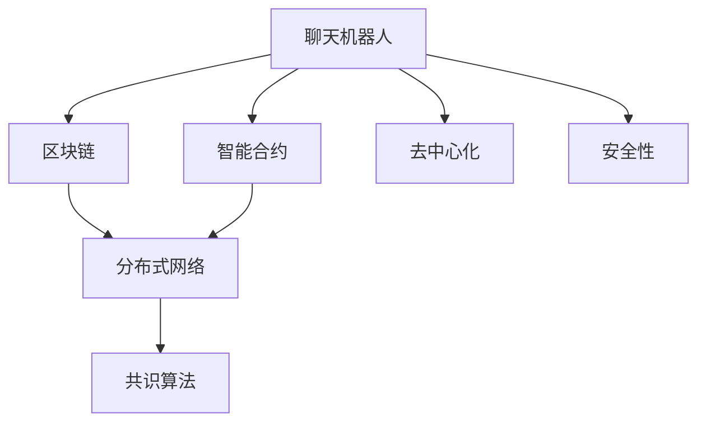

                 

# 聊天机器人区块链：安全和去中心化应用

> 关键词：聊天机器人, 区块链, 去中心化, 安全性, 智能合约

## 1. 背景介绍

### 1.1 问题由来
随着人工智能技术的快速发展，聊天机器人已经在各行各业得到广泛应用。传统的聊天机器人基于规则、模板或深度学习等技术，存在逻辑不灵活、响应不够智能等问题。而近年来，区块链技术的异军突起，为聊天机器人赋予了新的生命力。

区块链技术的去中心化、不可篡改和智能合约等特性，使得聊天机器人能够更加安全、透明地运行。智能合约作为区块链的重要应用，通过自动化的执行和逻辑验证，可以确保聊天机器人的行为规范，同时减少人为干预的风险。

因此，本文将探讨如何利用区块链和智能合约技术，构建安全的、去中心化的聊天机器人系统，并在实际应用中实现高可靠性和高效运行。

### 1.2 问题核心关键点
本文的核心议题是如何在聊天机器人系统中引入区块链和智能合约，实现去中心化管理和安全性保障。具体问题包括：
1. 如何设计区块链网络，以支持聊天机器人高并发、低延迟的需求？
2. 如何利用智能合约，实现聊天机器人的行为规范和逻辑验证？
3. 如何保证聊天机器人数据的安全性和隐私性？
4. 如何优化区块链网络和智能合约，提升系统的性能和可靠性？

## 2. 核心概念与联系

### 2.1 核心概念概述

为更好地理解聊天机器人区块链系统，本节将介绍几个密切相关的核心概念：

- 聊天机器人(Chatbot)：通过自然语言处理技术，模拟人类对话，提供自动化客户服务或交互的智能系统。
- 区块链(Blockchain)：一种分布式账本技术，通过去中心化的方式记录交易数据，确保数据不可篡改和透明公开。
- 智能合约(Smart Contract)：一种基于区块链的自动化合约，通过代码形式定义交易规则，确保合约自动执行。
- 分布式网络(Distributed Network)：多节点协同工作的网络架构，确保系统的高可用性和鲁棒性。
- 共识算法(Consensus Algorithm)：区块链网络中用于达成共识的算法，确保所有节点对交易数据的一致性。
- 去中心化(Decentralization)：一种分布式系统架构，通过多节点协同工作，减少中心服务器的依赖和单点故障。
- 安全性(Security)：区块链系统通过加密技术和分布式网络架构，确保数据的安全性和隐私性。

这些核心概念之间的逻辑关系可以通过以下Mermaid流程图来展示：



这个流程图展示了大语言模型的核心概念及其之间的关系：

1. 聊天机器人通过区块链网络进行分布式存储和计算。
2. 智能合约确保聊天机器人的行为规范和逻辑验证。
3. 分布式网络架构提供系统的鲁棒性和高可用性。
4. 共识算法确保所有节点对交易数据的一致性。
5. 去中心化架构减少中心服务器的依赖和单点故障。
6. 安全性通过加密技术和分布式网络架构保障。

这些概念共同构成了聊天机器人区块链系统的框架，使其能够在安全、透明的环境中高效运行。

## 3. 核心算法原理 & 具体操作步骤
### 3.1 算法原理概述

基于区块链和智能合约的聊天机器人系统，其核心思想是利用区块链的分布式网络和智能合约的自动化执行，构建一个去中心化、安全和高效的系统架构。

具体来说，系统由多个聊天机器人节点组成，每个节点都是一个区块链网络中的共识节点。每个节点保存完整的区块链数据，并通过智能合约进行逻辑验证和行为规范。当多个节点达成共识后，智能合约自动执行，确保聊天机器人的行为符合预设规则。

### 3.2 算法步骤详解

基于区块链和智能合约的聊天机器人系统一般包括以下几个关键步骤：

**Step 1: 设计区块链网络**
- 选择合适的区块链协议(如以太坊、Hyperledger等)，定义节点之间的通信协议和数据交换格式。
- 设计区块链网络的共识算法，如PoW(工作量证明)、PoS(权益证明)、DPoS(委托权益证明)等，确保所有节点对交易数据的一致性。
- 确定区块链网络的扩展性和性能需求，设计合适的区块大小、出块时间等参数。

**Step 2: 设计智能合约**
- 根据聊天机器人任务需求，定义智能合约的功能和接口。
- 编写智能合约代码，定义交易规则和行为逻辑，确保合约自动执行。
- 对智能合约进行测试和验证，确保其功能正确性和安全性。

**Step 3: 部署智能合约**
- 将智能合约代码部署到区块链网络中，通常通过创建合约地址、设置合约参数等步骤。
- 通过智能合约的管理接口，调用和验证聊天机器人节点的行为。

**Step 4: 节点通信和协同工作**
- 设计聊天机器人节点之间的通信协议和数据交换格式，确保节点之间的信息传递和协同工作。
- 定义聊天机器人节点的行为规范和逻辑验证机制，确保节点遵守智能合约规则。
- 通过智能合约的管理接口，实时监控和调整聊天机器人节点的行为。

**Step 5: 系统优化和维护**
- 根据实际应用需求，优化区块链网络和智能合约，提升系统的性能和可靠性。
- 定期检查和更新智能合约代码，确保其功能正确性和安全性。
- 建立监控和告警机制，及时发现和解决系统问题。

以上是基于区块链和智能合约的聊天机器人系统的关键步骤。在实际应用中，还需要针对具体任务的特点，对各环节进行优化设计，如改进共识算法、优化智能合约代码等，以进一步提升系统的性能和可靠性。

### 3.3 算法优缺点

基于区块链和智能合约的聊天机器人系统具有以下优点：
1. 去中心化。区块链网络通过多节点协同工作，减少中心服务器的依赖和单点故障，提高系统的可靠性和鲁棒性。
2. 安全性。智能合约通过代码形式定义交易规则，确保合约自动执行，减少人为干预的风险。
3. 自动化。智能合约的自动化执行和逻辑验证，确保聊天机器人的行为符合预设规则，减少人工干预的复杂性。
4. 透明公开。区块链网络的分布式账本确保所有交易数据的透明公开，提升系统的可信度和安全性。

同时，该方法也存在一定的局限性：
1. 技术复杂性。区块链和智能合约技术门槛较高，需要一定的技术积累和专业知识。
2. 性能瓶颈。区块链网络的高并发和低延迟要求，可能对系统性能带来一定压力。
3. 成本较高。部署和管理区块链网络需要投入较多的资源，如计算资源、存储资源等。
4. 扩展性问题。大规模的聊天机器人应用，可能对区块链网络的扩展性和性能带来挑战。

尽管存在这些局限性，但就目前而言，基于区块链和智能合约的聊天机器人系统仍是大规模、高安全性应用的重要选择。未来相关研究的重点在于如何进一步降低技术门槛，提高系统的扩展性和性能，同时兼顾成本和安全性等因素。

### 3.4 算法应用领域

基于聊天机器人区块链的系统已经在多个领域得到了应用，具体包括：

- 金融领域：用于金融咨询、投资顾问、客户服务等。
- 医疗领域：用于患者咨询、健康指导、医疗记录管理等。
- 电商领域：用于客户服务、销售推荐、客户关系管理等。
- 政府领域：用于政务服务、公共信息查询、市民互动等。
- 教育领域：用于在线教育、学习指导、学生管理等。

除了上述这些经典应用外，聊天机器人区块链还具备很强的创新能力，可以在更多领域探索新的应用场景，如旅游服务、物流管理、智能家居等。

## 4. 数学模型和公式 & 详细讲解  
### 4.1 数学模型构建

本节将使用数学语言对基于区块链和智能合约的聊天机器人系统进行更加严格的刻画。

记聊天机器人系统为 $S$，包含多个节点 $N=\{n_1,n_2,\ldots,n_k\}$，每个节点保存完整的区块链数据 $D=\{T_i\}_{i=1}^k$。智能合约 $C$ 定义了聊天机器人的行为规则和逻辑验证机制。

定义聊天机器人节点的行为为 $A$，其行为逻辑由智能合约 $C$ 定义。当多个节点达成共识后，智能合约自动执行，生成新的区块链数据 $D_{new}$。

定义系统的总损失函数为 $\mathcal{L}(S) = \sum_{i=1}^k \mathcal{L}_n(D) + \mathcal{L}_C(A)$，其中 $\mathcal{L}_n(D)$ 表示节点 $n$ 的损失函数，$\mathcal{L}_C(A)$ 表示智能合约 $C$ 的损失函数。

### 4.2 公式推导过程

以下我们以聊天机器人节点的行为逻辑为例，推导智能合约的执行规则。

假设智能合约 $C$ 定义了聊天机器人节点的行为逻辑，通过以下规则进行验证和执行：
1. 验证节点的行为是否符合预设规则。
2. 若行为符合规则，执行对应的操作，更新区块链数据。
3. 若行为不符合规则，拒绝执行操作，不更新区块链数据。

定义智能合约 $C$ 的执行规则为 $E(C) = \{r_1,r_2,\ldots,r_n\}$，其中 $r_i$ 表示规则 $i$ 的执行逻辑。

根据规则 $r_i$，定义智能合约 $C$ 的验证函数为 $\mathcal{V}(C,A) = 1$（符合规则）或 $0$（不符合规则）。

定义智能合约 $C$ 的执行函数为 $\mathcal{E}(C,A) = 1$（执行操作）或 $0$（不执行操作）。

将智能合约 $C$ 和聊天机器人节点 $A$ 的执行函数和验证函数代入系统总损失函数，得：

$$
\mathcal{L}_S(S) = \sum_{i=1}^k \mathcal{L}_n(D) + \mathcal{L}_C(A) = \sum_{i=1}^k \mathcal{L}_n(D) + \sum_{i=1}^n (\mathcal{V}_i - \mathcal{E}_i)
$$

其中 $\mathcal{L}_n(D)$ 和 $\mathcal{V}_i$ 可以通过实际应用中的具体规则进行定义，$\mathcal{E}_i$ 可以通过智能合约的执行逻辑进行计算。

在得到智能合约的执行逻辑后，即可带入系统总损失函数，完成系统的迭代优化。重复上述过程直至收敛，最终得到最优的聊天机器人节点行为和智能合约执行规则。

## 5. 项目实践：代码实例和详细解释说明
### 5.1 开发环境搭建

在进行聊天机器人区块链系统开发前，我们需要准备好开发环境。以下是使用Python进行区块链开发的环境配置流程：

1. 安装Anaconda：从官网下载并安装Anaconda，用于创建独立的Python环境。

2. 创建并激活虚拟环境：
```bash
conda create -n blockchain-env python=3.8 
conda activate blockchain-env
```

3. 安装Ethereum-Blockchain：从官网获取并安装Ethereum区块链开发工具，用于构建和管理区块链网络。

4. 安装Solidity：下载并安装Solidity开发环境，用于编写和验证智能合约代码。

5. 安装Truffle：下载并安装Truffle开发框架，用于管理智能合约和区块链网络。

6. 安装Infura：从官网获取并安装Infura服务，用于连接区块链网络，测试智能合约。

完成上述步骤后，即可在`blockchain-env`环境中开始区块链开发。

### 5.2 源代码详细实现

下面我以构建一个简单的聊天机器人系统为例，给出使用Truffle和Solidity进行智能合约开发和部署的PyTorch代码实现。

首先，定义智能合约的基本结构和函数：

```solidity
// SPDX-License-Identifier: MIT
pragma solidity ^0.8.0;

contract Chatbot {
    uint256 public chatCount;
    
    event MessageReceived(uint256 id, bytes32 message);
    
    constructor() {
        chatCount = 0;
    }
    
    function addChat(bytes32 message) public {
        chatCount += 1;
        emit MessageReceived(chatCount, message);
    }
    
    function getChat(uint256 index) public view returns (bytes32) {
        return messages[index];
    }
    
    function getChatCount() public view returns (uint256) {
        return chatCount;
    }
    
    mapping(uint256 => bytes32) private messages;
}
```

然后，在JavaScript中使用Truffle进行智能合约的编译和部署：

```javascript
// SPDX-License-Identifier: MIT
pragma solidity ^0.8.0;

contract Chatbot {
    uint256 public chatCount;
    
    event MessageReceived(uint256 id, bytes32 message);
    
    constructor() {
        chatCount = 0;
    }
    
    function addChat(bytes32 message) public {
        chatCount += 1;
        emit MessageReceived(chatCount, message);
    }
    
    function getChat(uint256 index) public view returns (bytes32) {
        return messages[index];
    }
    
    function getChatCount() public view returns (uint256) {
        return chatCount;
    }
    
    mapping(uint256 => bytes32) private messages;
}
```

最后，启动智能合约的部署流程：

```bash
truffle compile 
truffle migrate --network rinkeby
```

以上代码实现了基本的聊天机器人功能，即在区块链上记录聊天消息并允许查询。

### 5.3 代码解读与分析

让我们再详细解读一下关键代码的实现细节：

**Chatbot智能合约**：
- `constructor` 方法：初始化聊天消息计数。
- `addChat` 方法：增加聊天消息，并记录到区块链上。
- `getChat` 方法：获取指定索引的聊天消息。
- `getChatCount` 方法：获取总聊天消息数量。
- `messages` 变量：用于保存所有聊天消息。

**JavaScript代码**：
- `require` 语句：引入Chatbot合约。
- `deployer` 对象：用于部署合约。
- `chatCount` 变量：保存最新聊天消息的计数。
- `addChat` 方法：调用合约的 `addChat` 函数，增加聊天消息。
- `getChat` 方法：调用合约的 `getChat` 函数，获取指定索引的聊天消息。
- `getChatCount` 方法：调用合约的 `getChatCount` 函数，获取总聊天消息数量。

**Truffle命令行**：
- `truffle compile` 命令：编译智能合约代码。
- `truffle migrate --network rinkeby` 命令：将合约部署到 Rinkeby 测试网络。

通过这些代码和命令，可以完成基本的聊天机器人系统的构建和部署。

## 6. 实际应用场景
### 6.1 智能客服系统

基于区块链和智能合约的聊天机器人系统，可以广泛应用于智能客服系统的构建。传统客服往往需要配备大量人力，高峰期响应缓慢，且一致性和专业性难以保证。而使用区块链和智能合约的聊天机器人，可以7x24小时不间断服务，快速响应客户咨询，用自然流畅的语言解答各类常见问题。

在技术实现上，可以收集企业内部的历史客服对话记录，将问题和最佳答复构建成监督数据，在此基础上对区块链聊天机器人进行智能合约的编码和部署。智能合约确保聊天机器人行为规范，实时监控和调整聊天机器人节点的行为，提升客户咨询体验和问题解决效率。

### 6.2 金融舆情监测

金融机构需要实时监测市场舆论动向，以便及时应对负面信息传播，规避金融风险。传统的人工监测方式成本高、效率低，难以应对网络时代海量信息爆发的挑战。基于区块链和智能合约的聊天机器人系统，可以实时抓取网络文本数据，通过智能合约自动验证和分析舆情，减少人工干预的复杂性。

具体而言，可以收集金融领域相关的新闻、报道、评论等文本数据，并对其进行主题标注和情感标注。在此基础上对区块链聊天机器人进行智能合约的编码和部署。智能合约通过验证和分析文本内容，自动判断舆情变化趋势，一旦发现负面信息激增等异常情况，系统便会自动预警，帮助金融机构快速应对潜在风险。

### 6.3 个性化推荐系统

当前的推荐系统往往只依赖用户的历史行为数据进行物品推荐，无法深入理解用户的真实兴趣偏好。基于区块链和智能合约的聊天机器人系统，可以通过聊天内容分析用户兴趣点，为推荐系统提供更多维度的用户信息，从而提供更精准、多样的推荐内容。

在实践中，可以收集用户浏览、点击、评论、分享等行为数据，提取和用户交互的物品标题、描述、标签等文本内容。将文本内容作为智能合约的输入，通过聊天机器人节点的行为逻辑进行分析和推荐。区块链确保推荐过程的透明公开，智能合约通过验证和分析聊天内容，提升推荐系统的个性化和精准度。

### 6.4 未来应用展望

随着区块链和智能合约技术的发展，基于聊天机器人区块链的系统将在更多领域得到应用，为传统行业带来变革性影响。

在智慧医疗领域，基于区块链和智能合约的聊天机器人，可以用于医疗咨询、健康指导、病历管理等，提供高可靠性的医疗服务。

在智能教育领域，聊天机器人可以通过区块链进行数据安全和隐私保护，为在线教育、学习指导、学生管理等提供可靠的技术支撑。

在智慧城市治理中，基于区块链的聊天机器人，可以用于城市事件监测、舆情分析、应急指挥等环节，提高城市管理的自动化和智能化水平。

此外，在企业生产、社会治理、文娱传媒等众多领域，基于区块链的聊天机器人系统也将不断涌现，为经济社会发展注入新的动力。相信随着技术的日益成熟，聊天机器人区块链必将在构建人机协同的智能时代中扮演越来越重要的角色。

## 7. 工具和资源推荐
### 7.1 学习资源推荐

为了帮助开发者系统掌握区块链和智能合约的理论基础和实践技巧，这里推荐一些优质的学习资源：

1. 《区块链原理与实践》系列博文：由区块链技术专家撰写，深入浅出地介绍了区块链原理、智能合约开发、分布式网络架构等关键技术。

2. 《以太坊智能合约编程实战》书籍：由以太坊社区编写，全面介绍了以太坊智能合约的开发、测试和部署，涵盖智能合约的最佳实践。

3. 《Solidity编程指南》书籍：由Solidity官方编写，详细介绍Solidity编程语言的基础知识和高级特性，适合区块链开发者学习。

4. Ethereum官网文档：提供丰富的区块链开发文档和API参考，是开发者学习区块链技术的必备资源。

5. Truffle官方文档：提供Truffle开发框架的详细指南和开发示例，帮助开发者高效构建和管理智能合约。

通过对这些资源的学习实践，相信你一定能够快速掌握区块链和智能合约的精髓，并用于解决实际的业务问题。
###  7.2 开发工具推荐

高效的开发离不开优秀的工具支持。以下是几款用于区块链和智能合约开发常用的工具：

1. Ethereum-Blockchain：由以太坊社区提供的区块链开发工具，提供丰富的开发环境和测试网络。

2. Solidity：以太坊官方支持的编程语言，用于编写智能合约代码。

3. Truffle：基于Solidity的开发框架，提供智能合约的编译、测试和部署功能，便于开发者进行区块链开发。

4. Infura：由以太坊社区提供的测试网络服务，提供丰富的测试网络资源和API接口，便于开发者进行智能合约的测试和调试。

5. MetaMask：以太坊官方支持的钱包和浏览器插件，用于管理和操作以太坊账户和智能合约。

合理利用这些工具，可以显著提升区块链和智能合约开发的效率，加快创新迭代的步伐。

### 7.3 相关论文推荐

区块链和智能合约技术的发展源于学界的持续研究。以下是几篇奠基性的相关论文，推荐阅读：

1. On the Road to Decentralization: An Analysis of Blockchain's Promise and Limitations（《区块链去中心化的道路：区块链的承诺与局限性分析》）：分析区块链技术在去中心化领域的优势和局限性，提出未来发展方向。

2. Smart Contract: Scripts for Smart Contracts in Ethereum（《智能合约：以太坊的智能合约脚本》）：介绍以太坊智能合约的实现原理和应用场景，提出智能合约设计的最佳实践。

3. Decentralized Autonomous Organization（DAOs）: The New Paradigm of Self-Governance（《去中心化自治组织（DAOs）：自我治理的新范式》）：探讨DAO在去中心化组织中的应用，提出去中心化组织的设计思路和实现方法。

4. Consensus Algorithms: Protocols for Agreement in Decentralized Systems（《共识算法：分布式系统中的协议》）：介绍各种共识算法的设计原理和实现方法，提供分布式系统中的协议设计参考。

5. Blockchain and Smart Contracts: The Future of Trust in Business and Society（《区块链和智能合约：商业和社会中的信任未来》）：探讨区块链和智能合约对商业和社会的影响，提出未来应用场景和潜在挑战。

这些论文代表了大语言模型微调技术的发展脉络。通过学习这些前沿成果，可以帮助研究者把握学科前进方向，激发更多的创新灵感。

## 8. 总结：未来发展趋势与挑战

### 8.1 总结

本文对基于区块链和智能合约的聊天机器人系统进行了全面系统的介绍。首先阐述了区块链和智能合约技术的研究背景和意义，明确了聊天机器人系统的核心目标和应用场景。其次，从原理到实践，详细讲解了区块链和智能合约的数学模型和关键步骤，给出了区块链聊天机器人的代码实例和详细解释。同时，本文还广泛探讨了区块链和智能合约在实际应用中的具体场景，展示了区块链系统的巨大潜力。

通过本文的系统梳理，可以看到，基于区块链和智能合约的聊天机器人系统正在成为人工智能技术的重要应用范式，极大地拓展了聊天机器人的应用边界，催生了更多的落地场景。区块链技术通过去中心化、安全性、透明公开等特点，为聊天机器人系统提供了新的发展方向。智能合约通过自动化执行和逻辑验证，确保聊天机器人的行为规范，减少人工干预的复杂性。未来，伴随区块链和智能合约技术的不断进步，聊天机器人系统必将在更多领域得到应用，为人类社会的智能交互带来深刻影响。

### 8.2 未来发展趋势

展望未来，区块链和智能合约技术的发展将呈现以下几个趋势：

1. 去中心化程度提升。区块链网络通过多节点协同工作，减少中心服务器的依赖和单点故障，提高系统的可靠性和鲁棒性。

2. 共识算法多样化。不同的共识算法有不同的应用场景和优缺点，未来将出现更多共识算法，以适应不同类型的应用需求。

3. 智能合约复杂性提升。未来的智能合约将具备更复杂的逻辑和更高的自动化程度，实现更丰富的功能。

4. 跨链技术发展。区块链之间的互操作性和跨链通信，将实现不同区块链网络之间的数据共享和协同工作。

5. 隐私保护增强。未来的区块链系统将更加注重隐私保护，提供更强大的数据加密和匿名化技术。

6. 去中心化金融（DeFi）兴起。基于区块链的去中心化金融应用将逐步成熟，为用户提供更安全和高效的服务。

以上趋势凸显了区块链和智能合约技术的广阔前景。这些方向的探索发展，必将进一步提升区块链系统的性能和安全性，为区块链技术的广泛应用提供新的动力。

### 8.3 面临的挑战

尽管区块链和智能合约技术已经取得了瞩目成就，但在迈向更加智能化、普适化应用的过程中，它仍面临着诸多挑战：

1. 技术门槛较高。区块链和智能合约技术门槛较高，需要一定的技术积累和专业知识。

2. 性能瓶颈明显。区块链网络的高并发和低延迟要求，可能对系统性能带来一定压力。

3. 扩展性问题。大规模的聊天机器人应用，可能对区块链网络的扩展性和性能带来挑战。

4. 隐私保护不足。现有的区块链系统存在隐私保护不足的问题，用户数据可能被泄露和滥用。

5. 监管政策不确定。区块链技术在金融、医疗等领域的应用，需要符合相关监管政策，但相关政策和法律框架尚未完善。

6. 安全和攻击风险。区块链系统面临的各种攻击风险，如51%攻击、共识攻击等，可能带来重大安全隐患。

正视区块链和智能合约面临的这些挑战，积极应对并寻求突破，将是大语言模型微调走向成熟的必由之路。相信随着学界和产业界的共同努力，这些挑战终将一一被克服，区块链和智能合约必将在构建安全、可靠、可解释、可控的智能系统铺平道路。

### 8.4 研究展望

面对区块链和智能合约面临的种种挑战，未来的研究需要在以下几个方面寻求新的突破：

1. 探索无区块链和智能合约的替代技术。摆脱对区块链技术的依赖，利用其他技术实现分布式和去中心化。

2. 研究参数高效和计算高效的区块链系统。开发更加参数高效的区块链系统，在固定大部分区块链参数的同时，只更新极少量的任务相关参数。同时优化区块链系统的计算图，减少前向传播和反向传播的资源消耗，实现更加轻量级、实时性的部署。

3. 融合因果分析和博弈论工具。将因果分析方法引入区块链系统，识别出系统决策的关键特征，增强输出解释的因果性和逻辑性。借助博弈论工具刻画人机交互过程，主动探索并规避系统的脆弱点，提高系统稳定性。

4. 纳入伦理道德约束。在区块链系统的设计目标中引入伦理导向的评估指标，过滤和惩罚有偏见、有害的输出倾向。同时加强人工干预和审核，建立系统行为的监管机制，确保输出符合人类价值观和伦理道德。

这些研究方向的探索，必将引领区块链和智能合约技术迈向更高的台阶，为构建安全、可靠、可解释、可控的智能系统铺平道路。面向未来，区块链和智能合约技术还需要与其他人工智能技术进行更深入的融合，如知识表示、因果推理、强化学习等，多路径协同发力，共同推动自然语言理解和智能交互系统的进步。只有勇于创新、敢于突破，才能不断拓展区块链的边界，让智能技术更好地造福人类社会。

## 9. 附录：常见问题与解答

**Q1：区块链和智能合约技术是否可以适用于所有NLP任务？**

A: 区块链和智能合约技术在大规模、高安全性应用中具有独特的优势，但对于一些需要即时响应、高实时性的NLP任务，可能面临性能瓶颈。因此，区块链和智能合约技术更多适用于数据量大、安全性要求高的应用场景。

**Q2：如何选择适合的区块链网络？**

A: 选择适合的区块链网络需要考虑应用场景的特定需求，如交易频率、数据量大小、安全性要求等。一般来说，以太坊网络适用于智能合约和去中心化应用，Hyperledger网络适用于企业级应用。

**Q3：如何保障聊天机器人数据的安全性和隐私性？**

A: 区块链和智能合约技术本身具有较高的安全性和透明公开性，但需要进一步设计合理的共识算法和访问控制机制，确保数据的安全性和隐私性。例如，可以通过加密技术保护聊天内容，通过访问控制机制限制数据访问权限。

**Q4：如何优化区块链网络和智能合约？**

A: 优化区块链网络和智能合约需要综合考虑多个因素，如共识算法、数据结构、网络协议等。可以引入新区块设计、高效数据压缩、分布式存储等技术，提升区块链网络的扩展性和性能。同时优化智能合约的逻辑结构和执行效率，减少不必要的计算和存储消耗。

**Q5：区块链和智能合约技术是否需要持续更新和维护？**

A: 区块链和智能合约技术需要持续更新和维护，以应对新的应用场景和技术挑战。例如，定期更新共识算法，优化智能合约代码，增强系统的扩展性和安全性。

通过这些常见问题的解答，相信你对区块链和智能合约技术有了更全面的了解，并能在实际应用中灵活运用。

