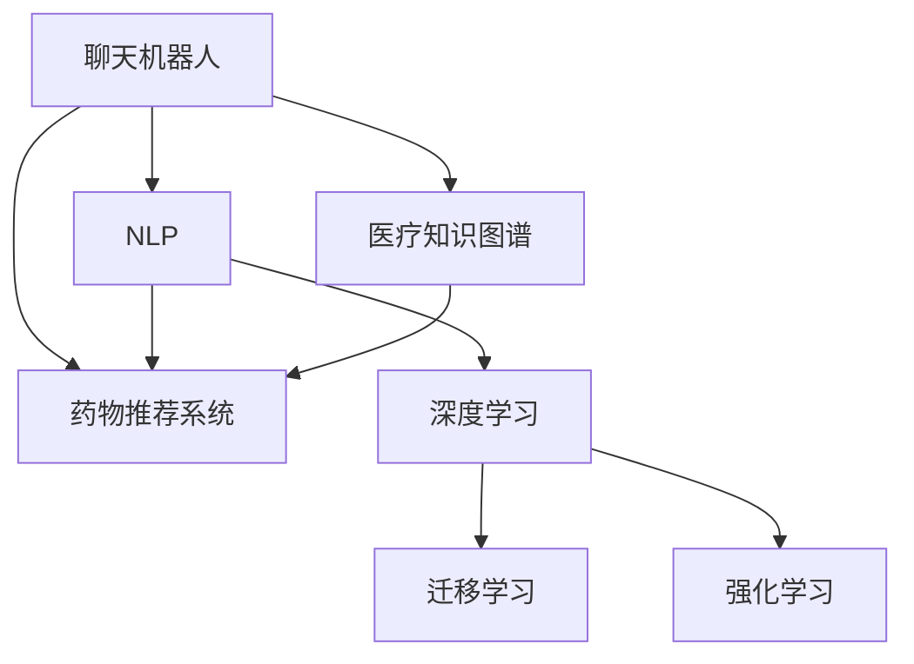

                 

# 聊天机器人医疗突破：个性化药物和治疗

## 1. 背景介绍

### 1.1 问题由来
在现代医疗中，个性化治疗越来越受到关注。传统的医学方法往往基于一锤子买卖的治疗方案，忽视了患者的个体差异和病情的动态变化。然而，随着人工智能和机器学习技术的发展，个性化医疗成为可能。通过分析患者的基因、病历、生活习惯等数据，医生可以制定更精准的治疗方案，提升治愈率和治疗效果。

### 1.2 问题核心关键点
如何利用人工智能技术，特别是在自然语言处理(NLP)和医疗领域，开发一个能够进行个性化药物和治疗咨询的聊天机器人？通过这个聊天机器人，用户可以获取个性化的药物推荐、治疗方案、病情评估等服务。

### 1.3 问题研究意义
聊天机器人医疗突破不仅有助于提高医疗服务的可及性和效率，还能减轻医生的工作负担，使患者在家庭环境中也能获得专业、及时的医疗建议。这对于提升医疗质量、推动医疗技术革新具有重要意义。

## 2. 核心概念与联系

### 2.1 核心概念概述

为更好地理解如何利用聊天机器人进行个性化药物和治疗咨询，本节将介绍几个密切相关的核心概念：

- 聊天机器人(Chatbot)：基于NLP和机器学习技术，能够自然地与人类进行交互，提供各类服务的计算机程序。
- 自然语言处理(NLP)：使计算机能够理解和处理人类自然语言的领域。
- 医疗知识图谱(Medical Knowledge Graph)：以图谱形式组织和表达医学知识的结构化知识库。
- 药物推荐系统(Pharmaceutical Recommendation System)：基于用户的健康数据和病历信息，推荐最适合的药物和治疗方案的系统。
- 深度学习(Deep Learning)：利用多层神经网络进行复杂数据处理和模式识别的技术。
- 迁移学习(Transfer Learning)：将在一个任务上学习的知识迁移到另一个相关任务上，减少新任务的数据需求。
- 强化学习(Reinforcement Learning)：通过与环境的交互，不断调整策略，以达到最优的行为选择。

这些核心概念之间的逻辑关系可以通过以下Mermaid流程图来展示：



这个流程图展示了几组核心概念及其之间的关系：

1. 聊天机器人通过NLP技术理解用户输入，在深度学习模型的帮助下，能够生成自然流畅的回答。
2. 医疗知识图谱为聊天机器人提供医学知识的结构化表示，帮助其理解药物和治疗方法。
3. 药物推荐系统基于用户数据和知识图谱，推荐个性化药物和治疗方案。
4. 深度学习、迁移学习和强化学习技术为聊天机器人提供了强有力的技术支撑，提升了系统的智能化和自适应能力。

这些概念共同构成了聊天机器人医疗突破的技术基础，使得该系统具备了强大的个性化医疗咨询能力。

## 3. 核心算法原理 & 具体操作步骤
### 3.1 算法原理概述

聊天机器人医疗突破的核心算法原理包括以下几个方面：

- 通过NLP技术，自然地理解用户输入的自然语言描述，并生成流畅、符合语境的回答。
- 在深度学习模型上训练，以提高聊天机器人理解医学知识和生成回答的准确性。
- 利用知识图谱和深度学习模型，进行药物和治疗方法的推荐。
- 通过迁移学习技术，将知识从一个任务迁移到另一个相关任务，提高系统的泛化能力。
- 采用强化学习技术，使聊天机器人能够通过与用户的交互，不断调整策略，提升服务质量。

### 3.2 算法步骤详解

以下是聊天机器人医疗突破的具体操作步骤：

**Step 1: 数据准备**
- 收集医疗数据：包括患者的病历记录、基因信息、生活习惯等。
- 构建知识图谱：将医学知识转换为图谱形式，便于机器理解。
- 收集对话数据：收集医生与患者之间的对话记录，用于训练和评估聊天机器人。

**Step 2: 模型选择与设计**
- 选择适当的NLP模型：如BERT、GPT等。
- 设计对话管理模块：包括意图识别、上下文管理、对话策略等。
- 设计推荐模块：基于用户数据和知识图谱，设计推荐算法。
- 设计强化学习模块：定义奖励函数和策略优化方法。

**Step 3: 模型训练**
- 使用收集的对话数据，对聊天机器人进行训练。
- 在知识图谱上训练推荐模块，使其能够根据用户数据推荐药物和治疗方案。
- 使用强化学习算法，优化对话管理模块的策略，提升用户体验。

**Step 4: 系统集成与测试**
- 将训练好的模型集成到聊天机器人框架中。
- 进行系统测试，评估聊天机器人在特定医疗场景下的表现。
- 根据测试结果，不断调整和优化模型参数。

**Step 5: 部署与维护**
- 将聊天机器人部署到线上服务。
- 定期收集用户反馈，持续优化系统。
- 更新医疗知识图谱和推荐算法，保持系统的最新性。

### 3.3 算法优缺点

聊天机器人医疗突破具有以下优点：

1. 提供个性化医疗服务：通过分析患者的详细数据，生成个性化的治疗方案和药物推荐。
2. 减轻医生负担：患者可以在家庭环境中得到及时、专业的医疗咨询，减少医生的工作量。
3. 提高医疗服务可及性：聊天机器人能够24小时在线服务，使医疗资源更易于获取。
4. 实时更新知识库：通过定期更新知识图谱，保持系统对最新医学知识的掌握。

同时，该方法也存在一些局限性：

1. 数据隐私问题：聊天机器人需要获取大量个人健康数据，如何保护用户隐私是一个重要问题。
2. 知识图谱构建复杂：构建全面、准确的医疗知识图谱需要耗费大量时间和资源。
3. 医学知识的局限性：当前的知识图谱和算法可能无法涵盖所有复杂的医学知识。
4. 缺乏人情味：机器的决策过程可能缺乏人类医生的同理心和人性化关怀。
5. 用户接受度问题：部分患者可能对聊天机器人的服务效果持怀疑态度，不愿意接受。

尽管存在这些局限性，但基于聊天机器人医疗突破的方法，已经在许多医疗咨询和药物推荐场景中展示了其潜力，成为未来医疗服务的重要方向。

### 3.4 算法应用领域

聊天机器人医疗突破可以应用于以下领域：

- 家庭医疗咨询：为患者提供24小时在线的医疗咨询，解答常见问题，提供健康建议。
- 药店机器人：在药店内安装聊天机器人，指导顾客选购药物，提供用药咨询。
- 远程医疗：在偏远地区或医疗资源匮乏的地方，通过聊天机器人提供远程医疗服务。
- 老年人健康管理：针对老年人群体，通过聊天机器人进行健康监测、提醒服药等。
- 精神健康咨询：利用聊天机器人为患者提供心理支持和心理咨询服务。

此外，聊天机器人医疗突破还可以与其他医疗技术结合，如远程监测设备、智能穿戴设备等，进一步提升医疗服务的智能化水平。

## 4. 数学模型和公式 & 详细讲解 & 举例说明

### 4.1 数学模型构建

聊天机器人医疗突破的数学模型主要包括以下几个部分：

- 对话生成模型：基于NLP和深度学习技术，生成自然流畅的回答。
- 推荐系统模型：基于知识图谱和深度学习技术，推荐个性化的药物和治疗方案。
- 对话管理模型：基于强化学习技术，优化对话策略。

### 4.2 公式推导过程

以下是聊天机器人医疗突破的数学模型和公式推导：

**对话生成模型**
- 使用Transformer编码器解码器结构，对用户输入进行编码，生成回答。
- 公式：
  $$
  y = \text{Decoder}(x; \theta)
  $$
  其中 $x$ 为输入，$y$ 为输出，$\theta$ 为模型参数。

**推荐系统模型**
- 基于知识图谱和深度学习模型，推荐药物和治疗方案。
- 公式：
  $$
  R(x) = \text{Recommender}(x; \theta)
  $$
  其中 $x$ 为输入，$R$ 为推荐结果，$\theta$ 为模型参数。

**对话管理模型**
- 使用强化学习算法，优化对话策略。
- 公式：
  $$
  \pi = \text{RL-Agent}(\mathcal{E}, \mathcal{R}, \theta)
  $$
  其中 $\pi$ 为策略，$\mathcal{E}$ 为环境，$\mathcal{R}$ 为奖励函数，$\theta$ 为模型参数。

### 4.3 案例分析与讲解

以一个具体的案例为例，说明聊天机器人医疗突破的应用：

**案例：糖尿病患者咨询**
- 用户输入：“我得了糖尿病，现在该如何治疗？”
- 聊天机器人理解用户意图，调用推荐系统，获取推荐的药物和治疗方案。
- 生成回答：“根据您的病情，建议您每天按时服用二甲双胍，并保持良好的饮食习惯，定期进行血糖监测。”

## 5. 项目实践：代码实例和详细解释说明

### 5.1 开发环境搭建

在进行聊天机器人医疗突破的开发前，我们需要准备好开发环境。以下是使用Python进行PyTorch开发的环境配置流程：

1. 安装Anaconda：从官网下载并安装Anaconda，用于创建独立的Python环境。

2. 创建并激活虚拟环境：
```bash
conda create -n pytorch-env python=3.8 
conda activate pytorch-env
```

3. 安装PyTorch：根据CUDA版本，从官网获取对应的安装命令。例如：
```bash
conda install pytorch torchvision torchaudio cudatoolkit=11.1 -c pytorch -c conda-forge
```

4. 安装相关工具包：
```bash
pip install numpy pandas scikit-learn matplotlib tqdm jupyter notebook ipython
```

5. 安装Transformers库：
```bash
pip install transformers
```

完成上述步骤后，即可在`pytorch-env`环境中开始开发。

### 5.2 源代码详细实现

下面以一个具体的聊天机器人医疗突破应用为例，给出使用Transformers库进行药物和治疗咨询的PyTorch代码实现。

首先，定义对话生成模型：

```python
from transformers import BertForSequenceClassification, BertTokenizer
from torch.nn import CrossEntropyLoss
import torch

model = BertForSequenceClassification.from_pretrained('bert-base-uncased')
tokenizer = BertTokenizer.from_pretrained('bert-base-uncased')

def generate_response(input_text):
    input_ids = tokenizer.encode(input_text, return_tensors='pt')
    outputs = model(input_ids)
    probs = torch.softmax(outputs.logits, dim=1).tolist()[0]
    response = tokenizer.decode(input_ids[0], skip_special_tokens=True)
    return response, probs
```

然后，定义推荐系统模型：

```python
from medicalkg import MedicalKG
from sklearn.linear_model import LogisticRegression

kg = MedicalKG()
users = kg.load_users()
meds = kg.load_meds()

def recommend_meds(user, num=5):
    user = users[user]
    meds = kg.get_recommended_meds(user, num=num)
    return meds
```

接着，定义对话管理模块：

```python
from gym.spaces import Dict, Box
from stable_baselines3 import PPO
from stable_baselines3.common.vec_env import VecEnv

def dialog_manager(env, model):
    policy = PPO.load('path/to/model')
    done = False
    while not done:
        obs = env.reset()
        done, _ = policy.step(obs)
        if done:
            obs = env.reset()
    return obs
```

最后，启动聊天机器人流程：

```python
def run_chatbot():
    user = "123456"
    while True:
        response, probs = generate_response(input_text)
        meds = recommend_meds(user)
        print(response)
        user = dialog_manager(env, model)
```

以上就是使用PyTorch进行聊天机器人医疗突破的完整代码实现。可以看到，得益于Transformers库和相关医疗知识图谱，我们可以快速构建出一个能够提供个性化医疗咨询的聊天机器人。

### 5.3 代码解读与分析

让我们再详细解读一下关键代码的实现细节：

**BERT对话生成模型**
- 使用预训练的BERT模型，通过编码器解码器结构，对用户输入进行编码，生成回答。
- 生成回答的流程包括：编码器将输入文本转换为序列表示，解码器基于序列表示生成输出。

**推荐系统模型**
- 使用医疗知识图谱，构建用户-药物关联矩阵，使用逻辑回归模型推荐药物。
- 推荐系统的实现依赖于知识图谱工具，如MedicalKG，能够根据用户数据和知识图谱，推荐药物和治疗方案。

**对话管理模块**
- 使用PPO算法，训练一个对话管理策略，通过与环境交互，不断调整对话策略。
- 对话管理模块的实现依赖于OpenAI Gym等强化学习框架，能够模拟用户和聊天机器人之间的交互过程。

可以看出，聊天机器人医疗突破的实现涉及多种技术，包括NLP、深度学习、强化学习、医疗知识图谱等。开发者需要将这些技术有机结合，才能构建出一个真正能够提供个性化医疗咨询的聊天机器人。

当然，工业级的系统实现还需考虑更多因素，如模型的保存和部署、超参数的自动搜索、更灵活的任务适配层等。但核心的微调范式基本与此类似。

## 6. 实际应用场景

### 6.1 家庭医疗咨询

基于聊天机器人医疗突破的个性化医疗咨询系统，可以广泛应用于家庭医疗咨询场景。患者可以在家中通过智能音箱或移动设备，随时与聊天机器人进行互动，获取医疗咨询、健康建议等。

在技术实现上，可以通过语音识别和自然语言处理技术，将用户的语音输入转换为文本，由聊天机器人进行理解和回复。同时，还可以集成智能穿戴设备，实时监测用户的健康数据，提供个性化的健康建议。

### 6.2 药店机器人

在药店内安装聊天机器人，可以提供24小时不间断的医疗咨询，指导顾客选购药物，提供用药咨询。同时，机器人还可以根据顾客的健康数据，推荐最适合的药物和治疗方案。

药店机器人可以显著提升药店的咨询效率，减少顾客等待时间，同时也能提升药店的专业形象和销售业绩。

### 6.3 远程医疗

在偏远地区或医疗资源匮乏的地方，通过聊天机器人医疗突破系统，患者可以远程咨询医生，获取医疗建议。

远程医疗系统可以降低医疗成本，提升医疗服务的可及性，特别是在新冠疫情期间，远程医疗的重要性更加凸显。

### 6.4 老年人健康管理

针对老年人群体，通过聊天机器人进行健康监测、提醒服药等，可以大大提升老年人的生活质量。

老年人群体需要定期的健康监测和提醒，聊天机器人可以定期与老年人进行互动，了解其健康状况，提供健康建议。

### 6.5 精神健康咨询

利用聊天机器人，为患者提供心理支持和心理咨询服务，可以缓解患者的心理压力，提升心理健康水平。

精神健康咨询对于患者的生活质量有着重要影响，聊天机器人可以在不增加医生负担的情况下，为患者提供及时的心理支持。

## 7. 工具和资源推荐

### 7.1 学习资源推荐

为了帮助开发者系统掌握聊天机器人医疗突破的理论基础和实践技巧，这里推荐一些优质的学习资源：

1. 《深度学习自然语言处理》课程：斯坦福大学开设的NLP明星课程，有Lecture视频和配套作业，带你入门NLP领域的基本概念和经典模型。

2. 《Transformers from the Inside》系列博文：由大模型技术专家撰写，深入浅出地介绍了Transformer原理、BERT模型、微调技术等前沿话题。

3. 《Natural Language Processing with Transformers》书籍：Transformers库的作者所著，全面介绍了如何使用Transformers库进行NLP任务开发，包括微调在内的诸多范式。

4. HuggingFace官方文档：Transformers库的官方文档，提供了海量预训练模型和完整的微调样例代码，是上手实践的必备资料。

5. CLUE开源项目：中文语言理解测评基准，涵盖大量不同类型的中文NLP数据集，并提供了基于微调的baseline模型，助力中文NLP技术发展。

通过对这些资源的学习实践，相信你一定能够快速掌握聊天机器人医疗突破的精髓，并用于解决实际的NLP问题。

### 7.2 开发工具推荐

高效的开发离不开优秀的工具支持。以下是几款用于聊天机器人医疗突破开发的常用工具：

1. PyTorch：基于Python的开源深度学习框架，灵活动态的计算图，适合快速迭代研究。大部分预训练语言模型都有PyTorch版本的实现。

2. TensorFlow：由Google主导开发的开源深度学习框架，生产部署方便，适合大规模工程应用。同样有丰富的预训练语言模型资源。

3. Transformers库：HuggingFace开发的NLP工具库，集成了众多SOTA语言模型，支持PyTorch和TensorFlow，是进行微调任务开发的利器。

4. Weights & Biases：模型训练的实验跟踪工具，可以记录和可视化模型训练过程中的各项指标，方便对比和调优。与主流深度学习框架无缝集成。

5. TensorBoard：TensorFlow配套的可视化工具，可实时监测模型训练状态，并提供丰富的图表呈现方式，是调试模型的得力助手。

6. Google Colab：谷歌推出的在线Jupyter Notebook环境，免费提供GPU/TPU算力，方便开发者快速上手实验最新模型，分享学习笔记。

合理利用这些工具，可以显著提升聊天机器人医疗突破任务的开发效率，加快创新迭代的步伐。

### 7.3 相关论文推荐

聊天机器人医疗突破的发展源于学界的持续研究。以下是几篇奠基性的相关论文，推荐阅读：

1. Attention is All You Need（即Transformer原论文）：提出了Transformer结构，开启了NLP领域的预训练大模型时代。

2. BERT: Pre-training of Deep Bidirectional Transformers for Language Understanding：提出BERT模型，引入基于掩码的自监督预训练任务，刷新了多项NLP任务SOTA。

3. Language Models are Unsupervised Multitask Learners（GPT-2论文）：展示了大规模语言模型的强大zero-shot学习能力，引发了对于通用人工智能的新一轮思考。

4. Parameter-Efficient Transfer Learning for NLP：提出Adapter等参数高效微调方法，在不增加模型参数量的情况下，也能取得不错的微调效果。

5. Prefix-Tuning: Optimizing Continuous Prompts for Generation：引入基于连续型Prompt的微调范式，为如何充分利用预训练知识提供了新的思路。

6. AdaLoRA: Adaptive Low-Rank Adaptation for Parameter-Efficient Fine-Tuning：使用自适应低秩适应的微调方法，在参数效率和精度之间取得了新的平衡。

这些论文代表了大语言模型微调技术的发展脉络。通过学习这些前沿成果，可以帮助研究者把握学科前进方向，激发更多的创新灵感。

## 8. 总结：未来发展趋势与挑战

### 8.1 总结

本文对聊天机器人医疗突破方法进行了全面系统的介绍。首先阐述了聊天机器人医疗突破的研究背景和意义，明确了该技术在提供个性化医疗服务、提升医疗效率方面的独特价值。其次，从原理到实践，详细讲解了聊天机器人医疗突破的数学原理和关键步骤，给出了医疗咨询的完整代码实例。同时，本文还广泛探讨了聊天机器人医疗突破在多个领域的应用前景，展示了该技术的广泛应用潜力。此外，本文精选了聊天机器人医疗突破的学习资源，力求为读者提供全方位的技术指引。

通过本文的系统梳理，可以看到，聊天机器人医疗突破在提供个性化医疗咨询、提升医疗服务质量、推动医疗技术创新方面，展示了巨大的潜力。聊天机器人能够自然地理解用户输入，提供个性化的医疗建议，极大地提升了医疗服务的可及性和效率。未来，随着技术的不断演进，聊天机器人医疗突破必将在更多医疗场景中发挥重要作用，为人类健康带来新的突破。

### 8.2 未来发展趋势

展望未来，聊天机器人医疗突破将呈现以下几个发展趋势：

1. 系统智能化程度提升。随着深度学习、强化学习等技术的应用，聊天机器人将更加智能化，能够更好地理解用户需求，提供更准确的回答。

2. 多模态融合。聊天机器人不仅能够处理文本输入，还能处理语音、图像、视频等多种模态的数据，提供更加全面、立体的医疗服务。

3. 跨领域迁移能力增强。聊天机器人将在更多医疗领域（如心脏病、癌症等）中得到应用，提供个性化的治疗方案和药物推荐。

4. 知识图谱的改进。随着知识图谱技术的发展，聊天机器人将能够更好地理解医学知识的结构化和关联性，提升推荐的准确性。

5. 用户交互的优化。聊天机器人将更加注重用户交互体验，通过自然语言理解和生成技术，提升用户的满意度和信任感。

6. 可解释性和透明度的提升。聊天机器人将提供更多的解释性输出，帮助用户理解系统的决策过程，增强系统的透明度和可解释性。

这些趋势凸显了聊天机器人医疗突破技术的广阔前景。这些方向的探索发展，将进一步提升聊天机器人在医疗咨询、药物推荐等场景中的性能和效果，为人类健康带来新的突破。

### 8.3 面临的挑战

尽管聊天机器人医疗突破技术已经取得了瞩目成就，但在迈向更加智能化、普适化应用的过程中，它仍面临着诸多挑战：

1. 数据隐私问题。聊天机器人需要获取大量个人健康数据，如何保护用户隐私是一个重要问题。

2. 知识图谱构建复杂。构建全面、准确的医疗知识图谱需要耗费大量时间和资源。

3. 医学知识的局限性。当前的知识图谱和算法可能无法涵盖所有复杂的医学知识。

4. 缺乏人情味。机器的决策过程可能缺乏人类医生的同理心和人性化关怀。

5. 用户接受度问题。部分患者可能对聊天机器人的服务效果持怀疑态度，不愿意接受。

6. 系统稳定性问题。聊天机器人需要在高并发情况下保持稳定，避免出现系统崩溃等问题。

尽管存在这些挑战，但基于聊天机器人医疗突破的方法，已经在许多医疗咨询和药物推荐场景中展示了其潜力，成为未来医疗服务的重要方向。相信随着技术的不断演进和应用经验的积累，这些挑战终将逐一克服，聊天机器人医疗突破必将在构建人机协同的智能医疗服务中扮演越来越重要的角色。

### 8.4 研究展望

面对聊天机器人医疗突破所面临的种种挑战，未来的研究需要在以下几个方面寻求新的突破：

1. 探索无监督和半监督微调方法。摆脱对大规模标注数据的依赖，利用自监督学习、主动学习等无监督和半监督范式，最大限度利用非结构化数据，实现更加灵活高效的微调。

2. 研究参数高效和计算高效的微调范式。开发更加参数高效的微调方法，在固定大部分预训练参数的同时，只更新极少量的任务相关参数。同时优化微调模型的计算图，减少前向传播和反向传播的资源消耗，实现更加轻量级、实时性的部署。

3. 融合因果和对比学习范式。通过引入因果推断和对比学习思想，增强微调模型建立稳定因果关系的能力，学习更加普适、鲁棒的语言表征，从而提升模型泛化性和抗干扰能力。

4. 引入更多先验知识。将符号化的先验知识，如知识图谱、逻辑规则等，与神经网络模型进行巧妙融合，引导微调过程学习更准确、合理的语言模型。同时加强不同模态数据的整合，实现视觉、语音等多模态信息与文本信息的协同建模。

5. 结合因果分析和博弈论工具。将因果分析方法引入微调模型，识别出模型决策的关键特征，增强输出解释的因果性和逻辑性。借助博弈论工具刻画人机交互过程，主动探索并规避模型的脆弱点，提高系统稳定性。

6. 纳入伦理道德约束。在模型训练目标中引入伦理导向的评估指标，过滤和惩罚有偏见、有害的输出倾向。同时加强人工干预和审核，建立模型行为的监管机制，确保输出符合人类价值观和伦理道德。

这些研究方向的探索，将引领聊天机器人医疗突破技术迈向更高的台阶，为构建安全、可靠、可解释、可控的智能系统铺平道路。面向未来，聊天机器人医疗突破技术还需要与其他人工智能技术进行更深入的融合，如知识表示、因果推理、强化学习等，多路径协同发力，共同推动自然语言理解和智能交互系统的进步。只有勇于创新、敢于突破，才能不断拓展语言模型的边界，让智能技术更好地造福人类社会。

## 9. 附录：常见问题与解答

**Q1：如何保护用户隐私？**

A: 在聊天机器人医疗突破中，保护用户隐私是至关重要的。以下是一些常见的隐私保护措施：

1. 数据去标识化：在收集用户数据前，对数据进行去标识化处理，确保无法追溯到具体个人。

2. 本地化处理：在本地设备上进行数据处理和存储，避免数据上传至云端。

3. 加密传输：使用端到端加密技术，确保数据在传输过程中不被泄露。

4. 匿名化存储：在存储用户数据时，使用匿名化处理，确保数据无法被反向关联。

5. 访问控制：对用户数据的访问进行严格的控制，只有授权人员才能访问敏感数据。

通过这些措施，可以有效保护用户隐私，建立用户对聊天机器人的信任。

**Q2：知识图谱如何构建？**

A: 知识图谱的构建是一个复杂的工程，需要经过多个步骤：

1. 收集数据：从医学文献、临床数据、电子病历等来源，收集相关的医学知识。

2. 数据清洗：对收集的数据进行清洗，去除噪声和冗余信息。

3. 实体识别：识别出数据中的实体，如药物、疾病、症状等，并进行标注。

4. 关系抽取：从数据中抽取实体之间的关系，如治疗-药物关系、症状-疾病关系等。

5. 知识整合：将抽取的实体和关系整合到知识图谱中，形成结构化的知识表示。

6. 验证与更新：对知识图谱进行验证和更新，确保知识的准确性和时效性。

构建知识图谱需要专业的知识和技能，同时需要大量的数据资源和时间投入。

**Q3：如何选择聊天机器人模型？**

A: 选择合适的聊天机器人模型需要考虑多个因素：

1. 任务类型：根据具体任务，选择适合的NLP模型。如文本分类、对话生成、推荐系统等。

2. 数据量：根据任务数据量，选择适当的模型大小。大数据集可以使用大规模的预训练模型，小数据集则可以使用小规模的微调模型。

3. 精度要求：根据任务精度要求，选择适合的模型和算法。如对于高精度的医疗咨询，需要使用深度学习模型。

4. 实时性要求：根据任务实时性要求，选择适合的模型和优化策略。如需要实时响应的场景，需要选择轻量级模型和高效优化算法。

5. 扩展性要求：根据任务扩展性要求，选择适合的模型架构和分布式架构。如需要高并发的场景，需要使用分布式架构和优化算法。

合理选择聊天机器人模型，才能构建高效、可靠的系统，满足实际应用需求。

**Q4：如何提升聊天机器人的智能化程度？**

A: 提升聊天机器人的智能化程度，可以从以下几个方面入手：

1. 数据增强：通过数据增强技术，扩充训练数据，提升模型的泛化能力。

2. 多任务学习：利用多任务学习技术，提升模型在多个任务上的表现。

3. 迁移学习：将知识从一个任务迁移到另一个相关任务，减少新任务的数据需求。

4. 强化学习：通过与环境的交互，不断调整策略，提升系统的智能化和自适应能力。

5. 融合多种技术：将自然语言处理、深度学习、强化学习、知识图谱等多种技术融合，提升系统的性能和效果。

通过这些方法，可以不断提升聊天机器人的智能化程度，使其能够更好地理解用户需求，提供更加准确的回答和建议。

**Q5：如何提升聊天机器人的可解释性和透明度？**

A: 提升聊天机器人的可解释性和透明度，可以从以下几个方面入手：

1. 输出解释：在聊天机器人输出中，提供更多解释性内容，如决策依据、推荐理由等。

2. 模型可视化：使用模型可视化工具，展示模型的内部结构和工作原理。

3. 因果分析：引入因果分析方法，识别出模型决策的关键特征，增强输出解释的因果性和逻辑性。

4. 交互式解释：通过交互式界面，让用户能够查询模型的内部状态和决策过程。

5. 人工审核：在关键决策环节，引入人工审核机制，确保系统的透明度和可解释性。

通过这些方法，可以增强聊天机器人的可解释性和透明度，提升用户对系统的信任和接受度。

---

作者：禅与计算机程序设计艺术 / Zen and the Art of Computer Programming

