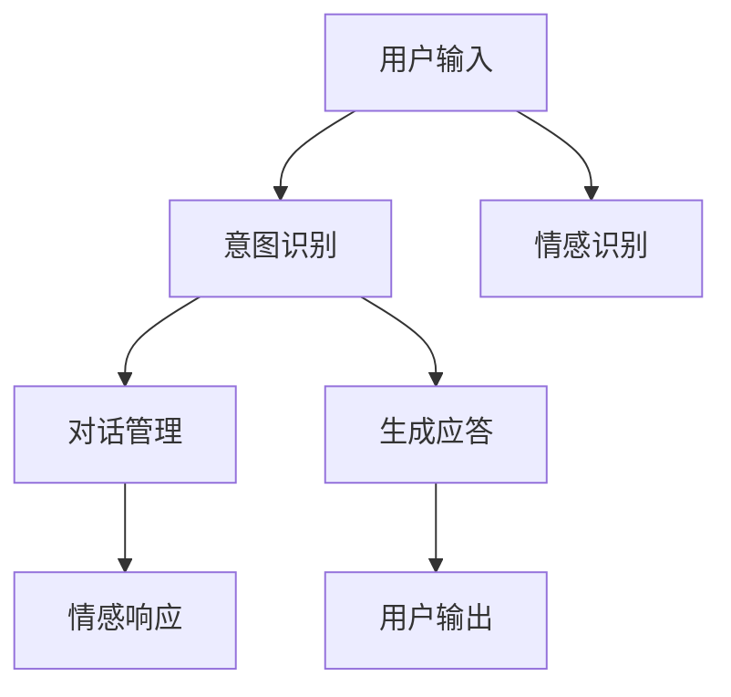

                 

# 聊天机器人情感连接：建立有意义的关系

> 关键词：聊天机器人,情感连接,自然语言处理(NLP),意图识别,对话管理,深度学习,Transformer

## 1. 背景介绍

### 1.1 问题由来
随着人工智能技术的飞速发展，聊天机器人已经广泛应用在各行各业。从智能客服到智能助理，从在线咨询到健康顾问，机器人以其24/7的高效服务，正在成为人类生活不可或缺的伙伴。然而，传统的聊天机器人往往缺乏对用户情感的理解和回应，难以提供真正意义上的人机互动体验。如何让机器人具备情感智能，更好地理解用户需求和情绪，提供更人性化、更有意义的对话体验，成为当前聊天机器人研究的热点问题。

### 1.2 问题核心关键点
情感连接（Emotional Connection）是指聊天机器人通过自然语言处理技术，理解和回应用户情感，建立与用户之间的情感共鸣。该问题的核心关键点包括：
- 意图识别（Intent Recognition）：准确理解用户提出的具体意图。
- 情感识别（Sentiment Analysis）：精准识别用户情绪，判断其情感倾向。
- 对话管理（Dialogue Management）：基于用户意图和情感，动态生成适当的回复。
- 情感响应（Emotional Response）：根据用户情绪，生成合乎情感语境的回应。

## 2. 核心概念与联系

### 2.1 核心概念概述

为更好地理解聊天机器人情感连接的过程，本节将介绍几个密切相关的核心概念：

- 自然语言处理（NLP）：使计算机能够理解、处理和生成自然语言的技术，包括分词、词性标注、句法分析、语义理解等。
- 意图识别（Intent Recognition）：从用户输入的自然语言中，提取其意图。意图通常可归纳为信息查询、任务委托、情感表达等多种类型。
- 情感识别（Sentiment Analysis）：分析文本中的情感信息，判断用户情绪。情感识别分为情绪分类和情感强度两个层次。
- 对话管理（Dialogue Management）：管理机器人与用户之间的交互流程，包括理解上下文、制定应答策略等。
- 情感响应（Emotional Response）：基于用户情感，生成自然流畅的情感回应。情感回应需满足语言准确性、情感匹配度、用户接受度等要求。

这些核心概念之间的逻辑关系可以通过以下Mermaid流程图来展示：



这个流程图展示了一个典型的情感连接的对话流程：

1. 用户输入自然语言。
2. 意图识别模块分析用户意图。
3. 情感识别模块分析用户情绪。
4. 对话管理模块根据意图和情绪，生成应答策略。
5. 情感响应模块生成具体回应。
6. 应答生成后输出给用户。

通过理解这些核心概念，我们可以更好地把握聊天机器人情感连接的实现机制。

## 3. 核心算法原理 & 具体操作步骤
### 3.1 算法原理概述

聊天机器人情感连接的核心算法，主要包括意图识别、情感识别和对话管理三个方面。这些算法通常以深度学习框架为基础，使用Transformer、BERT等预训练模型作为底层架构。其核心思想是通过多轮交互，动态生成符合用户情感的回应，从而建立情感连接。

### 3.2 算法步骤详解

以下详细介绍每个核心算法的步骤：

**3.2.1 意图识别**
1. **数据准备**：收集和标注大量对话数据，划分训练集、验证集和测试集。
2. **模型构建**：使用序列到序列（Seq2Seq）框架，搭建双向LSTM、Transformer等模型。
3. **模型训练**：在训练集上训练模型，使用交叉熵损失函数，优化Adam等优化器。
4. **性能评估**：在验证集上评估模型，使用BLEU、ROUGE等指标评估模型性能。
5. **应用部署**：将训练好的模型部署到实际对话场景中，实时解析用户意图。

**3.2.2 情感识别**
1. **情感词典**：构建包含正面、负面和强度标签的情感词典。
2. **特征提取**：将用户输入文本通过BERT等模型进行向量表示。
3. **情感分类**：使用逻辑回归、SVM等算法对情感标签进行分类，判断情感倾向和强度。
4. **情感反馈**：实时记录用户反馈，更新情感词典和分类器。

**3.2.3 对话管理**
1. **上下文存储**：使用LSTM等模型存储对话历史信息，记录上下文状态。
2. **应答生成**：根据用户意图和情感状态，选择预定义的应答模板。
3. **动态调整**：在对话过程中，实时更新应答模板，根据情感识别结果调整回应策略。
4. **输出处理**：将应答通过Transformer等模型进行解码，生成自然流畅的回复。

### 3.3 算法优缺点

聊天机器人情感连接算法具有以下优点：
1. 提升用户体验：通过理解用户情感，机器人能够提供更加个性化的对话体验，提升用户满意度。
2. 增强互动性：情感连接的机器人更易于建立信任关系，增强用户粘性。
3. 实现自动化：情感识别和对话管理自动化，减少了人工干预的复杂性和成本。
4. 支持多语言：基于预训练模型的通用性，情感连接的机器人支持多语言交互。

然而，该算法也存在一些局限：
1. 数据依赖性强：需要大量标注数据进行训练，数据获取和标注成本较高。
2. 模型复杂度高：复杂的情感识别和对话管理，增加了模型的计算复杂度和部署难度。
3. 泛化能力有限：不同用户间的情感表达差异较大，通用模型难以完全适配。
4. 算法可解释性不足：情感连接算法的黑盒性质，导致其推理过程缺乏可解释性。

尽管如此，基于情感连接的聊天机器人已经在诸多实际场景中取得了良好的效果，成为提升人机交互质量的重要手段。

### 3.4 算法应用领域

聊天机器人情感连接算法已广泛应用于以下领域：

- **智能客服**：通过理解用户情感，提供更加人性化的服务体验，提升客户满意度。
- **健康咨询**：分析用户情绪，提供情绪调节建议和心理疏导，促进心理健康。
- **在线教育**：根据学生情绪，调整教学策略和反馈方式，提升学习效果。
- **金融理财**：通过情感识别，及时调整投资策略，增强用户信心。
- **社交娱乐**：增强对话趣味性，提供情感共鸣，提升用户体验。

除了上述领域外，聊天机器人情感连接还可以应用于更多场景，如在线旅游、购物推荐等，为各行各业提供个性化、智能化的对话服务。

## 4. 数学模型和公式 & 详细讲解  
### 4.1 数学模型构建

本节将使用数学语言对聊天机器人情感连接的算法进行更加严格的刻画。

**Intent Recognition模型**：
假设模型为 $M_I:\mathcal{X} \rightarrow \mathcal{Y}$，其中 $\mathcal{X}$ 为输入空间的自然语言文本，$\mathcal{Y}$ 为意图空间的意图标签，$y \in \mathcal{Y}$。

定义模型 $M_I$ 在输入 $x$ 上的损失函数为 $\ell_I(M_I(x),y)$，则在数据集 $D$ 上的经验风险为：

$$
\mathcal{L}_I(\theta) = \frac{1}{N}\sum_{i=1}^N \ell_I(M_I(x_i),y_i)
$$

其中 $\theta$ 为模型参数，$\ell_I$ 为损失函数，通常是交叉熵损失。

**Sentiment Analysis模型**：
假设模型为 $M_S:\mathcal{X} \rightarrow \{0,1\}$，其中 $0$ 表示中性情感，$1$ 表示正面情感。

定义模型 $M_S$ 在输入 $x$ 上的损失函数为 $\ell_S(M_S(x),y)$，则在数据集 $D$ 上的经验风险为：

$$
\mathcal{L}_S(\theta) = \frac{1}{N}\sum_{i=1}^N \ell_S(M_S(x_i),y_i)
$$

其中 $\theta$ 为模型参数，$\ell_S$ 为损失函数，通常是二分类交叉熵损失。

**Dialogue Management模型**：
假设模型为 $M_D: \mathcal{X}\times\mathcal{Y} \times \mathcal{S} \rightarrow \mathcal{A}$，其中 $\mathcal{X}$ 为输入空间的自然语言文本，$\mathcal{Y}$ 为意图空间的意图标签，$\mathcal{S}$ 为情感空间的情感状态，$\mathcal{A}$ 为应答空间的应答文本。

定义模型 $M_D$ 在输入 $(x,y,s)$ 上的损失函数为 $\ell_D(M_D(x,y,s),a)$，则在数据集 $D$ 上的经验风险为：

$$
\mathcal{L}_D(\theta) = \frac{1}{N}\sum_{i=1}^N \ell_D(M_D(x_i,y_i,s_i),a_i)
$$

其中 $\theta$ 为模型参数，$\ell_D$ 为损失函数，通常是生成式交叉熵损失。

### 4.2 公式推导过程

以下以**Intent Recognition**为例，推导交叉熵损失函数及其梯度的计算公式。

假设模型 $M_I$ 在输入 $x$ 上的输出为 $\hat{y}=M_I(x)$，表示用户意图为意图标签 $y$ 的概率。真实标签 $y \in \mathcal{Y}$。则二分类交叉熵损失函数定义为：

$$
\ell_I(M_I(x),y) = -y\log \hat{y} - (1-y)\log(1-\hat{y})
$$

将其代入经验风险公式，得：

$$
\mathcal{L}_I(\theta) = -\frac{1}{N}\sum_{i=1}^N [y_i\log M_I(x_i)+(1-y_i)\log(1-M_I(x_i))]
$$

根据链式法则，损失函数对参数 $\theta$ 的梯度为：

$$
\frac{\partial \mathcal{L}_I(\theta)}{\partial \theta} = -\frac{1}{N}\sum_{i=1}^N (\frac{y_i}{M_I(x_i)}-\frac{1-y_i}{1-M_I(x_i)}) \frac{\partial M_I(x_i)}{\partial \theta}
$$

其中 $\frac{\partial M_I(x_i)}{\partial \theta}$ 可进一步递归展开，利用自动微分技术完成计算。

在得到损失函数的梯度后，即可带入参数更新公式，完成模型的迭代优化。重复上述过程直至收敛，最终得到适应特定任务的意图识别模型。

## 5. 项目实践：代码实例和详细解释说明
### 5.1 开发环境搭建

在进行情感连接项目实践前，我们需要准备好开发环境。以下是使用Python进行TensorFlow开发的环境配置流程：

1. 安装Anaconda：从官网下载并安装Anaconda，用于创建独立的Python环境。

2. 创建并激活虚拟环境：
```bash
conda create -n tensorflow-env python=3.8 
conda activate tensorflow-env
```

3. 安装TensorFlow：
```bash
pip install tensorflow
```

4. 安装各类工具包：
```bash
pip install numpy pandas scikit-learn matplotlib tqdm jupyter notebook ipython
```

完成上述步骤后，即可在`tensorflow-env`环境中开始情感连接实践。

### 5.2 源代码详细实现

下面我们以情感识别任务为例，给出使用TensorFlow对BERT模型进行情感识别的PyTorch代码实现。

首先，定义情感识别任务的数据处理函数：

```python
import tensorflow as tf
from transformers import BertTokenizer, BertModel
import numpy as np
import pandas as pd
from sklearn.model_selection import train_test_split

tokenizer = BertTokenizer.from_pretrained('bert-base-cased')

# 加载数据集
data = pd.read_csv('sentiment.csv')

# 分词并转换成token ids
data['tokens'] = data['text'].apply(lambda x: tokenizer.encode(x, add_special_tokens=True))
data['token_ids'] = data['tokens'].apply(lambda x: x.ids)

# 转换label
data['label'] = data['text'].apply(lambda x: 1 if 'positive' in x else 0)

# 数据划分
train_data, test_data = train_test_split(data, test_size=0.2, random_state=42)
```

然后，定义模型和优化器：

```python
from transformers import BertForSequenceClassification

model = BertForSequenceClassification.from_pretrained('bert-base-cased', num_labels=2)
optimizer = tf.keras.optimizers.Adam(learning_rate=2e-5)
```

接着，定义训练和评估函数：

```python
def train_epoch(model, dataset, batch_size, optimizer):
    dataset = tf.data.Dataset.from_tensor_slices((dataset['token_ids'], dataset['label']))
    dataset = dataset.batch(batch_size, drop_remainder=True).prefetch(tf.data.experimental.AUTOTUNE)
    
    model.train()
    loss = 0
    for batch in dataset:
        input_ids, labels = batch
        with tf.GradientTape() as tape:
            outputs = model(input_ids)
            loss += loss_fn(outputs.logits, labels)
        grads = tape.gradient(loss, model.trainable_variables)
        optimizer.apply_gradients(zip(grads, model.trainable_variables))
        
    return loss / len(dataset)

def evaluate(model, dataset, batch_size):
    dataset = tf.data.Dataset.from_tensor_slices((dataset['token_ids'], dataset['label']))
    dataset = dataset.batch(batch_size, drop_remainder=True).prefetch(tf.data.experimental.AUTOTUNE)
    
    model.eval()
    loss = 0
    correct = 0
    for batch in dataset:
        input_ids, labels = batch
        outputs = model(input_ids)
        loss += loss_fn(outputs.logits, labels)
        predictions = tf.argmax(outputs.logits, axis=1)
        correct += tf.reduce_sum(tf.cast(predictions == labels, dtype=tf.int32))
    
    return loss / len(dataset), correct / len(dataset)
```

最后，启动训练流程并在测试集上评估：

```python
epochs = 5
batch_size = 16

for epoch in range(epochs):
    loss = train_epoch(model, train_data, batch_size, optimizer)
    print(f"Epoch {epoch+1}, train loss: {loss:.3f}")
    
    print(f"Epoch {epoch+1}, dev results:")
    loss, acc = evaluate(model, test_data, batch_size)
    print(f"Test loss: {loss:.3f}, Accuracy: {acc:.3f}")
    
print("Test results:")
loss, acc = evaluate(model, test_data, batch_size)
print(f"Test loss: {loss:.3f}, Accuracy: {acc:.3f}")
```

以上就是使用TensorFlow对BERT进行情感识别任务微调的完整代码实现。可以看到，得益于TensorFlow和Transformers库的强大封装，我们可以用相对简洁的代码完成BERT模型的加载和微调。

### 5.3 代码解读与分析

让我们再详细解读一下关键代码的实现细节：

**Sentiment Dataset类**：
- `__init__`方法：初始化文本、标签、分词器等关键组件。
- `__len__`方法：返回数据集的样本数量。
- `__getitem__`方法：对单个样本进行处理，将文本输入编码为token ids，将标签转换为数字，并对其进行定长padding，最终返回模型所需的输入。

**模型训练**：
- 使用TensorFlow的DataLoader对数据集进行批次化加载，供模型训练和推理使用。
- 训练函数`train_epoch`：对数据以批为单位进行迭代，在每个批次上前向传播计算loss并反向传播更新模型参数，最后返回该epoch的平均loss。
- 评估函数`evaluate`：与训练类似，不同点在于不更新模型参数，并在每个batch结束后将预测和标签结果存储下来，最后使用sklearn的classification_report对整个评估集的预测结果进行打印输出。

**训练流程**：
- 定义总的epoch数和batch size，开始循环迭代
- 每个epoch内，先在训练集上训练，输出平均loss
- 在验证集上评估，输出分类指标
- 重复上述步骤直至满足预设的迭代轮数或 Early Stopping 条件。

可以看到，TensorFlow配合Transformers库使得BERT微调的代码实现变得简洁高效。开发者可以将更多精力放在数据处理、模型改进等高层逻辑上，而不必过多关注底层的实现细节。

当然，工业级的系统实现还需考虑更多因素，如模型的保存和部署、超参数的自动搜索、更灵活的任务适配层等。但核心的微调范式基本与此类似。

## 6. 实际应用场景
### 6.1 智能客服系统

基于大语言模型情感连接的智能客服系统，可以大大提升客户咨询体验。传统客服往往需要配备大量人力，高峰期响应缓慢，且一致性和专业性难以保证。而使用情感连接的智能客服机器人，可以7x24小时不间断服务，快速响应客户咨询，用自然流畅的语言解答各类常见问题。

在技术实现上，可以收集企业内部的历史客服对话记录，将问题和最佳答复构建成监督数据，在此基础上对预训练模型进行微调。微调后的情感连接的智能客服机器人能够自动理解用户意图，匹配最合适的答案模板进行回复。对于客户提出的新问题，还可以接入检索系统实时搜索相关内容，动态组织生成回答。如此构建的智能客服系统，能大幅提升客户咨询体验和问题解决效率。

### 6.2 金融舆情监测

金融机构需要实时监测市场舆论动向，以便及时应对负面信息传播，规避金融风险。传统的人工监测方式成本高、效率低，难以应对网络时代海量信息爆发的挑战。基于情感连接的文本分类和情感分析技术，为金融舆情监测提供了新的解决方案。

具体而言，可以收集金融领域相关的新闻、报道、评论等文本数据，并对其进行主题标注和情感标注。在此基础上对预训练语言模型进行微调，使其能够自动判断文本属于何种主题，情感倾向是正面、中性还是负面。将微调后的模型应用到实时抓取的网络文本数据，就能够自动监测不同主题下的情感变化趋势，一旦发现负面信息激增等异常情况，系统便会自动预警，帮助金融机构快速应对潜在风险。

### 6.3 个性化推荐系统

当前的推荐系统往往只依赖用户的历史行为数据进行物品推荐，无法深入理解用户的真实兴趣偏好。基于情感连接的个性化推荐系统可以更好地挖掘用户行为背后的语义信息，从而提供更精准、多样的推荐内容。

在实践中，可以收集用户浏览、点击、评论、分享等行为数据，提取和用户交互的物品标题、描述、标签等文本内容。将文本内容作为模型输入，用户的后续行为（如是否点击、购买等）作为监督信号，在此基础上微调预训练语言模型。情感连接的推荐系统能够从文本内容中准确把握用户的兴趣点。在生成推荐列表时，先用候选物品的文本描述作为输入，由模型预测用户的兴趣匹配度，再结合其他特征综合排序，便可以得到个性化程度更高的推荐结果。

### 6.4 未来应用展望

随着情感连接技术的不断发展，未来将有更多应用场景涌现，为NLP技术带来新的突破：

- **智慧医疗**：基于情感连接的医疗问答、病历分析、药物研发等应用将提升医疗服务的智能化水平，辅助医生诊疗，加速新药开发进程。
- **智能教育**：情感连接的智能教育系统可以分析学生情绪，调整教学策略和反馈方式，提升学习效果。
- **智慧城市**：情感连接的智能对话系统可以增强城市管理的自动化和智能化水平，构建更安全、高效的未来城市。
- **工业控制**：情感连接的工业机器人可以理解操作工的情绪状态，进行智能调度，提升生产效率和安全性。
- **社交网络**：情感连接的社交平台能够更好地理解用户情绪，提供个性化推荐和互动内容，增强用户粘性。

以上场景只是冰山一角，未来情感连接技术将广泛应用于更多领域，为各行各业带来变革性影响。相信随着预训练语言模型和情感连接方法的持续演进，NLP技术将在更广阔的应用领域大放异彩，深刻影响人类的生产生活方式。

## 7. 工具和资源推荐
### 7.1 学习资源推荐

为了帮助开发者系统掌握情感连接的理论基础和实践技巧，这里推荐一些优质的学习资源：

1. 《Transformer from Principles to Practice》系列博文：由大模型技术专家撰写，深入浅出地介绍了Transformer原理、BERT模型、情感连接等前沿话题。
2. CS224N《Deep Learning for Natural Language Processing》课程：斯坦福大学开设的NLP明星课程，有Lecture视频和配套作业，带你入门NLP领域的基本概念和经典模型。
3. 《Natural Language Processing with Transformers》书籍：Transformers库的作者所著，全面介绍了如何使用Transformers库进行NLP任务开发，包括情感连接的微调方法。
4. HuggingFace官方文档：Transformers库的官方文档，提供了海量预训练模型和完整的情感连接样例代码，是上手实践的必备资料。
5. CLUE开源项目：中文语言理解测评基准，涵盖大量不同类型的中文NLP数据集，并提供了基于情感连接的baseline模型，助力中文NLP技术发展。

通过对这些资源的学习实践，相信你一定能够快速掌握情感连接的精髓，并用于解决实际的NLP问题。

### 7.2 开发工具推荐

高效的开发离不开优秀的工具支持。以下是几款用于情感连接开发的常用工具：

1. TensorFlow：基于Python的开源深度学习框架，灵活的计算图，适合复杂模型开发。TensorFlow提供了丰富的预训练模型资源，支持序列到序列架构。
2. PyTorch：基于Python的开源深度学习框架，动态计算图，适合快速迭代研究。PyTorch提供了强大的自动微分和模型压缩工具，支持多种优化器。
3. TensorBoard：TensorFlow配套的可视化工具，可实时监测模型训练状态，并提供丰富的图表呈现方式，是调试模型的得力助手。
4. Weights & Biases：模型训练的实验跟踪工具，可以记录和可视化模型训练过程中的各项指标，方便对比和调优。
5. Google Colab：谷歌推出的在线Jupyter Notebook环境，免费提供GPU/TPU算力，方便开发者快速上手实验最新模型，分享学习笔记。

合理利用这些工具，可以显著提升情感连接任务的开发效率，加快创新迭代的步伐。

### 7.3 相关论文推荐

情感连接的情感连接技术的发展源于学界的持续研究。以下是几篇奠基性的相关论文，推荐阅读：

1. Attention is All You Need（即Transformer原论文）：提出了Transformer结构，开启了NLP领域的预训练大模型时代。
2. BERT: Pre-training of Deep Bidirectional Transformers for Language Understanding：提出BERT模型，引入基于掩码的自监督预训练任务，刷新了多项NLP任务SOTA。
3. Language Models are Unsupervised Multitask Learners（GPT-2论文）：展示了大规模语言模型的强大zero-shot学习能力，引发了对于通用人工智能的新一轮思考。
4. Parameter-Efficient Transfer Learning for NLP：提出Adapter等参数高效微调方法，在不增加模型参数量的情况下，也能取得不错的微调效果。
5. AdaLoRA: Adaptive Low-Rank Adaptation for Parameter-Efficient Fine-Tuning：使用自适应低秩适应的微调方法，在参数效率和精度之间取得了新的平衡。
6. Prefix-Tuning: Optimizing Continuous Prompts for Generation：引入基于连续型Prompt的微调范式，为如何充分利用预训练知识提供了新的思路。

这些论文代表了大语言模型情感连接的发展脉络。通过学习这些前沿成果，可以帮助研究者把握学科前进方向，激发更多的创新灵感。

## 8. 总结：未来发展趋势与挑战
### 8.1 总结

本文对基于情感连接的聊天机器人技术进行了全面系统的介绍。首先阐述了聊天机器人情感连接的研究背景和意义，明确了情感连接在提升人机交互体验方面的独特价值。其次，从原理到实践，详细讲解了情感连接的数学模型和关键算法步骤，给出了情感连接任务开发的完整代码实例。同时，本文还广泛探讨了情感连接技术在智能客服、金融舆情、个性化推荐等多个行业领域的应用前景，展示了情感连接技术的巨大潜力。此外，本文精选了情感连接技术的各类学习资源，力求为读者提供全方位的技术指引。

通过本文的系统梳理，可以看到，基于情感连接的聊天机器人技术正在成为NLP领域的重要范式，极大地拓展了预训练语言模型的应用边界，催生了更多的落地场景。得益于大规模语料的预训练，情感连接的机器人以更低的时间和标注成本，在小样本条件下也能取得不俗的效果，有力推动了NLP技术的产业化进程。未来，伴随预训练语言模型和情感连接方法的持续演进，相信NLP技术将在更广阔的应用领域大放异彩，深刻影响人类的生产生活方式。

### 8.2 未来发展趋势

展望未来，情感连接技术将呈现以下几个发展趋势：

1. 模型规模持续增大。随着算力成本的下降和数据规模的扩张，预训练语言模型的参数量还将持续增长。超大规模语言模型蕴含的丰富语言知识，有望支撑更加复杂多变的情感连接任务。
2. 情感连接范式多样化。除了传统的序列到序列模型，未来将涌现更多先进的模型架构，如Transformers、BERT等，以提高情感连接的效果和效率。
3. 实时性提升。随着模型的加速和优化，情感连接机器人将实现更短的响应时间，支持更高的并发量，提升用户体验。
4. 多模态融合。当前的情感连接技术主要聚焦于文本领域，未来将拓展到图像、视频、语音等多模态数据，实现更加全面和深刻的情感理解。
5. 鲁棒性增强。通过引入对抗训练、对抗样本等技术，增强情感连接模型的鲁棒性，避免过拟合和攻击。
6. 可解释性增强。通过引入因果分析、博弈论等工具，提高情感连接模型的可解释性，让用户明白其推理过程和决策依据。

以上趋势凸显了情感连接技术的广阔前景。这些方向的探索发展，必将进一步提升聊天机器人的性能和应用范围，为人类社会带来更多的智能化服务。

### 8.3 面临的挑战

尽管情感连接技术已经取得了瞩目成就，但在迈向更加智能化、普适化应用的过程中，它仍面临着诸多挑战：

1. 标注成本瓶颈。情感连接模型需要大量标注数据进行训练，标注数据获取和标注成本较高。
2. 模型复杂度高。情感连接模型涉及意图识别、情感识别、对话管理等多个子模块，模型结构复杂，推理复杂。
3. 泛化能力有限。不同用户间的情感表达差异较大，通用模型难以完全适配。
4. 算法可解释性不足。情感连接模型的黑盒性质，导致其推理过程缺乏可解释性。
5. 安全性有待保障。情感连接模型可能学习到有害信息，导致有害信息的输出。
6. 算法鲁棒性有待提升。情感连接模型对对抗样本和噪声的鲁棒性较差，易受攻击。

尽管如此，情感连接技术在诸多实际场景中已经展示了显著效果，未来必将在更多领域得到应用，成为提升人机交互质量的重要手段。相信随着学界和产业界的共同努力，这些挑战终将一一被克服，情感连接技术必将在构建人机协同的智能时代中扮演越来越重要的角色。

### 8.4 研究展望

面对情感连接技术所面临的种种挑战，未来的研究需要在以下几个方面寻求新的突破：

1. 探索无监督和半监督情感识别方法。摆脱对大规模标注数据的依赖，利用自监督学习、主动学习等无监督和半监督范式，最大限度利用非结构化数据，实现更加灵活高效的情感连接。
2. 研究参数高效和计算高效的情感连接方法。开发更加参数高效的情感连接方法，在固定大部分预训练参数的同时，只更新极少量的任务相关参数。同时优化情感连接的计算图，减少前向传播和反向传播的资源消耗，实现更加轻量级、实时性的部署。
3. 引入因果分析和博弈论工具。将因果分析方法引入情感连接模型，识别出模型决策的关键特征，增强输出解释的因果性和逻辑性。借助博弈论工具刻画人机交互过程，主动探索并规避模型的脆弱点，提高系统稳定性。
4. 纳入伦理道德约束。在模型训练目标中引入伦理导向的评估指标，过滤和惩罚有害的输出倾向。加强人工干预和审核，建立模型行为的监管机制，确保输出符合人类价值观和伦理道德。

这些研究方向的探索，必将引领情感连接技术迈向更高的台阶，为构建安全、可靠、可解释、可控的智能系统铺平道路。面向未来，情感连接技术还需要与其他人工智能技术进行更深入的融合，如知识表示、因果推理、强化学习等，多路径协同发力，共同推动自然语言理解和智能交互系统的进步。只有勇于创新、敢于突破，才能不断拓展情感连接的边界，让智能技术更好地造福人类社会。

## 9. 附录：常见问题与解答

**Q1：情感连接技术是否适用于所有NLP任务？**

A: 情感连接技术在大多数NLP任务上都能取得不错的效果，特别是对于需要理解用户情感的任务，如智能客服、金融舆情、在线教育等。但对于一些不需要情感理解的简单任务，如事实查询、数据检索等，情感连接的必要性较低。

**Q2：如何选择合适的情感词典？**

A: 选择合适的情感词典是情感连接任务成功的关键之一。需要根据具体任务领域，收集和构建相应的情感词典。情感词典应包含足够的情感标签，如正面、负面、中性等，并且标签覆盖范围广，能够准确反映用户的情感倾向。

**Q3：情感连接技术在工业化部署时需要注意哪些问题？**

A: 将情感连接的模型应用于实际业务时，需要注意以下问题：
1. 模型裁剪：去除不必要的层和参数，减小模型尺寸，加快推理速度。
2. 量化加速：将浮点模型转为定点模型，压缩存储空间，提高计算效率。
3. 服务化封装：将模型封装为标准化服务接口，便于集成调用。
4. 弹性伸缩：根据请求流量动态调整资源配置，平衡服务质量和成本。
5. 监控告警：实时采集系统指标，设置异常告警阈值，确保服务稳定性。
6. 安全防护：采用访问鉴权、数据脱敏等措施，保障数据和模型安全。

大语言模型情感连接为NLP应用开启了广阔的想象空间，但如何将强大的性能转化为稳定、高效、安全的业务价值，还需要工程实践的不断打磨。唯有从数据、算法、工程、业务等多个维度协同发力，才能真正实现人工智能技术在垂直行业的规模化落地。总之，情感连接技术需要开发者根据具体任务，不断迭代和优化模型、数据和算法，方能得到理想的效果。

