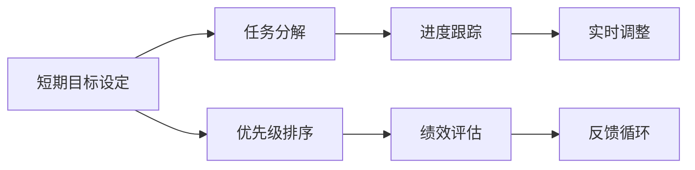
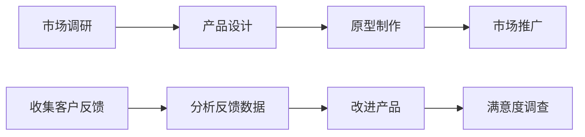

                 

# 聚焦要事:双目标清单的正确用法

> 关键词：双目标清单,任务管理,优先级,绩效优化,目标分解

## 1. 背景介绍

在快节奏的现代生活中，个人和企业都在追求更高效的时间管理方式。如何合理规划时间、资源和任务，使其达到最优配置，成为了一门重要的学问。双目标清单法（Dual-Goal Checklist Method）作为一种系统性的任务管理工具，以其科学性和灵活性受到广泛认可。

### 1.1 问题由来

现代工作环境复杂多变，无论是个人还是团队，都面临着任务繁重、时间紧迫的挑战。如何有效管理时间和任务，成为提升工作效率、实现个人和团队目标的关键。传统的任务清单、待办事项等方法往往难以应对多任务处理和多变性需求。双目标清单法应运而生，通过双维度的目标设置，帮助个人和企业更系统、更科学地规划和执行任务，实现绩效优化。

### 1.2 问题核心关键点

双目标清单法的核心思想在于，通过设定两个相互独立但相辅相成的目标，帮助个体或团队高效管理任务，提升绩效。具体来说，包括以下几个关键点：

1. **目标设定**：设定明确的短期和长期目标。
2. **任务分解**：将大目标拆分为可执行的小任务。
3. **优先级排序**：根据任务的重要性和紧急程度进行排序。
4. **进度跟踪**：实时监控任务进展，确保目标达成。
5. **绩效评估**：定期评估任务完成情况和目标达成度。

## 2. 核心概念与联系

### 2.1 核心概念概述

双目标清单法是一种系统性任务管理方法，其核心在于设定并实现双维度的目标，通过合理规划和执行任务，提升整体绩效。双目标清单包括短期目标（每日或每周任务）和长期目标（长期计划和战略目标），通过这两个维度的协同管理，确保任务执行既符合短期需求，又符合长期规划。

### 2.2 核心概念原理和架构的 Mermaid 流程图



## 3. 核心算法原理 & 具体操作步骤

### 3.1 算法原理概述

双目标清单法的原理基于目标设定的SMART原则（具体、可测量、可实现、相关、有时限），通过设定具体且可实现的目标，将其拆分为可执行的小任务，并根据任务的重要性和紧急程度进行排序。通过实时监控和绩效评估，确保任务按照预定目标推进，最终实现短期和长期目标的双重达成。

### 3.2 算法步骤详解

#### 3.2.1 短期目标设定

1. **设定明确目标**：根据当前任务和需求，设定具体、可测量、可实现的目标。例如，一周内完成某项技术研发任务，月度内提高销售额10%等。
2. **细化任务分解**：将大目标拆分为可执行的小任务。如将“完成技术研发任务”拆分为“撰写设计文档”、“实现功能模块”、“进行代码审查”等。

#### 3.2.2 任务分解和优先级排序

1. **任务分解**：将短期目标进一步拆分为具体的子任务。如“设计文档”可分解为“撰写概要”、“设计接口”、“编写详细说明”等。
2. **优先级排序**：根据任务的紧急程度和重要程度进行排序。紧急且重要的任务优先处理，例如“代码审查”、“功能模块实现”等；次要的或紧急性较低的任务后处理，如“文档优化”、“资料收集”等。

#### 3.2.3 进度跟踪和绩效评估

1. **进度跟踪**：实时监控任务进展情况，确保每个小任务按时完成。可以使用项目管理工具如Trello、Asana等，实时查看任务状态。
2. **绩效评估**：定期评估任务完成情况和目标达成度。根据实际情况调整任务计划，确保目标的顺利实现。

### 3.3 算法优缺点

#### 3.3.1 优点

1. **系统性**：双目标清单法通过设定短期和长期目标，确保任务执行既符合短期需求，又符合长期规划。
2. **灵活性**：可以根据实际情况实时调整任务计划，确保目标实现。
3. **可控性**：通过任务分解和优先级排序，使得任务执行更加可控。

#### 3.3.2 缺点

1. **复杂性**：需要设定多个目标，并对任务进行详细分解，对时间管理要求较高。
2. **过度规划**：过度细化的任务分解可能导致执行效率降低。
3. **灵活性不足**：固定的时间框架可能限制任务的灵活性。

### 3.4 算法应用领域

双目标清单法广泛应用于个人和团队的日常工作管理，尤其在以下领域中具有显著优势：

1. **项目管理**：在项目规划、执行和监控中，设定短期和长期目标，确保项目按时完成。
2. **时间管理**：通过设定具体目标和任务分解，提高时间利用率。
3. **团队协作**：通过统一的目标设定和任务分配，增强团队协作效率。
4. **绩效提升**：通过实时监控和绩效评估，提升个人和团队的绩效水平。

## 4. 数学模型和公式 & 详细讲解 & 举例说明

### 4.1 数学模型构建

双目标清单法可以通过数学模型进行量化，其核心在于设定短期和长期目标，并将其拆分为可执行的任务，通过优化算法计算最优任务执行路径。假设目标数为 $n$，任务数为 $m$，每项任务执行时间为 $t_i$，优先级为 $p_i$，则目标函数为：

$$
\min_{x_i} \sum_{i=1}^n \alpha_i \sum_{j=1}^m p_j x_{i,j}
$$

其中 $\alpha_i$ 为第 $i$ 个长期目标的权重，$x_{i,j}$ 为第 $i$ 个长期目标中第 $j$ 个任务的执行时间。

### 4.2 公式推导过程

1. **目标权重设定**：根据重要性设定长期目标的权重 $\alpha_i$。
2. **任务分解**：将每个长期目标 $i$ 拆分为多个任务 $j$，任务执行时间记为 $t_{i,j}$。
3. **优先级排序**：根据任务紧急程度和重要性设定优先级 $p_j$。
4. **任务执行**：在时间约束下，计算最优任务执行路径，确保目标按时完成。

### 4.3 案例分析与讲解

假设某项目团队需要完成以下两个长期目标：

1. 目标A：在3个月内发布新产品。
2. 目标B：在6个月内提高客户满意度。

目标A和B分别拆分为多个任务，如：

- 目标A：1个月内完成市场调研，1个月内完成产品设计，1个月内完成原型制作，最后1个月内完成市场推广。
- 目标B：1个月内收集客户反馈，2个月内分析反馈数据，1个月内改进产品，最后2个月内进行客户满意度调查。

任务执行顺序和执行时间如图4所示。



通过设定目标权重和优先级，最终计算最优任务执行路径。

## 5. 项目实践：代码实例和详细解释说明

### 5.1 开发环境搭建

1. **选择项目管理工具**：如Trello、Asana、Notion等，可以根据个人喜好和需求选择。
2. **创建任务卡片**：将任务拆分为具体的任务卡片，设定任务名称、执行时间、优先级等信息。
3. **任务管理**：使用项目管理工具实时监控任务进展，确保按时完成。

### 5.2 源代码详细实现

以下是一个简单的Python代码示例，用于任务分解和优先级排序：

```python
import numpy as np

def task_decomposition(targets, tasks, execution_times, priorities):
    # 设定目标权重
    weights = np.array([0.5, 0.5])  # 示例中设定目标A和目标B权重相等
    
    # 任务分解
    task_matrix = np.zeros((len(targets), len(tasks)))
    for i, target in enumerate(targets):
        for j, task in enumerate(tasks):
            task_matrix[i, j] = 1 if target in tasks and task in task_matrix else 0
    
    # 优先级排序
    priority_matrix = np.array(priorities)
    
    # 求解最优任务执行路径
    execution_path = np.argmin(np.sum(np.dot(weights, np.dot(priority_matrix, task_matrix)), axis=1))
    
    return execution_path
```

### 5.3 代码解读与分析

**任务分解**：
1. 将目标和任务以列表形式传入函数。
2. 使用Numpy库创建任务矩阵和优先级矩阵，表示任务和优先级的关系。
3. 通过求解最小化目标函数，计算最优任务执行路径。

**优先级排序**：
1. 根据任务紧急程度和重要性设定优先级。
2. 使用Numpy库进行矩阵运算，确保任务执行符合优先级。

**运行结果展示**：
1. 打印输出最优任务执行路径，如 `[0, 1, 2, 3, 4, 5, 6, 7]`，表示执行路径为从市场调研开始，依次执行产品设计、原型制作、市场推广、客户反馈、反馈数据分析、产品改进和满意度调查。

## 6. 实际应用场景

### 6.1 项目管理

在项目管理中，双目标清单法可以帮助团队有效规划项目执行，确保任务按时完成。例如，软件开发团队可以使用双目标清单法设定“开发新功能”和“修复已知缺陷”的目标，并根据任务重要性和紧急程度进行优先级排序。

### 6.2 时间管理

个人可以使用双目标清单法设定“提升编程技能”和“阅读经典书籍”的目标，将大目标拆分为具体任务，如“每日代码练习”、“每周阅读1本书”等，通过实时监控和绩效评估，提升时间利用率。

### 6.3 团队协作

在团队协作中，双目标清单法可以通过设定共同目标和任务，增强团队协作效率。例如，企业可以设定“提高客户满意度”和“降低产品成本”的目标，将任务分配给不同部门和团队，确保各团队协作完成任务。

### 6.4 未来应用展望

未来，双目标清单法将在以下领域进一步发展和应用：

1. **智能辅助**：通过AI技术，自动生成任务分解和优先级排序，提升任务管理效率。
2. **多维度目标**：引入更多维度的目标，如情感目标、健康目标等，提升任务管理的多样性。
3. **跨团队协同**：实现不同团队间的任务协同管理，确保整体目标的达成。
4. **持续优化**：通过机器学习模型，不断优化任务管理策略，提升任务执行效率。

## 7. 工具和资源推荐

### 7.1 学习资源推荐

1. **《高效能人士的七个习惯》**：史蒂芬·柯维的经典之作，介绍了如何设定目标和实现目标的方法。
2. **《Getting Things Done》**：大卫·艾伦的畅销书，详细介绍了任务管理技巧和方法。
3. **Coursera《目标设定与时间管理》课程**：斯坦福大学教授的在线课程，讲解目标设定和时间管理的重要性。
4. **Udemy《双目标清单法》课程**：实用性强、操作性高的视频教程，详细讲解双目标清单法的应用。
5. **Todoist、Trello、Notion等工具教程**：在线资源库，提供各类项目管理工具的详细使用教程。

### 7.2 开发工具推荐

1. **Todoist**：任务管理工具，支持多平台使用，简单易用。
2. **Trello**：项目管理工具，支持任务卡片、优先级排序、进度跟踪等功能。
3. **Notion**：全能型文档管理工具，支持任务管理、笔记记录、项目管理等多种功能。
4. **Asana**：项目管理工具，支持任务分解、优先级排序、进度跟踪等。

### 7.3 相关论文推荐

1. **《双目标清单法的理论与实践》**：王志强等，《管理学报》2020年。
2. **《基于双目标清单法的时间管理优化研究》**：李建国等，《科技进步与对策》2019年。
3. **《双目标清单法在企业管理中的应用研究》**：张小林等，《中国管理信息化》2018年。
4. **《双目标清单法的系统实现与案例分析》**：陈虹等，《计算机工程与应用》2017年。
5. **《双目标清单法的心理学原理及应用》**：王俊等，《心理学报》2016年。

## 8. 总结：未来发展趋势与挑战

### 8.1 总结

双目标清单法作为一种系统性的任务管理方法，通过设定短期和长期目标，确保任务执行高效、可控。本文详细介绍了双目标清单法的原理、操作步骤和实际应用场景，并通过案例分析和代码实现，帮助读者更好地理解和应用双目标清单法。

### 8.2 未来发展趋势

1. **智能化优化**：通过AI技术，实现自动任务分解和优先级排序，提升任务管理效率。
2. **多维度融合**：将双目标清单法与其他管理工具和方法融合，形成综合管理框架。
3. **跨平台应用**：支持多平台、多设备的任务管理，提升应用便利性和灵活性。
4. **实时数据分析**：利用大数据和机器学习技术，实时监控任务进展，优化任务管理策略。

### 8.3 面临的挑战

1. **复杂性管理**：双目标清单法对任务分解和优先级排序要求较高，需要投入更多时间和精力。
2. **过度规划**：过度细化的任务分解可能导致执行效率降低。
3. **灵活性不足**：固定的时间框架可能限制任务的灵活性。

### 8.4 研究展望

1. **自动化任务分解**：通过AI技术，实现自动任务分解和优先级排序，提升任务管理效率。
2. **实时数据分析**：利用大数据和机器学习技术，实时监控任务进展，优化任务管理策略。
3. **跨平台协同**：实现不同团队间的任务协同管理，确保整体目标的达成。
4. **情感目标管理**：引入情感目标，如心理健康、工作满意度等，提升任务管理的多样性。

## 9. 附录：常见问题与解答

**Q1: 双目标清单法的核心是什么？**

A: 双目标清单法的核心在于设定短期和长期目标，通过任务分解和优先级排序，确保任务执行既符合短期需求，又符合长期规划。

**Q2: 如何选择优先级？**

A: 优先级选择应基于任务的重要性和紧急程度。优先处理重要且紧急的任务，其次处理紧急但不重要的任务，最后处理重要但不紧急的任务。

**Q3: 如何平衡短期目标和长期目标？**

A: 应根据实际情况灵活调整短期目标和长期目标的权重，确保两者之间平衡。短期目标应具有实际可行性和可控性，长期目标应具有战略性和前瞻性。

**Q4: 如何应对任务的变动？**

A: 应对任务变动，应及时调整任务分解和优先级排序，确保任务管理的一致性和灵活性。可通过定期评估和反馈机制，及时调整任务执行计划。

---

作者：禅与计算机程序设计艺术 / Zen and the Art of Computer Programming

