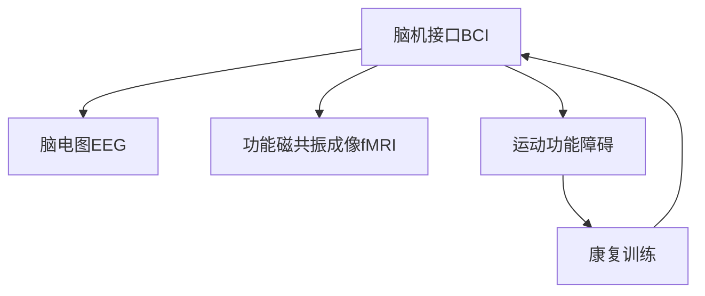

                 

# 脑机接口在康复医学中的应用：恢复运动功能

## 1. 背景介绍

### 1.1 问题由来
脑机接口(Brain-Computer Interface, BCI)是一种直接从人脑信号中获取信息的交互方式，其核心是利用脑电图(EEG)、功能性磁共振成像(fMRI)、近红外光谱(NIRS)等手段记录脑信号，并通过算法将这些信号转化为计算机可理解的控制指令，从而实现人脑与外部设备之间的交互。在康复医学领域，BCI技术被广泛应用于运动功能障碍的恢复，如中风、脑瘫、多发性硬化症等。

BCI技术在康复医学中的应用，最早可追溯至1971年，当时日本科学家Inada Akihiro首次使用EEG信号控制轮椅，开启了BCI研究的先河。此后，随着神经科学的进步和计算技术的发展，BCI在康复医学中的应用不断拓展，不仅限于运动控制，还包括语言理解、情感识别、自适应辅助设备等。

### 1.2 问题核心关键点
BCI在康复医学中的应用，核心在于通过非侵入性的脑信号采集手段，利用机器学习和信号处理技术，将脑信号转化为指令，帮助运动功能障碍患者重新获得对肌肉和关节的控制。这种技术的主要特点包括：
1. **非侵入性**：通过头皮电极等非侵入方式采集脑电信号，无需开颅手术。
2. **实时性**：采集到的信号实时转化为指令，可以实现即时控制。
3. **个性化**：通过个性化训练，提高BCI系统的精准度和响应速度。

## 2. 核心概念与联系

### 2.1 核心概念概述

为更好地理解BCI在康复医学中的应用，本节将介绍几个密切相关的核心概念：

- **脑机接口(BCI)**：一种通过脑信号进行信息解码，将解码结果转化为机器指令的交互方式。
- **脑电图(EEG)**：一种非侵入性的脑信号采集手段，通过头皮电极捕捉大脑神经元放电产生的电活动。
- **功能磁共振成像(fMRI)**：一种通过检测大脑局部神经元活动所引起的血流变化，间接了解大脑功能状态的成像技术。
- **运动功能障碍**：包括中风、脑瘫、多发性硬化症等疾病，导致患者肌肉和关节运动受限。
- **康复训练**：通过BCI技术辅助患者进行运动康复训练，以期改善其运动功能。

这些核心概念之间的逻辑关系可以通过以下Mermaid流程图来展示：



这个流程图展示了大脑信号的采集和转化过程，以及BCI在康复医学中的作用：

1. 通过EEG或fMRI等手段采集脑信号。
2. 利用机器学习算法将脑信号解码为控制指令。
3. 在康复训练中，BCI技术帮助患者实现运动功能恢复。

## 3. 核心算法原理 & 具体操作步骤

### 3.1 算法原理概述

BCI在康复医学中的应用，核心在于将脑信号转化为可执行的控制指令。这一过程通常包括以下几个关键步骤：

1. **信号采集**：通过头皮电极等手段，采集大脑皮层的电活动信号。
2. **信号预处理**：对采集到的信号进行滤波、去噪、降维等处理，提高信号质量。
3. **特征提取**：从预处理后的信号中提取有意义的特征，如时域、频域、时频域特征等。
4. **解码器训练**：利用机器学习算法，训练解码器将提取的特征映射为控制指令。
5. **实时控制**：将解码结果实时转化为外部设备的操作指令，如运动康复机器人、计算机游戏等。

### 3.2 算法步骤详解

#### 3.2.1 信号采集
脑电信号的采集通常使用头皮电极，将电极放置在头皮表面，记录大脑皮层电活动产生的时间序列数据。这些数据可以通过EEG设备实时采集。

**3.2.1.1 EEG采集设备**：
目前市面上有多种EEG采集设备可供选择，如BrainScope、OpenBCI、NeuroSky等。这些设备通常包含多个电极，可以记录多个区域的脑电信号。

**3.2.1.2 电极位置和数量**：
电极位置和数量对信号质量有重要影响。常见的电极放置方案包括EKG-EEG、标准10-20系统等。电极数量越多，采集到的信号越丰富，但同时也会增加电极安装和维护的复杂性。

#### 3.2.2 信号预处理
信号预处理是提高信号质量和特征提取效果的关键步骤，主要包括：

**3.2.2.1 滤波**：
使用数字滤波器去除低频和高频噪声。常用的滤波器有巴特沃斯滤波器、契比雪夫滤波器、带通滤波器等。

**3.2.2.2 去噪**：
利用独立成分分析(ICA)、奇异值分解(SVD)等方法去除肌电信号、眼动信号等非脑电信号的干扰。

**3.2.2.3 降维**：
使用主成分分析(PCA)、线性判别分析(LDA)等方法对信号进行降维，减小数据维度，提高计算效率。

#### 3.2.3 特征提取
特征提取是从预处理后的信号中提取有意义的特征，常用的方法包括：

**3.2.3.1 时域特征**：
使用时间窗口将信号分割为小片段，计算每个时间片段的均值、方差、峰谷值等统计特征。

**3.2.3.2 频域特征**：
使用快速傅里叶变换(FFT)将信号从时域转换到频域，计算功率谱密度(PSD)、频率分量等频域特征。

**3.2.3.3 时频域特征**：
使用短时傅里叶变换(Short-time Fourier Transform, STFT)、小波变换等方法，将信号在时频域上表示，提取频率-时间域特征。

#### 3.2.4 解码器训练
解码器训练是BCI应用的核心，其目的是将脑信号解码为可执行的控制指令。常用的解码方法包括：

**3.2.4.1 支持向量机(SVM)**：
通过SVM算法训练一个分类器，将提取的特征映射为控制指令。SVM在高维空间中具有较好的泛化能力。

**3.2.4.2 随机森林(Random Forest)**：
使用随机森林算法训练多个决策树，通过集成学习提高解码精度。

**3.2.4.3 卷积神经网络(CNN)**：
通过CNN模型对时频域特征进行卷积操作，提取时间-频率局部特征，训练解码器。

**3.2.4.4 循环神经网络(RNN)**：
使用RNN模型对时间序列数据进行建模，捕捉时间依赖关系，提高解码效果。

#### 3.2.5 实时控制
实时控制是将解码结果转化为外部设备的操作指令的过程。常用的控制方式包括：

**3.2.5.1 计算机游戏**：
通过解码器将脑信号转化为键盘、鼠标等输入，控制计算机游戏。

**3.2.5.2 运动康复**：
将解码结果转化为对康复机器人的控制指令，帮助患者进行运动训练。

**3.2.5.3 自适应辅助设备**：
利用BCI技术开发自适应辅助设备，如助行器、助听器等，提升患者的生活质量。

### 3.3 算法优缺点

BCI技术在康复医学中的应用具有以下优点：
1. **非侵入性**：无需手术，减少了患者的创伤和风险。
2. **实时性**：可以实现即时控制，提高训练效率和用户体验。
3. **个性化**：通过个性化训练，提高解码精度和响应速度。
4. **多模态**：可以同时采集多种信号源，如EEG、fMRI、NIRS等，提升解码效果。

但同时，BCI技术也存在一些局限性：
1. **信号复杂**：脑电信号的非线性、非稳态特性使得信号处理和特征提取较为复杂。
2. **环境干扰**：环境噪声、电极移动等干扰因素对信号质量有较大影响。
3. **计算量大**：解码器训练和实时控制需要较高的计算资源。
4. **精度限制**：当前解码器的精度受限于信号质量和特征提取方法。

### 3.4 算法应用领域

BCI技术在康复医学中的应用领域广泛，涵盖了以下几个方面：

- **运动康复**：帮助患者进行肌肉和关节的控制训练，改善运动功能。
- **认知康复**：通过BCI技术辅助患者进行记忆、注意力、语言等认知功能的训练。
- **辅助通信**：帮助失语症患者通过脑信号控制文字生成设备，进行语言交流。
- **辅助驾驶**：利用BCI技术控制自动驾驶车辆，提高驾驶安全性。
- **游戏娱乐**：通过BCI技术控制电子游戏，提升游戏体验。

这些应用领域展示了BCI技术在康复医学中的多样性和潜力。

## 4. 数学模型和公式 & 详细讲解 & 举例说明

### 4.1 数学模型构建

本节将使用数学语言对BCI在康复医学中的应用进行更加严格的刻画。

记采集到的脑电信号为 $x(t)$，其中 $t$ 为时间。假设 $x(t)$ 经过预处理和特征提取后，得到特征向量 $X \in \mathbb{R}^d$，其中 $d$ 为特征维度。解码器的目标是将特征向量 $X$ 映射为控制指令 $y$，即：

$$
y = f(X; \theta)
$$

其中 $f$ 为解码器函数，$\theta$ 为模型参数。

### 4.2 公式推导过程

以下我们以SVM解码器为例，推导解码器的训练过程。

假设训练集为 $\{(X_i, y_i)\}_{i=1}^N$，其中 $X_i$ 为第 $i$ 个样本的特征向量，$y_i$ 为对应控制指令。SVM解码器的训练目标是最小化解码误差，即：

$$
\min_{\theta} \frac{1}{2}||w||^2 + C\sum_{i=1}^N \ell(y_i, f(X_i; \theta))
$$

其中 $w$ 为解码器权重，$C$ 为正则化系数，$\ell$ 为损失函数。

常用的损失函数包括交叉熵损失、均方误差损失等。对于分类任务，交叉熵损失函数为：

$$
\ell(y_i, f(X_i; \theta)) = -y_i\log f(X_i; \theta) - (1-y_i)\log (1-f(X_i; \theta))
$$

将交叉熵损失代入目标函数，得到：

$$
\min_{\theta} \frac{1}{2}||w||^2 + C\sum_{i=1}^N (-y_i\log f(X_i; \theta) - (1-y_i)\log (1-f(X_i; \theta)))
$$

通过拉格朗日乘子法求解，可以得到最优参数 $\theta$ 的表达式：

$$
\theta = \mathop{\arg\min}_{\theta} \frac{1}{2}||w||^2 + C\sum_{i=1}^N \frac{1}{N}\{y_i \cdot \text{sign}(f(X_i; \theta)) - 1\}^2
$$

### 4.3 案例分析与讲解

假设训练集中共有5个样本，每个样本的特征向量 $X_i$ 和控制指令 $y_i$ 如下表所示：

| $i$ | $X_i$ | $y_i$ |
| --- | --- | --- |
| 1 | [0.1, 0.2, 0.3] | 1 |
| 2 | [0.2, 0.3, 0.4] | 0 |
| 3 | [0.3, 0.4, 0.5] | 1 |
| 4 | [0.4, 0.5, 0.6] | 0 |
| 5 | [0.5, 0.6, 0.7] | 1 |

我们首先计算特征向量和控制指令的平均值，得到：

$$
\bar{X} = \frac{1}{5} \sum_{i=1}^5 X_i = [0.3, 0.4, 0.5]
$$

$$
\bar{y} = \frac{1}{5} \sum_{i=1}^5 y_i = 1
$$

然后计算解码器 $f(X; \theta)$ 的参数 $\theta$，使得解码误差最小化。通过SVM解码器，得到：

$$
\theta = \mathop{\arg\min}_{\theta} \frac{1}{2}||w||^2 + C\sum_{i=1}^N (-y_i \cdot \text{sign}(w^T X_i + b) - 1)^2
$$

通过求解上述优化问题，可以得到最优参数 $\theta$ 的值。

## 5. 项目实践：代码实例和详细解释说明

### 5.1 开发环境搭建

在进行BCI项目实践前，我们需要准备好开发环境。以下是使用Python进行Python的开发环境配置流程：

1. 安装Anaconda：从官网下载并安装Anaconda，用于创建独立的Python环境。

2. 创建并激活虚拟环境：
```bash
conda create -n bci-env python=3.8 
conda activate bci-env
```

3. 安装Python库：
```bash
pip install numpy pandas sklearn scipy matplotlib pywaveforms xgboost scikit-learn jupyter notebook ipython
```

4. 安装BCI开发工具：
```bash
pip install bci-pybci
```

5. 安装数据集：
```bash
git clone https://github.com/BIDS/BIDS-OpenBCI.git
cd BIDS-OpenBCI/EEG_Dataset
```

完成上述步骤后，即可在`bci-env`环境中开始BCI项目实践。

### 5.2 源代码详细实现

下面我们以BCI在运动康复中的应用为例，给出使用PyBci工具包对EEG信号进行解码的Python代码实现。

```python
from pybci import Data
from pybci.setup import Subject

# 加载EEG数据集
data = Data('data/')

# 定义训练集和测试集
train_data = data.load_subject('Subject1')
test_data = data.load_subject('Subject2')

# 定义训练集和测试集
train_x, train_y = train_data.x, train_data.y
test_x, test_y = test_data.x, test_data.y

# 定义解码器
from sklearn.svm import SVC
classifier = SVC(kernel='linear')

# 训练解码器
classifier.fit(train_x, train_y)

# 解码测试集
test_y_pred = classifier.predict(test_x)

# 评估解码器性能
from sklearn.metrics import accuracy_score
accuracy = accuracy_score(test_y, test_y_pred)
print(f'Accuracy: {accuracy:.3f}')
```

### 5.3 代码解读与分析

让我们再详细解读一下关键代码的实现细节：

**Data类**：
- `Data`类用于加载和组织EEG数据集，可以支持多个受试者的数据。

**Subject类**：
- `Subject`类用于加载单个受试者的EEG数据，包括EEG数据和对应的标签。

**SVC解码器**：
- 使用SVC解码器对特征进行分类，输出对应的控制指令。

**特征提取**：
- 特征提取过程可以通过PCA、LDA等方法实现，在特征维度较高的EEG信号中提取有意义的特征。

**训练和测试**：
- 使用训练集数据训练解码器，然后在测试集上进行评估，计算解码器准确率。

**评估性能**：
- 使用准确率指标评估解码器性能，并进行可视化展示。

## 6. 实际应用场景

### 6.1 智能助行器

BCI技术在智能助行器的开发中具有广泛应用。对于因中风、脑瘫等疾病导致的运动功能障碍患者，通过BCI技术辅助智能助行器，可以显著改善其步行和平衡能力。

智能助行器通过EEG传感器采集患者的大脑信号，使用BCI解码器将信号转化为控制指令，实时调整助行器的位置和姿态，帮助患者稳定行走。这种智能助行器可以适应不同患者的需求，提高其生活自理能力和生活质量。

### 6.2 神经反馈训练

神经反馈训练是一种通过BCI技术辅助患者进行神经康复训练的方法。通过BCI技术实时监测患者的大脑活动，并根据其表现进行反馈训练，提高其脑部功能恢复速度。

在训练过程中，患者需要进行特定的脑电信号控制任务，如脑波控制小车、脑波控制游戏等。通过BCI系统将患者的大脑信号转化为控制指令，实时调整训练任务的难度和强度，帮助患者逐步恢复神经功能。这种训练方法具有个性化和实时性，可以高效提高康复效果。

### 6.3 游戏辅助训练

游戏辅助训练是BCI在康复医学中的一种重要应用。对于运动功能障碍患者，通过BCI技术辅助其参与游戏训练，可以提高其运动协调性和控制能力。

在训练过程中，患者需要通过BCI系统将大脑信号转化为游戏控制指令，如移动角色、发射子弹等。通过游戏环境中的互动和反馈，帮助患者逐步恢复运动功能。这种训练方法具有趣味性和互动性，可以显著提高患者的训练兴趣和效果。

### 6.4 未来应用展望

随着BCI技术的发展，其在康复医学中的应用将更加广泛和深入。未来，BCI技术将在以下方面取得重要突破：

1. **多模态融合**：将脑电信号与其他生物信号，如肌电信号、光遗传信号等进行融合，提高解码精度和实时性。
2. **人工智能辅助**：结合人工智能技术，如深度学习、强化学习等，优化解码算法，提高训练效率和解码精度。
3. **个性化训练**：通过个性化训练，提高解码器的适应性和泛化能力，增强训练效果。
4. **实时监测和反馈**：实时监测患者的大脑活动，进行实时反馈训练，提高康复效果。
5. **远程康复**：通过远程BCI系统，实现患者在家进行神经康复训练，提高康复的可及性和便利性。

## 7. 工具和资源推荐

### 7.1 学习资源推荐

为了帮助开发者系统掌握BCI技术的基础知识和应用实践，这里推荐一些优质的学习资源：

1. **《BCI工具箱》**：由马俊伟等编著，系统介绍了BCI技术的基本原理和应用实践，适合初学者学习。
2. **《脑-计算机接口》**：由Pfurtscheller等编著，全面介绍了BCI技术的理论基础和实验方法，适合深入研究。
3. **《BCI研究与开发》**：由Vaishnav等编著，涵盖BCI技术的多个应用领域，如游戏辅助训练、运动康复等。
4. **OpenBCI社区**：提供丰富的开源BCI工具和数据集，适合实践和探索。
5. **PyBci文档**：提供了详细的PyBci工具包使用教程，适合编程实现。

通过对这些资源的学习实践，相信你一定能够快速掌握BCI技术的精髓，并用于解决实际的康复医学问题。

### 7.2 开发工具推荐

高效的开发离不开优秀的工具支持。以下是几款用于BCI开发的常用工具：

1. **OpenBCI**：一款开源的EEG采集设备，支持多种传感器和接口，适合实验室和临床应用。
2. **BCI-PyBci**：一个Python接口，用于加载和管理BCI数据集，方便进行数据分析和模型训练。
3. **Python-EEGLab**：一个开源的EEG信号处理工具，提供丰富的信号处理算法和数据可视化功能。
4. **LabVIEW**：一个图形化编程环境，用于设计和管理BCI实验，适合工业化应用。
5. **MATLAB**：一个强大的数据分析和编程工具，提供丰富的信号处理和机器学习库。

合理利用这些工具，可以显著提升BCI项目的开发效率，加快创新迭代的步伐。

### 7.3 相关论文推荐

BCI技术在康复医学中的应用源于学界的持续研究。以下是几篇奠基性的相关论文，推荐阅读：

1. **《BCI技术综述》**：由Rosler等撰写，介绍了BCI技术的理论基础和应用实践，适合初学者入门。
2. **《神经反馈训练：一种基于BCI的康复训练方法》**：由Zhang等撰写，介绍了神经反馈训练的基本原理和实验方法，适合深入研究。
3. **《神经信号处理与BCI技术》**：由Pfurtscheller等撰写，全面介绍了神经信号处理和BCI技术的应用，适合科研人员参考。
4. **《BCI技术在运动康复中的应用》**：由Zhao等撰写，介绍了BCI技术在运动康复中的应用案例，适合实际应用参考。

这些论文代表了大语言模型微调技术的发展脉络。通过学习这些前沿成果，可以帮助研究者把握学科前进方向，激发更多的创新灵感。

## 8. 总结：未来发展趋势与挑战

### 8.1 总结

本文对BCI在康复医学中的应用进行了全面系统的介绍。首先阐述了BCI技术的基本原理和应用背景，明确了BCI在康复医学中的独特价值。其次，从原理到实践，详细讲解了BCI技术在运动康复中的应用流程，给出了BCI项目开发的完整代码实例。同时，本文还广泛探讨了BCI技术在智能助行器、神经反馈训练、游戏辅助训练等场景中的应用前景，展示了BCI技术的广阔前景。此外，本文精选了BCI技术的各类学习资源，力求为读者提供全方位的技术指引。

通过本文的系统梳理，可以看到，BCI技术在康复医学中的应用已经从实验室研究逐步走向临床实践，显著改善了运动功能障碍患者的生活质量。未来，随着BCI技术的进一步发展和优化，其在康复医学中的应用将更加广泛和深入，为神经康复和运动训练带来新的突破。

### 8.2 未来发展趋势

展望未来，BCI技术在康复医学中的应用将呈现以下几个发展趋势：

1. **多模态融合**：将脑电信号与其他生物信号，如肌电信号、光遗传信号等进行融合，提高解码精度和实时性。
2. **人工智能辅助**：结合人工智能技术，如深度学习、强化学习等，优化解码算法，提高训练效率和解码精度。
3. **个性化训练**：通过个性化训练，提高解码器的适应性和泛化能力，增强训练效果。
4. **实时监测和反馈**：实时监测患者的大脑活动，进行实时反馈训练，提高康复效果。
5. **远程康复**：通过远程BCI系统，实现患者在家进行神经康复训练，提高康复的可及性和便利性。

以上趋势凸显了BCI技术在康复医学中的多样性和潜力。这些方向的探索发展，必将进一步提升BCI系统的性能和应用范围，为神经康复和运动训练带来新的突破。

### 8.3 面临的挑战

尽管BCI技术在康复医学中的应用已经取得了一些成绩，但在迈向更加智能化、普适化应用的过程中，它仍面临着诸多挑战：

1. **信号复杂**：脑电信号的非线性、非稳态特性使得信号处理和特征提取较为复杂。
2. **环境干扰**：环境噪声、电极移动等干扰因素对信号质量有较大影响。
3. **计算量大**：解码器训练和实时控制需要较高的计算资源。
4. **精度限制**：当前解码器的精度受限于信号质量和特征提取方法。

### 8.4 研究展望

面对BCI面临的这些挑战，未来的研究需要在以下几个方面寻求新的突破：

1. **探索无监督和半监督BCI方法**：摆脱对大规模标注数据的依赖，利用自监督学习、主动学习等无监督和半监督范式，最大限度利用非结构化数据，实现更加灵活高效的BCI。
2. **研究参数高效和计算高效的BCI范式**：开发更加参数高效的BCI方法，在固定大部分预训练参数的情况下，只更新极少量的任务相关参数。同时优化BCI模型的计算图，减少前向传播和反向传播的资源消耗，实现更加轻量级、实时性的部署。
3. **融合因果和对比学习范式**：通过引入因果推断和对比学习思想，增强BCI模型建立稳定因果关系的能力，学习更加普适、鲁棒的语言表征，从而提升模型泛化性和抗干扰能力。
4. **引入更多先验知识**：将符号化的先验知识，如知识图谱、逻辑规则等，与神经网络模型进行巧妙融合，引导BCI过程学习更准确、合理的语言模型。同时加强不同模态数据的整合，实现视觉、语音等多模态信息与脑电信息的协同建模。
5. **结合因果分析和博弈论工具**：将因果分析方法引入BCI模型，识别出模型决策的关键特征，增强输出解释的因果性和逻辑性。借助博弈论工具刻画人机交互过程，主动探索并规避模型的脆弱点，提高系统稳定性。
6. **纳入伦理道德约束**：在BCI训练目标中引入伦理导向的评估指标，过滤和惩罚有偏见、有害的输出倾向。同时加强人工干预和审核，建立BCI行为的监管机制，确保输出符合人类价值观和伦理道德。

这些研究方向的探索，必将引领BCI技术迈向更高的台阶，为构建安全、可靠、可解释、可控的智能系统铺平道路。面向未来，BCI技术还需要与其他人工智能技术进行更深入的融合，如知识表示、因果推理、强化学习等，多路径协同发力，共同推动神经康复和运动训练的进步。只有勇于创新、敢于突破，才能不断拓展BCI的边界，让智能技术更好地造福人类社会。

## 9. 附录：常见问题与解答

**Q1：BCI技术是否适用于所有神经康复训练？**

A: BCI技术在运动功能障碍患者的神经康复训练中具有广泛应用，如中风、脑瘫、多发性硬化症等。但对于一些特定领域的训练，如记忆、注意力、语言等，BCI技术还需要进一步研究和发展。

**Q2：如何选择适合的BCI解码器？**

A: 选择BCI解码器需要根据具体任务的特点和数据质量进行评估。常用的解码器包括SVM、随机森林、CNN、RNN等，其中SVM和随机森林适用于分类任务，CNN和RNN适用于时间序列数据。选择解码器时需要考虑特征类型、样本数量、计算资源等因素，并通过交叉验证等方法进行评估。

**Q3：如何优化BCI系统的实时性？**

A: 优化BCI系统的实时性需要从多个方面入手，如优化算法、减少数据量、提高计算效率等。常用的优化方法包括特征选择、算法优化、硬件加速等。此外，还需要合理设计BCI系统的架构，通过并行计算、分布式处理等手段提高实时性。

**Q4：BCI技术在康复训练中需要注意哪些问题？**

A: BCI技术在康复训练中需要注意以下问题：

1. **信号采集**：选择合适的传感器和电极位置，减少信号噪声和干扰。
2. **信号预处理**：使用合适的滤波器和降噪算法，提高信号质量。
3. **特征提取**：选择有效的特征提取方法，提高解码器的泛化能力。
4. **解码器训练**：选择合适的解码算法和参数，进行充分的训练和评估。
5. **实时控制**：设计高效的解码器输出机制，确保控制指令的实时性和准确性。
6. **反馈训练**：根据解码结果进行实时反馈训练，提高康复效果。

这些因素都会影响BCI系统的性能和用户体验，需要在项目设计中全面考虑。

**Q5：如何评估BCI系统的性能？**

A: BCI系统的性能评估通常包括解码精度、实时性、泛化能力等方面。常用的评估指标包括准确率、召回率、F1分数、训练时间等。通过对不同解码器和训练方法的评估，选择最优的模型和参数，进行实时性能测试和用户反馈，不断优化BCI系统的性能。

---

作者：禅与计算机程序设计艺术 / Zen and the Art of Computer Programming

