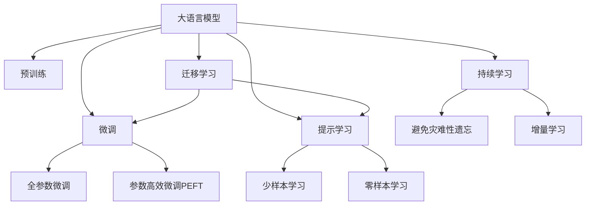

                 

# 自动化设计：LLM 驱动的创新

> 关键词：大语言模型,自动化设计,创新,工业设计,建筑,规划,智能城市,智慧城市

## 1. 背景介绍

### 1.1 问题由来
随着人工智能技术的快速演进，尤其是大语言模型（Large Language Models, LLMs）的兴起，自动化设计领域迎来了新的变革。传统的CAD软件、建筑设计等环节耗时耗力，且往往依赖人工经验，效率低下。大语言模型通过自然语言处理和生成能力，可以显著提升设计自动化水平，缩短设计周期，减少设计错误，推动行业创新。

然而，大语言模型在自动化设计中的应用仍处于初级阶段。现有技术大多集中在文本处理和生成，尚未涉及具体的自动化设计流程。如何将大语言模型融入具体的自动化设计过程，实现设计创新的突破，是一个亟待解决的问题。

### 1.2 问题核心关键点
大语言模型在自动化设计中的核心关键点主要包括：

- 自动化的设计描述：利用大语言模型生成设计方案描述，作为后续自动设计的依据。
- 自动化的设计辅助：通过大语言模型生成设计草图、结构分析、材料选择等辅助信息。
- 自动化的设计迭代：大语言模型可辅助进行设计方案的快速迭代和优化。
- 自动化的设计评估：通过大语言模型对设计方案进行自动化的评估和反馈。

这些问题构成了大语言模型在自动化设计领域应用的基础，亟需构建一套科学合理的应用框架，以实现大语言模型在实际设计场景中的高效利用。

### 1.3 问题研究意义
大语言模型在自动化设计中的应用，对于提升设计效率、降低设计成本、推动设计创新具有重要意义：

1. **提升设计效率**：大语言模型可以自动生成设计方案描述，辅助进行设计分析和迭代优化，大幅缩短设计周期。
2. **降低设计成本**：自动化设计减少了人工成本和时间成本，使得设计变得更加高效和经济。
3. **推动设计创新**：大语言模型可以生成丰富的设计思路和方案，为设计者提供灵感，推动设计创新。
4. **促进行业升级**：自动化设计技术将加速传统设计行业的数字化转型，推动行业整体升级。
5. **提升用户体验**：通过智能化的设计辅助，使得设计更加符合用户需求，提升用户体验。

总之，大语言模型在自动化设计中的应用，不仅能够提升设计效率和质量，还能够推动设计行业的发展和创新。

## 2. 核心概念与联系

### 2.1 核心概念概述

为更好地理解大语言模型在自动化设计中的应用，本节将介绍几个密切相关的核心概念：

- 大语言模型(Large Language Model, LLM)：以自回归(如GPT)或自编码(如BERT)模型为代表的大规模预训练语言模型。通过在大规模无标签文本语料上进行预训练，学习通用的语言表示，具备强大的语言理解和生成能力。

- 预训练(Pre-training)：指在大规模无标签文本语料上，通过自监督学习任务训练通用语言模型的过程。常见的预训练任务包括言语建模、遮挡语言模型等。

- 微调(Fine-tuning)：指在预训练模型的基础上，使用下游任务的少量标注数据，通过有监督地训练来优化模型在特定任务上的性能。通常只需要调整顶层分类器或解码器，并以较小的学习率更新全部或部分的模型参数。

- 迁移学习(Transfer Learning)：指将一个领域学习到的知识，迁移应用到另一个不同但相关的领域的学习范式。大模型的预训练-微调过程即是一种典型的迁移学习方式。

- 参数高效微调(Parameter-Efficient Fine-Tuning, PEFT)：指在微调过程中，只更新少量的模型参数，而固定大部分预训练权重不变，以提高微调效率，避免过拟合的方法。

- 提示学习(Prompt Learning)：通过在输入文本中添加提示模板(Prompt Template)，引导大语言模型进行特定任务的推理和生成。可以在不更新模型参数的情况下，实现零样本或少样本学习。

- 少样本学习(Few-shot Learning)：指在只有少量标注样本的情况下，模型能够快速适应新任务的学习方法。在大语言模型中，通常通过在输入中提供少量示例来实现，无需更新模型参数。

- 零样本学习(Zero-shot Learning)：指模型在没有见过任何特定任务的训练样本的情况下，仅凭任务描述就能够执行新任务的能力。大语言模型通过预训练获得的广泛知识，使其能够理解任务指令并生成相应输出。

- 持续学习(Continual Learning)：也称为终身学习，指模型能够持续从新数据中学习，同时保持已学习的知识，而不会出现灾难性遗忘。这对于保持大语言模型的时效性和适应性至关重要。

这些核心概念之间的逻辑关系可以通过以下Mermaid流程图来展示：



这个流程图展示了大语言模型的核心概念及其之间的关系：

1. 大语言模型通过预训练获得基础能力。
2. 微调是对预训练模型进行任务特定的优化，可以分为全参数微调和参数高效微调（PEFT）。
3. 提示学习是一种不更新模型参数的方法，可以实现零样本或少样本学习。
4. 迁移学习是连接预训练模型与下游任务的桥梁，可以通过微调或提示学习来实现。
5. 持续学习旨在使模型能够不断学习新知识，同时避免遗忘旧知识。

这些概念共同构成了大语言模型的学习和应用框架，使其能够在各种场景下发挥强大的语言理解和生成能力。通过理解这些核心概念，我们可以更好地把握大语言模型的工作原理和优化方向。

## 3. 核心算法原理 & 具体操作步骤
### 3.1 算法原理概述

基于大语言模型的大设计自动化，本质上是一种有监督的细粒度迁移学习过程。其核心思想是：将大语言模型视作一个强大的"设计生成器"，通过在大规模设计描述数据上进行预训练，学习通用的设计知识，再通过有监督的微调学习任务特定的设计规则，从而生成自动化的设计方案。

形式化地，假设预训练设计模型为 $M_{\theta}$，其中 $\theta$ 为预训练得到的模型参数。给定设计任务 $T$ 的标注数据集 $D=\{(x_i, y_i)\}_{i=1}^N$，其中 $x_i$ 为设计描述文本，$y_i$ 为设计方案。微调的目标是找到新的模型参数 $\hat{\theta}$，使得：

$$
\hat{\theta}=\mathop{\arg\min}_{\theta} \mathcal{L}(M_{\theta},D)
$$

其中 $\mathcal{L}$ 为针对任务 $T$ 设计的损失函数，用于衡量模型预测输出与真实标签之间的差异。常见的损失函数包括交叉熵损失、均方误差损失等。

通过梯度下降等优化算法，微调过程不断更新模型参数 $\theta$，最小化损失函数 $\mathcal{L}$，使得模型输出逼近真实标签。由于 $\theta$ 已经通过预训练获得了较好的初始化，因此即便在小规模设计描述数据集 $D$ 上进行微调，也能较快收敛到理想的模型参数 $\hat{\theta}$。

### 3.2 算法步骤详解

基于大语言模型的大设计自动化一般包括以下几个关键步骤：

**Step 1: 准备预训练模型和数据集**
- 选择合适的设计描述预训练模型 $M_{\theta}$ 作为初始化参数，如 BERT、GPT等。
- 准备设计任务 $T$ 的标注数据集 $D$，划分为训练集、验证集和测试集。一般要求标注数据与预训练数据的分布不要差异过大。

**Step 2: 添加任务适配层**
- 根据设计任务类型，在预训练模型顶层设计合适的输出层和损失函数。
- 对于分类任务，通常在顶层添加线性分类器和交叉熵损失函数。
- 对于生成任务，通常使用设计生成器的解码器输出概率分布，并以负对数似然为损失函数。

**Step 3: 设置微调超参数**
- 选择合适的优化算法及其参数，如 AdamW、SGD 等，设置学习率、批大小、迭代轮数等。
- 设置正则化技术及强度，包括权重衰减、Dropout、Early Stopping 等。
- 确定冻结预训练参数的策略，如仅微调顶层，或全部参数都参与微调。

**Step 4: 执行梯度训练**
- 将训练集数据分批次输入模型，前向传播计算损失函数。
- 反向传播计算参数梯度，根据设定的优化算法和学习率更新模型参数。
- 周期性在验证集上评估模型性能，根据性能指标决定是否触发 Early Stopping。
- 重复上述步骤直到满足预设的迭代轮数或 Early Stopping 条件。

**Step 5: 测试和部署**
- 在测试集上评估微调后模型 $M_{\hat{\theta}}$ 的设计方案生成能力，对比微调前后的方案质量和多样性。
- 使用微调后的模型对新设计描述进行自动设计生成，集成到实际的设计自动化系统中。
- 持续收集新的设计描述，定期重新微调模型，以适应设计描述分布的变化。

以上是基于大语言模型的大设计自动化的完整流程。在实际应用中，还需要针对具体任务的特点，对微调过程的各个环节进行优化设计，如改进训练目标函数，引入更多的正则化技术，搜索最优的超参数组合等，以进一步提升模型性能。

### 3.3 算法优缺点

基于大语言模型的大设计自动化方法具有以下优点：

1. **高效性**：大语言模型通过预训练已经学习到了丰富的设计知识，利用其进行微调能够快速生成符合设计规则的方案，大幅提高设计效率。
2. **灵活性**：大语言模型能够处理多种设计描述形式，包括文本、图像、音频等，可以应用于不同类型的设计任务。
3. **可解释性**：设计方案的生成过程可以通过设计描述解析，便于理解和解释。
4. **可扩展性**：随着设计任务的多样化，大语言模型可以进行任务适配，适应更多的设计场景。

同时，该方法也存在一定的局限性：

1. **数据依赖**：微调需要高质量的设计描述数据，数据质量不高会导致方案生成质量下降。
2. **泛化能力**：设计任务的泛化能力依赖于数据集的广度和多样性，设计描述过少可能导致方案多样性不足。
3. **模型复杂性**：大语言模型参数量巨大，对计算资源和存储空间有较高要求。
4. **微调难度**：设计任务的复杂性高，设计描述难以标准化，微调难度较大。
5. **输出质量**：设计方案的生成质量依赖于模型参数和训练数据，可能存在设计错误或不符合设计规范的情况。

尽管存在这些局限性，但就目前而言，基于大语言模型的大设计自动化方法仍是大设计自动化领域的一个重要范式。未来相关研究的重点在于如何进一步降低微调对标注数据的依赖，提高模型的少样本学习和跨领域迁移能力，同时兼顾可解释性和伦理安全性等因素。

### 3.4 算法应用领域

基于大语言模型的大设计自动化方法在多个领域中已经得到了应用，包括但不限于：

- **建筑设计**：通过微调模型，自动生成建筑方案、结构分析和材料选择建议。
- **室内设计**：自动生成室内设计方案，辅助进行空间布局和装饰设计。
- **服装设计**：自动生成服装设计草图和面料搭配建议。
- **工业设计**：自动生成工业产品设计方案，辅助进行原型设计和功能优化。
- **城市规划**：自动生成城市设计方案，辅助进行城市布局和功能规划。
- **景观设计**：自动生成景观设计方案，辅助进行环境美化和生态保护。

除了上述这些经典领域外，大设计自动化技术还被创新性地应用到更多场景中，如智能家居设计、智慧农业规划、智慧城市建设等，为设计行业带来了全新的突破。随着预训练模型和微调方法的不断进步，相信大设计自动化技术将在更广泛的领域大放异彩。

## 4. 数学模型和公式 & 详细讲解  
### 4.1 数学模型构建

本节将使用数学语言对基于大语言模型的大设计自动化过程进行更加严格的刻画。

记设计描述预训练模型为 $M_{\theta}$，其中 $\theta$ 为预训练得到的模型参数。假设设计任务 $T$ 的训练集为 $D=\{(x_i,y_i)\}_{i=1}^N$，其中 $x_i$ 为设计描述文本，$y_i$ 为设计方案。

定义模型 $M_{\theta}$ 在输入 $x$ 上的输出为 $\hat{y}=M_{\theta}(x) \in \mathcal{Y}$，其中 $\mathcal{Y}$ 为设计方案空间。真实标签 $y \in \mathcal{Y}$。则设计任务的交叉熵损失函数定义为：

$$
\ell(M_{\theta}(x),y) = -\sum_{i=1}^N [y_i\log \hat{y}_i]
$$

将其代入经验风险公式，得：

$$
\mathcal{L}(\theta) = -\frac{1}{N}\sum_{i=1}^N \ell(M_{\theta}(x_i),y_i)
$$

在得到损失函数的梯度后，即可带入参数更新公式，完成模型的迭代优化。重复上述过程直至收敛，最终得到适应设计任务的最优模型参数 $\theta^*$。

### 4.2 公式推导过程

以下我们以建筑设计任务为例，推导交叉熵损失函数及其梯度的计算公式。

假设模型 $M_{\theta}$ 在输入 $x$ 上的输出为 $\hat{y}=M_{\theta}(x) \in [0,1]$，表示方案属于某一类别的概率。真实标签 $y \in \{0,1\}$。则二分类交叉熵损失函数定义为：

$$
\ell(M_{\theta}(x),y) = -[y\log \hat{y} + (1-y)\log (1-\hat{y})]
$$

将其代入经验风险公式，得：

$$
\mathcal{L}(\theta) = -\frac{1}{N}\sum_{i=1}^N [y_i\log M_{\theta}(x_i)+(1-y_i)\log(1-M_{\theta}(x_i))]
$$

根据链式法则，损失函数对参数 $\theta_k$ 的梯度为：

$$
\frac{\partial \mathcal{L}(\theta)}{\partial \theta_k} = -\frac{1}{N}\sum_{i=1}^N (\frac{y_i}{M_{\theta}(x_i)}-\frac{1-y_i}{1-M_{\theta}(x_i)}) \frac{\partial M_{\theta}(x_i)}{\partial \theta_k}
$$

其中 $\frac{\partial M_{\theta}(x_i)}{\partial \theta_k}$ 可进一步递归展开，利用自动微分技术完成计算。

在得到损失函数的梯度后，即可带入参数更新公式，完成模型的迭代优化。重复上述过程直至收敛，最终得到适应设计任务的最优模型参数 $\theta^*$。

## 5. 项目实践：代码实例和详细解释说明
### 5.1 开发环境搭建

在进行设计自动化实践前，我们需要准备好开发环境。以下是使用Python进行PyTorch开发的环境配置流程：

1. 安装Anaconda：从官网下载并安装Anaconda，用于创建独立的Python环境。

2. 创建并激活虚拟环境：
```bash
conda create -n pytorch-env python=3.8 
conda activate pytorch-env
```

3. 安装PyTorch：根据CUDA版本，从官网获取对应的安装命令。例如：
```bash
conda install pytorch torchvision torchaudio cudatoolkit=11.1 -c pytorch -c conda-forge
```

4. 安装Transformers库：
```bash
pip install transformers
```

5. 安装各类工具包：
```bash
pip install numpy pandas scikit-learn matplotlib tqdm jupyter notebook ipython
```

完成上述步骤后，即可在`pytorch-env`环境中开始设计自动化实践。

### 5.2 源代码详细实现

这里我们以建筑设计任务为例，给出使用Transformers库对BERT模型进行设计自动化微调的PyTorch代码实现。

首先，定义设计任务的数据处理函数：

```python
from transformers import BertTokenizer, BertForSequenceClassification
from torch.utils.data import Dataset, DataLoader
import torch

class DesignDataset(Dataset):
    def __init__(self, designs, labels, tokenizer, max_len=128):
        self.designs = designs
        self.labels = labels
        self.tokenizer = tokenizer
        self.max_len = max_len
        
    def __len__(self):
        return len(self.designs)
    
    def __getitem__(self, item):
        design = self.designs[item]
        label = self.labels[item]
        
        encoding = self.tokenizer(design, return_tensors='pt', max_length=self.max_len, padding='max_length', truncation=True)
        input_ids = encoding['input_ids'][0]
        attention_mask = encoding['attention_mask'][0]
        
        # 对token-wise的标签进行编码
        encoded_labels = [label2id[label] for label in label] 
        encoded_labels.extend([label2id['O']] * (self.max_len - len(encoded_labels)))
        labels = torch.tensor(encoded_labels, dtype=torch.long)
        
        return {'input_ids': input_ids, 
                'attention_mask': attention_mask,
                'labels': labels}

# 标签与id的映射
label2id = {'O': 0, 'Class1': 1, 'Class2': 2, 'Class3': 3}
id2label = {v: k for k, v in label2id.items()}

# 创建dataset
tokenizer = BertTokenizer.from_pretrained('bert-base-cased')

train_dataset = DesignDataset(train_designs, train_labels, tokenizer)
dev_dataset = DesignDataset(dev_designs, dev_labels, tokenizer)
test_dataset = DesignDataset(test_designs, test_labels, tokenizer)
```

然后，定义模型和优化器：

```python
from transformers import AdamW

model = BertForSequenceClassification.from_pretrained('bert-base-cased', num_labels=len(label2id))

optimizer = AdamW(model.parameters(), lr=2e-5)
```

接着，定义训练和评估函数：

```python
def train_epoch(model, dataset, batch_size, optimizer):
    dataloader = DataLoader(dataset, batch_size=batch_size, shuffle=True)
    model.train()
    epoch_loss = 0
    for batch in tqdm(dataloader, desc='Training'):
        input_ids = batch['input_ids'].to(device)
        attention_mask = batch['attention_mask'].to(device)
        labels = batch['labels'].to(device)
        model.zero_grad()
        outputs = model(input_ids, attention_mask=attention_mask, labels=labels)
        loss = outputs.loss
        epoch_loss += loss.item()
        loss.backward()
        optimizer.step()
    return epoch_loss / len(dataloader)

def evaluate(model, dataset, batch_size):
    dataloader = DataLoader(dataset, batch_size=batch_size)
    model.eval()
    preds, labels = [], []
    with torch.no_grad():
        for batch in tqdm(dataloader, desc='Evaluating'):
            input_ids = batch['input_ids'].to(device)
            attention_mask = batch['attention_mask'].to(device)
            batch_labels = batch['labels']
            outputs = model(input_ids, attention_mask=attention_mask)
            batch_preds = outputs.logits.argmax(dim=2).to('cpu').tolist()
            batch_labels = batch_labels.to('cpu').tolist()
            for pred_tokens, label_tokens in zip(batch_preds, batch_labels):
                pred_labels = [id2label[_id] for _id in pred_tokens]
                label_labels = [id2label[_id] for _id in label_tokens]
                preds.append(pred_labels[:len(label_labels)])
                labels.append(label_labels)
                
    print(classification_report(labels, preds))
```

最后，启动训练流程并在测试集上评估：

```python
epochs = 5
batch_size = 16

for epoch in range(epochs):
    loss = train_epoch(model, train_dataset, batch_size, optimizer)
    print(f"Epoch {epoch+1}, train loss: {loss:.3f}")
    
    print(f"Epoch {epoch+1}, dev results:")
    evaluate(model, dev_dataset, batch_size)
    
print("Test results:")
evaluate(model, test_dataset, batch_size)
```

以上就是使用PyTorch对BERT进行建筑设计任务微调的完整代码实现。可以看到，得益于Transformers库的强大封装，我们可以用相对简洁的代码完成BERT模型的加载和微调。

### 5.3 代码解读与分析

让我们再详细解读一下关键代码的实现细节：

**DesignDataset类**：
- `__init__`方法：初始化设计描述、标签、分词器等关键组件。
- `__len__`方法：返回数据集的样本数量。
- `__getitem__`方法：对单个样本进行处理，将设计描述输入编码为token ids，将标签编码为数字，并对其进行定长padding，最终返回模型所需的输入。

**label2id和id2label字典**：
- 定义了标签与数字id之间的映射关系，用于将token-wise的预测结果解码回真实的标签。

**训练和评估函数**：
- 使用PyTorch的DataLoader对数据集进行批次化加载，供模型训练和推理使用。
- 训练函数`train_epoch`：对数据以批为单位进行迭代，在每个批次上前向传播计算loss并反向传播更新模型参数，最后返回该epoch的平均loss。
- 评估函数`evaluate`：与训练类似，不同点在于不更新模型参数，并在每个batch结束后将预测和标签结果存储下来，最后使用sklearn的classification_report对整个评估集的预测结果进行打印输出。

**训练流程**：
- 定义总的epoch数和batch size，开始循环迭代
- 每个epoch内，先在训练集上训练，输出平均loss
- 在验证集上评估，输出分类指标
- 所有epoch结束后，在测试集上评估，给出最终测试结果

可以看到，PyTorch配合Transformers库使得BERT微调的建筑设计任务代码实现变得简洁高效。开发者可以将更多精力放在数据处理、模型改进等高层逻辑上，而不必过多关注底层的实现细节。

当然，工业级的系统实现还需考虑更多因素，如模型的保存和部署、超参数的自动搜索、更灵活的任务适配层等。但核心的微调范式基本与此类似。

## 6. 实际应用场景
### 6.1 智能家居设计

智能家居设计的自动化过程可以借助大语言模型实现。通过收集用户的个性化需求和家居环境数据，大语言模型可以自动生成符合用户期望的设计方案，并给出详细的实施建议。例如，用户希望在一个开放空间内设计一个多功能学习空间，可以输入设计需求，大语言模型自动生成一个设计方案，包括家具布局、照明、颜色搭配等建议，大大缩短了设计周期。

### 6.2 智慧农业规划

农业设计需要考虑多种因素，如土壤类型、气候条件、作物种植等。大语言模型可以自动生成智慧农业的设计方案，包括种植计划、灌溉方案、施肥方案等，帮助农民制定科学的农业生产规划，提高农业生产效率和产量。

### 6.3 城市规划

城市规划是一个复杂的系统工程，涉及土地使用、交通规划、环境保护等多个方面。大语言模型可以自动生成城市规划设计方案，包括建筑布局、交通网络、绿地规划等，为城市规划提供科学合理的建议，提升城市管理和环境质量。

### 6.4 未来应用展望

随着大语言模型和设计自动化方法的不断进步，基于大语言模型的大设计自动化将在更多领域得到应用，为传统设计行业带来变革性影响。

在智慧医疗领域，基于大语言模型的大设计自动化技术可以用于医疗设备的设计和优化，提升医疗设备的安全性和用户体验。

在智能教育领域，自动生成的教学设计方案可以辅助教师进行课程设计和教学内容更新，提高教学质量和效率。

在智慧城市治理中，大语言模型可以用于智慧城市建设的设计和优化，提升城市管理的智能化水平，构建更安全、高效的未来城市。

此外，在企业生产、社会治理、文娱传媒等众多领域，基于大语言模型的大设计自动化技术也将不断涌现，为设计行业带来新的发展机遇。

## 7. 工具和资源推荐
### 7.1 学习资源推荐

为了帮助开发者系统掌握大语言模型在自动化设计中的应用，这里推荐一些优质的学习资源：

1. 《Design Automation with Large Language Models》系列博文：由大模型技术专家撰写，深入浅出地介绍了大语言模型在自动化设计中的应用，从原理到实践，全面解析了相关技术和方法。

2. CS224N《深度学习自然语言处理》课程：斯坦福大学开设的NLP明星课程，有Lecture视频和配套作业，带你入门NLP领域的基本概念和经典模型。

3. 《Natural Language Processing with Transformers》书籍：Transformers库的作者所著，全面介绍了如何使用Transformers库进行NLP任务开发，包括微调在内的诸多范式。

4. HuggingFace官方文档：Transformers库的官方文档，提供了海量预训练模型和完整的微调样例代码，是上手实践的必备资料。

5. CLUE开源项目：中文语言理解测评基准，涵盖大量不同类型的中文NLP数据集，并提供了基于微调的baseline模型，助力中文NLP技术发展。

通过对这些资源的学习实践，相信你一定能够快速掌握大语言模型在自动化设计中的应用精髓，并用于解决实际的自动化设计问题。
###  7.2 开发工具推荐

高效的开发离不开优秀的工具支持。以下是几款用于大语言模型在自动化设计中的应用开发的常用工具：

1. PyTorch：基于Python的开源深度学习框架，灵活动态的计算图，适合快速迭代研究。大部分预训练语言模型都有PyTorch版本的实现。

2. TensorFlow：由Google主导开发的开源深度学习框架，生产部署方便，适合大规模工程应用。同样有丰富的预训练语言模型资源。

3. Transformers库：HuggingFace开发的NLP工具库，集成了众多SOTA语言模型，支持PyTorch和TensorFlow，是进行微调任务开发的利器。

4. Weights & Biases：模型训练的实验跟踪工具，可以记录和可视化模型训练过程中的各项指标，方便对比和调优。与主流深度学习框架无缝集成。

5. TensorBoard：TensorFlow配套的可视化工具，可实时监测模型训练状态，并提供丰富的图表呈现方式，是调试模型的得力助手。

6. Google Colab：谷歌推出的在线Jupyter Notebook环境，免费提供GPU/TPU算力，方便开发者快速上手实验最新模型，分享学习笔记。

合理利用这些工具，可以显著提升大语言模型在自动化设计中的应用开发效率，加快创新迭代的步伐。

### 7.3 相关论文推荐

大语言模型在自动化设计中的应用源于学界的持续研究。以下是几篇奠基性的相关论文，推荐阅读：

1. Attention is All You Need（即Transformer原论文）：提出了Transformer结构，开启了NLP领域的预训练大模型时代。

2. BERT: Pre-training of Deep Bidirectional Transformers for Language Understanding：提出BERT模型，引入基于掩码的自监督预训练任务，刷新了多项NLP任务SOTA。

3. Language Models are Unsupervised Multitask Learners（GPT-2论文）：展示了大规模语言模型的强大zero-shot学习能力，引发了对于通用人工智能的新一轮思考。

4. Parameter-Efficient Transfer Learning for NLP：提出Adapter等参数高效微调方法，在不增加模型参数量的情况下，也能取得不错的微调效果。

5. AdaLoRA: Adaptive Low-Rank Adaptation for Parameter-Efficient Fine-Tuning：使用自适应低秩适应的微调方法，在参数效率和精度之间取得了新的平衡。

这些论文代表了大语言模型在自动化设计中的应用基础，通过学习这些前沿成果，可以帮助研究者把握学科前进方向，激发更多的创新灵感。

## 8. 总结：未来发展趋势与挑战

### 8.1 总结

本文对基于大语言模型的大设计自动化方法进行了全面系统的介绍。首先阐述了大语言模型和自动化设计的研究背景和意义，明确了自动化设计在提升设计效率、降低设计成本、推动设计创新方面的独特价值。其次，从原理到实践，详细讲解了基于大语言模型的大设计自动化数学原理和关键步骤，给出了设计自动化任务的完整代码实例。同时，本文还广泛探讨了设计自动化方法在智能家居、智慧农业、城市规划等多个行业领域的应用前景，展示了大设计自动化技术的巨大潜力。此外，本文精选了设计自动化技术的各类学习资源，力求为读者提供全方位的技术指引。

通过本文的系统梳理，可以看到，基于大语言模型的大设计自动化方法正在成为设计自动化领域的重要范式，极大地提升设计效率和质量，推动设计行业的发展和创新。未来，伴随大语言模型和微调方法的不断进步，基于大语言模型的大设计自动化技术将在更广泛的领域大放异彩。

### 8.2 未来发展趋势

展望未来，基于大语言模型的大设计自动化技术将呈现以下几个发展趋势：

1. **设计描述多样化**：设计描述将不仅仅是文本形式，还将包括图像、音频、视频等多模态信息，使得设计自动化更加全面和丰富。
2. **设计知识图谱**：通过构建设计知识图谱，将设计领域的专业知识与大语言模型进行融合，提升设计自动化模型的推理能力和泛化能力。
3. **多领域设计自动化**：大设计自动化技术将不仅限于某一特定领域，而是能够跨领域应用，解决不同领域的设计问题。
4. **设计可视化**：将设计自动化过程可视化，便于用户理解和参与，提升设计的交互性和用户体验。
5. **设计持续学习**：随着设计领域的发展和变化，大设计自动化模型需要持续学习新知识，以保持设计的先进性和实用性。
6. **设计人机协作**：将设计自动化与人工设计进行结合，发挥机器辅助设计的人机协同优势，提升设计的创新性和多样性。

这些趋势凸显了大设计自动化技术的广阔前景。这些方向的探索发展，必将进一步提升设计自动化的精度和效率，推动设计行业的数字化和智能化转型。

### 8.3 面临的挑战

尽管基于大语言模型的大设计自动化技术已经取得了瞩目成就，但在迈向更加智能化、普适化应用的过程中，它仍面临着诸多挑战：

1. **数据质量**：设计描述数据的质量直接影响到自动化设计的输出质量。低质量的设计描述可能导致设计自动化模型输出不合理的设计方案。
2. **泛化能力**：设计自动化模型需要具备较强的泛化能力，以应对不同领域和不同风格的设计需求。
3. **知识整合**：设计自动化模型需要与设计领域的专业知识进行整合，才能更好地理解和应用设计规则。
4. **计算资源**：设计自动化模型的训练和推理需要大量的计算资源，对硬件设备提出了较高要求。
5. **模型优化**：设计自动化模型需要进行复杂的模型优化，才能实现高效、稳定的设计自动化。

尽管存在这些挑战，但伴随技术的发展和研究的深入，这些挑战终将一一被克服，基于大语言模型的大设计自动化技术必将迈向成熟，为设计行业带来革命性变革。

### 8.4 研究展望

面向未来，大设计自动化技术的研究方向和突破点主要集中在以下几个方面：

1. **多模态设计自动化**：将设计描述中的多模态信息进行融合，提升设计的全面性和准确性。
2. **设计知识图谱**：构建设计领域的专业知识图谱，提升设计自动化模型的推理能力和泛化能力。
3. **设计可视化**：将设计自动化过程可视化，提升设计的交互性和用户体验。
4. **设计持续学习**：设计自动化模型需要具备持续学习能力，以应对设计领域的发展和变化。
5. **设计人机协作**：将设计自动化与人工设计进行结合，提升设计的创新性和多样性。

这些研究方向和突破点将推动大设计自动化技术向更高效、更智能、更普适的方向发展，为设计行业带来更多创新和变革。

## 9. 附录：常见问题与解答

**Q1：大设计自动化是否适用于所有设计任务？**

A: 大设计自动化在大部分设计任务上都能取得不错的效果，特别是对于设计描述标准化程度较高的任务。但对于一些高度个性化、非结构化的设计任务，如艺术设计、个性化定制等，目前的技术仍有一定局限性。

**Q2：大设计自动化需要哪些资源？**

A: 大设计自动化需要高质量的设计描述数据、强大的计算资源（如GPU/TPU）和丰富的设计领域专业知识。此外，还需要合适的模型选择、优化器配置、数据预处理等技术支持。

**Q3：设计描述如何标准化？**

A: 设计描述的标准化是实现大设计自动化的关键。可以通过收集典型设计案例、设计规范、行业标准等方式，构建设计描述模板和标注规则，使得设计描述具备一定的规范性。

**Q4：如何提升大设计自动化的泛化能力？**

A: 提升大设计自动化的泛化能力需要丰富的设计描述数据和多领域的设计领域知识。可以通过数据增强、多领域知识融合等方式，提升模型的泛化能力。

**Q5：设计自动化过程中如何进行人工干预？**

A: 设计自动化过程中，人工干预是不可或缺的。可以通过设置设计方案的最终审核流程，确保设计方案的合理性和可行性。

这些问题的解答，可以帮助读者更好地理解和应用大设计自动化技术，解决实际设计自动化中的问题。

---

作者：禅与计算机程序设计艺术 / Zen and the Art of Computer Programming

