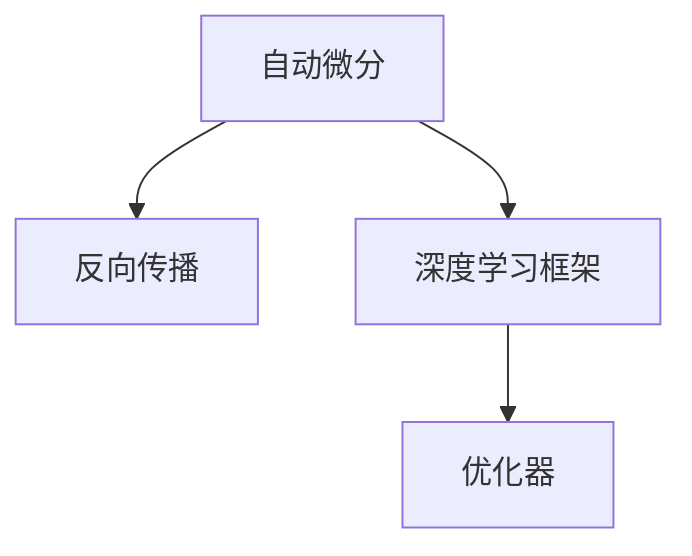
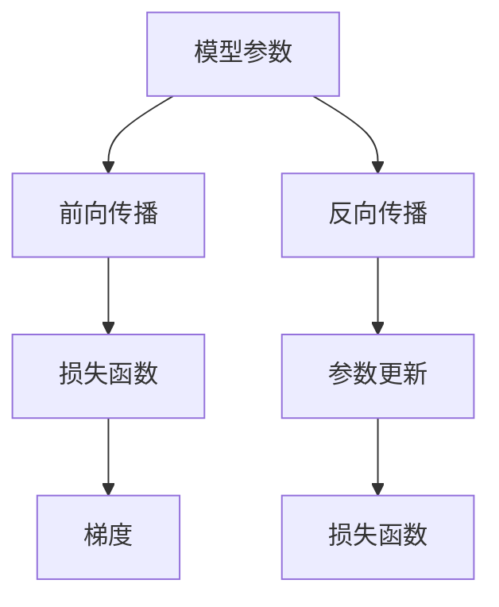

                 

# 自动微分：PyTorch与JAX的核心魔法

> 关键词：自动微分，PyTorch，JAX，深度学习，梯度计算，反向传播，TensorFlow，自动微分工具，优化器，深度学习框架

## 1. 背景介绍

### 1.1 问题由来
在深度学习领域，自动微分(Automatic Differentiation)是进行模型训练和优化不可或缺的核心技术之一。通过自动计算函数的导数，自动微分使得深度学习模型能够高效地进行梯度计算，进而实现参数更新。然而，传统的手工计算导数的方法往往耗时耗力，容易出错，难以扩展。因此，自动微分技术应运而生，极大地提升了深度学习的开发效率和模型性能。

本文将系统介绍自动微分的原理和实现方法，具体聚焦于PyTorch和JAX这两大深度学习框架中的自动微分机制，剖析其核心魔法，并展示其在深度学习领域中的应用。

## 2. 核心概念与联系

### 2.1 核心概念概述

为更好地理解自动微分技术，本节将介绍几个密切相关的核心概念：

- 自动微分(Automatic Differentiation)：通过自动计算函数的导数，自动微分能够自动化地计算出模型训练中每一步的梯度。
- 反向传播(Backpropagation)：深度学习模型中最常用的自动微分算法之一，通过链式法则从后向前计算梯度，从而更新模型参数。
- 深度学习框架(Deep Learning Frameworks)：如PyTorch、TensorFlow、JAX等，提供了丰富的自动微分工具和优化器，简化了深度学习的开发过程。
- 优化器(Optimizer)：如SGD、Adam等，用于更新模型参数，最小化损失函数。

这些核心概念之间的逻辑关系可以通过以下Mermaid流程图来展示：



这个流程图展示了这个概念链条之间的联系：

1. 自动微分是计算导数的基础。
2. 反向传播通过链式法则实现导数的自动计算。
3. 深度学习框架提供了自动微分的工具和优化器。
4. 优化器用于根据梯度更新模型参数，最小化损失函数。

### 2.2 核心概念原理和架构的 Mermaid 流程图



这个流程图展示了深度学习模型训练的基本流程：

1. 模型参数被输入到模型中，进行前向传播。
2. 前向传播的输出被送入损失函数，计算损失值。
3. 反向传播算法通过链式法则从损失函数开始，计算每个参数对损失的导数，即梯度。
4. 根据梯度，优化器更新模型参数，使得损失函数值最小化。

## 3. 核心算法原理 & 具体操作步骤

### 3.1 算法原理概述

自动微分通过计算函数的导数，帮助深度学习模型自动计算梯度，实现参数更新。其中，反向传播是深度学习中最常用的自动微分算法。

反向传播算法基于链式法则，从损失函数开始，依次计算每个参数对损失的偏导数。具体过程如下：

1. 前向传播：将输入数据输入模型，计算出模型输出。
2. 计算损失：将模型输出与真实标签计算损失值。
3. 反向传播：从损失值开始，依次计算每个参数对损失的导数，即梯度。
4. 参数更新：使用梯度下降等优化算法更新模型参数。

反向传播的核心是链式法则，即：

$$
\frac{\partial C}{\partial \theta_j} = \frac{\partial C}{\partial z_j} \frac{\partial z_j}{\partial \theta_j}
$$

其中，$C$为损失函数，$\theta_j$为模型参数，$z_j$为中间变量。

### 3.2 算法步骤详解

基于反向传播的自动微分过程，可以分为以下几个步骤：

**Step 1: 定义模型**

首先，定义一个深度学习模型，包括模型层、激活函数等。

```python
import torch.nn as nn

class MyModel(nn.Module):
    def __init__(self):
        super(MyModel, self).__init__()
        self.fc1 = nn.Linear(10, 10)
        self.fc2 = nn.Linear(10, 1)
    
    def forward(self, x):
        x = torch.relu(self.fc1(x))
        x = self.fc2(x)
        return x
```

**Step 2: 定义损失函数**

定义损失函数，如均方误差损失函数。

```python
criterion = nn.MSELoss()
```

**Step 3: 定义优化器**

定义优化器，如Adam优化器。

```python
optimizer = torch.optim.Adam(model.parameters(), lr=0.001)
```

**Step 4: 前向传播和计算梯度**

将训练数据输入模型，进行前向传播，并计算损失和梯度。

```python
model.train()
inputs, labels = ... # 准备训练数据
outputs = model(inputs)
loss = criterion(outputs, labels)
loss.backward()
optimizer.step()
```

**Step 5: 反向传播**

反向传播算法通过链式法则从损失函数开始，计算每个参数的梯度。

```python
loss = criterion(outputs, labels)
loss.backward()
```

其中，`loss.backward()`会自动计算模型中每个参数的梯度。

**Step 6: 参数更新**

根据梯度，使用优化器更新模型参数。

```python
optimizer.step()
```

### 3.3 算法优缺点

自动微分技术具有以下优点：

1. 自动化计算梯度，简化了深度学习模型的训练过程。
2. 计算导数速度快，减少手动计算梯度的误差和复杂度。
3. 支持复杂的非线性函数，使得深度学习模型能够处理更复杂的任务。

然而，自动微分技术也存在一些缺点：

1. 计算导数的复杂度可能非常高，特别是在模型非常深的情况下。
2. 导数计算过程中可能出现数值不稳定的情况，影响训练效果。
3. 导数计算过程中需要使用额外的内存空间，增加了内存消耗。

### 3.4 算法应用领域

自动微分技术在深度学习领域得到了广泛的应用，涵盖了诸如分类、回归、生成模型、强化学习等诸多任务。以下是几个具体的应用场景：

- 图像分类：如卷积神经网络(CNN)中的反向传播算法。
- 目标检测：如Faster R-CNN中的反向传播算法。
- 自然语言处理：如循环神经网络(RNN)中的反向传播算法。
- 强化学习：如深度Q网络(DQN)中的反向传播算法。
- 生成对抗网络(GANs)：如WGAN中的反向传播算法。

## 4. 数学模型和公式 & 详细讲解 & 举例说明

### 4.1 数学模型构建

以一个简单的线性回归模型为例，定义模型函数、损失函数和优化器。

$$
y = wx + b
$$

其中，$w$和$b$为模型参数。

损失函数为均方误差损失函数：

$$
L = \frac{1}{n} \sum_{i=1}^n (y_i - wx_i - b)^2
$$

优化器为梯度下降优化器：

$$
w \leftarrow w - \eta \frac{1}{n} \sum_{i=1}^n (y_i - wx_i - b)(2x_i)
$$

其中，$\eta$为学习率。

### 4.2 公式推导过程

从损失函数 $L$ 开始，使用链式法则计算梯度 $\nabla_wL$：

$$
\frac{\partial L}{\partial w} = \frac{1}{n} \sum_{i=1}^n \frac{\partial L}{\partial y} \frac{\partial y}{\partial w}
$$

其中：

$$
\frac{\partial L}{\partial y} = -2(x_i - w)
$$

$$
\frac{\partial y}{\partial w} = x_i
$$

因此：

$$
\frac{\partial L}{\partial w} = \frac{1}{n} \sum_{i=1}^n (-2(x_i - w)x_i)
$$

### 4.3 案例分析与讲解

以一个简单的线性回归模型为例，展示自动微分的计算过程。

首先，定义模型函数和损失函数：

```python
import torch

def model(x):
    return x * w + b

def loss(y_true, y_pred):
    return (y_true - y_pred)**2
```

然后，定义优化器并初始化模型参数：

```python
optimizer = torch.optim.SGD([w, b], lr=0.01)

inputs = torch.randn(10)
labels = torch.randn(10)

w = torch.zeros(1)
b = torch.zeros(1)
```

接着，进行前向传播和计算梯度：

```python
model = model(inputs)
loss = loss(labels, model)
loss.backward()
```

最后，根据梯度更新模型参数：

```python
optimizer.step()
```

通过这个简单的案例，可以看到自动微分的计算过程是自动化和高效的，能够方便地计算出模型参数的梯度，从而进行参数更新。

## 5. 项目实践：代码实例和详细解释说明

### 5.1 开发环境搭建

在进行自动微分实践前，我们需要准备好开发环境。以下是使用Python进行PyTorch和JAX开发的完整环境配置流程：

1. 安装Anaconda：从官网下载并安装Anaconda，用于创建独立的Python环境。

2. 创建并激活虚拟环境：
```bash
conda create -n pytorch-env python=3.8 
conda activate pytorch-env
```

3. 安装PyTorch和JAX：
```bash
conda install pytorch torchvision torchaudio cudatoolkit=11.1 -c pytorch -c conda-forge
conda install jax jaxlib
```

4. 安装TensorFlow：
```bash
conda install tensorflow
```

5. 安装各类工具包：
```bash
pip install numpy pandas scikit-learn matplotlib tqdm jupyter notebook ipython
```

完成上述步骤后，即可在`pytorch-env`环境中开始自动微分实践。

### 5.2 源代码详细实现

下面我们以一个简单的线性回归模型为例，展示使用PyTorch进行自动微分的代码实现。

首先，定义模型函数、损失函数和优化器：

```python
import torch
from torch import nn

class LinearRegressionModel(nn.Module):
    def __init__(self, input_dim, output_dim):
        super(LinearRegressionModel, self).__init__()
        self.fc1 = nn.Linear(input_dim, output_dim)
    
    def forward(self, x):
        x = self.fc1(x)
        return x

model = LinearRegressionModel(10, 1)
optimizer = torch.optim.Adam(model.parameters(), lr=0.01)
criterion = nn.MSELoss()

inputs = torch.randn(10)
labels = torch.randn(10)

model.train()
```

然后，进行前向传播和计算梯度：

```python
outputs = model(inputs)
loss = criterion(outputs, labels)
loss.backward()
optimizer.step()
```

接下来，我们展示使用JAX进行自动微分的代码实现。

首先，定义模型函数、损失函数和优化器：

```python
import jax
import jax.numpy as jnp
from jax import grad, jit, vmap

def model(x):
    return jnp.dot(x, w) + b

def loss(y_true, y_pred):
    return (y_true - y_pred)**2

w = jnp.zeros((input_dim, output_dim))
b = jnp.zeros(output_dim)
```

然后，使用JAX的`grad`函数计算梯度：

```python
grad_loss = grad(loss)
```

最后，使用JAX的`vmap`函数进行向量化的梯度计算：

```python
@jit
def update():
    loss = loss(labels, model(inputs))
    grad_loss = grad_loss(inputs, labels)
    optimizer.apply(grad_loss)
```

通过这些代码实现，我们可以看到PyTorch和JAX在自动微分方面的差异和优势。

### 5.3 代码解读与分析

这里我们详细解读一下关键代码的实现细节：

**PyTorch实现**：
- 使用`nn.Linear`定义线性层。
- 使用`nn.MSELoss`定义均方误差损失函数。
- 使用`torch.optim.Adam`定义Adam优化器。
- 使用`model.train()`开启训练模式，使得后续的操作在训练模式下进行。
- 使用`backward()`计算梯度，并使用`step()`更新模型参数。

**JAX实现**：
- 使用`jax.numpy`定义矩阵和向量操作。
- 使用`grad`函数计算梯度。
- 使用`vmap`函数进行向量化的梯度计算，加速梯度计算过程。

可以看到，JAX的自动微分机制更加灵活，可以支持更高效的向量化和并行计算，但需要更深入的理解和配置。而PyTorch则更加易于上手，适合快速迭代研究。

## 6. 实际应用场景

### 6.1 自动微分在深度学习中的应用

自动微分在深度学习中得到了广泛的应用，可以用于训练各种深度学习模型，如神经网络、卷积神经网络、循环神经网络等。以下是几个具体的应用场景：

- 图像分类：如卷积神经网络(CNN)中的反向传播算法。
- 目标检测：如Faster R-CNN中的反向传播算法。
- 自然语言处理：如循环神经网络(RNN)中的反向传播算法。
- 强化学习：如深度Q网络(DQN)中的反向传播算法。
- 生成对抗网络(GANs)：如WGAN中的反向传播算法。

### 6.2 自动微分在深度学习优化中的应用

自动微分不仅用于模型训练，还广泛应用于深度学习的优化中。以下是几个具体的应用场景：

- 参数更新：通过自动微分计算梯度，优化器能够高效地更新模型参数，最小化损失函数。
- 超参数调优：通过自动微分计算目标函数对超参数的导数，自动化的超参数调优方法可以显著提升模型性能。
- 模型融合：通过自动微分计算模型间的梯度，多种模型可以相互影响，形成更优的融合效果。

## 7. 工具和资源推荐

### 7.1 学习资源推荐

为了帮助开发者系统掌握自动微分的理论基础和实践技巧，这里推荐一些优质的学习资源：

1. 《深入理解深度学习》系列书籍：深入浅出地介绍了深度学习的基础知识，包括自动微分、反向传播等核心概念。
2. 《Python深度学习》课程：通过Python实现的深度学习项目，展示了自动微分在实际应用中的用法。
3. 《TensorFlow官方文档》：详细介绍了TensorFlow中的自动微分工具和优化器，适合深入学习和实践。
4. 《JAX官方文档》：JAX的官方文档，提供了丰富的自动微分工具和优化器，适合JAX的开发者。
5. 《自动微分：理论与实践》课程：斯坦福大学开设的深度学习课程，讲解了自动微分的理论基础和实现方法。

通过对这些资源的学习实践，相信你一定能够快速掌握自动微分的精髓，并用于解决实际的深度学习问题。

### 7.2 开发工具推荐

高效的开发离不开优秀的工具支持。以下是几款用于自动微分开发的常用工具：

1. PyTorch：基于Python的开源深度学习框架，灵活动态的计算图，适合快速迭代研究。提供了强大的自动微分工具和优化器，是深度学习研究的首选框架。
2. TensorFlow：由Google主导开发的开源深度学习框架，生产部署方便，适合大规模工程应用。支持自动微分，提供了丰富的优化器和模型库。
3. JAX：由Google开发的自动微分工具，支持多种编程语言，可以自动编译成高效的机器代码，适合高性能计算和科学计算。

合理利用这些工具，可以显著提升深度学习模型的开发效率，加快创新迭代的步伐。

### 7.3 相关论文推荐

自动微分技术的发展源于学界的持续研究。以下是几篇奠基性的相关论文，推荐阅读：

1. Backpropagation: Application of the chain rule for differentiation to stochastic computations: A new method of generating coherent patterns：介绍反向传播算法的基本原理和应用。
2. On the importance of initialization and momentum in deep learning：探讨了自动微分的训练过程中初始化方法和动量对模型性能的影响。
3. Automatic differentiation in machine learning: a survey：回顾了自动微分的理论基础和实践应用，适合了解自动微分的全貌。
4. Distributed automatic differentiation：通过分布式自动微分技术，实现了高效的大规模深度学习训练。
5. JAX: Compositional gradient-based machine learning in Python with indefinite differentials：JAX的官方论文，介绍了JAX的自动微分和优化器，适合了解JAX的实现细节。

这些论文代表了大自动微分技术的发展脉络。通过学习这些前沿成果，可以帮助研究者把握学科前进方向，激发更多的创新灵感。

## 8. 总结：未来发展趋势与挑战

### 8.1 总结

本文对自动微分技术进行了全面系统的介绍，系统讲解了自动微分的原理和实现方法，特别是PyTorch和JAX这两大深度学习框架中的自动微分机制。通过理论推导和代码实现，展示了自动微分在深度学习中的应用。

通过本文的系统梳理，可以看到，自动微分技术已经成为深度学习的重要组成部分，极大地提升了深度学习模型的开发效率和性能。未来，随着自动微分技术的进一步发展，深度学习模型的设计和训练将更加高效和灵活。

### 8.2 未来发展趋势

展望未来，自动微分技术将呈现以下几个发展趋势：

1. 深度学习模型的设计将更加灵活，支持更多复杂的非线性函数。
2. 自动微分的计算速度将进一步提升，支持更大规模的深度学习模型。
3. 自动微分的并行计算将得到更好的支持，支持分布式计算和高性能计算。
4. 自动微分将与其他深度学习技术结合，如强化学习、生成对抗网络等，拓展自动微分的应用领域。
5. 自动微分的优化算法将不断改进，支持更多优化器和超参数调优方法。

### 8.3 面临的挑战

尽管自动微分技术已经取得了瞩目成就，但在迈向更加智能化、普适化应用的过程中，它仍面临着诸多挑战：

1. 自动微分计算的复杂度可能非常高，特别是在模型非常深的情况下。
2. 导数计算过程中可能出现数值不稳定的情况，影响训练效果。
3. 自动微分的并行计算和分布式计算技术需要进一步优化和完善。
4. 自动微分的优化算法和超参数调优方法仍需不断改进。

### 8.4 研究展望

未来的研究需要在以下几个方面寻求新的突破：

1. 探索更高效的自动微分算法：开发更加高效的自动微分算法，在保证精度的同时，减少计算复杂度和内存消耗。
2. 引入更多先验知识：将符号化的先验知识，如知识图谱、逻辑规则等，与神经网络模型进行巧妙融合，引导自动微分过程学习更准确、合理的语言模型。
3. 引入因果推断和对比学习思想：通过引入因果推断和对比学习思想，增强自动微分模型建立稳定因果关系的能力，学习更加普适、鲁棒的语言表征。
4. 结合因果分析和博弈论工具：将因果分析方法引入自动微分模型，识别出模型决策的关键特征，增强输出解释的因果性和逻辑性。
5. 纳入伦理道德约束：在自动微分模型的训练目标中引入伦理导向的评估指标，过滤和惩罚有偏见、有害的输出倾向。

这些研究方向的探索，必将引领自动微分技术迈向更高的台阶，为构建安全、可靠、可解释、可控的智能系统铺平道路。面向未来，自动微分技术还需要与其他人工智能技术进行更深入的融合，如知识表示、因果推理、强化学习等，多路径协同发力，共同推动深度学习模型的进步。

## 9. 附录：常见问题与解答

**Q1：自动微分是否只适用于深度学习模型？**

A: 自动微分可以应用于任何可导的函数，不仅仅限于深度学习模型。自动微分技术在优化、统计、金融等领域都有广泛应用。

**Q2：自动微分是否会影响模型的训练速度？**

A: 自动微分的计算复杂度可能会影响训练速度，特别是在模型非常深的情况下。但通过优化自动微分算法和并行计算技术，可以显著提升训练速度。

**Q3：自动微分是否会造成内存消耗过大？**

A: 自动微分需要计算梯度，可能会占用大量内存。但通过优化自动微分算法和内存管理技术，可以降低内存消耗。

**Q4：自动微分是否适用于所有优化器？**

A: 自动微分适用于任何优化器，如SGD、Adam、Adagrad等。不同优化器对自动微分的要求不同，但均可以通过自动微分技术进行高效训练。

**Q5：自动微分是否能够提高模型的准确性？**

A: 自动微分可以显著提高模型的准确性，通过自动计算梯度，优化器能够高效地更新模型参数，最小化损失函数，从而提升模型性能。

---

作者：禅与计算机程序设计艺术 / Zen and the Art of Computer Programming

