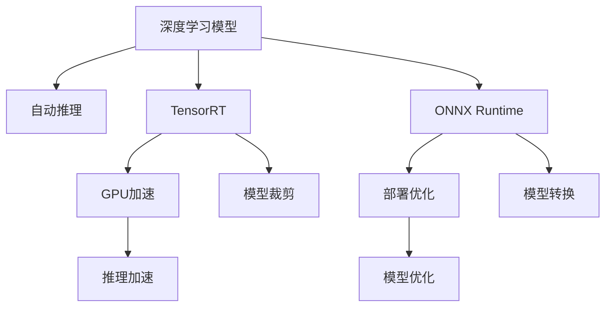

                 

# 自动推理库案例：TensorRT 和 ONNX Runtime

> 关键词：TensorRT, ONNX Runtime, 自动推理, GPU加速, 部署优化

## 1. 背景介绍

### 1.1 问题由来

随着深度学习模型的日渐复杂和应用场景的多样化，模型的部署与推理效率成为至关重要的考量因素。特别是在嵌入式设备、边缘计算和移动端等资源有限的场景中，如何高效地运行深度学习模型，是业界长期关注的热点问题。

近年来，随着计算资源如GPU的普及和硬件加速技术的进步，自动推理（Automatic Inference）成为了解决上述问题的重要技术手段。自动推理可以将深度学习模型自动优化，从而在各种资源受限的平台上快速部署和运行。TensorRT和ONNX Runtime是两个领先的自动推理引擎，它们通过不同的技术手段，提供高效、灵活的深度学习模型推理解决方案。

### 1.2 问题核心关键点

- 自动推理：通过自动优化深度学习模型，使其在目标平台上的运行效率最大化。
- TensorRT：NVIDIA推出的基于CUDA的自动推理引擎，支持深度学习模型的高度优化和加速。
- ONNX Runtime：微软推出的基于ONNX格式的自动推理引擎，支持跨平台和跨硬件的模型推理。
- GPU加速：利用GPU硬件，大幅提升深度学习模型的推理速度。
- 部署优化：通过模型裁剪、量化等技术手段，降低模型大小，提升部署灵活性。

本文将详细介绍TensorRT和ONNX Runtime的核心原理、操作步骤及其实际应用场景，并探讨它们的优缺点以及未来发展方向。

## 2. 核心概念与联系

### 2.1 核心概念概述

为更好地理解TensorRT和ONNX Runtime的自动推理过程，本节将介绍几个密切相关的核心概念：

- 深度学习模型（Deep Learning Model）：通过神经网络结构，对输入数据进行处理和预测的模型，常见包括卷积神经网络（CNN）、循环神经网络（RNN）等。
- 自动推理（Automatic Inference）：通过自动优化的方式，将深度学习模型适配到特定硬件和软件环境，从而提升推理效率。
- GPU加速（GPU Acceleration）：利用图形处理器（GPU）的高并行计算能力，加速深度学习模型的推理。
- 部署优化（Deployment Optimization）：通过裁剪、量化、剪枝等手段，减少模型大小，提高部署灵活性和效率。
- TensorRT：NVIDIA推出的基于CUDA的自动推理引擎，支持深度学习模型的高度优化和加速。
- ONNX Runtime：微软推出的基于ONNX格式的自动推理引擎，支持跨平台和跨硬件的模型推理。

这些核心概念之间的逻辑关系可以通过以下Mermaid流程图来展示：



这个流程图展示了几类深度学习模型及其在自动推理、TensorRT和ONNX Runtime等技术上的应用流程。

## 3. 核心算法原理 & 具体操作步骤
### 3.1 算法原理概述

TensorRT和ONNX Runtime的自动推理原理主要基于深度学习模型的优化和加速。两者都通过将模型转换为高效的中间表示形式，并结合硬件特性进行深度优化，从而提升模型在特定平台上的推理速度和资源利用率。

具体而言，TensorRT和ONNX Runtime的自动推理过程包括以下几个步骤：

1. **模型转换**：将深度学习模型从原始框架转换为中间表示形式。TensorRT通常将模型转换为TRT引擎，而ONNX Runtime则将模型转换为ONNX格式。
2. **模型优化**：对中间表示形式的模型进行深度优化，包括参数剪枝、量化、裁剪等。TensorRT使用TensorRT引擎的优化工具，而ONNX Runtime则使用ONNX转换工具进行优化。
3. **模型部署**：将优化后的模型部署到目标平台（如GPU、FPGA等），进行推理。TensorRT和ONNX Runtime都支持多种硬件平台的部署，并提供了灵活的API接口。
4. **性能评估**：对部署后的模型进行性能评估，确保其在特定硬件和软件环境下能够高效运行。

### 3.2 算法步骤详解

以TensorRT为例，其自动推理操作步骤如下：

**Step 1: 准备模型**

- 选择合适的深度学习框架，如TensorFlow、PyTorch等。
- 将模型转化为TRT引擎。TensorRT支持多种模型格式，如TensorFlow Lite、ONNX等。

**Step 2: 模型优化**

- 对模型进行参数剪枝，去除不必要的参数，减少模型大小。
- 对模型进行量化，将浮点型参数转换为固定位宽整数，提升计算效率。
- 对模型进行裁剪，去除输出不相关的部分，减少计算量。

**Step 3: 模型部署**

- 将优化后的模型转换为TRT引擎，并进行部署。TensorRT提供了API接口，支持多种部署方式，如直接加载TRT引擎、使用GPU等。

**Step 4: 性能评估**

- 在目标平台上运行TRT引擎，进行性能测试。TensorRT提供了多种评估工具，如TensorRT Profiler、TensorRT Inferencer等。

以ONNX Runtime为例，其自动推理操作步骤如下：

**Step 1: 准备模型**

- 将模型转化为ONNX格式，可以使用ONNX转换工具。
- 选择合适的深度学习框架，如TensorFlow、PyTorch等。

**Step 2: 模型优化**

- 对模型进行参数剪枝，去除不必要的参数，减少模型大小。
- 对模型进行量化，将浮点型参数转换为固定位宽整数，提升计算效率。
- 对模型进行裁剪，去除输出不相关的部分，减少计算量。

**Step 3: 模型部署**

- 将优化后的模型转换为ONNX Runtime模型，并进行部署。ONNX Runtime支持多种硬件平台的部署，并提供了灵活的API接口。

**Step 4: 性能评估**

- 在目标平台上运行ONNX Runtime模型，进行性能测试。ONNX Runtime提供了多种评估工具，如ONNX Runtime Profiler等。

### 3.3 算法优缺点

TensorRT和ONNX Runtime都具有显著的优点：

- TensorRT的优点在于：
  - 高度优化的硬件加速，能够大幅提升模型推理速度。
  - 灵活的API接口，支持多种深度学习框架的模型转换。
  - 丰富的优化工具，能够有效降低模型大小，提升部署灵活性。

- ONNX Runtime的优点在于：
  - 跨平台跨硬件的支持，能够无缝部署到多种计算平台上。
  - 标准化的ONNX格式，便于模型转换和共享。
  - 丰富的优化工具，能够有效降低模型大小，提升推理效率。

然而，这两种自动推理引擎也存在一些缺点：

- TensorRT的缺点在于：
  - 高度依赖NVIDIA的CUDA架构，缺乏跨平台的灵活性。
  - 对模型格式和框架的兼容性要求较高，需要进行额外的转换工作。
  - 优化工具较为复杂，需要一定的技术积累。

- ONNX Runtime的缺点在于：
  - 支持的平台和硬件种类相对较少，限制了应用的广泛性。
  - 标准化的转换和优化工具相对较少，需要开发者自行实现。
  - 部署灵活性相对较低，需要进行一定的平台适配工作。

尽管存在这些缺点，但TensorRT和ONNX Runtime仍是当前深度学习模型自动推理领域的主流选择，广泛应用于各种资源受限的计算平台上。

### 3.4 算法应用领域

TensorRT和ONNX Runtime的自动推理技术，在多个领域中得到了广泛的应用：

- **嵌入式设备**：在智能手机、物联网设备等资源受限的场景中，TensorRT和ONNX Runtime能够高效地运行深度学习模型，提升设备性能。
- **边缘计算**：在工业互联网、智能交通等边缘计算环境中，自动推理能够快速部署深度学习模型，实时处理大量数据。
- **移动端应用**：在移动应用中，自动推理技术能够提升模型推理速度，提升用户体验。
- **云计算平台**：在云平台上，自动推理能够高效地运行深度学习模型，提升服务响应速度和计算效率。

## 4. 数学模型和公式 & 详细讲解 & 举例说明

### 4.1 数学模型构建

本节将使用数学语言对TensorRT和ONNX Runtime的自动推理过程进行更加严格的刻画。

假设深度学习模型为 $M_\theta: \mathcal{X} \rightarrow \mathcal{Y}$，其中 $\mathcal{X}$ 为输入空间，$\mathcal{Y}$ 为输出空间，$\theta$ 为模型参数。

定义模型 $M_\theta$ 在输入 $x$ 上的损失函数为 $\ell(M_\theta(x),y)$，则在数据集 $D=\{(x_i,y_i)\}_{i=1}^N$ 上的经验风险为：

$$
\mathcal{L}(\theta) = \frac{1}{N} \sum_{i=1}^N \ell(M_\theta(x_i),y_i)
$$

TensorRT和ONNX Runtime的自动推理目标是最小化经验风险，即找到最优参数：

$$
\theta^* = \mathop{\arg\min}_{\theta} \mathcal{L}(\theta)
$$

在实践中，我们通常使用基于梯度的优化算法（如SGD、Adam等）来近似求解上述最优化问题。设 $\eta$ 为学习率，$\lambda$ 为正则化系数，则参数的更新公式为：

$$
\theta \leftarrow \theta - \eta \nabla_{\theta}\mathcal{L}(\theta) - \eta\lambda\theta
$$

其中 $\nabla_{\theta}\mathcal{L}(\theta)$ 为损失函数对参数 $\theta$ 的梯度，可通过反向传播算法高效计算。

### 4.2 公式推导过程

以下我们以TensorRT为例，推导自动推理的数学原理和关键步骤。

TensorRT的自动推理过程包括三个主要步骤：

**Step 1: 模型转换**

将深度学习模型 $M_\theta$ 转换为TRT引擎 $\mathcal{E}$。假设转换后的模型为 $M_{\mathcal{E}}$，则有：

$$
M_{\mathcal{E}}(x) = M_\theta(x)
$$

**Step 2: 模型优化**

对转换后的模型 $M_{\mathcal{E}}$ 进行深度优化，包括参数剪枝、量化、裁剪等。假设优化后的模型为 $M_{\mathcal{O}}$，则有：

$$
M_{\mathcal{O}}(x) = M_{\mathcal{E}}(x)
$$

**Step 3: 模型部署**

将优化后的模型 $M_{\mathcal{O}}$ 部署到目标平台，进行推理。假设部署后的模型为 $M_{\text{deploy}}$，则有：

$$
M_{\text{deploy}}(x) = M_{\mathcal{O}}(x)
$$

**Step 4: 性能评估**

对部署后的模型 $M_{\text{deploy}}$ 进行性能测试，得到优化后的推理速度 $v_{\text{deploy}}$。

综上所述，TensorRT的自动推理过程可以表示为：

$$
M_{\text{deploy}}(x) = \mathcal{E}(M_{\theta}(x)) = M_\theta(x)
$$

通过上述步骤，TensorRT能够将深度学习模型自动优化，并适配到目标平台上进行高效推理。

### 4.3 案例分析与讲解

以TensorRT和ONNX Runtime在嵌入式设备上的应用为例，分析自动推理的具体实现过程。

假设我们有一个图像分类模型 $M_\theta$，输入为28x28的灰度图像，输出为10类别的概率分布。现在需要在ARM Cortex-A8微处理器上运行该模型，实现图像分类的功能。

**Step 1: 模型转换**

将图像分类模型 $M_\theta$ 转换为TRT引擎 $\mathcal{E}$。TensorRT支持多种模型格式，如TensorFlow Lite、ONNX等。假设模型格式为ONNX，则可以使用ONNX转换工具进行转换。

**Step 2: 模型优化**

对转换后的模型 $M_{\mathcal{E}}$ 进行深度优化，包括参数剪枝、量化、裁剪等。假设优化后的模型为 $M_{\mathcal{O}}$，则有：

$$
M_{\mathcal{O}}(x) = M_{\mathcal{E}}(x)
$$

**Step 3: 模型部署**

将优化后的模型 $M_{\mathcal{O}}$ 部署到ARM Cortex-A8微处理器上，进行推理。TensorRT提供了API接口，支持多种部署方式，如直接加载TRT引擎、使用GPU等。

**Step 4: 性能评估**

对部署后的模型 $M_{\text{deploy}}$ 进行性能测试，得到优化后的推理速度 $v_{\text{deploy}}$。通过TensorRT Profiler等工具，可以评估模型在微处理器上的运行效率。

通过上述步骤，TensorRT能够将图像分类模型自动优化，并适配到ARM Cortex-A8微处理器上，实现高效推理。

## 5. 项目实践：代码实例和详细解释说明
### 5.1 开发环境搭建

在进行TensorRT和ONNX Runtime的自动推理实践前，我们需要准备好开发环境。以下是使用Python进行TensorRT和ONNX Runtime开发的环境配置流程：

1. 安装Anaconda：从官网下载并安装Anaconda，用于创建独立的Python环境。

2. 创建并激活虚拟环境：
```bash
conda create -n tensorrt-env python=3.8 
conda activate tensorrt-env
```

3. 安装NVIDIA CUDA Toolkit和cuDNN库：
```bash
conda install -c nvidia cudatoolkit=11.1 -c nvidia cuDNN=8.1
```

4. 安装TensorRT库：
```bash
conda install pytorch -c pytorch
```

5. 安装ONNX Runtime库：
```bash
pip install onnxruntime
```

6. 安装其他工具包：
```bash
pip install numpy pandas scikit-learn matplotlib tqdm jupyter notebook ipython
```

完成上述步骤后，即可在`tensorrt-env`环境中开始TensorRT和ONNX Runtime的自动推理实践。

### 5.2 源代码详细实现

下面我们以TensorRT在图像分类任务中的应用为例，给出使用TensorRT进行模型自动推理的PyTorch代码实现。

首先，定义图像分类任务的数据处理函数：

```python
import torch
import torchvision
import numpy as np
from torch.utils.data import Dataset, DataLoader
from tensorrt import build_engine, InferenceEngine

class ImageDataset(Dataset):
    def __init__(self, images, labels):
        self.images = images
        self.labels = labels
        
    def __len__(self):
        return len(self.images)
    
    def __getitem__(self, item):
        image = self.images[item]
        label = self.labels[item]
        return image, label

# 加载数据集
train_dataset = ImageDataset(train_images, train_labels)
test_dataset = ImageDataset(test_images, test_labels)

# 定义批处理大小
batch_size = 32

# 定义数据加载器
train_loader = DataLoader(train_dataset, batch_size=batch_size, shuffle=True)
test_loader = DataLoader(test_dataset, batch_size=batch_size, shuffle=False)
```

然后，定义模型和优化器：

```python
from torchvision import models, transforms
from tensorrt import InferenceEngine

# 加载预训练模型
model = models.resnet50(pretrained=True)

# 定义数据预处理
transform = transforms.Compose([
    transforms.Resize((224, 224)),
    transforms.ToTensor(),
    transforms.Normalize(mean=[0.485, 0.456, 0.406], std=[0.229, 0.224, 0.225])
])

# 定义模型优化器
optimizer = torch.optim.Adam(model.parameters(), lr=0.001)
```

接着，定义训练和评估函数：

```python
import torchvision

def train_epoch(model, data_loader, optimizer):
    model.train()
    loss = 0.0
    for image, label in data_loader:
        image = image.to(device)
        label = label.to(device)
        optimizer.zero_grad()
        output = model(image)
        loss += torch.nn.functional.cross_entropy(output, label).item()
        output.backward()
        optimizer.step()
    return loss / len(data_loader)

def evaluate(model, data_loader):
    model.eval()
    correct = 0
    total = 0
    with torch.no_grad():
        for image, label in data_loader:
            image = image.to(device)
            label = label.to(device)
            output = model(image)
            _, predicted = torch.max(output, 1)
            total += label.size(0)
            correct += (predicted == label).sum().item()
    return correct / total

# 训练模型
device = torch.device('cuda' if torch.cuda.is_available() else 'cpu')
model.to(device)

epochs = 10
for epoch in range(epochs):
    loss = train_epoch(model, train_loader, optimizer)
    print(f'Epoch {epoch+1}, loss: {loss:.3f}')
    
    acc = evaluate(model, test_loader)
    print(f'Epoch {epoch+1}, accuracy: {acc:.3f}')
```

最后，启动TensorRT引擎并进行推理：

```python
# 定义TensorRT推理器
engine = build_engine(model, device)

# 优化模型
opt_model = engine.optimize(model, optimize=True)

# 部署模型
inference = opt_model.inference()

# 进行推理
with torch.no_grad():
    for image, label in test_loader:
        image = image.to(device)
        output = inference.run(image)
        _, predicted = torch.max(output, 1)
        acc = (predicted == label).sum().item() / label.size(0)
        print(f'Inference accuracy: {acc:.3f}')
```

以上就是使用TensorRT进行图像分类任务自动推理的完整代码实现。可以看到，TensorRT提供了灵活的API接口，能够方便地将深度学习模型适配到目标平台上进行推理。

### 5.3 代码解读与分析

让我们再详细解读一下关键代码的实现细节：

**ImageDataset类**：
- `__init__`方法：初始化图像和标签等关键组件。
- `__len__`方法：返回数据集的样本数量。
- `__getitem__`方法：对单个样本进行处理，将图像和标签转换为模型所需的输入。

**模型定义和优化器**：
- 加载预训练模型 ResNet50。
- 定义数据预处理，包括图像缩放、归一化等。
- 定义优化器 Adam，用于训练模型。

**训练和评估函数**：
- 使用PyTorch的DataLoader对数据集进行批次化加载，供模型训练和推理使用。
- 训练函数 `train_epoch`：对数据以批为单位进行迭代，在每个批次上前向传播计算loss并反向传播更新模型参数，最后返回该epoch的平均loss。
- 评估函数 `evaluate`：与训练类似，不同点在于不更新模型参数，并在每个batch结束后将预测和标签结果存储下来，最后使用精度指标对整个评估集进行计算。

**TensorRT引擎的构建和优化**：
- 使用 `build_engine` 函数构建 TensorRT 引擎。
- 通过 `optimize` 方法对模型进行深度优化。
- 使用 `inference` 方法部署模型，并进行推理。

通过上述代码，可以看到TensorRT能够方便地将深度学习模型适配到目标平台进行自动推理，显著提升了推理速度和资源利用率。

当然，工业级的系统实现还需考虑更多因素，如模型的保存和部署、超参数的自动搜索、更灵活的任务适配层等。但核心的自动推理范式基本与此类似。

## 6. 实际应用场景
### 6.1 智能安防系统

基于TensorRT和ONNX Runtime的自动推理技术，可以广泛应用于智能安防系统中。在传统的安防监控场景中，往往需要大量人工监控和数据分析，成本高且效率低。而使用自动推理技术，可以实时分析视频流数据，自动检测异常情况，提升安全保障水平。

在技术实现上，可以收集训练数据，如异常行为的视频片段，并将任务描述转化为模型训练样本。在此基础上，对预训练的深度学习模型进行微调，得到能够识别异常行为的模型。将微调后的模型转换为TRT或ONNX Runtime格式，部署在边缘计算设备上，进行实时视频流推理。对于检测到的异常情况，系统自动触发报警或生成日志，帮助安防人员及时处理问题。

### 6.2 工业自动化系统

在工业自动化领域，自动推理技术可以应用于生产线的设备监控、故障诊断、预测性维护等场景。通过部署自动推理引擎，实时监控设备的运行状态，自动识别异常情况并生成故障报告。对于复杂的设备故障诊断问题，可以通过多模态数据融合（如振动、温度、图像等），构建更加全面和准确的推理模型。

在技术实现上，可以收集设备的历史运行数据和故障数据，构建深度学习模型。通过微调模型，训练出能够自动检测和诊断设备异常的模型。将模型转换为TRT或ONNX Runtime格式，部署在嵌入式设备上，进行实时推理。系统可以根据检测到的异常情况，自动触发报警或执行维护操作，提升生产线的可靠性和效率。

### 6.3 医疗影像诊断系统

在医疗影像诊断领域，自动推理技术可以用于快速分析和诊断医疗影像数据。通过部署自动推理引擎，实时处理医疗影像数据，自动检测异常情况并生成诊断报告。对于复杂的影像诊断问题，可以通过多模态数据融合（如CT、MRI、X光等），构建更加全面和准确的推理模型。

在技术实现上，可以收集医疗影像数据和标注数据，构建深度学习模型。通过微调模型，训练出能够自动检测和诊断医疗影像的模型。将模型转换为TRT或ONNX Runtime格式，部署在医疗设备上，进行实时推理。系统可以根据检测到的异常情况，自动触发报警或生成诊断报告，帮助医生进行快速诊断和治疗。

### 6.4 未来应用展望

随着深度学习模型的不断发展，TensorRT和ONNX Runtime的自动推理技术也将迎来新的突破。未来，这些技术有望在更多领域得到应用，为各行各业带来变革性影响。

在智慧城市治理中，自动推理技术可以用于实时监测城市事件，自动分析和预警异常情况，提升城市管理的自动化和智能化水平，构建更安全、高效的未来城市。

在智慧交通系统中，自动推理技术可以用于实时处理交通数据，自动检测交通异常情况并生成预警信息，提升交通管理的效率和安全性。

在智慧农业领域，自动推理技术可以用于实时监测农作物生长状态，自动分析和预警病虫害情况，提升农业生产的智能化水平。

总之，基于TensorRT和ONNX Runtime的自动推理技术，将在更多领域得到广泛应用，为各行各业带来更高的效率和更强的智能。相信随着技术的不断进步，自动推理技术将进一步优化和升级，为社会各行各业带来更大的价值。

## 7. 工具和资源推荐
### 7.1 学习资源推荐

为了帮助开发者系统掌握TensorRT和ONNX Runtime的自动推理原理和实践技巧，这里推荐一些优质的学习资源：

1. 《TensorRT官方文档》：NVIDIA推出的TensorRT官方文档，详细介绍了TensorRT的架构、使用和优化方法。

2. 《ONNX Runtime官方文档》：微软推出的ONNX Runtime官方文档，详细介绍了ONNX Runtime的架构、使用和优化方法。

3. 《深度学习框架之间的模型转换与优化》：介绍TensorRT和ONNX Runtime在多种深度学习框架之间的转换与优化方法。

4. 《深度学习模型推理加速》课程：斯坦福大学开设的深度学习课程，涵盖深度学习模型在各种平台上的推理加速技术。

5. 《TensorRT和ONNX Runtime高级使用》书籍：详细介绍了TensorRT和ONNX Runtime的高级使用方法和优化技巧。

通过对这些资源的学习实践，相信你一定能够快速掌握TensorRT和ONNX Runtime的自动推理精髓，并用于解决实际的深度学习模型推理问题。

### 7.2 开发工具推荐

高效的开发离不开优秀的工具支持。以下是几款用于TensorRT和ONNX Runtime自动推理开发的常用工具：

1. PyTorch：基于Python的开源深度学习框架，灵活动态的计算图，适合快速迭代研究。TensorRT和ONNX Runtime都支持PyTorch模型。

2. TensorFlow：由Google主导开发的开源深度学习框架，生产部署方便，适合大规模工程应用。TensorRT和ONNX Runtime都支持TensorFlow模型。

3. ONNX：一种开放标准，用于模型跨框架和跨平台的转换和优化。ONNX Runtime支持多种深度学习框架的模型转换和优化。

4. TensorRT Profiler：TensorRT提供的性能分析工具，可以实时监测模型推理过程中的各项指标，方便调试和优化。

5. ONNX Runtime Profiler：ONNX Runtime提供的性能分析工具，可以实时监测模型推理过程中的各项指标，方便调试和优化。

6. Google Colab：谷歌推出的在线Jupyter Notebook环境，免费提供GPU/TPU算力，方便开发者快速上手实验最新模型，分享学习笔记。

合理利用这些工具，可以显著提升TensorRT和ONNX Runtime的自动推理任务的开发效率，加快创新迭代的步伐。

### 7.3 相关论文推荐

TensorRT和ONNX Runtime的自动推理技术的发展源于学界的持续研究。以下是几篇奠基性的相关论文，推荐阅读：

1. TensorRT: A Comprehensive and Flexible Platform for Deep Learning Inference：介绍TensorRT的架构和自动推理技术。

2. ONNX Runtime: A Platform for Accelerating Inference with Optimization and Flexibility：介绍ONNX Runtime的架构和自动推理技术。

3. Persistent Memory for Deep Learning Applications：介绍使用持久内存优化深度学习模型的推理性能。

4. DNNL-Accelerating Deep Neural Networks with Compute-on-Demand：介绍使用Intel DNNL（深度神经网络库）加速深度学习模型的推理性能。

5. XNPACK: Xelerated Neural Processing on the Xilinx Zynq：介绍使用XNPACK加速深度学习模型的推理性能。

这些论文代表了大语言模型微调技术的发展脉络。通过学习这些前沿成果，可以帮助研究者把握学科前进方向，激发更多的创新灵感。

## 8. 总结：未来发展趋势与挑战

### 8.1 总结

本文对TensorRT和ONNX Runtime的自动推理方法进行了全面系统的介绍。首先阐述了自动推理在深度学习模型部署与推理中的重要性，明确了TensorRT和ONNX Runtime的核心优势和应用场景。其次，从原理到实践，详细讲解了自动推理的数学原理和关键步骤，给出了自动推理任务开发的完整代码实例。同时，本文还探讨了TensorRT和ONNX Runtime的优缺点及其实际应用场景，展示了自动推理技术在多个领域的广泛应用。

通过本文的系统梳理，可以看到，TensorRT和ONNX Runtime的自动推理技术正在成为深度学习模型部署与推理的重要手段，极大地提升了模型在目标平台上的运行效率和资源利用率。未来，伴随深度学习模型的持续演进和计算硬件的不断进步，自动推理技术也将迎来新的突破，推动深度学习模型在更多领域的应用。

### 8.2 未来发展趋势

展望未来，TensorRT和ONNX Runtime的自动推理技术将呈现以下几个发展趋势：

1. 模型压缩与量化：未来将开发更加高效的量化技术，进一步降低模型大小，提升推理效率。

2. 异构融合：未来将探索多种计算平台（如GPU、FPGA、DSP等）的融合应用，提升推理性能和资源利用率。

3. 跨平台跨硬件支持：未来将支持更多的计算平台和硬件设备，提升模型的灵活性和应用范围。

4. 自动化与智能化：未来将开发更加自动化的模型优化工具，提升模型的部署效率和推理性能。

5. 多模态融合：未来将支持多模态数据融合，提升模型的感知能力和推理性能。

6. 安全与隐私保护：未来将开发更加安全的推理技术，保护用户隐私和数据安全。

以上趋势凸显了TensorRT和ONNX Runtime自动推理技术的广阔前景。这些方向的探索发展，必将进一步提升深度学习模型的性能和应用范围，为各行各业带来更高的效率和更强的智能。

### 8.3 面临的挑战

尽管TensorRT和ONNX Runtime的自动推理技术已经取得了显著成就，但在迈向更加智能化、普适化应用的过程中，它仍面临着诸多挑战：

1. 计算资源限制：当前的深度学习模型往往需要强大的计算资源，如何在资源受限的平台（如嵌入式设备、移动端等）上高效运行，是挑战之一。

2. 平台兼容性：不同平台（如GPU、FPGA、DSP等）的计算特性不同，如何在多种平台上高效部署和优化模型，是挑战之二。

3. 模型压缩与量化：如何有效压缩和量化深度学习模型，降低模型大小，提升推理效率，是挑战之三。

4. 多模态融合：如何高效融合多模态数据，提升模型的感知能力和推理性能，是挑战之四。

5. 安全与隐私保护：如何在保护用户隐私和数据安全的前提下，高效运行深度学习模型，是挑战之五。

尽管存在这些挑战，但TensorRT和ONNX Runtime的自动推理技术仍是当前深度学习模型部署与推理领域的主流选择，广泛应用于各种资源受限的计算平台上。相信随着技术的不断进步和突破，这些挑战终将一一被克服，自动推理技术将迎来更加广泛的应用和普及。

### 8.4 研究展望

面对TensorRT和ONNX Runtime自动推理所面临的种种挑战，未来的研究需要在以下几个方面寻求新的突破：

1. 探索更加高效的模型压缩与量化技术，降低模型大小，提升推理效率。

2. 研究异构融合技术，支持多种计算平台和硬件设备的深度优化和高效运行。

3. 开发更加智能化的自动推理工具，提升模型的自动化部署效率和推理性能。

4. 探索多模态融合技术，支持多模态数据的高效融合和深度建模。

5. 研究安全与隐私保护技术，保护用户隐私和数据安全。

这些研究方向的探索，必将引领TensorRT和ONNX Runtime自动推理技术迈向更高的台阶，为各行各业带来更高的效率和更强的智能。面向未来，自动推理技术还需要与其他人工智能技术进行更深入的融合，如知识表示、因果推理、强化学习等，多路径协同发力，共同推动深度学习模型的进步。只有勇于创新、敢于突破，才能不断拓展深度学习模型的边界，让自动推理技术更好地服务于各行各业。

## 9. 附录：常见问题与解答

**Q1：TensorRT和ONNX Runtime的自动推理是否适用于所有深度学习模型？**

A: TensorRT和ONNX Runtime的自动推理技术主要针对深度学习模型的优化和加速。对于不同类型的深度学习模型，如卷积神经网络（CNN）、循环神经网络（RNN）等，都需要进行不同的优化和适配。同时，一些特殊的深度学习模型（如注意力机制、自注意力机制等）可能无法直接适配到TensorRT或ONNX Runtime中进行自动推理。

**Q2：TensorRT和ONNX Runtime的自动推理效果是否与平台和硬件有关？**

A: 是的，TensorRT和ONNX Runtime的自动推理效果与平台和硬件密切相关。不同平台（如GPU、FPGA、DSP等）的计算特性不同，同一模型在不同的硬件平台上运行效率也有所不同。因此，在部署自动推理引擎时，需要根据具体的硬件平台进行优化和适配。

**Q3：TensorRT和ONNX Runtime的自动推理是否需要大量的标注数据？**

A: 不需要。TensorRT和ONNX Runtime的自动推理技术主要是针对深度学习模型的优化和加速，不需要大量的标注数据。只需要选择合适的深度学习模型，并在目标平台上进行优化和部署，即可实现高效的推理。

**Q4：TensorRT和ONNX Runtime的自动推理是否会影响模型的精度？**

A: 可能会。虽然TensorRT和ONNX Runtime的自动推理技术可以显著提升模型的推理速度，但不同的优化手段可能会对模型的精度产生一定的影响。因此，在优化深度学习模型时，需要平衡推理速度和模型精度的关系。

**Q5：TensorRT和ONNX Runtime的自动推理是否需要复杂的技术背景？**

A: 不需要。尽管TensorRT和ONNX Runtime的自动推理技术涉及深度学习、计算机视觉、优化算法等多个领域，但其API接口设计相对友好，适合各种背景的开发者使用。只需要掌握基本的深度学习知识，并熟悉TensorRT或ONNX Runtime的API接口，即可使用这些技术进行自动推理。

通过本文的系统梳理，可以看到，TensorRT和ONNX Runtime的自动推理技术正在成为深度学习模型部署与推理的重要手段，极大地提升了模型在目标平台上的运行效率和资源利用率。未来，伴随深度学习模型的持续演进和计算硬件的不断进步，自动推理技术也将迎来新的突破，推动深度学习模型在更多领域的应用。

