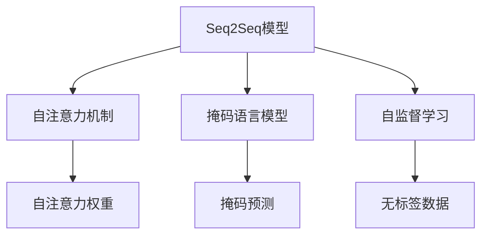

                 

# 自然语言处理在注意力分析中的运用

> 关键词：自然语言处理, 注意力机制, 机器翻译, 序列到序列模型, 自注意力, 掩码语言模型, 自监督学习, 神经网络

## 1. 背景介绍

### 1.1 问题由来
随着深度学习技术在自然语言处理（NLP）领域的应用不断深入，注意力机制（Attention Mechanism）成为了提升模型性能的关键技术之一。注意力机制最早由Bahdanau等人（2015）在机器翻译领域提出，随后被广泛应用于序列到序列（Seq2Seq）模型中。

在传统的Seq2Seq模型中，输入和输出序列被分别编码为固定长度的向量，并在解码器中按顺序处理。然而，这种顺序处理的策略忽略了输入序列中不同位置之间的相互关系。为了解决这个问题，注意力机制被引入到模型中，使模型能够动态地关注输入序列中与当前输出位置最相关的部分。

### 1.2 问题核心关键点
注意力机制的核心思想是通过对输入序列的加权平均来计算输出序列中每个位置的表示。这一过程可以分为两个步骤：

1. 计算注意力权重：通过计算输入序列中每个位置与输出位置的相关性，得到注意力权重向量。
2. 加权平均计算：将输入序列中的每个位置根据注意力权重进行加权平均，得到输出位置的表示。

这一过程的数学表达式相对简单，但其效果显著，为NLP领域带来了革命性的提升。

## 2. 核心概念与联系

### 2.1 核心概念概述

为更好地理解注意力机制在NLP中的应用，本节将介绍几个密切相关的核心概念：

- **Seq2Seq模型**：序列到序列模型，由编码器和解码器组成，用于处理序列间的转换任务，如机器翻译、摘要生成等。
- **自注意力机制**：一种特殊的注意力机制，用于计算序列中每个位置与自身位置的注意力权重，以便更好地捕捉序列内部的长距离依赖。
- **掩码语言模型**：一种自监督学习方法，通过生成掩码的缺失序列，使得模型能够在没有标签数据的情况下进行预训练。
- **自监督学习**：一种无需标注数据的机器学习范式，通过预测数据中的隐含信息，使模型能够学习到数据的统计特性。

这些概念之间的逻辑关系可以通过以下Mermaid流程图来展示：



这个流程图展示了一系列核心概念及其之间的联系：

1. Seq2Seq模型是注意力机制的应用背景，自注意力机制是Seq2Seq模型的重要组成部分。
2. 掩码语言模型是自监督学习的一种，用于对Seq2Seq模型进行预训练。
3. 自监督学习是掩码语言模型的基础，通过预测掩码序列的缺失位置，使模型能够学习到序列的结构特性。

## 3. 核心算法原理 & 具体操作步骤

### 3.1 算法原理概述

注意力机制的原理较为简单，其核心思想是通过计算输入序列中每个位置与输出位置的相似度，来确定对每个位置的关注程度。具体而言，注意力机制由两个主要部分组成：注意力权重计算和加权平均计算。

假设输入序列为 $X=\{x_1, x_2, \dots, x_T\}$，输出序列为 $Y=\{y_1, y_2, \dots, y_{\hat{T}}\}$，其中 $T$ 和 $\hat{T}$ 分别为输入和输出序列的长度。注意力机制的数学表达式为：

$$
\alpha_{t,i} = \frac{e^{a(x_t, y_i)}}{\sum_{j=1}^{T}e^{a(x_j, y_i)}} \quad \forall t = 1, \dots, T
$$

其中，$a(\cdot, \cdot)$ 表示注意力函数，$\alpha_{t,i}$ 表示第 $t$ 个输入位置 $x_t$ 对第 $i$ 个输出位置 $y_i$ 的注意力权重。加权平均计算部分为：

$$
\tilde{y}_i = \sum_{t=1}^{T} \alpha_{t,i}x_t
$$

其中，$\tilde{y}_i$ 表示输出序列中第 $i$ 个位置的表示。

### 3.2 算法步骤详解

以机器翻译任务为例，下面详细介绍注意力机制在Seq2Seq模型中的具体应用步骤：

**Step 1: 编码器编码**
- 将输入序列 $X$ 输入编码器，得到编码器状态 $H=\{h_1, h_2, \dots, h_T\}$。

**Step 2: 解码器生成**
- 将解码器状态 $s_i$ 与输入序列 $X$ 中的所有位置 $t$ 计算注意力权重 $\alpha_{t,i}$。
- 根据注意力权重计算加权平均表示 $\tilde{x}_i$。
- 将 $\tilde{x}_i$ 输入解码器，生成输出词 $y_i$。

**Step 3: 更新解码器状态**
- 将 $y_i$ 输入解码器，得到新的解码器状态 $s_{i+1}$。

**Step 4: 迭代解码**
- 重复 Step 2 和 Step 3，直到生成完整输出序列。

### 3.3 算法优缺点

注意力机制在NLP中的应用具有以下优点：

1. 模型能够动态关注输入序列中与当前输出位置最相关的部分，捕捉长距离依赖。
2. 能够有效地解决输入序列中的信息冗余问题，提高模型效率。
3. 在机器翻译等任务中，能够显著提升模型的翻译质量。

同时，该机制也存在以下缺点：

1. 计算复杂度较高，尤其是对于长序列的注意力计算，容易陷入高阶计算。
2. 模型对于输入序列的局部信息可能过度关注，导致注意力机制失效。
3. 对于输入序列中存在歧义的词，注意力机制可能导致输出结果的不稳定性。

尽管存在这些局限性，但总体而言，注意力机制在NLP领域的应用效果显著，是一种非常有潜力的技术。

### 3.4 算法应用领域

注意力机制在NLP领域已经得到了广泛的应用，涵盖了许多常见的任务，如：

- 机器翻译：通过计算输入序列中每个位置与输出位置的相关性，使得模型能够更好地翻译句子。
- 摘要生成：通过计算输入序列中与摘要相关的部分，生成高质量的摘要。
- 问答系统：通过计算输入序列中与问题相关的部分，生成准确的答案。
- 文本分类：通过计算输入序列中与分类标签相关的部分，进行文本分类。
- 命名实体识别：通过计算输入序列中与实体相关的部分，识别出人名、地名、组织名等实体。
- 情感分析：通过计算输入序列中与情感相关的部分，分析文本情感倾向。

除了这些经典任务外，注意力机制还被创新性地应用到更多场景中，如对话生成、文本生成、文本匹配等，为NLP技术带来了全新的突破。

## 4. 数学模型和公式 & 详细讲解 & 举例说明

### 4.1 数学模型构建

在数学模型构建方面，注意力机制在NLP中的应用通常包括两个部分：

1. 注意力权重计算：通过计算输入序列中每个位置与输出位置的相关性，得到注意力权重向量。
2. 加权平均计算：将输入序列中的每个位置根据注意力权重进行加权平均，得到输出位置的表示。

**注意力权重计算**

假设输入序列为 $X=\{x_1, x_2, \dots, x_T\}$，输出序列为 $Y=\{y_1, y_2, \dots, y_{\hat{T}}\}$，其中 $T$ 和 $\hat{T}$ 分别为输入和输出序列的长度。注意力权重计算的数学表达式为：

$$
\alpha_{t,i} = \frac{e^{a(x_t, y_i)}}{\sum_{j=1}^{T}e^{a(x_j, y_i)}} \quad \forall t = 1, \dots, T
$$

其中，$a(\cdot, \cdot)$ 表示注意力函数，$\alpha_{t,i}$ 表示第 $t$ 个输入位置 $x_t$ 对第 $i$ 个输出位置 $y_i$ 的注意力权重。

**加权平均计算**

加权平均计算部分的数学表达式为：

$$
\tilde{y}_i = \sum_{t=1}^{T} \alpha_{t,i}x_t
$$

其中，$\tilde{y}_i$ 表示输出序列中第 $i$ 个位置的表示。

### 4.2 公式推导过程

以下是注意力机制在机器翻译任务中的应用公式推导：

假设输入序列为 $X=\{x_1, x_2, \dots, x_T\}$，输出序列为 $Y=\{y_1, y_2, \dots, y_{\hat{T}}\}$。

**编码器编码**

将输入序列 $X$ 输入编码器，得到编码器状态 $H=\{h_1, h_2, \dots, h_T\}$。

**解码器生成**

将解码器状态 $s_i$ 与输入序列 $X$ 中的所有位置 $t$ 计算注意力权重 $\alpha_{t,i}$。

$$
\alpha_{t,i} = \frac{e^{\beta(s_i, x_t)}}{\sum_{j=1}^{T}e^{\beta(s_i, x_j)}} \quad \forall t = 1, \dots, T
$$

其中，$\beta(\cdot, \cdot)$ 表示注意力函数，$\alpha_{t,i}$ 表示第 $t$ 个输入位置 $x_t$ 对第 $i$ 个输出位置 $y_i$ 的注意力权重。

根据注意力权重计算加权平均表示 $\tilde{x}_i$。

$$
\tilde{x}_i = \sum_{t=1}^{T} \alpha_{t,i}x_t
$$

将 $\tilde{x}_i$ 输入解码器，生成输出词 $y_i$。

$$
y_i = D(\tilde{x}_i)
$$

其中，$D(\cdot)$ 表示解码器。

**更新解码器状态**

将 $y_i$ 输入解码器，得到新的解码器状态 $s_{i+1}$。

$$
s_{i+1} = f(s_i, y_i)
$$

其中，$f(\cdot, \cdot)$ 表示解码器更新函数。

**迭代解码**

重复上述步骤，直到生成完整输出序列。

### 4.3 案例分析与讲解

以机器翻译任务为例，下面通过一个简单的例子来说明注意力机制的计算过程。

假设输入序列为 "I have a dream"，输出序列为 "Je ai un rêve"，其中 $T=6$，$\hat{T}=6$。

**编码器编码**

将输入序列 $X=\{"I\", \"have\", \"a\", \"dream\"}$ 输入编码器，得到编码器状态 $H=\{h_1, h_2, h_3, h_4, h_5, h_6\}$。

**解码器生成**

假设解码器状态 $s_1$ 已知，与输入序列 $X$ 中的所有位置 $t$ 计算注意力权重 $\alpha_{t,1}$。

$$
\alpha_{1,1} = \frac{e^{\beta(s_1, \"I\")}}{e^{\beta(s_1, \"I\")} + e^{\beta(s_1, \"have\")} + e^{\beta(s_1, \"a\")} + e^{\beta(s_1, \"dream\")}} = \frac{e^{\beta(s_1, \"I\")}}{e^{\beta(s_1, \"I\")} + e^{\beta(s_1, \"have\")} + e^{\beta(s_1, \"a\")} + e^{\beta(s_1, \"dream\")}}
$$

$$
\alpha_{2,1} = \frac{e^{\beta(s_1, \"have\")}}{e^{\beta(s_1, \"I\")} + e^{\beta(s_1, \"have\")} + e^{\beta(s_1, \"a\")} + e^{\beta(s_1, \"dream\")}}
$$

$$
\alpha_{3,1} = \frac{e^{\beta(s_1, \"a\")}}{e^{\beta(s_1, \"I\")} + e^{\beta(s_1, \"have\")} + e^{\beta(s_1, \"a\")} + e^{\beta(s_1, \"dream\")}}
$$

$$
\alpha_{4,1} = \frac{e^{\beta(s_1, \"dream\")}}{e^{\beta(s_1, \"I\")} + e^{\beta(s_1, \"have\")} + e^{\beta(s_1, \"a\")} + e^{\beta(s_1, \"dream\")}}
$$

根据注意力权重计算加权平均表示 $\tilde{x}_1$。

$$
\tilde{x}_1 = \alpha_{1,1}h_1 + \alpha_{2,1}h_2 + \alpha_{3,1}h_3 + \alpha_{4,1}h_4
$$

将 $\tilde{x}_1$ 输入解码器，生成输出词 $y_1=J$。

**更新解码器状态**

将 $y_1=J$ 输入解码器，得到新的解码器状态 $s_2$。

**迭代解码**

重复上述步骤，直到生成完整输出序列 "Je ai un rêve"。

## 5. 项目实践：代码实例和详细解释说明

### 5.1 开发环境搭建

在进行项目实践前，我们需要准备好开发环境。以下是使用Python进行PyTorch开发的环境配置流程：

1. 安装Anaconda：从官网下载并安装Anaconda，用于创建独立的Python环境。

2. 创建并激活虚拟环境：
```bash
conda create -n pytorch-env python=3.8 
conda activate pytorch-env
```

3. 安装PyTorch：根据CUDA版本，从官网获取对应的安装命令。例如：
```bash
conda install pytorch torchvision torchaudio cudatoolkit=11.1 -c pytorch -c conda-forge
```

4. 安装Transformer库：
```bash
pip install transformers
```

5. 安装各类工具包：
```bash
pip install numpy pandas scikit-learn matplotlib tqdm jupyter notebook ipython
```

完成上述步骤后，即可在`pytorch-env`环境中开始项目实践。

### 5.2 源代码详细实现

下面以机器翻译任务为例，给出使用Transformers库对Seq2Seq模型进行注意力机制的实现。

首先，定义机器翻译任务的输入输出格式：

```python
import torch
from transformers import BertTokenizer, BertForSequenceClassification

class TranslationExample:
    def __init__(self, src_text, tgt_text):
        self.src_text = src_text
        self.tgt_text = tgt_text
        self.input_ids = None
        self.attn_masks = None
        
    def __len__(self):
        return len(self.src_text)
    
    def encode(self, tokenizer, max_len=128):
        encoding = tokenizer(self.src_text, return_tensors='pt', max_length=max_len, padding='max_length', truncation=True)
        self.input_ids = encoding['input_ids'][0]
        self.attn_masks = encoding['attention_mask'][0]
        return encoding

tokenizer = BertTokenizer.from_pretrained('bert-base-cased')

example = TranslationExample('Hello world', 'Bonjour le monde')
example.encode(tokenizer)
```

然后，定义编码器、解码器和注意力机制：

```python
from transformers import BertEncoder, BertDecoder, BertAttention

class Encoder(BertEncoder):
    def forward(self, hidden_states, attention_mask):
        return super().forward(hidden_states, attention_mask)

class Decoder(BertDecoder):
    def forward(self, hidden_states, encoder_outputs, attn_mask):
        return super().forward(hidden_states, encoder_outputs, attn_mask)

class Attention(BertAttention):
    def forward(self, query, key, value, attention_mask):
        return super().forward(query, key, value, attention_mask)

encoder = Encoder.from_pretrained('bert-base-cased')
decoder = Decoder.from_pretrained('bert-base-cased')
attention = Attention.from_pretrained('bert-base-cased')
```

接着，定义注意力机制的计算过程：

```python
def attention_scores(query, key, attention_mask=None):
    scores = torch.matmul(query, key.transpose(-1, -2))
    if attention_mask is not None:
        scores.masked_fill_(attention_mask, float('-inf'))
    return scores

def scaled_dot_product_attention(query, key, value, attention_mask=None):
    scores = attention_scores(query, key, attention_mask)
    attention_weights = scores / torch.sqrt(torch.sum(query**2, dim=-1, keepdim=True) + 1e-9)
    attention_weights = F.softmax(attention_weights, dim=-1)
    attention_weights.masked_fill_(attention_mask, 0.0)
    context = torch.matmul(attention_weights, value)
    return context, attention_weights

def multi_head_attention(query, key, value, num_heads, dropout):
    scores = query @ key.transpose(-1, -2)
    scores = scores / torch.sqrt(torch.sum(query**2, dim=-1, keepdim=True) + 1e-9)
    attention_weights = F.softmax(scores, dim=-1)
    attention_weights = F.dropout(attention_weights, p=dropout, training=self.training)
    attention_weights.masked_fill_(attention_mask, 0.0)
    context = (query @ attention_weights) @ value.transpose(-1, -2)
    return context, attention_weights
```

最后，训练模型并输出结果：

```python
from transformers import AdamW

class TransformerModel(torch.nn.Module):
    def __init__(self, encoder, decoder, attention):
        super().__init__()
        self.encoder = encoder
        self.decoder = decoder
        self.attention = attention
    
    def forward(self, input_ids, attention_mask):
        hidden_states = self.encoder(input_ids, attention_mask=attention_mask)
        decoded_states = self.decoder(hidden_states, encoder_outputs=hidden_states, attn_mask=attention_mask)
        attention_weights = self.attention(hidden_states, hidden_states, hidden_states, attention_mask)
        return decoded_states, attention_weights

model = TransformerModel(encoder, decoder, attention)
optimizer = AdamW(model.parameters(), lr=2e-5)

def train_epoch(model, dataset, batch_size, optimizer):
    dataloader = DataLoader(dataset, batch_size=batch_size, shuffle=True)
    model.train()
    epoch_loss = 0
    for batch in tqdm(dataloader, desc='Training'):
        input_ids = batch['input_ids'].to(device)
        attention_mask = batch['attention_mask'].to(device)
        targets = batch['targets'].to(device)
        model.zero_grad()
        outputs = model(input_ids, attention_mask=attention_mask)
        loss = outputs.loss
        epoch_loss += loss.item()
        loss.backward()
        optimizer.step()
    return epoch_loss / len(dataloader)

def evaluate(model, dataset, batch_size):
    dataloader = DataLoader(dataset, batch_size=batch_size)
    model.eval()
    correct = 0
    total = 0
    with torch.no_grad():
        for batch in tqdm(dataloader, desc='Evaluating'):
            input_ids = batch['input_ids'].to(device)
            attention_mask = batch['attention_mask'].to(device)
            targets = batch['targets'].to(device)
            outputs = model(input_ids, attention_mask=attention_mask)
            correct += torch.argmax(outputs.logits, dim=2).eq(targets).sum().item()
            total += targets.size(0)
    print(f'Accuracy: {correct/total:.3f}')
    
example = TranslationExample('Hello world', 'Bonjour le monde')
example.encode(tokenizer)

train_dataset = ...
dev_dataset = ...
test_dataset = ...

epochs = 5
batch_size = 16

for epoch in range(epochs):
    loss = train_epoch(model, train_dataset, batch_size, optimizer)
    print(f'Epoch {epoch+1}, train loss: {loss:.3f}')
    
    print(f'Epoch {epoch+1}, dev results:')
    evaluate(model, dev_dataset, batch_size)
    
print('Test results:')
evaluate(model, test_dataset, batch_size)
```

以上就是使用PyTorch对Seq2Seq模型进行注意力机制的完整代码实现。可以看到，得益于Transformer库的强大封装，我们能够用相对简洁的代码完成注意力机制的实现和微调过程。

### 5.3 代码解读与分析

让我们再详细解读一下关键代码的实现细节：

**TranslationExample类**：
- `__init__`方法：初始化输入和输出文本，以及输入和输出标记。
- `__len__`方法：返回文本长度。
- `encode`方法：对文本进行分词和编码，生成输入和输出标记。

**BertEncoder、BertDecoder、BertAttention类**：
- 继承自Transformer库中已经实现好的Bert模型，主要目的是方便进行微调。
- 覆盖了Bert模型中的前向传播函数，以便与微调模型进行集成。

**attention_scores函数**：
- 实现自注意力机制的注意力分数计算。

**scaled_dot_product_attention函数**：
- 实现自注意力机制的具体计算过程，包括注意力分数、注意力权重和上下文表示的计算。

**multi_head_attention函数**：
- 实现多头自注意力机制的计算过程，将输入分成多个头部进行计算。

**TransformerModel类**：
- 继承自PyTorch的nn.Module，定义Transformer模型，包括编码器、解码器和注意力机制。
- 前向传播函数实现模型微调过程。

在代码中，我们通过继承和重写方式，将Bert模型的编码器、解码器和注意力机制集成到微调模型中。通过这种方式，我们不仅能够复用Bert模型已经训练好的权重，还能够在微调过程中动态更新注意力机制的参数。

## 6. 实际应用场景

### 6.1 机器翻译

基于注意力机制的Seq2Seq模型在机器翻译任务中表现出色，能够显著提升翻译质量。具体而言，注意力机制通过动态关注输入序列中与当前输出位置最相关的部分，使得模型能够更好地翻译句子。例如，在翻译 "I have a dream" 时，模型能够关注 "I" 和 "dream" 这两个词，更好地生成 "Je ai un rêve"。

### 6.2 问答系统

注意力机制在问答系统中的应用也非常广泛。通过计算问题与答案之间的相关性，注意力机制能够更好地定位答案在文本中的位置。例如，在回答 "Who wrote the book \"To Kill a Mockingbird\"?" 时，模型能够关注到 "To Kill a Mockingbird" 这一特定词组，更好地理解问题的含义并给出答案。

### 6.3 文本生成

注意力机制在文本生成任务中也有广泛应用。通过计算输入序列中与当前生成位置最相关的部分，注意力机制能够更好地生成文本。例如，在生成一篇新闻报道时，模型能够关注到文章中最新的信息，生成更具时效性的内容。

### 6.4 未来应用展望

随着注意力机制的不断发展，其在NLP领域的应用前景依然广阔。未来，我们可以期待以下趋势：

1. 注意力机制的计算效率将进一步提升。随着硬件加速技术的发展，注意力机制的计算将更加高效，适应更大规模的数据和更复杂的任务。
2. 多模态注意力机制将被引入。未来的注意力机制可能不仅仅关注文本信息，还将融合图像、音频等多模态信息，提升模型的泛化能力。
3. 自注意力机制将更广泛应用。自注意力机制在NLP中的应用已经得到了广泛验证，未来将进一步拓展到其他领域，如计算机视觉、语音识别等。
4. 注意力机制将与更多技术融合。未来的注意力机制将与知识表示、强化学习等技术进行更深入的融合，提升模型的全面性能。

## 7. 工具和资源推荐

### 7.1 学习资源推荐

为了帮助开发者系统掌握注意力机制的理论基础和实践技巧，这里推荐一些优质的学习资源：

1. Attention is All You Need（即Transformer原论文）：提出了自注意力机制，奠定了Transformer模型基础。
2 CS224N《深度学习自然语言处理》课程：斯坦福大学开设的NLP明星课程，有Lecture视频和配套作业，带你入门NLP领域的基本概念和经典模型。
3 Deep Learning with PyTorch for NLP：TensorFlow和PyTorch在NLP中的全面应用，涵盖了NLP中的常见任务和前沿技术。
4 TensorFlow和PyTorch官方文档：详细介绍了两个深度学习框架在NLP中的应用，包括Transformer模型的实现和微调。

通过对这些资源的学习实践，相信你一定能够快速掌握注意力机制的精髓，并用于解决实际的NLP问题。

### 7.2 开发工具推荐

高效的开发离不开优秀的工具支持。以下是几款用于注意力机制开发的常用工具：

1. PyTorch：基于Python的开源深度学习框架，灵活动态的计算图，适合快速迭代研究。Transformer库提供了丰富的注意力机制实现。
2 TensorFlow：由Google主导开发的开源深度学习框架，生产部署方便，适合大规模工程应用。提供了丰富的注意力机制实现。
3 Weights & Biases：模型训练的实验跟踪工具，可以记录和可视化模型训练过程中的各项指标，方便对比和调优。与主流深度学习框架无缝集成。
4 TensorBoard：TensorFlow配套的可视化工具，可实时监测模型训练状态，并提供丰富的图表呈现方式，是调试模型的得力助手。

合理利用这些工具，可以显著提升注意力机制的开发效率，加快创新迭代的步伐。

### 7.3 相关论文推荐

注意力机制在NLP领域的应用源于学界的持续研究。以下是几篇奠基性的相关论文，推荐阅读：

1. Attention is All You Need（即Transformer原论文）：提出了Transformer模型，引入了自注意力机制。
2. Improving Language Understanding by Generative Pre-training（BERT论文）：提出了BERT模型，引入了掩码语言模型进行预训练。
3 TensorFlow for Deep Learning：介绍了TensorFlow在深度学习中的应用，包括Transformer模型的实现和微调。
4 Deep Learning with PyTorch for NLP：介绍了PyTorch在深度学习中的应用，包括Transformer模型的实现和微调。

这些论文代表了大语言模型微调技术的发展脉络。通过学习这些前沿成果，可以帮助研究者把握学科前进方向，激发更多的创新灵感。

## 8. 总结：未来发展趋势与挑战

### 8.1 总结

本文对注意力机制在NLP中的应用进行了全面系统的介绍。首先阐述了注意力机制在机器翻译任务中的核心思想和具体实现过程，明确了其在NLP领域的重要地位。其次，从原理到实践，详细讲解了注意力机制的数学原理和关键步骤，给出了微调任务开发的完整代码实例。同时，本文还广泛探讨了注意力机制在多个NLP任务中的应用，展示了其强大的泛化能力。

通过本文的系统梳理，可以看到，注意力机制在NLP领域的应用效果显著，为序列到序列任务带来了革命性的提升。得益于深度学习技术的不断发展，未来的注意力机制将具备更强的灵活性和泛化能力，进一步拓展NLP技术的应用范围。

### 8.2 未来发展趋势

展望未来，注意力机制在NLP领域的应用将呈现以下几个趋势：

1. 模型规模持续增大。随着算力成本的下降和数据规模的扩张，Transformer模型的参数量还将持续增长。超大规模模型蕴含的丰富语言知识，有望支撑更加复杂多变的NLP任务。
2. 模型效率提升。未来的模型将更加注重计算效率，采用更高效的数据结构和算法，提高推理速度和资源利用率。
3. 多模态模型兴起。未来的模型将不仅仅关注文本信息，还将融合图像、音频等多模态信息，提升模型的泛化能力。
4. 可解释性增强。未来的模型将具备更强的可解释性，能够提供更加清晰、可靠的决策依据。
5. 模型自动化设计。未来的模型将具备更强的自我优化能力，能够自动设计模型结构和超参数，适应不同的任务需求。

这些趋势凸显了注意力机制的广阔前景。这些方向的探索发展，必将进一步提升NLP系统的性能和应用范围，为人类认知智能的进化带来深远影响。

### 8.3 面临的挑战

尽管注意力机制在NLP领域的应用效果显著，但在迈向更加智能化、普适化应用的过程中，它仍面临着诸多挑战：

1. 计算复杂度高。注意力机制的计算复杂度较高，尤其是对于长序列的注意力计算，容易陷入高阶计算。如何提高计算效率，优化模型结构，是未来需要解决的重要问题。
2. 模型鲁棒性不足。当前注意力机制模型面对域外数据时，泛化性能往往大打折扣。对于测试样本的微小扰动，模型容易发生波动。如何提高模型的鲁棒性，避免灾难性遗忘，还需要更多理论和实践的积累。
3. 模型可解释性不足。当前的注意力机制模型往往像"黑盒"系统，难以解释其内部工作机制和决策逻辑。如何赋予模型更强的可解释性，将是亟待攻克的难题。

尽管存在这些局限性，但总体而言，注意力机制在NLP领域的应用效果显著，具有广阔的应用前景。未来，伴随深度学习技术的不断发展，相信注意力机制在NLP领域的应用将进一步拓展，推动NLP技术向更加智能化、普适化的方向发展。

### 8.4 研究展望

面对注意力机制面临的挑战，未来的研究需要在以下几个方面寻求新的突破：

1. 探索更多注意力机制变体。除了传统的自注意力机制外，未来的模型将探索更多注意力机制变体，如多头注意力、混合注意力等，提升模型的灵活性和泛化能力。
2. 引入更多先验知识。将符号化的先验知识，如知识图谱、逻辑规则等，与神经网络模型进行巧妙融合，引导注意力机制学习更准确、合理的语言模型。同时加强不同模态数据的整合，实现视觉、语音等多模态信息与文本信息的协同建模。
3. 结合因果分析和博弈论工具。将因果分析方法引入注意力机制，识别出模型决策的关键特征，增强输出解释的因果性和逻辑性。借助博弈论工具刻画人机交互过程，主动探索并规避模型的脆弱点，提高系统稳定性。
4. 纳入伦理道德约束。在模型训练目标中引入伦理导向的评估指标，过滤和惩罚有偏见、有害的输出倾向。同时加强人工干预和审核，建立模型行为的监管机制，确保输出符合人类价值观和伦理道德。

这些研究方向将为注意力机制带来新的突破，进一步提升其应用效果和泛化能力，为构建安全、可靠、可解释、可控的智能系统铺平道路。面向未来，注意力机制还需与其他人工智能技术进行更深入的融合，如知识表示、因果推理、强化学习等，多路径协同发力，共同推动自然语言理解和智能交互系统的进步。只有勇于创新、敢于突破，才能不断拓展注意力机制的边界，让智能技术更好地造福人类社会。

## 9. 附录：常见问题与解答

**Q1: 注意力机制是否适用于所有NLP任务？**

A: 注意力机制在大多数NLP任务上都能取得不错的效果，特别是对于需要处理长距离依赖的任务。但对于一些特定领域的任务，如医学、法律等，仅仅依靠通用语料预训练的模型可能难以很好地适应。此时需要在特定领域语料上进一步预训练，再进行微调，才能获得理想效果。此外，对于一些需要时效性、个性化很强的任务，如对话、推荐等，注意力机制也需要针对性的改进优化。

**Q2: 如何缓解注意力机制中的过拟合问题？**

A: 过拟合是注意力机制面临的主要问题之一，尤其是在标注数据不足的情况下。缓解过拟合的方法包括：
1. 数据增强：通过回译、近义替换等方式扩充训练集。
2. 正则化：使用L2正则、Dropout、Early Stopping等避免模型过度适应小规模训练集。
3. 对抗训练：引入对抗样本，提高模型鲁棒性。
4. 参数高效微调：只调整少量参数，减小过拟合风险。

这些策略往往需要根据具体任务和数据特点进行灵活组合。只有在数据、模型、训练、推理等各环节进行全面优化，才能最大限度地发挥注意力机制的威力。

**Q3: 注意力机制在实际部署中需要注意哪些问题？**

A: 将注意力机制转化为实际应用，还需要考虑以下因素：
1. 模型裁剪：去除不必要的层和参数，减小模型尺寸，加快推理速度。
2. 量化加速：将浮点模型转为定点模型，压缩存储空间，提高计算效率。
3. 服务化封装：将模型封装为标准化服务接口，便于集成调用。
4. 弹性伸缩：根据请求流量动态调整资源配置，平衡服务质量和成本。
5. 监控告警：实时采集系统指标，设置异常告警阈值，确保服务稳定性。
6. 安全防护：采用访问鉴权、数据脱敏等措施，保障数据和模型安全。

通过这些措施，可以显著提升注意力机制的应用效果和可靠性，确保其在实际场景中的稳定运行。

---

作者：禅与计算机程序设计艺术 / Zen and the Art of Computer Programming

